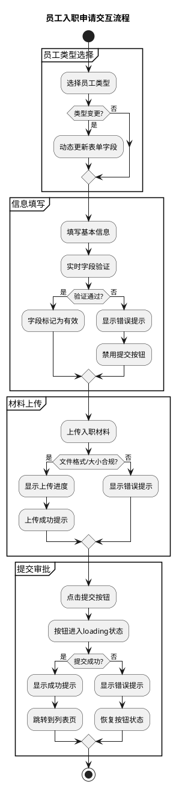

# 示例案例

## 目录

- [案例1：员工入职申请页面](#案例1员工入职申请页面)
- [案例2：订单管理列表页](#案例2订单管理列表页)
- [实际HTML原型](#实际html原型)

---

## 实际HTML原型

以下是基于TDesign + 企业自定义样式生成的完整HTML原型文件：

| 原型文件 | 场景 | 复杂度 | 类型 | 功能亮点 |
|---------|------|--------|------|---------|
| [ba-04-INVEST原则评估表单](examples/ba-04-INVEST原则评估表单-invest-evaluation-form.html) | INVEST评估（ba-04） | 中 | PC端 | 步骤条、统计概览、6维度评分、MoSCoW优先级 |
| [US-015-配置BG级审批规则](examples/US-015-配置BG级审批规则-approval-rule-config.html) | 审批规则配置（US-015） | 高 | PC端 | 规则树导航、6维度条件、审批链可视化、版本管理 |
| [面试官年度H5](templates/h5/interviewer-h5-prototype.html) | 年度数据回顾 | 高 | H5移动端 | 全屏滑动、数据卡片、数字动画、触摸手势、分享海报 |

---

## 案例1：员工入职申请页面

### 输入材料

**用户旅程关键阶段**：
1. 选择员工类型 → 2. 填写基本信息 → 3. 上传入职材料 → 4. 提交审批

**用户故事列表**：
- US-01: 作为HR，我需要选择员工类型（正式/实习/外包），以便系统展示对应的表单字段
- US-02: 作为HR，我需要录入员工基本信息（姓名、身份证、联系方式）
- US-03: 作为HR，我需要上传入职材料（身份证照片、学历证明）
- US-04: 作为HR，我需要提交入职申请并获得审批进度反馈

---

### 任务1输出：设计元素

#### 页面结构分析

| 页面名称 | 主要功能 | 目标用户 | 关联旅程阶段 |
|---------|---------|---------|-------------|
| 入职申请表 | 录入新员工信息并提交审批 | HR | 全流程 |

#### UI组件清单

| 页面 | 组件类型 | 组件名称 | 用途 | 状态说明 | 关联用户故事 |
|------|---------|---------|------|---------|-------------|
| 入职申请表 | 单选按钮组 | employeeTypeRadio | 选择员工类型 | 默认选中"正式"、切换触发表单变化 | US-01 |
| 入职申请表 | 输入框 | employeeNameInput | 输入员工姓名 | focus边框变色、error红色边框 | US-02 |
| 入职申请表 | 输入框 | idCardInput | 输入身份证号 | 实时格式验证、错误提示 | US-02 |
| 入职申请表 | 上传组件 | materialUploader | 上传入职材料 | 拖拽区域、上传进度、删除按钮 | US-03 |
| 入职申请表 | 按钮 | submitBtn | 提交入职申请 | 默认/hover/loading/disabled | US-04 |
| 入职申请表 | 按钮 | resetBtn | 重置表单 | 默认/hover | US-04 |

#### 数据字段定义

| 字段名称 | 数据类型 | 是否必填 | 验证规则 | 默认值 | 说明 |
|---------|---------|---------|---------|-------|------|
| employeeType | Enum | 是 | 正式/实习/外包 | 正式 | 员工类型 |
| employeeName | String | 是 | 2-20个中文字符 | - | 员工姓名 |
| idCard | String | 是 | 18位身份证号格式 | - | 身份证号 |
| phone | String | 是 | 11位手机号格式 | - | 联系电话 |
| materials | File[] | 是 | 图片/PDF，单文件≤5MB | - | 入职材料 |

#### TDesign组件匹配

| 设计元素 | 组件名称 | TDesign组件 | TDesign图标 | 说明 |
|---------|---------|------------|------------|------|
| 员工类型选择 | employeeTypeRadio | `RadioGroup` | - | 切换触发表单变化 |
| 姓名输入 | employeeNameInput | `Input` | `UserIcon` | 实时验证 |
| 身份证输入 | idCardInput | `Input` | `IdCardIcon` | 格式验证 |
| 材料上传 | materialUploader | `Upload` (theme="drag") | `UploadIcon` | 拖拽上传 |
| 提交按钮 | submitBtn | `Button` (theme="primary") | `CheckIcon` | 支持loading |
| 重置按钮 | resetBtn | `Button` (variant="outline") | `RefreshIcon` | 确认对话框 |

#### 页面Layout结构图

```
┌──────────────────────────────────────┐
│           入职申请表                  │
│  ┌────────────────────────────────┐  │
│  │       员工类型选择               │  │
│  │  ┌──────────────────────────┐  │  │
│  │  │   employeeTypeRadio      │  │  │
│  │  │       RadioGroup         │  │  │
│  │  │  [正式] [实习] [外包]     │  │  │
│  │  └──────────────────────────┘  │  │
│  └────────────────────────────────┘  │
│                                      │
│  ┌────────────────────────────────┐  │
│  │         基本信息                │  │
│  │  ┌──────────────────────────┐  │  │
│  │  │  employeeNameInput       │  │  │
│  │  │  Input "员工姓名"         │  │  │
│  │  └──────────────────────────┘  │  │
│  │  ┌──────────────────────────┐  │  │
│  │  │  idCardInput             │  │  │
│  │  │  Input "身份证号"         │  │  │
│  │  └──────────────────────────┘  │  │
│  │  ┌──────────────────────────┐  │  │
│  │  │  phoneInput              │  │  │
│  │  │  Input "联系电话"         │  │  │
│  │  └──────────────────────────┘  │  │
│  └────────────────────────────────┘  │
│                                      │
│  ┌────────────────────────────────┐  │
│  │         材料上传                │  │
│  │  ┌──────────────────────────┐  │  │
│  │  │  materialUploader        │  │  │
│  │  │  Upload (拖拽区域)        │  │  │
│  │  └──────────────────────────┘  │  │
│  └────────────────────────────────┘  │
│                                      │
│  ┌────────────────────────────────┐  │
│  │         操作按钮                │  │
│  │  [resetBtn]      [submitBtn]   │  │
│  │   Button          Button       │  │
│  └────────────────────────────────┘  │
└──────────────────────────────────────┘
```

---

### 任务2输出：交互设计

#### PlantUML活动图



#### 关键交互点说明

| 页面 | 交互元素 | 触发动作 | 响应效果 | 目标状态/跳转 | 防抖/节流 |
|------|---------|---------|---------|-------------|----------|
| 入职申请表 | employeeTypeRadio | 点击 | 切换表单字段显示 | 表单重置 | 无 |
| 入职申请表 | idCardInput | 输入 | 实时格式验证 | 显示验证结果 | 200ms |
| 入职申请表 | materialUploader | 拖拽/点击 | 触发文件选择 | 上传进度显示 | 无 |
| 入职申请表 | submitBtn | 点击 | 表单验证→提交 | loading→成功/失败 | 300ms |

#### 交互反馈设计

| 场景 | 反馈类型 | 提示文案 | 视觉样式 | 显示位置 | 持续时间 | 关闭方式 |
|------|---------|---------|---------|---------|---------|---------|
| 提交成功 | 成功提示 | "✅ 入职申请已提交，等待审批" | 绿色#2BA471 | 顶部居中 | 3秒 | 自动消失 |
| 字段验证失败 | 错误提示 | "⚠️ 身份证号格式不正确" | 红色边框#D54941 | 字段下方 | - | 修正后消失 |
| 文件过大 | 错误提示 | "❌ 文件大小超过5MB限制" | 红色#D54941 | 上传区域 | 5秒 | 手动关闭 |
| 确认重置 | 确认对话框 | "确定要重置表单吗？已填写内容将丢失" | 模态对话框 | 页面居中 | - | 用户点击 |

---

### 任务3输出：HTML原型（关键片段）

```html
<!-- 员工类型选择区域 -->
<div class="section">
    <h3 class="section-title">员工类型</h3>
    <div class="radio-group">
        <label class="radio-item">
            <input type="radio" name="employeeType" value="regular" checked>
            <span>正式员工</span>
        </label>
        <label class="radio-item">
            <input type="radio" name="employeeType" value="intern">
            <span>实习生</span>
        </label>
        <label class="radio-item">
            <input type="radio" name="employeeType" value="outsource">
            <span>外包员工</span>
        </label>
    </div>
</div>

<!-- 基本信息区域 -->
<div class="section">
    <h3 class="section-title">基本信息</h3>
    <div class="form-item">
        <label class="form-label required">员工姓名</label>
        <input type="text" class="form-input" id="employeeName" 
               placeholder="请输入员工姓名" maxlength="20">
        <span class="error-tip" id="employeeNameError"></span>
    </div>
    <div class="form-item">
        <label class="form-label required">身份证号</label>
        <input type="text" class="form-input" id="idCard" 
               placeholder="请输入18位身份证号" maxlength="18">
        <span class="error-tip" id="idCardError"></span>
    </div>
</div>

<!-- 操作按钮区域 -->
<div class="action-bar">
    <button class="btn btn-default" id="resetBtn">重置</button>
    <button class="btn btn-primary" id="submitBtn">
        <span class="btn-text">提交申请</span>
        <span class="btn-loading" style="display:none;">提交中...</span>
    </button>
</div>
```

---

## 案例2：订单管理列表页

### 输入材料

**用户旅程关键阶段**：
1. 查看订单列表 → 2. 筛选/搜索订单 → 3. 查看订单详情 → 4. 执行订单操作

**用户故事列表**：
- US-01: 作为运营，我需要查看所有订单列表，以便掌握订单整体情况
- US-02: 作为运营，我需要按状态/时间筛选订单，以便快速定位目标订单
- US-03: 作为运营，我需要搜索订单号/客户名，以便精确查找订单
- US-04: 作为运营，我需要批量操作订单（导出/标记），以便提高工作效率

---

### 任务1输出：设计元素

#### 页面结构分析

| 页面名称 | 主要功能 | 目标用户 | 关联旅程阶段 |
|---------|---------|---------|-------------|
| 订单列表页 | 展示、筛选、搜索、操作订单 | 运营人员 | 全流程 |
| 订单详情弹窗 | 展示订单完整信息 | 运营人员 | 查看订单详情 |

#### UI组件清单

| 页面 | 组件类型 | 组件名称 | 用途 | 状态说明 | 关联用户故事 |
|------|---------|---------|------|---------|-------------|
| 订单列表页 | 搜索框 | orderSearchBox | 搜索订单号/客户名 | focus边框变色、loading搜索中 | US-03 |
| 订单列表页 | 下拉选择 | statusFilter | 按状态筛选 | 展开/收起、选中高亮 | US-02 |
| 订单列表页 | 日期选择器 | dateRangePicker | 按时间范围筛选 | 日历弹出、范围选择 | US-02 |
| 订单列表页 | 数据表格 | orderTable | 展示订单列表 | 排序、分页、行hover | US-01 |
| 订单列表页 | 复选框 | batchCheckbox | 批量选择订单 | 全选/部分选/未选 | US-04 |
| 订单列表页 | 按钮 | exportBtn | 导出订单 | 默认/hover/loading | US-04 |

#### 数据字段定义

| 字段名称 | 数据类型 | 是否必填 | 验证规则 | 默认值 | 说明 |
|---------|---------|---------|---------|-------|------|
| keyword | String | 否 | 最长50字符 | - | 搜索关键词 |
| status | Enum | 否 | 待支付/已支付/已发货/已完成/已取消 | 全部 | 订单状态 |
| dateRange | Date[] | 否 | 开始日期≤结束日期 | 最近7天 | 时间范围 |
| pageNum | Number | 是 | ≥1 | 1 | 当前页码 |
| pageSize | Number | 是 | 10/20/50 | 20 | 每页条数 |

#### TDesign组件匹配

| 设计元素 | 组件名称 | TDesign组件 | TDesign图标 | 说明 |
|---------|---------|------------|------------|------|
| 搜索框 | orderSearchBox | `Input` (prefixIcon) | `SearchIcon` | 防抖300ms |
| 状态筛选 | statusFilter | `Select` | - | 下拉选择 |
| 日期范围 | dateRangePicker | `DateRangePicker` | `CalendarIcon` | 范围选择 |
| 数据表格 | orderTable | `Table` | - | 排序、分页 |
| 批量选择 | batchCheckbox | `Checkbox` | - | 全选/部分选 |
| 导出按钮 | exportBtn | `Button` (theme="primary") | `DownloadIcon` | 支持loading |
| 分页 | pagination | `Pagination` | - | 页码切换 |

#### 页面Layout结构图

```
┌──────────────────────────────────────┐
│           订单列表页                  │
│  ┌────────────────────────────────┐  │
│  │          筛选区域               │  │
│  │  ┌─────────┬─────────┬───────┐ │  │
│  │  │搜索框   │状态筛选  │日期范围│ │  │
│  │  │ Input   │ Select  │DatePkr│ │  │
│  │  └─────────┴─────────┴───────┘ │  │
│  └────────────────────────────────┘  │
│                                      │
│  ┌────────────────────────────────┐  │
│  │      批量操作栏（条件显示）      │  │
│  │  已选择 N 项  [导出] [取消选择] │  │
│  └────────────────────────────────┘  │
│                                      │
│  ┌────────────────────────────────┐  │
│  │          数据表格               │  │
│  │  ┌──────────────────────────┐  │  │
│  │  │ orderTable - Table       │  │  │
│  │  │ [□] 订单号 客户 金额 状态 │  │  │
│  │  │ [□] xxx    xxx  xxx  xxx │  │  │
│  │  │ [□] xxx    xxx  xxx  xxx │  │  │
│  │  └──────────────────────────┘  │  │
│  └────────────────────────────────┘  │
│                                      │
│  ┌────────────────────────────────┐  │
│  │          分页组件               │  │
│  │  [<] 第 1/10 页 [>]  每页20条  │  │
│  │        Pagination              │  │
│  └────────────────────────────────┘  │
└──────────────────────────────────────┘
```

---

### 任务2输出：交互设计

#### 关键交互点说明

| 页面 | 交互元素 | 触发动作 | 响应效果 | 目标状态/跳转 | 防抖/节流 |
|------|---------|---------|---------|-------------|----------|
| 订单列表页 | orderSearchBox | 输入 | 实时搜索订单 | 列表刷新 | 300ms |
| 订单列表页 | statusFilter | 选择 | 按状态筛选 | 列表刷新 | 无 |
| 订单列表页 | orderTable行 | 点击 | 打开订单详情 | 弹窗显示 | 无 |
| 订单列表页 | batchCheckbox | 点击 | 切换选中状态 | 更新选中计数 | 无 |
| 订单列表页 | exportBtn | 点击 | 导出选中订单 | loading→下载文件 | 300ms |

#### 状态流转定义

| 当前状态 | 触发事件 | 目标状态 | 附带动作 |
|---------|---------|---------|---------|
| 列表初始 | 页面加载 | 数据加载中 | 显示骨架屏 |
| 数据加载中 | 请求成功 | 列表展示 | 渲染表格数据 |
| 列表展示 | 输入搜索词 | 搜索中 | 显示搜索loading |
| 列表展示 | 勾选订单 | 已选中N项 | 显示批量操作栏 |
| 已选中N项 | 点击导出 | 导出中 | 按钮loading |

---

### 任务3输出：HTML原型（关键片段）

```html
<!-- 筛选区域 -->
<div class="filter-bar">
    <div class="search-box">
        <input type="text" class="search-input" id="orderSearch" 
               placeholder="搜索订单号/客户名">
        <span class="search-icon">🔍</span>
    </div>
    <select class="filter-select" id="statusFilter">
        <option value="">全部状态</option>
        <option value="pending">待支付</option>
        <option value="paid">已支付</option>
        <option value="shipped">已发货</option>
        <option value="completed">已完成</option>
    </select>
    <div class="date-picker" id="dateRangePicker">
        <input type="date" id="startDate">
        <span>至</span>
        <input type="date" id="endDate">
    </div>
</div>

<!-- 批量操作栏 -->
<div class="batch-bar" id="batchBar" style="display:none;">
    <span>已选择 <strong id="selectedCount">0</strong> 项</span>
    <button class="btn btn-primary btn-sm" id="exportBtn">导出选中</button>
    <button class="btn btn-default btn-sm" id="cancelSelectBtn">取消选择</button>
</div>

<!-- 数据表格 -->
<table class="data-table" id="orderTable">
    <thead>
        <tr>
            <th><input type="checkbox" id="selectAll"></th>
            <th>订单号</th>
            <th>客户名称</th>
            <th>订单金额</th>
            <th>状态</th>
            <th>创建时间</th>
            <th>操作</th>
        </tr>
    </thead>
    <tbody id="orderTableBody">
        <!-- 动态渲染订单行 -->
    </tbody>
</table>

<!-- 分页组件 -->
<div class="pagination">
    <button class="page-btn" id="prevPage">上一页</button>
    <span class="page-info">第 <span id="currentPage">1</span> 页</span>
    <button class="page-btn" id="nextPage">下一页</button>
</div>
```
