# 面试官年度H5 - 交互设计与流程定义

## 文档信息

- **来源文档**: design-element.md
- **创建日期**: 2025-12-16
- **前置依赖**: 任务1设计元素分析

---

## 第1章：PlantUML活动图代码

```plantuml
@startuml
title 面试官年度H5交互流程

start

partition 用户鉴权 {
  :用户访问H5页面;
  :系统获取用户身份信息;
  
  if (是否为集团正式员工?) then (是)
    :查询面试官维度表;
    if (是否为面试官?) then (是)
      if (是否有面试数据?) then (是)
        :权限状态 = 有数据;
      else (否)
        :权限状态 = 无数据;
      endif
    else (否)
      :权限状态 = 非面试官;
      :展示无权限提示页;
      stop
    endif
  else (否)
    :展示无权限提示页;
    stop
  endif
}

partition 封面页展示 {
  :展示活动封面;
  :播放入场动画;
  :用户点击"开始"按钮;
}

partition 个人欢迎页 {
  :加载面试官基本信息;
  :展示面试官姓名;
  :展示担任面试官时长;
  note right: BR5格式化规则
  :用户滑动/点击下一页;
}

partition 历史累计统计页 {
  :加载历史统计数据;
  
  if (E1条件：面试人数或时长为0?) then (是)
    :展示E1低数据版本;
  else (否)
    :展示累计面试场次;
    :展示累计面试时长（小时）;
    note right: BR7单位转换
  endif
  
  if (E2条件：单日最多面试为0?) then (是)
    :展示E2低数据版本;
  else (否)
    :展示单日最大面试量;
    :展示对应日期;
  endif
  
  :用户滑动/点击下一页;
}

partition 入职贡献页 {
  :加载入职数据;
  
  if (E3条件：总入职人数为0?) then (是)
    :展示E3低数据版本;
  else (否)
    :展示总入职人数;
    :展示入职人最长年限;
    note right: BR6格式化规则
  endif
  
  :用户滑动/点击下一页;
}

partition 2025年统计页 {
  :加载2025年统计数据;
  
  if (E4条件：2025年面试总人数为0?) then (是)
    :展示E4低数据版本;
  else (否)
    :展示2025年面试场次;
    :展示社招/校招分类;
    :展示2025年面试时长;
    :展示2025年面评字数;
  endif
  
  :用户滑动/点击下一页;
}

partition 好评词条页 {
  :加载好评词条数据;
  
  if (E5条件：无好评词条或点赞数为0?) then (是)
    :展示E5低数据版本;
  else (否)
    :展示好评词条TOP1;
    :展示词条出现次数;
    :展示问卷点赞数;
  endif
  
  :用户滑动/点击下一页;
}

partition 个人总结页 {
  :加载集团汇总数据;
  :展示集团面试官人数;
  :展示集团总面试时长;
  note right: BR7单位转换
  :展示集团总面评字数;
  note right: BR8单位转换
  
  :计算TAG标签;
  :展示TAG1年限标签;
  if (2025年面试≥30场?) then (是)
    :展示TAG2多面能手;
  endif
  if (入职人数≥8人?) then (是)
    :展示TAG3人才发现官;
  endif
  if (问卷点赞≥10次?) then (是)
    :展示TAG4好评如潮;
  endif
  
  :用户滑动/点击下一页;
}

partition 分享海报页 {
  :生成个性化海报;
  
  if (用户点击保存?) then (是)
    :保存海报到相册;
    :显示保存成功提示;
  endif
  
  if (用户点击分享?) then (是)
    :调用分享接口;
    :显示分享成功提示;
  endif
}

stop
@enduml
```

---

## 第2章：关键交互点说明

### 2.1 封面页交互

| 页面 | 交互元素 | 触发动作 | 响应效果 | 目标状态/跳转 | 防抖/节流 |
|------|---------|---------|---------|-------------|----------|
| 封面页 | startBtn | 点击 | 按钮发光动画→加载数据 | loading→跳转个人欢迎页 | 300ms |
| 封面页 | coverBackground | 页面加载 | 背景渐入动画 | 动画完成 | 无 |
| 封面页 | activityTitle | 页面加载 | 标题文字逐字显现 | 动画完成 | 无 |

### 2.2 个人欢迎页交互

| 页面 | 交互元素 | 触发动作 | 响应效果 | 目标状态/跳转 | 防抖/节流 |
|------|---------|---------|---------|-------------|----------|
| 个人欢迎页 | interviewerName | 页面进入 | 文字淡入动画 | 动画完成 | 无 |
| 个人欢迎页 | durationCard | 页面进入 | 数字滚动动画 | 数字显示完成 | 无 |
| 个人欢迎页 | nextPageBtn | 点击/滑动 | 页面切换动画 | 跳转历史统计页 | 300ms |

### 2.3 历史累计统计页交互

| 页面 | 交互元素 | 触发动作 | 响应效果 | 目标状态/跳转 | 防抖/节流 |
|------|---------|---------|---------|-------------|----------|
| 历史统计页 | totalInterviewsCard | 页面进入 | 数字滚动动画 | 数字显示完成 | 无 |
| 历史统计页 | totalDurationCard | 页面进入 | 数字滚动动画 | 数字显示完成 | 无 |
| 历史统计页 | maxDailyCard | 页面进入 | 高亮卡片动画 | 动画完成 | 无 |
| 历史统计页 | lowDataE1Tip | 条件触发 | 显示低数据提示 | 静态展示 | 无 |
| 历史统计页 | lowDataE2Tip | 条件触发 | 显示低数据提示 | 静态展示 | 无 |
| 历史统计页 | nextPageBtn | 点击/滑动 | 页面切换动画 | 跳转入职贡献页 | 300ms |
| 历史统计页 | prevPageBtn | 点击/滑动 | 页面切换动画 | 返回个人欢迎页 | 300ms |

### 2.4 入职贡献页交互

| 页面 | 交互元素 | 触发动作 | 响应效果 | 目标状态/跳转 | 防抖/节流 |
|------|---------|---------|---------|-------------|----------|
| 入职贡献页 | totalHiredCard | 页面进入 | 数字滚动动画 | 数字显示完成 | 无 |
| 入职贡献页 | longestTenureCard | 页面进入 | 数字滚动动画 | 数字显示完成 | 无 |
| 入职贡献页 | lowDataE3Tip | 条件触发 | 显示低数据提示 | 静态展示 | 无 |
| 入职贡献页 | nextPageBtn | 点击/滑动 | 页面切换动画 | 跳转2025统计页 | 300ms |

### 2.5 2025年统计页交互

| 页面 | 交互元素 | 触发动作 | 响应效果 | 目标状态/跳转 | 防抖/节流 |
|------|---------|---------|---------|-------------|----------|
| 2025统计页 | interviews2025Card | 页面进入 | 数字滚动动画 | 数字显示完成 | 无 |
| 2025统计页 | duration2025Card | 页面进入 | 数字滚动动画 | 数字显示完成 | 无 |
| 2025统计页 | words2025Card | 页面进入 | 数字滚动动画 | 数字显示完成 | 无 |
| 2025统计页 | lowDataE4Tip | 条件触发 | 显示低数据提示 | 静态展示 | 无 |
| 2025统计页 | nextPageBtn | 点击/滑动 | 页面切换动画 | 跳转好评词条页 | 300ms |

### 2.6 好评词条页交互

| 页面 | 交互元素 | 触发动作 | 响应效果 | 目标状态/跳转 | 防抖/节流 |
|------|---------|---------|---------|-------------|----------|
| 好评词条页 | praiseContentCard | 页面进入 | 文字淡入动画 | 动画完成 | 无 |
| 好评词条页 | praiseCountCard | 页面进入 | 数字滚动动画 | 数字显示完成 | 无 |
| 好评词条页 | likeCountCard | 页面进入 | 数字滚动动画 | 数字显示完成 | 无 |
| 好评词条页 | lowDataE5Tip | 条件触发 | 显示低数据提示 | 静态展示 | 无 |
| 好评词条页 | nextPageBtn | 点击/滑动 | 页面切换动画 | 跳转个人总结页 | 300ms |

### 2.7 个人总结页交互

| 页面 | 交互元素 | 触发动作 | 响应效果 | 目标状态/跳转 | 防抖/节流 |
|------|---------|---------|---------|-------------|----------|
| 个人总结页 | companyInterviewersCard | 页面进入 | 数字滚动动画 | 数字显示完成 | 无 |
| 个人总结页 | companyDurationCard | 页面进入 | 数字滚动动画 | 数字显示完成 | 无 |
| 个人总结页 | companyWordsCard | 页面进入 | 数字滚动动画 | 数字显示完成 | 无 |
| 个人总结页 | tagGroup | 页面进入 | TAG标签依次弹出 | 动画完成 | 无 |
| 个人总结页 | nextPageBtn | 点击/滑动 | 页面切换动画 | 跳转分享海报页 | 300ms |

### 2.8 分享海报页交互

| 页面 | 交互元素 | 触发动作 | 响应效果 | 目标状态/跳转 | 防抖/节流 |
|------|---------|---------|---------|-------------|----------|
| 分享海报页 | posterCanvas | 页面进入 | 海报渲染动画 | 海报生成完成 | 无 |
| 分享海报页 | saveBtn | 点击 | 保存海报到相册 | loading→成功/失败提示 | 300ms |
| 分享海报页 | shareBtn | 点击 | 调用分享接口 | loading→分享面板 | 300ms |

### 2.9 无权限提示页交互

| 页面 | 交互元素 | 触发动作 | 响应效果 | 目标状态/跳转 | 防抖/节流 |
|------|---------|---------|---------|-------------|----------|
| 无权限页 | noAccessIcon | 页面进入 | 图标淡入动画 | 动画完成 | 无 |
| 无权限页 | noAccessText | 页面进入 | 文字淡入动画 | 动画完成 | 无 |

---

## 第3章：交互反馈设计

### 3.1 成功反馈

| 场景 | 反馈类型 | 提示文案 | 视觉样式 | 显示位置 | 持续时间 | 关闭方式 |
|------|---------|---------|---------|---------|---------|---------|
| 海报保存成功 | 成功提示 | "✅ 海报已保存到相册" | 绿色#2BA471 | 顶部居中 | 2秒 | 自动消失 |
| 分享成功 | 成功提示 | "✅ 分享成功" | 绿色#2BA471 | 顶部居中 | 2秒 | 自动消失 |
| 数据加载成功 | 无提示 | - | - | - | - | - |

### 3.2 错误反馈

| 场景 | 反馈类型 | 提示文案 | 视觉样式 | 显示位置 | 持续时间 | 关闭方式 |
|------|---------|---------|---------|---------|---------|---------|
| 海报保存失败 | 错误提示 | "❌ 保存失败，请重试" | 红色#D54941 | 顶部居中 | 5秒 | 手动关闭 |
| 分享失败 | 错误提示 | "❌ 分享失败，请重试" | 红色#D54941 | 顶部居中 | 5秒 | 手动关闭 |
| 数据加载失败 | 错误提示 | "❌ 数据加载失败，请刷新页面" | 红色#D54941 | 页面居中 | - | 点击重试 |
| 网络异常 | 错误提示 | "❌ 网络异常，请检查网络连接" | 红色#D54941 | 页面居中 | - | 点击重试 |

### 3.3 加载状态

| 场景 | 反馈类型 | 提示文案 | 视觉样式 | 显示位置 | 持续时间 | 关闭方式 |
|------|---------|---------|---------|---------|---------|---------|
| 页面初始加载 | 加载动画 | "正在加载..." | 蓝色#125FFF loading | 页面居中 | - | 加载完成 |
| 保存海报中 | 按钮loading | "保存中..." | 按钮内spinner | 按钮内部 | - | 操作完成 |
| 分享中 | 按钮loading | "分享中..." | 按钮内spinner | 按钮内部 | - | 操作完成 |
| 数字滚动 | 数字动画 | - | 数字递增动画 | 数据卡片内 | 1秒 | 动画完成 |

### 3.4 低数据版本提示

| 场景 | 反馈类型 | 提示文案 | 视觉样式 | 显示位置 | 持续时间 | 关闭方式 |
|------|---------|---------|---------|---------|---------|---------|
| E1低数据 | 友好提示 | "暂无面试数据，期待您未来的贡献" | 灰色#999 | 卡片区域 | - | 静态展示 |
| E2低数据 | 友好提示 | "暂无单日面试记录" | 灰色#999 | 卡片区域 | - | 静态展示 |
| E3低数据 | 友好提示 | "暂无入职数据，期待您发现更多人才" | 灰色#999 | 卡片区域 | - | 静态展示 |
| E4低数据 | 友好提示 | "2025年暂无面试数据" | 灰色#999 | 卡片区域 | - | 静态展示 |
| E5低数据 | 友好提示 | "暂无好评词条，期待候选人的认可" | 灰色#999 | 卡片区域 | - | 静态展示 |

---

## 第4章：状态流转定义

### 4.1 页面状态流转

| 当前状态 | 触发事件 | 目标状态 | 附带动作 |
|---------|---------|---------|---------|
| 初始加载 | 页面打开 | 鉴权中 | 显示loading动画 |
| 鉴权中 | 鉴权成功（有数据） | 封面页展示 | 隐藏loading，播放入场动画 |
| 鉴权中 | 鉴权成功（无数据） | 无权限页 | 显示无权限提示 |
| 鉴权中 | 鉴权失败 | 错误页 | 显示错误提示 |
| 封面页展示 | 点击开始按钮 | 数据加载中 | 按钮loading |
| 数据加载中 | 加载成功 | 个人欢迎页 | 页面切换动画 |
| 数据加载中 | 加载失败 | 错误提示 | 显示重试按钮 |
| 个人欢迎页 | 点击/滑动下一页 | 历史统计页 | 页面切换动画 |
| 历史统计页 | 点击/滑动下一页 | 入职贡献页 | 页面切换动画 |
| 入职贡献页 | 点击/滑动下一页 | 2025统计页 | 页面切换动画 |
| 2025统计页 | 点击/滑动下一页 | 好评词条页 | 页面切换动画 |
| 好评词条页 | 点击/滑动下一页 | 个人总结页 | 页面切换动画 |
| 个人总结页 | 点击/滑动下一页 | 分享海报页 | 页面切换动画 |

### 4.2 按钮状态流转

| 当前状态 | 触发事件 | 目标状态 | 附带动作 |
|---------|---------|---------|---------|
| 默认状态 | 鼠标悬停 | hover状态 | 按钮发光效果 |
| hover状态 | 鼠标移出 | 默认状态 | 恢复默认样式 |
| hover状态 | 点击 | active状态 | 按钮按下效果 |
| active状态 | 释放 | loading状态 | 显示loading动画 |
| loading状态 | 操作成功 | 默认状态 | 显示成功提示 |
| loading状态 | 操作失败 | 默认状态 | 显示错误提示 |

### 4.3 数据卡片状态流转

| 当前状态 | 触发事件 | 目标状态 | 附带动作 |
|---------|---------|---------|---------|
| 隐藏状态 | 页面进入视口 | 动画播放中 | 启动入场动画 |
| 动画播放中 | 动画完成 | 展示状态 | 数字滚动到目标值 |
| 展示状态 | 页面离开视口 | 保持状态 | 保持当前数值 |

### 4.4 低数据版本状态流转

| 当前状态 | 触发事件 | 目标状态 | 附带动作 |
|---------|---------|---------|---------|
| 数据加载中 | E1条件触发 | E1低数据版本 | 隐藏正常数据卡片，显示低数据提示 |
| 数据加载中 | E2条件触发 | E2低数据版本 | 隐藏单日最大面试卡片，显示低数据提示 |
| 数据加载中 | E3条件触发 | E3低数据版本 | 隐藏入职数据卡片，显示低数据提示 |
| 数据加载中 | E4条件触发 | E4低数据版本 | 隐藏2025年数据卡片，显示低数据提示 |
| 数据加载中 | E5条件触发 | E5低数据版本 | 隐藏好评词条卡片，显示低数据提示 |

---

## 第5章：动画规范

### 5.1 页面切换动画

| 动画名称 | 动画类型 | 时长 | 缓动函数 | 说明 |
|---------|---------|------|---------|------|
| slideInRight | 滑入 | 300ms | ease-out | 下一页从右侧滑入 |
| slideOutLeft | 滑出 | 300ms | ease-in | 当前页向左滑出 |
| slideInLeft | 滑入 | 300ms | ease-out | 上一页从左侧滑入 |
| slideOutRight | 滑出 | 300ms | ease-in | 当前页向右滑出 |

### 5.2 元素入场动画

| 动画名称 | 动画类型 | 时长 | 缓动函数 | 说明 |
|---------|---------|------|---------|------|
| fadeIn | 淡入 | 500ms | ease | 元素透明度0→1 |
| slideUp | 上滑淡入 | 500ms | ease-out | 元素从下方滑入并淡入 |
| scaleIn | 缩放淡入 | 300ms | ease-out | 元素从0.8缩放到1并淡入 |
| countUp | 数字滚动 | 1000ms | ease-out | 数字从0滚动到目标值 |

### 5.3 TAG标签动画

| 动画名称 | 动画类型 | 时长 | 缓动函数 | 说明 |
|---------|---------|------|---------|------|
| tagBounceIn | 弹入 | 400ms | cubic-bezier(0.68, -0.55, 0.265, 1.55) | TAG标签弹性入场 |
| tagDelay | 延迟 | 100ms | - | 多个TAG依次入场的间隔 |

---

## 第6章：手势交互规范

### 6.1 滑动手势

| 手势 | 触发条件 | 响应动作 | 说明 |
|------|---------|---------|------|
| 左滑 | 滑动距离>50px | 切换到下一页 | 手指从右向左滑动 |
| 右滑 | 滑动距离>50px | 切换到上一页 | 手指从左向右滑动 |
| 上滑 | 滑动距离>50px | 切换到下一页（备选） | 手指从下向上滑动 |
| 下滑 | 滑动距离>50px | 切换到上一页（备选） | 手指从上向下滑动 |

### 6.2 边界处理

| 场景 | 处理方式 | 说明 |
|------|---------|------|
| 第一页右滑 | 弹性回弹 | 显示已到第一页提示 |
| 最后一页左滑 | 弹性回弹 | 显示已到最后一页提示 |
| 滑动距离不足 | 回弹到原位 | 滑动距离<50px时回弹 |

---

## 第7章：防重复提交机制

### 7.1 按钮防重复

| 按钮 | 防抖时间 | 处理方式 |
|------|---------|---------|
| startBtn | 300ms | 点击后立即disabled，loading状态 |
| saveBtn | 300ms | 点击后立即disabled，loading状态 |
| shareBtn | 300ms | 点击后立即disabled，loading状态 |
| nextPageBtn | 300ms | 页面切换动画期间disabled |
| prevPageBtn | 300ms | 页面切换动画期间disabled |

### 7.2 请求防重复

| 请求类型 | 处理方式 | 说明 |
|---------|---------|------|
| 数据加载 | 单例模式 | 同一接口同时只允许一个请求 |
| 保存海报 | 按钮disabled | 请求完成前禁止再次点击 |
| 分享操作 | 按钮disabled | 请求完成前禁止再次点击 |

---

## 第8章：性能优化建议

### 8.1 资源加载

| 优化项 | 处理方式 | 说明 |
|--------|---------|------|
| 图片懒加载 | Intersection Observer | 页面进入视口时加载图片 |
| 数据预加载 | 封面页预加载 | 用户点击开始前预加载数据 |
| 动画优化 | GPU加速 | 使用transform和opacity触发GPU加速 |

### 8.2 缓存策略

| 缓存项 | 缓存时间 | 说明 |
|--------|---------|------|
| 面试官数据 | 活动期间 | 数据为静态快照，不更新 |
| 集团汇总数据 | 24小时 | 全局共享数据 |
| 静态资源 | 长期缓存 | CSS/JS/图片使用hash命名 |

---

## 完成检查清单

- [x] PlantUML代码是否可以正常渲染？
- [x] 页面交互流程是否完整（正常+异常）？
- [x] 是否说明了所有关键交互点（包含防抖设置）？
- [x] 是否设计了完整的反馈机制？
- [x] 是否定义了状态流转逻辑？
- [x] 是否包含动画规范和手势交互？
- [x] 是否包含防重复提交机制？
