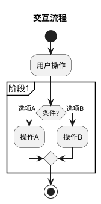

# 任务2：交互设计与流程定义

设计页面交互流程、状态流转和用户反馈机制，为原型开发提供交互规范。

**前置依赖**: 需要先完成任务1的设计元素分析

## 输入材料

```
【设计元素（来自任务1的输出）】
{粘贴任务1的完整输出，包括：页面结构分析、UI组件清单、数据字段定义}
```

## 核心输出

### 第1章：PlantUML活动图代码

描述完整的页面交互流程：
- 使用partition划分功能阶段
- 包含用户操作决策点（if-else）
- 包含异常处理流程



### 第2章：关键交互点说明

| 页面 | 交互元素 | 触发动作 | 响应效果 | 目标状态/跳转 | 防抖/节流 |
|------|---------|---------|---------|-------------|----------|
| {页面} | {组件名} | 点击/输入/悬停 | {响应描述} | {目标状态} | 200ms/无 |

### 第3章：交互反馈设计

| 场景 | 反馈类型 | 提示文案 | 视觉样式 | 显示位置 | 持续时间 | 关闭方式 |
|------|---------|---------|---------|---------|---------|---------|
| 操作成功 | 成功提示 | "✅ 操作成功" | 绿色#2BA471 | 顶部居中 | 2秒 | 自动消失 |
| 操作失败 | 错误提示 | "❌ 操作失败" | 红色#D54941 | 顶部居中 | 5秒 | 手动关闭 |
| 需确认 | 确认对话框 | "{确认内容}" | 模态对话框 | 页面居中 | - | 用户点击 |
| 加载中 | 加载状态 | "正在处理..." | 蓝色loading | 按钮内部 | - | 请求完成 |

### 第4章：状态流转定义

| 当前状态 | 触发事件 | 目标状态 | 附带动作 |
|---------|---------|---------|---------|
| 初始状态 | 用户操作 | 新状态 | 执行的动作 |

## 交互规范

### 防抖/节流设置
- 输入框防抖：200ms
- 按钮防抖：300ms
- 滚动节流：100ms

### 加载超时设置
- API请求：10秒超时
- 文件上传：30秒超时

### 动画时长设置
- 过渡动画：200-300ms
- 弹出动画：200ms
- 消失动画：150ms

### 反馈规范
- 成功反馈：绿色#2BA471，2-3秒自动消失
- 错误反馈：红色#D54941，需手动关闭或5秒自动消失
- 警告反馈：橙色#FF9C12，用户确认后关闭
- 加载反馈：蓝色#125FFF，伴随loading动画

## 质量要求

### 流程完整性（强制）
- 覆盖正常流程和异常流程
- 每个决策点有明确的分支条件
- 流程图有明确的开始和结束

### 交互规范性（强制）
- 所有输入框设置防抖
- 所有按钮设置防重复提交
- 所有异步操作显示loading状态

### 反馈完整性（强制）
- 覆盖成功/错误/警告/确认四类场景
- 每个反馈包含文案、样式、位置、时长、关闭方式

## 防重复提交机制

1. 按钮点击后立即disabled
2. 显示loading状态
3. 请求完成后恢复可点击状态
4. 网络错误时恢复并提示

## 边界条件处理

- 表单为空时禁用提交按钮
- 网络错误时显示重试按钮
- 长时间无操作时自动保存草稿

## 输出示例

### 关键交互点示例

| 页面 | 交互元素 | 触发动作 | 响应效果 | 目标状态/跳转 | 防抖/节流 |
|------|---------|---------|---------|-------------|----------|
| 侧边栏 | systemSearchBox | 输入 | 实时过滤系统列表 | 搜索结果更新 | 200ms |
| 侧边栏 | fillToItsmBtn | 点击 | 验证→提示→填充 | loading→成功/失败 | 300ms |

### 交互反馈示例

| 场景 | 反馈类型 | 提示文案 | 视觉样式 | 显示位置 | 持续时间 | 关闭方式 |
|------|---------|---------|---------|---------|---------|---------|
| 系统填充成功 | 成功提示 | "✅ 已选择：CRM系统" | 绿色#2BA471 | 侧边栏顶部 | 2秒 | 自动消失 |
| 字段验证失败 | 错误提示 | "⚠️ 需求背景不能为空" | 红色边框#D54941 | 字段下方 | - | 修正后消失 |

### 状态流转示例

| 当前状态 | 触发事件 | 目标状态 | 附带动作 |
|---------|---------|---------|---------|
| 初始状态 | 选择系统 | 系统已选 | 填充ITSM系统字段 |
| 系统已选 | 选择模板 | 模板已选 | 展开结构化字段 |
| 填写中 | 字段验证通过 | 可提交 | 启用提交按钮 |
| 可提交 | 点击填充 | 提交中 | 按钮loading |

## 完成检查清单

- [ ] PlantUML代码是否可以正常渲染？
- [ ] 页面交互流程是否完整（正常+异常）？
- [ ] 是否说明了所有关键交互点（包含防抖设置）？
- [ ] 是否设计了完整的反馈机制？
- [ ] 是否定义了状态流转逻辑？

## 输出格式

直接输出交互设计文档，不要有任何前言或解释。使用Markdown格式。
