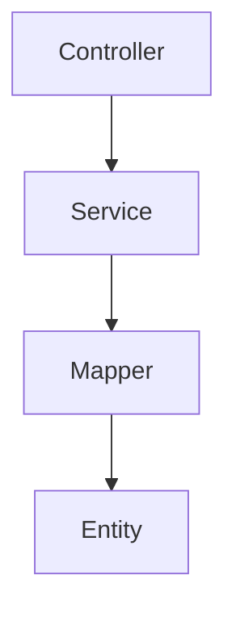

# 代码深度分析

深度分析代码文件和项目架构,生成结构化的分析报告。支持 **Java、Python、Go、JavaScript、Vue** 等主流技术栈,专注于**代码质量、架构设计、性能优化、安全审查**。

## 核心原则（15秒速查）

1. **完整读取** - 必须完整读取所有代码文件，避免只读取前100-150行导致分析不准确
2. **分析聚焦** - 根据目标选择分析模式（文件/架构/性能/安全）
3. **技术栈优先** - 参考技术栈文档的最佳实践
4. **问题分级** - 严重/重要/一般,明确优先级
5. **可执行建议** - 提供具体代码示例和修复步骤

## 技能信息

### 技术栈
- **后端**: Spring Boot 3、MyBatis-Plus、Python、Go
- **前端**: Vue 3
- **数据库**: MySQL、PostgreSQL
- **架构**: 微服务、分层架构、DDD

### 项目集成
- 先判断`项目记忆`是否存在,不存在则调用 `init-project-memory`
- 遵循 [项目宪章](mdc:.spec-code/memory/constitution.md)
- 参考 [开发指南](mdc:.spec-code/memory/guidelines.md)

### 文档输出
- 遵循 [文档生成原则](mdc:.codebuddy/spec/global/standards/common/document-generation-rules.md)
- 输出路径: `workspace/docs/code-analyze/code-analyze-report{时间戳yyyyMMddHHmmss}.md`
- 只在用户明确要求时生成文档

## 前置条件

- 已了解目标技术栈的基本特性和最佳实践
- 已准备待分析的代码文件或项目目录
- 参考: [技术栈索引](mdc:global/knowledge/stack/index.md)

## ⚠️ 关键要求

**文件读取原则**:
- **必须完整读取所有分析目标文件** - 避免只读取前100-150行导致分析不完整
- 使用 `read_file` 工具时不限制行数，确保获取完整代码内容
- 对于超长文件，使用 `offset` 和 `limit` 分段读取，确保覆盖全部内容
- 分析质量完全依赖于对代码的完整理解

**分析深度要求**:
- 每个类的所有方法都必须考虑
- 每个方法的完整实现逻辑都必须分析
- 不能因为文件长度而跳过重要代码段

## 核心流程

### 1. 确定分析模式

询问用户："这次代码分析的目标是什么？"

**分析模式**:
- **模式 A: 单文件深度分析** - 分析单个文件的功能实现和逻辑
- **模式 B: 项目架构分析** - 分析整个项目的架构设计和模块划分
- **模式 C: 代码质量审查** - 系统化的代码质量检查
- **模式 D: 性能瓶颈识别** - 识别性能问题和优化建议
- **模式 E: 安全漏洞检测** - 识别安全隐患和漏洞

**分析深度**:
- **Level 1: 快速扫描** - 5-10 分钟,识别明显问题
- **Level 2: 标准分析** - 20-30 分钟,全面分析
- **Level 3: 深度审查** - 1-2 小时,包含重构建议

### 2. 执行代码分析

#### 模式 A: 单文件深度分析

⚠️ **重要**: 必须完整读取目标文件，确保分析所有方法和逻辑分支

**分析维度**:
1. **功能实现** - 核心功能、处理流程、业务逻辑（基于完整代码）
2. **逻辑结构** - 控制流、数据流、异常处理（覆盖所有分支）
3. **代码质量** - 命名规范、复杂度、注释完整性（全文件扫描）
4. **潜在问题** - 逻辑缺陷、性能瓶颈、安全风险（深度分析）

**示例（Spring Boot Controller）**:

问题代码:
```java
@RestController
@RequestMapping("/api/users")
public class UserController {
    @Autowired
    private UserService userService;
    
    @GetMapping
    public List<User> getAllUsers() {
        return userService.list();  // 不分页
    }
}
```

问题识别:
- ❌ **性能问题** - 不分页,可能返回大量数据
- 建议: 使用 `Page<User>` 和分页参数
- 参考: [MyBatis-Plus 分页](mdc:global/knowledge/stack/mybatis_plus.md#分页)

修复后:
```java
@GetMapping
public IPage<User> getUsers(
        @RequestParam(defaultValue = "1") int page,
        @RequestParam(defaultValue = "10") int size) {
    Page<User> pageParam = new Page<>(page, size);
    return userService.page(pageParam);
}
```

#### 模式 B: 项目架构分析

**分析维度**:
1. **项目概述** - 项目结构、技术栈、主要功能
2. **架构设计** - 架构模式、模块划分、设计模式
3. **依赖关系** - 模块依赖、调用链路、循环依赖
4. **技术债务** - 代码质量、架构债务、性能债务

**架构分析示例**:

```
项目结构:
src/main/java/com/example/demo/
├── controller/          # REST API 控制器
├── service/             # 业务逻辑层
├── mapper/              # 数据访问层
├── entity/              # 实体类
├── dto/                 # 数据传输对象
└── config/              # 配置类
```

架构评估:
- ✅ 采用标准的三层架构（Controller-Service-Mapper）
- ✅ 职责分离清晰
- ⚠️ 缺少统一的异常处理机制

依赖关系:


技术债务:
1. **架构债务** - 缺少统一的异常处理
   - 建议: 实现 `@RestControllerAdvice` 全局异常处理
   - 参考: [Spring Boot 异常处理](mdc:global/knowledge/stack/springboot3.md#异常处理)

#### 模式 C: 代码质量审查

**质量评分标准**:

| 维度 | 权重 | 目标 |
|------|------|------|
| 命名规范 | 10% | > 95% |
| 复杂度 | 20% | 圈复杂度 < 10 的比例 > 90% |
| 重复代码 | 15% | 重复率 < 5% |
| 测试覆盖率 | 25% | > 80% |
| 安全性 | 15% | 无已知安全漏洞 |

#### 模式 D: 性能瓶颈识别

**常见性能问题**:

**N+1 查询问题**:

问题代码:
```java
@GetMapping("/users-with-orders")
public List<UserVO> getUsersWithOrders() {
    List<User> users = userMapper.selectList(null);  // 1 次查询
    
    return users.stream().map(user -> {
        List<Order> orders = orderMapper.selectByUserId(user.getId());  // N 次查询
        return new UserVO(user, orders);
    }).collect(Collectors.toList());
}
```

性能分析:
- ❌ 执行了 1 + N 次查询（N = 用户数量）
- ❌ 当用户数量 > 100 时,性能显著下降

优化方案:
```java
@GetMapping("/users-with-orders")
public List<UserVO> getUsersWithOrders() {
    // 1. 查询所有用户
    List<User> users = userMapper.selectList(null);
    List<Long> userIds = users.stream().map(User::getId).collect(Collectors.toList());
    
    // 2. 批量查询所有订单
    List<Order> orders = orderMapper.selectBatchIds(userIds);
    
    // 3. 按 userId 分组
    Map<Long, List<Order>> orderMap = orders.stream()
        .collect(Collectors.groupingBy(Order::getUserId));
    
    // 4. 组装结果
    return users.stream()
        .map(user -> new UserVO(user, orderMap.getOrDefault(user.getId(), Collections.emptyList())))
        .collect(Collectors.toList());
}
```

参考: [MyBatis-Plus 性能优化](mdc:global/knowledge/stack/mybatis_plus.md#性能优化)

#### 模式 E: 安全漏洞检测

**SQL 注入漏洞**:

问题代码:
```java
@GetMapping("/search")
public List<User> searchUsers(@RequestParam String keyword) {
    String sql = "SELECT * FROM user WHERE name LIKE '%" + keyword + "%'";
    return jdbcTemplate.query(sql, new UserRowMapper());
}
```

安全分析:
- ❌ 直接拼接 SQL,存在 SQL 注入风险
- ❌ 攻击者可以注入恶意 SQL 代码

修复方案:
```java
@GetMapping("/search")
public List<User> searchUsers(@RequestParam String keyword) {
    LambdaQueryWrapper<User> wrapper = new LambdaQueryWrapper<>();
    wrapper.like(User::getName, keyword);
    return userMapper.selectList(wrapper);
}
```

参考: [MyBatis-Plus 安全实践](mdc:global/knowledge/stack/mybatis_plus.md#安全实践)

### 3. 生成分析报告（仅当用户明确要求时）

**单文件分析报告结构**:
```markdown
# 代码分析报告 - [文件名]

## 基本信息
- 文件路径、编程语言、主要功能、代码规模

## 功能实现分析
- 核心功能识别
- 处理流程分析
- 关键方法分析

## 代码质量评估
| 维度 | 评分 | 说明 |
|------|------|------|

## 潜在问题识别
### 【严重】性能瓶颈
### 【重要】安全风险
### 【一般】代码改进

## 优化建议
- 功能逻辑优化
- 性能优化
- 架构改进
```

**项目架构分析报告结构**:
```markdown
# 项目架构分析报告 - [项目名]

## 项目概述
- 项目名称、项目类型、主要功能、技术栈、项目规模

## 架构设计分析
- 整体架构（含架构图）
- 模块划分
- 设计模式应用

## 依赖关系分析
- 依赖关系图
- 循环依赖

## 技术债务评估
| 债务类型 | 严重程度 | 修复难度 | 优先级 | 建议措施 |

## 改进建议
- 架构优化
- 代码质量改进
- 性能优化
```

## 最佳实践

### 1. 技术栈文档集成

在每个关键问题中,明确引用技术栈文档:

```markdown
### 问题: 未使用分页

**参考文档**: [MyBatis-Plus 分页](mdc:global/knowledge/stack/mybatis_plus.md#分页)

根据技术栈文档,使用分页插件:
[代码示例]

**最佳实践**:
- ✅ 所有列表查询都应分页
- ✅ 默认页大小 10-20 条
- ✅ 最大页大小 100 条
```

### 2. 问题分级标准

| 级别 | 说明 | 处理方式 |
|------|------|---------| 
| **【严重】** | 影响功能、安全、性能的关键问题 | 立即修复 |
| **【重要】** | 影响代码质量、可维护性的问题 | 计划修复 |
| **【一般】** | 代码优化建议 | 逐步改进 |

### 3. 可执行的改进建议

**不好的建议**:
```
❌ 建议优化性能
```

**好的建议**:
```
✅ 建议优化性能

**问题代码**: [原代码]
**修复后**: [优化后的代码]
**参考**: [技术栈文档链接]
```

## 常见问题

### 错误 1: 分析范围不明确

**症状**: 分析报告过于宽泛或过于狭窄

**解决**:
- ✅ 在步骤 1 明确分析模式
- ✅ 确定分析的文件或模块
- ✅ 明确分析深度

### 错误 2: 忽略技术栈文档

**症状**: 分析建议不符合技术栈最佳实践

**解决**:
- ✅ 分析前阅读相关技术栈文档
- ✅ 在报告中引用技术栈文档
- ✅ 使用技术栈推荐的 API 和模式

### 错误 3: 缺少可执行的建议

**症状**: 分析报告只指出问题,没有解决方案

**解决**:
- ✅ 提供修复前后的代码对比
- ✅ 说明修复步骤
- ✅ 引用相关文档和最佳实践

## 质量检查

完成分析后验证:

**分析完整性**:
- [ ] 分析模式和范围明确
- [ ] 所有关键代码都已分析
- [ ] 问题识别全面
- [ ] 改进建议具体可行

**技术栈符合性**:
- [ ] 遵循技术栈文档的最佳实践
- [ ] 引用了相关技术栈文档
- [ ] 使用推荐的 API 和模式

**报告质量**:
- [ ] 报告结构清晰
- [ ] 问题分级合理
- [ ] 提供了代码示例
- [ ] 引用了技术文档

**可操作性**:
- [ ] 改进建议可执行
- [ ] 提供了修复步骤
- [ ] 优先级明确
- [ ] 包含参考资源

## 🚨 红灯信号

以下任一出现,立即停止:
- [ ] 分析模式不明确,不知道要分析什么
- [ ] 技术栈不支持或不熟悉
- [ ] 问题识别没有具体位置和代码示例
- [ ] 改进建议没有引用技术栈文档

## 相关资源

- [技术栈索引](mdc:global/knowledge/stack/index.md)
- [Spring Boot 3](mdc:global/knowledge/stack/springboot3.md)
- [MyBatis-Plus](mdc:global/knowledge/stack/mybatis_plus.md)
- [Vue 3](mdc:global/knowledge/stack/vue3.md)
