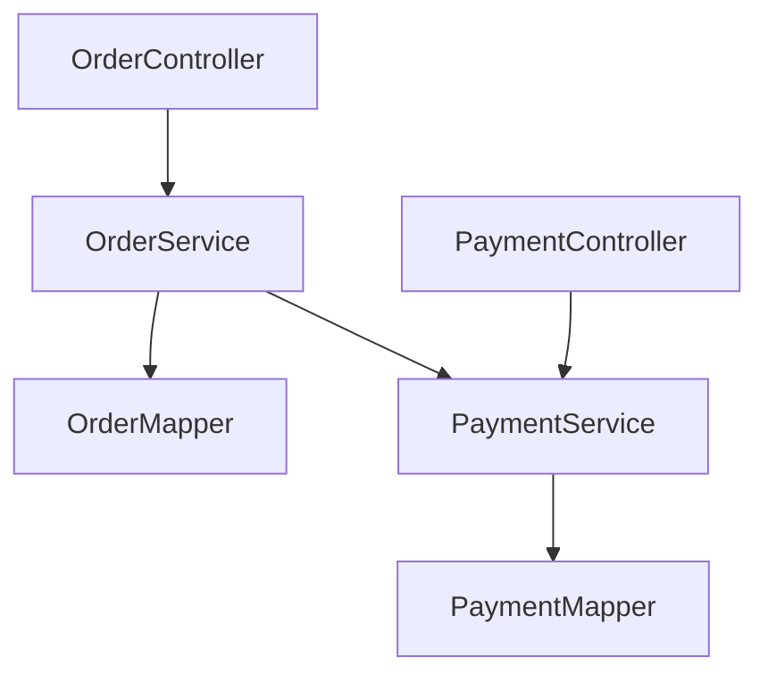

# 代码分析示例

## 示例 1: 单文件深度分析（Spring Boot Controller）

### 场景
分析一个用户管理的 REST API Controller,识别性能和安全问题。

### 待分析代码

```java
@RestController
@RequestMapping("/api/users")
public class UserController {
    
    @Autowired
    private UserService userService;
    
    @GetMapping
    public List<User> getAllUsers() {
        return userService.list();
    }
    
    @GetMapping("/{id}")
    public User getUser(@PathVariable Long id) {
        return userService.getById(id);
    }
    
    @PostMapping
    public User createUser(@RequestBody User user) {
        return userService.save(user) ? user : null;
    }
    
    @GetMapping("/search")
    public List<User> searchUsers(@RequestParam String keyword) {
        String sql = "SELECT * FROM user WHERE name LIKE '%" + keyword + "%'";
        return jdbcTemplate.query(sql, new UserRowMapper());
    }
}
```

### 分析结果

**功能分析**:
- ✅ 提供用户 CRUD 的 REST API
- ✅ 使用 Spring Boot 标准注解
- ⚠️ 缺少异常处理和输入验证

**问题识别**:

1. **【严重】SQL 注入漏洞** - `searchUsers()` 方法
   - 位置: 第 21 行
   - 风险: 攻击者可以注入恶意 SQL 代码
   - 修复建议:
   ```java
   @GetMapping("/search")
   public List<User> searchUsers(@RequestParam String keyword) {
       LambdaQueryWrapper<User> wrapper = new LambdaQueryWrapper<>();
       wrapper.like(User::getName, keyword);
       return userMapper.selectList(wrapper);
   }
   ```
   - 参考: [MyBatis-Plus 安全实践](mdc:global/knowledge/stack/mybatis_plus.md#安全实践)

2. **【严重】性能问题** - `getAllUsers()` 方法
   - 位置: 第 8 行
   - 影响: 不分页,可能返回大量数据
   - 修复建议:
   ```java
   @GetMapping
   public IPage<User> getUsers(
           @RequestParam(defaultValue = "1") int page,
           @RequestParam(defaultValue = "10") int size) {
       Page<User> pageParam = new Page<>(page, size);
       return userService.page(pageParam);
   }
   ```
   - 参考: [MyBatis-Plus 分页](mdc:global/knowledge/stack/mybatis_plus.md#分页)

3. **【重要】缺少输入验证** - `createUser()` 方法
   - 位置: 第 17 行
   - 影响: 可能接收无效数据
   - 修复建议:
   ```java
   @PostMapping
   public ResponseEntity<User> createUser(@Valid @RequestBody UserCreateDTO dto) {
       try {
           User user = userService.createUser(dto);
           return ResponseEntity.ok(user);
       } catch (DuplicateUserException e) {
           return ResponseEntity.status(HttpStatus.CONFLICT).build();
       }
   }
   ```
   - 参考: [Spring Boot 参数验证](mdc:global/knowledge/stack/springboot3.md#参数验证)

4. **【一般】缺少异常处理**
   - 建议: 实现 `@RestControllerAdvice` 全局异常处理
   - 参考: [Spring Boot 异常处理](mdc:global/knowledge/stack/springboot3.md#异常处理)

**质量评分**:
- 命名规范: 5/5
- 复杂度: 5/5
- 安全性: 1/5（存在 SQL 注入）
- 性能: 2/5（不分页）
- 健壮性: 2/5（缺少验证和异常处理）
- **综合评分**: 3.0/5

---

## 示例 2: 项目架构分析（电商订单系统）

### 场景
分析一个电商订单系统的项目架构,识别技术债务。

### 项目结构

```
src/main/java/com/example/order/
├── controller/
│   ├── OrderController.java
│   └── PaymentController.java
├── service/
│   ├── OrderService.java
│   ├── PaymentService.java
│   └── impl/
│       ├── OrderServiceImpl.java
│       └── PaymentServiceImpl.java
├── mapper/
│   ├── OrderMapper.java
│   └── PaymentMapper.java
├── entity/
│   ├── Order.java
│   ├── OrderItem.java
│   └── Payment.java
├── dto/
│   ├── OrderCreateDTO.java
│   └── OrderResponseDTO.java
└── config/
    └── MyBatisPlusConfig.java
```

### 分析结果

**整体架构**:
- ✅ 采用标准的三层架构（Controller-Service-Mapper）
- ✅ 职责分离清晰
- ✅ 遵循 [Spring Boot 3](mdc:global/knowledge/stack/springboot3.md) 的项目结构

**模块划分**:
- ✅ 按照业务功能划分（订单、支付）
- ⚠️ 缺少独立的 DTO 转换层
- ⚠️ 缺少统一的异常处理

**依赖关系**:


**技术债务识别**:

1. **【严重】架构债务** - 缺少统一的异常处理机制
   - 影响: 异常处理分散在各个模块,难以维护
   - 修复难度: 中
   - 优先级: P0
   - 建议措施:
   ```java
   @RestControllerAdvice
   public class GlobalExceptionHandler {
       @ExceptionHandler(BusinessException.class)
       public ResponseEntity<ErrorResponse> handleBusinessException(BusinessException e) {
           return ResponseEntity.status(HttpStatus.BAD_REQUEST)
               .body(new ErrorResponse(e.getCode(), e.getMessage()));
       }
   }
   ```
   - 参考: [Spring Boot 异常处理](mdc:global/knowledge/stack/springboot3.md#异常处理)

2. **【重要】代码债务** - DTO 和 Entity 转换逻辑分散
   - 影响: 转换逻辑重复,难以维护
   - 修复难度: 低
   - 优先级: P1
   - 建议措施: 使用 MapStruct 统一转换
   ```java
   @Mapper(componentModel = "spring")
   public interface OrderConverter {
       OrderResponseDTO toDTO(Order order);
       Order toEntity(OrderCreateDTO dto);
   }
   ```

3. **【一般】性能债务** - 缺少缓存机制
   - 影响: 频繁查询数据库
   - 修复难度: 中
   - 优先级: P2
   - 建议措施: 使用 Redis 缓存
   - 参考: [Spring Data Redis](mdc:global/knowledge/stack/spring_data_redis.md)

**改进建议**:
1. 实现全局异常处理（P0）
2. 引入 MapStruct 统一 DTO 转换（P1）
3. 添加 Redis 缓存（P2）
4. 完善单元测试（P2）

---

## 示例 3: 性能瓶颈识别（N+1 查询）

### 场景
识别一个订单查询接口的 N+1 查询问题。

### 问题代码

```java
@GetMapping("/orders-with-items")
public List<OrderVO> getOrdersWithItems() {
    List<Order> orders = orderMapper.selectList(null);  // 1 次查询
    
    return orders.stream().map(order -> {
        List<OrderItem> items = orderItemMapper.selectByOrderId(order.getId());  // N 次查询
        return new OrderVO(order, items);
    }).collect(Collectors.toList());
}
```

### 性能分析

- ❌ 执行了 1 + N 次查询（N = 订单数量）
- ❌ 当订单数量 = 100 时,执行 101 次查询
- ❌ 数据库连接池压力增大
- ❌ 响应时间随订单数量线性增长

### 优化方案

**方案 1: 批量查询 + Map 缓存**:

```java
@GetMapping("/orders-with-items")
public List<OrderVO> getOrdersWithItems() {
    // 1. 查询所有订单（1次）
    List<Order> orders = orderMapper.selectList(null);
    List<Long> orderIds = orders.stream().map(Order::getId).collect(Collectors.toList());
    
    // 2. 批量查询所有订单项（1次）
    List<OrderItem> items = orderItemMapper.selectByOrderIds(orderIds);
    
    // 3. 按 orderId 分组（内存操作）
    Map<Long, List<OrderItem>> itemMap = items.stream()
        .collect(Collectors.groupingBy(OrderItem::getOrderId));
    
    // 4. 组装结果（内存操作）
    return orders.stream()
        .map(order -> new OrderVO(order, itemMap.getOrDefault(order.getId(), Collections.emptyList())))
        .collect(Collectors.toList());
}
```

**性能改善**:
- ✅ 查询次数: 101 次 → 2 次
- ✅ 响应时间: ~1000ms → ~50ms（20倍提升）
- ✅ 数据库连接数: 101 → 2

**方案 2: MyBatis-Plus 关联查询**:

```java
// Mapper 配置
@Select("SELECT o.*, i.* FROM `order` o LEFT JOIN order_item i ON o.id = i.order_id")
@Results({
    @Result(column = "id", property = "id"),
    @Result(column = "id", property = "items", many = @Many(select = "selectItemsByOrderId"))
})
List<OrderWithItems> selectOrdersWithItems();
```

参考: [MyBatis-Plus 性能优化](mdc:global/knowledge/stack/mybatis_plus.md#性能优化)
