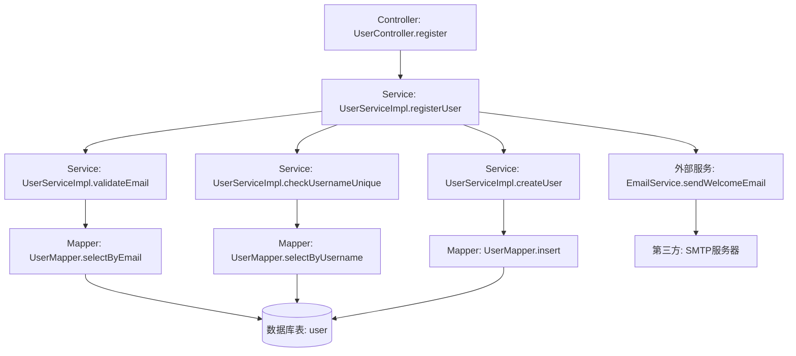
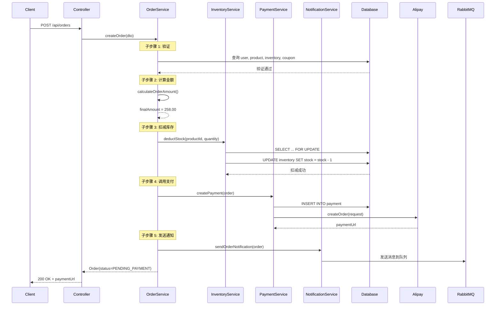
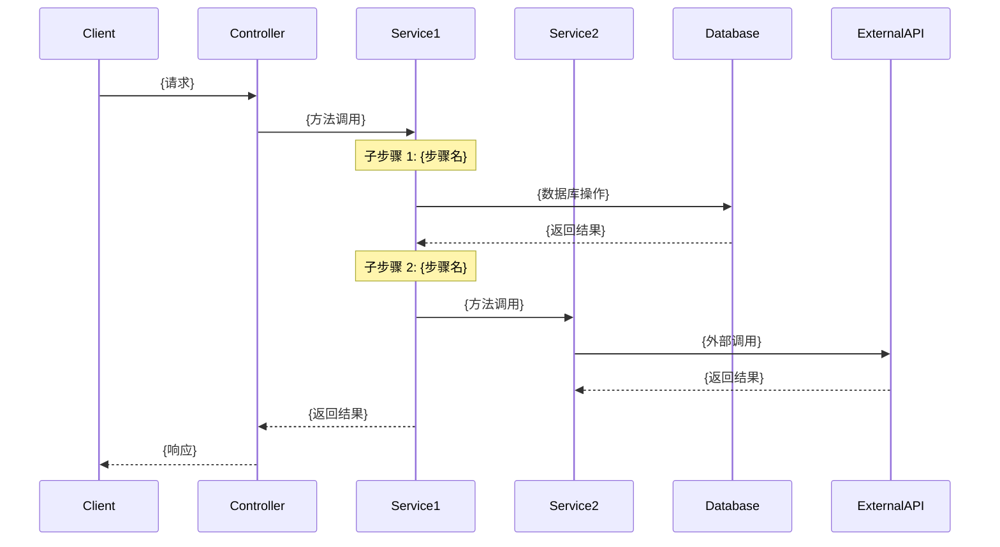
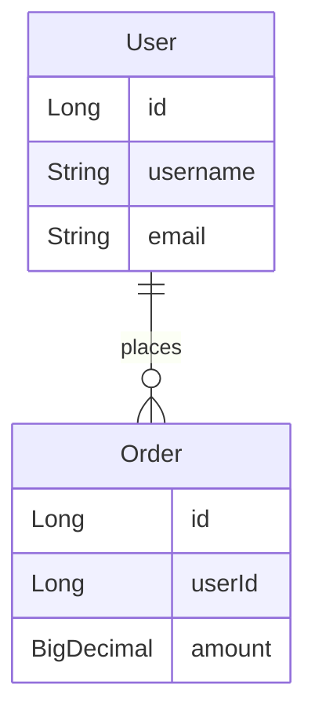
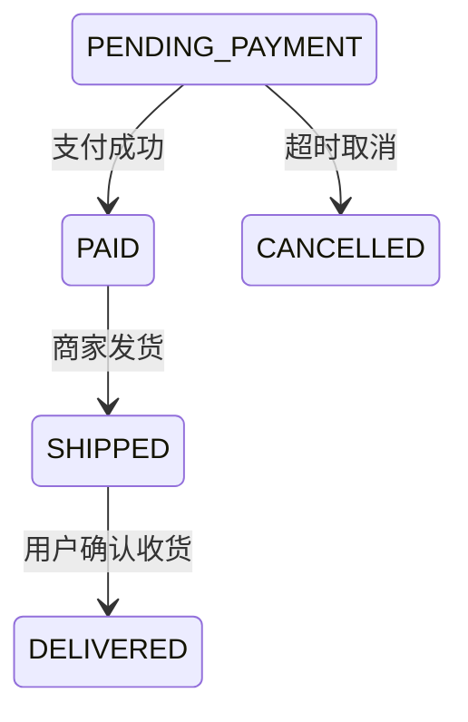

# Skill: 代码逆向需求推导（深度分析版）

> ⚠️ **核心特性 v5.0**: 
> - ✅ **强制文件扫描**: 读取所有项目文件 (*.java, *.yml, *.xml, *.js, *.vue)
> - ✅ **方法调用深度跟踪**: Controller → Service → Mapper → 外部服务完整调用链
> - ✅ **业务逻辑深度提取**: 分析业务流程、状态转换、计算公式、验证规则
> - ✅ **复杂功能拆分分析**: 多步骤详细分析（创建订单 = 验证 → 计算 → 扣减库存 → 支付 → 通知）
> - ⭐ **清晰准确无歧义**: 业务规则使用明确模态动词（必须/应当/禁止）、量化指标、精确条件

> ⚠️ **规范引用**: [通用规范](mdc:.codebuddy/spec/global/standards/common/index.md) | [文档生成规则](mdc:.codebuddy/spec/global/standards/common/document-generation-rules.md)

> 📁 **输出路径**: 
> - 默认: `docs/reverse/requirement/{模块名}-requirements.md`

## 📖 概述

从现有代码中系统化推导和重建完整的需求文档。

**核心能力**:
- 识别代码组织、模块划分、依赖关系
- 提取功能需求、业务规则、数据模型
- 推导非功能需求（性能、安全、可靠性）

**适用场景**:
- 遗留系统维护、系统重构、知识传承
- 合规性审查、第三方代码分析

## 📚 技术栈参考

- [Spring Boot 3](mdc:global/knowledge/stack/springboot3.md) | [MyBatis-Plus](mdc:global/knowledge/stack/mybatis_plus.md)
- [Vue 3](mdc:global/knowledge/stack/vue3.md)
- [技术栈索引](mdc:global/knowledge/stack/index.md)

## 📋 前置条件

- [ ] 完整源代码或目标代码片段
- [ ] 代码可编译（或结构完整）
- [ ] 明确分析范围和重点

## 🔄 执行流程

### 步骤 1: 确定范围

询问用户：

1. **代码范围**: 项目 / 模块 / 功能 / 片段
2. **分析重点**: 全面 / 功能 / 业务规则 / 数据 / 非功能
3. **业务背景**: 系统用途、核心流程、特殊约束（可选）

### 步骤 2: 强制读取所有项目文件

**⚠️ 关键步骤 - 必须执行**

根据用户指定的代码范围，**强制完整读取所有相关文件**，确保分析的完整性。

**⚠️ 文件读取要求**:
- 使用 `read_file` 工具完整读取每个文件，不限制行数
- 避免只读取前100-150行，这会导致重要业务逻辑遗漏
- 对于超长文件，使用分段读取确保获取完整内容
- 需求推导质量 = 代码理解完整度

**执行规则**:
1. **扫描目录结构**: 使用 `list_files` 或 `search_file` 获取完整文件列表
2. **按文件类型分类读取**:
   - Java: `*.java` (Controller, Service, Mapper, Entity, Config, Utils 等)
   - 配置: `*.yml`, `*.yaml`, `*.properties`, `*.xml` (application.yml, pom.xml, mybatis-config.xml 等)
   - JavaScript/TypeScript: `*.js`, `*.jsx`, `*.ts`, `*.tsx`
   - Vue: `*.vue`
   - SQL: `*.sql`
   - 其他: `*.json`, `*.md`, `Dockerfile`, `.gitignore`
3. **完整批量读取**: 使用 `read_file` 工具完整读取所有识别的文件（不限制行数）
4. **构建文件索引**: 记录文件路径、类型、关键类/函数/接口（基于完整内容）

**读取优先级**:
```
P0 - 核心业务代码:
  - Controller 层 (*.java with @RestController/@Controller)
  - Service 层 (*.java with @Service)
  - Mapper 层 (*.java with @Mapper, *.xml)
  - Entity 层 (*.java with @Entity/@Table)

P1 - 配置文件:
  - application.yml / application.properties
  - pom.xml / package.json
  - mybatis-config.xml

P2 - 前端代码:
  - Vue 组件 (*.vue)
  - API 调用 (service/*.js, api/*.ts)

P3 - 其他支持文件:
  - 工具类 (util/*, common/*)
  - 配置类 (config/*.java)
  - SQL 脚本 (*.sql)
```

**示例操作**:
```markdown
# 1. 扫描项目目录
search_file(pattern="*.java", recursive=true)
search_file(pattern="*.yml", recursive=true)
search_file(pattern="*.xml", recursive=true)
search_file(pattern="*.vue", recursive=true)
search_file(pattern="*.ts", recursive=true)

# 2. 批量读取文件（一次调用中读取多个文件）
read_file("src/main/java/com/example/UserController.java")
read_file("src/main/java/com/example/UserService.java")
read_file("src/main/java/com/example/UserMapper.java")
read_file("src/main/resources/application.yml")
read_file("pom.xml")
...

# 3. 构建文件索引
{
  "controllers": ["UserController.java", "OrderController.java"],
  "services": ["UserServiceImpl.java", "OrderServiceImpl.java"],
  "mappers": ["UserMapper.java", "OrderMapper.java"],
  "entities": ["User.java", "Order.java"],
  "configs": ["application.yml", "pom.xml"]
}
```

**验证点**:
- [ ] 所有 Java 文件已读取
- [ ] 所有配置文件已读取
- [ ] 所有前端代码已读取（如适用）
- [ ] 文件索引已构建
- [ ] 核心组件已识别

### 步骤 3: 识别技术栈

基于已读取的文件，自动检测代码特征：

**Spring Boot**: `pom.xml`、`@SpringBootApplication`、`@RestController`
**Vue 3**: `package.json`、`<script setup>`、`Composition API`

识别核心组件和分层架构。

### 步骤 4: 功能需求推导（增强：深度方法调用跟踪）

**⚠️ 新增能力**: 深度跟踪方法调用链，构建完整的业务流程图

基于步骤 2 读取的所有文件，系统化提取功能需求：

#### 4.1 从 Controller 提取 API 接口

提取基本信息：
- HTTP 方法、路径、参数、返回值
- 权限控制（@PreAuthorize）
- 参数验证（@Valid）

#### 4.2 深度跟踪方法调用链（⭐ 核心增强）

**执行规则**:

对于每个 API 接口，**必须**深度跟踪完整的方法调用链：

```
调用层级 1: Controller 方法
  ↓ 调用
调用层级 2: Service 方法 1
  ↓ 调用
调用层级 3: Service 方法 2 (内部调用)
  ↓ 调用
调用层级 4: Mapper 方法 / 外部服务
  ↓ 调用
调用层级 5: 数据库表 / 第三方 API
```

**跟踪方法**:

1. **识别 Controller 中调用的 Service 方法**
   ```java
   // UserController.java:45
   @PostMapping("/register")
   public User register(@RequestBody UserDTO dto) {
       return userService.registerUser(dto);  // ← 跟踪这个方法
   }
   ```

2. **进入 Service 方法，识别所有子调用**
   ```java
   // UserServiceImpl.java:120
   public User registerUser(UserDTO dto) {
       // 子调用 1: 验证邮箱
       validateEmail(dto.getEmail());  // ← 继续跟踪
       
       // 子调用 2: 检查用户名唯一性
       checkUsernameUnique(dto.getUsername());  // ← 继续跟踪
       
       // 子调用 3: 创建用户
       User user = createUser(dto);  // ← 继续跟踪
       
       // 子调用 4: 发送欢迎邮件
       emailService.sendWelcomeEmail(user.getEmail());  // ← 外部服务调用
       
       return user;
   }
   ```

3. **继续深入每个子调用，直到到达底层（Mapper 或外部服务）**
   ```java
   // UserServiceImpl.java:150
   private void validateEmail(String email) {
       if (!EmailValidator.isValid(email)) {  // ← 工具类调用
           throw new BusinessException("邮箱格式错误");
       }
       
       // 检查邮箱是否已注册
       if (userMapper.selectByEmail(email) != null) {  // ← Mapper 调用
           throw new BusinessException("邮箱已注册");
       }
   }
   ```

4. **记录到达的底层资源**
   ```java
   // UserMapper.java:30
   User selectByEmail(String email);  // ← 底层 Mapper 方法
   
   // 对应的 SQL (UserMapper.xml:15)
   SELECT * FROM user WHERE email = #{email}  // ← 数据库表: user
   ```

**输出格式**:

```markdown
#### FR-001: 用户注册

**API 接口**: POST /api/users/register

**完整调用链**:



**调用链详情**:

1. **调用层级 1**: Controller 入口
   - 位置: `UserController.java:45`
   - 方法: `register(UserDTO dto)`
   - 作用: 接收用户注册请求

2. **调用层级 2**: Service 主流程
   - 位置: `UserServiceImpl.java:120`
   - 方法: `registerUser(UserDTO dto)`
   - 作用: 用户注册主流程编排

3. **调用层级 3-1**: 邮箱验证
   - 位置: `UserServiceImpl.java:150`
   - 方法: `validateEmail(String email)`
   - 作用: 验证邮箱格式和唯一性
   - **子调用 3-1-1**: `userMapper.selectByEmail(email)` (`UserMapper.java:30`)
     - SQL: `SELECT * FROM user WHERE email = #{email}` (`UserMapper.xml:15`)
     - 访问表: `user`

4. **调用层级 3-2**: 用户名唯一性检查
   - 位置: `UserServiceImpl.java:160`
   - 方法: `checkUsernameUnique(String username)`
   - 作用: 检查用户名是否已存在
   - **子调用 3-2-1**: `userMapper.selectByUsername(username)` (`UserMapper.java:35`)
     - SQL: `SELECT * FROM user WHERE username = #{username}` (`UserMapper.xml:20`)
     - 访问表: `user`

5. **调用层级 3-3**: 创建用户
   - 位置: `UserServiceImpl.java:170`
   - 方法: `createUser(UserDTO dto)`
   - 作用: 密码加密并插入数据库
   - **子调用 3-3-1**: `passwordEncoder.encode(dto.getPassword())` (`BCryptPasswordEncoder.java`)
   - **子调用 3-3-2**: `userMapper.insert(user)` (`UserMapper.java:25`)
     - SQL: `INSERT INTO user(...) VALUES(...)` (`UserMapper.xml:10`)
     - 访问表: `user`

6. **调用层级 3-4**: 发送欢迎邮件（外部服务）
   - 位置: `UserServiceImpl.java:125`
   - 方法: `emailService.sendWelcomeEmail(email)`
   - 作用: 异步发送欢迎邮件
   - **外部调用**: SMTP 服务器（如 SendGrid/阿里云邮件服务）
```

**验证检查清单**:
- [ ] 所有 Service 方法调用已跟踪
- [ ] 所有 Mapper 方法调用已记录
- [ ] 所有外部服务调用已标注
- [ ] 所有数据库表访问已列出
- [ ] 调用链图完整（Mermaid 格式）
- [ ] 每个调用层级都有代码位置（文件名:行号）

#### 4.3 复杂功能拆分分析（⭐ 新增）

**触发条件**:

当满足以下任一条件时，**必须**拆分为多个子步骤详细分析：

1. 调用链深度 >= 4 层
2. 涉及数据库表 >= 3 个
3. 涉及外部服务 >= 2 个
4. Service 方法内部调用 >= 5 个子方法
5. 存在明确的业务阶段（如：订单创建 = 验证 → 计算 → 扣库存 → 支付 → 通知）

**拆分方法**:

将复杂功能分解为多个**顺序执行的子步骤**，每个子步骤独立分析：

**示例**（订单创建）:

```markdown
#### FR-010: 创建订单（复杂功能 - 拆分分析）

**复杂度指标**:
- 调用链深度: 6 层
- 涉及数据库表: 5 个 (order, order_item, product, inventory, user)
- 涉及外部服务: 2 个 (支付网关, 消息队列)
- 业务阶段: 5 个（验证 → 计算 → 扣库存 → 支付 → 通知）

**拆分为 5 个子步骤分析**:

---

##### 子步骤 1: 订单信息验证

**目标**: 验证用户、商品、库存、优惠券等前置条件

**调用链**:
```
OrderController.createOrder (OrderController.java:80)
  ↓
OrderServiceImpl.createOrder (OrderServiceImpl.java:200)
  ↓
OrderServiceImpl.validateOrder (OrderServiceImpl.java:250)
    ↓ 验证用户
    UserMapper.selectById (UserMapper.java:20) → 表: user
    ↓ 验证商品
    ProductMapper.selectByIds (ProductMapper.java:30) → 表: product
    ↓ 验证库存
    InventoryMapper.checkStock (InventoryMapper.java:40) → 表: inventory
    ↓ 验证优惠券
    CouponMapper.selectById (CouponMapper.java:25) → 表: coupon
```

**业务规则**:
- BR-010-1: 用户必须已登录且已实名认证 (`OrderServiceImpl.java:255`)
- BR-010-2: 商品必须在售且未下架 (`OrderServiceImpl.java:260`)
- BR-010-3: 库存必须充足 (quantity >= order_quantity) (`OrderServiceImpl.java:265`)
- BR-010-4: 优惠券必须有效且未使用 (`OrderServiceImpl.java:270`)

**数据流**:
```
输入: OrderCreateDTO (userId, productIds, quantities, couponId)
  ↓ 查询
数据库: user, product, inventory, coupon
  ↓ 验证
验证结果: 通过/失败
  ↓ 异常
抛出: UserNotAuthenticatedException / ProductOfflineException / InsufficientStockException
```

---

##### 子步骤 2: 订单金额计算

**目标**: 计算商品金额、运费、优惠金额、最终金额

**调用链**:
```
OrderServiceImpl.createOrder (OrderServiceImpl.java:205)
  ↓
OrderServiceImpl.calculateOrderAmount (OrderServiceImpl.java:300)
    ↓ 计算商品总金额
    ProductMapper.selectByIds (ProductMapper.java:30) → 获取单价
    ↓ 计算运费
    FreightServiceImpl.calculateFreight (FreightServiceImpl.java:50)
    ↓ 计算优惠金额
    CouponServiceImpl.calculateDiscount (CouponServiceImpl.java:60)
```

**业务规则**:
- BR-010-5: 商品总金额 = Σ(商品单价 × 数量) (`OrderServiceImpl.java:310`)
- BR-010-6: 运费计算规则: 满 99 免运费，否则 10 元 (`FreightServiceImpl.java:55`)
- BR-010-7: 优惠金额不能超过商品总金额 (`CouponServiceImpl.java:65`)
- BR-010-8: 最终金额 = 商品总金额 + 运费 - 优惠金额 (`OrderServiceImpl.java:320`)

**计算公式**:
```java
// OrderServiceImpl.java:310-320
BigDecimal productAmount = items.stream()
    .map(item -> item.getPrice().multiply(BigDecimal.valueOf(item.getQuantity())))
    .reduce(BigDecimal.ZERO, BigDecimal::add);

BigDecimal freight = productAmount.compareTo(new BigDecimal("99")) >= 0 
    ? BigDecimal.ZERO 
    : new BigDecimal("10");

BigDecimal discount = couponService.calculateDiscount(couponId, productAmount);

BigDecimal finalAmount = productAmount.add(freight).subtract(discount);
```

---

##### 子步骤 3: 扣减库存

**目标**: 扣减商品库存，支持事务回滚

**调用链**:
```
OrderServiceImpl.createOrder (OrderServiceImpl.java:210)
  ↓
InventoryServiceImpl.deductStock (InventoryServiceImpl.java:80)
    ↓ 锁定库存
    InventoryMapper.lockForUpdate (InventoryMapper.java:50) → 表: inventory (悲观锁)
    ↓ 扣减库存
    InventoryMapper.deductStock (InventoryMapper.java:55) → 表: inventory
    ↓ 记录扣减日志
    InventoryLogMapper.insert (InventoryLogMapper.java:30) → 表: inventory_log
```

**业务规则**:
- BR-010-9: 使用悲观锁防止超卖 (`InventoryMapper.xml:80: SELECT ... FOR UPDATE`)
- BR-010-10: 扣减后库存不能为负数 (`InventoryMapper.xml:85: stock = stock - #{quantity} WHERE stock >= #{quantity}`)
- BR-010-11: 扣减失败自动回滚订单 (`@Transactional(rollbackFor = Exception.class)`)

**SQL 详情**:
```xml
<!-- InventoryMapper.xml:80 -->
<select id="lockForUpdate" resultType="Inventory">
    SELECT * FROM inventory 
    WHERE product_id = #{productId} 
    FOR UPDATE
</select>

<!-- InventoryMapper.xml:85 -->
<update id="deductStock">
    UPDATE inventory 
    SET stock = stock - #{quantity},
        update_time = NOW()
    WHERE product_id = #{productId} 
      AND stock >= #{quantity}
</update>
```

---

##### 子步骤 4: 调用支付网关

**目标**: 创建支付订单并调用第三方支付接口

**调用链**:
```
OrderServiceImpl.createOrder (OrderServiceImpl.java:215)
  ↓
PaymentServiceImpl.createPayment (PaymentServiceImpl.java:100)
    ↓ 创建支付记录
    PaymentMapper.insert (PaymentMapper.java:20) → 表: payment
    ↓ 调用支付网关
    AlipayClient.createOrder (外部SDK) → 第三方: 支付宝API
```

**业务规则**:
- BR-010-12: 支付金额必须与订单金额一致 (`PaymentServiceImpl.java:105`)
- BR-010-13: 支付超时时间: 30 分钟 (`PaymentServiceImpl.java:110`)
- BR-010-14: 支付失败自动取消订单 (`PaymentServiceImpl.java:150`)

**外部服务调用**:
```java
// PaymentServiceImpl.java:115
AlipayTradeCreateRequest request = new AlipayTradeCreateRequest();
request.setBizContent("{" +
    "\"out_trade_no\":\"" + order.getOrderNo() + "\"," +
    "\"total_amount\":\"" + order.getFinalAmount() + "\"," +
    "\"subject\":\"" + order.getTitle() + "\"," +
    "\"timeout_express\":\"30m\"" +
"}");

AlipayTradeCreateResponse response = alipayClient.execute(request);
```

---

##### 子步骤 5: 发送订单通知

**目标**: 通过消息队列异步发送订单通知

**调用链**:
```
OrderServiceImpl.createOrder (OrderServiceImpl.java:220)
  ↓
NotificationServiceImpl.sendOrderNotification (NotificationServiceImpl.java:60)
    ↓ 发送到消息队列
    RabbitTemplate.convertAndSend (Spring AMQP) → 消息队列: order_notification_queue
    ↓ 消费者处理
    NotificationConsumer.handleOrderNotification (NotificationConsumer.java:40)
        ↓ 发送短信
        SmsService.send (外部SDK) → 第三方: 阿里云短信
        ↓ 发送邮件
        EmailService.send (外部SDK) → 第三方: SendGrid
        ↓ 推送站内消息
        MessageMapper.insert (MessageMapper.java:25) → 表: message
```

**业务规则**:
- BR-010-15: 通知异步处理，不影响订单创建 (`@Async`)
- BR-010-16: 通知失败自动重试 3 次 (`@Retryable(maxAttempts = 3)`)
- BR-010-17: 通知内容包含订单号、金额、预计送达时间 (`NotificationServiceImpl.java:70`)

**消息队列配置**:
```java
// NotificationServiceImpl.java:65
rabbitTemplate.convertAndSend(
    "order.exchange",           // 交换机
    "order.created",            // 路由键
    orderNotificationMessage    // 消息体
);
```

---

**完整业务流程图**（5 个子步骤串联）:


```

**复杂功能拆分验证清单**:
- [ ] 已识别所有业务阶段
- [ ] 每个子步骤独立分析（调用链、业务规则、数据流）
- [ ] 每个子步骤标注代码位置
- [ ] 生成完整的业务流程序列图（Mermaid）
- [ ] 记录子步骤之间的数据传递
- [ ] 标注事务边界和回滚点

#### 4.4 标注代码位置（文件名 + 行号）

精确到具体方法和关键代码行，建立需求与代码的双向追溯。

### 步骤 5: 业务规则提取（增强：深度业务逻辑分析 + 清晰准确无歧义）

**⚠️ 核心能力**: 
- 深度提取业务逻辑，包括状态转换、计算公式、验证规则、分支处理
- ⭐ **清晰准确无歧义**: 使用明确的模态动词、量化指标、精确条件，确保业务规则可理解、可测试、可验证

**业务规则描述标准**（⭐ 新增 v5.0）:

**1. 使用明确的模态动词**:
- **必须 (MUST)**: 强制性要求，违反将导致系统错误或业务异常
  - ✅ 示例: "用户名**必须**在 3-20 个字符之间"
  - ✅ 示例: "订单金额**必须**大于 0"
  
- **应当 (SHOULD)**: 推荐性要求，违反可能影响用户体验但不影响系统运行
  - ✅ 示例: "密码**应当**包含大小写字母、数字和特殊字符"
  - ✅ 示例: "上传图片**应当**小于 5MB"

- **禁止 (MUST NOT)**: 明确禁止的操作
  - ✅ 示例: "**禁止**重复提交订单"
  - ✅ 示例: "已支付订单**禁止**直接取消"

- **仅当...时 (ONLY WHEN)**: 条件触发
  - ✅ 示例: "**仅当**订单状态为'待支付'时，**允许**用户取消订单"
  - ✅ 示例: "**仅当**库存充足时，**允许**下单"

**2. 量化所有指标**:

❌ **错误**（模糊不清）:
- "响应时间应该比较快" → ❓ 多快才算快？
- "库存不足时提示" → ❓ 什么叫不足？
- "支付超时自动取消" → ❓ 多久算超时？

✅ **正确**（精确量化）:
- "API 响应时间**必须** < 200ms"
- "库存数量 < 10 时，显示'库存紧张'提示"
- "支付创建后 30 分钟未完成，系统**自动取消**订单"

**3. 明确时间点和时间段**:

❌ **错误**:
- "订单超时后取消" → ❓ 什么时候算超时？
- "定期清理数据" → ❓ 多久清理一次？

✅ **正确**:
- "订单创建后 30 分钟未支付，系统**自动取消**"
- "每日凌晨 2:00 **自动删除** 7 天前的临时文件"

**4. 精确状态和条件**:

❌ **错误**:
- "订单完成后可以评价" → ❓ 什么状态算完成？

✅ **正确**:
- "**仅当**订单状态为 `DELIVERED`（已送达）或 `COMPLETED`（已完成）时，用户**可以**提交评价"

**5. 使用具体的业务术语**:

❌ **错误**（通用术语）:
- "处理失败时通知用户"

✅ **正确**（具体业务术语）:
- "支付失败时，**通过短信和站内信**通知用户，短信内容包含失败原因和重试入口"

**6. 明确异常处理**:

❌ **错误**:
- "数据错误时提示"

✅ **正确**:
- "当用户输入的手机号格式错误时，**立即显示**红色提示'请输入正确的手机号（11位数字）'"
- "当库存扣减失败时，**回滚订单创建操作**并**抛出** `InsufficientStockException`"

**7. 数学公式精确表达**:

❌ **错误**:
- "计算订单总金额"

✅ **正确**:
- "订单总金额 = Σ(商品单价 × 购买数量) + 运费 - 优惠金额"
- "积分奖励 = floor(订单金额 / 10)  // 向下取整"
- "满减优惠: **仅当**订单金额 ≥ 99 元时，**减免**运费 10 元"

**8. 优先级和范围明确**:

❌ **错误**:
- "优惠券可以叠加使用"

✅ **正确**:
- "单笔订单**最多使用** 1 张满减券 + 1 张折扣券，**禁止**同类型优惠券叠加"

---

基于步骤 2 读取的所有文件，深入提取业务规则：

#### 5.1 显式规则提取（⭐ 使用清晰准确无歧义的描述）

1. **条件判断逻辑** (`if-else`, `switch`):

   **代码示例**:
   ```java
   // OrderServiceImpl.java:300
   if (order.getStatus() == OrderStatus.PENDING_PAYMENT) {
       // BR-020: 仅当订单状态为 "待支付" 时，允许取消
       cancelOrder(orderId);
   } else if (order.getStatus() == OrderStatus.PAID) {
       // BR-021: 已支付订单禁止直接取消，必须通过退款流程
       throw new BusinessException("订单已支付，请申请退款");
   }
   ```

   **业务规则描述**（清晰准确版本）:
   - **BR-020**: **仅当**订单状态为 `PENDING_PAYMENT`（待支付）时，用户**允许**直接取消订单
   - **BR-021**: 订单状态为 `PAID`（已支付）或后续状态时，**禁止**直接取消订单，**必须**通过退款流程处理

2. **验证逻辑** (`@Valid`, 自定义验证器):

   **代码示例**:
   ```java
   // UserDTO.java:15
   @NotNull(message = "用户名不能为空")
   @Size(min = 3, max = 20, message = "用户名长度必须在3-20之间")
   @Pattern(regexp = "^[a-zA-Z0-9_]+$", message = "用户名只能包含字母、数字和下划线")
   private String username;
   ```

   **业务规则描述**（清晰准确版本）:
   - **BR-030**: 用户名**必须**为非空值
   - **BR-031**: 用户名长度**必须**在 3-20 个字符之间（包含边界）
   - **BR-032**: 用户名**仅允许**包含字母（a-z, A-Z）、数字（0-9）和下划线（_），**禁止**使用其他字符

3. **计算公式**:

   **代码示例**:
   ```java
   // OrderServiceImpl.java:350
   // BR-025: 订单总金额 = 商品金额 + 运费 - 优惠金额
   BigDecimal totalAmount = productAmount
       .add(freight)
       .subtract(discountAmount);
   
   // BR-026: 积分奖励 = 订单金额 / 10 (向下取整)
   Integer points = totalAmount.divide(new BigDecimal("10"), 0, RoundingMode.DOWN).intValue();
   ```

   **业务规则描述**（清晰准确版本）:
   - **BR-025**: 订单总金额 = Σ(商品单价 × 购买数量) + 运费 - 优惠金额
     - 商品金额 = Σ(商品i单价 × 商品i数量), i = 1 to N
     - 运费 = 根据 BR-027 计算
     - 优惠金额 = 优惠券折扣金额（如有）
   - **BR-026**: 积分奖励 = floor(订单总金额 / 10)
     - 采用向下取整（RoundingMode.DOWN）
     - 示例: 订单金额 258.00 元 → 积分奖励 25 分
   - **BR-027**: 运费计算规则:
     - **仅当**订单总金额 < 99 元时，收取运费 10 元
     - **仅当**订单总金额 ≥ 99 元时，免运费

4. **状态转换规则**:

   **代码示例**:
   ```java
   // OrderServiceImpl.java:400
   // BR-030: 订单状态流转
   // PENDING_PAYMENT → PAID → SHIPPED → DELIVERED → COMPLETED
   public void confirmDelivery(Long orderId) {
       Order order = orderMapper.selectById(orderId);
       
       // 验证当前状态
       if (order.getStatus() != OrderStatus.SHIPPED) {
           throw new BusinessException("只有已发货的订单才能确认收货");
       }
       
       // 更新状态
       order.setStatus(OrderStatus.DELIVERED);
       orderMapper.updateById(order);
       
       // 触发后续流程（自动确认收货后7天完成）
       scheduleAutoComplete(orderId, 7);
   }
   ```

   **业务规则描述**（清晰准确版本）:
   - **BR-030**: 订单状态流转规则（状态机）:
     - `PENDING_PAYMENT` (待支付) → `PAID` (已支付): 用户完成支付时触发
     - `PAID` (已支付) → `SHIPPED` (已发货): 商家点击发货按钮时触发
     - `SHIPPED` (已发货) → `DELIVERED` (已送达): 用户点击确认收货时触发
     - `DELIVERED` (已送达) → `COMPLETED` (已完成): 确认收货后 **7 天**自动触发
   
   - **BR-031**: 确认收货前置条件:
     - **仅当**订单状态为 `SHIPPED`（已发货）时，用户**允许**点击确认收货
     - 其他状态下**禁止**确认收货操作，抛出 `BusinessException`
   
   - **BR-032**: 自动完成规则:
     - 订单进入 `DELIVERED` 状态后，系统**自动在 7 天后**将订单状态更新为 `COMPLETED`
     - 定时任务执行时间: 每小时检查一次（参考 `OrderScheduler.java:80`）

#### 5.2 隐式规则提取（⭐ 清晰表述推断的规则）

1. **从代码结构推断**:

   **代码示例**:
   ```java
   // ProductServiceImpl.java:200
   // 批量查询商品（推断：支持批量操作）
   List<Product> products = productMapper.selectBatchIds(productIds);
   
   // 循环处理（推断：每个商品独立验证）
   for (Product product : products) {
       if (!product.isOnSale()) {
           // 隐式规则：下架商品不能购买
           throw new BusinessException("商品已下架: " + product.getName());
       }
   }
   ```

   **推断的业务规则**（清晰准确版本）:
   - **BR-040**: 系统**支持**批量查询商品信息（通过 `selectBatchIds` 方法）
   - **BR-041**: 每个商品**必须**独立验证上架状态
   - **BR-042**: **禁止**购买已下架商品（`isOnSale() == false`）
     - 违反时**抛出** `BusinessException`，错误消息包含商品名称
     - 推断依据: 循环中的 `if (!product.isOnSale())` 判断

2. **从注释中提取**:
   ```java
   // InventoryServiceImpl.java:150
   /**
    * 扣减库存（悲观锁）
    * 
    * 业务规则:
    * 1. 必须先锁定库存（SELECT FOR UPDATE）
    * 2. 扣减后库存不能为负数
    * 3. 扣减失败自动回滚
    * 
    * @param productId 商品ID
    * @param quantity 扣减数量
    * @throws InsufficientStockException 库存不足异常
    */
   @Transactional(rollbackFor = Exception.class)
   public void deductStock(Long productId, Integer quantity) {
       // ...
   }
   ```

3. **从异常消息推断约束**:
   ```java
   // UserServiceImpl.java:180
   if (user.getAge() < 18) {
       // 推断：BR-040: 用户年龄必须 >= 18 岁
       throw new BusinessException("未成年人不能注册");
   }
   
   if (balance.compareTo(amount) < 0) {
       // 推断：BR-041: 余额必须 >= 支付金额
       throw new InsufficientBalanceException("余额不足，当前余额: " + balance);
   }
   ```

#### 5.3 业务流程深度分析（⭐ 新增）

**执行规则**: 识别并绘制完整的业务流程图

1. **识别状态转换流程**:

   ```markdown
   **业务流程**: 订单状态流转
   
   ```mermaid
   stateDiagram-v2
       [*] --> PENDING_PAYMENT: 创建订单
       PENDING_PAYMENT --> PAID: 支付成功
       PENDING_PAYMENT --> CANCELLED: 超时/用户取消
       PAID --> SHIPPED: 商家发货
       SHIPPED --> DELIVERED: 用户确认收货
       DELIVERED --> COMPLETED: 7天后自动完成
       PAID --> REFUNDING: 申请退款
       REFUNDING --> REFUNDED: 退款成功
       REFUNDED --> [*]
       COMPLETED --> [*]
       CANCELLED --> [*]
   ```
   
   **状态转换规则**:
   - `PENDING_PAYMENT → PAID`: 用户完成支付（`PaymentServiceImpl.java:200`）
   - `PENDING_PAYMENT → CANCELLED`: 30分钟未支付自动取消（`OrderServiceImpl.java:500`）
   - `PAID → SHIPPED`: 商家点击发货（`OrderServiceImpl.java:550`）
   - `SHIPPED → DELIVERED`: 用户确认收货（`OrderServiceImpl.java:600`）
   - `DELIVERED → COMPLETED`: 7天后自动完成（`OrderScheduler.java:80`）
   - `PAID → REFUNDING`: 用户申请退款（`RefundServiceImpl.java:100`）
   ```

2. **识别分支处理逻辑**:

   ```markdown
   **业务流程**: 优惠券使用判断
   
   ```mermaid
   flowchart TD
       A[开始: 使用优惠券] --> B{优惠券是否存在?}
       B -->|否| C[抛出异常: 优惠券不存在]
       B -->|是| D{优惠券是否过期?}
       D -->|是| E[抛出异常: 优惠券已过期]
       D -->|否| F{优惠券是否已使用?}
       F -->|是| G[抛出异常: 优惠券已使用]
       F -->|否| H{订单金额是否满足?}
       H -->|否| I[抛出异常: 订单金额不满足]
       H -->|是| J{用户是否匹配?}
       J -->|否| K[抛出异常: 优惠券不属于该用户]
       J -->|是| L[计算优惠金额]
       L --> M[标记优惠券已使用]
       M --> N[返回优惠金额]
   ```
   
   **代码位置**: `CouponServiceImpl.java:200-280`
   
   **业务规则**:
   - BR-050: 优惠券必须存在且有效（`CouponServiceImpl.java:205`）
   - BR-051: 优惠券不能过期（`CouponServiceImpl.java:210`）
   - BR-052: 优惠券不能重复使用（`CouponServiceImpl.java:215`）
   - BR-053: 订单金额必须满足优惠券门槛（`CouponServiceImpl.java:220`）
   - BR-054: 优惠券只能由所有者使用（`CouponServiceImpl.java:225`）
   ```

3. **识别时序依赖**:

   ```markdown
   **业务流程**: 秒杀下单流程（时序敏感）
   
   ```mermaid
   sequenceDiagram
       participant User
       participant Controller
       participant RedisCache
       participant SeckillService
       participant InventoryService
       participant OrderService
       participant Database

       User->>Controller: POST /api/seckill/order
       Controller->>RedisCache: 检查是否已抢购
       alt 已抢购过
           RedisCache-->>Controller: 返回: 重复抢购
           Controller-->>User: 400: 您已参与过该秒杀
       else 未抢购
           RedisCache-->>Controller: 返回: 未抢购
           Controller->>SeckillService: createSeckillOrder(userId, productId)
           
           Note over SeckillService: ⚠️ 时序依赖 1: 必须先扣减Redis缓存库存
           SeckillService->>RedisCache: DECR seckill:stock:{productId}
           alt 库存不足
               RedisCache-->>SeckillService: 返回: 0或负数
               SeckillService-->>Controller: 抛出: 库存不足
           else 库存充足
               RedisCache-->>SeckillService: 返回: 剩余库存
               
               Note over SeckillService: ⚠️ 时序依赖 2: 然后扣减数据库库存
               SeckillService->>InventoryService: deductStock(productId, 1)
               InventoryService->>Database: UPDATE inventory SET stock = stock - 1
               Database-->>InventoryService: 扣减成功
               
               Note over SeckillService: ⚠️ 时序依赖 3: 最后创建订单
               SeckillService->>OrderService: createOrder(userId, productId)
               OrderService->>Database: INSERT INTO order
               Database-->>OrderService: 订单创建成功
               
               Note over SeckillService: ⚠️ 时序依赖 4: 标记已抢购（防重复）
               SeckillService->>RedisCache: SET seckill:user:{userId}:{productId} = 1
               
               OrderService-->>Controller: 返回订单
               Controller-->>User: 200: 抢购成功
           end
       end
   ```
   
   **时序依赖规则**:
   - BR-060: 必须先扣减 Redis 缓存库存（高性能）（`SeckillServiceImpl.java:150`）
   - BR-061: 然后扣减数据库库存（持久化）（`SeckillServiceImpl.java:160`）
   - BR-062: 再创建订单（`SeckillServiceImpl.java:170`）
   - BR-063: 最后标记用户已抢购（防止重复）（`SeckillServiceImpl.java:180`）
   - BR-064: 任一步骤失败，整个流程回滚（`@Transactional`）
   ```

#### 5.4 异常处理和边界条件

1. **异常处理逻辑**:
   ```java
   // OrderServiceImpl.java:700
   @Transactional(rollbackFor = Exception.class)
   public Order createOrder(OrderDTO dto) {
       try {
           // 主流程
           Order order = doCreateOrder(dto);
           return order;
       } catch (InsufficientStockException e) {
           // BR-070: 库存不足时，释放已锁定的资源
           releaseLockedResources(dto);
           throw e;
       } catch (PaymentException e) {
           // BR-071: 支付失败时，回滚订单和库存
           rollbackOrder(dto);
           throw e;
       } catch (Exception e) {
           // BR-072: 未知异常时，记录日志并通知管理员
           log.error("创建订单失败", e);
           notifyAdmin("订单创建异常", e.getMessage());
           throw new BusinessException("系统繁忙，请稍后重试");
       }
   }
   ```

2. **边界条件验证**:
   ```java
   // ProductServiceImpl.java:250
   public void updatePrice(Long productId, BigDecimal newPrice) {
       // BR-080: 价格必须 > 0
       if (newPrice.compareTo(BigDecimal.ZERO) <= 0) {
           throw new BusinessException("价格必须大于0");
       }
       
       // BR-081: 价格变动幅度不能超过50%
       Product product = productMapper.selectById(productId);
       BigDecimal changeRatio = newPrice.subtract(product.getPrice())
           .divide(product.getPrice(), 2, RoundingMode.HALF_UP)
           .abs();
       
       if (changeRatio.compareTo(new BigDecimal("0.5")) > 0) {
           throw new BusinessException("价格变动幅度不能超过50%");
       }
       
       product.setPrice(newPrice);
       productMapper.updateById(product);
   }
   ```

**业务规则提取验证清单**:
- [ ] 所有 if-else / switch 分支已分析
- [ ] 所有 @Valid 验证规则已记录
- [ ] 所有计算公式已提取
- [ ] 所有状态转换已绘制流程图
- [ ] 所有异常处理逻辑已分析
- [ ] 所有边界条件已标注
- [ ] 生成业务流程图（State Diagram / Flowchart / Sequence Diagram）
- [ ] 每个业务规则标注代码位置（文件名:行号）

### 步骤 6: 数据需求分析

基于步骤 2 读取的所有文件，全面分析数据需求：

1. **数据模型**: 
   - Entity 类的字段定义
   - 字段类型、长度、约束
   - 数据库注解（@Table, @Column, @Id）
   - MyBatis-Plus 注解（@TableName, @TableId, @TableField）

2. **数据关系**: 
   - 一对一（@OneToOne）
   - 一对多（@OneToMany）
   - 多对一（@ManyToOne）
   - 多对多（@ManyToMany）
   - 生成 ER 图

3. **数据流**: 
   - 输入 → 验证 → 处理 → 存储 → 输出
   - DTO 转 Entity、Entity 转 VO
   - 缓存策略（Redis）

4. **验证规则**: 
   - 字段约束（@NotNull, @Size, @Pattern）
   - 业务验证（唯一性、引用完整性）
   - 数据格式（日期、金额、邮箱）

### 步骤 7: 非功能需求推导

基于步骤 2 读取的所有文件，推导非功能需求：

1. **性能**: 
   - 缓存机制（@Cacheable, Redis）
   - 分页处理（MyBatis-Plus Page）
   - 响应时间要求（从日志/监控推断）
   - 并发控制（@Async, 线程池）

2. **安全**: 
   - 认证方式（JWT, Session, OAuth2）
   - 授权控制（@PreAuthorize, RBAC）
   - 数据加密（密码、敏感字段）
   - SQL 注入防护（MyBatis 参数化查询）
   - XSS 防护（输入输出转义）

3. **可靠性**: 
   - 异常处理（@ControllerAdvice）
   - 事务管理（@Transactional）
   - 日志记录（@Slf4j, log.info/error）
   - 重试机制（@Retryable）

4. **可维护性**: 
   - 代码规范遵守情况
   - 注释完整性
   - 单元测试覆盖率
   - 模块化和解耦程度

### 步骤 8: 生成需求文档

基于前面步骤分析的完整信息，生成结构化需求文档。

**确定输出路径**:
- 默认: `docs/reverse/requirement/{模块名}-requirements.md`

**文档结构**:
```markdown
---
title: "{项目名称} - 需求文档（代码逆向）"
generated_date: {日期}
source_code: {代码路径}
files_analyzed: {分析的文件数量}
analyzer: "doc-code2req v3.2"
---

# {项目名称} - 需求文档

> 📄 本文档基于代码逆向推导生成，共分析 **{文件数}** 个源文件

## 1. 项目概览

### 1.1 技术栈
- 后端框架: {Spring Boot 版本}
- ORM 框架: {MyBatis-Plus/MyBatis}
- 前端框架: {Vue/其他}
- 数据库: {MySQL/PostgreSQL/其他}
- 其他组件: {Redis/RabbitMQ/其他}

### 1.2 代码结构
```
{项目目录结构}
```

### 1.3 已分析文件清单
- Controller: {数量} 个 ({文件列表})
- Service: {数量} 个 ({文件列表})
- Mapper: {数量} 个 ({文件列表})
- Entity: {数量} 个 ({文件列表})
- 配置文件: {数量} 个 ({文件列表})

## 2. 功能需求

### FR-001: {功能名称}

**功能描述**: {详细描述}

**复杂度评估**:
- 调用链深度: {X} 层
- 涉及数据库表: {Y} 个
- 涉及外部服务: {Z} 个
- 是否需要拆分分析: {是/否}

---

**完整调用链**:

```mermaid
graph TD
    A[Controller: {Controller方法}] --> B[Service: {Service方法}]
    B --> C[Service: {子方法1}]
    C --> D[Mapper: {Mapper方法1}]
    D --> E[(数据库表: {表名})]
    B --> F[Service: {子方法2}]
    F --> G[Mapper: {Mapper方法2}]
    G --> E
    B --> H[外部服务: {外部服务名}]
    H --> I[第三方: {第三方服务}]
```

**调用链详情**:

1. **调用层级 1**: Controller 入口
   - 位置: `{文件名}:{行号}`
   - 方法: `{方法名}({参数})`
   - 作用: {作用描述}

2. **调用层级 2**: Service 主流程
   - 位置: `{文件名}:{行号}`
   - 方法: `{方法名}({参数})`
   - 作用: {作用描述}

3. **调用层级 3-1**: {子功能1}
   - 位置: `{文件名}:{行号}`
   - 方法: `{方法名}({参数})`
   - 作用: {作用描述}
   - **子调用 3-1-1**: `{Mapper方法}` (`{文件名}:{行号}`)
     - SQL: `{SQL语句}` (`{XML文件}:{行号}`)
     - 访问表: `{表名}`

4. **调用层级 3-2**: {子功能2}
   - 位置: `{文件名}:{行号}`
   - 方法: `{方法名}({参数})`
   - 作用: {作用描述}
   - **子调用 3-2-1**: `{Mapper方法}` (`{文件名}:{行号}`)
     - SQL: `{SQL语句}` (`{XML文件}:{行号}`)
     - 访问表: `{表名}`

5. **调用层级 3-3**: {外部服务调用}
   - 位置: `{文件名}:{行号}`
   - 方法: `{外部服务方法}({参数})`
   - 作用: {作用描述}
   - **外部调用**: {第三方服务名称}（如 {示例}）

---

**API 接口**:
```
{HTTP方法} {路径}

请求参数:
{
  "{参数名}": "{类型} - {说明}"
}

响应结果:
{
  "{字段名}": "{类型} - {说明}"
}
```

**核心代码片段**:
```java
{关键代码}
```

**关联业务规则**: {BR-001, BR-002}

**关联数据表**: {表1, 表2}

---

**🔍 复杂功能拆分分析**（如适用）:

> 当满足拆分条件时，在此展开多步骤详细分析

##### 子步骤 1: {子步骤名称}

**目标**: {子步骤目标}

**调用链**:
```
{Controller方法} ({文件名}:{行号})
  ↓
{Service方法} ({文件名}:{行号})
  ↓
{Mapper方法} ({文件名}:{行号}) → 表: {表名}
```

**业务规则**:
- {BR-001}: {规则描述} (`{文件名}:{行号}`)
- {BR-002}: {规则描述} (`{文件名}:{行号}`)

**数据流**:
```
输入: {输入数据}
  ↓ {处理步骤}
中间数据: {中间数据}
  ↓ {处理步骤}
输出: {输出数据}
```

---

##### 子步骤 2: {子步骤名称}

...

---

**完整业务流程序列图**（复杂功能）:



---

### FR-002: {功能名称}

...

## 3. 业务规则

### BR-001: {规则名称}

**规则类型**: {显式规则/隐式规则/状态转换/计算公式/验证规则}

**规则描述**（⭐ 清晰准确无歧义）: 
使用明确的模态动词（必须/应当/禁止/仅当...时）、量化指标、精确条件描述规则。

**示例**:
- ✅ "用户名**必须**在 3-20 个字符之间，**仅允许**字母、数字和下划线"
- ✅ "**仅当**订单状态为 `PENDING_PAYMENT` 时，用户**允许**取消订单"
- ✅ "支付创建后 **30 分钟**未完成，系统**自动取消**订单"
- ❌ 避免模糊表述: "用户名不能太长" / "订单超时后取消"

**代码位置**: `{文件名}:{行号}`

**实现逻辑**:
```java
{关键代码片段}
```

**约束条件**: 
- **前置条件**: {必须满足的条件，使用量化表述}
  - 示例: "订单状态**必须**为 `PAID`（已支付）"
  - 示例: "库存数量**必须** ≥ 购买数量"
  
- **后置条件**: {执行后的结果，明确状态变化}
  - 示例: "订单状态更新为 `CANCELLED`"
  - 示例: "库存数量减少 {购买数量}"
  
- **触发时机**: {精确的时间点或事件}
  - 示例: "用户点击'取消订单'按钮时"
  - 示例: "每日凌晨 2:00 自动执行"
  - 示例: "订单创建后 30 分钟"

**关联功能**: {FR-001}

**业务流程图**（如适用）:

```mermaid
{状态图/流程图/时序图}
```

**异常处理**:
- 违反规则时抛出: `{异常类型}("{异常消息}")`
- 回滚策略: {回滚策略}

---

### BR-002: {规则名称}

...

## 4. 数据需求

### 4.1 实体模型

#### Entity: User

**代码位置**: `{文件名}`

**字段定义**:
| 字段名 | 类型 | 约束 | 说明 | 代码位置 |
|--------|------|------|------|----------|
| id | Long | @Id, @GeneratedValue | 主键 | User.java:10 |
| username | String | @NotNull, @Size(max=50) | 用户名 | User.java:13 |
| email | String | @Email | 邮箱 | User.java:16 |

**索引设计**:
- 主键索引: id
- 唯一索引: username, email
- 普通索引: create_time

**关联关系**:
- 一对多: User → Order (`User.java:25`)

---

#### Entity: Order
...

### 4.2 ER 图



### 4.3 数据流图

```
{数据流转过程}
```

## 5. 非功能需求

### NFR-001: 性能要求

**需求描述**: {性能指标}

**代码实现**:
- 缓存策略: `{文件名}:{行号}` ({Redis/Caffeine})
- 分页查询: `{文件名}:{行号}` (MyBatis-Plus Page)
- 异步处理: `{文件名}:{行号}` (@Async)

**性能指标**:
- API 响应时间: < {X}ms
- 并发支持: {Y} TPS
- 缓存命中率: > {Z}%

---

### NFR-002: 安全要求

**需求描述**: {安全措施}

**代码实现**:
- 认证方式: `{文件名}:{行号}` ({JWT/Session})
- 权限控制: `{文件名}:{行号}` (@PreAuthorize)
- 密码加密: `{文件名}:{行号}` (BCrypt)
- SQL 防护: MyBatis 参数化查询

**安全标准**:
- 密码强度: {要求}
- 会话超时: {时间}
- 权限粒度: {RBAC/ACL}

---

### NFR-003: 可靠性要求

**需求描述**: {可靠性保障}

**代码实现**:
- 异常处理: `{文件名}:{行号}` (@ControllerAdvice)
- 事务管理: `{文件名}:{行号}` (@Transactional)
- 日志记录: `{文件名}:{行号}` (SLF4J)

**可靠性指标**:
- 系统可用性: > {X}%
- 故障恢复时间: < {Y} 分钟
- 数据一致性: {强一致/最终一致}

## 6. 代码位置索引

### 6.1 功能模块索引

| 功能模块 | Controller | Service | Mapper | Entity |
|----------|------------|---------|--------|--------|
| 用户管理 | UserController.java | UserServiceImpl.java | UserMapper.java | User.java |
| 订单管理 | OrderController.java | OrderServiceImpl.java | OrderMapper.java | Order.java |

### 6.2 API 接口索引

| API 路径 | HTTP 方法 | 功能需求 | 代码位置 |
|----------|-----------|----------|----------|
| /api/users | POST | FR-001: 创建用户 | UserController.java:45 |
| /api/users/{id} | GET | FR-002: 查询用户 | UserController.java:60 |

### 6.3 关键配置索引

| 配置项 | 配置文件 | 作用 |
|--------|----------|------|
| spring.datasource.url | application.yml:10 | 数据库连接 |
| mybatis-plus.global-config | application.yml:25 | MyBatis-Plus 配置 |

## 7. 技术债务与改进建议

### 7.1 已识别问题

1. **问题**: {问题描述}
   - 代码位置: `{文件名}:{行号}`
   - 影响: {影响范围}
   - 建议: {改进建议}

### 7.2 最佳实践建议

基于 [技术栈文档](mdc:global/knowledge/stack/index.md)，建议改进：

1. **性能优化**: {具体建议}
2. **安全加固**: {具体建议}
3. **代码质量**: {具体建议}

## 8. 附录

### 8.1 分析统计

- 代码行数: {总行数}
- 文件数量: {总文件数}
- 功能需求: {FR 数量}
- 业务规则: {BR 数量}
- 非功能需求: {NFR 数量}

### 8.2 技术栈参考

- [Spring Boot 3](mdc:global/knowledge/stack/springboot3.md)
- [MyBatis-Plus](mdc:global/knowledge/stack/mybatis_plus.md)
- [技术栈索引](mdc:global/knowledge/stack/index.md)
```

## 💡 最佳实践

### 1. 分析前准备
- 阅读 README、现有文档
- 运行项目观察行为
- 了解业务背景

### 2. 强制全量扫描

**⚠️ 关键原则**: 每次执行技能时，**必须**强制读取所有相关文件。

**执行检查清单**:
- [ ] 已使用 `search_file` 扫描所有 `*.java` 文件
- [ ] 已使用 `search_file` 扫描所有 `*.yml` 和 `*.xml` 配置文件
- [ ] 已使用 `search_file` 扫描所有前端文件（*.vue, *.js, *.ts）
- [ ] 已使用 `read_file` 批量读取所有识别的文件
- [ ] 已构建完整的文件索引

**禁止行为**:
- ❌ 只读取部分文件就开始分析
- ❌ 基于猜测或假设分析代码
- ❌ 跳过配置文件或工具类
- ❌ 忽略前端代码（对于全栈项目）

**推荐工作流**:
```
1. search_file("*.java") → 获取所有 Java 文件列表
2. search_file("*.yml") → 获取所有配置文件列表
3. search_file("*.xml") → 获取 XML 配置和 Mapper
4. search_file("*.vue") → 获取前端组件（如适用）
5. read_file(批量) → 一次性读取所有关键文件
6. 开始分析 → 基于完整代码库进行推导
```

### 3. 技术栈文档优先
- 参考 [技术栈索引](mdc:global/knowledge/stack/index.md)
- 验证代码实现合理性
- 识别最佳实践和反模式

### 4. 从顶层往下分析
```
代码结构 → Controller → Service → Mapper → Entity
```

### 5. 需求溯源
- 标注代码位置（文件名 + 行号）
- 提供代码片段
- 区分功能需求、业务规则、非功能需求

**示例**:
```markdown
#### FR-001: 用户注册

**代码位置**: 
- Controller: `UserController.java:45-60`
- Service: `UserServiceImpl.java:120-145`

**业务规则**:
- BR-001: 邮箱唯一（`UserServiceImpl.java:125`）
- BR-002: 密码加密（`UserServiceImpl.java:130`）
```

## ⚠️ 常见错误

### 1. 未执行强制文件扫描

**症状**: 分析不完整，遗漏关键功能或业务规则。

**原因**: 未执行步骤 2，只读取了部分文件就开始分析。

**解决**:
```markdown
❌ 错误做法:
只读取 3-5 个 Controller 文件就开始分析

✅ 正确做法:
1. search_file("*.java", recursive=true) → 找到 50 个 Java 文件
2. search_file("*.yml", recursive=true) → 找到 3 个配置文件
3. read_file(所有文件) → 完整读取所有内容
4. 构建文件索引 → 确认所有组件
5. 开始系统化分析
```

**验证方法**:
- 检查生成的文档中"已分析文件清单"是否完整
- 确认 Controller、Service、Mapper、Entity 数量匹配实际项目
- 验证配置文件（application.yml、pom.xml）已被读取

---

### 2. 方法调用跟踪不够深入（⭐ 新增）

**症状**: 只记录了 Controller → Service 的一层调用，没有继续跟踪 Service 内部的子调用。

**原因**: 未执行步骤 4.2 的深度跟踪，忽略了 Service 层的内部调用和 Mapper 调用。

**解决**:
```markdown
❌ 错误做法:
只记录 Controller 调用的 Service 方法：
- Controller: UserController.register
- Service: UserServiceImpl.registerUser
（分析到此停止）

✅ 正确做法:
深度跟踪所有调用链：
1. Controller: UserController.register (UserController.java:45)
2. Service: UserServiceImpl.registerUser (UserServiceImpl.java:120)
3. Service: UserServiceImpl.validateEmail (UserServiceImpl.java:150)
   - Mapper: UserMapper.selectByEmail (UserMapper.java:30)
   - SQL: SELECT * FROM user WHERE email = #{email} (UserMapper.xml:15)
4. Service: UserServiceImpl.checkUsernameUnique (UserServiceImpl.java:160)
   - Mapper: UserMapper.selectByUsername (UserMapper.java:35)
   - SQL: SELECT * FROM user WHERE username = #{username} (UserMapper.xml:20)
5. Service: UserServiceImpl.createUser (UserServiceImpl.java:170)
   - Mapper: UserMapper.insert (UserMapper.java:25)
   - SQL: INSERT INTO user(...) VALUES(...) (UserMapper.xml:10)
6. 外部服务: EmailService.sendWelcomeEmail (EmailServiceImpl.java:80)
   - 第三方: SMTP 服务器
```

**验证方法**:
- 确认调用链深度 >= 3 层（Controller → Service → Mapper/外部服务）
- 检查是否绘制了完整的调用链图（Mermaid graph TD）
- 验证每个 Mapper 方法都追溯到了 SQL 语句和数据库表
- 确认外部服务调用已标注

---

### 3. 复杂功能未拆分分析（⭐ 新增）

**症状**: 对于复杂的功能（如订单创建、秒杀下单），只记录了整体流程，没有拆分为多个子步骤详细分析。

**原因**: 未执行步骤 4.3 的复杂功能拆分，导致业务逻辑分析不够深入。

**解决**:
```markdown
❌ 错误做法:
订单创建功能（涉及验证、计算、扣库存、支付、通知5个阶段）
只记录一个整体的调用链，没有拆分各个阶段的详细流程

✅ 正确做法:
识别到订单创建是复杂功能（调用链深度6层，涉及5个表，2个外部服务）
拆分为 5 个子步骤：
1. 子步骤 1: 订单信息验证（调用链、业务规则、数据流）
2. 子步骤 2: 订单金额计算（计算公式、业务规则）
3. 子步骤 3: 扣减库存（并发控制、事务管理）
4. 子步骤 4: 调用支付网关（外部服务集成）
5. 子步骤 5: 发送订单通知（消息队列异步处理）

每个子步骤独立分析，最后生成完整的业务流程序列图
```

**触发拆分的条件**:
- 调用链深度 >= 4 层
- 涉及数据库表 >= 3 个
- 涉及外部服务 >= 2 个
- Service 方法内部调用 >= 5 个子方法
- 存在明确的业务阶段

---

### 4. 业务规则提取不深入（⭐ 增强）

**症状**: 只提取了显式的 if-else 判断，忽略了状态转换、计算公式、时序依赖等隐式规则。

**原因**: 未执行步骤 5.3 的业务流程深度分析。

**解决**:
```markdown
❌ 错误做法:
只记录简单的条件判断：
- if (order.getStatus() == PENDING_PAYMENT) { cancelOrder(); }

✅ 正确做法:
深度分析业务流程：

1. **状态转换规则**（绘制状态图）:


2. **时序依赖规则**（绘制时序图）:
- 必须先扣减Redis缓存库存（高性能）
- 然后扣减数据库库存（持久化）
- 再创建订单
- 最后标记用户已抢购

3. **计算公式规则**:
- 订单总金额 = 商品金额 + 运费 - 优惠金额
- 积分奖励 = 订单金额 / 10 (向下取整)

4. **分支处理逻辑**（绘制流程图）:
优惠券使用的7个判断分支（存在性 → 过期 → 已使用 → 金额 → 用户 → 计算 → 标记）
```

**验证方法**:
- 确认已绘制状态转换图（State Diagram）
- 确认已绘制分支处理流程图（Flowchart）
- 确认已绘制时序依赖图（Sequence Diagram）
- 验证所有计算公式已提取

---

### 5. 业务规则描述模糊不清（⭐ v5.0 新增）

**症状**: 业务规则使用模糊表述，导致理解歧义、无法测试、难以验证。

**原因**: 未使用明确的模态动词、缺少量化指标、条件不精确。

**解决**:

**示例 1: 模态动词缺失**

❌ **错误**:
```markdown
BR-001: 用户名在 3-20 个字符之间
```
问题: 不明确是强制要求还是推荐要求

✅ **正确**:
```markdown
BR-001: 用户名**必须**在 3-20 个字符之间（包含边界）
- 违反时**抛出** `ValidationException`
- 错误消息: "用户名长度必须在3-20之间"
```

---

**示例 2: 指标未量化**

❌ **错误**:
```markdown
BR-010: API 响应时间应该比较快
BR-011: 库存不足时提示用户
BR-012: 支付超时自动取消订单
```
问题: "比较快"、"不足"、"超时" 无明确数值

✅ **正确**:
```markdown
BR-010: API 响应时间**必须** < 200ms（P95）
BR-011: **仅当**库存数量 < 10 时，显示"库存紧张"提示
BR-012: 支付创建后 **30 分钟**未完成，系统**自动取消**订单
```

---

**示例 3: 时间点不明确**

❌ **错误**:
```markdown
BR-020: 订单完成后可以评价
BR-021: 定期清理临时文件
```
问题: "完成" 状态不明确、"定期" 无具体时间

✅ **正确**:
```markdown
BR-020: **仅当**订单状态为 `DELIVERED`（已送达）或 `COMPLETED`（已完成）时，用户**可以**提交评价
BR-021: 每日凌晨 **2:00** **自动删除** 7 天前创建的临时文件（`temp_` 开头的文件）
```

---

**示例 4: 计算公式不精确**

❌ **错误**:
```markdown
BR-030: 计算订单总金额
BR-031: 计算积分奖励
```
问题: 缺少具体计算公式

✅ **正确**:
```markdown
BR-030: 订单总金额 = Σ(商品i单价 × 商品i数量) + 运费 - 优惠金额
  - 运费规则: **仅当**订单金额 < 99 元时，收取 10 元；否则免运费
  - 优惠金额 = 优惠券折扣金额（如有，**最多** 1 张）

BR-031: 积分奖励 = floor(订单总金额 / 10)
  - 采用向下取整（RoundingMode.DOWN）
  - 示例: 258.00 元 → 25 分
```

---

**示例 5: 状态和条件不精确**

❌ **错误**:
```markdown
BR-040: 订单支付后可以发货
BR-041: 优惠券可以叠加使用
```
问题: "支付后" 状态不明确、"叠加" 规则不清晰

✅ **正确**:
```markdown
BR-040: **仅当**订单状态为 `PAID`（已支付）且支付金额已到账时，商家**允许**点击发货按钮
  - 前置条件验证: `order.getStatus() == PAID && payment.isConfirmed()`
  - 违反时**抛出** `IllegalStateException`

BR-041: 优惠券叠加规则:
  - 单笔订单**最多使用** 1 张满减券 + 1 张折扣券
  - **禁止**同类型优惠券叠加（如 2 张满减券）
  - 违反时**抛出** `BusinessException("不允许使用多张同类型优惠券")`
```

---

**验证方法**:
- 检查每条规则是否使用明确的模态动词（必须/应当/禁止/仅当...时）
- 验证所有数值、时间、状态都有精确定义
- 确认每条规则可以写出唯一的测试用例
- 确保不存在"可能"、"大概"、"尽量"等不确定表述

---

### 6. 忽略业务背景

**症状**: 只描述技术实现，缺乏业务语义。

**原因**: 未在步骤 1 询问业务背景。

**解决**: 先了解业务场景和用户故事。

---

### 7. 缺少代码位置

**症状**: 需求无法溯源。

**原因**: 未标注文件名和行号。

**解决**: 每个需求都必须标注代码位置（文件名:行号）。

---

### 8. 配置文件未分析

**症状**: 缺少数据库连接、缓存配置等非功能需求。

**原因**: 忽略了 application.yml、pom.xml 等配置文件。

**解决**: 
```markdown
必须读取的配置文件:
- application.yml / application.properties (数据源、Redis、端口等)
- pom.xml / package.json (依赖版本、技术栈)
- mybatis-config.xml (MyBatis 配置)
- logback.xml / log4j2.xml (日志配置)
```

## ✅ 验证清单

**步骤 2 验证 - 强制文件扫描**:
- [ ] 已执行 `search_file` 扫描所有 `*.java` 文件
- [ ] 已执行 `search_file` 扫描所有 `*.yml`, `*.xml` 配置文件
- [ ] 已执行 `search_file` 扫描所有前端文件（*.vue, *.js, *.ts, *.tsx）
- [ ] 已执行 `read_file` 批量读取所有关键文件
- [ ] 已构建文件索引（Controller/Service/Mapper/Entity 列表）
- [ ] 文件数量与实际项目匹配

**步骤 4 验证 - 方法调用深度跟踪**（⭐ 新增）:
- [ ] 每个 API 接口都有完整的调用链分析
- [ ] 调用链深度 >= 3 层（Controller → Service → Mapper/外部服务）
- [ ] 所有 Service 内部子方法调用已跟踪
- [ ] 所有 Mapper 方法调用已追溯到 SQL 和数据库表
- [ ] 所有外部服务调用已标注（第三方 API、消息队列）
- [ ] 已绘制调用链图（Mermaid graph TD）
- [ ] 每个调用层级都有代码位置（文件名:行号）

**步骤 4 验证 - 复杂功能拆分分析**（⭐ 新增）:
- [ ] 已识别所有复杂功能（满足拆分条件）
- [ ] 复杂功能已拆分为多个子步骤
- [ ] 每个子步骤有独立的调用链分析
- [ ] 每个子步骤有详细的业务规则分析
- [ ] 每个子步骤有完整的数据流分析
- [ ] 已绘制完整的业务流程序列图（Mermaid sequenceDiagram）
- [ ] 子步骤之间的数据传递已记录

**步骤 5 验证 - 业务规则深度提取**（⭐ v5.0 增强：清晰准确无歧义）:
- [ ] 所有显式规则已提取（if-else、switch、@Valid、计算公式）
- [ ] 所有隐式规则已推断（代码结构、注释、异常消息）
- [ ] 所有状态转换已绘制状态图（Mermaid stateDiagram-v2）
- [ ] 所有分支处理逻辑已绘制流程图（Mermaid flowchart）
- [ ] 所有时序依赖已绘制时序图（Mermaid sequenceDiagram）
- [ ] 所有异常处理逻辑已分析
- [ ] 所有边界条件已标注
- [ ] 每个业务规则有代码位置（文件名:行号）

**业务规则清晰度验证**（⭐ v5.0 新增）:
- [ ] **使用明确的模态动词**: 必须/应当/禁止/仅当...时/允许
- [ ] **量化所有指标**: 数值、百分比、时间、长度都有明确数字
- [ ] **明确时间点**: 具体秒/分钟/小时/天数，不使用"稍后"、"尽快"等模糊表述
- [ ] **精确状态和条件**: 明确枚举值、布尔条件、比较运算符（>、<、≥、≤、==）
- [ ] **具体业务术语**: 使用项目中的实际术语，避免通用描述
- [ ] **明确异常处理**: 指定抛出的异常类型和错误消息
- [ ] **数学公式精确**: 使用数学符号（Σ、×、÷、floor、ceil）和运算符
- [ ] **优先级和范围明确**: 最多/最少/至少/不超过等限定词明确
- [ ] **无二义性**: 每条规则只有唯一解释，不存在"可能"、"大概"等不确定表述
- [ ] **可测试**: 每条规则都能写出明确的测试用例（给定输入 → 预期输出）

**代码分析**:
- [ ] 技术栈正确识别
- [ ] 核心组件完整列出（基于实际读取的文件）
- [ ] 依赖关系清晰（从实际代码中提取）

**需求提取**:
- [ ] 功能需求完整（API、业务流程、调用链）
- [ ] 业务规则全面（验证、计算、流程、状态转换）
- [ ] 数据需求明确（实体、关系、流转）
- [ ] 非功能需求齐全（性能、安全、可靠性）

**文档质量**:
- [ ] 代码位置标注（文件名 + 行号）
- [ ] 输出路径符合规范（`docs/reverse/requirement/`）
- [ ] YAML Frontmatter 完整（包含 files_analyzed 字段）
- [ ] 需求编号规范（FR-001、BR-001、NFR-001）
- [ ] 已分析文件清单完整
- [ ] 代码位置索引详细
- [ ] 调用链图完整（Mermaid graph TD）
- [ ] 业务流程图完整（State Diagram / Flowchart / Sequence Diagram）

## 📚 可重用资源

- `reference.md` - 需求分析方法论
- `templates/requirements-template.md` - 需求文档模板

## 🔗 相关技能

- [api-documentation](mdc:skills/api-documentation/SKILL.md) - API 文档编写
- [design-architect](mdc:skills/design-architect/SKILL.md) - 架构设计
- [code-review](mdc:skills/code-review/SKILL.md) - 代码审查

## 🔄 版本历史

- **v5.0** (2025-11-10): 清晰准确无歧义版本 ⭐
  - ⭐ **核心增强**: 业务规则描述清晰准确无歧义
  - **新增业务规则描述标准**（步骤 5）:
    - 使用明确的模态动词（必须/应当/禁止/仅当...时）
    - 量化所有指标（数值、时间、长度、百分比）
    - 明确时间点和时间段（精确到秒/分钟/小时/天）
    - 精确状态和条件（枚举值、布尔条件、比较运算符）
    - 使用具体的业务术语（避免通用描述）
    - 明确异常处理（指定异常类型和错误消息）
    - 数学公式精确表达（使用 Σ、×、÷、floor、ceil 等符号）
    - 优先级和范围明确（最多/最少/至少/不超过）
  - **优化业务规则示例**: 所有示例使用清晰准确的描述
  - **新增业务规则清晰度验证清单**: 10 项验证标准
  - **新增常见错误 5**: 业务规则描述模糊不清（含 5 个对比示例）
  - **优化文档模板**: BR 章节增加清晰准确描述要求和示例
  - 确保生成的需求文档无歧义、可测试、可验证

- **v4.0** (2025-11-10): 深度分析专业版
  - ⭐ **新增步骤 4.2**: 方法调用深度跟踪（Controller → Service → Mapper → 外部服务完整调用链）
  - ⭐ **新增步骤 4.3**: 复杂功能拆分分析（多步骤详细分析，支持5+层调用链）
  - ⭐ **增强步骤 5.3**: 业务流程深度分析（状态转换图、分支处理流程图、时序依赖图）
  - 新增调用链图（Mermaid graph TD）到文档模板
  - 新增业务流程图（State Diagram / Flowchart / Sequence Diagram）
  - 新增复杂度评估指标（调用链深度、涉及表数量、外部服务数量）
  - 新增子步骤详细分析章节（调用链、业务规则、数据流）
  - 新增业务规则类型分类（显式/隐式/状态转换/计算公式/验证规则）
  - 扩展验证清单（调用链跟踪、复杂功能拆分、业务流程图）
  - 新增常见错误（方法调用跟踪不深入、复杂功能未拆分、业务规则提取不深入）
  - 优化文档结构（FR 章节增加调用链详情、BR 章节增加业务流程图）

- **v3.2** (2025-11-10): 强制文件扫描版本
  - ⚠️ **新增步骤 2**: 强制读取所有项目文件（*.java, *.yml, *.xml, *.js, *.vue 等）
  - 禁止基于部分文件进行分析，确保分析完整性
  - 新增文件索引构建机制
  - 新增"已分析文件清单"到生成文档
  - 扩展验证清单，增加文件扫描验证项
  - 增强常见错误说明（未执行强制扫描、配置文件未分析）
  - 详细化步骤 3-7 的执行说明
  - 完善文档模板（增加 files_analyzed、文件清单、代码位置索引）

- **v3.1** (2025-11-10): 简洁专业版
  - 去除冗余内容，聚焦核心流程
  - 默认输出路径: `docs/reverse/requirement/`
  - 7 步完整流程（范围→技术栈→功能→业务→数据→非功能→生成）
  - 增强需求溯源和验证
