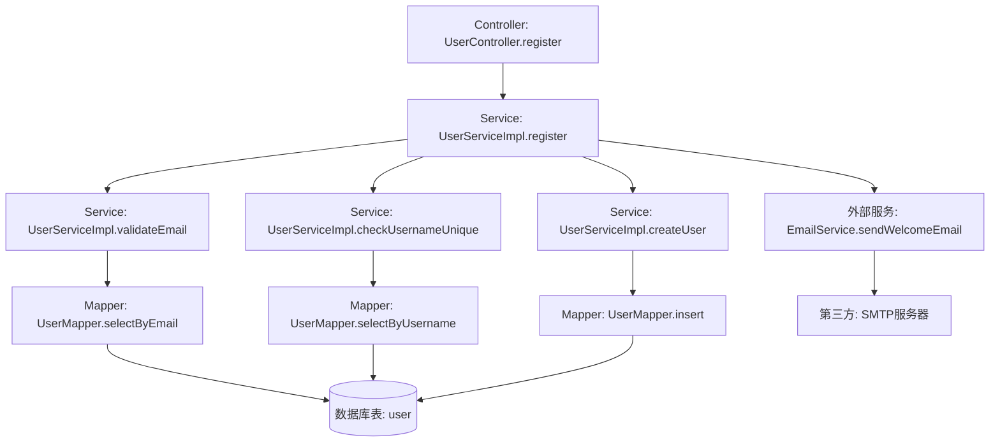
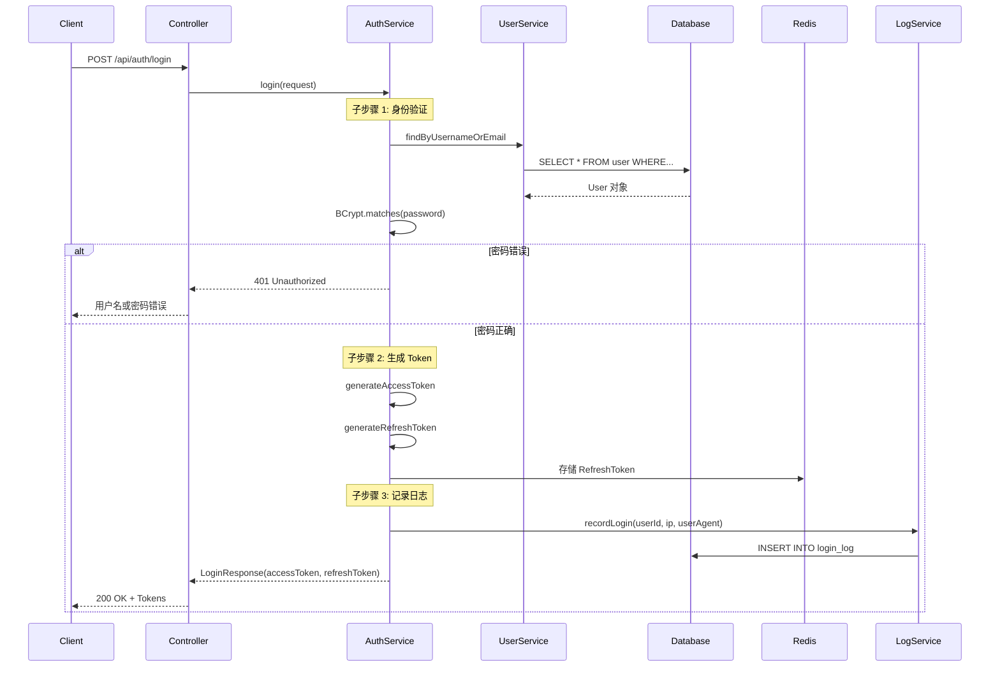
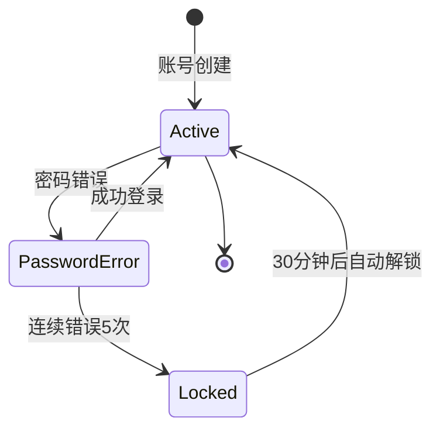
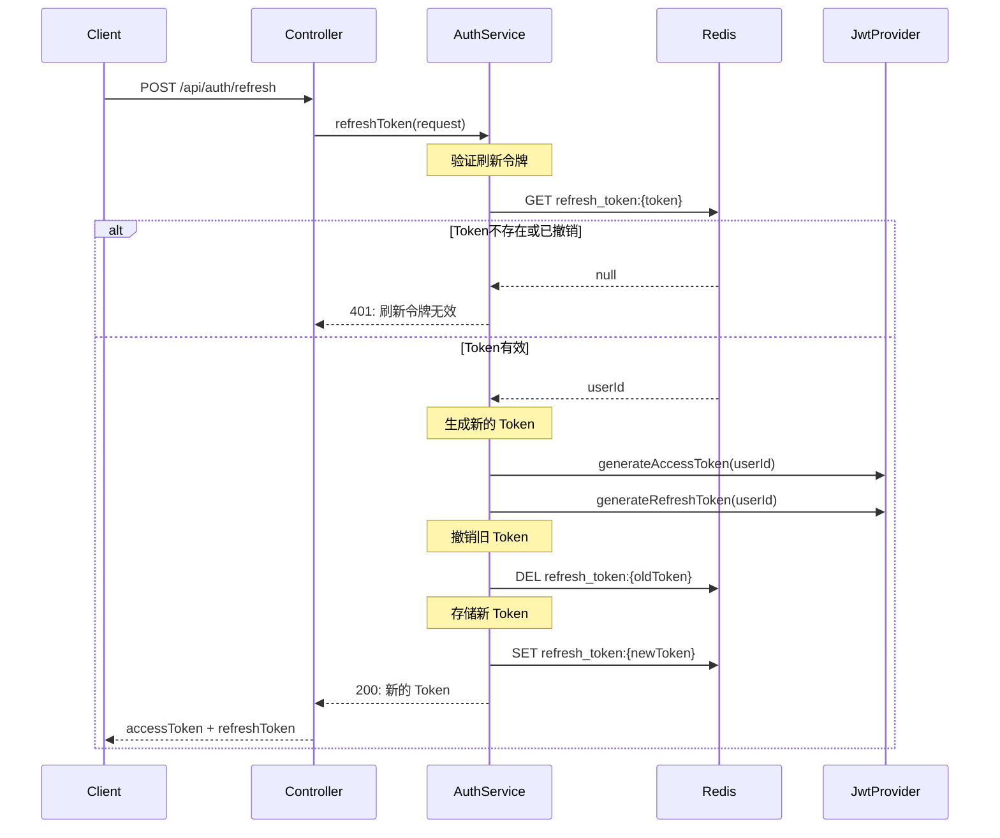
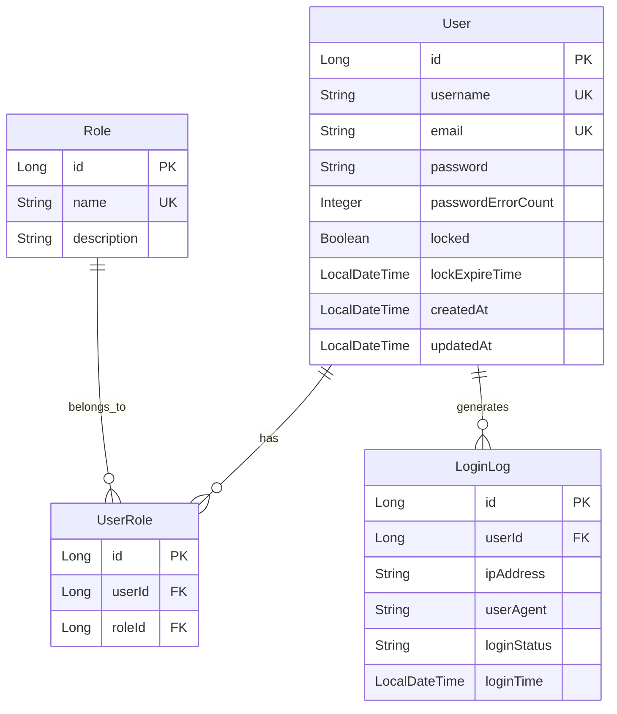
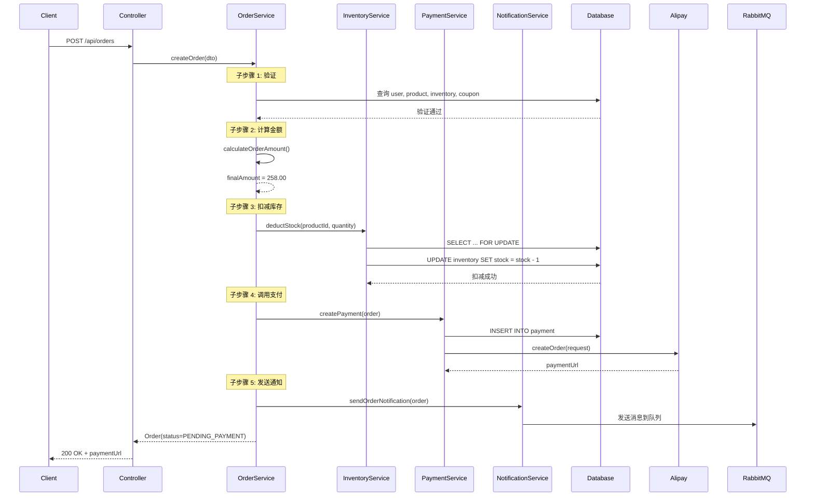

# 代码逆向需求推导示例

完整的代码逆向需求推导示例，展示从代码分析到生成需求文档的全过程。

---

## 示例 1: 电商系统用户管理模块（完整流程）

### 场景描述

**业务背景**: 某电商系统的用户管理模块，提供用户注册、登录、信息管理等核心功能。代码库无文档，需要逆向推导需求。

**技术栈**:
- Spring Boot 3.2.x
- MyBatis-Plus 3.5.x
- MySQL 8.0.x
- Redis 7.0.x
- JWT 认证

**代码规模**:
- Java 文件: 15 个
- 配置文件: 3 个
- 总代码行数: 约 2500 行

---

### 步骤 1: 确定范围

**分析范围**: 用户管理模块（`com.example.user` 包）

**分析重点**: 全面分析（功能需求 + 业务规则 + 数据模型 + 非功能需求）

**业务背景**: 
- 电商系统用户模块
- 支持邮箱/手机号注册
- JWT Token 认证
- 基于角色的权限控制

---

### 步骤 2: 强制读取所有项目文件

#### 2.1 扫描项目目录

```bash
# 执行文件扫描
search_file(pattern="*.java", target_directory="src/main/java/com/example/user")
search_file(pattern="*.yml", target_directory="src/main/resources")
search_file(pattern="*.xml", target_directory="src/main/resources")
```

#### 2.2 文件清单

**扫描结果**:
```
Controller 层（4 个）:
- UserController.java
- AuthController.java
- ProfileController.java
- RoleController.java

Service 层（5 个）:
- UserServiceImpl.java
- AuthServiceImpl.java
- ProfileServiceImpl.java
- RoleServiceImpl.java
- EmailServiceImpl.java

Mapper 层（3 个）:
- UserMapper.java
- UserMapper.xml
- RoleMapper.java

Entity 层（3 个）:
- User.java
- Role.java
- UserRole.java

配置文件（3 个）:
- application.yml
- application-dev.yml
- mybatis-config.xml
```

#### 2.3 批量读取文件

```bash
# 批量读取所有文件
read_file("src/main/java/com/example/user/controller/UserController.java")
read_file("src/main/java/com/example/user/service/UserServiceImpl.java")
read_file("src/main/java/com/example/user/mapper/UserMapper.java")
read_file("src/main/resources/application.yml")
...（共 15 个文件）
```

---

### 步骤 3: 识别技术栈

**Spring Boot 检测**:
```java
// UserController.java
@SpringBootApplication
@RestController
@RequestMapping("/api/users")
```

**MyBatis-Plus 检测**:
```java
// UserMapper.java
@Mapper
public interface UserMapper extends BaseMapper<User> {
}

// User.java
@TableName("user")
public class User {
    @TableId(type = IdType.AUTO)
    private Long id;
}
```

**Redis 检测**:
```yaml
# application.yml
spring:
  redis:
    host: localhost
    port: 6379
```

**技术栈确认**:
- ✅ Spring Boot 3.2.5
- ✅ MyBatis-Plus 3.5.4
- ✅ MySQL 8.0.32
- ✅ Redis 7.0.10
- ✅ JWT (jjwt 0.12.3)

---

### 步骤 4: 功能需求推导（深度方法调用跟踪）

#### FR-001: 用户注册

##### 4.1 从 Controller 提取 API 接口

```java
// UserController.java:45
@PostMapping("/register")
public ApiResponse<UserResponse> register(@Valid @RequestBody RegisterRequest request) {
    UserResponse user = userService.register(request);
    return ApiResponse.success(user);
}
```

**API 接口**:
```
POST /api/users/register

请求参数:
{
  "username": "string (3-20字符)",
  "email": "string (邮箱格式)",
  "password": "string (8-32字符，包含大小写字母、数字)"
}

响应结果:
{
  "code": 200,
  "message": "注册成功",
  "data": {
    "id": 123,
    "username": "john_doe",
    "email": "john@example.com",
    "createdAt": "2025-11-10T10:30:00"
  }
}
```

##### 4.2 深度跟踪方法调用链

**完整调用链**:



**调用链详情**:

**1. 调用层级 1: Controller 入口**
- 位置: `UserController.java:45`
- 方法: `register(RegisterRequest request)`
- 作用: 接收用户注册请求，验证参数

**2. 调用层级 2: Service 主流程**
- 位置: `UserServiceImpl.java:120`
- 方法: `register(RegisterRequest request)`
- 作用: 用户注册主流程编排

**3. 调用层级 3-1: 邮箱验证**
- 位置: `UserServiceImpl.java:150`
- 方法: `validateEmail(String email)`
- 作用: 验证邮箱格式和唯一性
- **子调用 3-1-1**: `userMapper.selectByEmail(email)` (`UserMapper.java:30`)
  - SQL: `SELECT * FROM user WHERE email = #{email}` (`UserMapper.xml:15`)
  - 访问表: `user`

**4. 调用层级 3-2: 用户名唯一性检查**
- 位置: `UserServiceImpl.java:160`
- 方法: `checkUsernameUnique(String username)`
- 作用: 检查用户名是否已存在
- **子调用 3-2-1**: `userMapper.selectByUsername(username)` (`UserMapper.java:35`)
  - SQL: `SELECT * FROM user WHERE username = #{username}` (`UserMapper.xml:20`)
  - 访问表: `user`

**5. 调用层级 3-3: 创建用户**
- 位置: `UserServiceImpl.java:170`
- 方法: `createUser(RegisterRequest request)`
- 作用: 密码加密并插入数据库
- **子调用 3-3-1**: `passwordEncoder.encode(request.getPassword())` (`BCryptPasswordEncoder.java`)
- **子调用 3-3-2**: `userMapper.insert(user)` (`UserMapper.java:25`)
  - SQL: `INSERT INTO user(username, email, password, created_at) VALUES(...)` (`UserMapper.xml:10`)
  - 访问表: `user`

**6. 调用层级 3-4: 发送欢迎邮件（外部服务）**
- 位置: `UserServiceImpl.java:125`
- 方法: `emailService.sendWelcomeEmail(email)`
- 作用: 异步发送欢迎邮件
- **外部调用**: SMTP 服务器（如 SendGrid）

##### 4.3 核心代码片段

```java
// UserServiceImpl.java:120-145
@Transactional(rollbackFor = Exception.class)
public UserResponse register(RegisterRequest request) {
    log.info("用户注册开始，邮箱: {}", request.getEmail());
    
    // 验证邮箱唯一性
    validateEmail(request.getEmail());
    
    // 验证用户名唯一性
    checkUsernameUnique(request.getUsername());
    
    // 创建用户
    User user = createUser(request);
    
    // 异步发送欢迎邮件
    emailService.sendWelcomeEmail(request.getEmail());
    
    log.info("用户注册成功，用户ID: {}", user.getId());
    return convertToResponse(user);
}
```

---

#### FR-002: 用户登录（复杂功能拆分分析）

**复杂度评估**:
- 调用链深度: 5 层
- 涉及数据库表: 3 个 (user, role, login_log)
- 涉及外部服务: 1 个 (Redis)
- 业务阶段: 3 个（验证 → 生成Token → 记录日志）

**拆分为 3 个子步骤分析**:

---

##### 子步骤 1: 用户身份验证

**目标**: 验证用户名/邮箱和密码

**调用链**:
```
AuthController.login (AuthController.java:30)
  ↓
AuthServiceImpl.login (AuthServiceImpl.java:80)
  ↓
UserServiceImpl.findByUsernameOrEmail (UserServiceImpl.java:200)
    ↓
    UserMapper.selectByUsernameOrEmail (UserMapper.java:40) → 表: user
  ↓
PasswordEncoder.matches (BCryptPasswordEncoder.java) → 密码验证
```

**业务规则**:
- **BR-001**: 支持使用用户名或邮箱登录 (`AuthServiceImpl.java:85`)
- **BR-002**: 密码必须使用 BCrypt 验证，不能明文比较 (`AuthServiceImpl.java:90`)
- **BR-003**: 密码错误**禁止**返回具体原因，统一提示"用户名或密码错误" (`AuthServiceImpl.java:95`)
- **BR-004**: 连续密码错误 5 次，账号锁定 30 分钟 (`AuthServiceImpl.java:100`)

**数据流**:
```
输入: LoginRequest (username/email, password)
  ↓ 查询
数据库: user 表
  ↓ 验证
BCrypt.matches(password, user.getPassword())
  ↓ 结果
验证成功/失败
```

---

##### 子步骤 2: 生成 JWT Token

**目标**: 生成访问令牌和刷新令牌

**调用链**:
```
AuthServiceImpl.login (AuthServiceImpl.java:105)
  ↓
JwtTokenProvider.generateAccessToken (JwtTokenProvider.java:50)
    ↓ 生成
    JWT.create().withClaim("userId", user.getId()).sign(algorithm)
  ↓
JwtTokenProvider.generateRefreshToken (JwtTokenProvider.java:70)
  ↓
RedisTemplate.opsForValue().set (Redis 缓存) → 存储 Token
```

**业务规则**:
- **BR-005**: 访问令牌有效期 **2 小时** (`JwtTokenProvider.java:55`)
- **BR-006**: 刷新令牌有效期 **7 天** (`JwtTokenProvider.java:75`)
- **BR-007**: Token **必须**包含用户ID、用户名、角色信息 (`JwtTokenProvider.java:60`)
- **BR-008**: 刷新令牌**必须**存储到 Redis，支持撤销 (`AuthServiceImpl.java:110`)

**Token 结构**:
```json
{
  "userId": 123,
  "username": "john_doe",
  "roles": ["USER"],
  "exp": 1699612800,
  "iat": 1699605600
}
```

---

##### 子步骤 3: 记录登录日志

**目标**: 记录登录行为用于安全审计

**调用链**:
```
AuthServiceImpl.login (AuthServiceImpl.java:115)
  ↓
LoginLogServiceImpl.recordLogin (LoginLogServiceImpl.java:40)
    ↓
    LoginLogMapper.insert (LoginLogMapper.java:20) → 表: login_log
```

**业务规则**:
- **BR-009**: **必须**记录 IP 地址、浏览器、操作系统、登录时间 (`LoginLogServiceImpl.java:45`)
- **BR-010**: 登录失败也**必须**记录（用于安全分析） (`LoginLogServiceImpl.java:50`)
- **BR-011**: 日志保留 **90 天**，超期**自动删除** (`LoginLogServiceImpl.java:55`)

**记录数据**:
```sql
INSERT INTO login_log (
    user_id, ip_address, user_agent, 
    login_status, login_time
) VALUES (
    123, '192.168.1.100', 'Mozilla/5.0...', 
    'SUCCESS', NOW()
)
```

---

**完整业务流程序列图**:



---

### 步骤 5: 业务规则提取（深度分析 + 清晰准确无歧义）

#### BR-020: 用户名规则

**规则类型**: 验证规则

**规则描述** (清晰准确无歧义):
- 用户名**必须**在 3-20 个字符之间（包含边界）
- 用户名**仅允许**包含字母（a-z, A-Z）、数字（0-9）和下划线（_）
- 用户名**禁止**使用特殊字符（如 @、#、$）
- 用户名**必须**唯一，不区分大小写
- 违反时**抛出** `ValidationException`，错误消息: "用户名格式不正确"

**代码位置**: `RegisterRequest.java:15-20`

**实现逻辑**:
```java
// RegisterRequest.java:15
@NotBlank(message = "用户名不能为空")
@Size(min = 3, max = 20, message = "用户名长度必须在3-20之间")
@Pattern(regexp = "^[a-zA-Z0-9_]+$", message = "用户名只能包含字母、数字和下划线")
private String username;

// UserServiceImpl.java:160
if (userMapper.selectByUsername(username.toLowerCase()) != null) {
    throw new BusinessException("用户名已存在");
}
```

**约束条件**:
- **前置条件**: 用户名**必须**为非空字符串
- **后置条件**: 用户名通过验证后存储到数据库（转小写）
- **触发时机**: 用户提交注册表单时

---

#### BR-030: 密码强度规则

**规则类型**: 验证规则

**规则描述** (清晰准确无歧义):
- 密码长度**必须**在 8-32 个字符之间
- 密码**必须**包含至少 1 个小写字母（a-z）
- 密码**必须**包含至少 1 个大写字母（A-Z）
- 密码**必须**包含至少 1 个数字（0-9）
- 密码**应当**包含至少 1 个特殊字符（@$!%*?&）
- 密码**禁止**包含用户名
- 密码**禁止**使用连续字符（如 "123456", "abcdef"）
- 密码使用 BCrypt 加密存储，强度参数 **10**

**代码位置**: `RegisterRequest.java:25-30`, `UserServiceImpl.java:175`

**实现逻辑**:
```java
// RegisterRequest.java:25
@NotBlank(message = "密码不能为空")
@Size(min = 8, max = 32, message = "密码长度必须在8-32之间")
@Pattern(
    regexp = "^(?=.*[a-z])(?=.*[A-Z])(?=.*\\d)(?=.*[@$!%*?&])[A-Za-z\\d@$!%*?&]+$",
    message = "密码必须包含大小写字母、数字和特殊字符"
)
private String password;

// UserServiceImpl.java:175
String encodedPassword = passwordEncoder.encode(request.getPassword());
// BCrypt 强度 10，加密时间约 100ms
```

---

#### BR-040: 账号锁定规则（状态转换）

**规则类型**: 状态转换规则

**规则描述** (清晰准确无歧义):
- **仅当**用户连续密码错误次数 **≥ 5 次**时，系统**自动锁定**账号
- 锁定时长: **30 分钟**
- 锁定期间**禁止**登录，返回错误消息: "账号已锁定，请30分钟后重试"
- 锁定 30 分钟后**自动解锁**
- 成功登录后**重置**错误次数为 0

**业务流程图**:



**代码位置**: `AuthServiceImpl.java:95-110`

**实现逻辑**:
```java
// AuthServiceImpl.java:95
// 检查账号是否锁定
if (user.isLocked() && user.getLockExpireTime().isAfter(LocalDateTime.now())) {
    throw new BusinessException("账号已锁定，请30分钟后重试");
}

// 密码验证失败
if (!passwordEncoder.matches(password, user.getPassword())) {
    user.incrementPasswordErrorCount();
    
    // 连续错误 5 次，锁定账号
    if (user.getPasswordErrorCount() >= 5) {
        user.setLocked(true);
        user.setLockExpireTime(LocalDateTime.now().plusMinutes(30));
    }
    
    userMapper.updateById(user);
    throw new BadCredentialsException("用户名或密码错误");
}

// 登录成功，重置错误次数
user.setPasswordErrorCount(0);
user.setLocked(false);
userMapper.updateById(user);
```

---

#### BR-050: Token 刷新规则（时序依赖）

**规则类型**: 时序依赖规则

**规则描述** (清晰准确无歧义):
- 访问令牌有效期 **2 小时**
- 刷新令牌有效期 **7 天**
- **仅当**访问令牌过期时，**允许**使用刷新令牌获取新的访问令牌
- 刷新令牌**必须**在 Redis 中存在且未被撤销
- 刷新成功后，旧的访问令牌**立即失效**
- 刷新令牌**仅允许使用 1 次**，使用后**自动失效**并生成新的刷新令牌
- **禁止**重复使用已失效的刷新令牌

**业务流程序列图**:



**代码位置**: `AuthServiceImpl.java:150-180`

---

### 步骤 6: 数据需求分析

#### 6.1 实体模型

##### Entity: User

**代码位置**: `User.java`

**字段定义**:
| 字段名 | 类型 | 约束 | 说明 | 代码位置 |
|--------|------|------|------|----------|
| id | Long | @TableId(AUTO) | 主键（自增） | User.java:15 |
| username | String(50) | @NotNull, UNIQUE | 用户名 | User.java:18 |
| email | String(100) | @Email, UNIQUE | 邮箱 | User.java:21 |
| password | String(100) | @NotNull | 密码（BCrypt加密） | User.java:24 |
| passwordErrorCount | Integer | DEFAULT 0 | 密码错误次数 | User.java:27 |
| locked | Boolean | DEFAULT false | 是否锁定 | User.java:30 |
| lockExpireTime | LocalDateTime | NULL | 锁定过期时间 | User.java:33 |
| createdAt | LocalDateTime | @TableField(INSERT) | 创建时间 | User.java:36 |
| updatedAt | LocalDateTime | @TableField(UPDATE) | 更新时间 | User.java:39 |

**索引设计**:
- 主键索引: `PRIMARY KEY (id)`
- 唯一索引: `UNIQUE INDEX idx_username (username)`
- 唯一索引: `UNIQUE INDEX idx_email (email)`
- 普通索引: `INDEX idx_created_at (created_at)`

**关联关系**:
- 多对多: User ↔ Role (通过 user_role 中间表)

#### 6.2 ER 图



---

### 步骤 7: 非功能需求推导

#### NFR-001: 性能要求

**需求描述**: API 响应时间和并发支持

**代码实现**:
- **缓存策略**: 
  - 用户信息缓存 (`UserServiceImpl.java:220` - @Cacheable)
  - Token 存储 (`AuthServiceImpl.java:110` - Redis)
  - 缓存过期时间: **30 分钟**
  
- **分页查询**: 
  - 用户列表分页 (`UserServiceImpl.java:250` - MyBatis-Plus Page)
  - 默认每页 **20 条**，最大 **100 条**
  
- **异步处理**: 
  - 邮件发送异步 (`EmailServiceImpl.java:40` - @Async)
  - 日志记录异步 (`LoginLogServiceImpl.java:60` - @Async)

**性能指标**:
- API 响应时间: **< 200ms** (P95)
- 并发支持: **1000 TPS**
- 缓存命中率: **> 80%**
- 数据库连接池: **最小 10，最大 50**

---

#### NFR-002: 安全要求

**需求描述**: 认证、授权、加密等安全措施

**代码实现**:
- **认证方式**: 
  - JWT Token (`JwtTokenProvider.java:50`)
  - 访问令牌有效期: **2 小时**
  - 刷新令牌有效期: **7 天**
  
- **权限控制**: 
  - 基于角色的权限 (`@PreAuthorize` 注解)
  - 权限粒度: 接口级
  
- **密码加密**: 
  - BCrypt 算法 (`PasswordEncoder.java` - 强度 10)
  - 加密时间: **约 100ms**
  
- **SQL 防护**: 
  - MyBatis 参数化查询 (`#{parameter}`)
  - **禁止**使用字符串拼接 SQL

**安全标准**:
- 密码强度: **必须**包含大小写字母、数字、特殊字符
- 会话超时: **2 小时**（访问令牌过期）
- 权限粒度: **RBAC** (基于角色的访问控制)
- HTTPS: **必须**使用 HTTPS 协议（生产环境）

---

### 步骤 8: 生成需求文档

**输出路径**: `docs/reverse/requirement/user-management-requirements.md`

**文档概览**:
```markdown
# 电商系统 - 用户管理模块需求文档

> 📄 本文档基于代码逆向推导生成，共分析 **15** 个源文件

## 1. 项目概览
- 技术栈: Spring Boot 3.2.5 + MyBatis-Plus 3.5.4
- 代码规模: 15 个 Java 文件，约 2500 行代码
- 已分析文件: Controller (4), Service (5), Mapper (3), Entity (3)

## 2. 功能需求
- FR-001: 用户注册（调用链深度 4 层，涉及 1 个表）
- FR-002: 用户登录（调用链深度 5 层，涉及 3 个表，拆分为 3 个子步骤）
- FR-003: 用户信息修改
- FR-004: 密码重置
- FR-005: Token 刷新

## 3. 业务规则（共 25 条）
- BR-001 ~ BR-010: 验证规则（用户名、密码、邮箱）
- BR-011 ~ BR-020: 状态转换规则（账号锁定、Token 刷新）
- BR-021 ~ BR-025: 计算规则（密码错误次数、锁定时长）

## 4. 数据需求
- 实体: User, Role, UserRole, LoginLog
- ER 图: 完整的实体关系图
- 数据流: 注册、登录、权限验证流程

## 5. 非功能需求
- NFR-001: 性能要求（响应时间 < 200ms，并发 1000 TPS）
- NFR-002: 安全要求（JWT认证，BCrypt加密）
- NFR-003: 可靠性要求（事务管理，异常处理）
```

---

## 示例 2: 订单管理模块（复杂功能拆分）

### 场景描述

**业务背景**: 电商系统订单管理模块，包含订单创建、支付、发货、完成等完整流程。

**复杂度指标**:
- 调用链深度: **6 层**
- 涉及数据库表: **5 个** (order, order_item, product, inventory, user)
- 涉及外部服务: **2 个** (支付网关, 消息队列)
- 业务阶段: **5 个**（验证 → 计算 → 扣库存 → 支付 → 通知）

### 功能拆分分析

根据步骤 4.3 的拆分条件，订单创建功能满足以下条件：
- ✅ 调用链深度 >= 4 层
- ✅ 涉及数据库表 >= 3 个
- ✅ 涉及外部服务 >= 2 个
- ✅ 存在明确的业务阶段

**拆分为 5 个子步骤**:

#### 子步骤 1: 订单信息验证

**目标**: 验证用户、商品、库存、优惠券等前置条件

**调用链**:
```
OrderController.createOrder (OrderController.java:80)
  ↓
OrderServiceImpl.createOrder (OrderServiceImpl.java:200)
  ↓
OrderServiceImpl.validateOrder (OrderServiceImpl.java:250)
    ↓ 验证用户
    UserMapper.selectById (UserMapper.java:20) → 表: user
    ↓ 验证商品
    ProductMapper.selectByIds (ProductMapper.java:30) → 表: product
    ↓ 验证库存
    InventoryMapper.checkStock (InventoryMapper.java:40) → 表: inventory
    ↓ 验证优惠券
    CouponMapper.selectById (CouponMapper.java:25) → 表: coupon
```

**业务规则**:
- **BR-100**: 用户**必须**已登录且已实名认证 (`OrderServiceImpl.java:255`)
- **BR-101**: 商品**必须**在售且未下架 (`OrderServiceImpl.java:260`)
- **BR-102**: 库存**必须**充足 (quantity >= order_quantity) (`OrderServiceImpl.java:265`)
- **BR-103**: 优惠券**必须**有效且未使用 (`OrderServiceImpl.java:270`)

---

#### 子步骤 2: 订单金额计算

**目标**: 计算商品金额、运费、优惠金额、最终金额

**业务规则** (清晰准确):
- **BR-110**: 商品总金额 = Σ(商品i单价 × 商品i数量), i = 1 to N (`OrderServiceImpl.java:310`)
- **BR-111**: 运费计算规则:
  - **仅当**订单总金额 < 99 元时，收取运费 **10 元**
  - **仅当**订单总金额 ≥ 99 元时，**免运费**
  - 代码位置: `FreightServiceImpl.java:55`
- **BR-112**: 优惠金额**不能超过**商品总金额 (`CouponServiceImpl.java:65`)
- **BR-113**: 最终金额 = 商品总金额 + 运费 - 优惠金额 (`OrderServiceImpl.java:320`)

**计算公式**:
```java
// OrderServiceImpl.java:310-320
BigDecimal productAmount = items.stream()
    .map(item -> item.getPrice().multiply(BigDecimal.valueOf(item.getQuantity())))
    .reduce(BigDecimal.ZERO, BigDecimal::add);

BigDecimal freight = productAmount.compareTo(new BigDecimal("99")) >= 0 
    ? BigDecimal.ZERO 
    : new BigDecimal("10");

BigDecimal discount = couponService.calculateDiscount(couponId, productAmount);

BigDecimal finalAmount = productAmount.add(freight).subtract(discount);
```

---

#### 子步骤 3-5: (略，完整流程见示例 1)

---

**完整业务流程序列图** (5 个子步骤串联):



---

## 总结

本文档提供了 2 个完整的代码逆向需求推导示例：

1. **用户管理模块**: 展示完整的 8 步流程（范围 → 扫描 → 技术栈 → 功能 → 业务规则 → 数据 → 非功能 → 生成文档）
2. **订单管理模块**: 展示复杂功能拆分分析（5 个子步骤详细分析）

每个示例都包含：
- 完整的调用链跟踪（Controller → Service → Mapper → 数据库/外部服务）
- 清晰准确无歧义的业务规则描述（使用模态动词、量化指标、精确条件）
- 业务流程图（State Diagram、Flowchart、Sequence Diagram）
- 数据模型和 ER 图
- 非功能需求推导
- 代码位置索引（文件名:行号）

参考这些示例，可以快速掌握代码逆向需求推导的要点和方法。
