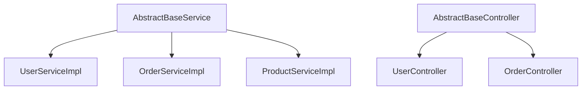

# 抽象类索引

> **覆盖范围**: `{{BASE_PACKAGE}}` 下所有 `abstract class` 定义  
> **文件总数**: {{ABSTRACT_COUNT}}个  
> **代码总行数**: {{ABSTRACT_LOC}} 行  
> **生成时间**: {{SCAN_DATE}}

---

## 一、架构概览

### 目录结构
```
service/
├── AbstractBaseService - 服务层基类
├── AbstractBaseController - 控制器基类
└── ...
```

### 按功能分类
| 功能模块 | 抽象类数量 | 子类数量 |
|---------|-----------|---------|
| 服务基类 | 1 | 5 |
| 控制器基类 | 1 | 3 |

### 继承关系图


---

## 二、详细清单

### AbstractBaseService - 服务层基类

**类路径**: `com.company.project.service.AbstractBaseService`  
**代码行数**: 85 行（SLOC）  
**继承**: `extends Object`（或其他基类）  
**实现**: `implements IBaseService<T>`（如有）  
**泛型参数**: `<T extends BaseEntity, ID extends Serializable>`  
**类注解**: `@Slf4j`

#### 抽象方法（子类必须实现）
| 方法签名 | 返回值 | 说明 |
|---------|--------|------|
| getMapper() | BaseMapper<T> | 返回对应的 Mapper 实例 |

#### 模板方法（可被子类覆盖）
| 方法签名 | 返回值 | 默认行为 |
|---------|--------|----------|
| beforeSave(T entity) | void | 空实现 |
| afterSave(T entity) | void | 空实现 |

#### 具体方法（子类继承）
| 方法签名 | 参数 | 返回值 | 功能 | 调用链 |
|---------|------|--------|------|--------|
| getById(ID id) | id | T | 根据ID查询 | → getMapper().selectById() |
| save(T entity) | entity | void | 保存实体 | → beforeSave() → getMapper().insert() → afterSave() |
| update(T entity) | entity | void | 更新实体 | → getMapper().updateById() |
| deleteById(ID id) | id | void | 删除实体 | → getMapper().deleteById() |

#### 子类列表
| 子类 | 路径 | 说明 |
|------|------|------|
| UserServiceImpl | `com.company.project.service.impl.UserServiceImpl` | 用户服务 |
| OrderServiceImpl | `com.company.project.service.impl.OrderServiceImpl` | 订单服务 |
| ProductServiceImpl | `com.company.project.service.impl.ProductServiceImpl` | 产品服务 |

---

## 三、跨模块依赖

### 本模块 → 其他模块
| 目标模块 | 依赖类 | 依赖方式 |
|----------|--------|----------|
| Mapper层 | BaseMapper | 泛型约束 |
| Entity层 | BaseEntity | 泛型约束 |
| 接口层 | IBaseService | 接口实现 |

### 其他模块 → 本模块
| 来源模块 | 引用类 | 引用方式 |
|----------|--------|----------|
| Service实现层 | UserServiceImpl, OrderServiceImpl | 继承 |

---

## 📚 相关文档

- [接口定义索引](./interface.md) - 接口定义
- [业务逻辑层索引](./business-logic.md) - 子类实现
- [ORM映射器索引](./orm-mapper.md) - Mapper 依赖

---

## 📝 维护记录

| 时间 | 维护人 | 维护内容 | 版本 |
|------|--------|----------|------|
| {{SCAN_DATE}} | AI自动生成 | 初始创建文档 | v1.0 |
