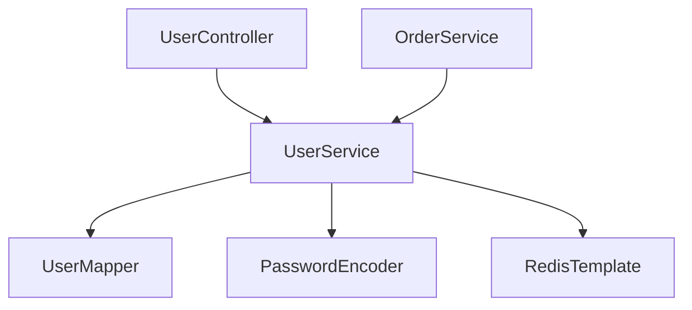

# 业务逻辑层索引

> **覆盖范围**: `{{BASE_PACKAGE}}.service`  
> **文件总数**: {{SERVICE_COUNT}}个  
> **代码总行数**: {{SERVICE_LOC}} 行  
> **生成时间**: {{SCAN_DATE}}

---

## 一、架构概览

### 目录结构
```
service/
├── UserService (接口)
├── impl/
│   └── UserServiceImpl (实现)
└── ...
```

### 按功能分类
| 功能模块 | 接口数量 | 实现数量 | 核心功能 |
|---------|---------|---------|---------|
| 用户管理 | 1 | 1 | 用户增删改查 |

### 依赖关系图


---

## 二、详细清单

### UserServiceImpl - 用户服务

**类路径**: `com.company.project.service.impl.UserServiceImpl`  
**代码行数**: {{CLASS_LOC}} 行（SLOC）  
**继承**: `extends AbstractBaseService<User, Long>`（如有）  
**实现**: `implements UserService`  
**类注解**: `@Service`, `@Slf4j`, `@RequiredArgsConstructor`

#### 依赖注入
| 依赖 | 类型 | 用途 |
|------|------|------|
| userMapper | UserMapper | 用户数据访问 |
| passwordEncoder | PasswordEncoder | 密码加密 |
| redisTemplate | RedisTemplate | 缓存操作 |

#### 方法列表
| 方法签名 | 参数说明 | 返回值 | 功能说明 | 调用链 |
|---------|---------|--------|----------|--------|
| `getUserById(Long id)` | id - 用户ID | `UserVO` | 查询用户详情 | → userMapper.selectById() → UserConverter.toVO() |
| `listUsers(Integer page, Integer size)` | page, size | `PageResult<UserVO>` | 分页查询 | → userMapper.selectPage() |
| `createUser(UserCreateRequest req)` | req - 创建请求 | `Long` | 创建用户 | → passwordEncoder.encode() → userMapper.insert() |
| `updateUser(Long id, UserUpdateRequest req)` | id, req | `void` | 更新用户 | → userMapper.updateById() |
| `deleteUser(Long id)` | id - 用户ID | `void` | 删除用户 | → userMapper.deleteById() |

**事务注解**: `@Transactional(rollbackFor = Exception.class)`

#### 被调用者
| 调用者 | 调用方法 |
|--------|----------|
| UserController | getUserById(), listUsers(), createUser(), updateUser(), deleteUser() |
| OrderService | getUserById() |

---

## 三、跨模块依赖

### 本模块 → 其他模块
| 目标模块 | 依赖类 | 依赖方式 |
|----------|--------|----------|
| Mapper层 | UserMapper, OrderMapper | 注入调用 |
| Entity层 | User, Order | 数据操作 |
| 工具类 | PasswordEncoder, RedisTemplate | 注入调用 |

### 其他模块 → 本模块
| 来源模块 | 调用类 | 调用方法 |
|----------|--------|----------|
| Controller层 | UserController | 全部方法 |
| 其他Service | OrderService | getUserById() |
| Job/Task | UserSyncJob | listUsers() |

---

## 📚 相关文档

- [HTTP API索引](./service-api-http.md) - Controller 调用入口
- [ORM映射器索引](./orm-mapper.md) - Mapper 数据访问
- [Entity对象索引](./entity.md) - 实体定义
- [接口定义索引](./interface.md) - Service 接口定义

---

## 📝 维护记录

| 时间 | 维护人 | 维护内容 | 版本 |
|------|--------|----------|------|
| {{SCAN_DATE}} | AI自动生成 | 初始创建文档 | v1.0 |
