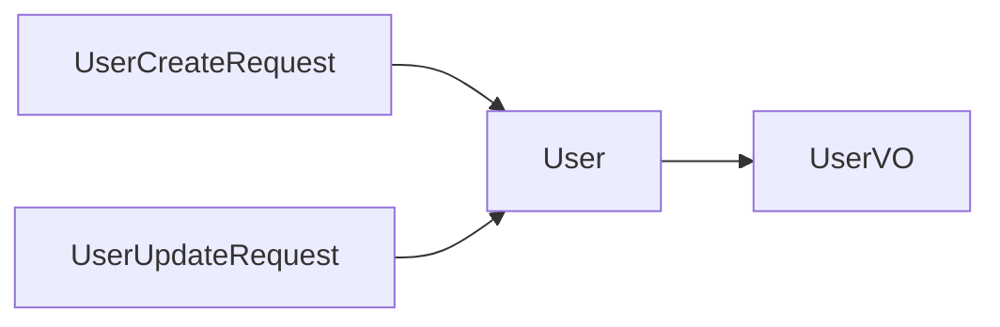

# DTO对象索引

> **覆盖范围**: `{{BASE_PACKAGE}}.dto`  
> **文件总数**: {{DTO_COUNT}}个  
> **代码总行数**: {{DTO_LOC}} 行  
> **生成时间**: {{SCAN_DATE}}

---

## 一、架构概览

### 目录结构
```
dto/
├── request/
│   ├── UserCreateRequest
│   └── UserUpdateRequest
└── response/
    └── UserResponse
```

### 按功能分类
| 功能模块 | Request数量 | Response数量 |
|---------|------------|-------------|
| 用户管理 | 2 | 1 |

### 转换关系图


---

## 二、详细清单

### UserCreateRequest - 创建用户请求

**类路径**: `com.company.project.dto.request.UserCreateRequest`  
**代码行数**: {{CLASS_LOC}} 行（SLOC）  
**继承**: 无  
**实现**: `implements Serializable`  
**类注解**: `@Data`, `@NoArgsConstructor`, `@AllArgsConstructor`

#### 字段列表
| 属性 | 类型 | 校验注解 | 说明 |
|------|------|----------|------|
| username | String | `@NotBlank`, `@Size(min=3, max=50)` | 用户名 |
| password | String | `@NotBlank`, `@Size(min=6, max=20)` | 密码 |
| email | String | `@Email` | 邮箱 |

#### 被引用
| 引用者 | 引用方式 | 用途 |
|--------|----------|------|
| UserController | 方法参数 | 接收请求 |
| UserService | 方法参数 | 业务处理 |

---

### UserUpdateRequest - 更新用户请求

**类路径**: `com.company.project.dto.request.UserUpdateRequest`  
**代码行数**: {{CLASS_LOC}} 行（SLOC）  
**继承**: 无  
**实现**: `implements Serializable`  
**类注解**: `@Data`

#### 字段列表
| 属性 | 类型 | 校验注解 | 说明 |
|------|------|----------|------|
| email | String | `@Email` | 邮箱 |
| phone | String | `@Pattern(regexp="^1[3-9]\\d{9}$")` | 手机号 |

#### 被引用
| 引用者 | 引用方式 | 用途 |
|--------|----------|------|
| UserController | 方法参数 | 接收请求 |
| UserService | 方法参数 | 业务处理 |

---

## 三、跨模块依赖

### 本模块 → 其他模块
| 目标模块 | 依赖类 | 依赖方式 |
|----------|--------|----------|
| 枚举类 | UserStatus | 字段类型 |

### 其他模块 → 本模块
| 来源模块 | 引用类 | 引用方式 |
|----------|--------|----------|
| Controller层 | UserController | 方法参数 |
| Service层 | UserService | 方法参数 |

---

## 📚 相关文档

- [HTTP API索引](./service-api-http.md) - Controller 使用
- [Entity对象索引](./entity.md) - 实体转换
- [Response对象索引](./service-response-object.md) - 响应对象

---

## 📝 维护记录

| 时间 | 维护人 | 维护内容 | 版本 |
|------|--------|----------|------|
| {{SCAN_DATE}} | AI自动生成 | 初始创建文档 | v1.0 |
