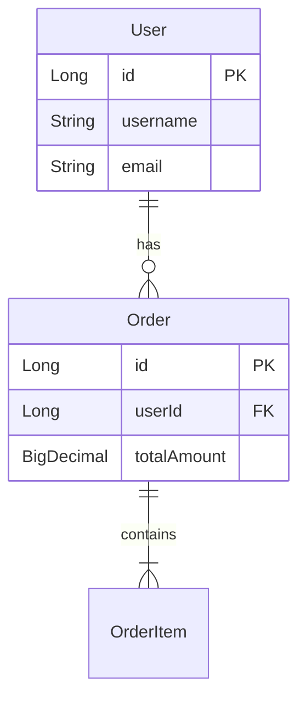

# Entity对象索引

> **覆盖范围**: `{{BASE_PACKAGE}}.entity`  
> **文件总数**: {{ENTITY_COUNT}}个  
> **代码总行数**: {{ENTITY_LOC}} 行  
> **生成时间**: {{SCAN_DATE}}

---

## 一、架构概览

### 目录结构
```
entity/
├── User - 用户实体
├── Order - 订单实体
└── ...
```

### 按功能分类
| 功能模块 | 实体数量 | 对应表 |
|---------|---------|--------|
| 用户管理 | 1 | t_user |

### 实体关系图


---

## 二、详细清单

### User - 用户实体

**类路径**: `com.company.project.entity.User`  
**代码行数**: {{CLASS_LOC}} 行（SLOC）  
**继承**: `extends BaseEntity`（如有）  
**实现**: `implements Serializable`  
**表名**: `t_user`  
**类注解**: `@Data`, `@TableName("t_user")`, `@EqualsAndHashCode(callSuper = true)`

#### 字段列表
| 属性 | 类型 | 注解 | 数据库列 | 说明 |
|------|------|------|----------|------|
| id | Long | `@TableId(type = IdType.AUTO)` | id | 主键 |
| username | String | `@TableField("username")` | username | 用户名 |
| password | String | `@TableField("password")` | password | 密码 |
| email | String | `@TableField("email")` | email | 邮箱 |
| status | Integer | `@TableField("status")` | status | 状态 |
| createdAt | LocalDateTime | `@TableField("created_at")` | created_at | 创建时间 |

#### 被引用
| 引用者 | 引用方式 | 用途 |
|--------|----------|------|
| UserMapper | 泛型参数 | ORM映射 |
| UserServiceImpl | 数据操作 | 业务逻辑 |
| UserVO | 转换源 | 响应封装 |
| UserDTO | 转换目标 | 数据传输 |

---

## 三、跨模块依赖

### 本模块 → 其他模块
| 目标模块 | 依赖类 | 依赖方式 |
|----------|--------|----------|
| 枚举类 | UserStatus | 状态字段类型 |
| 基类 | BaseEntity | 继承 |

### 其他模块 → 本模块
| 来源模块 | 引用类 | 引用方式 |
|----------|--------|----------|
| Mapper层 | UserMapper | 泛型参数 |
| Service层 | UserServiceImpl | 数据操作 |
| DTO层 | UserVO, UserDTO | 对象转换 |

---

## 📚 相关文档

- [ORM映射器索引](./orm-mapper.md) - Mapper 定义
- [DTO对象索引](./dto.md) - 数据传输对象
- [Response对象索引](./service-response-object.md) - 响应对象
- [枚举类索引](./enum.md) - 状态枚举

---

## 📝 维护记录

| 时间 | 维护人 | 维护内容 | 版本 |
|------|--------|----------|------|
| {{SCAN_DATE}} | AI自动生成 | 初始创建文档 | v1.0 |
