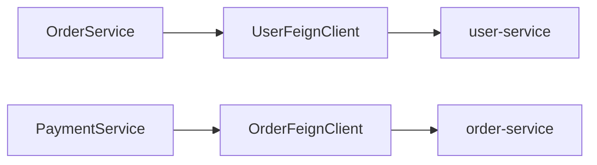

# Feign接口索引

> **覆盖范围**: `{{BASE_PACKAGE}}.feign`  
> **文件总数**: {{FEIGN_COUNT}}个  
> **代码总行数**: {{FEIGN_LOC}} 行  
> **生成时间**: {{SCAN_DATE}}

---

## 一、架构概览

### 目录结构
```
feign/
├── UserFeignClient - 用户服务客户端
├── OrderFeignClient - 订单服务客户端
└── ...
```

### 按服务分类
| 服务名 | 接口数量 | 基础路径 | 超时配置 |
|--------|---------|---------|----------|
| user-service | 3 | `/api/v1/users` | 5000ms |

### 服务调用关系图


---

## 二、详细清单

### UserFeignClient - 用户服务客户端

**类路径**: `com.company.project.feign.UserFeignClient`  
**代码行数**: {{CLASS_LOC}} 行（SLOC）  
**继承**: 无  
**实现**: 无  
**类注解**: `@FeignClient(name = "user-service", fallback = UserFeignClientFallback.class)`  
**服务名**: `user-service`

#### 接口列表
| 方法签名 | HTTP方法 | 路径 | 功能说明 | 调用链 |
|---------|---------|------|----------|--------|
| `getUserById(Long id)` | GET | `/api/v1/users/{id}` | 获取用户详情 | ← OrderServiceImpl.createOrder() |
| `getUserByUsername(String username)` | GET | `/api/v1/users/username/{username}` | 根据用户名查询 | ← AuthService.login() |
| `validateUser(Long id)` | GET | `/api/v1/users/{id}/validate` | 验证用户有效性 | ← PaymentService.pay() |

#### 降级处理
| 降级类 | 路径 |
|--------|------|
| UserFeignClientFallback | `com.company.project.feign.fallback.UserFeignClientFallback` |

#### 被引用
| 引用者 | 引用方式 | 用途 |
|--------|----------|------|
| OrderServiceImpl | 依赖注入 | 查询用户信息 |
| AuthService | 依赖注入 | 用户验证 |

---

## 三、跨模块依赖

### 本模块 → 其他模块
| 目标模块 | 依赖类 | 依赖方式 |
|----------|--------|----------|
| DTO层 | UserVO | 返回类型 |
| 降级处理 | UserFeignClientFallback | 熔断降级 |

### 其他模块 → 本模块
| 来源模块 | 引用类 | 引用方式 |
|----------|--------|----------|
| Service层 | OrderServiceImpl, AuthService | 依赖注入 |

---

## 📚 相关文档

- [业务逻辑层索引](./business-logic.md) - Service 调用
- [Response对象索引](./service-response-object.md) - 返回类型
- [异常类索引](./exception.md) - 远程调用异常

---

## 📝 维护记录

| 时间 | 维护人 | 维护内容 | 版本 |
|------|--------|----------|------|
| {{SCAN_DATE}} | AI自动生成 | 初始创建文档 | v1.0 |
