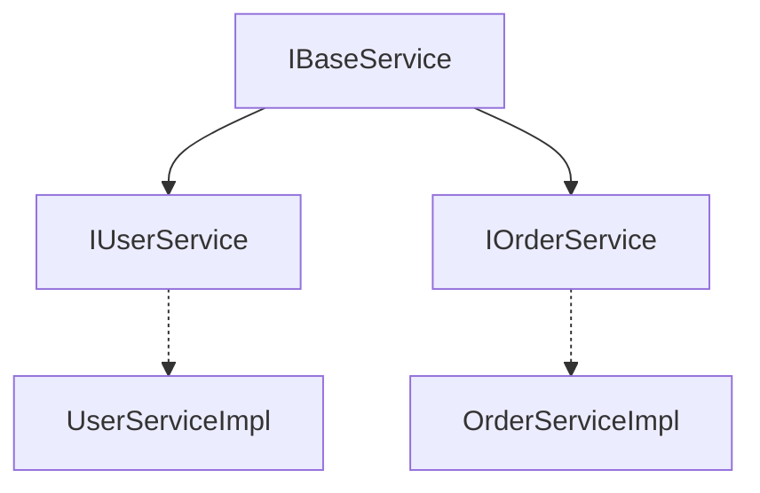

# 接口定义索引

> **覆盖范围**: `{{BASE_PACKAGE}}` 下所有 `interface` 定义  
> **文件总数**: {{INTERFACE_COUNT}}个  
> **代码总行数**: {{INTERFACE_LOC}} 行  
> **生成时间**: {{SCAN_DATE}}

---

## 一、架构概览

### 目录结构
```
service/
├── IUserService - 用户服务接口
├── IOrderService - 订单服务接口
└── ...
```

### 按功能分类
| 功能模块 | 接口数量 | 实现类数量 |
|---------|---------|-----------|
| 用户管理 | 1 | 1 |
| 订单管理 | 1 | 1 |

### 接口继承关系图


---

## 二、详细清单

### IUserService - 用户服务接口

**类路径**: `com.company.project.service.IUserService`  
**代码行数**: 28 行（SLOC）  
**继承**: `extends IBaseService<User>`（如有）  
**类注解**: 无

#### 方法列表
| 方法签名 | 参数 | 返回值 | 功能 |
|---------|------|--------|------|
| getUserById(Long id) | id-用户ID | UserVO | 查询用户详情 |
| createUser(UserDTO dto) | dto-用户信息 | Long | 创建用户 |
| updateUser(Long id, UserDTO dto) | id, dto | void | 更新用户 |
| deleteUser(Long id) | id-用户ID | void | 删除用户 |

#### 实现类
| 实现类 | 路径 | 说明 |
|--------|------|------|
| UserServiceImpl | `com.company.project.service.impl.UserServiceImpl` | 默认实现 |

#### 被引用
| 引用者 | 引用方式 | 用途 |
|--------|----------|------|
| UserController | 依赖注入 | 业务调用 |
| OrderServiceImpl | 依赖注入 | 跨服务调用 |

---

## 三、跨模块依赖

### 本模块 → 其他模块
| 目标模块 | 依赖类 | 依赖方式 |
|----------|--------|----------|
| DTO层 | UserDTO, UserVO | 方法参数/返回值 |
| Entity层 | User | 泛型参数 |

### 其他模块 → 本模块
| 来源模块 | 引用类 | 引用方式 |
|----------|--------|----------|
| Controller层 | UserController | 依赖注入 |
| Service实现层 | UserServiceImpl | 接口实现 |
| 其他Service | OrderServiceImpl | 依赖注入 |

---

## 📚 相关文档

- [业务逻辑层索引](./business-logic.md) - 接口实现
- [抽象类索引](./abstract.md) - 基类定义
- [HTTP API索引](./service-api-http.md) - Controller 调用

---

## 📝 维护记录

| 时间 | 维护人 | 维护内容 | 版本 |
|------|--------|----------|------|
| {{SCAN_DATE}} | AI自动生成 | 初始创建文档 | v1.0 |
