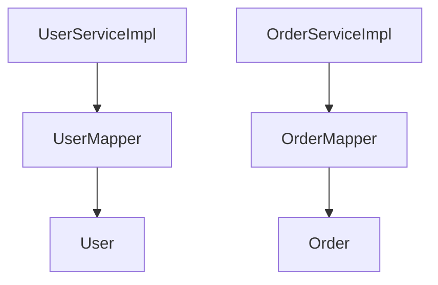

# ORM映射器索引

> **覆盖范围**: `{{BASE_PACKAGE}}.mapper`  
> **文件总数**: {{MAPPER_COUNT}}个  
> **代码总行数**: {{MAPPER_LOC}} 行  
> **生成时间**: {{SCAN_DATE}}

---

## 一、架构概览

### 目录结构
```
mapper/
├── UserMapper
├── OrderMapper
└── ...
```

### 按功能分类
| 功能模块 | Mapper数量 | 继承 |
|---------|-----------|------|
| 用户管理 | 1 | BaseMapper<User> |

### 依赖关系图


---

## 二、详细清单

### UserMapper - 用户数据访问

**类路径**: `com.company.project.mapper.UserMapper`  
**代码行数**: {{CLASS_LOC}} 行（SLOC）  
**继承**: `extends BaseMapper<User>`  
**实现**: 无  
**类注解**: `@Mapper`  
**XML路径**: `src/main/resources/mapper/UserMapper.xml`

#### 自定义方法
| 方法签名 | 参数说明 | 返回值 | 功能说明 | SQL类型 |
|---------|---------|--------|----------|---------|
| `selectUserWithRoles(Long userId)` | userId | `User` | 查询用户及角色 | SELECT |
| `countByStatus(Integer status)` | status | `Integer` | 统计指定状态用户数 | SELECT |
| `batchInsert(List<User> users)` | users | `Integer` | 批量插入 | INSERT |

#### MyBatis-Plus 内置方法
- `selectById(Long id)` - 根据ID查询
- `selectList(Wrapper<User> wrapper)` - 条件查询
- `selectPage(Page<User> page, Wrapper<User> wrapper)` - 分页查询
- `insert(User user)` - 插入
- `updateById(User user)` - 更新
- `deleteById(Long id)` - 删除

#### 被引用
| 引用者 | 引用方式 | 用途 |
|--------|----------|------|
| UserServiceImpl | 依赖注入 | 数据访问 |
| AbstractBaseService | 泛型参数 | 基类方法 |

---

## 三、跨模块依赖

### 本模块 → 其他模块
| 目标模块 | 依赖类 | 依赖方式 |
|----------|--------|----------|
| Entity层 | User | 泛型参数 |
| 基础框架 | BaseMapper | 继承 |

### 其他模块 → 本模块
| 来源模块 | 引用类 | 引用方式 |
|----------|--------|----------|
| Service层 | UserServiceImpl | 依赖注入 |

---

## 📚 相关文档

- [业务逻辑层索引](./business-logic.md) - Service 调用
- [Entity对象索引](./entity.md) - 实体定义
- [抽象类索引](./abstract.md) - 基类依赖

---

## 📝 维护记录

| 时间 | 维护人 | 维护内容 | 版本 |
|------|--------|----------|------|
| {{SCAN_DATE}} | AI自动生成 | 初始创建文档 | v1.0 |
