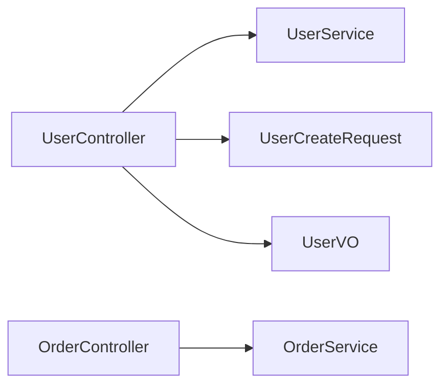

# HTTP API索引

> **覆盖范围**: `{{BASE_PACKAGE}}.controller`  
> **文件总数**: {{CONTROLLER_COUNT}}个  
> **代码总行数**: {{CONTROLLER_LOC}} 行  
> **生成时间**: {{SCAN_DATE}}

---

## 一、架构概览

### 目录结构
```
controller/
├── UserController - 用户管理API
├── OrderController - 订单管理API
└── ...
```

### API版本说明
| 版本 | 基础路径 | 状态 | 说明 |
|------|----------|------|------|
| v1 | `/api/v1` | 稳定 | 当前主要版本 |
| v2 | `/api/v2` | 开发中 | 新版本（如有） |

### 按功能分类
| 功能模块 | Controller | 接口数量 | 基础路径 |
|---------|-----------|---------|---------|
| 用户管理 | UserController | 5 | `/api/v1/users` |

### 依赖关系图


---

## 二、详细清单

### UserController - 用户管理

**类路径**: `com.company.project.controller.UserController`  
**代码行数**: {{CLASS_LOC}} 行（SLOC）  
**继承**: `extends BaseController`（如有）  
**实现**: 无  
**类注解**: `@RestController`, `@RequestMapping("/api/v1/users")`, `@Validated`, `@Tag(name = "用户管理")`  
**基础路径**: `/api/v1/users`

#### 依赖注入
| 依赖 | 类型 | 用途 |
|------|------|------|
| userService | UserService | 用户业务逻辑 |

#### 接口列表
| 接口 | 方法 | 路径 | 权限 | 请求体 | 响应体 | 调用链 |
|------|------|------|------|--------|--------|--------|
| 获取详情 | GET | `/{id}` | USER | - | `Result<UserVO>` | → userService.getUserById() |
| 分页查询 | GET | `/` | ADMIN | - | `Result<PageResult<UserVO>>` | → userService.listUsers() |
| 创建 | POST | `/` | ADMIN | `UserCreateRequest` | `Result<Long>` | → userService.createUser() |
| 更新 | PUT | `/{id}` | ADMIN | `UserUpdateRequest` | `Result<Void>` | → userService.updateUser() |
| 删除 | DELETE | `/{id}` | ADMIN | - | `Result<Void>` | → userService.deleteUser() |

#### 被调用者
- 前端页面、移动端APP、第三方系统

---

## 三、跨模块依赖

### 本模块 → 其他模块
| 目标模块 | 依赖类 | 依赖方式 |
|----------|--------|----------|
| Service层 | UserService, OrderService | 注入调用 |
| Request对象 | UserCreateRequest, UserUpdateRequest | 参数接收 |
| Response对象 | UserVO, OrderVO | 返回封装 |

### 其他模块 → 本模块
| 来源 | 调用方式 |
|------|----------|
| 前端/客户端 | HTTP请求 |
| Feign客户端 | 远程调用（如有） |

---

## 📚 相关文档

- [业务逻辑层索引](./business-logic.md) - Service 层实现
- [Request对象索引](./front-end-request.md) - 请求参数定义
- [Response对象索引](./service-response-object.md) - 响应对象定义
- [异常类索引](./exception.md) - 异常处理

---

## 📝 维护记录

| 时间 | 维护人 | 维护内容 | 版本 |
|------|--------|----------|------|
| {{SCAN_DATE}} | AI自动生成 | 初始创建文档 | v1.0 |
