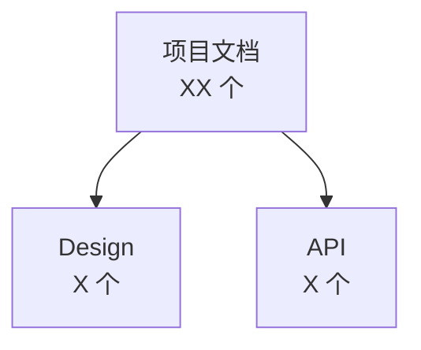

# Skill: 生成项目文档索引

> 📚 **项目记忆引用**
> - 遵循 [项目宪章](mdc:.spec-code/memory/constitution.md) 的核心原则
> - 参考 [开发指南](mdc:.spec-code/memory/guidelines.md) 的 Skill 编写规范
> - 了解 [项目上下文](mdc:.spec-code/memory/context.md) 的技术栈

基于 **文档扫描和分类** 技术，自动生成 **结构化文档索引**，提供 **多维度导航和快速查询**。

## 🎯 目标

解决软件研发中的 **文档管理和检索** 问题，提供 **完整的文档索引系统**。

**适用场景**:
- 项目文档数量多，难以找到目标文档
- 文档缺乏统一的导航和分类
- 需要了解文档之间的关系和依赖
- 新成员需要快速了解项目文档体系

**技术栈**:
- Markdown - 文档格式
- YAML Frontmatter - 元数据定义
- Mermaid - 关系可视化
- Shell/Python - 文档扫描脚本

## 📋 前置条件

- [ ] 项目文档已基本完成
- [ ] 文档使用 Markdown 格式
- [ ] 文档包含 YAML Frontmatter 元数据（推荐）
- [ ] 了解项目的文档组织结构

## 🔄 执行步骤

### 步骤 1: 扫描项目文档

**目标**: 自动扫描项目中的所有文档文件，提取元数据和基本信息。

**操作**:
1. 识别文档存储位置（docs/、spec/、README.md 等）
2. 扫描所有 Markdown 文件
3. 提取 YAML Frontmatter 元数据
4. 记录文档路径、标题、创建/更新时间

**核心代码**（Python）:
```python
import os
import yaml
import re
from pathlib import Path

def scan_documents(root_dir, exclude_dirs=None):
    """扫描所有 Markdown 文档"""
    if exclude_dirs is None:
        exclude_dirs = ['.git', 'node_modules', '.venv', '__pycache__']
    
    documents = []
    for md_file in Path(root_dir).rglob('*.md'):
        if any(excluded in str(md_file) for excluded in exclude_dirs):
            continue
        
        doc_info = extract_metadata(md_file)
        if doc_info:
            documents.append(doc_info)
    
    return documents

def extract_metadata(file_path):
    """提取文档元数据"""
    with open(file_path, 'r', encoding='utf-8') as f:
        content = f.read()
    
    # 提取 YAML Frontmatter
    frontmatter_match = re.match(r'^---\s*\n(.*?)\n---\s*\n', content, re.DOTALL)
    metadata = yaml.safe_load(frontmatter_match.group(1)) if frontmatter_match else {}
    
    # 提取标题
    title_match = re.search(r'^#\s+(.+)$', content, re.MULTILINE)
    title = title_match.group(1) if title_match else file_path.stem
    
    return {
        'path': str(file_path),
        'title': metadata.get('title', title),
        'description': metadata.get('description', ''),
        'category': metadata.get('category', 'uncategorized'),
        'tags': metadata.get('tags', []),
        'updated_at': metadata.get('updated_at', ''),
    }
```

### 步骤 2: 文档分类和分组

**目标**: 根据文档的类型、模块、优先级等维度进行分类。

**操作**:
1. 按文档类型分类（设计文档、API 文档、用户手册等）
2. 按模块分类（前端、后端、数据库等）
3. 按优先级分类（P0-核心文档、P1-重要文档、P2-补充文档）

**分类规则**:
```python
# 文档类型分类规则
TYPE_RULES = {
    'requirements': ['需求', 'requirement', 'PRD', 'spec'],
    'design': ['设计', 'design', 'architecture', '架构'],
    'api': ['API', 'interface', '接口'],
    'tutorial': ['教程', 'tutorial', 'guide', '指南'],
    'reference': ['参考', 'reference', 'standard', '规范']
}

# 优先级分类规则
PRIORITY_RULES = {
    'P0': ['README', 'CHANGELOG', 'constitution', 'guidelines'],
    'P1': ['architecture', 'design', 'api', 'spec'],
    'P2': ['tutorial', 'example', 'reference']
}
```

### 步骤 3: 生成文档索引

**目标**: 根据分类结果生成结构化的文档索引。

**操作**:
1. 生成 Markdown 格式的索引文件
2. 使用表格展示文档列表
3. 添加多维度导航
4. 生成文档关系图（使用 Mermaid）

**索引结构**:
```markdown
# 项目文档索引

**总计文档**: XX 个
**生成时间**: YYYY-MM-DD

## 📖 目录
- [快速导航](#快速导航)
- [按类型分类](#按类型分类)
- [按优先级分类](#按优先级分类)
- [完整文档列表](#完整文档列表)

## 🧭 快速导航
### 核心文档（必读）
- [文档1](path/to/doc1.md)
- [文档2](path/to/doc2.md)

## 按类型分类
### Design (X 个)
| 文档名称 | 路径 | 更新时间 |
|---------|------|----------|
| [文档A](path) | `path` | 2025-11-10 |

## 文档关系图

```

### 步骤 4: 生成导航和统计

**目标**: 提供多维度导航和文档统计信息。

**操作**:
1. 生成按分类的导航菜单
2. 添加文档统计信息（总数、大小、更新频率）
3. 突出显示最近更新的文档

## 💡 最佳实践

### 1. 元数据标准化

✅ **推荐**:
```yaml
---
title: 数据库设计文档
description: 用户管理模块的数据库表设计
category: design
tags: [database, user-management, mysql]
---
```

### 2. 分类规则清晰

**推荐的分类维度**:
- **按类型**: requirements、design、api、implementation、testing、tutorial、reference
- **按模块**: frontend、backend、database、deployment、documentation
- **按优先级**: P0（核心）、P1（重要）、P2（补充）

### 3. 自动化更新

```bash
# 添加到 Git hooks 或 CI/CD
.git/hooks/pre-commit:
#!/bin/bash
python scripts/generate_doc_index.py
git add DOCUMENTATION-INDEX.md
```

## ⚠️ 常见错误

### 错误 1: 遗漏重要文档

**原因**: 扫描路径不完整或排除规则过于严格

**解决**: 只排除非文档目录（.git、node_modules、.venv 等）

### 错误 2: 分类不合理

**原因**: 分类规则不清晰或关键词匹配不准确

**解决**: 使用精确且多样化的关键词，避免过于宽泛的匹配

### 错误 3: 元数据提取失败

**原因**: YAML Frontmatter 格式错误

**解决**: 添加错误处理和回退机制（使用文件名作为标题）

## ✅ 验证清单

**功能验证**:
- [ ] 所有文档已扫描（检查文档数量）
- [ ] 分类准确（抽查 10 个文档的分类）
- [ ] 索引文件生成成功（DOCUMENTATION-INDEX.md 存在）
- [ ] Mermaid 图表可正常渲染

**质量验证**:
- [ ] 索引结构清晰（有目录、分类、统计）
- [ ] 元数据完整（标题、描述、分类、优先级）
- [ ] 链接有效（所有文档链接可点击）
- [ ] 统计信息准确（文档数量、更新时间）

**可用性验证**:
- [ ] 快速导航清晰（核心文档在前）
- [ ] 多维度分类完整（类型、模块、优先级）
- [ ] 自动化更新配置（Git hooks 或 CI/CD）

## 🔗 相关技能

- [doc-git-list](mdc:skills/doc-git-list/SKILL.md) - 生成代码仓库文档索引
- [doc-api-list](mdc:skills/doc-api-list/SKILL.md) - 生成 API 文档索引
- [doc-db-schema](mdc:skills/doc-db-schema/SKILL.md) - 生成数据库表结构文档

## 🔄 版本历史

- **v2.1.0** (2025-11-10): 整合优化版本
  - 整合 v1.0.0 的简洁性和项目记忆引用
  - 保留 v2.0.0 的技术栈和详细说明
  - 精简代码示例，突出核心逻辑
  - 优化最佳实践和常见错误说明
  - 简化验证清单，聚焦关键验证点

- **v2.0.0** (2025-11-07): 软件研发专业化版本
  - 提供完整的 Python 自动化脚本
  - 新增多维度分类和文档关系可视化
  - 新增文档统计和更新频率分析

- **v1.0.0** (2025-11-05): 初始版本
