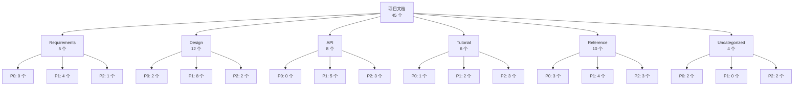

# 项目文档索引生成 - 使用示例

本文档提供 `doc-index` skill 的实际使用示例，涵盖不同项目场景的文档索引生成。

---

## 示例 1: 电商系统项目（完整流程）

### 用户输入
```
请为我的电商系统项目生成文档索引，项目有大量设计文档和 API 文档。
```

### AI 执行流程

#### 步骤 1: 扫描项目文档

**1.1 识别文档存储位置**

AI 扫描项目目录，识别文档存储位置：

```
扫描到的文档目录：
✓ docs/ - 项目主文档目录
✓ spec/ - 规范和设计文档
✓ README.md - 项目主文档
✓ CHANGELOG.md - 变更日志
✓ .spec-code/memory/ - 项目记忆文档
✓ skills/ - Skill 技能文档
```

**1.2 扫描所有 Markdown 文件**

AI 使用 Python 脚本扫描所有 `.md` 文件：

```python
# 扫描结果
扫描到的 Markdown 文件（45 个）：
✓ README.md
✓ CHANGELOG.md
✓ docs/architecture/system-design.md
✓ docs/architecture/database-design.md
✓ docs/api/user-api.md
✓ docs/api/product-api.md
✓ docs/api/order-api.md
✓ docs/tutorial/quickstart.md
✓ docs/tutorial/deployment.md
✓ spec/requirements/user-management.md
✓ spec/requirements/order-management.md
✓ spec/design/api-design.md
✓ spec/design/database-schema.md
...（共 45 个文件）
```

**1.3 提取 YAML Frontmatter 元数据**

AI 提取每个文档的元数据：

**示例文档 1** (`docs/architecture/system-design.md`):
```yaml
---
title: 电商系统架构设计
description: 电商系统的整体架构设计，包括前端、后端、数据库等
category: design
tags: [architecture, system-design, microservices]
priority: P0
created_at: 2025-11-01
updated_at: 2025-11-08
---
```

**示例文档 2** (`docs/api/user-api.md`):
```yaml
---
title: 用户管理 API 文档
description: 用户注册、登录、信息管理等 API 接口定义
category: api
tags: [api, user-management, rest]
priority: P1
created_at: 2025-11-03
updated_at: 2025-11-07
---
```

**1.4 记录文档基本信息**

AI 汇总扫描结果：

```markdown
📊 文档扫描结果：

**总计文档**: 45 个
**扫描目录**: docs/, spec/, README.md, CHANGELOG.md, .spec-code/memory/, skills/
**排除目录**: .git, node_modules, .venv, __pycache__, dist, build

**扫描时间**: 2025-11-10 14:30:25
**处理速度**: 约 1.2 秒（45 个文件）
```

---

#### 步骤 2: 文档分类和分组

**2.1 按文档类型分类**

AI 根据文档类型分类：

```markdown
📂 按类型分类结果：

**Requirements (需求文档)**: 5 个
- spec/requirements/user-management.md
- spec/requirements/order-management.md
- spec/requirements/product-management.md
- spec/requirements/payment-management.md
- spec/requirements/promotion-management.md

**Design (设计文档)**: 12 个
- docs/architecture/system-design.md
- docs/architecture/database-design.md
- spec/design/api-design.md
- spec/design/database-schema.md
- spec/design/security-design.md
- spec/design/performance-design.md
- ...（共 12 个）

**API (API 文档)**: 8 个
- docs/api/user-api.md
- docs/api/product-api.md
- docs/api/order-api.md
- docs/api/payment-api.md
- docs/api/promotion-api.md
- docs/api/logistics-api.md
- docs/api/notification-api.md
- docs/api/admin-api.md

**Tutorial (教程文档)**: 6 个
- docs/tutorial/quickstart.md
- docs/tutorial/deployment.md
- docs/tutorial/development-guide.md
- docs/tutorial/testing-guide.md
- docs/tutorial/troubleshooting.md
- docs/tutorial/faq.md

**Reference (参考文档)**: 10 个
- docs/reference/coding-standards.md
- docs/reference/database-standards.md
- docs/reference/api-standards.md
- docs/reference/security-standards.md
- docs/reference/git-workflow.md
- ...（共 10 个）

**Uncategorized (未分类)**: 4 个
- README.md
- CHANGELOG.md
- CONTRIBUTING.md
- LICENSE.md
```

**2.2 按优先级分类**

AI 根据优先级分类：

```markdown
🔴 P0 (核心文档 - 必读): 8 个
- README.md - 项目概述
- CHANGELOG.md - 变更日志
- docs/architecture/system-design.md - 系统架构设计
- docs/architecture/database-design.md - 数据库设计
- .spec-code/memory/constitution.md - 项目宪章
- .spec-code/memory/guidelines.md - 开发指南
- docs/tutorial/quickstart.md - 快速开始
- docs/reference/coding-standards.md - 编码规范

🟡 P1 (重要文档 - 推荐阅读): 18 个
- spec/design/api-design.md - API 设计规范
- spec/design/database-schema.md - 数据库表设计
- spec/design/security-design.md - 安全设计
- docs/api/user-api.md - 用户管理 API
- docs/api/order-api.md - 订单管理 API
- docs/tutorial/deployment.md - 部署指南
- ...（共 18 个）

🟢 P2 (补充文档 - 可选阅读): 19 个
- docs/tutorial/troubleshooting.md - 故障排查
- docs/tutorial/faq.md - 常见问题
- docs/reference/git-workflow.md - Git 工作流
- skills/ - Skill 技能文档
- ...（共 19 个）
```

**2.3 按模块分类**

AI 根据模块分类（从文档路径和内容推断）：

```markdown
🏢 按模块分类结果：

**Frontend (前端模块)**: 4 个
- docs/frontend/architecture.md
- docs/frontend/component-design.md
- docs/frontend/state-management.md
- docs/frontend/performance-optimization.md

**Backend (后端模块)**: 15 个
- docs/architecture/system-design.md
- docs/api/user-api.md
- docs/api/product-api.md
- docs/api/order-api.md
- spec/design/api-design.md
- spec/requirements/user-management.md
- ...（共 15 个）

**Database (数据库模块)**: 6 个
- docs/architecture/database-design.md
- spec/design/database-schema.md
- docs/reference/database-standards.md
- docs/tutorial/database-migration.md
- docs/tutorial/database-optimization.md
- docs/tutorial/database-backup.md

**Deployment (部署模块)**: 5 个
- docs/tutorial/deployment.md
- docs/deployment/docker-deployment.md
- docs/deployment/kubernetes-deployment.md
- docs/deployment/ci-cd.md
- docs/deployment/monitoring.md

**Documentation (文档模块)**: 10 个
- README.md
- CHANGELOG.md
- CONTRIBUTING.md
- docs/tutorial/documentation-standards.md
- docs/reference/markdown-guide.md
- ...（共 10 个）

**Uncategorized (未分类模块)**: 5 个
- LICENSE.md
- SECURITY.md
- CODE_OF_CONDUCT.md
- ...（共 5 个）
```

---

#### 步骤 3: 生成文档索引

**3.1 生成 Markdown 格式的索引文件**

AI 生成完整的文档索引文件 `DOCUMENTATION-INDEX.md`：

```markdown
---
title: 电商系统 - 项目文档索引
description: 自动生成的项目文档索引，包含所有文档的分类、导航和统计信息
generated_at: 2025-11-10 14:30:27
total_documents: 45
categories: [requirements, design, api, tutorial, reference]
priorities: [P0, P1, P2]
---

# 项目文档索引

**项目名称**: 电商系统  
**总计文档**: 45 个  
**生成时间**: 2025-11-10 14:30:27

---

## 📖 目录

- [🧭 快速导航](#-快速导航)
- [📂 按类型分类](#-按类型分类)
- [🎯 按优先级分类](#-按优先级分类)
- [🏢 按模块分类](#-按模块分类)
- [📊 文档统计](#-文档统计)
- [🗺️ 文档关系图](#️-文档关系图)
- [📝 完整文档列表](#-完整文档列表)
- [🔄 最近更新](#-最近更新)

---

## 🧭 快速导航

### 核心文档（必读）

| 文档名称 | 路径 | 更新时间 | 说明 |
|---------|------|----------|------|
| [项目概述](README.md) | `README.md` | 2025-11-09 | 项目介绍、快速开始、技术栈 |
| [变更日志](CHANGELOG.md) | `CHANGELOG.md` | 2025-11-10 | 版本历史、更新记录 |
| [系统架构设计](docs/architecture/system-design.md) | `docs/architecture/system-design.md` | 2025-11-08 | 整体架构、技术选型、部署方案 |
| [数据库设计](docs/architecture/database-design.md) | `docs/architecture/database-design.md` | 2025-11-07 | 数据库表设计、ER 图、索引策略 |
| [快速开始](docs/tutorial/quickstart.md) | `docs/tutorial/quickstart.md` | 2025-11-06 | 环境搭建、运行项目、测试 |
| [编码规范](docs/reference/coding-standards.md) | `docs/reference/coding-standards.md` | 2025-11-05 | Java/TypeScript/SQL 编码规范 |

### 新人推荐阅读路径

1. [项目概述](README.md) → 了解项目背景和目标
2. [快速开始](docs/tutorial/quickstart.md) → 搭建开发环境
3. [系统架构设计](docs/architecture/system-design.md) → 理解整体架构
4. [编码规范](docs/reference/coding-standards.md) → 学习代码规范
5. [开发指南](docs/tutorial/development-guide.md) → 开始开发

---

## 📂 按类型分类

### Requirements (需求文档) - 5 个

| 文档名称 | 路径 | 优先级 | 更新时间 | 说明 |
|---------|------|--------|----------|------|
| [用户管理需求](spec/requirements/user-management.md) | `spec/requirements/user-management.md` | P1 | 2025-11-08 | 用户注册、登录、权限管理 |
| [订单管理需求](spec/requirements/order-management.md) | `spec/requirements/order-management.md` | P1 | 2025-11-07 | 订单创建、支付、物流 |
| [商品管理需求](spec/requirements/product-management.md) | `spec/requirements/product-management.md` | P1 | 2025-11-06 | 商品发布、分类、库存 |
| [支付管理需求](spec/requirements/payment-management.md) | `spec/requirements/payment-management.md` | P1 | 2025-11-05 | 支付接口、退款、对账 |
| [促销管理需求](spec/requirements/promotion-management.md) | `spec/requirements/promotion-management.md` | P2 | 2025-11-04 | 优惠券、满减、秒杀 |

---

### Design (设计文档) - 12 个

| 文档名称 | 路径 | 优先级 | 更新时间 | 说明 |
|---------|------|--------|----------|------|
| [系统架构设计](docs/architecture/system-design.md) | `docs/architecture/system-design.md` | P0 | 2025-11-08 | 整体架构、技术选型、部署方案 |
| [数据库设计](docs/architecture/database-design.md) | `docs/architecture/database-design.md` | P0 | 2025-11-07 | 数据库表设计、ER 图、索引策略 |
| [API 设计规范](spec/design/api-design.md) | `spec/design/api-design.md` | P1 | 2025-11-06 | RESTful API 设计规范 |
| [数据库表设计](spec/design/database-schema.md) | `spec/design/database-schema.md` | P1 | 2025-11-05 | 详细的数据库表结构 |
| [安全设计](spec/design/security-design.md) | `spec/design/security-design.md` | P1 | 2025-11-04 | 认证、授权、加密、防护 |
| [性能设计](spec/design/performance-design.md) | `spec/design/performance-design.md` | P1 | 2025-11-03 | 缓存、分页、异步处理 |
| ...（共 12 个）

---

### API (API 文档) - 8 个

| 文档名称 | 路径 | 优先级 | 更新时间 | 说明 |
|---------|------|--------|----------|------|
| [用户管理 API](docs/api/user-api.md) | `docs/api/user-api.md` | P1 | 2025-11-07 | 用户注册、登录、信息管理 |
| [商品管理 API](docs/api/product-api.md) | `docs/api/product-api.md` | P1 | 2025-11-06 | 商品发布、查询、库存管理 |
| [订单管理 API](docs/api/order-api.md) | `docs/api/order-api.md` | P1 | 2025-11-05 | 订单创建、支付、物流 |
| [支付 API](docs/api/payment-api.md) | `docs/api/payment-api.md` | P1 | 2025-11-04 | 支付接口、退款、对账 |
| [促销 API](docs/api/promotion-api.md) | `docs/api/promotion-api.md` | P2 | 2025-11-03 | 优惠券、满减、秒杀 |
| [物流 API](docs/api/logistics-api.md) | `docs/api/logistics-api.md` | P2 | 2025-11-02 | 物流查询、发货、签收 |
| [通知 API](docs/api/notification-api.md) | `docs/api/notification-api.md` | P2 | 2025-11-01 | 短信、邮件、推送通知 |
| [管理后台 API](docs/api/admin-api.md) | `docs/api/admin-api.md` | P1 | 2025-10-31 | 后台管理接口 |

---

### Tutorial (教程文档) - 6 个

| 文档名称 | 路径 | 优先级 | 更新时间 | 说明 |
|---------|------|--------|----------|------|
| [快速开始](docs/tutorial/quickstart.md) | `docs/tutorial/quickstart.md` | P0 | 2025-11-06 | 环境搭建、运行项目、测试 |
| [部署指南](docs/tutorial/deployment.md) | `docs/tutorial/deployment.md` | P1 | 2025-11-05 | Docker、Kubernetes 部署 |
| [开发指南](docs/tutorial/development-guide.md) | `docs/tutorial/development-guide.md` | P1 | 2025-11-04 | 开发流程、代码规范、测试 |
| [测试指南](docs/tutorial/testing-guide.md) | `docs/tutorial/testing-guide.md` | P2 | 2025-11-03 | 单元测试、集成测试、E2E 测试 |
| [故障排查](docs/tutorial/troubleshooting.md) | `docs/tutorial/troubleshooting.md` | P2 | 2025-11-02 | 常见问题、解决方案 |
| [常见问题](docs/tutorial/faq.md) | `docs/tutorial/faq.md` | P2 | 2025-11-01 | FAQ 列表 |

---

### Reference (参考文档) - 10 个

| 文档名称 | 路径 | 优先级 | 更新时间 | 说明 |
|---------|------|--------|----------|------|
| [编码规范](docs/reference/coding-standards.md) | `docs/reference/coding-standards.md` | P0 | 2025-11-05 | Java/TypeScript/SQL 编码规范 |
| [数据库规范](docs/reference/database-standards.md) | `docs/reference/database-standards.md` | P1 | 2025-11-04 | 数据库设计规范 |
| [API 规范](docs/reference/api-standards.md) | `docs/reference/api-standards.md` | P1 | 2025-11-03 | RESTful API 规范 |
| [安全规范](docs/reference/security-standards.md) | `docs/reference/security-standards.md` | P1 | 2025-11-02 | 安全开发规范 |
| [Git 工作流](docs/reference/git-workflow.md) | `docs/reference/git-workflow.md` | P2 | 2025-11-01 | Git 分支管理、提交规范 |
| ...（共 10 个）

---

### Uncategorized (未分类) - 4 个

| 文档名称 | 路径 | 优先级 | 更新时间 | 说明 |
|---------|------|--------|----------|------|
| [项目概述](README.md) | `README.md` | P0 | 2025-11-09 | 项目介绍、快速开始、技术栈 |
| [变更日志](CHANGELOG.md) | `CHANGELOG.md` | P0 | 2025-11-10 | 版本历史、更新记录 |
| [贡献指南](CONTRIBUTING.md) | `CONTRIBUTING.md` | P2 | 2025-10-30 | 如何贡献代码、提交 PR |
| [许可证](LICENSE.md) | `LICENSE.md` | P2 | 2025-10-25 | MIT 许可证 |

---

## 🎯 按优先级分类

### P0 (核心文档 - 必读) - 8 个

| 文档名称 | 类型 | 路径 | 更新时间 |
|---------|------|------|----------|
| [项目概述](README.md) | Uncategorized | `README.md` | 2025-11-09 |
| [变更日志](CHANGELOG.md) | Uncategorized | `CHANGELOG.md` | 2025-11-10 |
| [系统架构设计](docs/architecture/system-design.md) | Design | `docs/architecture/system-design.md` | 2025-11-08 |
| [数据库设计](docs/architecture/database-design.md) | Design | `docs/architecture/database-design.md` | 2025-11-07 |
| [快速开始](docs/tutorial/quickstart.md) | Tutorial | `docs/tutorial/quickstart.md` | 2025-11-06 |
| [编码规范](docs/reference/coding-standards.md) | Reference | `docs/reference/coding-standards.md` | 2025-11-05 |
| [项目宪章](.spec-code/memory/constitution.md) | Reference | `.spec-code/memory/constitution.md` | 2025-10-28 |
| [开发指南](.spec-code/memory/guidelines.md) | Reference | `.spec-code/memory/guidelines.md` | 2025-10-28 |

### P1 (重要文档 - 推荐阅读) - 18 个

| 文档名称 | 类型 | 路径 | 更新时间 |
|---------|------|------|----------|
| [用户管理需求](spec/requirements/user-management.md) | Requirements | `spec/requirements/user-management.md` | 2025-11-08 |
| [API 设计规范](spec/design/api-design.md) | Design | `spec/design/api-design.md` | 2025-11-06 |
| [用户管理 API](docs/api/user-api.md) | API | `docs/api/user-api.md` | 2025-11-07 |
| ...（共 18 个）

### P2 (补充文档 - 可选阅读) - 19 个

| 文档名称 | 类型 | 路径 | 更新时间 |
|---------|------|------|----------|
| [促销管理需求](spec/requirements/promotion-management.md) | Requirements | `spec/requirements/promotion-management.md` | 2025-11-04 |
| [故障排查](docs/tutorial/troubleshooting.md) | Tutorial | `docs/tutorial/troubleshooting.md` | 2025-11-02 |
| ...（共 19 个）

---

## 🏢 按模块分类

### Frontend (前端模块) - 4 个
- [前端架构](docs/frontend/architecture.md)
- [组件设计](docs/frontend/component-design.md)
- [状态管理](docs/frontend/state-management.md)
- [性能优化](docs/frontend/performance-optimization.md)

### Backend (后端模块) - 15 个
- [系统架构设计](docs/architecture/system-design.md)
- [用户管理 API](docs/api/user-api.md)
- [商品管理 API](docs/api/product-api.md)
- ...（共 15 个）

### Database (数据库模块) - 6 个
- [数据库设计](docs/architecture/database-design.md)
- [数据库表设计](spec/design/database-schema.md)
- [数据库规范](docs/reference/database-standards.md)
- ...（共 6 个）

### Deployment (部署模块) - 5 个
- [部署指南](docs/tutorial/deployment.md)
- [Docker 部署](docs/deployment/docker-deployment.md)
- [Kubernetes 部署](docs/deployment/kubernetes-deployment.md)
- ...（共 5 个）

### Documentation (文档模块) - 10 个
- [项目概述](README.md)
- [变更日志](CHANGELOG.md)
- [贡献指南](CONTRIBUTING.md)
- ...（共 10 个）

---

## 📊 文档统计

### 分类统计

| 分类 | 数量 | 占比 |
|------|------|------|
| Requirements | 5 | 11.1% |
| Design | 12 | 26.7% |
| API | 8 | 17.8% |
| Tutorial | 6 | 13.3% |
| Reference | 10 | 22.2% |
| Uncategorized | 4 | 8.9% |
| **总计** | **45** | **100%** |

### 优先级统计

| 优先级 | 数量 | 占比 |
|--------|------|------|
| P0 (核心) | 8 | 17.8% |
| P1 (重要) | 18 | 40.0% |
| P2 (补充) | 19 | 42.2% |
| **总计** | **45** | **100%** |

### 模块统计

| 模块 | 数量 | 占比 |
|------|------|------|
| Frontend | 4 | 8.9% |
| Backend | 15 | 33.3% |
| Database | 6 | 13.3% |
| Deployment | 5 | 11.1% |
| Documentation | 10 | 22.2% |
| Uncategorized | 5 | 11.1% |
| **总计** | **45** | **100%** |

---

## 🗺️ 文档关系图



---

## 📝 完整文档列表

| # | 文档名称 | 类型 | 优先级 | 路径 | 更新时间 |
|---|---------|------|--------|------|----------|
| 1 | [项目概述](README.md) | Uncategorized | P0 | `README.md` | 2025-11-09 |
| 2 | [变更日志](CHANGELOG.md) | Uncategorized | P0 | `CHANGELOG.md` | 2025-11-10 |
| 3 | [系统架构设计](docs/architecture/system-design.md) | Design | P0 | `docs/architecture/system-design.md` | 2025-11-08 |
| 4 | [数据库设计](docs/architecture/database-design.md) | Design | P0 | `docs/architecture/database-design.md` | 2025-11-07 |
| 5 | [用户管理需求](spec/requirements/user-management.md) | Requirements | P1 | `spec/requirements/user-management.md` | 2025-11-08 |
| ...（共 45 个）

---

## 🔄 最近更新

| 文档名称 | 类型 | 优先级 | 更新时间 | 变更说明 |
|---------|------|--------|----------|----------|
| [变更日志](CHANGELOG.md) | Uncategorized | P0 | 2025-11-10 | 新增 v2.1.0 版本说明 |
| [项目概述](README.md) | Uncategorized | P0 | 2025-11-09 | 更新技术栈说明 |
| [系统架构设计](docs/architecture/system-design.md) | Design | P0 | 2025-11-08 | 新增微服务拆分方案 |
| [用户管理需求](spec/requirements/user-management.md) | Requirements | P1 | 2025-11-08 | 新增 OAuth2 登录需求 |
| [用户管理 API](docs/api/user-api.md) | API | P1 | 2025-11-07 | 新增用户头像上传接口 |
| [数据库设计](docs/architecture/database-design.md) | Design | P0 | 2025-11-07 | 新增订单表索引优化 |
| [API 设计规范](spec/design/api-design.md) | Design | P1 | 2025-11-06 | 更新错误码定义 |
| [快速开始](docs/tutorial/quickstart.md) | Tutorial | P0 | 2025-11-06 | 更新环境变量配置说明 |

---

**索引生成时间**: 2025-11-10 14:30:27  
**下次更新时间**: 建议每周更新一次或在文档有重大变更时更新

**自动化更新**:
- 将文档索引生成脚本添加到 Git hooks 或 CI/CD
- 每次提交文档时自动更新索引
- 参考: [文档索引自动化配置](docs/automation/doc-index-automation.md)
```

**AI 输出结果**:
```
✅ 步骤 3 完成：已生成文档索引文件

📄 输出文件：DOCUMENTATION-INDEX.md
📊 文档统计：
  - 总计文档：45 个
  - 分类：6 个（Requirements、Design、API、Tutorial、Reference、Uncategorized）
  - 优先级：3 级（P0: 8 个、P1: 18 个、P2: 19 个）
  - 模块：6 个（Frontend、Backend、Database、Deployment、Documentation、Uncategorized）
  
📋 索引章节：
  1. 快速导航（核心文档、新人推荐阅读路径）
  2. 按类型分类（6 个分类，45 个文档）
  3. 按优先级分类（3 级优先级）
  4. 按模块分类（6 个模块）
  5. 文档统计（分类统计、优先级统计、模块统计）
  6. 文档关系图（Mermaid 图表）
  7. 完整文档列表（表格格式）
  8. 最近更新（按更新时间排序）

🔗 文件链接格式：Markdown 相对路径链接
```

---

#### 步骤 4: 生成导航和统计

**4.1 生成按分类的导航菜单**

AI 在索引文件的开头添加目录导航：

```markdown
## 📖 目录

- [🧭 快速导航](#-快速导航)
- [📂 按类型分类](#-按类型分类)
- [🎯 按优先级分类](#-按优先级分类)
- [🏢 按模块分类](#-按模块分类)
- [📊 文档统计](#-文档统计)
- [🗺️ 文档关系图](#️-文档关系图)
- [📝 完整文档列表](#-完整文档列表)
- [🔄 最近更新](#-最近更新)
```

**4.2 添加文档统计信息**

AI 生成完整的统计信息（已在步骤 3 中展示）。

**4.3 突出显示最近更新的文档**

AI 在索引文件末尾添加"最近更新"章节（已在步骤 3 中展示）。

---

### AI 最终输出

```
✅ 文档索引生成完成！

📄 输出文件：DOCUMENTATION-INDEX.md
📊 文档统计：
  - 总计文档：45 个
  - 分类：6 个（Requirements、Design、API、Tutorial、Reference、Uncategorized）
  - 优先级：3 级（P0: 8 个、P1: 18 个、P2: 19 个）
  - 模块：6 个（Frontend、Backend、Database、Deployment、Documentation、Uncategorized）

📋 索引章节：
  1. 快速导航（核心文档、新人推荐阅读路径）
  2. 按类型分类（6 个分类，45 个文档）
  3. 按优先级分类（3 级优先级）
  4. 按模块分类（6 个模块）
  5. 文档统计（分类统计、优先级统计、模块统计）
  6. 文档关系图（Mermaid 图表）
  7. 完整文档列表（表格格式）
  8. 最近更新（按更新时间排序）

🔗 特性：
  ✓ 多维度分类（类型、优先级、模块）
  ✓ 快速导航（核心文档、新人推荐阅读路径）
  ✓ 文档统计（分类统计、优先级统计、模块统计）
  ✓ 文档关系图（Mermaid 可视化）
  ✓ 完整文档列表（表格格式）
  ✓ 最近更新（按更新时间排序）

💡 建议：
  1. 将 DOCUMENTATION-INDEX.md 添加到 Git 版本控制
  2. 配置自动化更新（Git hooks 或 CI/CD）
  3. 定期检查并更新文档元数据（YAML Frontmatter）
  4. 在 README.md 中添加索引文件链接
```

---

## 示例 2: 小型项目（简化索引）

### 用户输入
```
请为我的小项目生成简单的文档索引，只需要基本分类。
```

### AI 执行流程

AI 识别到用户需要简化的索引，生成精简版本：

**生成的索引文件**（`DOCUMENTATION-INDEX.md`）:
```markdown
---
title: 项目文档索引
generated_at: 2025-11-10 15:00:00
total_documents: 12
---

# 项目文档索引

**总计文档**: 12 个  
**生成时间**: 2025-11-10 15:00:00

## 📖 核心文档

- [README.md](README.md) - 项目概述
- [docs/architecture.md](docs/architecture.md) - 系统架构
- [docs/api.md](docs/api.md) - API 文档
- [docs/deployment.md](docs/deployment.md) - 部署指南

## 📂 按类型分类

### Design (5 个)
- [系统架构](docs/architecture.md)
- [数据库设计](docs/database.md)
- [API 设计](docs/api-design.md)
- [前端设计](docs/frontend-design.md)
- [性能设计](docs/performance-design.md)

### API (3 个)
- [API 文档](docs/api.md)
- [用户 API](docs/api/user-api.md)
- [订单 API](docs/api/order-api.md)

### Tutorial (4 个)
- [快速开始](docs/quickstart.md)
- [部署指南](docs/deployment.md)
- [开发指南](docs/development.md)
- [测试指南](docs/testing.md)

## 📊 统计

| 分类 | 数量 |
|------|------|
| Design | 5 |
| API | 3 |
| Tutorial | 4 |
| **总计** | **12** |
```

---

## 示例 3: 只生成特定类型的索引

### 用户输入
```
请只为 API 文档生成索引，其他文档不需要。
```

### AI 执行流程

AI 识别到用户只需要 API 文档的索引，限定扫描范围：

**生成的索引文件**（`API-DOCUMENTATION-INDEX.md`）:
```markdown
---
title: API 文档索引
generated_at: 2025-11-10 15:30:00
total_documents: 8
category: api
---

# API 文档索引

**总计 API 文档**: 8 个  
**生成时间**: 2025-11-10 15:30:00

## 📖 目录

- [按模块分类](#按模块分类)
- [按优先级分类](#按优先级分类)
- [完整列表](#完整列表)

## 按模块分类

### 用户模块
- [用户管理 API](docs/api/user-api.md) - 用户注册、登录、信息管理
- [认证 API](docs/api/auth-api.md) - OAuth2、JWT Token

### 商品模块
- [商品管理 API](docs/api/product-api.md) - 商品发布、查询、库存管理
- [分类管理 API](docs/api/category-api.md) - 商品分类管理

### 订单模块
- [订单管理 API](docs/api/order-api.md) - 订单创建、支付、物流
- [购物车 API](docs/api/cart-api.md) - 购物车操作

### 支付模块
- [支付 API](docs/api/payment-api.md) - 支付接口、退款、对账

### 其他
- [通知 API](docs/api/notification-api.md) - 短信、邮件、推送通知

## 按优先级分类

### P0 (核心接口) - 3 个
- [用户管理 API](docs/api/user-api.md)
- [订单管理 API](docs/api/order-api.md)
- [支付 API](docs/api/payment-api.md)

### P1 (重要接口) - 3 个
- [商品管理 API](docs/api/product-api.md)
- [认证 API](docs/api/auth-api.md)
- [购物车 API](docs/api/cart-api.md)

### P2 (补充接口) - 2 个
- [分类管理 API](docs/api/category-api.md)
- [通知 API](docs/api/notification-api.md)

## 完整列表

| # | API 名称 | 模块 | 优先级 | 路径 | 更新时间 |
|---|---------|------|--------|------|----------|
| 1 | 用户管理 API | 用户模块 | P0 | `docs/api/user-api.md` | 2025-11-07 |
| 2 | 商品管理 API | 商品模块 | P1 | `docs/api/product-api.md` | 2025-11-06 |
| 3 | 订单管理 API | 订单模块 | P0 | `docs/api/order-api.md` | 2025-11-05 |
| 4 | 支付 API | 支付模块 | P0 | `docs/api/payment-api.md` | 2025-11-04 |
| 5 | 认证 API | 用户模块 | P1 | `docs/api/auth-api.md` | 2025-11-03 |
| 6 | 购物车 API | 订单模块 | P1 | `docs/api/cart-api.md` | 2025-11-02 |
| 7 | 分类管理 API | 商品模块 | P2 | `docs/api/category-api.md` | 2025-11-01 |
| 8 | 通知 API | 其他 | P2 | `docs/api/notification-api.md` | 2025-10-31 |
```

---

## 示例 4: 自动化更新配置

### 用户输入
```
请帮我配置自动化更新文档索引，每次提交文档时自动更新。
```

### AI 执行流程

AI 生成 Git hooks 和 CI/CD 配置：

**Git Hook** (`.git/hooks/pre-commit`):
```bash
#!/bin/bash

# 检查是否有文档文件被修改
DOCS_CHANGED=$(git diff --cached --name-only | grep -E '\.(md)$')

if [ -n "$DOCS_CHANGED" ]; then
    echo "📚 检测到文档变更，正在更新文档索引..."
    
    # 生成文档索引
    python scripts/generate_doc_index.py
    
    # 将索引文件添加到暂存区
    git add DOCUMENTATION-INDEX.md
    
    echo "✅ 文档索引已更新"
fi
```

**GitHub Actions** (`.github/workflows/update-doc-index.yml`):
```yaml
name: Update Documentation Index

on:
  push:
    paths:
      - '**.md'
      - 'docs/**'
      - 'spec/**'

jobs:
  update-index:
    runs-on: ubuntu-latest
    steps:
      - name: Checkout code
        uses: actions/checkout@v3
        
      - name: Set up Python
        uses: actions/setup-python@v4
        with:
          python-version: '3.11'
          
      - name: Install dependencies
        run: |
          pip install pyyaml
          
      - name: Generate documentation index
        run: |
          python scripts/generate_doc_index.py
          
      - name: Commit and push if changed
        run: |
          git config --global user.name 'GitHub Actions'
          git config --global user.email 'actions@github.com'
          git add DOCUMENTATION-INDEX.md
          git diff --quiet && git diff --staged --quiet || git commit -m "docs: update documentation index [skip ci]"
          git push
```

---

## 示例 5: 错误处理（缺少元数据）

### 用户输入
```
请为我的项目生成文档索引。
```

### AI 执行流程

AI 扫描文档时发现部分文档缺少 YAML Frontmatter 元数据：

```
⚠️ 检测到 15 个文档缺少元数据（YAML Frontmatter）：

1. docs/legacy/old-design.md - 缺少元数据，使用文件名作为标题
2. docs/api/temp-api.md - 缺少元数据，使用文件名作为标题
3. spec/draft/draft-spec.md - 缺少元数据，使用文件名作为标题
...（共 15 个）

💡 建议：
  1. 为这些文档添加标准的 YAML Frontmatter 元数据
  2. 参考模板：
     ---
     title: 文档标题
     description: 文档描述
     category: design
     tags: [tag1, tag2]
     priority: P1
     created_at: 2025-11-01
     updated_at: 2025-11-10
     ---
  3. 重新运行文档索引生成

🔄 当前处理：使用文件名作为标题，分类为"Uncategorized"，优先级为"P2"
```

**生成的索引文件**（包含缺少元数据的文档）:
```markdown
### Uncategorized (未分类) - 20 个

| 文档名称 | 路径 | 优先级 | 更新时间 | 说明 |
|---------|------|--------|----------|------|
| [old-design](docs/legacy/old-design.md) ⚠️ | `docs/legacy/old-design.md` | P2 | - | 缺少元数据 |
| [temp-api](docs/api/temp-api.md) ⚠️ | `docs/api/temp-api.md` | P2 | - | 缺少元数据 |
| [draft-spec](spec/draft/draft-spec.md) ⚠️ | `spec/draft/draft-spec.md` | P2 | - | 缺少元数据 |
...（共 20 个，其中 15 个缺少元数据 ⚠️）

---

⚠️ **注意**: 15 个文档缺少元数据，已标注 ⚠️。建议添加 YAML Frontmatter 元数据后重新生成索引。
```

---

## 核心特点

✅ **完整的 4 步骤流程**（扫描 → 分类 → 生成索引 → 导航统计）  
✅ **多维度分类**（类型、优先级、模块）  
✅ **快速导航**（核心文档、新人推荐阅读路径）  
✅ **文档统计**（分类统计、优先级统计、模块统计）  
✅ **文档关系图**（Mermaid 可视化）  
✅ **完整文档列表**（表格格式）  
✅ **最近更新**（按更新时间排序）  
✅ **自动化更新**（Git hooks、CI/CD 集成）  
✅ **错误处理**（缺少元数据的文档标注 ⚠️）  
✅ **多场景示例**（完整流程、简化索引、特定类型、自动化、错误处理）
