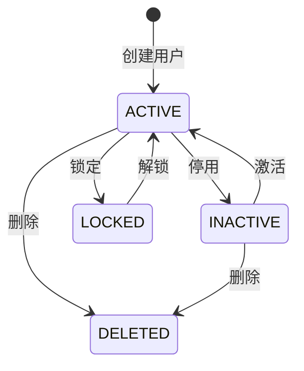

# 第三方 API 文档生成示例

本文档提供 3 个完整的第三方 API 文档生成示例，涵盖不同场景和复杂度。

---

## 示例 1: 用户管理模块（单文档模式）

**场景**: 用户管理模块只有 3 个核心接口（创建用户、获取用户详情、更新用户），适合生成单文档。

### 1.1 代码分析结果

```
Controller: UserController
接口数量: 3
重要程度: P0（核心接口）

接口清单:
1. POST /api/users - 创建用户（P0）
2. GET /api/users/{id} - 获取用户详情（P0）
3. PUT /api/users/{id} - 更新用户（P0）

文档策略: 单文档模式（接口 ≤ 5）
文档长度: 约 1500-2000 行
```

### 1.2 生成的文档结构

**文件名**: `user-management-api-guide.md`

**文档结构**:

```markdown
# 用户管理模块 - 第三方 API 使用文档

> **文档版本**: v1.0.0  
> **最后更新**: 2025-11-10  
> **目标受众**: 第三方开发者、系统集成工程师

## 📖 目录

1. 接入概览
2. 接口详细说明
3. 代码示例集合
4. 数据模型定义
5. 集成指南
6. 错误处理指南
7. 配置说明
8. FAQ 和故障排查

---

## 1. 接入概览

### 1.1 基础信息

- **模块名称**: 用户管理模块
- **模块标识**: user-management
- **版本**: v1.0.0
- **负责人**: user-team@example.com

### 1.2 功能概述

用户管理模块提供用户的创建、查询、更新功能，支持第三方系统进行用户信息管理。

**核心职责**:
- 用户账号创建和验证
- 用户信息查询和更新
- 用户状态管理

**业务场景**:
- 第三方系统用户同步
- 单点登录（SSO）集成
- 用户信息共享

### 1.3 快速开始（5 分钟入门）

**步骤 1**: 准备环境

```bash
# 获取 API Key（联系管理员）
export API_KEY="your_api_key_here"
export BASE_URL="https://api.example.com"
```

**步骤 2**: 创建用户

```bash
curl -X POST "$BASE_URL/api/users" \
  -H "Authorization: Bearer $API_KEY" \
  -H "Content-Type: application/json" \
  -d '{
    "username": "john_doe",
    "email": "john@example.com",
    "password": "SecurePass123!"
  }'
```

**步骤 3**: 验证结果

```json
{
  "id": 1001,
  "username": "john_doe",
  "email": "john@example.com",
  "status": "ACTIVE",
  "createdAt": "2025-11-10T10:00:00Z"
}
```

### 1.4 技术要求

- **HTTP 协议**: HTTP/1.1 或 HTTP/2
- **认证方式**: Bearer Token（API Key）
- **数据格式**: JSON
- **字符编码**: UTF-8

---

## 2. 接口详细说明

### 2.1 接口清单

| 接口名称 | HTTP 方法 | 路径 | 功能描述 | 重要程度 | 权限要求 |
|---------|----------|------|---------|---------|---------|
| 创建用户 | POST | /api/users | 创建新用户账号 | P0 | WRITE |
| 获取用户详情 | GET | /api/users/{id} | 获取指定用户信息 | P0 | READ |
| 更新用户 | PUT | /api/users/{id} | 更新用户信息 | P0 | WRITE |

### 2.2 核心接口详情

#### 2.2.1 创建用户

**基础信息**:
- **接口路径**: POST /api/users
- **功能描述**: 创建新用户账号
- **调用频率限制**: 100 次/分钟
- **SLA 保障**: 99.9% 可用性，响应时间 < 500ms

**运行时特性**:
- **幂等性**: 非幂等（重复调用会创建多个用户）
- **事务支持**: 是（创建失败会回滚）
- **异步特性**: 否（同步返回结果）

**请求规范**:

```http
POST /api/users
Authorization: Bearer {API_KEY}
Content-Type: application/json

{
  "username": "john_doe",          // 必需，3-20 个字符
  "email": "john@example.com",     // 必需，有效的邮箱地址
  "password": "SecurePass123!",    // 必需，至少 8 个字符
  "firstName": "John",             // 可选
  "lastName": "Doe"                // 可选
}
```

**参数说明**:

| 参数名 | 类型 | 必需 | 默认值 | 说明 | 验证规则 |
|-------|------|------|-------|------|---------|
| username | string | 是 | - | 用户名 | 3-20 个字符，字母数字下划线 |
| email | string | 是 | - | 邮箱地址 | 有效的邮箱格式 |
| password | string | 是 | - | 密码 | 至少 8 个字符，包含字母和数字 |
| firstName | string | 否 | - | 名字 | 最多 50 个字符 |
| lastName | string | 否 | - | 姓氏 | 最多 50 个字符 |

**响应规范**:

成功响应（201 Created）:
```json
{
  "id": 1001,
  "username": "john_doe",
  "email": "john@example.com",
  "firstName": "John",
  "lastName": "Doe",
  "status": "ACTIVE",
  "createdAt": "2025-11-10T10:00:00Z",
  "updatedAt": "2025-11-10T10:00:00Z"
}
```

错误响应（400 Bad Request）:
```json
{
  "code": "VALIDATION_ERROR",
  "message": "参数验证失败",
  "details": {
    "username": "用户名长度必须在 3-20 个字符之间",
    "password": "密码必须包含字母和数字"
  }
}
```

**异常说明**:

| 错误码 | HTTP 状态码 | 触发条件 | 处理建议 |
|-------|------------|---------|---------|
| VALIDATION_ERROR | 400 | 参数验证失败 | 检查请求参数格式 |
| DUPLICATE_USERNAME | 409 | 用户名已存在 | 更换用户名 |
| DUPLICATE_EMAIL | 409 | 邮箱已存在 | 更换邮箱 |
| RATE_LIMIT_EXCEEDED | 429 | 超过频率限制 | 延迟后重试 |

---

## 3. 代码示例集合

### 3.1 创建用户 - 基础层（cURL）

```bash
# 最简单的调用方式，快速验证接口
curl -X POST "https://api.example.com/api/users" \
  -H "Authorization: Bearer YOUR_API_KEY" \
  -H "Content-Type: application/json" \
  -d '{
    "username": "john_doe",
    "email": "john@example.com",
    "password": "SecurePass123!"
  }'
```

### 3.2 创建用户 - 进阶层（JavaScript）

```javascript
// 使用 axios 库调用接口
const axios = require('axios');

async function createUser(userData) {
  try {
    const response = await axios.post(
      'https://api.example.com/api/users',
      userData,
      {
        headers: {
          'Authorization': `Bearer ${process.env.API_KEY}`,
          'Content-Type': 'application/json'
        }
      }
    );
    
    console.log('用户创建成功:', response.data);
    return response.data;
  } catch (error) {
    console.error('用户创建失败:', error.response?.data || error.message);
    throw error;
  }
}

// 调用示例
const newUser = {
  username: 'john_doe',
  email: 'john@example.com',
  password: 'SecurePass123!',
  firstName: 'John',
  lastName: 'Doe'
};

createUser(newUser);
```

### 3.3 创建用户 - 完整层（Python）

```python
import requests
import time
import os
from typing import Dict, Optional

class UserAPIClient:
    """用户 API 客户端（生产环境最佳实践）"""
    
    def __init__(self, base_url: str, api_key: str):
        self.base_url = base_url
        self.api_key = api_key
        self.session = requests.Session()
        self.session.headers.update({
            'Authorization': f'Bearer {api_key}',
            'Content-Type': 'application/json'
        })
    
    def create_user(
        self,
        username: str,
        email: str,
        password: str,
        first_name: Optional[str] = None,
        last_name: Optional[str] = None,
        max_retries: int = 3
    ) -> Dict:
        """
        创建用户（包含完整的错误处理和重试逻辑）
        
        Args:
            username: 用户名（3-20 个字符）
            email: 邮箱地址
            password: 密码（至少 8 个字符）
            first_name: 名字（可选）
            last_name: 姓氏（可选）
            max_retries: 最大重试次数
        
        Returns:
            创建的用户信息
        
        Raises:
            ValueError: 参数验证失败
            RuntimeError: 创建失败
        """
        # 参数验证
        if not (3 <= len(username) <= 20):
            raise ValueError('用户名长度必须在 3-20 个字符之间')
        if len(password) < 8:
            raise ValueError('密码至少 8 个字符')
        
        # 构造请求数据
        data = {
            'username': username,
            'email': email,
            'password': password
        }
        if first_name:
            data['firstName'] = first_name
        if last_name:
            data['lastName'] = last_name
        
        # 重试逻辑
        for attempt in range(max_retries):
            try:
                response = self.session.post(
                    f'{self.base_url}/api/users',
                    json=data,
                    timeout=10
                )
                
                # 成功响应
                if response.status_code == 201:
                    return response.json()
                
                # 客户端错误（不重试）
                if 400 <= response.status_code < 500:
                    error_data = response.json()
                    raise ValueError(
                        f'参数错误: {error_data.get("message")}'
                    )
                
                # 服务器错误（重试）
                if response.status_code >= 500:
                    if attempt < max_retries - 1:
                        wait_time = 2 ** attempt  # 指数退避
                        print(f'服务器错误，{wait_time}秒后重试...')
                        time.sleep(wait_time)
                        continue
                    raise RuntimeError('服务器错误，重试次数已用尽')
            
            except requests.Timeout:
                if attempt < max_retries - 1:
                    print('请求超时，1秒后重试...')
                    time.sleep(1)
                    continue
                raise RuntimeError('请求超时，重试次数已用尽')
            
            except requests.RequestException as e:
                raise RuntimeError(f'网络错误: {str(e)}')
        
        raise RuntimeError('创建用户失败')

# 使用示例
if __name__ == '__main__':
    # 环境变量配置
    BASE_URL = os.getenv('API_BASE_URL', 'https://api.example.com')
    API_KEY = os.getenv('API_KEY')
    
    if not API_KEY:
        raise ValueError('请设置 API_KEY 环境变量')
    
    # 创建客户端
    client = UserAPIClient(BASE_URL, API_KEY)
    
    # 创建用户
    try:
        user = client.create_user(
            username='john_doe',
            email='john@example.com',
            password='SecurePass123!',
            first_name='John',
            last_name='Doe'
        )
        print(f'用户创建成功: {user}')
    except Exception as e:
        print(f'用户创建失败: {e}')
```

### 3.4 完整业务流程示例

```python
# 完整的用户管理流程：创建 → 查询 → 更新
import requests
import os

BASE_URL = os.getenv('API_BASE_URL', 'https://api.example.com')
API_KEY = os.getenv('API_KEY')

headers = {
    'Authorization': f'Bearer {API_KEY}',
    'Content-Type': 'application/json'
}

# 步骤 1: 创建用户
print('步骤 1: 创建用户')
create_response = requests.post(
    f'{BASE_URL}/api/users',
    json={
        'username': 'john_doe',
        'email': 'john@example.com',
        'password': 'SecurePass123!',
        'firstName': 'John',
        'lastName': 'Doe'
    },
    headers=headers
)
user = create_response.json()
user_id = user['id']
print(f'用户创建成功，ID: {user_id}')

# 步骤 2: 查询用户详情
print(f'\n步骤 2: 查询用户详情（ID: {user_id}）')
get_response = requests.get(
    f'{BASE_URL}/api/users/{user_id}',
    headers=headers
)
user_detail = get_response.json()
print(f'用户详情: {user_detail}')

# 步骤 3: 更新用户信息
print(f'\n步骤 3: 更新用户信息（ID: {user_id}）')
update_response = requests.put(
    f'{BASE_URL}/api/users/{user_id}',
    json={
        'firstName': 'John',
        'lastName': 'Smith'  # 更新姓氏
    },
    headers=headers
)
updated_user = update_response.json()
print(f'用户更新成功: {updated_user}')
```

---

## 4. 数据模型定义

### 4.1 用户对象（User）

```json
{
  "id": 1001,                      // 用户 ID（整数，自动生成）
  "username": "john_doe",          // 用户名（字符串，3-20 字符）
  "email": "john@example.com",     // 邮箱（字符串，有效邮箱格式）
  "firstName": "John",             // 名字（字符串，可选）
  "lastName": "Doe",               // 姓氏（字符串，可选）
  "status": "ACTIVE",              // 状态（枚举，见下文）
  "createdAt": "2025-11-10T10:00:00Z",  // 创建时间（ISO 8601 格式）
  "updatedAt": "2025-11-10T10:00:00Z"   // 更新时间（ISO 8601 格式）
}
```

### 4.2 用户状态枚举（UserStatus）

| 状态值 | 含义 | 说明 |
|-------|------|------|
| ACTIVE | 激活 | 用户正常使用 |
| INACTIVE | 停用 | 用户已停用 |
| LOCKED | 锁定 | 用户被锁定（如密码错误次数过多） |
| DELETED | 已删除 | 用户已删除（软删除） |

**状态流转图**:



---

## 5. 集成指南

### 5.1 接入步骤

**准备工作**:
1. 获取 API Key（联系管理员）
2. 配置环境变量（BASE_URL、API_KEY）
3. 安装依赖（如 axios、requests）

**开发步骤**:
1. 创建 API 客户端类
2. 实现错误处理和重试逻辑
3. 编写单元测试

**测试验证**:
1. 在测试环境验证接口调用
2. 测试错误场景（参数错误、频率限制）
3. 测试重试逻辑

**上线检查**:
1. 检查生产环境配置
2. 设置监控和告警
3. 准备回滚方案

### 5.2 依赖关系

**上游依赖**:
- 无（用户管理模块独立运行）

**下游影响**:
- 认证模块（用户创建后可用于登录）
- 订单模块（用户创建后可创建订单）

### 5.3 最佳实践

**性能优化**:
- QPS 限制: 100 次/分钟
- 批量创建: 使用批量接口（如适用）
- 缓存策略: 缓存用户详情（TTL 5 分钟）

**安全建议**:
- 凭证管理: 使用环境变量存储 API Key
- 数据加密: 密码使用 HTTPS 传输
- 敏感信息: 不记录密码到日志

**监控建议**:
- 关键指标: API 调用成功率、响应时间、错误率
- 日志规范: 记录请求 ID、用户 ID、操作类型
- 告警设置: 错误率 > 5% 触发告警

---

## 6. 错误处理指南

### 6.1 错误码表

| 错误码 | HTTP 状态码 | 描述 | 触发条件 | 解决方案 | 可重试 |
|-------|------------|------|---------|---------|-------|
| VALIDATION_ERROR | 400 | 参数验证失败 | 参数格式错误 | 检查参数格式 | 否 |
| DUPLICATE_USERNAME | 409 | 用户名已存在 | 用户名重复 | 更换用户名 | 否 |
| DUPLICATE_EMAIL | 409 | 邮箱已存在 | 邮箱重复 | 更换邮箱 | 否 |
| RATE_LIMIT_EXCEEDED | 429 | 超过频率限制 | 请求过于频繁 | 延迟后重试 | 是 |
| INTERNAL_SERVER_ERROR | 500 | 服务器内部错误 | 服务器故障 | 稍后重试 | 是 |

### 6.2 重试策略

**重试场景**:
- 5xx 服务器错误（INTERNAL_SERVER_ERROR）
- 429 频率限制（RATE_LIMIT_EXCEEDED）
- 网络超时

**重试算法**:
- 指数退避: 第 1 次重试 1 秒，第 2 次重试 2 秒，第 3 次重试 4 秒
- 最大重试次数: 3 次
- 超时时间: 10 秒

---

## 7. FAQ

**Q1: 如何处理用户名重复错误？**

A: 捕获 `DUPLICATE_USERNAME` 错误码，提示用户更换用户名。

```python
try:
    user = client.create_user(username='john_doe', ...)
except ValueError as e:
    if 'DUPLICATE_USERNAME' in str(e):
        print('用户名已存在，请更换用户名')
```

**Q2: 密码有什么要求？**

A: 密码必须至少 8 个字符，包含字母和数字。推荐使用更复杂的密码（包含大小写字母、数字、特殊字符）。

**Q3: 如何处理频率限制？**

A: 当收到 `RATE_LIMIT_EXCEEDED` 错误时，延迟 1 分钟后重试。建议实现令牌桶算法控制请求频率。

---

**文档版本**: v1.0.0  
**最后更新**: 2025-11-10
```

---

## 示例 2: 订单管理模块（分卷模式）

**场景**: 订单管理模块有 12 个接口（创建订单、查询订单、更新订单、取消订单、支付订单、退款订单、订单列表、订单统计等），适合生成分卷文档。

### 2.1 代码分析结果

```
Controller: OrderController
接口数量: 12
重要程度: P0（6个）、P1（4个）、P2（2个）

接口清单:
P0 核心接口（6个）:
1. POST /api/orders - 创建订单
2. GET /api/orders/{id} - 获取订单详情
3. PUT /api/orders/{id} - 更新订单
4. POST /api/orders/{id}/cancel - 取消订单
5. POST /api/orders/{id}/pay - 支付订单
6. POST /api/orders/{id}/refund - 退款订单

P1 重要接口（4个）:
7. GET /api/orders - 获取订单列表
8. GET /api/orders/stats - 订单统计
9. POST /api/orders/{id}/ship - 发货
10. POST /api/orders/{id}/confirm - 确认收货

P2 次要接口（2个）:
11. GET /api/orders/{id}/logs - 获取订单日志
12. POST /api/orders/{id}/comment - 订单评论

文档策略: 分卷模式（接口 6-15）
文档数量: 主文档 + 4 个分卷
```

### 2.2 生成的文档结构

**主文档**: `order-management-api-guide.md`（概述 + 快速开始 + 导航）

```markdown
# 订单管理模块 - 第三方 API 使用文档

> **文档版本**: v1.0.0  
> **最后更新**: 2025-11-10  
> **目标受众**: 第三方开发者、系统集成工程师

## 📖 文档导航

### 完整文档列表
- **主文档**（当前）: 概述 + 快速开始
- [第 1 部分: 接口清单与详情](./order-management-api-guide-part1.md)
- [第 2 部分: 代码示例集合](./order-management-api-guide-part2.md)
- [第 3 部分: 数据模型 + 集成指南](./order-management-api-guide-part3.md)
- [第 4 部分: 错误处理 + 配置说明 + FAQ](./order-management-api-guide-part4.md)

### 快速索引
- [创建订单示例](#快速开始) - 5 分钟入门
- [完整接口清单](./order-management-api-guide-part1.md#接口清单)
- [订单状态流转图](./order-management-api-guide-part3.md#订单状态枚举)
- [错误码表](./order-management-api-guide-part4.md#错误码表)

## 1. 接入概览

(省略详细内容，与示例 1 类似)

---

**下一篇**: [第 1 部分: 接口清单与详情](./order-management-api-guide-part1.md)
```

**分卷 1**: `order-management-api-guide-part1.md`（接口清单 + 核心接口详情）

```markdown
# 订单管理模块 - 第三方 API 使用文档（第 1 部分）

> **返回**: [主文档](./order-management-api-guide.md) | **下一篇**: [第 2 部分](./order-management-api-guide-part2.md)

## 2. 接口详细说明

### 2.1 接口清单

| 接口名称 | HTTP 方法 | 路径 | 功能描述 | 重要程度 | 权限要求 |
|---------|----------|------|---------|---------|---------|
| 创建订单 | POST | /api/orders | 创建新订单 | P0 | WRITE |
| 获取订单详情 | GET | /api/orders/{id} | 获取指定订单信息 | P0 | READ |
| 更新订单 | PUT | /api/orders/{id} | 更新订单信息 | P0 | WRITE |
| 取消订单 | POST | /api/orders/{id}/cancel | 取消订单 | P0 | WRITE |
| 支付订单 | POST | /api/orders/{id}/pay | 支付订单 | P0 | WRITE |
| 退款订单 | POST | /api/orders/{id}/refund | 退款订单 | P0 | WRITE |
| 获取订单列表 | GET | /api/orders | 获取订单列表 | P1 | READ |
| 订单统计 | GET | /api/orders/stats | 订单统计 | P1 | READ |
| (省略其他接口)

### 2.2 核心接口详情

(省略详细内容，与示例 1 类似)

---

**导航**: [主文档](./order-management-api-guide.md) | **下一篇**: [第 2 部分](./order-management-api-guide-part2.md)
```

**分卷 2-4**: 类似结构，包含代码示例、数据模型、集成指南、错误处理等内容。

---

## 示例 3: 自动化脚本使用示例

**场景**: 使用自动化脚本批量生成多个模块的 API 文档。

### 3.1 批量扫描脚本

```bash
#!/bin/bash
# 批量扫描所有 Controller 并生成 API 文档

# 设置项目目录
PROJECT_DIR="/path/to/project"
OUTPUT_DIR="/path/to/docs/api"

# 扫描所有 Controller 文件
echo "扫描所有 Controller 文件..."
find "$PROJECT_DIR" -name "*Controller.java" | while read controller; do
    # 提取 Controller 名称
    controller_name=$(basename "$controller" .java)
    module_name=$(echo "$controller_name" | sed 's/Controller$//' | tr '[:upper:]' '[:lower:]')
    
    # 统计接口数量
    interface_count=$(grep -c "@.*Mapping" "$controller")
    
    echo "发现 Controller: $controller_name（接口数量: $interface_count）"
    
    # 生成文档（调用 AI 工具）
    if [ "$interface_count" -le 5 ]; then
        echo "  -> 生成单文档模式: ${module_name}-api-guide.md"
        # 调用 AI 生成单文档
        ai-generate-api-doc \
            --controller "$controller" \
            --mode single \
            --output "$OUTPUT_DIR/${module_name}-api-guide.md"
    else
        echo "  -> 生成分卷模式: ${module_name}-api-guide-*.md"
        # 调用 AI 生成分卷文档
        ai-generate-api-doc \
            --controller "$controller" \
            --mode split \
            --output "$OUTPUT_DIR/${module_name}-api-guide"
    fi
done

echo "文档生成完成！"
```

### 3.2 文档质量检查脚本

```bash
#!/bin/bash
# 检查生成的 API 文档质量

OUTPUT_DIR="/path/to/docs/api"

echo "开始检查 API 文档质量..."

find "$OUTPUT_DIR" -name "*-api-guide*.md" | while read doc; do
    echo "检查文档: $(basename "$doc")"
    
    # 检查是否包含必要章节
    has_overview=$(grep -c "## 1. 接入概览" "$doc")
    has_interfaces=$(grep -c "## 2. 接口详细说明" "$doc")
    has_examples=$(grep -c "## 3. 代码示例集合" "$doc")
    has_errors=$(grep -c "## 6. 错误处理指南" "$doc")
    
    if [ "$has_overview" -eq 0 ]; then
        echo "  ❌ 缺少「接入概览」章节"
    else
        echo "  ✅ 包含「接入概览」章节"
    fi
    
    if [ "$has_interfaces" -eq 0 ]; then
        echo "  ❌ 缺少「接口详细说明」章节"
    else
        echo "  ✅ 包含「接口详细说明」章节"
    fi
    
    if [ "$has_examples" -eq 0 ]; then
        echo "  ❌ 缺少「代码示例集合」章节"
    else
        echo "  ✅ 包含「代码示例集合」章节"
    fi
    
    if [ "$has_errors" -eq 0 ]; then
        echo "  ⚠️  缺少「错误处理指南」章节（建议补充）"
    else
        echo "  ✅ 包含「错误处理指南」章节"
    fi
    
    # 检查代码示例数量
    example_count=$(grep -c "```" "$doc")
    if [ "$example_count" -lt 3 ]; then
        echo "  ⚠️  代码示例较少（$example_count 个），建议补充"
    else
        echo "  ✅ 代码示例充足（$example_count 个）"
    fi
    
    echo ""
done

echo "质量检查完成！"
```

---

**使用建议**: 根据项目实际情况选择合适的示例参考，单文档模式适合接口较少的模块，分卷模式适合接口较多的模块。自动化脚本可以提高批量生成效率。
