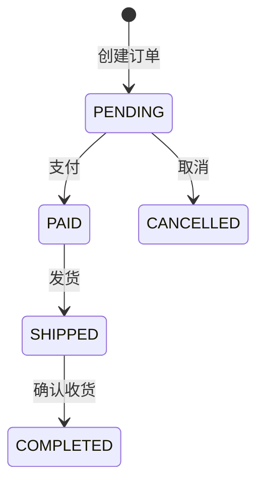
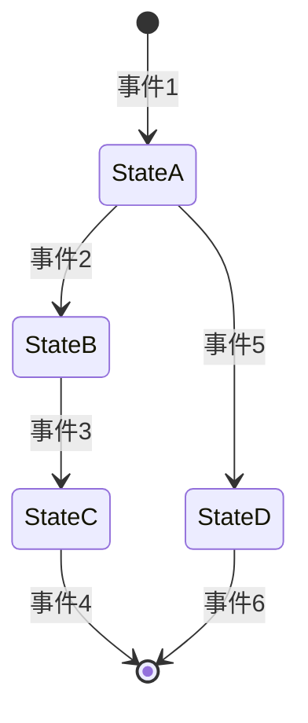
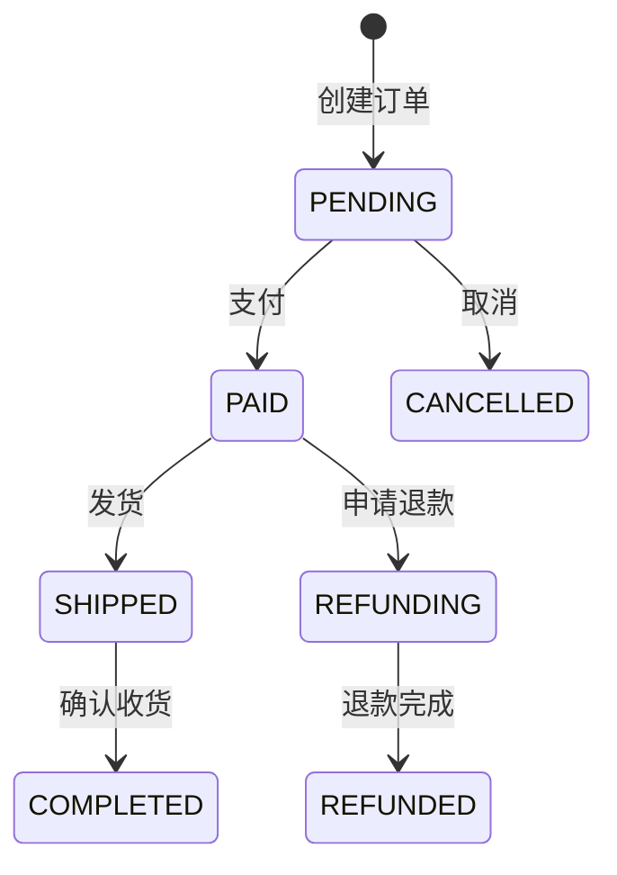
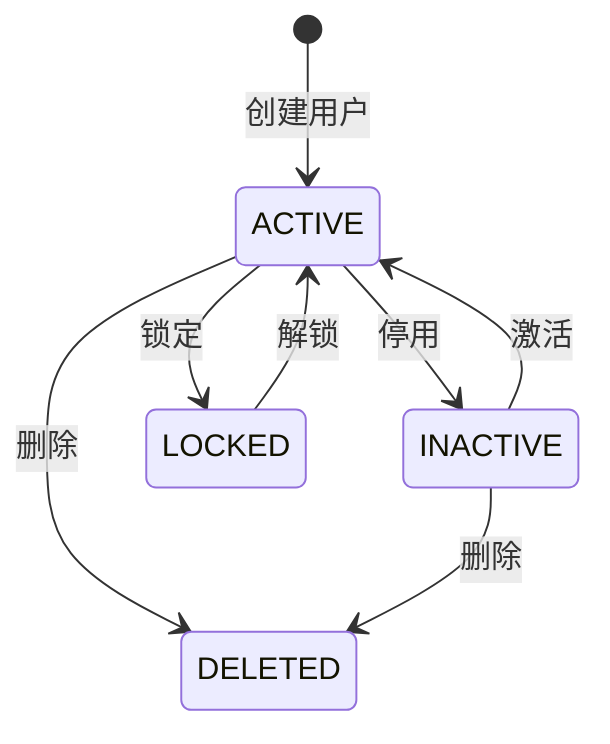

# 第三方 API 文档结构模板和最佳实践

本文档提供第三方 API 文档的完整结构模板和最佳实践指南，作为生成文档时的参考。

---

## 1. 文档结构模板

### 1.1 主文档结构（单文档模式）

```markdown
# {模块名称} - 第三方 API 使用文档

> **文档版本**: v{version}  
> **最后更新**: {date}  
> **目标受众**: 第三方开发者、系统集成工程师

## 📖 目录

1. 接入概览
2. 接口详细说明
3. 代码示例集合
4. 数据模型定义
5. 集成指南
6. 错误处理指南
7. 配置说明
8. FAQ 和故障排查
9. 版本兼容性
10. 附录

---

## 1. 接入概览（P0 - 必须有）

### 1.1 基础信息
- 模块名称
- 模块标识
- 版本信息
- 负责人信息

### 1.2 功能概述
- 核心职责
- 业务场景
- 设计目的
- 业务价值

### 1.3 快速开始（5 分钟入门）
- 环境准备步骤
- 最小化示例
- 验证方法

### 1.4 技术要求
- HTTP 协议版本
- 认证方式
- 数据格式
- 字符编码
- 环境依赖

---

## 2. 接口详细说明（P0 - 必须有）

### 2.1 接口清单

表格格式，包含:
- 接口名称
- HTTP 方法（GET/POST/PUT/DELETE）
- 路径
- 功能描述
- 重要程度（P0/P1/P2）
- 权限要求

### 2.2 核心接口详情

对每个 P0/P1 级别接口提供:

#### 基础信息
- 接口路径
- 功能描述
- 调用频率限制
- SLA 保障

#### 运行时特性
- 幂等性（是否幂等）
- 事务支持（是否支持事务）
- 异步特性（同步/异步）

#### 请求规范
- 请求头（Authorization、Content-Type）
- 认证方式（Bearer Token、API Key）
- 参数定义（名称、类型、必需性、默认值、验证规则）
- 参数依赖关系（如参数 A 为 true 时，参数 B 必填）
- 参数互斥关系（如参数 A 和 B 不能同时使用）

#### 响应规范
- 响应格式（JSON、XML）
- 成功响应（示例 JSON）
- 错误响应（示例 JSON）

#### 异常说明
- 异常类型（错误码）
- 触发条件
- 处理建议

---

## 3. 代码示例集合（P0 - 必须有）

### 3.1 多语言分层示例

#### 基础层（cURL）
快速验证接口，最简单的调用方式

```bash
curl -X POST "https://api.example.com/endpoint" \
  -H "Authorization: Bearer API_KEY" \
  -H "Content-Type: application/json" \
  -d '{"key": "value"}'
```

#### 进阶层（JavaScript/Python/Java）
实际业务使用，包含基本错误处理

```javascript
// JavaScript 示例
const axios = require('axios');

async function callAPI() {
  try {
    const response = await axios.post(url, data, { headers });
    return response.data;
  } catch (error) {
    console.error(error);
  }
}
```

#### 完整层（生产环境最佳实践）
包含所有参数、错误处理、重试逻辑

```python
# Python 示例
import requests
import time

class APIClient:
    def call_api(self, max_retries=3):
        for attempt in range(max_retries):
            try:
                response = requests.post(url, json=data, headers=headers)
                if response.status_code == 200:
                    return response.json()
                # 错误处理...
            except requests.Timeout:
                time.sleep(2 ** attempt)  # 指数退避
        raise RuntimeError('API 调用失败')
```

### 3.2 场景化示例

- 基础调用示例
- 完整功能示例
- 批量操作示例
- 异步处理示例
- 错误处理示例
- **完整流程示例**（端到端业务流程，重要）

### 3.3 示例要求

- 可执行性（可直接运行）
- 详细注释（解释关键代码）
- 变量说明（如 API_KEY、BASE_URL）
- 环境准备（依赖安装、配置设置）

---

## 4. 数据模型定义（P1 - 强烈推荐）

### 4.1 核心枚举定义

表格格式，包含:
- 枚举名称
- 枚举值
- 含义说明
- **状态流转规则**（状态类枚举必须有，使用 Mermaid 流转图）
- 使用场景说明

**状态流转图示例**:



### 4.2 数据结构

- 请求对象（字段列表、类型、必需性、说明）
- 响应对象（字段列表、类型、示例值）
- 枚举类型
- 复合类型（嵌套对象、数组）

### 4.3 数据字典

表格格式，包含:
- 字段名
- 字段类型
- 数据格式（如日期格式 ISO 8601）
- 业务规则（如用户名 3-20 个字符）
- 数据校验规则

---

## 5. 集成指南（P1 - 强烈推荐）

### 5.1 接入步骤

- **准备工作**: 环境配置、依赖安装
- **开发步骤**: 接口调用、数据处理
- **测试验证**: 单元测试、集成测试
- **上线检查**: 配置检查、监控设置

### 5.2 依赖关系

- **上游依赖**: Maven 依赖、外部服务、环境依赖（数据库/缓存/MQ）
- **下游影响**: 变更影响评估

### 5.3 最佳实践

- **性能优化**: QPS/TPS 限制、批量操作建议、缓存策略
- **安全建议**: 凭证管理、数据加密、敏感信息处理
- **监控建议**: 关键指标、日志规范、告警设置

### 5.4 反模式警告

- 不推荐的用法
- 常见错误
- 性能陷阱

---

## 6. 错误处理指南（P1 - 强烈推荐）

### 6.1 常见错误场景

表格格式，包含:
- 错误场景
- 错误码
- 错误信息
- 原因
- 解决方案

### 6.2 错误码表

表格格式，包含:
- 错误码
- HTTP 状态码
- 错误描述
- 触发条件
- 解决方案
- 是否可重试

### 6.3 重试策略

- 重试场景（哪些错误可重试）
- 重试算法（指数退避、固定延迟）
- 重试限制（最大重试次数、超时时间）
- 熔断机制（熔断条件、恢复策略）

### 6.4 降级策略

- 服务降级场景
- 降级处理方案
- 熔断机制示例

---

## 7. 配置说明（P2 - 建议补充）

### 7.1 环境配置

- 开发环境配置
- 生产环境配置
- 调试工具

### 7.2 配置参数

表格格式，包含:
- 配置项
- 类型
- 必需性
- 默认值
- 说明
- 示例值

---

## 8. FAQ 和故障排查（P2 - 建议补充）

### 8.1 常见问题

- 接入问题（如何获取 API Key、如何配置环境）
- 调用问题（参数错误、认证失败）
- 性能问题（响应慢、超时）

### 8.2 故障排查

- 诊断步骤
- 日志分析
- 常见错误解决方案

---

## 9. 版本兼容性（P2 - 建议补充）

### 9.1 版本策略

- 版本命名规范（语义化版本）
- 兼容性承诺（向后兼容策略）
- 废弃通知机制

### 9.2 迁移指南

- 版本升级步骤
- Breaking Changes 列表
- 迁移工具（如适用）

### 9.3 变更历史

表格格式，包含:
- 版本号
- 发布日期
- 变更类型（新增/修改/废弃/删除）
- 变更内容

---

## 10. 附录（P3 - 锦上添花）

### 10.1 术语表

- 关键术语定义
- 术语说明

### 10.2 参考资料

- 相关文档链接
- 外部资源链接

---

**文档版本**: v{version}  
**最后更新**: {date}
```

### 1.2 分卷文档结构（分卷模式）

**主文档**: `{module-name}-api-guide.md`

```markdown
# {模块名称} - 第三方 API 使用文档

> **文档版本**: v{version}  
> **最后更新**: {date}  
> **目标受众**: 第三方开发者、系统集成工程师

## 📖 文档导航

### 完整文档列表
- **主文档**（当前）: 概述 + 快速开始
- [第 1 部分: 接口清单与详情](./{module-name}-api-guide-part1.md)
- [第 2 部分: 代码示例集合](./{module-name}-api-guide-part2.md)
- [第 3 部分: 数据模型 + 集成指南](./{module-name}-api-guide-part3.md)
- [第 4 部分: 错误处理 + 配置说明 + FAQ](./{module-name}-api-guide-part4.md)

### 快速索引
- [创建 XX 示例](#快速开始)
- [完整接口清单](./{module-name}-api-guide-part1.md#接口清单)
- [状态流转图](./{module-name}-api-guide-part3.md#状态枚举)
- [错误码表](./{module-name}-api-guide-part4.md#错误码表)

## 1. 接入概览

(内容与单文档模式相同)

---

**下一篇**: [第 1 部分: 接口清单与详情](./{module-name}-api-guide-part1.md)
```

**分卷 1**: `{module-name}-api-guide-part1.md`

```markdown
# {模块名称} - 第三方 API 使用文档（第 1 部分）

> **返回**: [主文档](./{module-name}-api-guide.md) | **下一篇**: [第 2 部分](./{module-name}-api-guide-part2.md)

## 2. 接口详细说明

(包含接口清单和核心接口详情)

---

**导航**: [主文档](./{module-name}-api-guide.md) | **下一篇**: [第 2 部分](./{module-name}-api-guide-part2.md)
```

**分卷 2-N**: 类似结构

---

## 2. 代码示例最佳实践

### 2.1 基础层示例（cURL）

**特点**:
- 最简单的调用方式
- 快速验证接口
- 无需编程环境

**模板**:

```bash
# 简洁的 cURL 示例
curl -X {HTTP_METHOD} "{BASE_URL}{PATH}" \
  -H "Authorization: Bearer {API_KEY}" \
  -H "Content-Type: application/json" \
  -d '{JSON_DATA}'
```

### 2.2 进阶层示例（JavaScript/Python/Java）

**特点**:
- 实际业务使用
- 包含基本错误处理
- 主流语言实现

**JavaScript 模板**:

```javascript
const axios = require('axios');

async function callAPI(data) {
  try {
    const response = await axios.post(url, data, {
      headers: {
        'Authorization': `Bearer ${API_KEY}`,
        'Content-Type': 'application/json'
      }
    });
    return response.data;
  } catch (error) {
    console.error('API 调用失败:', error.response?.data || error.message);
    throw error;
  }
}
```

**Python 模板**:

```python
import requests

def call_api(data):
    """调用 API"""
    try:
        response = requests.post(
            url,
            json=data,
            headers={
                'Authorization': f'Bearer {API_KEY}',
                'Content-Type': 'application/json'
            },
            timeout=10
        )
        response.raise_for_status()
        return response.json()
    except requests.RequestException as e:
        print(f'API 调用失败: {e}')
        raise
```

### 2.3 完整层示例（生产环境最佳实践）

**特点**:
- 包含所有参数
- 完整的错误处理
- 重试逻辑
- 超时控制
- 日志记录

**Python 完整示例模板**:

```python
import requests
import time
import logging

logger = logging.getLogger(__name__)

class APIClient:
    """API 客户端（生产环境最佳实践）"""
    
    def __init__(self, base_url, api_key):
        self.base_url = base_url
        self.api_key = api_key
        self.session = requests.Session()
        self.session.headers.update({
            'Authorization': f'Bearer {api_key}',
            'Content-Type': 'application/json'
        })
    
    def call_api(self, endpoint, data, max_retries=3):
        """
        调用 API（包含重试逻辑）
        
        Args:
            endpoint: API 端点
            data: 请求数据
            max_retries: 最大重试次数
        
        Returns:
            API 响应数据
        
        Raises:
            ValueError: 参数错误
            RuntimeError: API 调用失败
        """
        url = f'{self.base_url}{endpoint}'
        
        for attempt in range(max_retries):
            try:
                logger.info(f'调用 API: {endpoint}（第 {attempt + 1} 次尝试）')
                
                response = self.session.post(
                    url,
                    json=data,
                    timeout=10
                )
                
                # 成功响应
                if response.status_code == 200:
                    logger.info(f'API 调用成功: {endpoint}')
                    return response.json()
                
                # 客户端错误（不重试）
                if 400 <= response.status_code < 500:
                    error_data = response.json()
                    logger.error(f'参数错误: {error_data}')
                    raise ValueError(f'参数错误: {error_data.get("message")}')
                
                # 服务器错误（重试）
                if response.status_code >= 500:
                    if attempt < max_retries - 1:
                        wait_time = 2 ** attempt  # 指数退避
                        logger.warning(f'服务器错误，{wait_time}秒后重试...')
                        time.sleep(wait_time)
                        continue
                    logger.error(f'服务器错误，重试次数已用尽')
                    raise RuntimeError('服务器错误，重试次数已用尽')
            
            except requests.Timeout:
                if attempt < max_retries - 1:
                    logger.warning('请求超时，1秒后重试...')
                    time.sleep(1)
                    continue
                logger.error('请求超时，重试次数已用尽')
                raise RuntimeError('请求超时，重试次数已用尽')
            
            except requests.RequestException as e:
                logger.error(f'网络错误: {e}')
                raise RuntimeError(f'网络错误: {str(e)}')
        
        raise RuntimeError('API 调用失败')
```

---

## 3. 状态流转图最佳实践

### 3.1 状态流转图模板

使用 Mermaid 语法绘制状态流转图:



### 3.2 订单状态流转图示例



### 3.3 用户状态流转图示例



---

## 4. 错误处理最佳实践

### 4.1 错误码设计规范

**命名规范**:
- 使用大写字母和下划线
- 使用描述性名称
- 分类前缀（如 VALIDATION_、PERMISSION_、SYSTEM_）

**示例**:

```
VALIDATION_ERROR          - 参数验证失败
VALIDATION_MISSING_FIELD  - 缺少必填字段
VALIDATION_INVALID_FORMAT - 格式错误

PERMISSION_DENIED         - 权限不足
PERMISSION_INVALID_TOKEN  - 无效的令牌

SYSTEM_INTERNAL_ERROR     - 系统内部错误
SYSTEM_DATABASE_ERROR     - 数据库错误
SYSTEM_NETWORK_ERROR      - 网络错误
```

### 4.2 错误响应格式

**标准错误响应**:

```json
{
  "code": "VALIDATION_ERROR",
  "message": "参数验证失败",
  "details": {
    "username": "用户名长度必须在 3-20 个字符之间",
    "password": "密码必须包含字母和数字"
  },
  "timestamp": "2025-11-10T10:00:00Z",
  "requestId": "req-123456"
}
```

### 4.3 重试策略模板

**指数退避算法**:

```python
import time

def call_api_with_retry(api_func, max_retries=3):
    """使用指数退避重试 API 调用"""
    for attempt in range(max_retries):
        try:
            return api_func()
        except RetryableError as e:
            if attempt < max_retries - 1:
                wait_time = 2 ** attempt  # 1s, 2s, 4s
                print(f'重试中... {wait_time}秒后重试')
                time.sleep(wait_time)
            else:
                raise RuntimeError('重试次数已用尽')
```

---

## 5. 第三方友好性最佳实践

### 5.1 避免内部术语

**❌ 不好的示例**:

```
该接口调用 XXService 的 doSomething 方法，
通过 XXMapper 从数据库查询数据...
```

**✅ 好的示例**:

```
该接口从数据库查询用户信息并返回...
```

### 5.2 提供充分注释

**❌ 不好的示例**:

```python
def create_user(data):
    return api.post('/users', data)
```

**✅ 好的示例**:

```python
def create_user(username, email, password):
    """
    创建用户
    
    Args:
        username (str): 用户名，3-20 个字符
        email (str): 邮箱地址，必须是有效的邮箱格式
        password (str): 密码，至少 8 个字符，包含字母和数字
    
    Returns:
        dict: 创建的用户信息，包含 id、username、email、status 等字段
    
    Raises:
        ValueError: 参数验证失败
        RuntimeError: 用户创建失败
    
    Example:
        >>> user = create_user('john_doe', 'john@example.com', 'SecurePass123!')
        >>> print(user['id'])
        1001
    """
    data = {
        'username': username,
        'email': email,
        'password': password
    }
    return api.post('/users', data)
```

### 5.3 提供完整的环境准备说明

**示例**:

```markdown
## 环境准备

### 1. 获取 API Key

联系系统管理员获取 API Key，或在开发者平台自助申请。

### 2. 安装依赖

**Python**:
\`\`\`bash
pip install requests
\`\`\`

**JavaScript**:
\`\`\`bash
npm install axios
\`\`\`

### 3. 配置环境变量

\`\`\`bash
export API_KEY="your_api_key_here"
export BASE_URL="https://api.example.com"
\`\`\`

### 4. 验证配置

\`\`\`bash
curl -X GET "$BASE_URL/health" -H "Authorization: Bearer $API_KEY"
\`\`\`

预期响应:
\`\`\`json
{"status": "ok"}
\`\`\`
```

---

## 6. 文档分卷策略

### 6.1 分卷判断规则

- **接口 ≤ 5 个**: 单文档模式（1500-2000 行）
- **接口 6-15 个**: 主文档 + 2-3 个分卷
- **接口 > 15 个**: 主文档 + 4-5 个分卷

### 6.2 分卷结构建议

**分卷 1**: 接口清单 + 核心接口详情（P0 接口）
**分卷 2**: 次要接口详情（P1 接口）+ 代码示例集合
**分卷 3**: 数据模型定义 + 集成指南
**分卷 4**: 错误处理指南 + 配置说明 + FAQ
**分卷 5**: 版本兼容性 + 附录（可选）

### 6.3 每个分卷控制行数

- **理想行数**: 800-1200 行
- **最大行数**: 不超过 1500 行
- **最小行数**: 不少于 500 行（避免分卷过细）

---

## 7. 内容优先级说明

### 7.1 P0 - 必须有（核心内容）

- 接入概览（基础信息、功能概述、快速开始）
- 接口详细说明（接口清单、核心接口详情）
- 代码示例集合（多语言分层示例、场景化示例）

### 7.2 P1 - 强烈推荐（重要内容）

- 数据模型定义（枚举定义 + 状态流转图、数据结构）
- 集成指南（接入步骤、依赖关系、最佳实践）
- 错误处理指南（错误码表、重试策略）

### 7.3 P2 - 建议补充（补充内容）

- 配置说明
- FAQ 和故障排查

### 7.4 P3 - 锦上添花（可选内容）

- 版本兼容性
- 附录（术语表、参考资料）

---

## 8. 质量标准

### 8.1 完整性标准

- [ ] 所有对外接口已完整记录
- [ ] 核心接口提供 3 层代码示例（基础/进阶/完整）
- [ ] 状态枚举包含流转图
- [ ] 至少一个端到端业务流程示例
- [ ] 所有代码示例可直接运行

### 8.2 第三方友好性标准

- [ ] 无内部术语或已充分解释
- [ ] 代码示例包含详细注释
- [ ] 提供完整的环境准备说明
- [ ] 错误处理指南清晰

### 8.3 格式规范标准

- [ ] Markdown 格式正确
- [ ] 代码块包含语言标识
- [ ] 表格格式规范
- [ ] 链接有效（内部链接、外部链接）
- [ ] 分卷文档包含导航链接

---

**使用建议**: 本文档作为生成第三方 API 文档时的参考，确保文档结构完整、内容充实、格式规范、第三方友好。
