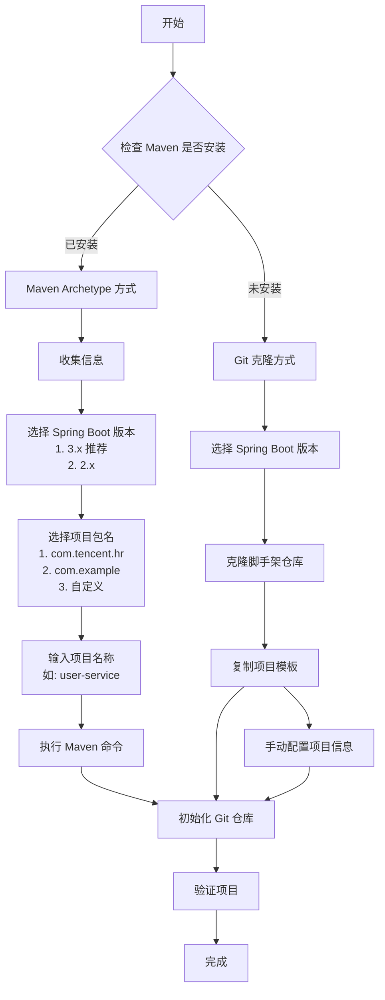

# Skill: 初始化后端脚手架

> 📚 **项目记忆引用**
> - 遵循 [项目宪章](mdc:.spec-code/memory/constitution.md) 的核心原则
> - 参考 [开发指南](mdc:.spec-code/memory/guidelines.md) 的 Skill 编写规范
> - 了解 [项目上下文](mdc:.spec-code/memory/context.md) 的技术栈

## 🎯 目标

快速初始化一个新的 Spring Boot 后端项目，优先使用 Maven Archetype 方式（如果已安装 Maven），否则通过 Git 克隆脚手架仓库。帮助开发者在 5-15 分钟内启动一个符合团队规范的后端项目。

**适用场景**:
- ✅ 创建新的 Spring Boot 后端项目
- ✅ 快速启动标准化的 Java 项目
- ✅ 统一团队后端项目结构和规范
- ✅ 复用团队最佳实践和配置

**触发词**:
- 初始化后端项目
- 创建 Spring Boot 项目
- 新建 Java 后端服务
- 使用脚手架创建项目

**不适用场景**:
- ❌ 已有项目的改造（应使用迁移工具）
- ❌ 非 Java/Spring Boot 项目
- ❌ 需要完全自定义的项目结构

## 📋 前置条件

**必需**:
- [ ] Java 已安装（JDK 11+）
- [ ] 了解项目的基本需求（项目名称、包名等）

**推荐**（优先使用 Maven Archetype 方式）:
- [ ] Maven 已安装（3.6+）

**备选**（如果未安装 Maven）:
- [ ] Git 已安装并配置
- [ ] 有访问脚手架仓库的权限

## 🚀 快速开始（5分钟）

### 步骤 1: 检查环境

**检查 Maven 是否已安装**:
```bash
mvn -version
```

**判断创建方式**:
- ✅ 如果已安装 Maven（显示版本信息）→ 使用 **Maven Archetype 方式**（推荐）
- ❌ 如果未安装 Maven（命令未找到）→ 使用 **Git 克隆方式**

### 步骤 2: 收集项目信息（Maven 方式）

> **注意**: 如果使用 Git 克隆方式，可以跳过此步骤，直接进入步骤 3。

如果检测到 Maven 已安装，需要收集以下信息来创建项目：

#### 2.1 选择 Spring Boot 版本

**请选择 Spring Boot 版本**:
- **选项 1**: Spring Boot 3.x（推荐，需要 Java 17+）
- **选项 2**: Spring Boot 2.x（兼容 Java 11+）

**默认选择**: 选项 1（Spring Boot 3.x）

#### 2.2 确定项目包名（groupId）

**请选择或输入项目包名**:
- **选项 1**: `com.tencent.hr`（腾讯 HR 团队标准包名）
- **选项 2**: `com.example`（示例包名）
- **选项 3**: 自定义包名（请输入符合 Java 包名规范的名称）

**包名规范**:
- 全小写字母
- 使用点号分隔
- 通常采用反向域名格式
- 示例：`com.company.project`

**默认选择**: 选项 1（`com.tencent.hr`）

#### 2.3 确定项目名称（artifactId）

**请输入项目名称**:
- 使用英文小写字母
- 多个单词用连字符（-）分隔
- 名称应简洁且具有描述性
- 示例：`user-service`、`order-management`、`payment-gateway`

**命名建议**:
- ✅ `user-service`（用户服务）
- ✅ `order-service`（订单服务）
- ✅ `product-management`（产品管理）
- ❌ `UserService`（避免大写）
- ❌ `user_service`（避免下划线）

**收集信息示例**:
```
Spring Boot 版本: 选项 1（Spring Boot 3.x）
项目包名: 选项 1（com.tencent.hr）
项目名称: user-service
```

### 步骤 3: 创建项目

#### 方式 A: 使用 Maven Archetype（推荐，如果已安装 Maven）

根据步骤 2 收集的信息，执行相应的 Maven 命令：

**如果选择 Spring Boot 3.x**:
```bash
mvn archetype:generate -U \
  -DarchetypeGroupId=com.tencent.hr.archetype \
  -DarchetypeArtifactId=hrit-project-spring-boot3-demo-archetype \
  -DarchetypeVersion=0.0.2-SNAPSHOT \
  -DgroupId={步骤2.2中选择的包名} \
  -DartifactId={步骤2.3中输入的项目名}
```

**如果选择 Spring Boot 2.x**:
```bash
mvn archetype:generate -U \
  -DarchetypeGroupId=com.tencent.hr.archetype \
  -DarchetypeArtifactId=hrit-project-spring-boot2-demo-archetype \
  -DarchetypeVersion=0.0.2-SNAPSHOT \
  -DgroupId={步骤2.2中选择的包名} \
  -DartifactId={步骤2.3中输入的项目名}
```

**完整示例**（基于步骤 2 的示例信息）:
```bash
# Spring Boot 3.x + com.tencent.hr + user-service
mvn archetype:generate -U \
  -DarchetypeGroupId=com.tencent.hr.archetype \
  -DarchetypeArtifactId=hrit-project-spring-boot3-demo-archetype \
  -DarchetypeVersion=0.0.2-SNAPSHOT \
  -DgroupId=com.tencent.hr \
  -DartifactId=user-service
```

**命令参数说明**:
- `-U`: 强制更新快照版本
- `-DarchetypeGroupId`: Archetype 模板的 groupId
- `-DarchetypeArtifactId`: Archetype 模板的 artifactId（区分 Spring Boot 版本）
- `-DarchetypeVersion`: Archetype 模板的版本号
- `-DgroupId`: 新项目的包名（从步骤 2.2 获取）
- `-DartifactId`: 新项目的名称（从步骤 2.3 获取）

**优势**:
- ✅ 自动配置项目结构和包名
- ✅ 无需手动修改配置文件
- ✅ 更快速、更标准化
- ✅ 避免手动配置错误

#### 方式 B: 使用 Git 克隆（如果未安装 Maven）

> **注意**: 如果使用此方式，需要在步骤 5 中手动配置项目信息。

**选择 Spring Boot 版本**:
- **选项 1**: Spring Boot 3.x（推荐）
- **选项 2**: Spring Boot 2.x

**执行克隆命令**:
```bash
# 克隆脚手架仓库
git clone https://git.woa.com/hr-team/sdc-std-devkit-team/sdc-std-scaffold-java.git temp-scaffold
cd temp-scaffold

# 根据选择的 Spring Boot 版本复制对应的项目目录
# 如果选择 Spring Boot 3.x（选项 1）
cp -r hrit-project-spring-boot3-demo ../{your-project-name}

# 如果选择 Spring Boot 2.x（选项 2）
# cp -r hrit-project-spring-boot2-demo ../{your-project-name}

# 进入项目目录
cd ../{your-project-name}

# 删除临时目录
rm -rf ../temp-scaffold
```

**示例**（创建名为 user-service 的项目，使用 Spring Boot 3.x）:
```bash
git clone https://git.woa.com/hr-team/sdc-std-devkit-team/sdc-std-scaffold-java.git temp-scaffold
cd temp-scaffold
cp -r hrit-project-spring-boot3-demo ../user-service
cd ../user-service
rm -rf ../temp-scaffold
```

**验证**:
- [ ] 项目目录已创建
- [ ] 可以看到 `pom.xml` 文件
- [ ] 可以看到 `src/` 目录结构

### 步骤 4: 初始化 Git 仓库

为项目初始化新的 Git 仓库：

**执行命令**:
```bash
# 进入项目目录
cd {project-name}

# 初始化新的 Git 仓库
git init

# 配置 Git 用户信息（如果需要）
git config user.name "Your Name"
git config user.email "your.email@example.com"

# 添加所有文件到暂存区
git add .

# 创建初始提交
git commit -m "chore: initial commit from scaffold"
```

**关键点**:
- 项目目录已经是独立的，无需删除 `.git` 目录
- 初始化新的 Git 仓库后，项目成为独立的版本控制
- 初始提交应该包含所有脚手架文件

**验证**:
- [ ] 新的 `.git` 目录已创建
- [ ] 初始提交已完成
- [ ] `git log` 显示只有一个提交

### 步骤 5: 配置项目（仅 Git 克隆方式需要）

> **注意**: 如果使用 Maven Archetype 方式创建项目，此步骤可以跳过，因为项目配置已自动完成。

如果使用 Git 克隆方式，需要收集以下信息来配置项目：

**需要收集的信息**:
1. **项目包名**（groupId）：如 `com.tencent.hr`、`com.example`
2. **项目名称**（artifactId）：如 `user-service`
3. **项目版本**（version）：如 `0.1.0`（可选，默认 `0.1.0`）

**需要修改的文件**:

1. **pom.xml** - 更新项目元数据
   ```xml
   <groupId>com.example</groupId>
   <artifactId>user-service</artifactId>
   <version>0.1.0</version>
   <name>user-service</name>
   <description>用户管理服务</description>
   ```

2. **application.yml** - 更新应用名称（可选）
   ```yaml
   spring:
     application:
       name: user-service
   ```

3. **README.md** - 更新项目文档（可选）

4. **src/main/resources/mapper** - 更新 MyBatis 映射文件（如需要）

**验证**:
- [ ] 项目配置已更新
- [ ] 包名和项目名称正确

### 步骤 6: 验证项目完整性

确保创建/配置后的项目能够正常启动和运行：

**执行命令**:
```bash
# 编译项目
mvn clean compile

# 运行测试（可选）
mvn test

# 启动应用
mvn spring-boot:run

# 或者构建 JAR 包
mvn clean package
java -jar target/{project-name}-{version}.jar
```

**检查项目**:
- [ ] 编译成功
- [ ] 应用启动成功
- [ ] 没有控制台错误
- [ ] 项目功能正常

**常见问题**:
- 如果编译失败，检查 Java 版本和依赖
- 如果启动失败，检查配置文件和依赖
- 如果有错误，查看错误信息并修复

**验证**:
- [ ] 项目编译成功
- [ ] 应用启动成功
- [ ] 没有明显的错误或警告

## 💬 交互示例

以下是使用 Maven Archetype 方式创建项目时的完整交互流程：

### 示例 1: 创建用户服务项目

**AI**: 检测到您已安装 Maven，将使用 Maven Archetype 方式创建项目。

**AI**: 📋 **步骤 1/3: 请选择 Spring Boot 版本**

请选择：
- **1**: Spring Boot 3.x（推荐，需要 Java 17+）
- **2**: Spring Boot 2.x（兼容 Java 11+）

您的选择是？（默认：1）

**用户**: 1

---

**AI**: ✅ 已选择：Spring Boot 3.x

**AI**: 📋 **步骤 2/3: 请选择项目包名（groupId）**

请选择：
- **1**: `com.tencent.hr`（腾讯 HR 团队标准包名）
- **2**: `com.example`（示例包名）
- **3**: 自定义（请输入符合 Java 包名规范的名称）

您的选择是？（默认：1）

**用户**: 1

---

**AI**: ✅ 已选择：`com.tencent.hr`

**AI**: 📋 **步骤 3/3: 请输入项目名称（artifactId）**

项目名称规范：
- 使用小写字母
- 多个单词用连字符（-）分隔
- 示例：`user-service`、`order-management`

请输入项目名称：

**用户**: user-service

---

**AI**: ✅ 已输入：`user-service`

**AI**: 📊 **信息确认**

请确认以下信息：
- Spring Boot 版本: **3.x**
- 项目包名: **com.tencent.hr**
- 项目名称: **user-service**

确认无误？（是/否，默认：是）

**用户**: 是

---

**AI**: 🚀 **开始创建项目...**

执行命令：
```bash
mvn archetype:generate -U \
  -DarchetypeGroupId=com.tencent.hr.archetype \
  -DarchetypeArtifactId=hrit-project-spring-boot3-demo-archetype \
  -DarchetypeVersion=0.0.2-SNAPSHOT \
  -DgroupId=com.tencent.hr \
  -DartifactId=user-service
```

✅ 项目创建成功！

接下来将初始化 Git 仓库...

### 示例 2: 创建自定义包名的项目

**AI**: 📋 **步骤 2/3: 请选择项目包名（groupId）**

请选择：
- **1**: `com.tencent.hr`
- **2**: `com.example`
- **3**: 自定义

您的选择是？

**用户**: 3

---

**AI**: 请输入自定义包名（Java 包名规范，如 `com.mycompany.project`）：

**用户**: com.mycompany.ecommerce

---

**AI**: ✅ 已输入：`com.mycompany.ecommerce`

验证包名格式... ✅ 格式正确

继续下一步...

## 💡 最佳实践

### 1. 项目命名规范

- ✅ 使用小写字母和连字符：`user-service`
- ✅ 名称简洁易记：`order-service`
- ✅ 避免特殊字符和空格
- ❌ 避免大写字母：`UserService`
- ❌ 避免下划线：`user_service`


### 2. 版本管理

- ✅ 遵循 Semantic Versioning：`MAJOR.MINOR.PATCH`
- ✅ 初始版本通常为 `0.1.0` 或 `1.0.0`
- ✅ 每个版本都有明确的变更说明
- ❌ 避免随意修改版本号

### 3. Git 管理

- ✅ 初始提交应该包含所有脚手架文件
- ✅ 使用清晰的提交信息：`chore: initial commit from scaffold`
- ✅ 定期提交代码变更
- ❌ 避免提交 `target` 和 `.idea` 目录

### 4. 配置管理

- ✅ 只修改必要的配置
- ✅ 保持脚手架的最佳实践
- ✅ 使用环境变量管理敏感信息
- ❌ 避免硬编码配置值

### 5. 代码质量

- ✅ 遵循项目的编码规范
- ✅ 保持代码的可读性和可维护性
- ✅ 定期进行代码审查
- ❌ 避免复制粘贴代码

## ⚠️ 常见错误

### 错误 1: 克隆失败

**问题**: 执行 `git clone` 时出现错误
**原因**: 
- 网络连接问题
- 没有访问权限
- 仓库地址错误

**解决方案**:
- 检查网络连接
- 确认有访问脚手架仓库的权限
- 验证仓库地址是否正确
- 尝试使用 SSH 或 HTTPS 不同的方式克隆

### 错误 2: 编译失败

**问题**: 执行 `mvn clean compile` 时出现错误
**原因**: 
- Java 版本不兼容
- 依赖版本冲突
- 代码有语法错误

**解决方案**:
- 检查 Java 版本：`java -version`
- 检查 Maven 版本：`mvn -version`
- 清除 Maven 缓存：`mvn clean`
- 查看错误信息，找出具体问题

### 错误 3: 启动失败

**问题**: 执行 `mvn spring-boot:run` 时出现错误
**原因**: 
- 配置文件错误
- 数据库连接失败
- 依赖未正确安装

**解决方案**:
- 检查 `application.yml` 配置
- 检查数据库连接信息
- 检查依赖是否完整
- 查看错误信息，找出具体问题

### 错误 4: 数据库连接失败

**问题**: 启动时出现数据库连接错误
**原因**: 
- 数据库未启动
- 连接信息错误
- 驱动程序缺失

**解决方案**:
- 确保数据库已启动
- 检查 `application.yml` 中的连接信息
- 检查 `pom.xml` 中是否有数据库驱动依赖
- 查看错误信息，找出具体问题

## 📊 快速参考

### 初始化流程图



### 创建方式选择

| 条件 | 推荐方式 | 优势 | 信息收集方式 |
|------|---------|------|------------|
| 已安装 Maven | Maven Archetype | 自动配置、更快速 | 交互式选择 + 输入 |
| 未安装 Maven | Git 克隆 | 无需 Maven | 交互式选择 + 输入 |

### Maven 方式信息收集清单

**步骤 2.1 - Spring Boot 版本**:
- [ ] 选项 1: Spring Boot 3.x（推荐，Java 17+）
- [ ] 选项 2: Spring Boot 2.x（Java 11+）

**步骤 2.2 - 项目包名（groupId）**:
- [ ] 选项 1: `com.tencent.hr`
- [ ] 选项 2: `com.example`
- [ ] 选项 3: 自定义（输入符合 Java 包名规范的名称）

**步骤 2.3 - 项目名称（artifactId）**:
- [ ] 输入项目名称（小写字母 + 连字符，如 `user-service`）

### Maven Archetype 命令速查

```bash
# Spring Boot 3.x
mvn archetype:generate -U \
  -DarchetypeGroupId=com.tencent.hr.archetype \
  -DarchetypeArtifactId=hrit-project-spring-boot3-demo-archetype \
  -DarchetypeVersion=0.0.2-SNAPSHOT \
  -DgroupId={包名} \
  -DartifactId={项目名}

# Spring Boot 2.x
mvn archetype:generate -U \
  -DarchetypeGroupId=com.tencent.hr.archetype \
  -DarchetypeArtifactId=hrit-project-spring-boot2-demo-archetype \
  -DarchetypeVersion=0.0.2-SNAPSHOT \
  -DgroupId={包名} \
  -DartifactId={项目名}
```

### 验证清单

- [ ] 项目目录已创建
- [ ] `pom.xml` 配置正确
- [ ] Git 仓库已初始化
- [ ] 项目编译成功：`mvn clean compile`
- [ ] 应用启动成功：`mvn spring-boot:run`
- [ ] 没有控制台错误

## 🔄 详细流程（15分钟）

完整的项目初始化流程，包括所有配置和验证步骤，请参考：
- **详细参考**: [reference.md](reference.md)
- **验证清单**: [checklist.md](checklist.md)

## 📚 相关资源

- **脚手架仓库**: https://git.woa.com/hr-team/sdc-std-devkit-team/sdc-std-scaffold-java.git
- **项目规范**: [通用规范索引](mdc:spec/global/standards/common/index.md)
- **Maven Archetype 文档**: https://maven.apache.org/archetype/index.html

## ❓ 常见问题

### Q: 为什么要优先使用 Maven Archetype 方式？

**A**: Maven Archetype 方式有以下优势：
- ✅ 自动配置项目结构和包名，无需手动修改
- ✅ 避免手动配置错误
- ✅ 创建速度更快（几秒钟完成）
- ✅ 确保项目配置的一致性

### Q: 如果不确定选择哪个 Spring Boot 版本怎么办？

**A**: 建议选择 Spring Boot 3.x（选项 1），因为：
- 这是最新的稳定版本
- 拥有更好的性能和新特性
- 是未来的主流版本
- 前提是你的 Java 版本为 17 或更高

如果你的环境只支持 Java 11，则选择 Spring Boot 2.x。

### Q: 项目包名应该如何选择？

**A**: 
- 如果是腾讯 HR 团队项目，选择 `com.tencent.hr`（选项 1）
- 如果是示例或学习项目，选择 `com.example`（选项 2）
- 如果是公司正式项目，选择自定义（选项 3），使用公司的标准包名

### Q: 项目名称有什么命名规范？

**A**: 项目名称（artifactId）应该：
- ✅ 使用小写字母
- ✅ 多个单词用连字符（-）分隔
- ✅ 简洁且具有描述性
- ✅ 示例：`user-service`、`order-management`
- ❌ 避免大写字母：`UserService`
- ❌ 避免下划线：`user_service`
- ❌ 避免特殊字符和空格

### Q: 如何修改项目名称？

**A**: 修改 `pom.xml` 中的 `artifactId` 字段，然后更新 `README.md` 和其他相关文件中的项目名称。

### Q: 如何更改 Java 版本？

**A**: 修改 `pom.xml` 中的 `<source>` 和 `<target>` 标签，以及 `<java.version>` 属性。

### Q: 如何添加新的依赖？

**A**: 在 `pom.xml` 中的 `<dependencies>` 部分添加新的 `<dependency>` 标签，然后运行 `mvn clean install`。

### Q: 如何自定义项目结构？

**A**: 在步骤 5 中改造项目内容时，可以重新组织文件结构。确保不要删除必要的配置文件和启动类。

### Q: 如何处理环境变量？

**A**: 创建 `application-dev.yml` 和 `application-prod.yml` 文件，使用 `spring.profiles.active` 属性切换环境。

### Q: 如何验证项目是否正确初始化？

**A**: 使用验证清单检查所有项目，特别是确保项目能够编译、测试通过并正常启动。
