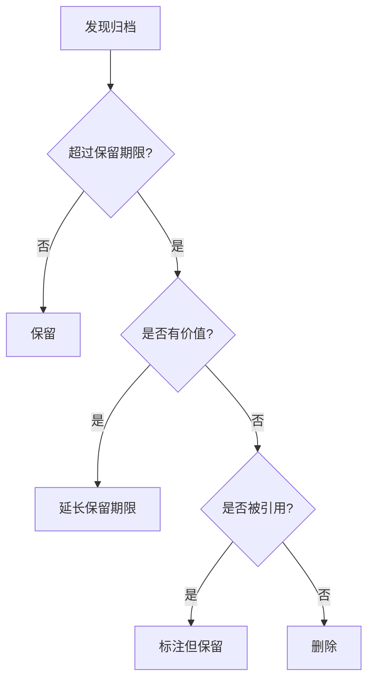

# 归档过时内容 - 详细参考文档

> 本文档提供归档功能的详细技术细节、高级用法和最佳实践

## 📖 目录

1. [归档规则详解](#归档规则详解)
2. [归档目录结构详解](#归档目录结构详解)
3. [元数据规范](#元数据规范)
4. [链接更新详解](#链接更新详解)
5. [最佳实践详解](#最佳实践详解)
6. [归档策略](#归档策略)
7. [自动化归档](#自动化归档)
8. [工具集成](#工具集成)
9. [常见问题解答](#常见问题解答)

---

## 归档规则详解

### 应该归档的内容详细清单

#### 1. 废弃的功能代码

**判断标准**:
- 功能已从产品中移除
- 代码不再被引用或调用
- 已有新的实现替代

**示例**:
```
废弃的认证模块:
- skills/session-auth/ (已被 OAuth2 替代)
- 保留原因: 历史参考，了解旧系统设计
```

#### 2. 过时的文档

**判断标准**:
- 文档版本号低于当前版本
- 描述的功能或流程已改变
- 被新文档完全替代

**示例**:
```
旧版 API 文档:
- docs/api-v1.md (已升级到 v2)
- 保留原因: 支持旧客户端的参考
```

#### 3. 临时和实验性文件

**判断标准**:
- 标记为 "temp" 或 "experimental"
- 创建时间超过 6 个月且未更新
- 项目已完成或实验已结束

**示例**:
```
临时迁移脚本:
- scripts/temp-data-migration.sh (迁移已完成)
- 保留原因: 了解迁移过程，以备将来参考
```

#### 4. 旧版本快照

**判断标准**:
- 标记为 v1, v2 等版本号
- 已被更高版本替代
- 不再维护

**示例**:
```
旧版配置:
- config/v1/ (已升级到 v2)
- 保留原因: 回滚时的参考
```

### 不应该归档的内容详细说明

#### 1. 活跃代码

**判断标准**:
- 最近 3 个月内有修改
- 仍在被其他代码引用
- 测试仍在通过

#### 2. 当前文档

**判断标准**:
- 描述当前系统状态
- 经常被查阅
- 内容准确有效

#### 3. 依赖项和共享资源

**判断标准**:
- 被多个模块依赖
- 提供通用功能
- 未标记为废弃

---

## 归档目录结构详解

### 目录层次说明

```
spec/archive/
├── skills/                          # 技能归档
│   └── 2024-01-15_old-auth-skill/
│       ├── SKILL.md                 # 原始技能文件
│       ├── scripts/                 # 原始脚本
│       ├── ARCHIVE-INFO.md          # 归档元数据
│       └── README.md                # 原始说明
├── commands/                        # 命令归档
│   └── 2024-02-20_deprecated-cmd/
├── docs/                            # 文档归档
│   └── 2024-03-10_old-design/
├── templates/                       # 模板归档
│   └── 2024-04-05_old-template/
├── standards/                       # 规范归档
│   └── 2024-05-15_old-standard/
├── README.md                        # 全局归档索引
└── CHANGELOG.md                     # 归档变更日志
```

### 目录命名规范详解

**格式**: `{YYYY-MM-DD}_{描述性名称}/`

**命名要求**:
- 日期使用 ISO 8601 格式 (YYYY-MM-DD)
- 描述性名称使用小写字母和连字符
- 名称应简洁但能表达核心含义
- 避免特殊字符和空格

**好的命名示例**:
```
✅ 2024-01-15_old-authentication-skill
✅ 2024-03-20_deprecated-api-v1
✅ 2024-06-10_legacy-database-schema
✅ 2024-09-05_temp-migration-scripts
```

**不好的命名示例**:
```
❌ old-auth (缺少日期)
❌ 2024-01-15 (缺少描述)
❌ 2024_01_15_Old Auth (格式错误)
❌ 2024-01-15_旧认证 (使用中文)
```

---

## 元数据规范

### ARCHIVE-INFO.md 标准格式

```markdown
# 归档信息

## 基本信息

- **归档日期**: 2024-01-15
- **原始路径**: skills/old-authentication
- **归档分类**: skills
- **归档执行人**: zhangsan
- **归档工具版本**: v3.0

## 归档原因

### 主要原因
认证机制已全面升级到 OAuth 2.0 标准，旧的基于 Session 的认证不再适用于现代化架构。

### 详细说明
1. **安全性**: OAuth 2.0 提供更好的安全性
2. **扩展性**: 支持第三方应用授权
3. **标准化**: 符合行业标准

## 原始内容

### 文件列表
- SKILL.md (5.2 KB)
- auth-handler.ts (12.3 KB)
- session-manager.ts (8.7 KB)
- README.md (3.1 KB)
- tests/auth.test.ts (6.5 KB)

### 目录结构
```
old-authentication/
├── SKILL.md
├── src/
│   ├── auth-handler.ts
│   └── session-manager.ts
├── tests/
│   └── auth.test.ts
└── README.md
```

### 统计信息
- **文件总数**: 5
- **目录总数**: 2
- **总大小**: 35.8 KB
- **代码行数**: ~1,200 行

## 替代方案

### 新实现位置
- **路径**: skills/oauth2-authentication
- **版本**: v2.0
- **状态**: 已上线

### 迁移指南
详见 [OAuth 2.0 迁移指南](mdc:docs/migration/oauth2-migration.md)

### 关键差异
| 特性 | 旧实现 (Session) | 新实现 (OAuth 2.0) |
|------|-----------------|-------------------|
| 认证方式 | Session Cookie | Access Token |
| 安全性 | 中等 | 高 |
| 扩展性 | 低 | 高 |
| 第三方支持 | 否 | 是 |

## 依赖关系

### 被依赖情况
- ❌ 无其他模块依赖此归档内容

### 依赖项
- express-session (v1.17.0)
- connect-redis (v5.0.0)

## 相关链接

### 架构决策
- [ADR-015: OAuth 2.0 认证标准化](mdc:.codebuddy/spec/memory/architecture-decisions.md#adr-015)

### 相关文档
- [OAuth 2.0 认证实现](mdc:skills/oauth2-authentication/SKILL.md)
- [迁移指南](mdc:docs/migration/oauth2-migration.md)
- [安全审计报告](mdc:docs/security/audit-2024-01.md)

### 相关归档
- [2023-12-10_old-jwt-handler](mdc:.codebuddy/spec/archive/skills/2023-12-10_old-jwt-handler/)

## 注意事项

### 重要提醒
1. **数据清理**: 旧的 Session 数据已从 Redis 中清理
2. **API 变更**: `/auth/login` 端点签名已变更
3. **客户端迁移**: 所有客户端需要更新认证逻辑
4. **兼容性**: 不再支持 Session 认证方式

### 潜在问题
- 旧客户端可能需要升级
- 部分第三方集成需要重新配置

## 技术信息

### 环境要求
- Node.js: 14.x
- Express: 4.17.x
- Redis: 5.x

### 依赖链接检查
- **检查时间**: 2024-01-15 10:30:00
- **发现链接**: 3 个
- **已更新**: 3 个
- **需手动处理**: 0 个

### 链接更新详情
1. docs/api-reference.md:42 - 已更新到归档路径
2. README.md:15 - 已更新到新实现路径
3. docs/architecture.md:88 - 已标注为历史引用

## 回滚信息

### 如何恢复
如需恢复此归档到原位置:
```bash
# 复制归档到原位置
cp -r spec/archive/skills/2024-01-15_old-authentication-skill/ \
     skills/old-authentication/

# 恢复链接引用
# (需要手动处理，参考上面的链接更新详情)
```

### 注意事项
- 恢复后需要重新安装依赖
- 需要配置 Redis 连接
- 可能与当前系统不兼容

## 归档历史

- **创建时间**: 2024-01-15 10:00:00
- **最后更新**: 2024-01-15 10:30:00
- **归档工具**: archiving-content v3.0
- **执行状态**: ✅ 成功
```

---

## 链接更新详解

### 链接类型

#### 1. MDC 链接

**格式**: `[文本](mdc:path/to/file.md)`

**示例**:
```markdown
# 更新前
[旧认证](mdc:skills/old-authentication/SKILL.md)

# 更新后
[旧认证(已归档)](mdc:.codebuddy/spec/archive/skills/2024-01-15_old-authentication-skill/SKILL.md)
```

#### 2. 相对链接

**格式**: `[文本](../path/to/file.md)`

**示例**:
```markdown
# 更新前 (在 docs/api.md 中)
[认证模块](../skills/old-authentication/README.md)

# 更新后
[认证模块(已归档)](../spec/archive/skills/2024-01-15_old-authentication-skill/README.md)
```

#### 3. 绝对链接

**格式**: `[文本](/absolute/path/to/file.md)`

**示例**:
```markdown
# 更新前
[配置](/config/auth.json)

# 更新后
[配置(已归档)](/spec/archive/config/2024-01-15_old-auth-config/auth.json)
```

### 链接检查流程

#### 步骤 1: 搜索所有链接

```bash
# 搜索 MDC 链接
grep -r "mdc:skills/old-authentication" . \
    --include="*.md" \
    --exclude-dir=".git" \
    --exclude-dir="node_modules" \
    --exclude-dir="spec/archive"

# 搜索相对链接
grep -r "\.\./.*skills/old-authentication" . \
    --include="*.md" \
    --exclude-dir=".git" \
    --exclude-dir="node_modules" \
    --exclude-dir="spec/archive"

# 搜索绝对链接
grep -r "/skills/old-authentication" . \
    --include="*.md" \
    --exclude-dir=".git" \
    --exclude-dir="node_modules" \
    --exclude-dir="spec/archive"
```

#### 步骤 2: 分析链接上下文

对于每个找到的链接：
1. 读取文件内容
2. 确定链接在文档中的作用
3. 决定更新策略 (更新路径 vs 标注已归档)

#### 步骤 3: 执行更新

```bash
# 使用 sed 批量更新
sed -i 's|mdc:skills/old-authentication|mdc:.codebuddy/spec/archive/skills/2024-01-15_old-authentication-skill|g' file.md
```

#### 步骤 4: 验证更新

```bash
# 检查更新后的文件
grep -r "spec/archive/skills/2024-01-15_old-authentication-skill" . \
    --include="*.md" \
    --exclude-dir=".git"
```

### 链接更新策略

| 链接类型 | 更新策略 | 示例 |
|---------|---------|------|
| 文档引用 | 更新路径 + 标注归档 | `[文档(已归档)](新路径)` |
| 代码示例 | 保留原路径 + 添加说明 | 原路径 + `<!-- 已归档 -->` |
| 导航链接 | 移除或更新 | 从目录中移除 |
| 历史记录 | 保留原路径 + 标注 | `~~旧路径~~ (已归档)` |

---

## 最佳实践详解

### 归档时机最佳实践

#### 立即归档的情况

1. **功能完全下线**
   - 所有用户已迁移
   - 监控数据显示无访问
   - 代码已从主分支移除

2. **安全漏洞修复**
   - 旧代码存在已知漏洞
   - 新版本已修复并上线
   - 旧版本需要禁用

3. **重大架构变更**
   - 架构已完全重构
   - 旧实现不再适用
   - 新架构已稳定运行

#### 延迟归档的情况

1. **渐进式迁移中**
   - 部分用户仍在使用
   - 迁移计划未完成
   - 需要保留回滚选项

2. **A/B 测试期间**
   - 新旧版本同时运行
   - 测试数据收集中
   - 未做最终决策

### 归档分类最佳实践

#### 分类原则

1. **按功能模块分类**
   ```
   spec/archive/
   ├── auth/           # 认证相关
   ├── payment/        # 支付相关
   ├── notification/   # 通知相关
   ```

2. **按技术类型分类**
   ```
   spec/archive/
   ├── skills/         # 技能
   ├── commands/       # 命令
   ├── docs/           # 文档
   ```

3. **混合分类** (推荐)
   ```
   spec/archive/
   ├── skills/
   │   ├── auth/
   │   └── payment/
   ├── docs/
   │   ├── api/
   │   └── design/
   ```

### 团队协作最佳实践

#### 归档前沟通

**沟通检查清单**:
- [ ] 在团队会议上讨论归档计划
- [ ] 发送归档通知邮件
- [ ] 在 Slack/Teams 中公告
- [ ] 更新项目看板
- [ ] 记录在会议纪要中

**通知模板**:
```markdown
📢 归档通知

**归档内容**: skills/old-authentication
**归档时间**: 2024-01-15
**归档原因**: 已升级到 OAuth 2.0
**影响范围**: 认证模块，API 端点变更
**替代方案**: skills/oauth2-authentication
**迁移指南**: docs/migration/oauth2-migration.md

请相关开发者在归档前确认无影响。
如有疑问，请联系 @zhangsan
```

#### 归档后跟进

1. **更新文档**
   - 在 CHANGELOG 中记录
   - 更新架构文档
   - 更新 API 文档

2. **清理依赖**
   - 移除不再需要的 npm 包
   - 清理数据库表
   - 删除相关配置

3. **知识传承**
   - 组织分享会
   - 更新培训材料
   - 记录经验教训

---

## 归档策略

### 保留策略详解

| 内容类型 | 保留期限 | 清理策略 | 备注 |
|---------|---------|---------|------|
| 废弃代码 | 2年 | 可永久保留 | 重要历史参考 |
| 过时文档 | 1年 | 定期评估 | 版本文档保留 |
| 临时脚本 | 6个月 | 确认后删除 | 一次性使用 |
| 实验代码 | 3个月 | 失败则删除 | 成功则正式化 |
| 旧版本快照 | 根据版本政策 | 保留主版本 | 参考版本策略 |
| 测试数据 | 3个月 | 定期清理 | 保留典型案例 |
| 临时配置 | 1个月 | 立即删除 | 迁移完成后 |

### 版本保留策略

**语义化版本 (SemVer)**:
```
- 保留所有主版本 (1.x, 2.x, 3.x)
- 保留最近 3 个次版本 (3.1, 3.2, 3.3)
- 只保留最新的修订版 (3.3.5)
```

**示例**:
```
✅ 保留: 1.0.0, 2.0.0, 3.0.0 (主版本)
✅ 保留: 3.1.0, 3.2.0, 3.3.0 (最近次版本)
✅ 保留: 3.3.5 (最新修订版)
❌ 删除: 1.1.0, 2.5.0 (旧次版本)
❌ 删除: 3.3.0, 3.3.1, 3.3.2 (旧修订版)
```

### 清理流程

#### 定期清理检查

```bash
#!/bin/bash
# quarterly-archive-cleanup.sh

echo "开始季度归档清理检查..."

# 检查超过保留期限的归档
find spec/archive -type d -mtime +180 -name "2*_*"

# 分析归档大小
du -sh spec/archive/*

# 生成清理建议报告
echo "生成清理建议..."
```

#### 清理决策流程



---

## 自动化归档

### 自动检测脚本

```bash
#!/bin/bash
# auto-detect-archive-candidates.sh

echo "检测归档候选项..."

# 1. 检查标记为 deprecated 的代码
echo "1. 检查 @deprecated 标记..."
grep -r "@deprecated" src/ --include="*.ts" --include="*.js" | \
  awk -F: '{print $1}' | sort | uniq

# 2. 检查超过 6 个月未修改的临时文件
echo "2. 检查临时文件..."
find workspace/temp -type f -mtime +180 -ls

# 3. 检查过时的文档版本
echo "3. 检查旧版本文档..."
find docs/ -name "*-v[0-9]*" -type f

# 4. 检查未被引用的文件
echo "4. 检查未引用文件..."
# (需要更复杂的依赖分析)

# 生成归档建议报告
echo "生成归档建议报告: archive-candidates.md"
```

### Git 钩子集成

#### pre-commit 钩子

```bash
#!/bin/bash
# .git/hooks/pre-commit

echo "检查归档标记..."

# 检查是否有新增的 @deprecated 代码
if git diff --cached | grep -i "@deprecated"; then
    echo "⚠️  警告: 发现新增的 @deprecated 标记"
    echo "考虑是否应该直接归档而不是提交?"
    read -p "继续提交? (y/n) " confirm
    if [ "$confirm" != "y" ]; then
        exit 1
    fi
fi

# 检查是否修改了归档目录
if git diff --cached --name-only | grep "^spec/archive/"; then
    echo "⚠️  警告: 正在修改归档目录"
    echo "归档目录通常不应该被修改"
    read -p "确认继续? (y/n) " confirm
    if [ "$confirm" != "y" ]; then
        exit 1
    fi
fi
```

### 定期归档任务

```bash
#!/bin/bash
# cron-archive-check.sh
# 添加到 crontab: 0 0 1 */3 * /path/to/cron-archive-check.sh

echo "执行定期归档检查..."
date

# 运行自动检测
./auto-detect-archive-candidates.sh > /tmp/archive-candidates-$(date +%Y%m%d).log

# 发送通知
if [ -s /tmp/archive-candidates-$(date +%Y%m%d).log ]; then
    echo "发现归档候选项，已发送通知"
    # 发送邮件或 Slack 通知
fi
```

---

## 工具集成

### IDE 集成

#### VS Code 任务配置

```json
// .vscode/tasks.json
{
  "version": "2.0.0",
  "tasks": [
    {
      "label": "归档当前文件",
      "type": "shell",
      "command": "./scripts/archive.sh",
      "args": [
        "${relativeFile}",
        "${input:category}",
        "${input:reason}"
      ],
      "problemMatcher": []
    },
    {
      "label": "检查归档候选",
      "type": "shell",
      "command": "./scripts/auto-detect-archive-candidates.sh",
      "problemMatcher": []
    }
  ],
  "inputs": [
    {
      "id": "category",
      "type": "pickString",
      "description": "选择归档分类",
      "options": ["skills", "commands", "docs", "templates", "standards"]
    },
    {
      "id": "reason",
      "type": "promptString",
      "description": "归档原因"
    }
  ]
}
```

#### IntelliJ IDEA 外部工具

```xml
<!-- Settings > Tools > External Tools -->
<tool name="归档文件"
      showInMainMenu="true"
      showInEditor="true"
      showInProject="true"
      showInSearchPopup="true"
      disabled="false"
      useConsole="true"
      showConsoleOnStdOut="false"
      showConsoleOnStdErr="false"
      synchronizeAfterRun="true">
  <exec>
    <option name="COMMAND" value="$ProjectFileDir$/scripts/archive.sh" />
    <option name="PARAMETERS" value="$FilePathRelativeToProjectRoot$ $Prompt$ $Prompt$" />
    <option name="WORKING_DIRECTORY" value="$ProjectFileDir$" />
  </exec>
</tool>
```

### 文档工具集成

#### Confluence 集成

```javascript
// confluence-sync-archive.js
const confluence = require('confluence-api');

async function syncArchiveIndex() {
  const archiveIndex = fs.readFileSync('spec/archive/README.md', 'utf-8');
  
  await confluence.putContent({
    spaceKey: 'PROJ',
    pageId: '12345',
    title: '归档索引',
    content: archiveIndex,
    version: { number: await getNextVersion() }
  });
}
```

#### Slack 通知

```javascript
// slack-archive-notification.js
const { WebClient } = require('@slack/web-api');
const slack = new WebClient(process.env.SLACK_TOKEN);

async function notifyArchive(archiveInfo) {
  await slack.chat.postMessage({
    channel: '#dev-notifications',
    text: `📦 新归档创建`,
    blocks: [
      {
        type: 'section',
        text: {
          type: 'mrkdwn',
          text: `*归档内容*: ${archiveInfo.name}\n*原因*: ${archiveInfo.reason}`
        }
      }
    ]
  });
}
```

---

## 常见问题解答

### Q1: 归档后如何快速查找内容？

**答案**:

1. **使用归档索引**
   ```bash
   # 查看全局索引
   cat spec/archive/README.md
   ```

2. **使用 find 命令**
   ```bash
   # 按名称搜索
   find spec/archive -name "*authentication*"
   
   # 按日期搜索
   find spec/archive -name "2024-01*"
   ```

3. **使用 grep 搜索内容**
   ```bash
   # 搜索归档原因
   grep -r "OAuth" spec/archive/*/ARCHIVE-INFO.md
   
   # 搜索特定代码
   grep -r "function login" spec/archive/
   ```

4. **使用 IDE 全局搜索**
   - VS Code: `Ctrl+Shift+F`
   - IntelliJ: `Ctrl+Shift+F`

### Q2: 归档会影响 Git 历史吗？

**答案**: 不会。

归档是在当前 Git 分支中移动文件，Git 历史完整保留：

```bash
# 查看文件的完整历史
git log --follow -- spec/archive/skills/2024-01-15_old-auth/SKILL.md

# 查看归档前的版本
git log -- skills/old-authentication/SKILL.md
```

### Q3: 如何恢复归档的内容？

**答案**:

```bash
# 方法 1: 复制归档到新位置
cp -r spec/archive/skills/2024-01-15_old-auth/ \
     skills/restored-auth/

# 方法 2: 使用 Git 恢复特定版本
git checkout <commit-hash> -- skills/old-authentication/

# 方法 3: 使用归档元数据中的回滚命令
# (参考 ARCHIVE-INFO.md 中的回滚信息)
```

### Q4: 归档目录太大怎么办？

**答案**:

1. **定期清理**
   ```bash
   # 删除过期归档
   find spec/archive -type d -mtime +730 -exec rm -rf {} \;
   ```

2. **压缩归档**
   ```bash
   # 压缩旧归档
   tar -czf archive-2023.tar.gz spec/archive/*/2023-*
   rm -rf spec/archive/*/2023-*
   ```

3. **迁移到外部存储**
   ```bash
   # 上传到云存储
   aws s3 sync spec/archive/ s3://project-archives/
   ```

4. **使用 Git LFS**
   ```bash
   # 配置大文件存储
   git lfs track "spec/archive/**/*"
   ```

### Q5: 如何处理归档中的敏感信息？

**答案**:

1. **归档前清理**
   ```bash
   # 删除敏感文件
   rm -f config/secrets.json
   
   # 替换敏感信息
   sed -i 's/password=.*/password=***/' config.ini
   ```

2. **使用 .gitignore**
   ```
   # spec/archive/.gitignore
   **/secrets.json
   **/credentials.yml
   **/*.key
   ```

3. **分离敏感数据**
   ```
   # 将敏感数据移到安全位置
   mv spec/archive/skills/2024-01-15_auth/secrets/ \
      /secure/archive/
   ```

### Q6: 归档是否应该提交到 Git？

**答案**: 是的，但有选择性。

**应该提交**:
- 代码和文档归档
- ARCHIVE-INFO.md 元数据
- 归档索引更新

**不应该提交**:
- 大型二进制文件（使用 Git LFS）
- 敏感信息
- 临时构建产物

```bash
# 提交归档
git add spec/archive/skills/2024-01-15_old-auth/
git add spec/archive/README.md
git commit -m "chore: archive old authentication skill"
```

### Q7: 如何批量归档多个文件？

**答案**:

```bash
#!/bin/bash
# batch-archive.sh

CATEGORY="skills"
REASON="批量归档旧技能"

# 读取文件列表
while read path; do
  echo "归档: $path"
  ./scripts/archive.sh "$path" "$CATEGORY" "$REASON"
done < archive-list.txt
```

### Q8: 归档和删除有什么区别？

**答案**:

| 操作 | 归档 | 删除 |
|------|------|------|
| **文件保留** | ✅ 保留在归档目录 | ❌ 完全删除 |
| **历史记录** | ✅ 完整保留 | ⚠️  仍在 Git 历史中 |
| **可恢复性** | ✅ 容易恢复 | ⚠️  需要 Git 操作 |
| **元数据** | ✅ 包含归档信息 | ❌ 无 |
| **适用场景** | 可能需要参考 | 确定不再需要 |

**建议**: 除非确定永远不需要，否则使用归档而不是删除。

---

## 参考资源

- [信息生命周期管理](https://en.wikipedia.org/wiki/Information_lifecycle_management)
- [Git Archive 最佳实践](https://www.atlassian.com/git/tutorials/git-archive)
- [代码审查最佳实践](https://github.com/joho/awesome-code-review)
- [技术债务管理](https://martinfowler.com/bliki/TechnicalDebt.html)
