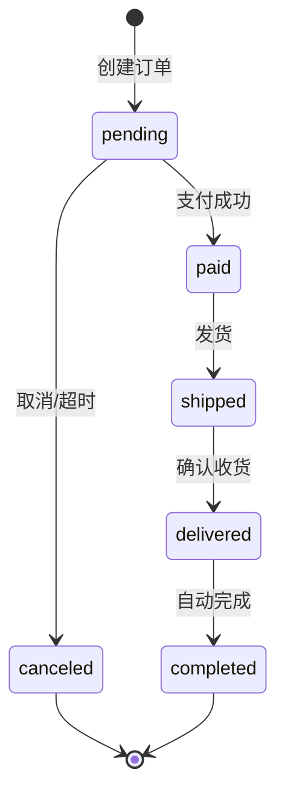

# Skill: 设计业务流程 (Process Design)

## 工作流位置

```
techdesign-01 架构设计
    ↓ 输出：架构方案、技术选型
techdesign-02 流程设计 ← 当前技能（可选，复杂业务流程时使用）
    ↓ 输出：流程图、状态机、业务规则
techdesign-03 功能设计
    ↓ 输出：功能规格、用例设计
techdesign-04 实体设计
    ↓ 输出：实体模型、领域模型
techdesign-05 数据库设计 ─┬─ 可并行
techdesign-06 API设计    ─┘
    ↓ 输出：DDL、API文档
techdesign-07 交付规划（可选）
```

**上游输入**: 01-architecture 的架构方案
**下游使用**: 03-feature 将使用本技能输出的流程图和状态机
**何时使用**: 多状态流转、审批流程、多角色协作等复杂业务场景
**路径选择**: 参见 [techdesign-01-architecture 路径选择指南](mdc:skills/techdesign-01-architecture/SKILL.md)

> ⚠️ **必读**: [通用规范](mdc:.codebuddy/spec/global/standards/common/index.md) - 项目记忆引用和所有规范要求

## 核心原则（15秒速查）

1. **原子性聚焦** - 只设计业务逻辑，不涉及技术实现
2. **状态完整** - 涵盖对象所有生命周期（≥5个状态）
3. **规则量化** - 用具体数字，避免模糊词（"30分钟"而非"较短时间"）
4. **异常全面** - 识别所有异常情况（≥10个）
5. **权限清晰** - 明确角色边界和操作权限
6. **事件驱动** - 复杂流程考虑事件溯源模式

## 技能信息

### 设计范围
- ✅ 业务流程梳理（主流程、子流程、异常流程）
- ✅ 状态机设计（状态定义、状态转移、约束条件）
- ✅ 业务规则定义（计算规则、决策规则、验证规则）
- ✅ 角色权限划分（角色定义、操作权限、数据权限）
- ✅ 异常处理设计（异常识别、补偿机制、重试策略）

### 不包含
- ❌ 技术架构设计（框架选型、技术栈）
- ❌ API 接口设计（RESTful API、GraphQL）
- ❌ 数据库设计（表结构、字段定义、索引）
- ❌ UI/UX 设计（页面布局、交互设计）

### 文档输出
- 遵循 [文档生成原则](mdc:.codebuddy/spec/global/standards/common/document-generation-rules.md)
- 输出路径: `workspace/{变更ID}/design/process-design.md`
- 只在用户明确要求时生成文档

---

## 使用场景

### 何时使用
- 需要梳理业务流程和状态转移
- 需要定义业务规则和权限
- 需要设计异常处理和补偿机制

### 何时不用
- 简单CRUD功能（无复杂状态转移）
- 技术实现细节（用其他Skills）
- 纯UI交互设计

---

## 设计流程

### 1. 识别核心业务对象和生命周期

**操作**：

识别核心业务对象（≥2个）并定义生命周期：

```markdown
## 核心业务对象

### 订单 (Order)
**生命周期**: 创建 → 待支付 → 已支付 → 已发货 → 已收货 → 已完成

**关键事件**:
- 创建订单 (create_order)
- 支付订单 (pay_order)
- 发货 (ship_order)
- 确认收货 (confirm_delivery)
- 取消订单 (cancel_order)

**业务约束**:
- 订单金额 > 0
- 订单必须关联用户和商品
- 待支付订单30分钟后自动取消
```

---

### 2. 设计状态机

**操作**：

定义状态（≥5个）、状态转移规则、约束条件：

```markdown
## 订单状态机

### 状态定义
| 状态 | 说明 | 可执行操作 |
|------|------|----------|
| pending | 待支付 | 支付、取消 |
| paid | 已支付 | 发货、申请退款 |
| shipped | 已发货 | 确认收货、申请退货 |
| delivered | 已收货 | 评价、自动完成 |
| completed | 已完成 | 评价（如未评价） |
| canceled | 已取消 | 无 |

### 状态转移规则

#### pending → paid (支付成功)
- **触发事件**: 用户支付成功
- **前置条件**: 订单状态为pending，订单未过期（30分钟内）
- **转移动作**: 扣减库存、生成支付单、发送通知
- **后置条件**: 订单状态为paid，库存已扣减

#### pending → canceled (取消订单)
- **触发事件**: 用户取消 或 30分钟未支付自动取消
- **前置条件**: 订单状态为pending
- **转移动作**: 释放库存、更新状态、发送通知
- **后置条件**: 订单状态为canceled

### 状态约束

**禁止的转移**:
- ❌ shipped → canceled (已发货不能取消，只能退货)
- ❌ completed → 任何状态 (已完成是终态)

**时间约束**:
- pending: 最多30分钟，超时自动取消
- paid: 最多48小时，超时提醒发货
- shipped: 最多7天，超时自动确认收货
```

**状态转移图**（Mermaid）:


---

### 3. 梳理主要业务流程

**操作**：

描述主要流程（≥3个）和异常流程：

```markdown
## P0 核心流程: 用户购物流程

**参与者**: 用户、卖家、支付系统（外部）、物流系统（外部）

**流程步骤**:

#### 阶段1: 选择商品
1. 用户浏览商品列表
2. 用户选择商品规格（颜色、尺寸）
3. 用户加入购物车

#### 阶段2: 创建订单
1. 用户确认商品信息（数量、规格、价格）
2. 用户选择收货地址和支付方式
3. 系统生成订单（状态: pending）
4. 系统计算订单金额（商品金额 + 运费 - 优惠）

#### 阶段3: 支付订单
1. 用户确认支付
2. 系统调用支付系统
3. **正常流程**: 支付成功 → 订单状态: paid，扣减库存
4. **异常流程**: 支付失败 → 订单保持pending，提示重试

#### 阶段4: 发货
1. 卖家确认订单
2. 卖家创建物流单
3. 订单状态: paid → shipped

#### 阶段5: 收货
1. 物流配送商品
2. 用户确认收货 或 7天后自动确认
3. 订单状态: shipped → delivered

#### 阶段6: 完成
1. 用户可以评价商品
2. 7天后自动完成
3. 订单状态: delivered → completed

**异常流程**:

#### 异常1: 支付超时
- **触发条件**: 30分钟内未支付
- **处理**: 自动取消，释放库存

#### 异常2: 库存不足
- **触发条件**: 支付时库存不足
- **处理**: 支付失败，提示用户

#### 异常3: 物流丢件
- **触发条件**: 物流过程中商品丢失
- **处理**: 用户申诉，平台介入
```

---

### 4. 定义业务规则

**操作**：

定义计算规则、决策规则、验证规则：

```markdown
## 业务规则

### 计算规则

#### 订单金额计算
- 商品小计 = Σ(商品单价 × 数量)
- 运费 = 根据重量、距离、配送方式计算
- 优惠金额 = 优惠券 + 满减 + 会员折扣
- 订单总额 = 商品小计 + 运费 - 优惠金额

#### 运费计算
| 条件 | 运费 |
|------|------|
| 订单金额 < 50元 | 10元 |
| 订单金额 >= 50元 | 免运费 |
| 偏远地区 | 额外20元 |

### 决策规则

#### 库存扣减时机
- **何时扣减**: 订单支付成功时（而非创建订单时）
- **原因**: 避免未支付订单占用库存

#### 自动取消规则
| 状态 | 条件 | 动作 |
|------|------|------|
| pending | 30分钟未支付 | 自动取消，释放库存 |
| paid | 48小时未发货 | 提醒卖家 |
| shipped | 7天未收货 | 自动确认收货 |

### 验证规则

#### 订单创建验证
- [ ] 用户已登录
- [ ] 商品存在且未下架
- [ ] 库存充足（至少预检查）
- [ ] 收货地址完整（姓名、电话、详细地址）

#### 支付验证
- [ ] 订单状态为pending
- [ ] 订单未过期（30分钟内）
- [ ] 支付金额等于订单总额
```

---

### 5. 定义角色和权限

**操作**：

定义角色（≥3个）和权限边界：

```markdown
## 角色和权限

### 系统角色
| 角色 | 职责 | 权限范围 |
|------|------|---------|
| 买家 | 浏览、下单、支付、收货、评价 | 仅自己的数据 |
| 卖家 | 管理商品、处理订单、发货 | 自己店铺的数据 |
| 管理员 | 管理用户、商品、订单、处理投诉 | 所有数据 |

### 订单权限
| 操作 | 买家 | 卖家 | 管理员 |
|------|------|------|--------|
| 创建订单 | ✅ | ❌ | ✅ |
| 查询订单 | ✅ (自己的) | ✅ (店铺的) | ✅ (所有) |
| 取消订单 | ✅ (pending状态) | ❌ | ✅ (任何) |
| 确认收货 | ✅ (自己的) | ❌ | ✅ (任何) |

### 权限边界
- ❌ 买家不能查看其他买家的订单
- ❌ 卖家不能查看其他卖家的订单
- ❌ 买家不能修改订单金额
```

---

### 6. 设计异常和补偿处理

**操作**：

识别异常（≥10个）、设计补偿和重试机制：

```markdown
## 异常处理

### 业务异常识别

#### 商品相关异常
| 异常 | 触发条件 | 处理方案 |
|------|---------|---------|
| 商品下架 | 购物车中商品被下架 | 提示用户，移除购物车 |
| 价格变化 | 加入购物车后价格改变 | 提示用户确认 |
| 库存不足 | 支付时库存不足 | 支付失败，提示用户 |

#### 支付相关异常
| 异常 | 触发条件 | 处理方案 |
|------|---------|---------|
| 支付失败 | 余额不足、网络异常 | 支持重试（最多3次） |
| 支付超时 | 支付系统响应慢 | 设置5秒超时，异步查询 |
| 重复支付 | 误点击多次 | 幂等性检查，防止重复扣款 |

#### 订单相关异常
| 异常 | 触发条件 | 处理方案 |
|------|---------|---------|
| 订单超时 | 30分钟内未支付 | 自动取消，释放库存 |
| 长时间未发货 | 48小时未发货 | 提醒卖家，可申请退款 |
| 物流丢件 | 商品丢失 | 用户申诉，平台介入 |

### 补偿机制

#### 库存补偿
- **场景**: 订单取消、退款、支付失败
- **补偿动作**: 回加库存
- **幂等性**: 使用唯一标识防止重复补偿

#### 退款补偿
- **场景**: 订单取消、退货、支付失败
- **补偿动作**: 退款到原支付账户
- **时间**: 1-3个工作日到账

### 重试机制

#### 支付重试
- **自动重试**: 网络异常、超时 → 重试3次
- **手动重试**: 余额不足 → 用户手动重试
- **退避策略**: 重试间隔1s、2s、5s
```

---

## 质量检查

### 核心业务对象
- [ ] 业务对象已识别（≥2个）
- [ ] 生命周期已明确（≥3个阶段）
- [ ] 关键事件已列出（≥3个）

### 状态机设计
- [ ] 所有状态已定义（≥5个）
- [ ] 状态转移已明确（≥8个转移）
- [ ] 每个转移包含：触发事件、前置条件、转移动作、后置条件
- [ ] 禁止的转移已明确
- [ ] 时间约束已定义

### 主要业务流程
- [ ] 主要流程已识别（≥3个）
- [ ] 流程阶段已明确（≥3个阶段）
- [ ] 流程参与者已明确
- [ ] 异常流程已识别（≥3个）
- [ ] 流程图使用 BPMN 2.0 标准符号

### 业务规则
- [ ] 计算规则已定义（≥3个）
- [ ] 决策规则已定义（≥5个）
- [ ] 验证规则已定义（≥3个）
- [ ] 规则都是可量化的（无模糊词）

### 角色权限
- [ ] 系统角色已定义（≥3个）
- [ ] 操作权限已定义（≥10个）
- [ ] 权限边界已明确

### 异常处理
- [ ] 业务异常已识别（≥10个）
- [ ] 每个异常都有明确处理方案
- [ ] 补偿机制已设计（≥3个）
- [ ] 重试机制已设计（≥3个）

### 高级模式（可选）
- [ ] 复杂流程考虑事件溯源模式
- [ ] 跨服务任务考虑 Job-Task 模式
- [ ] 异步任务有补偿和重试策略

### 🚨 红灯信号
以下任一出现，立即停止：
- [ ] 流程中包含技术细节（API、数据库操作）
- [ ] 状态机不完整（遗漏重要状态）
- [ ] 业务规则模糊（使用"尽快"、"尽量"）
- [ ] 缺少异常处理
- [ ] 无权限边界定义

---

## 常见问题

### 问题1：流程包含技术细节
```markdown
# ❌ 避免
阶段3: 支付订单
1. 调用 POST /api/v1/payment/create
2. 更新数据库表 orders，设置 status = 'paid'

# ✅ 推荐
阶段3: 支付订单
1. 用户确认支付
2. 系统调用支付系统（外部服务）
3. 支付成功 → 订单状态: paid，扣减库存
```

### 问题2：状态机不完整
```markdown
# ❌ 避免
订单状态: pending → paid → shipped → completed

# ✅ 推荐
订单状态:
- pending (待支付)
- paid (已支付)
- shipped (已发货)
- delivered (已收货)
- completed (已完成)
- canceled (已取消)
- refunding (退款中)
```

### 问题3：业务规则模糊
```markdown
# ❌ 避免
订单超时后自动取消

# ✅ 推荐
订单创建后30分钟内未支付 → 自动取消，释放库存
```

---

## 最佳实践

### 流程清晰简洁
- 流程步骤明确，有清晰的输入、输出
- 分层描述：主流程 + 子流程
- 避免过度复杂

### 状态机完整
- 涵盖对象所有生命周期
- 每个转移都有明确触发条件
- 明确哪些转移禁止

### 规则量化
- 用具体数字（"30分钟"而非"较短时间"）
- 规则完整（包含条件和结果）
- 规则可验证

### 异常处理全面
- 充分识别各种异常（≥10个）
- 每个异常都有明确处理方案
- 设计补偿机制和重试策略

---

## 参考资源

### BPMN 2.0 符号参考

流程图设计推荐使用 BPMN 2.0 标准符号：

**事件符号**:
| 符号 | 名称 | 说明 |
|------|------|------|
| ○ | 开始事件 | 流程起点 |
| ◎ | 中间事件 | 流程中的事件（消息、定时器、信号） |
| ◉ | 结束事件 | 流程终点 |

**活动符号**:
| 符号 | 名称 | 说明 |
|------|------|------|
| □ | 任务 | 原子工作单元 |
| □+ | 子流程 | 可展开的复合活动 |

**网关符号**:
| 符号 | 名称 | 说明 |
|------|------|------|
| ◇ | 排他网关 | 只选择一条路径（XOR） |
| ◇+ | 并行网关 | 所有路径同时执行（AND） |
| ◇○ | 包容网关 | 选择一条或多条路径（OR） |

**连接符号**:
| 符号 | 名称 | 说明 |
|------|------|------|
| → | 顺序流 | 活动执行顺序 |
| ⇢ | 消息流 | 跨池/泳道的消息传递 |
| ··> | 关联 | 数据或注释关联 |

---

### 事件溯源模式 (Event Sourcing)

**适用场景**:
- 需要完整审计日志
- 业务状态需要回溯
- 复杂业务规则频繁变更
- 需要支持时间旅行查询

**核心概念**:
```markdown
传统模式: 只存储当前状态
事件溯源: 存储所有状态变更事件，当前状态 = 事件重放

事件流示例（订单）:
1. OrderCreated { orderId: 001, userId: 123, items: [...] }
2. OrderPaid { orderId: 001, amount: 100.00, paidAt: ... }
3. OrderShipped { orderId: 001, trackingNo: SF123456 }
4. OrderDelivered { orderId: 001, deliveredAt: ... }

当前状态 = 重放事件 1→2→3→4
```

**事件设计原则**:
```markdown
1. 事件不可变 - 已发布的事件不能修改
2. 事件自描述 - 包含足够信息重建状态
3. 事件有序 - 按时间顺序存储和处理
4. 事件版本化 - 支持事件结构演进

事件结构示例:
{
  "eventId": "evt-001",
  "eventType": "OrderPaid",
  "aggregateId": "order-001",
  "aggregateType": "Order",
  "version": 2,
  "timestamp": "2025-01-15T10:30:00Z",
  "payload": {
    "amount": 100.00,
    "paymentMethod": "ALIPAY"
  },
  "metadata": {
    "userId": "user-123",
    "traceId": "trace-abc"
  }
}
```

**何时使用**:
- ✅ 金融交易、审计合规
- ✅ 复杂业务流程、多步骤操作
- ✅ 需要业务回溯、状态重建
- ❌ 简单 CRUD、无审计需求

---

### Job-Task 模式（异步任务处理）

**适用场景**:
- 跨服务的长事务处理
- 需要重试和补偿的异步操作
- 定时任务和批量处理
- 替代复杂的分布式事务

**核心概念**:
```markdown
Job: 一个完整的业务任务（如：订单处理）
Task: Job 中的单个步骤（如：扣库存、创建支付单）

Job 状态: PENDING → RUNNING → COMPLETED / FAILED
Task 状态: PENDING → RUNNING → SUCCESS / FAILED / RETRYING
```

**Job-Task 设计模板**:
```markdown
## Job: 订单处理

**Job ID**: JOB-ORDER-{orderId}
**触发条件**: 用户提交订单
**超时时间**: 30分钟
**重试策略**: 最多3次，指数退避

### Task 列表

| 序号 | Task | 依赖 | 超时 | 重试 | 补偿动作 |
|------|------|------|------|------|---------|
| 1 | 验证库存 | 无 | 5s | 3次 | 无 |
| 2 | 锁定库存 | Task1 | 5s | 3次 | 释放库存 |
| 3 | 创建支付单 | Task2 | 10s | 3次 | 取消支付单 |
| 4 | 等待支付回调 | Task3 | 30min | 无 | 退款 |
| 5 | 扣减库存 | Task4 | 5s | 3次 | 回滚库存 |
| 6 | 更新订单状态 | Task5 | 5s | 3次 | 无 |

### 执行流程
```
Task1 → Task2 → Task3 → Task4(异步等待) → Task5 → Task6
          ↓ 失败
       补偿: Task2补偿 → 标记Job失败
```

### 补偿机制
- **Task2 失败**: 释放锁定的库存
- **Task3 失败**: 释放库存 + 取消支付单
- **Task4 超时**: 释放库存 + 取消支付单 + 通知用户
- **Task5 失败**: 退款 + 释放库存
```

**Job-Task vs 分布式事务**:
| 对比项 | Job-Task | 分布式事务(2PC/Saga) |
|--------|---------|---------------------|
| 复杂度 | 低 | 高 |
| 一致性 | 最终一致 | 强一致/最终一致 |
| 性能 | 高 | 较低 |
| 可观测性 | 好（任务状态可查） | 一般 |
| 适用场景 | 大多数业务场景 | 强一致性要求 |

**实现建议**:
```java
// Job 实体
@Entity
public class Job {
    private String jobId;
    private String jobType;
    private JobStatus status;  // PENDING, RUNNING, COMPLETED, FAILED
    private String payload;
    private LocalDateTime createdAt;
    private LocalDateTime completedAt;
    private int retryCount;
}

// Task 实体
@Entity
public class Task {
    private String taskId;
    private String jobId;
    private String taskType;
    private int sequence;
    private TaskStatus status;  // PENDING, RUNNING, SUCCESS, FAILED, COMPENSATING
    private String result;
    private int retryCount;
}

// 任务执行器
@Component
public class OrderJobExecutor implements JobExecutor {
    @Override
    public void execute(Job job) {
        // 按顺序执行 Task，失败时触发补偿
    }
}
```

---

### 相关Skills
- [techdesign-01-architecture](mdc:skills/techdesign-01-architecture/SKILL.md) - 系统架构设计
- [techdesign-03-feature](mdc:skills/techdesign-03-feature/SKILL.md) - 功能详细设计
- [techdesign-06-api](mdc:skills/techdesign-06-api/SKILL.md) - API接口设计
