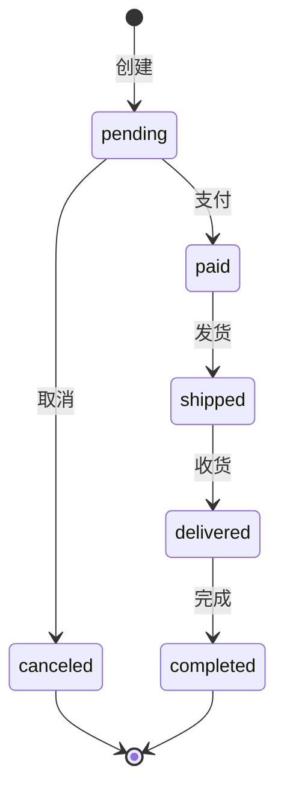

# 业务流程设计参考

## 状态机设计原则

### 状态完整性
- 涵盖对象所有生命周期阶段
- 包含异常状态（如退款中、申诉中）
- 明确终态（如已完成、已取消）

### 转移清晰性
每个状态转移必须包含：
- **触发事件**: 什么导致转移
- **前置条件**: 转移前必须满足的条件
- **转移动作**: 转移过程中执行的操作
- **后置条件**: 转移后的状态和数据变化

### 约束明确性
- 禁止的转移（如已完成不能再修改）
- 时间约束（如30分钟后自动取消）
- 条件约束（如只有特定角色才能执行某转移）

---

## 业务规则类型

### 计算规则
定义如何计算业务数据：
```
订单总额 = 商品小计 + 运费 - 优惠金额
运费 = 基础运费 + 偏远费 + 大件费
优惠金额 = min(优惠券, 满减, 会员折扣)
```

### 决策规则
定义业务决策逻辑：
```
库存扣减时机:
- 何时: 支付成功时
- 原因: 避免未支付订单占用库存
- 失败处理: 支付失败 → 不扣库存

自动取消规则:
- pending状态 + 30分钟未支付 → 自动取消
- paid状态 + 48小时未发货 → 提醒卖家
```

### 验证规则
定义数据有效性检查：
```
订单创建验证:
- 用户已登录
- 商品存在且未下架
- 库存充足
- 收货地址完整（姓名、电话、详细地址）
- 支付方式有效
```

---

## 角色权限设计

### 角色定义
```
| 角色 | 职责 | 权限范围 |
|------|------|---------|
| 普通用户 | 基本操作 | 仅自己的数据 |
| 管理员 | 管理和维护 | 所有数据 |
| 系统 | 自动化处理 | 所有数据 |
```

### 权限矩阵
```
| 操作 | 用户A | 用户B | 管理员 |
|------|-------|-------|--------|
| 创建 | ✅ | ✅ | ✅ |
| 查询 | ✅(自己的) | ✅(自己的) | ✅(所有) |
| 修改 | ✅(自己的) | ✅(自己的) | ✅(所有) |
| 删除 | ❌ | ❌ | ✅ |
```

### 权限边界
- 数据隔离：用户只能访问自己的数据
- 操作限制：某些操作需要特定权限
- 状态限制：某些状态下才能执行特定操作

---

## 异常处理模式

### 异常分类
```
业务异常:
- 库存不足
- 支付失败
- 订单超时

系统异常:
- 网络超时
- 服务不可用
- 数据库异常

外部异常:
- 支付系统异常
- 物流系统异常
- 第三方API异常
```

### 补偿机制
```
库存补偿:
- 场景: 订单取消、支付失败
- 动作: 回加库存
- 幂等性: 使用唯一标识防止重复补偿

退款补偿:
- 场景: 订单取消、退货
- 动作: 退款到原账户
- 时间: 1-3个工作日
```

### 重试策略
```
支付重试:
- 自动重试: 网络异常、超时 → 重试3次
- 手动重试: 余额不足 → 用户手动重试
- 退避策略: 1s、2s、5s

通知重试:
- 重试次数: 3次
- 重试间隔: 1分钟、5分钟、15分钟
- 失败处理: 记录日志，人工处理
```

---

## 常用状态机模板

### 订单状态机
```
状态: pending → paid → shipped → delivered → completed
异常分支:
- pending → canceled (取消/超时)
- paid → refunding (申请退款)
- shipped → returned (申请退货)
```

### 审批状态机
```
状态: draft → pending → approved/rejected
异常分支:
- pending → withdrawn (撤回)
- rejected → draft (修改后重新提交)
```

### 内容审核状态机
```
状态: draft → reviewing → approved → published
异常分支:
- reviewing → rejected (审核不通过)
- published → offline (下架)
```

---

## 业务流程图绘制

### Mermaid 语法


### 流程图最佳实践
- 使用标准符号
- 清晰标注转移条件
- 包含异常分支
- 避免过于复杂

---

## 规则量化标准

### 时间量化
```
❌ 模糊: 尽快处理
✅ 量化: 30分钟内处理

❌ 模糊: 较短时间
✅ 量化: 24小时内

❌ 模糊: 一定时间后
✅ 量化: 7天后
```

### 数量量化
```
❌ 模糊: 大量数据
✅ 量化: 超过1000条

❌ 模糊: 少量库存
✅ 量化: 库存 < 10件

❌ 模糊: 高价商品
✅ 量化: 价格 > 1000元
```

### 频率量化
```
❌ 模糊: 经常检查
✅ 量化: 每小时检查一次

❌ 模糊: 定期同步
✅ 量化: 每天凌晨3点同步

❌ 模糊: 多次重试
✅ 量化: 最多重试3次
```

---

## 相关资源

- [状态机设计模式](https://en.wikipedia.org/wiki/State_pattern)
- [业务流程建模标准](https://www.bpmn.org/)
- [Mermaid状态图语法](https://mermaid-js.github.io/mermaid/#/stateDiagram)
