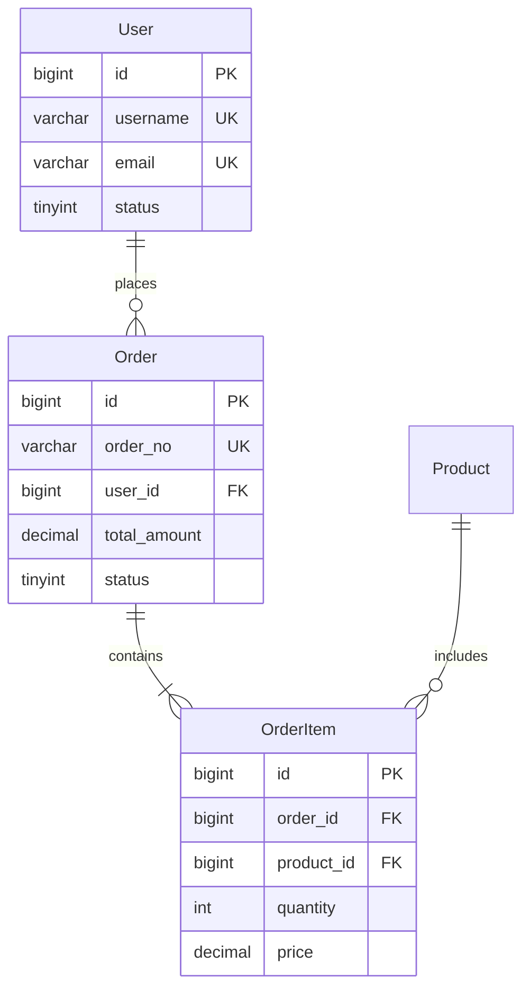

# 数据库设计

## 工作流位置

```
techdesign-01 架构设计
    ↓ 输出：架构方案、技术选型
techdesign-02 流程设计（可选）
    ↓ 输出：流程图、状态机
techdesign-03 功能设计
    ↓ 输出：功能规格、用例设计
techdesign-04 实体设计
    ↓ 输出：实体模型、领域模型
techdesign-05 数据库设计 ← 当前技能 ─┬─ 可与 06-api 并行
techdesign-06 API设计              ─┘
    ↓ 输出：DDL、索引策略、API文档
techdesign-07 交付规划（可选）
```

**上游输入**: 04-entity 实体模型、03-feature 功能规格
**下游使用**: 07-delivery-planning 将使用本技能输出的 DDL 进行工作量评估
**路径选择**: 参见 [techdesign-01-architecture 路径选择指南](mdc:skills/techdesign-01-architecture/SKILL.md)

> ⚠️ **必须遵守**: [通用规范](mdc:.codebuddy/spec/global/standards/common/index.md) - 包含项目规范要求
> 📁 **输出路径**: `workspace/{变更ID}/design/database-design.md`

## 核心原则（15 秒速查）

1. **业务驱动设计** - 从业务实体出发，而非从技术角度设计表结构
2. **性能优于范式** - 默认 3NF，根据查询性能需要适当反范式
3. **演进优于完美** - 先满足当前需求，预留扩展空间
4. **索引最左前缀** - 联合索引遵循等值查询 → 范围查询 → 排序字段顺序
5. **金额用 DECIMAL** - 避免 FLOAT/DOUBLE 精度问题
6. **软删除优先** - 使用 delete_time 而非物理删除
7. **必备审计字段** - 所有表包含 id、create_time、update_time、delete_time

## 概述

将业务实体转化为规范化的数据库表结构，确保数据完整性、查询性能和可扩展性。

**核心原则**: 业务驱动设计，性能优于范式，演进优于完美。

## 何时使用

**触发信号**:
- 业务实体已识别，需要设计数据库表结构
- 实体关系已梳理，需要转化为表关系  
- 有查询场景，需要设计索引策略
- 团队问"这个字段用什么类型？"

**前置条件**:
- ✅ 业务实体已识别
- ✅ 实体关系已梳理（1:1、1:N、M:N）
- ✅ 查询场景已明确
- ✅ 数据量级已评估

## 执行流程

### 步骤 1：实体分析

从需求文档提取业务实体，明确属性和关系：

```markdown
## 业务实体分析（电商系统示例）

### 实体列表
1. **用户（User）**: id, username, email, phone, status
2. **订单（Order）**: id, order_no, user_id, total_amount, status  
3. **订单明细（OrderItem）**: id, order_id, product_id, quantity, price

### 实体关系
- User 1:N Order
- Order 1:N OrderItem  
- Product M:N Order (通过 OrderItem)
```

### 步骤 2：表结构设计

遵循 [数据库字段规范](mdc:.codebuddy/spec/global/standards/backend/common/database-fields.md)：

**命名规范**:
- 表名：小写+下划线，复数（`users`, `orders`）
- 字段名：小写+下划线（`user_id`, `create_time`）
- 主键：统一用 `id`，外键用 `关联表_id`

**必备字段**:
```sql
-- 所有表必须包含
id BIGINT UNSIGNED AUTO_INCREMENT PRIMARY KEY,
create_time DATETIME NOT NULL DEFAULT CURRENT_TIMESTAMP,
update_time DATETIME NOT NULL DEFAULT CURRENT_TIMESTAMP ON UPDATE CURRENT_TIMESTAMP,
delete_time DATETIME NULL DEFAULT NULL COMMENT '软删除'
```

**字段类型选择**:
- 整数：`TINYINT`(状态) / `INT`(数量) / `BIGINT`(ID)
- 字符串：`VARCHAR(N)`(变长) / `TEXT`(长文本)  
- 金额：`DECIMAL(10,2)`（**必须**，避免精度问题）
- 时间：`DATETIME`(业务时间) / `TIMESTAMP`(系统时间)

### 步骤 3：索引设计

**核心原则** - 最左前缀 + 高选择性优先：

```sql
-- 查询: WHERE user_id = ? AND status = ? ORDER BY create_time DESC
-- 正确的索引顺序：等值查询 → 范围查询 → 排序字段
KEY idx_user_status_time (user_id, status, create_time)

-- 错误示例
KEY idx_time_user_status (create_time, user_id, status)  -- ❌ 排序字段不应在前
```

**索引验证**:
```sql
EXPLAIN SELECT * FROM orders WHERE user_id = ? AND status = ?;
-- 期望: type=ref, key=idx_user_status_time, 无 Using filesort
```

### 步骤 4：生成完整 DDL

```sql
-- 用户表
CREATE TABLE `users` (
  `id` BIGINT UNSIGNED NOT NULL AUTO_INCREMENT COMMENT '用户ID',
  `username` VARCHAR(50) NOT NULL COMMENT '用户名',
  `email` VARCHAR(100) NOT NULL COMMENT '邮箱',
  `phone` VARCHAR(20) NOT NULL COMMENT '手机号',
  `status` TINYINT NOT NULL DEFAULT 1 COMMENT '状态：1-正常，2-禁用',
  `create_time` DATETIME NOT NULL DEFAULT CURRENT_TIMESTAMP COMMENT '创建时间',
  `update_time` DATETIME NOT NULL DEFAULT CURRENT_TIMESTAMP ON UPDATE CURRENT_TIMESTAMP COMMENT '更新时间',
  `delete_time` DATETIME NULL DEFAULT NULL COMMENT '删除时间',
  PRIMARY KEY (`id`),
  UNIQUE KEY `uk_username` (`username`),
  UNIQUE KEY `uk_email` (`email`),
  KEY `idx_status` (`status`),
  KEY `idx_delete_time` (`delete_time`)
) ENGINE=InnoDB DEFAULT CHARSET=utf8mb4 COMMENT='用户表';

-- 订单表
CREATE TABLE `orders` (
  `id` BIGINT UNSIGNED NOT NULL AUTO_INCREMENT COMMENT '订单ID',
  `order_no` VARCHAR(32) NOT NULL COMMENT '订单号',
  `user_id` BIGINT UNSIGNED NOT NULL COMMENT '用户ID',
  `total_amount` DECIMAL(10,2) NOT NULL COMMENT '总金额',
  `status` TINYINT NOT NULL DEFAULT 1 COMMENT '状态：1-待支付，2-已支付，3-已发货，4-已完成，5-已取消',
  `create_time` DATETIME NOT NULL DEFAULT CURRENT_TIMESTAMP COMMENT '创建时间',
  `update_time` DATETIME NOT NULL DEFAULT CURRENT_TIMESTAMP ON UPDATE CURRENT_TIMESTAMP COMMENT '更新时间',
  `delete_time` DATETIME NULL DEFAULT NULL COMMENT '删除时间',
  PRIMARY KEY (`id`),
  UNIQUE KEY `uk_order_no` (`order_no`),
  KEY `idx_user_status_time` (`user_id`, `status`, `create_time`),
  KEY `idx_delete_time` (`delete_time`)
) ENGINE=InnoDB DEFAULT CHARSET=utf8mb4 COMMENT='订单表';
```

## 关键决策点

### 冗余 vs 规范化
```sql
-- ✅ 适当冗余，提升性能
CREATE TABLE `order_items` (
  `product_name` VARCHAR(200) NOT NULL COMMENT '商品名称（冗余，保留历史快照）',
  `price` DECIMAL(10,2) NOT NULL COMMENT '单价（冗余，记录下单时价格）'
);
```

### 分表决策
**何时分表**（满足任一条件）:
- 单表 > 1000万 且索引优化无效
- 单库 QPS > 1000 且读写分离无效
- 存储空间是瓶颈

**优先级**: 索引优化 → 缓存 → 读写分离 → 分表

## 验证清单

### 表结构检查
- [ ] 所有业务实体都有对应表
- [ ] 表名/字段名符合命名规范  
- [ ] 金额字段使用 DECIMAL（非 FLOAT）
- [ ] 主键使用 BIGINT（非 VARCHAR）
- [ ] 必备字段完整（id, create_time, update_time, delete_time）

### 索引检查
- [ ] 高频查询有对应索引
- [ ] 联合索引遵循最左前缀原则
- [ ] 用 EXPLAIN 验证查询计划（type=ref/const）
- [ ] 唯一约束字段有唯一索引

### 数据建模检查
- [ ] 已选择合适的建模方法（ER/维度）
- [ ] 范式级别已确定（3NF/反范式）
- [ ] ER 图已绘制

### 数据治理检查
- [ ] 敏感数据已识别并有处理方案
- [ ] 数据质量规则已定义
- [ ] 字段血缘已记录（重要字段）

### NoSQL 检查（如使用）
- [ ] Redis Key 命名规范
- [ ] 缓存策略已定义
- [ ] 缓存过期时间已设置
- [ ] MongoDB 文档结构已设计

### 红灯信号
- ❌ 金额用 FLOAT/DOUBLE
- ❌ 主键用 VARCHAR  
- ❌ 联合索引顺序错误
- ❌ 物理删除数据
- ❌ 敏感数据明文存储

## 相关技能

- **前置**: `techdesign-04-entity` - 实体设计
- **后续**: `techdesign-06-api` - 接口设计
- **参考**: [MySQL 技术栈](mdc:.codebuddy/spec/global/knowledge/stack/mysql.md)

---

## 数据建模方法

### 建模方法选择

| 场景 | 建模方法 | 范式 | 工具 |
|------|---------|------|------|
| OLTP 业务系统 | ER 模型 | 3NF | MySQL Workbench |
| OLAP 分析系统 | 维度模型 | 星型/雪花 | dbt, Metabase |
| 文档存储 | 文档模型 | 非范式 | MongoDB |
| 缓存/会话 | KV 模型 | 无 | Redis |

### ER 模型设计（OLTP）

**范式选择**:
```markdown
| 范式 | 特点 | 适用场景 |
|------|------|---------|
| 1NF | 字段原子性 | 所有表必须满足 |
| 2NF | 消除部分依赖 | 有复合主键时 |
| 3NF | 消除传递依赖 | 大多数业务表 |
| 反范式 | 适当冗余 | 高频查询、报表 |

推荐: 默认使用 3NF，根据性能需要适当反范式
```

**ER 图设计**:
```markdown
## 实体关系图 (ER Diagram)

### 实体识别
从业务需求中提取核心实体:
- 用户 (User)
- 订单 (Order)
- 商品 (Product)
- 订单项 (OrderItem)

### 关系定义
| 实体A | 关系 | 实体B | 说明 |
|-------|------|-------|------|
| User | 1:N | Order | 一个用户多个订单 |
| Order | 1:N | OrderItem | 一个订单多个商品 |
| Product | 1:N | OrderItem | 一个商品出现在多个订单 |

### ER 图 (Mermaid)

```

### 维度模型设计（OLAP）

**适用场景**: 数据仓库、报表系统、BI 分析

**星型模型**:
```markdown
## 销售分析星型模型

### 事实表: fact_sales
| 字段 | 类型 | 说明 |
|------|------|------|
| sale_id | BIGINT | 销售ID |
| date_key | INT | 日期维度外键 |
| product_key | INT | 商品维度外键 |
| customer_key | INT | 客户维度外键 |
| store_key | INT | 门店维度外键 |
| quantity | INT | 销售数量 |
| amount | DECIMAL | 销售金额 |
| cost | DECIMAL | 成本 |

### 维度表
- dim_date: 日期维度（年、季、月、周、日）
- dim_product: 商品维度（名称、分类、品牌）
- dim_customer: 客户维度（姓名、等级、地区）
- dim_store: 门店维度（名称、地区、类型）

### 查询示例
SELECT 
    d.year, d.month,
    p.category,
    SUM(f.amount) as total_sales
FROM fact_sales f
JOIN dim_date d ON f.date_key = d.date_key
JOIN dim_product p ON f.product_key = p.product_key
GROUP BY d.year, d.month, p.category
```

---

## 数据治理

### 数据质量规范

**字段完整性**:
```sql
-- 必填字段: NOT NULL
-- 默认值: DEFAULT
-- 约束检查: CHECK (MySQL 8.0+)

CREATE TABLE orders (
    id BIGINT UNSIGNED NOT NULL AUTO_INCREMENT,
    order_no VARCHAR(32) NOT NULL,
    total_amount DECIMAL(10,2) NOT NULL CHECK (total_amount >= 0),
    status TINYINT NOT NULL DEFAULT 1 CHECK (status IN (1,2,3,4,5)),
    -- ...
);
```

**数据一致性**:
```markdown
### 外键策略
| 策略 | 说明 | 适用场景 |
|------|------|---------|
| 物理外键 | 数据库强制约束 | 小型系统、强一致性 |
| 逻辑外键 | 应用层维护 | 大型系统、分库分表 |

推荐: 大多数场景使用逻辑外键 + 应用层校验
```

**数据安全**:
```markdown
### 敏感数据处理
| 数据类型 | 存储方式 | 显示方式 |
|---------|---------|---------|
| 密码 | BCrypt 加密 | 不显示 |
| 手机号 | 明文/加密 | 138****8888 |
| 身份证 | AES 加密 | 110***********1234 |
| 银行卡 | AES 加密 | ****1234 |

### 脱敏规则
- 日志: 自动脱敏敏感字段
- 导出: 按权限脱敏
- 显示: 前端脱敏
```

### 数据血缘

**字段血缘追踪**:
```markdown
## 字段血缘: orders.total_amount

### 数据来源
- 计算公式: SUM(order_items.price * order_items.quantity)
- 依赖字段: order_items.price, order_items.quantity

### 数据流向
- 下游表: report_daily_sales.total_amount
- 下游报表: 销售日报、月报

### 变更影响
修改此字段需同步更新:
- [ ] 订单详情页面
- [ ] 销售报表
- [ ] 财务对账
```

---

## NoSQL 数据库设计指导

### Redis 设计规范

**Key 命名规范**:
```markdown
格式: {业务}:{对象}:{标识}:{属性}

示例:
- user:session:123456          # 用户会话
- order:info:ORD202501150001   # 订单信息
- product:stock:10001          # 商品库存
- cache:user:list:page:1       # 用户列表缓存
```

**数据结构选择**:
| 场景 | 数据结构 | 示例 |
|------|---------|------|
| 简单缓存 | String | 用户信息、配置 |
| 对象缓存 | Hash | 用户详情、商品详情 |
| 列表/队列 | List | 消息队列、最近浏览 |
| 去重集合 | Set | 标签、好友列表 |
| 排行榜 | Sorted Set | 积分排行、热门商品 |
| 计数器 | String + INCR | PV、UV、库存 |
| 分布式锁 | String + SETNX | 防重复提交 |

**缓存设计**:
```markdown
### 缓存策略
| 策略 | 说明 | 适用场景 |
|------|------|---------|
| Cache Aside | 先查缓存，未命中查DB | 读多写少 |
| Write Through | 写入时同步更新缓存 | 数据一致性要求高 |
| Write Behind | 写入时异步更新缓存 | 高并发写入 |

### 缓存过期
- 热点数据: 永不过期 + 异步刷新
- 普通数据: 30分钟 - 24小时
- 临时数据: 5分钟 - 30分钟

### 缓存穿透/击穿/雪崩
| 问题 | 原因 | 解决方案 |
|------|------|---------|
| 穿透 | 查询不存在的数据 | 布隆过滤器、空值缓存 |
| 击穿 | 热点key过期 | 互斥锁、永不过期 |
| 雪崩 | 大量key同时过期 | 随机过期时间、多级缓存 |
```

### MongoDB 设计规范

**文档设计**:
```markdown
### 嵌入 vs 引用

| 方式 | 适用场景 | 示例 |
|------|---------|------|
| 嵌入 | 1:1、1:少量N、数据一起访问 | 用户地址 |
| 引用 | 1:大量N、M:N、独立访问 | 订单商品 |

### 嵌入示例
{
  "_id": ObjectId("..."),
  "username": "john",
  "addresses": [
    { "type": "home", "city": "北京", "detail": "..." },
    { "type": "work", "city": "上海", "detail": "..." }
  ]
}

### 引用示例
// orders 集合
{
  "_id": ObjectId("..."),
  "order_no": "ORD001",
  "user_id": ObjectId("..."),  // 引用 users
  "items": [
    { "product_id": ObjectId("..."), "quantity": 2 }
  ]
}
```

**索引设计**:
```javascript
// 单字段索引
db.users.createIndex({ "username": 1 }, { unique: true })

// 复合索引
db.orders.createIndex({ "user_id": 1, "status": 1, "create_time": -1 })

// 文本索引
db.products.createIndex({ "name": "text", "description": "text" })
```
