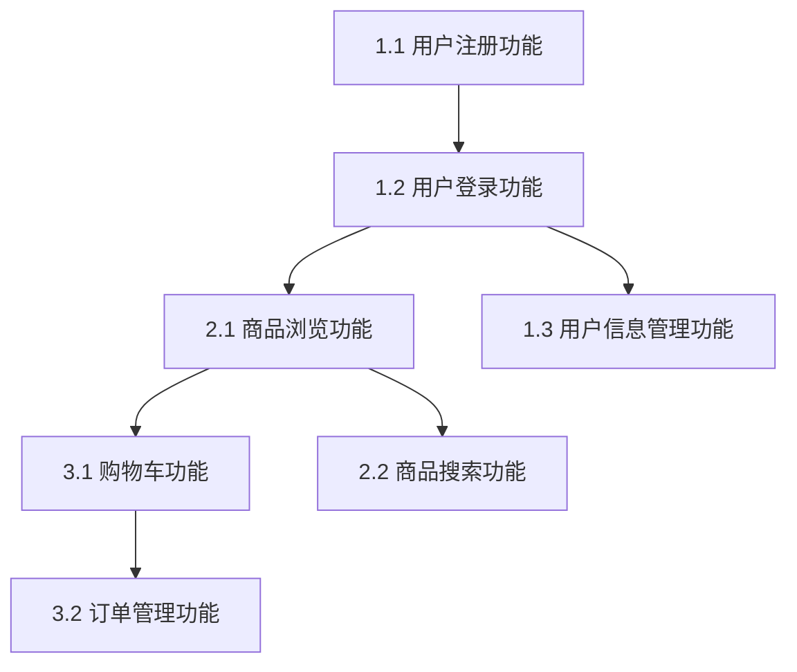

# Skill: 需求拆解 (Requirements Breakdown)

将需求文档拆解为**可执行的功能任务**，确保需求原子化、依赖清晰、可并行分析，便于后续的设计和开发工作。

> 📚 **项目记忆引用**
> - 遵循 [项目宪章](mdc:.spec-code/memory/constitution.md) 的核心原则和质量标准
> - 参考 [开发指南](mdc:.spec-code/memory/guidelines.md) 的 Skill 编写规范
> - 了解 [项目上下文](mdc:.spec-code/memory/context.md) 的技术栈和项目结构

> ⚠️ **文档生成规则**: 遵循 [文档生成原则](mdc:.codebuddy/spec/global/standards/common/document-generation-rules.md)
> - ❌ 禁止主动生成总结文档、分析报告
> - ✅ 只在用户明确要求时生成文档
> - ✅ 优先原地修改现有文档

> 📁 **输出目录规范**: 遵循 [输出目录规范](mdc:.codebuddy/spec/global/standards/common/output-directory-standard.md)
> - 输出路径: `workspace/{变更ID}/requirements/breakdown.md`
> - 变更 ID 格式: `YYYY-MM-DD-feature-name`
> - 文件头部: 必须包含 YAML Frontmatter

## 🎯 目标

解决软件研发中的 **需求拆解与分析问题**，提供 **科学的需求拆解方法**。

**适用场景**:
- 需求文档已完成，需要拆解为功能任务
- 大型需求需要拆分为多个子需求
- 多人协作分析，需要明确需求边界和依赖
- 评估需求复杂度和制定分析计划

**核心价值**:
- 需求原子化 - 每个需求不可再分，独立可理解
- 依赖清晰 - 明确需求之间的先后顺序和关联关系
- 可并行 - 识别可以同时分析的需求
- 可验证 - 每个需求都有明确的验收标准

## 📋 前置条件

- [ ] 已获得需求文档来源（见下方需求文档来源说明）
- [ ] 业务背景已明确（业务目标、用户角色、使用场景）
- [ ] 分析团队已分配（产品经理、业务分析师、架构师）
- [ ] 分析环境已准备（协作工具、文档模板）

**需求文档来源**:
1. **用户指定文档位置** - 用户直接提供需求文档的具体路径或位置
2. **需求审查技能输出** - 参考 `skills/req-review/SKILL.md` 的输出结果（可选）
3. **需求解读技能输出** - 参考 `skills/req-explain/SKILL.md` 的输出结果（可选）

**技能要求**:
- 熟悉业务领域和用户需求
- 了解需求分析的基本方法
- 掌握需求拆解的基本原则

## 🔄 执行步骤

### 步骤 0: 确定需求文档来源

**目标**: 确定和收集所有可用的需求文档来源，为后续拆解提供完整的输入。

**操作**:

1. **检查用户指定文档**
   - 首先检查用户在当前对话中是否已提供需求文档位置
   - 如果用户已提供，直接使用该文档
   - 如果用户未提供，再询问用户是否有指定的需求文档位置
   - 验证文档的可访问性和完整性
   - 记录用户指定的文档路径

2. **检查相关技能输出**
   - 检查是否存在需求审查技能的输出文件
   - 检查是否存在需求解读技能的输出文件
   - 记录找到的技能输出文件路径

3. **确定文档使用策略**
   - 如果用户指定了文档，以用户文档为主，技能输出为辅
   - 如果用户未指定文档，以技能输出为主要来源
   - 确保至少有一个可用的需求文档来源
   - 记录最终确定的文档来源清单

4. **评估文档质量**
   - 检查文档是否包含基本的需求要素（功能描述、业务场景、验收标准等）
   - 识别文档中的缺失信息或模糊描述
   - 评估文档的完整性和清晰度
   - 如果文档质量不足，建议用户先完成需求澄清或需求解读
   - 记录文档质量评估结果和需要补充的信息

**验收标准**:
- [ ] 已确定至少一个可用的需求文档来源
- [ ] 已检查用户指定文档和相关技能输出
- [ ] 已建立文档使用策略
- [ ] 已验证文档的可访问性
- [ ] 已记录实际使用的文档来源清单
- [ ] 已评估文档质量并记录评估结果
- [ ] 已识别文档中的缺失信息或需要澄清的部分

### 步骤 1: 识别需求类型

**目标**: 根据收集到的需求文档，识别需要拆解的需求类型，为拆解提供框架。

**操作**:

1. **读取需求文档**
   
   根据前置条件中确定的需求文档来源进行读取：
   
   **文档读取顺序**:
   1. **用户指定文档**（如果用户提供了具体的文档路径）
   2. **需求审查技能输出**（如果存在 `skills/req-review/SKILL.md` 的输出结果）
   3. **需求解读技能输出**（如果存在 `skills/req-explain/SKILL.md` 的输出结果）
   
   **文档读取策略**:
   - 至少需要一个主要需求文档来源
   - 多个文档来源时，相互补充和验证
   - 如果某个参考文档不存在，直接跳过，不影响拆解流程
   - 记录实际使用的文档来源，便于后续追溯

2. **按需求性质分类**

**功能需求** (Functional Requirements):
- 用户管理需求（注册、登录、权限管理）
- 业务流程需求（订单处理、支付流程、审批流程）
- 数据管理需求（数据录入、查询、统计）
- 接口集成需求（第三方系统对接、API调用）
- 报表需求（数据展示、导出、分析）

**非功能需求** (Non-Functional Requirements):
- 性能需求（响应时间、并发用户数、吞吐量）
- 安全需求（身份认证、数据加密、权限控制）
- 可用性需求（系统可用率、故障恢复时间）
- 兼容性需求（浏览器兼容、设备兼容）
- 可维护性需求（代码规范、文档要求、监控需求）

**业务规则需求** (Business Rules):
- 业务逻辑规则（计算规则、验证规则）
- 业务流程规则（审批规则、状态转换规则）
- 数据规则（数据格式、数据约束、数据关系）
- 权限规则（角色权限、操作权限、数据权限）

**用户体验需求** (User Experience):
- 界面交互需求（页面布局、操作流程）
- 用户反馈需求（提示信息、错误处理）
- 易用性需求（操作简便性、学习成本）

**智能识别方法**:
- 通过关键词识别功能需求：用户可以、系统应该、提供...功能
- 通过关键词识别非功能需求：性能、安全、可用性、响应时间、并发
- 通过关键词识别业务规则：必须、应当、规则、约束、限制、判重
- 通过关键词识别用户体验：界面、交互、提示、易用性、Loading

**识别示例**:
- "用户可以录入简历" → 功能需求
- "支持1000万数据" → 非功能需求（性能）
- "姓名为必填项" → 业务规则
- "显示Loading效果" → 用户体验需求

**技术要点**:
- 遵循需求分析的基本原则
- 基于业务价值和用户价值进行分类
- 优先级: 功能需求 > 业务规则 > 非功能需求 > 用户体验

**验收标准**:
- [ ] 所有需求类型都已识别
- [ ] 需求类型覆盖完整的业务场景
- [ ] 需求类型与需求文档一致

### 步骤 2: 拆解需求（核心步骤）

**目标**: 将每个需求类型拆解为具体的、可分析的子需求。

**拆解原则**:

#### 原则 1: 原子化（Atomic）

**定义**: 每个需求应该是最小的、不可再分的功能单元。

**标准**:
- 单一职责: 一个需求只描述一个功能点
- 独立可理解: 不依赖其他需求的描述就能理解
- 完整性: 需求描述完整，包含输入、处理、输出
- 可验证性: 需求可以通过明确的标准进行验证

**示例**:

❌ **不好的拆解**（粒度过大）:
```markdown
需求 1: 实现用户管理功能
```

✅ **好的拆解**（原子化）:
```markdown
需求 1.1: 用户注册功能
- 用户可以通过邮箱和手机号注册账户
- 系统验证邮箱格式和手机号格式
- 系统检查邮箱和手机号的唯一性
- 注册成功后发送验证邮件/短信

需求 1.2: 用户登录功能
- 用户可以通过用户名/邮箱/手机号登录
- 系统验证用户身份信息
- 登录成功后跳转到主页面
- 登录失败显示错误提示

需求 1.3: 用户信息管理功能
- 用户可以查看个人信息
- 用户可以修改个人信息（除用户名外）
- 系统记录信息修改历史
- 敏感信息修改需要身份验证
```

#### 原则 2: 可验证（Verifiable）

**定义**: 每个需求完成后应该有明确的验收标准，可以通过测试验证。

**标准**:
- 明确的功能描述
- 可量化的验收标准
- 可重复的验证步骤
- 明确的成功/失败标准

**示例**:

❌ **不好的验收标准**（模糊）:
```markdown
需求: 用户注册功能

验收标准:
- [ ] 用户可以注册
```

✅ **好的验收标准**（可验证）:
```markdown
需求: 用户注册功能

功能描述:
- 用户在注册页面填写用户名、邮箱、手机号、密码
- 系统验证输入信息的格式和唯一性
- 验证通过后创建用户账户并发送验证信息

验收标准:
- [ ] 用户名长度3-20字符，支持字母、数字、下划线
- [ ] 邮箱格式符合标准邮箱格式
- [ ] 手机号为11位数字，符合中国手机号格式
- [ ] 密码长度8-20字符，包含字母和数字
- [ ] 系统检查用户名、邮箱、手机号的唯一性
- [ ] 注册成功后发送邮箱验证邮件
- [ ] 注册成功后发送手机验证短信
- [ ] 重复信息注册时显示相应错误提示
- [ ] 格式错误时显示相应错误提示
```

#### 原则 3: 可并行（Parallelizable）

**定义**: 识别可以并行分析的需求，提高分析效率。

**标准**:
- 无业务依赖: 需求之间不共享业务逻辑
- 无数据依赖: 需求不依赖相同的数据状态
- 独立用户场景: 需求面向不同的用户场景
- 可独立验证: 需求可以独立进行业务验证

**示例**:

✅ **可并行需求组 1: 用户基础功能**
```markdown
并行组 [P1]:
- [P] 需求 1.1: 用户注册功能
- [P] 需求 1.2: 用户登录功能
- [P] 需求 1.3: 用户信息管理功能
```

✅ **可并行需求组 2: 业务功能模块**
```markdown
并行组 [P2]:
- [P] 需求 2.1: 商品管理功能
- [P] 需求 2.2: 订单管理功能
- [P] 需求 2.3: 支付管理功能
```

**技术要点**:
- 使用 `[P]` 标记可并行需求
- 在需求清单中明确标注并行组
- 并行需求的分析顺序不影响后续工作

#### 原则 4: 有依赖（Dependency-Aware）

**定义**: 明确需求之间的依赖关系，确保分析顺序正确。

**标准**:
- 依赖明确: 每个需求都列出前置需求
- 依赖合理: 依赖关系基于真实的业务约束
- 依赖最小: 避免不必要的依赖
- 依赖可追踪: 依赖关系可以可视化

**示例**:

✅ **依赖关系链**:
```markdown
需求依赖关系:

需求 1.1: 用户注册功能
  ↓ 依赖
需求 1.2: 用户登录功能
  ↓ 依赖
需求 2.1: 商品浏览功能
  ↓ 依赖
需求 2.2: 商品收藏功能
  ↓ 依赖
需求 3.1: 购物车功能
  ↓ 依赖
需求 3.2: 订单创建功能
```

**依赖类型**:

| 依赖类型 | 说明 | 示例 |
|---------|------|------|
| **强依赖（Hard）** | 必须等待前置需求分析完成 | 用户登录 → 个人中心 |
| **弱依赖（Soft）** | 可以并行分析，但有逻辑顺序 | 商品管理 → 订单管理 |
| **可选依赖（Optional）** | 可以独立分析，但建议有顺序 | 基础功能 → 高级功能 |

**操作步骤**:

1. **按照原子化原则拆解**
   - 从需求文档中提取所有功能点
   - 按照业务流程和用户场景拆分
   - 确保每个需求粒度合理（可独立分析）

2. **为每个需求定义验收标准**
   - 功能验收: 功能符合业务需求
   - 业务验收: 满足业务规则和流程
   - 用户验收: 满足用户体验要求

3. **评估需求优先级**
   
   **优先级定义**:
   - **P0（必须有）**: 核心功能，系统无此功能无法运行
   - **P1（应该有）**: 重要功能，显著影响用户体验
   - **P2（可以有）**: 增强功能，锦上添花
   - **P3（暂不需要）**: 未来功能，当前版本不实现
   
   **评估方法**:
   - 基于业务价值和用户价值
   - 考虑需求的依赖关系（被依赖的需求优先级高）
   - 考虑实现的紧急程度
   - 与产品经理和业务方确认

4. **识别需求风险**
   
   **风险类型**:
   - **技术风险**: 涉及不熟悉的技术或复杂算法
   - **业务风险**: 业务规则复杂或不明确
   - **依赖风险**: 依赖外部系统或第三方服务
   - **数据风险**: 涉及大数据量或数据迁移
   - **时间风险**: 时间紧迫或资源不足
   
   **风险标注示例**:
   ```markdown
   需求 1.1: 用户注册功能
   - **风险等级**: 中等
   - **风险因素**: 
     - 邮件/短信服务依赖第三方（依赖风险）
     - 判重逻辑需要优化算法（技术风险）
   ```

5. **识别可并行需求**
   - 标注 `[P]` 标记
   - 分组管理并行需求

6. **标注依赖关系**
   - 在每个需求中添加 `依赖: 需求 X.Y`
   - 绘制依赖图（可选）

**代码示例**（需求拆解结果）:

```markdown
## 1. 用户管理需求（用户注册登录）

### 1.1 用户注册功能
- **负责人**: 产品经理A
- **复杂度**: 中等
- **优先级**: P0
- **依赖**: 无
- **状态**: 待分析
- **可并行**: [P] 与需求 1.2 并行

**功能描述**:
用户通过注册页面创建新账户，系统验证用户信息并创建账户。

**业务场景**:
- 新用户首次使用系统时需要注册账户
- 用户提供基本信息（用户名、邮箱、手机号、密码）
- 系统验证信息有效性和唯一性
- 注册成功后发送验证信息

**验收标准**:
- [ ] 用户可以在注册页面填写注册信息
- [ ] 系统验证用户名格式（3-20字符，字母数字下划线）
- [ ] 系统验证邮箱格式（标准邮箱格式）
- [ ] 系统验证手机号格式（11位中国手机号）
- [ ] 系统验证密码强度（8-20字符，包含字母数字）
- [ ] 系统检查用户名、邮箱、手机号唯一性
- [ ] 注册成功发送邮箱验证邮件
- [ ] 注册成功发送手机验证短信
- [ ] 信息重复时显示明确错误提示
- [ ] 格式错误时显示明确错误提示

**业务规则**:
- 用户名全局唯一
- 邮箱全局唯一
- 手机号全局唯一
- 密码需要加密存储
- 注册后账户状态为"待验证"

---

## 2. 商品管理需求

### 2.1 商品浏览功能
- **负责人**: 产品经理B
- **复杂度**: 简单
- **优先级**: P0
- **依赖**: 需求 1.2（用户登录功能）
- **状态**: 待分析
- **可并行**: [P] 与需求 2.2、2.3 并行
- **风险等级**: 低
- **风险因素**: 无明显风险

**功能描述**:
用户可以浏览商品列表，查看商品详情，搜索和筛选商品。

**业务场景**:
- 用户进入系统后可以浏览商品
- 用户可以按分类查看商品
- 用户可以搜索特定商品
- 用户可以查看商品详细信息

**验收标准**:
- [ ] 用户可以查看商品列表页面
- [ ] 商品列表显示商品图片、名称、价格、评分
- [ ] 用户可以按分类筛选商品
- [ ] 用户可以按价格排序商品
- [ ] 用户可以搜索商品（按名称、描述）
- [ ] 用户可以查看商品详情页面
- [ ] 商品详情显示完整信息（图片、描述、规格、评价）
- [ ] 支持商品图片放大查看
- [ ] 支持分页显示商品列表

**业务规则**:
- 只显示上架状态的商品
- 商品按上架时间倒序排列
- 搜索结果按相关度排序
- 每页显示20个商品
```

**技术要点**:
- 专注于需求层面的分析，不涉及技术实现
- 强调业务价值和用户价值
- 注重需求的完整性和可验证性

**验收标准**:
- [ ] 所有需求都是原子化的（不可再分）
- [ ] 所有需求都有明确的验收标准
- [ ] 所有需求都有复杂度评估
- [ ] 所有需求都有优先级评估（P0/P1/P2/P3）
- [ ] 所有需求都有风险识别和评估
- [ ] 可并行需求已标注 `[P]`
- [ ] 需求依赖关系已标注
- [ ] 高风险需求已特别标注

### 步骤 3: 评估需求复杂度

**目标**: 为每个需求评估复杂度，便于后续的设计和开发规划。

**评估方法**:

#### 方法 1: 复杂度等级评估（推荐新团队）

**等级定义**:
- **简单（Simple）**: 标准的CRUD操作，业务逻辑简单
- **中等（Medium）**: 包含业务规则验证，有一定的逻辑复杂度
- **复杂（Complex）**: 涉及多个业务实体，复杂的业务流程
- **非常复杂（Very Complex）**: 跨系统集成，复杂的业务规则

**示例**:

```markdown
需求: 用户注册功能

复杂度评估:
- 数据验证: 中等（多种格式验证）
- 业务规则: 中等（唯一性检查）
- 用户交互: 简单（标准表单）
- 系统集成: 简单（邮件/短信服务）
- 综合复杂度: 中等（Medium）
```

#### 方法 2: 影响因子评估（推荐有经验团队）

**考虑因素**:
- **数据复杂度**: 涉及的数据实体数量和关系复杂度
- **业务规则复杂度**: 业务逻辑的复杂程度
- **用户交互复杂度**: 用户界面和交互的复杂程度
- **集成复杂度**: 与其他系统或服务的集成复杂度

**示例**:

```markdown
需求: 订单处理功能

复杂度评估:
- 数据复杂度: 高（涉及用户、商品、订单、支付等多个实体）
- 业务规则复杂度: 高（库存检查、价格计算、优惠券、积分等）
- 用户交互复杂度: 中等（多步骤流程）
- 集成复杂度: 高（支付系统、库存系统、物流系统）
- 综合复杂度: 非常复杂（Very Complex）
```

#### 方法 3: 故事点评估（推荐敏捷团队）

**使用 Fibonacci 数列（1、2、3、5、8、13）表示需求复杂度**。

**示例**:

```markdown
需求: 用户登录功能

复杂度评估:
- 基础登录逻辑: 2 点
- 身份验证: 2 点
- 错误处理: 1 点
- 安全控制: 3 点
- 用户体验: 1 点
- 总计: 9 点 ≈ 8 点（取最接近的 Fibonacci 数）
```

**评估方法选择指南**:
- **新团队或小型项目**: 使用复杂度等级评估（简单/中等/复杂/非常复杂）
- **有经验的团队**: 使用影响因子评估，更精确
- **敏捷团队**: 使用故事点评估，配合Planning Poker

**团队协作评估方法**:

1. **Planning Poker**:
   - 每个成员独立评估
   - 同时亮牌
   - 差异较大时讨论原因
   - 重新评估直到达成共识

2. **三点估算法**:
   - 最乐观估计（Best Case）
   - 最可能估计（Most Likely）
   - 最悲观估计（Worst Case）
   - 期望值 = (最乐观 + 4×最可能 + 最悲观) / 6

**操作步骤**:

1. **选择评估方法**
   - 新团队或小型项目: 使用复杂度等级评估
   - 有经验团队: 使用影响因子评估
   - 敏捷团队: 使用故事点评估

2. **为每个需求评估复杂度**
   - 考虑需求的各个方面
   - 团队协作评估，避免个人偏差（使用Planning Poker或三点估算法）
   - 记录评估理由

3. **汇总复杂度**
   - 计算总复杂度
   - 识别高复杂度需求
   - 评估分析工作量

**验收标准**:
- [ ] 所有需求都有复杂度评估
- [ ] 复杂度评估基于明确的方法
- [ ] 高复杂度需求已标识
- [ ] 复杂度评估得到团队认可
- [ ] 团队成员对评估方法达成共识

### 步骤 4: 分配分析任务

**目标**: 根据团队成员的专业领域和负载，合理分配需求分析任务。

**分配原则**:

#### 原则 1: 专业匹配

**将需求分配给具备相应业务知识的成员**。

**示例**:

```markdown
## 需求分析任务分配

**业务分析师A**（用户体验专家）:
- 需求 1.1: 用户注册功能
- 需求 1.2: 用户登录功能
- 需求 1.3: 用户信息管理功能
- 需求 4.1: 用户反馈功能

**业务分析师B**（电商业务专家）:
- 需求 2.1: 商品浏览功能
- 需求 2.2: 商品搜索功能
- 需求 3.1: 购物车功能
- 需求 3.2: 订单管理功能

**产品经理**（整体规划）:
- 需求 5.1: 数据统计需求
- 需求 5.2: 报表需求
- 需求整体协调和优先级确定
```

#### 原则 2: 负载均衡

**确保每个成员的分析工作量大致相当**。

**示例**:

```markdown
## 工作量分配

**业务分析师A**:
- 总复杂度: 16 点
- 需求数: 4 个
- 平均复杂度: 4 点/需求

**业务分析师B**:
- 总复杂度: 18 点
- 需求数: 4 个
- 平均复杂度: 4.5 点/需求

**产品经理**:
- 总复杂度: 12 点
- 需求数: 2 个 + 协调工作
- 平均复杂度: 6 点/需求

**调整建议**:
- 将需求 3.2（订单管理功能）的部分子需求分配给业务分析师A
- 平衡后: A 18点、B 15点、PM 12点 + 协调
```

#### 原则 3: 依赖优先

**优先分配依赖链上游的需求，避免阻塞**。

**示例**:

```markdown
## 需求分析优先级

**第 1 周**（依赖链上游）:
- 优先: 需求 1.1（用户注册功能）- 业务分析师A
- 优先: 需求 1.2（用户登录功能）- 业务分析师A

**第 2 周**（依赖需求 1.1、1.2）:
- 依赖需求 1.2: 需求 2.1（商品浏览功能）- 业务分析师B
- 依赖需求 1.2: 需求 2.2（商品搜索功能）- 业务分析师B

**第 3 周**（依赖需求 2.1、2.2）:
- 依赖需求 2.1: 需求 3.1（购物车功能）- 业务分析师B
- 依赖需求 3.1: 需求 3.2（订单管理功能）- 业务分析师B
```

**验收标准**:
- [ ] 所有需求都已分配给具体成员
- [ ] 每个成员的工作量大致均衡
- [ ] 关键路径上的需求优先分配
- [ ] 需求分配考虑了专业匹配

### 步骤 5: 输出需求拆解清单

**目标**: 生成结构化的需求拆解清单，便于后续的设计和开发工作。

**输出格式**:

遵循 [输出目录规范](mdc:.codebuddy/spec/global/standards/common/output-directory-standard.md)：

```
workspace/{变更ID}/requirements/breakdown.md
```

**输出格式选项**:

#### 格式 1: 详细文档格式（默认，推荐用于正式项目）

适用于正式项目文档，包含完整的需求描述和验收标准。

**YAML Frontmatter**:

```yaml
---
change_id: 2025-11-10-user-management
change_title: 用户管理功能需求拆解
change_status: analyzed
document_type: requirements-breakdown
stage: requirements
created_at: 2025-11-10T10:00:00Z
author: AI Assistant
source_documents: 
  - type: user_specified
    path: [用户指定的文档路径]
  - type: req_review_output
    path: [需求审查技能输出路径]
  - type: req_explain_output
    path: [需求解读技能输出路径]
version: 1.0
compliance_checked: true
compliance_status: passed
---
```

**需求拆解清单格式**:

```markdown
# 需求拆解清单：用户管理功能

## 1. 用户基础功能需求

### 1.1 用户注册功能
- **负责人**: 业务分析师A
- **复杂度**: 中等（Medium）
- **优先级**: P0
- **依赖**: 无
- **状态**: 待分析
- **可并行**: [P] 与需求 1.2 并行
- **风险等级**: 中等
- **风险因素**: 
  - 邮件/短信服务依赖第三方（依赖风险）
  - 判重逻辑需要优化算法（技术风险）

**功能描述**:
用户通过注册页面创建新账户，系统验证用户信息并创建账户。

**业务场景**:
- 新用户首次使用系统时需要注册账户
- 用户提供基本信息（用户名、邮箱、手机号、密码）
- 系统验证信息有效性和唯一性
- 注册成功后发送验证信息

**验收标准**:
- [ ] 用户可以在注册页面填写注册信息
- [ ] 系统验证用户名格式（3-20字符，字母数字下划线）
- [ ] 系统验证邮箱格式（标准邮箱格式）
- [ ] 系统验证手机号格式（11位中国手机号）
- [ ] 系统验证密码强度（8-20字符，包含字母数字）
- [ ] 系统检查用户名、邮箱、手机号唯一性
- [ ] 注册成功发送邮箱验证邮件
- [ ] 注册成功发送手机验证短信
- [ ] 信息重复时显示明确错误提示
- [ ] 格式错误时显示明确错误提示

**业务规则**:
- 用户名全局唯一
- 邮箱全局唯一
- 手机号全局唯一
- 密码需要加密存储
- 注册后账户状态为"待验证"

---

## 需求统计

- **总需求数**: 12 个
- **总复杂度**: 46 点
- **可并行需求**: 6 个
- **关键路径**: 需求 1.1 → 1.2 → 2.1 → 3.1 → 3.2

## 分析里程碑

- **里程碑 1**（第 1 周）: 用户基础功能需求分析完成
- **里程碑 2**（第 2 周）: 商品管理需求分析完成
- **里程碑 3**（第 3 周）: 订单管理需求分析完成

## 依赖图（可选）


```

#### 格式 2: 表格格式（推荐用于快速浏览和管理）

适用于快速浏览和管理，便于导入项目管理工具。

```markdown
## 需求拆解清单（表格格式）

| 需求ID | 需求名称 | 负责人 | 复杂度 | 优先级 | 风险等级 | 依赖 | 状态 |
|--------|---------|--------|--------|--------|---------|------|------|
| 1.1 | 用户注册 | 张三 | 中等 | P0 | 中等 | 无 | 待分析 |
| 1.2 | 用户登录 | 李四 | 简单 | P0 | 低 | 1.1 | 待分析 |
| 2.1 | 商品浏览 | 王五 | 简单 | P0 | 低 | 1.2 | 待分析 |
```

#### 格式 3: 看板格式（推荐用于敏捷开发）

适用于敏捷开发，便于跟踪进度。

```markdown
## 需求拆解看板

### 待分析
- [ ] 需求 1.1: 用户注册功能 @张三 #P0 #中等 #中等风险
- [ ] 需求 1.2: 用户登录功能 @李四 #P0 #简单 #低风险

### 分析中
- [ ] 需求 2.1: 商品浏览功能 @王五 #P0 #简单 #低风险

### 已完成
- [x] 需求 0.1: 需求文档收集 @赵六 #P0 #简单 #低风险
```

---

**验收标准**:
- [ ] 需求拆解清单已生成
- [ ] 需求拆解清单包含所有必要信息
- [ ] 需求拆解清单格式正确
- [ ] 需求拆解清单通过验证检查
- [ ] 已选择合适的输出格式

## 💡 最佳实践

### 1. 使用统一的需求模板

**好的实践**:
```markdown
### [需求ID] [需求名称]
- **负责人**: [姓名]
- **复杂度**: [简单/中等/复杂/非常复杂]
- **优先级**: [P0/P1/P2]
- **依赖**: [前置需求]
- **状态**: [待分析/分析中/已完成/已阻塞]
- **可并行**: [P] 与需求 X.Y 并行（如适用）

**功能描述**: [简洁的功能描述]
**业务场景**: [具体的业务使用场景]
**验收标准**: [明确的验收标准列表]
**业务规则**: [相关的业务规则]
```

### 2. 聚焦业务价值

**好的实践**:
- 从用户角度描述需求
- 强调业务价值和用户价值
- 避免技术实现细节
- 关注用户体验和业务流程

**不好的实践**:
- 描述技术实现方案
- 忽略用户体验
- 缺少业务背景

### 3. 保持需求的独立性

**好的实践**:
- 每个需求可以独立理解
- 需求描述完整，不依赖其他文档
- 明确需求的边界和范围

**不好的实践**:
- 需求描述模糊
- 需求之间耦合度高
- 缺少明确的边界

### 4. 重视验收标准

**好的实践**:
- 验收标准具体可测
- 包含正常场景和异常场景
- 标准可量化和可验证
- 包含优先级和风险评估

**不好的实践**:
- 验收标准模糊
- 缺少异常场景考虑
- 标准无法验证
- 忽略风险因素

### 5. 考虑需求的可扩展性

**好的实践**:
- 考虑未来的扩展需求
- 预留必要的扩展点
- 保持需求的灵活性

**不好的实践**:
- 过度设计
- 忽略扩展性
- 需求过于僵化

## ⚠️ 常见错误

### 错误 1: 需求粒度过大

**症状**: 需求「实现电商系统」包含用户管理、商品管理、订单管理等多个模块

**原因**: 未按照原子化原则拆解

**解决**:
```markdown
❌ 错误: 需求「实现电商系统」

✅ 正确: 拆分为独立的功能模块
- 需求 1: 用户管理功能
- 需求 2: 商品管理功能  
- 需求 3: 订单管理功能
- 需求 4: 支付管理功能
```

### 错误 2: 混入技术实现

**症状**: 需求描述中包含「使用MySQL数据库」、「采用Redis缓存」等技术细节

**原因**: 需求分析阶段过早考虑技术实现

**解决**:
```markdown
❌ 错误: 用户登录功能需要使用JWT token和Redis缓存

✅ 正确: 用户可以通过用户名和密码登录系统，系统验证身份后允许访问
```

### 错误 3: 缺少业务场景

**症状**: 需求只有功能描述，没有业务背景和使用场景

**原因**: 忽略了需求的业务价值

**解决**:
```markdown
❌ 错误: 系统提供用户注册功能

✅ 正确: 
**业务场景**: 新用户首次访问系统时，需要创建账户以便使用个性化服务和进行交易
**功能描述**: 用户通过注册页面提供基本信息创建账户
```

### 错误 4: 验收标准不明确

**症状**: 验收标准「用户体验良好」、「系统运行稳定」等无法量化

**原因**: 缺少具体的验收标准定义，忽略优先级和风险评估

**解决**:
```markdown
❌ 错误: 用户体验良好

✅ 正确: 
- [ ] 注册流程不超过3个步骤
- [ ] 每个步骤的响应时间不超过2秒
- [ ] 错误提示信息清晰明确
- [ ] 支持键盘快捷操作
- [ ] 优先级: P0
- [ ] 风险等级: 低
```

### 错误 5: 忽略异常场景

**症状**: 只考虑正常业务流程，忽略异常情况和边界条件

**原因**: 分析不够全面

**解决**:
```markdown
❌ 错误: 只描述正常登录流程

✅ 正确: 同时考虑异常场景
- [ ] 用户名或密码错误时的处理
- [ ] 账户被锁定时的处理  
- [ ] 网络异常时的处理
- [ ] 并发登录的处理
```

## ✅ 验证清单

完成后验证以下项目：

**需求拆解质量**:
- [ ] 所有需求都是原子化的（不可再分）
- [ ] 所有需求都有明确的验收标准
- [ ] 所有需求都有复杂度评估
- [ ] 所有需求都有优先级评估（P0/P1/P2/P3）
- [ ] 所有需求都有风险识别和评估
- [ ] 所有需求都有负责人
- [ ] 所有需求的依赖关系都已标注
- [ ] 可并行需求已标注 `[P]`
- [ ] 关键路径已识别
- [ ] 分析里程碑已设置

**业务完整性**:
- [ ] 需求覆盖完整的业务场景
- [ ] 包含正常场景和异常场景
- [ ] 业务规则明确定义
- [ ] 用户体验要求明确

**输出质量**:
- [ ] 需求拆解清单已生成
- [ ] 需求拆解清单格式正确
- [ ] 需求拆解清单通过验证检查
- [ ] 依赖图已绘制（可选）

**团队协作**:
- [ ] 需求分配合理（专业匹配、负载均衡）
- [ ] 团队成员已确认分析任务
- [ ] 复杂度评估得到团队认可

**质量验证**:
- [ ] 已使用验证清单逐项检查
- [ ] 已进行同行评审（如适用）
- [ ] 已运行自动化检查（如有工具）
- [ ] 已获得业务方确认

## 📚 可重用资源

### 脚本
- `scripts/validate-requirements.sh` - 验证需求文档格式和内容

### 参考文档
- [输出目录规范](mdc:.codebuddy/spec/global/standards/common/output-directory-standard.md) - 输出路径和文件头部规范
- [需求分析最佳实践](mdc:docs/best-practices/requirements-analysis.md) - 详细的需求分析指南

### 模板
- `templates/requirements/breakdown-template.md` - 需求拆解清单模板

## 🔗 相关技能

**前置技能**（为本技能提供输入）:
- [requirements:req-review](mdc:skills/req-review/SKILL.md) - 需求审查技能，输出需求审查结果
- [requirements:req-explain](mdc:skills/req-explain/SKILL.md) - 需求解读技能，输出需求解读结果

**并行技能**（与本技能同级）:
- [requirements:collect-requirements](mdc:skills/req-collect/SKILL.md) - 收集需求
- [requirements:clarify-requirements](mdc:skills/req-clarify/SKILL.md) - 澄清需求

**后续技能**（使用本技能的输出）:
- [design:gen-feature-design](mdc:commands/design/gen-feature-design.md) - 生成功能设计
- [design:gen-process-design](mdc:commands/design/gen-process-design.md) - 生成流程设计

## ❓ 常见问题

### Q: 如果用户没有指定文档位置，应该如何处理？

**A**: 按照以下顺序处理：
1. 检查需求审查技能和需求解读技能的输出
2. 如果技能输出存在，以此作为需求文档来源
3. 如果技能输出不存在，询问用户提供需求文档的具体位置
4. 如果都没有，引导用户先完成需求收集、需求澄清、需求审查或需求解读

### Q: 需求审查和需求解读技能的输出如何使用？

**A**: 
1. **需求审查输出**：提供需求的质量评估和改进建议，帮助识别需求的完整性和一致性
2. **需求解读输出**：提供需求的详细解释和业务背景，帮助更好地理解需求意图
3. **使用方式**：作为补充参考，不替代主要需求文档，用于验证和完善需求拆解结果

### Q: 如果多个文档来源有冲突怎么办？

**A**: 
1. 优先以用户指定的文档为准
2. 如果用户未指定文档，以最新的技能输出为准
3. 记录冲突点，在拆解结果中标注需要澄清的部分
4. 建议用户进行需求澄清或重新审查

### Q: 如何确定需求的合理粒度？

**A**: 使用INVEST原则：
- **Independent**: 需求相互独立
- **Negotiable**: 需求可以协商
- **Valuable**: 需求有业务价值
- **Estimable**: 需求可以评估
- **Small**: 需求足够小
- **Testable**: 需求可以测试

### Q: 如何处理跨模块的需求？

**A**: 
1. 明确需求的主要归属模块
2. 标注涉及的其他模块
3. 定义模块间的接口需求
4. 指定跨模块协调人

### Q: 如何处理需求的优先级冲突？

**A**: 
1. 基于业务价值和用户价值排序
2. 考虑需求的依赖关系
3. 评估实现的紧急程度
4. 与产品经理和业务方协商

### Q: 如何应对需求变更？

**A**: 
1. 建立需求变更流程
2. 评估变更的影响范围
3. 更新需求拆解清单
4. 重新评估优先级和依赖关系

### Q: 如何跟踪需求分析进度？

**A**: 
1. 定期更新需求状态
2. 使用需求管理工具
3. 定期团队同步会议
4. 及时识别风险和阻塞

### Q: 如何进行需求拆解结果的验证？

**A**: 
1. **自检清单**: 使用验证清单逐项检查，记录检查结果和问题
2. **同行评审**: 邀请其他团队成员评审，收集反馈和改进建议
3. **自动化检查**（如果有工具）:
   - 检查YAML格式正确性
   - 检查必填字段完整性
   - 检查依赖关系的有效性
   - 检查需求ID的唯一性
4. **业务方确认**:
   - 与产品经理确认需求理解正确
   - 与业务方确认业务场景完整
   - 确认优先级和里程碑合理

### Q: 如何选择合适的复杂度评估方法？

**A**: 
- **新团队或小型项目**: 使用复杂度等级评估（简单/中等/复杂/非常复杂），易于理解和使用
- **有经验的团队**: 使用影响因子评估，考虑数据、业务规则、交互、集成等多个维度
- **敏捷团队**: 使用故事点评估，配合Planning Poker进行团队协作评估
- **建议**: 团队首次使用时可以尝试不同方法，找到最适合团队的评估方式

## 🔄 版本历史

- **v3.1** (2025-11-10): 优化版本
  - **步骤0优化**: 改进文档来源确定逻辑，先检查上下文再询问用户
  - **新增文档质量评估**: 在步骤0增加文档质量初步评估
  - **新增智能识别方法**: 在步骤1增加需求类型智能识别方法和关键词提示
  - **新增优先级评估**: 在步骤2增加需求优先级评估（P0/P1/P2/P3）
  - **新增风险识别**: 在步骤2增加需求风险识别和评估
  - **完善复杂度评估**: 增加评估方法选择指南和团队协作方法（Planning Poker、三点估算法）
  - **新增多种输出格式**: 支持详细文档、表格、看板三种输出格式
  - **完善验证机制**: 增加验证清单中的质量验证部分
  - **新增常见问题**: 增加验证方法和复杂度评估方法选择的FAQ

- **v3.0** (2025-11-10): 需求分析专业化版本
  - 聚焦需求文档拆解，不涉及技术实现
  - 强化业务价值和用户价值导向
  - 提供完整的需求拆解原则（原子化、可验证、可并行、有依赖）
  - 新增复杂度评估方法（等级评估、影响因子、故事点）
  - 新增需求分析任务分配原则（专业匹配、负载均衡、依赖优先）
  - 提供完整的业务场景示例和验收标准
  - 移除技术实现相关内容，专注需求层面
  - **新增多样化需求文档来源支持**：
    - 支持用户指定文档位置
    - 集成需求审查技能（`skills/req-review/SKILL.md`）输出
    - 集成需求解读技能（`skills/req-explain/SKILL.md`）输出
    - 建立文档优先级和读取策略
    - 增加文档来源确定步骤（步骤0）

- **v2.0**: 技术实现版本（已废弃用于需求分析）
- **v1.0**: 初始版本