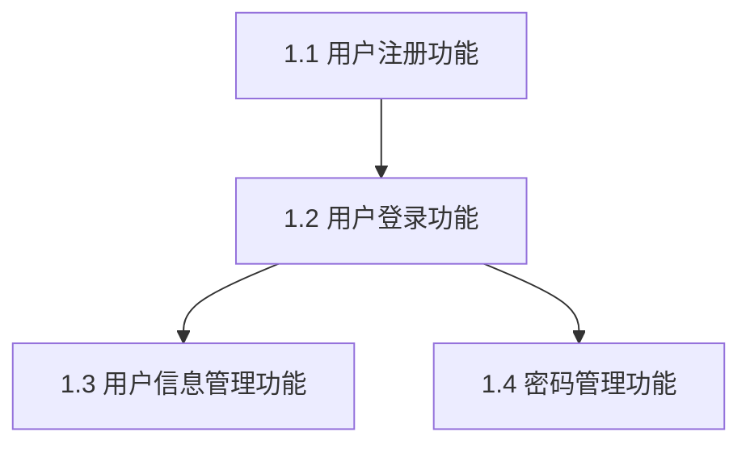

# 需求拆解示例

本文档提供完整的需求拆解示例,展示从需求文档到可执行的功能任务清单的全过程。

---

## 示例 1: 电商用户管理模块（完整流程）

### 场景描述

**原始需求来源**（用户指定文档）:

用户提供了一份完整的 PRD 文档（`docs/requirements/user-management.md`），文档包含用户注册、登录、信息管理等功能的需求描述。

**变更 ID**: `2025-11-10-user-management`

**团队配置**:
- 业务分析师A（用户体验专家）
- 业务分析师B（安全专家）
- 产品经理（整体规划）

---

### 步骤 0: 确定需求文档来源

**AI 的操作**:

1. **检查用户指定文档**:
   ```
   ✅ 用户已提供文档路径: docs/requirements/user-management.md
   ✅ 文档可访问
   ✅ 文档包含完整的功能描述和业务规则
   ```

2. **检查相关技能输出**:
   ```
   ✅ 存在需求审查输出: workspace/2025-11-10-user-management/requirements/requirement-review.md
   ✅ 存在需求解读输出: workspace/2025-11-10-user-management/requirements/requirement.md
   ```

3. **确定文档使用策略**:
   ```markdown
   主要文档:
   - docs/requirements/user-management.md（用户指定）
   
   辅助参考:
   - workspace/2025-11-10-user-management/requirements/requirement-review.md（审查结果）
   - workspace/2025-11-10-user-management/requirements/requirement.md（解读结果）
   ```

4. **评估文档质量**:
   ```markdown
   文档质量评估:
   - ✅ 包含功能描述
   - ✅ 包含业务场景
   - ✅ 包含业务规则
   - ✅ 包含验收标准
   - ⚠️ 部分非功能需求（性能、安全）描述不够清晰
   - ⚠️ 异常场景覆盖不完整
   
   评估结果: 良好，可以进行拆解
   
   需要补充信息:
   - 性能需求的量化指标（响应时间、并发用户数）
   - 完整的异常场景列表
   ```

**记录到 breakdown.md YAML Frontmatter**:
```yaml
source_documents:
  - type: user_specified
    path: docs/requirements/user-management.md
    quality: good
  - type: req_review_output
    path: workspace/2025-11-10-user-management/requirements/requirement-review.md
  - type: req_explain_output
    path: workspace/2025-11-10-user-management/requirements/requirement.md
```

---

### 步骤 1: 识别需求类型

**AI 的操作**: 读取需求文档，按需求性质分类。

**识别结果**:

```markdown
## 需求类型识别结果

### 功能需求（Functional Requirements）
- 用户注册功能（手机号注册、邮箱注册）
- 用户登录功能（多种登录方式）
- 用户信息管理功能（查看、修改个人信息）
- 密码管理功能（修改密码、找回密码）

### 非功能需求（Non-Functional Requirements）
- 性能需求: 响应时间、并发用户数
- 安全需求: 密码加密、防暴力破解、数据脱敏
- 可用性需求: 系统可用率 >= 99.9%

### 业务规则需求（Business Rules）
- 用户名规则: 3-20字符，字母数字下划线
- 密码强度规则: 8-20字符，包含字母数字特殊字符
- 手机号验证规则: 11位中国大陆手机号
- 邮箱验证规则: 标准邮箱格式
- 账号锁定规则: 5次密码错误后锁定30分钟

### 用户体验需求（User Experience）
- 注册流程不超过3步
- 错误提示信息清晰明确
- 支持键盘快捷操作
```

**智能识别示例**:
```
"用户可以通过手机号注册账号" → 功能需求（关键词: "用户可以"）
"密码需要加密存储" → 安全需求（关键词: "加密"）
"用户名必须唯一" → 业务规则（关键词: "必须"）
"注册流程不超过3步" → 用户体验需求（关键词: "流程"）
```

---

### 步骤 2: 拆解需求（核心步骤）

**AI 的拆解结果**:

#### 拆解原则应用

##### 1. 原子化拆解

**拆解前**（粒度过大）:
```
需求: 实现用户管理功能
```

**拆解后**（原子化）:
```markdown
需求 1.1: 用户注册功能
需求 1.2: 用户登录功能
需求 1.3: 用户信息管理功能
需求 1.4: 密码管理功能
```

##### 2. 可验证的验收标准

**需求 1.1: 用户注册功能**

```markdown
### 1.1 用户注册功能
- **负责人**: 业务分析师A
- **复杂度**: 中等（Medium）
- **优先级**: P0
- **依赖**: 无
- **状态**: 待分析
- **可并行**: [P] 与需求 1.2 并行
- **风险等级**: 中等
- **风险因素**: 
  - 短信服务依赖第三方（依赖风险）
  - 手机号判重需要优化算法（技术风险）

**功能描述**:
用户通过注册页面提供手机号、密码创建新账户，系统验证信息有效性和唯一性，发送验证码完成注册。

**业务场景**:
- 新用户首次访问系统，点击"注册"按钮进入注册页面
- 用户填写手机号、密码、验证码
- 系统验证信息格式和唯一性
- 验证通过后创建账户并发送欢迎短信
- 注册成功后自动登录并跳转到首页

**验收标准**:
- [ ] 用户可以在注册页面填写手机号（11位中国大陆手机号）
- [ ] 用户可以填写密码（8-20位，包含字母、数字、特殊字符中的至少2种）
- [ ] 用户可以点击"获取验证码"按钮，系统发送6位数字验证码到手机
- [ ] 验证码发送频率限制为每分钟最多1次
- [ ] 验证码有效期为5分钟
- [ ] 系统检查手机号唯一性（不允许重复注册）
- [ ] 手机号格式错误时显示"请输入有效的手机号"
- [ ] 手机号已注册时显示"该手机号已注册，请直接登录"
- [ ] 密码强度不足时显示"密码强度不足，请使用8-20位，包含字母、数字或特殊字符"
- [ ] 验证码错误时显示"验证码错误，请重新输入"
- [ ] 验证码过期时显示"验证码已过期，请重新获取"
- [ ] 注册成功后发送欢迎短信
- [ ] 注册成功后自动登录并跳转到首页
- [ ] 注册流程总时长不超过2分钟

**业务规则**:
- BR-001: 手机号必须是中国大陆手机号（11位，以1开头）
- BR-002: 手机号全局唯一（不允许重复注册）
- BR-003: 密码长度8-20位，包含字母、数字、特殊字符中的至少2种
- BR-004: 密码需要加密存储（使用bcrypt算法）
- BR-005: 验证码为6位随机数字
- BR-006: 验证码有效期5分钟
- BR-007: 验证码发送频率每分钟最多1次
- BR-008: 注册后账户状态为"已激活"
```

##### 3. 可并行需求标注

```markdown
并行组 [P1]: 用户基础功能
- [P] 需求 1.1: 用户注册功能
- [P] 需求 1.2: 用户登录功能
- [P] 需求 1.3: 用户信息管理功能

并行组 [P2]: 密码安全功能
- [P] 需求 1.4: 密码管理功能
```

##### 4. 依赖关系标注

```markdown
需求依赖关系:

需求 1.1: 用户注册功能（无依赖）
  ↓ 强依赖（必须等待完成）
需求 1.2: 用户登录功能
  ↓ 弱依赖（可并行但有顺序）
需求 1.3: 用户信息管理功能
  ↓ 可选依赖（建议有顺序）
需求 1.4: 密码管理功能
```

**依赖关系说明表**:

| 需求 | 依赖类型 | 前置需求 | 说明 |
|------|---------|---------|------|
| 1.1 | 无 | - | 基础功能，无依赖 |
| 1.2 | 强依赖 | 1.1 | 登录需要账户已注册 |
| 1.3 | 弱依赖 | 1.2 | 信息管理需要用户登录，但可并行分析 |
| 1.4 | 可选依赖 | 1.2 | 密码管理建议在登录功能后分析 |

---

### 步骤 3: 评估需求复杂度

**AI 的操作**: 为每个需求评估复杂度，团队使用"影响因子评估法"。

#### 需求 1.1: 用户注册功能 - 复杂度评估

```markdown
复杂度评估:

数据复杂度: 中等
- 涉及 2 个数据实体（用户表、验证码表）
- 关系简单（一对多）
- 字段数量适中（用户表 15 个字段）

业务规则复杂度: 中等
- 格式验证规则（手机号、密码）
- 唯一性检查（手机号判重）
- 验证码发送频率限制
- 验证码有效期控制

用户交互复杂度: 简单
- 标准表单交互
- 单一页面流程
- 明确的错误提示

集成复杂度: 中等
- 短信服务（第三方 API）
- 可能需要防刷机制

综合复杂度: 中等（Medium）
```

#### 需求 1.2: 用户登录功能 - 复杂度评估（故事点法）

```markdown
复杂度评估（故事点）:

基础登录逻辑: 2 点
- 用户名/手机号/邮箱登录
- 密码验证

身份验证: 3 点
- 账户状态检查（是否锁定、是否激活）
- 登录失败次数统计

安全控制: 3 点
- 防暴力破解（5次失败锁定30分钟）
- 登录日志记录
- 可疑登录检测

错误处理: 1 点
- 账户不存在、密码错误、账户锁定提示

用户体验: 1 点
- 记住登录状态
- 自动跳转

总计: 10 点 ≈ 8 点（取最接近的 Fibonacci 数）

综合复杂度: 8 点（中等偏高）
```

#### 复杂度汇总表

| 需求ID | 需求名称 | 评估方法 | 复杂度 | 说明 |
|--------|---------|---------|--------|------|
| 1.1 | 用户注册 | 影响因子 | 中等 | 数据中等、业务规则中等、集成中等 |
| 1.2 | 用户登录 | 故事点 | 8 点 | 涉及安全控制和防暴力破解 |
| 1.3 | 信息管理 | 等级 | 简单 | 标准CRUD操作 |
| 1.4 | 密码管理 | 影响因子 | 中等 | 涉及密码加密和验证码 |

**总复杂度**: 22 点（假设简单=2点、中等=5点）

---

### 步骤 4: 分配分析任务

**AI 的分配方案**:

#### 原则 1: 专业匹配

```markdown
业务分析师A（用户体验专家）:
- 需求 1.1: 用户注册功能（复杂度: 中等，5点）
- 需求 1.3: 用户信息管理功能（复杂度: 简单，2点）
- 小计: 7 点

业务分析师B（安全专家）:
- 需求 1.2: 用户登录功能（复杂度: 8点）
- 需求 1.4: 密码管理功能（复杂度: 中等，5点）
- 小计: 13 点

产品经理（整体规划）:
- 需求整体协调和优先级确定
- 非功能需求分析（性能、安全、可用性）
- 小计: 协调工作
```

#### 原则 2: 负载均衡（调整后）

```markdown
调整建议:
- 将需求 1.4（密码管理功能）的部分子需求分配给业务分析师A
- 业务分析师A增加: 找回密码功能分析（2点）

调整后工作量:
- 业务分析师A: 9 点
- 业务分析师B: 11 点
- 产品经理: 协调工作
```

#### 原则 3: 依赖优先

```markdown
第 1 周（依赖链上游，优先级 P0）:
- 优先: 需求 1.1（用户注册功能）- 业务分析师A
- 可并行: 开始需求 1.2 前期分析 - 业务分析师B

第 2 周（依赖需求 1.1，优先级 P0）:
- 依赖需求 1.1: 需求 1.2（用户登录功能）- 业务分析师B
- 可并行: 需求 1.3（用户信息管理功能）- 业务分析师A

第 3 周（依赖需求 1.2，优先级 P1）:
- 依赖需求 1.2: 需求 1.4（密码管理功能）- 业务分析师A、B 合作
```

---

### 步骤 5: 输出需求拆解清单

**输出文件**: `workspace/2025-11-10-user-management/requirements/breakdown.md`

**完整的拆解清单**:

```markdown
---
change_id: 2025-11-10-user-management
change_title: 用户管理功能需求拆解
change_status: analyzed
document_type: requirements-breakdown
stage: requirements
created_at: 2025-11-10T10:00:00Z
author: AI Assistant
source_documents: 
  - type: user_specified
    path: docs/requirements/user-management.md
    quality: good
  - type: req_review_output
    path: workspace/2025-11-10-user-management/requirements/requirement-review.md
  - type: req_explain_output
    path: workspace/2025-11-10-user-management/requirements/requirement.md
version: 1.0
compliance_checked: true
compliance_status: passed
---

# 需求拆解清单：用户管理功能

## 1. 用户基础功能需求

### 1.1 用户注册功能
- **负责人**: 业务分析师A
- **复杂度**: 中等（Medium）
- **优先级**: P0
- **依赖**: 无
- **状态**: 待分析
- **可并行**: [P] 与需求 1.2 并行
- **风险等级**: 中等
- **风险因素**: 
  - 短信服务依赖第三方（依赖风险）
  - 手机号判重需要优化算法（技术风险）

**功能描述**:
用户通过注册页面提供手机号、密码创建新账户，系统验证信息有效性和唯一性，发送验证码完成注册。

**业务场景**:
- 新用户首次访问系统，点击"注册"按钮进入注册页面
- 用户填写手机号、密码、验证码
- 系统验证信息格式和唯一性
- 验证通过后创建账户并发送欢迎短信
- 注册成功后自动登录并跳转到首页

**验收标准**:
- [ ] 用户可以在注册页面填写手机号（11位中国大陆手机号）
- [ ] 用户可以填写密码（8-20位，包含字母、数字、特殊字符中的至少2种）
- [ ] 用户可以点击"获取验证码"按钮，系统发送6位数字验证码到手机
- [ ] 验证码发送频率限制为每分钟最多1次
- [ ] 验证码有效期为5分钟
- [ ] 系统检查手机号唯一性（不允许重复注册）
- [ ] 手机号格式错误时显示"请输入有效的手机号"
- [ ] 手机号已注册时显示"该手机号已注册，请直接登录"
- [ ] 密码强度不足时显示"密码强度不足，请使用8-20位，包含字母、数字或特殊字符"
- [ ] 验证码错误时显示"验证码错误，请重新输入"
- [ ] 验证码过期时显示"验证码已过期，请重新获取"
- [ ] 注册成功后发送欢迎短信
- [ ] 注册成功后自动登录并跳转到首页
- [ ] 注册流程总时长不超过2分钟

**业务规则**:
- BR-001: 手机号必须是中国大陆手机号（11位，以1开头）
- BR-002: 手机号全局唯一（不允许重复注册）
- BR-003: 密码长度8-20位，包含字母、数字、特殊字符中的至少2种
- BR-004: 密码需要加密存储（使用bcrypt算法）
- BR-005: 验证码为6位随机数字
- BR-006: 验证码有效期5分钟
- BR-007: 验证码发送频率每分钟最多1次
- BR-008: 注册后账户状态为"已激活"

---

### 1.2 用户登录功能
- **负责人**: 业务分析师B
- **复杂度**: 8 点（中等偏高）
- **优先级**: P0
- **依赖**: 需求 1.1（强依赖）
- **状态**: 待分析
- **可并行**: [P] 与需求 1.3 并行（1.2 完成后）
- **风险等级**: 高
- **风险因素**: 
  - 防暴力破解需要复杂的限流算法（技术风险）
  - 账户锁定机制可能影响正常用户（业务风险）

**功能描述**:
用户通过用户名/手机号/邮箱 + 密码登录系统，系统验证身份后允许访问。

**业务场景**:
- 用户访问登录页面
- 用户填写用户名/手机号/邮箱 + 密码
- 系统验证账户状态（是否激活、是否锁定）
- 系统验证密码正确性
- 验证通过后生成登录凭证，跳转到主页面
- 验证失败记录失败次数，达到阈值后锁定账户

**验收标准**:
- [ ] 用户可以使用用户名、手机号、邮箱中的任意一种登录
- [ ] 用户可以填写密码
- [ ] 系统验证账户是否存在
- [ ] 系统验证账户是否已激活（未激活账户不允许登录）
- [ ] 系统验证账户是否被锁定（锁定账户不允许登录）
- [ ] 系统验证密码正确性
- [ ] 密码正确时生成登录凭证（JWT Token 或 Session）
- [ ] 登录成功后跳转到主页面
- [ ] 账户不存在时显示"账户或密码错误"
- [ ] 密码错误时显示"账户或密码错误"
- [ ] 密码错误时记录失败次数（5次失败后锁定30分钟）
- [ ] 账户锁定时显示"账户已锁定，请30分钟后重试"
- [ ] 账户未激活时显示"账户未激活，请先激活账户"
- [ ] 支持"记住我"功能（7天免登录）
- [ ] 记录登录日志（登录时间、IP地址、设备信息）

**业务规则**:
- BR-009: 支持用户名、手机号、邮箱三种登录方式
- BR-010: 密码错误5次后锁定账户30分钟
- BR-011: 账户锁定30分钟后自动解锁
- BR-012: 未激活账户不允许登录
- BR-013: 登录凭证有效期为7天（如果勾选"记住我"）
- BR-014: 登录失败时不泄露账户是否存在的信息

---

### 1.3 用户信息管理功能
- **负责人**: 业务分析师A
- **复杂度**: 简单（Simple）
- **优先级**: P1
- **依赖**: 需求 1.2（弱依赖）
- **状态**: 待分析
- **可并行**: [P] 与需求 1.2 并行
- **风险等级**: 低
- **风险因素**: 无明显风险

**功能描述**:
用户可以查看和修改个人信息（除用户名外），系统记录修改历史。

**业务场景**:
- 用户登录后进入个人中心
- 用户查看个人信息（用户名、手机号、邮箱、昵称、头像等）
- 用户修改个人信息（手机号、邮箱、昵称、头像等）
- 系统验证修改信息的有效性
- 系统记录修改历史
- 敏感信息修改（手机号、邮箱）需要验证码验证

**验收标准**:
- [ ] 用户可以查看个人信息（用户名、手机号、邮箱、昵称、头像等）
- [ ] 用户可以修改昵称（2-20字符）
- [ ] 用户可以上传头像（图片格式：JPG/PNG，大小限制：2MB）
- [ ] 用户可以修改手机号（需要验证码验证）
- [ ] 用户可以修改邮箱（需要验证码验证）
- [ ] 用户名不可修改
- [ ] 系统验证修改信息的格式
- [ ] 系统验证手机号、邮箱的唯一性（不允许与其他账户重复）
- [ ] 系统记录修改历史（修改时间、修改内容、修改前后值）
- [ ] 敏感信息修改需要发送验证码到新手机号/新邮箱
- [ ] 敏感信息修改成功后发送通知到旧手机号/旧邮箱

**业务规则**:
- BR-015: 用户名不可修改
- BR-016: 昵称长度2-20字符
- BR-017: 头像格式限制为JPG/PNG，大小限制为2MB
- BR-018: 手机号、邮箱修改需要验证码验证
- BR-019: 手机号、邮箱全局唯一
- BR-020: 系统记录所有修改历史

---

### 1.4 密码管理功能
- **负责人**: 业务分析师B、A（合作）
- **复杂度**: 中等（Medium）
- **优先级**: P1
- **依赖**: 需求 1.2（可选依赖）
- **状态**: 待分析
- **可并行**: [P] 可并行分析
- **风险等级**: 中等
- **风险因素**: 
  - 找回密码流程需要验证码服务（依赖风险）
  - 密码重置可能被滥用（安全风险）

**功能描述**:
用户可以修改密码、找回密码，系统提供密码安全保护机制。

**业务场景**:
- **修改密码**: 用户登录后在个人中心修改密码
- **找回密码**: 用户忘记密码时通过手机号/邮箱找回密码

**验收标准**:
- [ ] 用户可以在个人中心修改密码
- [ ] 修改密码需要验证旧密码
- [ ] 新密码需要符合密码强度要求（8-20位，包含字母、数字、特殊字符中的至少2种）
- [ ] 修改密码成功后发送通知到手机号/邮箱
- [ ] 用户可以在登录页面点击"忘记密码"
- [ ] 找回密码需要验证手机号/邮箱
- [ ] 找回密码需要验证码验证
- [ ] 找回密码成功后发送通知到手机号/邮箱
- [ ] 密码重置链接有效期为30分钟

**业务规则**:
- BR-021: 修改密码需要验证旧密码
- BR-022: 新密码需要符合密码强度要求
- BR-023: 找回密码需要验证码验证
- BR-024: 密码重置链接有效期为30分钟
- BR-025: 密码重置成功后发送通知

---

## 需求统计

- **总需求数**: 4 个
- **总复杂度**: 22 点
- **可并行需求**: 2 个（1.1 与 1.2，1.2 完成后 1.3 与 1.4）
- **关键路径**: 需求 1.1 → 1.2 → 1.3 或 1.4
- **高风险需求**: 1 个（需求 1.2）

## 分析里程碑

- **里程碑 1**（第 1 周）: 用户注册功能分析完成（需求 1.1）
- **里程碑 2**（第 2 周）: 用户登录功能分析完成（需求 1.2）
- **里程碑 3**（第 3 周）: 用户信息管理和密码管理功能分析完成（需求 1.3、1.4）

## 依赖图


```

---

## 示例 2: 电商订单管理（表格格式 - 快速浏览）

### 场景描述

**原始需求来源**: 需求解读技能输出

**变更 ID**: `2025-11-10-order-management`

---

### 步骤 0-2: （省略详细过程）

AI 完成文档来源确定、需求类型识别、需求拆解后，生成表格格式的拆解清单。

---

### 步骤 5: 输出需求拆解清单（表格格式）

**输出文件**: `workspace/2025-11-10-order-management/requirements/breakdown.md`

```markdown
---
change_id: 2025-11-10-order-management
change_title: 订单管理功能需求拆解
change_status: analyzed
document_type: requirements-breakdown
stage: requirements
created_at: 2025-11-10T14:00:00Z
author: AI Assistant
source_documents: 
  - type: req_explain_output
    path: workspace/2025-11-10-order-management/requirements/requirement.md
version: 1.0
compliance_checked: true
compliance_status: passed
---

# 需求拆解清单：订单管理功能（表格格式）

## 需求拆解清单

| 需求ID | 需求名称 | 负责人 | 复杂度 | 优先级 | 风险等级 | 依赖 | 状态 | 可并行 |
|--------|---------|--------|--------|--------|---------|------|------|--------|
| 2.1 | 订单创建 | 张三 | 非常复杂 | P0 | 高 | 无 | 待分析 | 否 |
| 2.2 | 订单支付 | 李四 | 复杂 | P0 | 高 | 2.1 | 待分析 | 否 |
| 2.3 | 订单查看 | 王五 | 简单 | P0 | 低 | 2.1 | 待分析 | [P] 与 2.4 并行 |
| 2.4 | 订单取消 | 王五 | 中等 | P1 | 中 | 2.1 | 待分析 | [P] 与 2.3 并行 |
| 2.5 | 订单退款 | 赵六 | 复杂 | P1 | 高 | 2.2 | 待分析 | 否 |

## 需求统计

- **总需求数**: 5 个
- **总复杂度**: 36 点（假设简单=2、中等=5、复杂=8、非常复杂=13）
- **可并行需求**: 2 个（2.3 与 2.4）
- **关键路径**: 需求 2.1 → 2.2 → 2.5

## 分析任务分配

| 成员 | 分配需求 | 总复杂度 | 平均复杂度 |
|------|---------|---------|-----------|
| 张三 | 2.1 | 13 点 | 13 点/需求 |
| 李四 | 2.2 | 8 点 | 8 点/需求 |
| 王五 | 2.3, 2.4 | 7 点 | 3.5 点/需求 |
| 赵六 | 2.5 | 8 点 | 8 点/需求 |

## 分析里程碑

- **里程碑 1**（第 1 周）: 订单创建功能分析完成（需求 2.1）
- **里程碑 2**（第 2 周）: 订单支付功能分析完成（需求 2.2）
- **里程碑 3**（第 3 周）: 订单查看、取消、退款功能分析完成（需求 2.3、2.4、2.5）
```

---

## 示例 3: 内容管理系统（看板格式 - 敏捷开发）

### 场景描述

**原始需求来源**: 需求审查技能输出

**变更 ID**: `2025-11-10-cms`

---

### 步骤 0-2: （省略详细过程）

AI 完成文档来源确定、需求类型识别、需求拆解后，生成看板格式的拆解清单。

---

### 步骤 5: 输出需求拆解清单（看板格式）

**输出文件**: `workspace/2025-11-10-cms/requirements/breakdown.md`

```markdown
---
change_id: 2025-11-10-cms
change_title: 内容管理系统需求拆解
change_status: analyzed
document_type: requirements-breakdown
stage: requirements
created_at: 2025-11-10T16:00:00Z
author: AI Assistant
source_documents: 
  - type: req_review_output
    path: workspace/2025-11-10-cms/requirements/requirement-review.md
version: 1.0
compliance_checked: true
compliance_status: passed
---

# 需求拆解清单：内容管理系统（看板格式）

## 需求拆解看板

### 待分析
- [ ] 需求 3.1: 文章发布功能 @张三 #P0 #复杂 #高风险
- [ ] 需求 3.2: 文章分类管理 @李四 #P0 #中等 #中等风险
- [ ] 需求 3.3: 文章标签管理 @李四 #P1 #简单 #低风险

### 分析中
- [ ] 需求 3.4: 文章评论功能 @王五 #P1 #中等 #中等风险
  - 进度: 50%
  - 阻塞问题: 评论审核流程待澄清

### 已完成
- [x] 需求 0.1: 需求文档收集 @赵六 #P0 #简单 #低风险
  - 完成时间: 2025-11-09

## 并行组

### 并行组 [P1]: 内容管理核心功能
- [P] 需求 3.1: 文章发布功能
- [P] 需求 3.2: 文章分类管理
- [P] 需求 3.3: 文章标签管理

### 并行组 [P2]: 互动功能
- [P] 需求 3.4: 文章评论功能
- [P] 需求 3.5: 文章点赞功能

## 依赖关系

```
需求 3.1（文章发布）
  ↓ 弱依赖
需求 3.2（分类管理） + 需求 3.3（标签管理）
  ↓ 弱依赖
需求 3.4（评论功能） + 需求 3.5（点赞功能）
```

## 需求统计

- **总需求数**: 5 个
- **待分析**: 3 个
- **分析中**: 1 个
- **已完成**: 1 个
- **总复杂度**: 23 点
```

---

## 示例 4: 文档质量不足的处理

### 场景描述

**原始需求来源**: 用户提供了一份简单的需求文本

**变更 ID**: `2025-11-10-payment`

**用户提供的需求**:
```
需求: 实现支付功能

描述: 用户可以支付订单。
```

---

### 步骤 0: 确定需求文档来源（文档质量评估）

**AI 的操作**:

1. **检查用户指定文档**:
   ```
   ✅ 用户已提供需求文本
   ⚠️ 文档内容过于简单
   ```

2. **评估文档质量**:
   ```markdown
   文档质量评估:
   - ❌ 缺少功能描述（只有一句话）
   - ❌ 缺少业务场景
   - ❌ 缺少业务规则
   - ❌ 缺少验收标准
   - ❌ 缺少非功能需求
   - ❌ 缺少异常场景
   
   评估结果: 不合格，无法进行拆解
   
   需要补充信息:
   - 支付方式（微信、支付宝、银行卡？）
   - 支付流程（下单支付、扫码支付？）
   - 支付金额计算规则（是否包含优惠券、积分抵扣？）
   - 支付超时处理（订单如何处理？）
   - 支付失败重试机制
   - 支付成功后的业务流程（发货、通知？）
   - 退款规则（哪些情况可以退款？）
   - 性能要求（并发支付数量？）
   - 安全要求（支付密码、二次验证？）
   ```

**AI 的反馈**:

```
❌ 需求文档质量不足，无法进行拆解。

检测到以下问题:
1. 缺少功能描述（只有一句话）
2. 缺少业务场景
3. 缺少业务规则
4. 缺少验收标准
5. 缺少非功能需求
6. 缺少异常场景

建议:
1. 使用 req-explain 技能对需求进行解读和分析
2. 使用 req-clarify 技能澄清模糊点
3. 补充完整的需求文档后再进行拆解

需要补充的信息:
- 支付方式（微信、支付宝、银行卡？）
- 支付流程（下单支付、扫码支付？）
- 支付金额计算规则（是否包含优惠券、积分抵扣？）
- 支付超时处理（订单如何处理？）
- 支付失败重试机制
- 支付成功后的业务流程（发货、通知？）
- 退款规则（哪些情况可以退款？）
- 性能要求（并发支付数量？）
- 安全要求（支付密码、二次验证？）

是否需要我帮助您进行需求解读或澄清？
```

---

## 最佳实践总结

### 1. 文档来源确定最佳实践

✅ **好的实践**:
- 先检查用户是否在对话中已提供文档
- 再检查相关技能输出
- 建立清晰的文档优先级
- 记录实际使用的文档来源

❌ **不好的实践**:
- 未检查用户上下文就直接询问
- 忽略相关技能输出
- 文档来源不明确

### 2. 需求拆解最佳实践

✅ **好的实践**:
- 遵循原子化原则（每个需求不可再分）
- 验收标准具体可测（包含正常和异常场景）
- 明确标注依赖关系（强依赖、弱依赖、可选依赖）
- 识别可并行需求（提高分析效率）
- 评估需求风险（识别高风险需求）

❌ **不好的实践**:
- 需求粒度过大（"实现电商系统"）
- 验收标准模糊（"用户体验良好"）
- 忽略依赖关系
- 忽略风险评估

### 3. 复杂度评估最佳实践

✅ **好的实践**:
- 根据团队经验选择合适的评估方法
- 团队协作评估（Planning Poker、三点估算法）
- 考虑多个维度（数据、业务规则、交互、集成）
- 记录评估理由

❌ **不好的实践**:
- 个人主观评估
- 评估方法不一致
- 忽略复杂度差异

### 4. 任务分配最佳实践

✅ **好的实践**:
- 专业匹配（用户体验专家负责用户功能）
- 负载均衡（工作量大致相当）
- 依赖优先（上游需求优先分配）

❌ **不好的实践**:
- 忽略专业背景
- 工作量分配不均
- 忽略依赖关系
