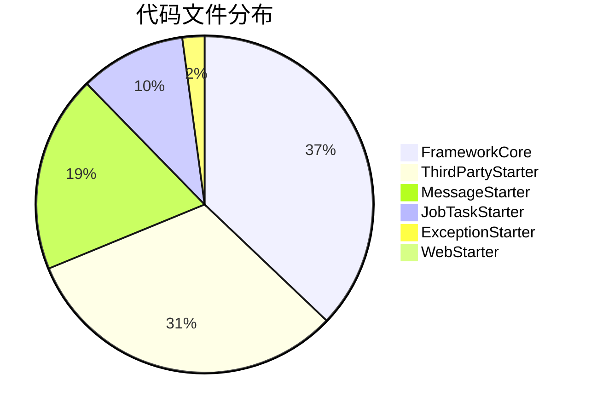
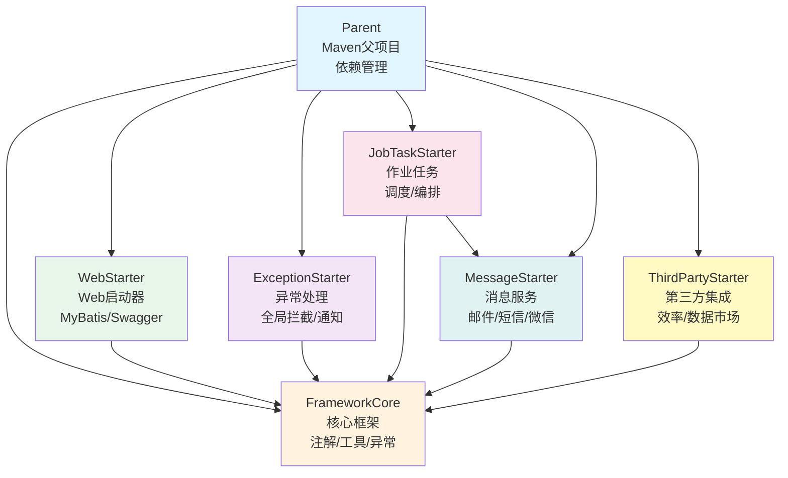
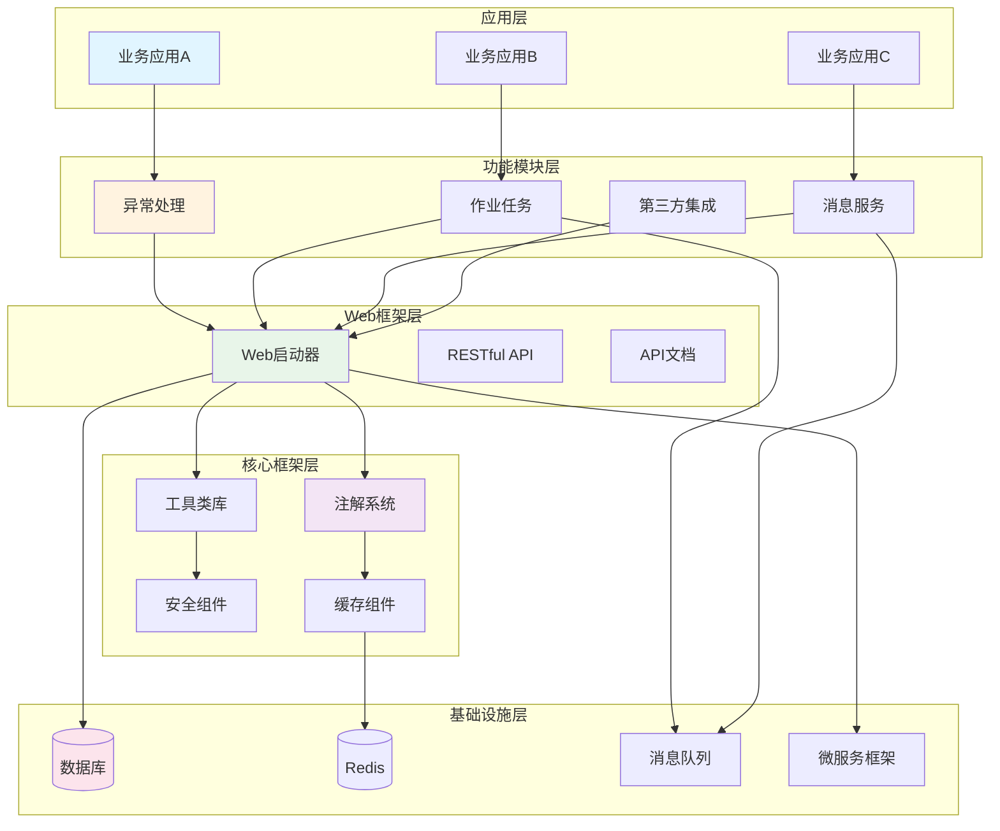
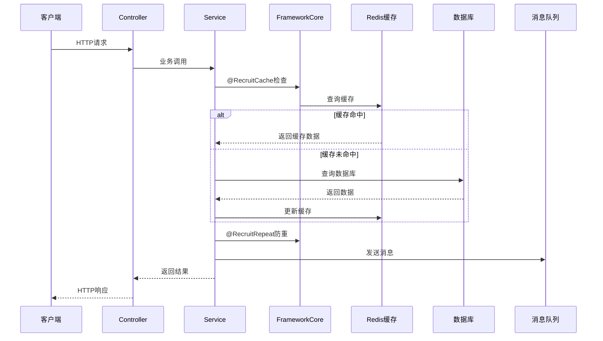

# 招聘中心 Spring Boot SDK 框架知识库

> **项目**: RecruitCenter Framework - 企业级招聘系统Spring Boot SDK  
> **子项目总数**: 7个  
> **文档总数**: 50+个  
> **生成时间**: 2025-11-24  
> **维护状态**: ✅ 活跃维护中

---

## 📖 目录

- [🧭 项目概述](#-项目概述)
- [🏗️ 架构总览](#-架构总览)
- [📚 子项目导航](#-子项目导航)
- [🚀 快速开始](#-快速开始)
- [📊 统计概览](#-统计概览)
- [🔍 使用指南](#-使用指南)
- [📐 架构关系图](#-架构关系图)
- [💡 最佳实践](#-最佳实践)
- [📝 维护记录](#-维护记录)

---

## 🧭 项目概述

**招聘中心框架** 是一套完整的企业级Spring Boot SDK，为招聘业务系统提供统一的技术基础设施，包含核心框架、Web启动器、消息服务、异常处理、作业任务、第三方集成等模块。

### 核心特性

✅ **模块化设计** - 7个独立SDK，按需引入  
✅ **开箱即用** - Spring Boot自动配置，零配置启动  
✅ **企业级** - 完善的异常处理、日志、监控、安全机制  
✅ **高性能** - 分布式缓存、异步处理、连接池优化  
✅ **可扩展** - 插件化架构，易于定制和扩展  
✅ **多租户** - 完善的租户隔离和数据权限控制  
✅ **云原生** - 支持TSF微服务、Kubernetes部署

---

## 🏗️ 架构总览

### 项目结构

```
RecruitCenterFramework/
├── RecruitCenterParent (父项目)
│   └── Maven依赖统一管理、版本控制
├── RecruitCenterFrameworkCore (核心框架)
│   └── 注解、工具类、异常、过滤器、拦截器
├── RecruitCenterWebStarter (Web启动器)
│   └── MyBatis-Plus、Swagger、自动配置
├── RecruitCenterExceptionStarter (异常处理)
│   └── 全局异常拦截、邮件通知、企业微信通知
├── RecruitCenterJobTaskStarter (作业任务)
│   └── 分布式作业调度、任务编排、状态管理
├── RecruitCenterMessageStarter (消息服务)
│   └── 邮件、短信、企业微信、OA消息发送
└── RecruitCenterThirdPartyStarter (第三方集成)
    └── 效率平台、数据市场、文件服务、假期服务
```

### 技术栈

| 技术 | 版本 | 用途 |
|------|------|------|
| Spring Boot | 2.x | 基础框架 |
| MyBatis-Plus | 3.x | ORM框架 |
| Redis | 5.x | 缓存 |
| Kafka/Pulsar | - | 消息队列 |
| MySQL | 8.x | 数据库 |
| Swagger | 2.x | API文档 |
| TSF | 3.x | 微服务框架 |

---

## 📚 子项目导航

### 🔥 核心项目 (必读 P0)

#### 1. [Parent - Maven父项目](./parent/README.md)

**功能**: 依赖版本统一管理  
**Maven坐标**: `recruit-center-parent:2.0.0-SNAPSHOT`  
**核心内容**:
- 33个依赖管理
- 24个版本属性
- 7个子模块定义
- 安全加固规则

**适用场景**: 新建子项目、依赖版本升级

---

#### 2. [FrameworkCore - 核心框架](./framework-core/README.md)

**功能**: 提供基础技术能力  
**包路径**: `com.tencent.hr.recruit.center.framework.core`  
**核心内容**:
- 8个核心注解 (缓存、防重、脱敏、分布式锁)
- 10+个工具类 (字符串、日期、JSON、加密)
- 5个异常类 (业务、系统、校验、权限、远程)
- 8个过滤器和拦截器 (XSS、认证、性能监控)
- 配置管理、上下文管理

**适用场景**: 所有业务开发的基础依赖

**关键组件**:
- [注解类](./framework-core/annotations.md) - `@RecruitCache`、`@RecruitRepeat`、`@Desensitization`等
- [工具类](./framework-core/utils.md) - StringUtils、DateUtils、JsonUtils、CryptoUtils
- [异常类](./framework-core/exceptions.md) - RecruitBizException、RecruitSystemException
- [过滤器拦截器](./framework-core/filters-interceptors.md) - XssFilter、AuthInterceptor

---

#### 3. [WebStarter - Web启动器](./web-starter/README.md)

**功能**: Web应用快速启动  
**包路径**: `com.tencent.hr.recruit.center.framework.web`  
**核心内容**:
- MyBatis-Plus分页配置
- Swagger API文档配置
- 8个自动配置类
- 事务管理、异步支持

**适用场景**: 构建Web应用、RESTful API服务

**关键配置**:
- [配置类](./web-starter/configuration.md) - AutoMybatisConfiguration、LocalSwaggerConfiguration
- [自动配置](./web-starter/spring-factories.md) - 6个Core + 2个Web配置

---

### 📦 功能模块 (常用 P1)

#### 4. [ExceptionStarter - 异常处理](./exception-starter/README.md)

**功能**: 统一异常处理和通知  
**包路径**: `com.tencent.hr.recruit.center.framework.error`  
**核心内容**:
- 全局异常拦截器
- 邮件通知 (OA/云环境)
- 企业微信机器人通知
- 异常级别判定
- 13个异常处理方法

**适用场景**: 异常监控告警、邮件通知配置

**关键组件**:
- [异常处理器](./exception-starter/controller.md) - GlobalAdviceController
- [异常通知](./exception-starter/advice.md) - OAMessageExceptionAdvice、CloudMessageExceptionAdvice
- [异常Bean](./exception-starter/bean.md) - RequestErrorBean (13个字段)

---

#### 5. [JobTaskStarter - 作业任务](./jobtask-starter/README.md)

**功能**: 企业级分布式作业任务调度  
**包路径**: `com.tencent.hr.recruit.center.job`  
**核心内容**:
- 作业编排和执行
- 任务状态管理
- 回滚机制
- 重试机制
- Kafka/Tdmq消息通知
- 分布式ID生成

**适用场景**: 批处理任务、定时任务、异步任务编排

**关键组件**:
- [核心类](./jobtask-starter/core.md) - RecruitJobOperation、RecruitTaskOperation (28个方法)
- [服务接口](./jobtask-starter/services.md) - IRecruitJobService
- [任务接口](./jobtask-starter/tasks.md) - IRecruitTask
- [DTO对象](./jobtask-starter/dto.md) - RecruitJobDTO、RecruitTaskDTO (28个字段)

---

#### 6. [MessageStarter - 消息服务](./message-starter/README.md)

**功能**: 多渠道消息发送  
**包路径**: `com.tencent.hr.recruit.center.message`  
**核心内容**:
- 邮件发送 (同步/异步)
- 短信发送
- 企业微信消息
- 微信公众号消息
- OA消息
- 应用内消息
- 25个消息Bean

**适用场景**: 消息通知、邮件发送、短信发送

**关键组件**:
- [消息Bean](./message-starter/beans.md) - EmailBean、SmsBean、WorkBean等 (25个)
- [发送器](./message-starter/senders.md) - AsyncEmailSender、SyncSmsSender等 (19个)
- [服务接口](./message-starter/services.md) - HrMessageService、HrAssistantService

---

#### 7. [ThirdPartyStarter - 第三方集成](./thirdparty-starter/README.md)

**功能**: 第三方服务集成  
**包路径**: `com.tencent.hr.recruit.center.third`  
**核心内容**:
- 效率平台集成 (流程追踪)
- 数据市场集成 (员工、组织、职位数据)
- 文件服务 (上传、预览、签名)
- 假期服务
- 权限控制
- 115+个Feign接口方法

**适用场景**: 第三方服务调用、数据查询、权限控制

**关键组件**:
- [Feign接口](./thirdparty-starter/feign-interfaces.md) - 5个接口、115+方法
- [服务类](./thirdparty-starter/services.md) - DataMarketRemoteService、FileService
- [工具类](./thirdparty-starter/utils.md) - DataScopeUtils、StaffRightUtils

---

## 🚀 快速开始

### 1. 添加父POM依赖

```xml
<parent>
    <groupId>com.tencent.hr</groupId>
    <artifactId>recruit-center-parent</artifactId>
    <version>2.0.0-SNAPSHOT</version>
</parent>
```

### 2. 引入所需的Starter

```xml
<dependencies>
    <!-- 核心框架 (必需) -->
    <dependency>
        <groupId>com.tencent.hr</groupId>
        <artifactId>recruit-center-framework-core</artifactId>
    </dependency>
    
    <!-- Web启动器 (构建Web应用) -->
    <dependency>
        <groupId>com.tencent.hr</groupId>
        <artifactId>recruit-center-web-starter</artifactId>
    </dependency>
    
    <!-- 异常处理 (推荐) -->
    <dependency>
        <groupId>com.tencent.hr</groupId>
        <artifactId>recruit-center-exception-starter</artifactId>
    </dependency>
    
    <!-- 消息服务 (按需) -->
    <dependency>
        <groupId>com.tencent.hr</groupId>
        <artifactId>recruit-center-message-starter</artifactId>
    </dependency>
    
    <!-- 作业任务 (按需) -->
    <dependency>
        <groupId>com.tencent.hr</groupId>
        <artifactId>recruit-center-job-task-starter</artifactId>
    </dependency>
    
    <!-- 第三方集成 (按需) -->
    <dependency>
        <groupId>com.tencent.hr</groupId>
        <artifactId>recruit-center-third-party-starter</artifactId>
    </dependency>
</dependencies>
```

### 3. 配置文件

```yaml
spring:
  application:
    name: recruit-demo
  datasource:
    url: jdbc:mysql://localhost:3306/recruit?useUnicode=true&characterEncoding=utf8
    username: root
    password: password
  redis:
    host: localhost
    port: 6379

# 招聘框架配置
recruit-framework:
  recruit-efficiency-api: http://efficiency-api
  holiday-api: http://holiday-api
```

### 4. 启动类

```java
@SpringBootApplication
@EnableRecruitConfig  // 启用招聘框架配置
public class RecruitDemoApplication {
    public static void main(String[] args) {
        SpringApplication.run(RecruitDemoApplication.class, args);
    }
}
```

### 5. 使用示例

**使用缓存注解**:
```java
@Service
public class UserService {
    
    @RecruitCache(key = "user:#{#userId}", expireTime = 3600)
    public User getUser(Long userId) {
        // 自动缓存，3600秒过期
        return userMapper.selectById(userId);
    }
}
```

**发送邮件**:
```java
@Service
public class NotificationService {
    
    @Autowired
    private RecruitEmailSender emailSender;
    
    public void sendEmail() {
        EmailBean email = new EmailBean();
        email.setTo("user@example.com");
        email.setSubject("欢迎");
        email.setContent("欢迎使用招聘系统");
        
        emailSender.send(email);
    }
}
```

**执行作业**:
```java
@Service
public class JobService {
    
    @Autowired
    private IRecruitJobService jobService;
    
    public void executeJob(Long jobId) {
        JobResult result = jobService.execute(jobId);
        if (result.isSuccess()) {
            log.info("作业执行成功");
        }
    }
}
```

---

## 📊 统计概览

### 整体规模统计

| 维度 | 数量 | 说明 |
|------|------|------|
| **子项目** | 7个 | 1个父项目 + 6个功能模块 |
| **文档总数** | 50+个 | 完整知识库文档 |
| **Java文件** | 400+个 | 核心业务代码 |
| **包结构** | 50+个 | 清晰的模块划分 |
| **依赖管理** | 33个 | 统一版本控制 |

### 各模块统计



### 功能分类统计

| 功能分类 | 组件数量 | 主要模块 |
|---------|---------|---------|
| **核心基础** | 200+个 | FrameworkCore |
| **Web应用** | 10+个 | WebStarter |
| **异常处理** | 10+个 | ExceptionStarter |
| **作业任务** | 40+个 | JobTaskStarter |
| **消息服务** | 80+个 | MessageStarter |
| **第三方集成** | 130+个 | ThirdPartyStarter |

---

## 🔍 使用指南

### 新人入门路径

#### 第一步：了解整体架构
1. 阅读本 README.md
2. 查看 [Parent项目](./parent/README.md) 了解依赖管理
3. 查看 [架构关系图](#-架构关系图)

#### 第二步：掌握核心框架
1. 阅读 [FrameworkCore文档](./framework-core/README.md)
2. 学习常用注解: `@RecruitCache`、`@RecruitRepeat`
3. 熟悉工具类: StringUtils、DateUtils、JsonUtils

#### 第三步：构建Web应用
1. 阅读 [WebStarter文档](./web-starter/README.md)
2. 配置数据库和MyBatis-Plus
3. 启用Swagger API文档

#### 第四步：集成功能模块
根据业务需求，按需集成:
- [异常处理模块](./exception-starter/README.md)
- [消息服务模块](./message-starter/README.md)
- [作业任务模块](./jobtask-starter/README.md)
- [第三方集成模块](./thirdparty-starter/README.md)

### 日常开发路径

**开发Web API**:
1. FrameworkCore (工具类、注解)
2. WebStarter (MyBatis-Plus、Swagger)
3. ExceptionStarter (异常处理)

**开发异步任务**:
1. FrameworkCore (基础能力)
2. JobTaskStarter (作业编排)
3. MessageStarter (消息通知)

**集成第三方服务**:
1. FrameworkCore (基础能力)
2. ThirdPartyStarter (Feign接口)

### 问题排查路径

**配置问题**:
- Parent依赖管理 → WebStarter配置 → 应用配置文件

**异常处理问题**:
- ExceptionStarter全局处理器 → FrameworkCore异常类 → 日志

**作业执行问题**:
- JobTaskStarter核心类 → 任务实现 → 消息通知

**消息发送问题**:
- MessageStarter发送器 → Bean对象 → 第三方服务

---

## 📐 架构关系图

### 项目依赖关系



### 技术架构层次



### 核心调用流程



---

## 💡 最佳实践

### 1. 依赖管理最佳实践

**✅ 推荐做法**:
```xml
<!-- 使用Parent管理版本，子项目无需指定版本 -->
<dependency>
    <groupId>com.tencent.hr</groupId>
    <artifactId>recruit-center-framework-core</artifactId>
</dependency>
```

**❌ 不推荐做法**:
```xml
<!-- 不要在子项目中硬编码版本 -->
<dependency>
    <groupId>com.tencent.hr</groupId>
    <artifactId>recruit-center-framework-core</artifactId>
    <version>1.0.0</version>  <!-- 避免硬编码版本 -->
</dependency>
```

### 2. 注解使用最佳实践

**✅ 推荐 - 使用缓存注解**:
```java
@Service
public class UserService {
    
    // 自动缓存，SpEL表达式生成key
    @RecruitCache(key = "user:#{#userId}", expireTime = 3600)
    public User getUser(Long userId) {
        return userMapper.selectById(userId);
    }
    
    // 防止重复提交
    @RecruitRepeat(key = "submit:#{#request.orderId}", timeout = 5000)
    public Result submitOrder(OrderRequest request) {
        return orderService.create(request);
    }
}
```

**✅ 推荐 - 数据脱敏**:
```java
public class UserDTO {
    
    @Desensitization(type = DesensitizationType.MOBILE)
    private String phone;  // 自动脱敏: 138****5678
    
    @Desensitization(type = DesensitizationType.ID_CARD)
    private String idCard;  // 自动脱敏: 110***********1234
}
```

### 3. 异常处理最佳实践

**✅ 推荐 - 使用框架异常**:
```java
@Service
public class OrderService {
    
    public void createOrder(OrderDTO dto) {
        if (dto.getAmount() <= 0) {
            // 使用业务异常
            throw new RecruitBizException("订单金额必须大于0");
        }
        
        try {
            remoteService.call();
        } catch (Exception e) {
            // 使用远程调用异常
            throw new RecruitRemoteException("远程服务调用失败", e);
        }
    }
}
```

**❌ 不推荐 - 直接抛出RuntimeException**:
```java
// 避免直接使用通用异常
throw new RuntimeException("错误");  // 无法区分异常类型
```

### 4. 消息发送最佳实践

**✅ 推荐 - 异步发送**:
```java
@Service
public class NotificationService {
    
    @Autowired
    private AsyncEmailSender emailSender;  // 使用异步发送器
    
    public void notifyUser(String email, String content) {
        EmailBean bean = new EmailBean();
        bean.setTo(email);
        bean.setContent(content);
        
        emailSender.send(bean);  // 异步发送，不阻塞主流程
    }
}
```

### 5. 作业任务最佳实践

**✅ 推荐 - 实现回滚机制**:
```java
@Component
@RecruitTask(name = "orderTask", desc = "订单处理任务")
public class OrderTask implements IRecruitTask {
    
    @Override
    public JobResult execute(RecruitTaskDTO taskDTO) {
        try {
            // 执行业务逻辑
            processOrder(taskDTO);
            return JobResult.success("任务执行成功");
        } catch (Exception e) {
            return JobResult.fail("任务执行失败: " + e.getMessage());
        }
    }
    
    @Override
    public JobResult rollback(RecruitTaskDTO taskDTO) {
        // 实现回滚逻辑
        rollbackOrder(taskDTO);
        return JobResult.success("任务回滚成功");
    }
}
```

### 6. 配置管理最佳实践

**✅ 推荐 - 环境隔离配置**:
```yaml
# application.yml - 通用配置
spring:
  application:
    name: recruit-service

---
# application-dev.yml - 开发环境
recruit-framework:
  recruit-efficiency-api: http://dev-efficiency-api
  
---
# application-prod.yml - 生产环境
recruit-framework:
  recruit-efficiency-api: http://prod-efficiency-api
```

---

## 🔗 跨项目引用

### FrameworkCore 与其他模块的关系

- [WebStarter使用Core的注解](./web-starter/configuration.md#依赖core注解)
- [ExceptionStarter使用Core的异常类](./exception-starter/controller.md#异常类型处理)
- [JobTaskStarter使用Core的工具类](./jobtask-starter/utils.md#依赖core工具)
- [MessageStarter使用Core的工具类](./message-starter/services.md#工具类使用)

### 异常处理与消息服务的集成

- [ExceptionStarter发送邮件通知](./exception-starter/advice.md#邮件通知机制)
- [MessageStarter提供邮件服务](./message-starter/senders.md#邮件发送器)

### 作业任务与消息服务的集成

- [JobTaskStarter发送作业通知](./jobtask-starter/listeners.md#消息监听器)
- [MessageStarter接收作业消息](./message-starter/services.md#消息接收)

---

## 📝 维护记录

| 时间 | 维护人 | 维护内容 | 版本 |
|------|--------|----------|------|
| 2025-11-24 | AI Assistant | 创建统一知识库，整合7个子项目文档 | v1.0 |
| 2025-11-24 | AI Assistant | 完善架构图和跨项目锚点 | v1.0 |

---

## 📞 支持与反馈

### 获取帮助

1. **查阅文档**: 先查看对应子项目的详细文档
2. **搜索问题**: 使用IDE全文搜索功能
3. **联系团队**: 联系框架维护团队

### 文档反馈

如发现文档问题或有改进建议，请及时反馈。

---

## 🎯 下一步计划

- [ ] 补充更多使用示例
- [ ] 添加性能调优指南
- [ ] 补充故障排查手册
- [ ] 添加版本升级指南

---

**最后更新时间**: 2025-11-24  
**文档版本**: v1.0  
**项目名称**: RecruitCenter Framework  
**维护团队**: 招聘中心框架组

---

*本文档由AI自动生成，基于7个子项目的知识库文档整合而成*
