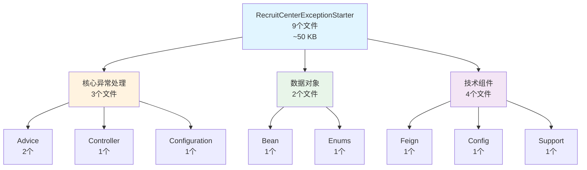
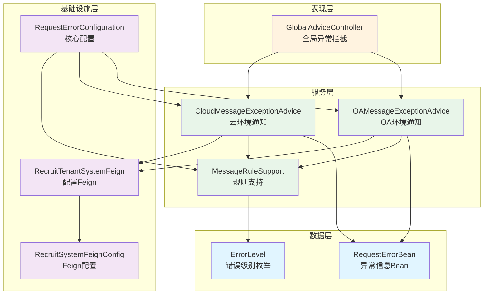
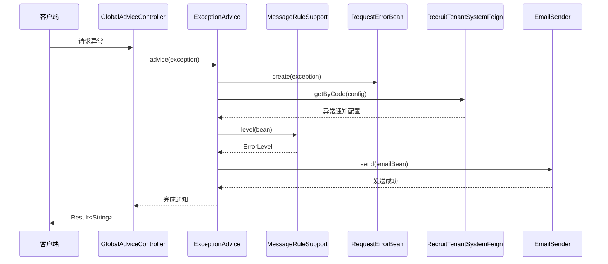

# RecruitCenterExceptionStarter 项目知识库索引

> **项目**: 招聘中心异常处理启动器  
> **基础包路径**: `com.tencent.hr.recruit.center.framework.error`  
> **文档总数**: 8个  
> **生成时间**: 2025-11-24  
> **维护状态**: ✅ 活跃维护中

---

## 📖 目录

- [🧭 快速导航](#-快速导航)
- [📊 文档分类索引](#-文档分类索引)
- [📈 统计概览](#-统计概览)
- [🔍 文档使用指南](#-文档使用指南)
- [📐 架构关系图](#-架构关系图)
- [📝 维护记录](#-维护记录)

---

## 🧭 快速导航

### 🔥 核心文档 (必读 P0)

| 序号 | 文档 | 描述 | 核心指标 |
|------|------|------|----------|
| 1 | [异常通知处理类索引](./advice.md) | OA和云环境异常通知处理 | 2个Advice + 20个方法 |
| 2 | [全局异常处理器索引](./controller.md) | 统一异常拦截和响应 | 1个Controller + 13个异常处理方法 |
| 3 | [Configuration配置索引](./configuration.md) | 异常处理核心配置 | 4个Bean + 线程池配置 |

### 📦 数据对象文档 (常用 P1)

| 序号 | 文档 | 描述 | 数量 |
|------|------|------|------|
| 4 | [Bean对象索引](./bean.md) | 异常信息传输对象 | 1个Bean + 13个字段 |
| 5 | [Enums枚举索引](./enums.md) | 错误级别枚举 | 1个枚举 + 3个值 |

### ⚙️ 技术组件文档 (参考 P2)

| 序号 | 文档 | 描述 | 数量 |
|------|------|------|------|
| 6 | [Feign接口索引](./feign.md) | 系统配置远程调用 | 1个接口 + 1个方法 |
| 7 | [Config配置索引](./config.md) | Feign配置类 | 1个配置类 |
| 8 | [Support工具索引](./support.md) | 消息规则支持工具 | 1个工具类 + 4个方法 |

---

## 📊 文档分类索引

### 1. 核心异常处理层 (3个文档)

#### 📡 [异常通知处理类索引](./advice.md)

**文档信息**:
- **包路径**: `com.tencent.hr.recruit.center.framework.error.advice`
- **文件数量**: 2个
- **最后更新**: 2025-11-24

**核心内容**:
- CloudMessageExceptionAdvice - 云环境异常通知（9个方法）
- OAMessageExceptionAdvice - OA环境异常通知（11个方法）

**主要功能**:
- 异常信息收集和封装
- 邮件通知发送
- 企业微信机器人通知
- 异常级别判定
- 环境隔离处理

**适用场景**: 异常通知机制开发、邮件模板定制、通知规则配置

---

#### 🎯 [全局异常处理器索引](./controller.md)

**文档信息**:
- **包路径**: `com.tencent.hr.recruit.center.framework.error.controller`
- **文件数量**: 1个
- **最后更新**: 2025-11-24

**核心内容**:
- GlobalAdviceController - 全局异常拦截处理器（13个异常处理方法）

**主要功能**:
- 参数校验异常处理
- Recruit自定义异常处理
- Feign解码异常处理
- 统一响应格式
- I18n国际化支持

**适用场景**: 异常响应格式定制、I18n消息配置、自定义异常类型添加

---

#### ⚙️ [Configuration配置索引](./configuration.md)

**文档信息**:
- **包路径**: `com.tencent.hr.recruit.center.framework.error.configuration`
- **文件数量**: 1个
- **最后更新**: 2025-11-24

**核心内容**:
- RequestErrorConfiguration - 请求错误处理配置类（4个Bean）

**主要功能**:
- OA/云环境Advice Bean配置
- 异步线程池配置
- MessageRuleSupport Bean配置
- Profile环境隔离

**适用场景**: 环境配置、线程池调优、Bean覆盖定制

---

### 2. 数据对象层 (2个文档)

#### 📦 [Bean对象索引](./bean.md)

**文档信息**:
- **包路径**: `com.tencent.hr.recruit.center.framework.error.bean`
- **文件数量**: 1个
- **字段总数**: 13个

**核心内容**:
- RequestErrorBean - 请求错误信息Bean

**主要字段**:
- 基础字段：traceId、serviceName、exceptionName、message
- 请求字段：url、methodName、interfaceName、currentName、headers、requestParams
- 特殊字段：noticeException、jobDataKey、jobDataValue
- 配置字段：config

**适用场景**: 异常信息封装、通知数据构建、JobTask异常处理

---

#### 🏷️ [Enums枚举索引](./enums.md)

**文档信息**:
- **包路径**: `com.tencent.hr.recruit.center.framework.error.enums`
- **文件数量**: 1个
- **枚举值数量**: 3个

**核心内容**:
- ErrorLevel - 错误级别枚举

**枚举值**:
- IMPORTANT（重要）
- PRESSING（紧急）
- ORDINARY（一般）

**适用场景**: 异常级别判定、邮件标题标注、告警策略配置

---

### 3. 技术组件层 (3个文档)

#### 🔌 [Feign接口索引](./feign.md)

**文档信息**:
- **包路径**: `com.tencent.hr.recruit.center.framework.error.feign`
- **文件数量**: 1个
- **接口方法**: 1个

**核心内容**:
- RecruitTenantSystemFeign - 系统配置远程调用接口

**主要方法**:
- getByCode - 获取系统配置

**适用场景**: 异常通知配置获取、系统配置远程调用

---

#### 🛠️ [Config配置索引](./config.md)

**文档信息**:
- **包路径**: `com.tencent.hr.recruit.center.framework.error.config`
- **文件数量**: 1个

**核心内容**:
- RecruitSystemFeignConfig - 系统Feign配置类

**主要功能**:
- 配置Feign请求拦截器
- 添加内部服务认证信息

**适用场景**: Feign调用配置、内部认证配置

---

#### 🔧 [Support工具索引](./support.md)

**文档信息**:
- **包路径**: `com.tencent.hr.recruit.center.framework.error.support`
- **文件数量**: 1个
- **公共方法**: 4个

**核心内容**:
- MessageRuleSupport - 消息规则支持工具

**主要方法**:
- build - 构建单例实例
- level - 判断异常错误级别
- ignoreException - 判断是否忽略异常
- contains - 判断列表包含（private）

**适用场景**: 异常级别判定、忽略规则配置、频率统计

---

## 📈 统计概览

### 架构分层统计

| 组件类型 | 文件数量 | 核心指标 |
|---------|---------|---------|
| **Java文件** | 9个 | ~5.5 KB 平均大小 |
| **包结构** | 7个 | 清晰的模块划分 |
| **Advice类** | 2个 | 20个公共方法 |
| **Controller** | 1个 | 13个异常处理方法 |
| **Configuration** | 2个 | 5个Bean定义 |
| **Bean对象** | 1个 | 13个字段 |
| **Enums枚举** | 1个 | 3个枚举值 |
| **Feign接口** | 1个 | 1个远程方法 |
| **Support工具** | 1个 | 4个公共方法 |

### 功能模块统计

---

## 🔍 文档使用指南

### 1. 新人入门路径
1. 先读 [README.md](./README.md) 了解整体架构
2. 再读 [Configuration配置索引](./configuration.md) 了解核心配置
3. 深入 [异常通知处理类索引](./advice.md) 理解通知机制
4. 查阅 [全局异常处理器索引](./controller.md) 了解异常拦截
5. 按需查阅其他文档

### 2. 日常开发路径
- **配置异常通知**: Configuration → Advice → Bean
- **自定义异常类型**: Controller → Advice
- **调整通知规则**: Support → Enums → Configuration

### 3. 问题排查路径
- **异常未发送通知**: Advice → Support → Configuration
- **异常响应格式错误**: Controller → Bean
- **Feign调用失败**: Feign → Config

---

## 📐 架构关系图

### 分层架构视图

### 调用流程图

---

## 📝 维护记录

| 时间 | 维护人 | 维护内容 | 版本 |
|------|--------|----------|------|
| 2025-11-24 | AI Assistant | 初始创建知识库，完整记录所有模块 | v1.0 |

---

## 🔗 相关链接

### 项目相关
- [Core项目知识库](../framework-core/README.md)
- [JobTask项目知识库](../jobtask-starter/README.md)
- [Message项目知识库](../message-starter/README.md)

---

**最后更新时间**: 2025-11-24  
**文档版本**: v1.0  
**项目名称**: RecruitCenterExceptionStarter  
**维护人**: AI Assistant

---
