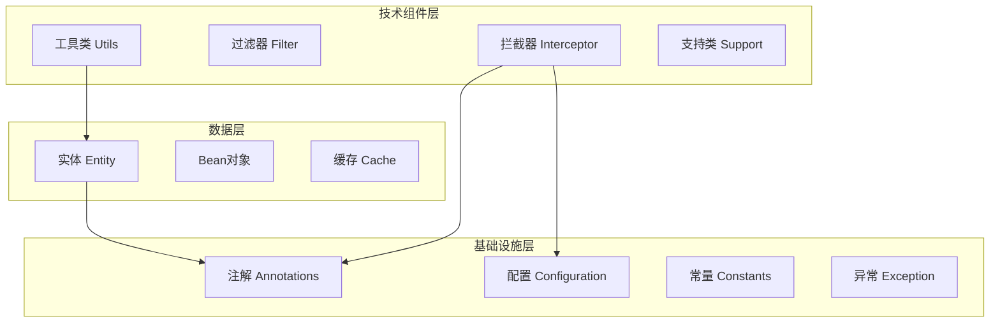

# RecruitCenterFrameworkCore 项目结构分析

> **文档说明**: 本文档为 RecruitCenterFrameworkCore 项目的完整结构分析  
> **生成时间**: 2025-11-21  
> **覆盖范围**: `com.tencent.hr.recruit.center.framework`  
> **文件总数**: 157个Java文件

---

## 📑 目录

- [一、项目概览](#一项目概览)
- [二、目录结构](#二目录结构)
- [三、按功能分类](#三按功能分类)
- [四、架构说明](#四架构说明)

---

## 一、项目概览

RecruitCenterFrameworkCore 是招聘中心的核心框架项目，提供基础设施和公共能力支持。

### 1.1 核心特性
- 🎯 **注解驱动**: 提供丰富的自定义注解
- 🔧 **配置管理**: 统一的配置管理机制
- 💾 **缓存支持**: 多级缓存策略
- 🔐 **安全过滤**: 统一的认证和授权
- 📊 **实体映射**: 完整的数据实体定义
- ⚠️ **异常处理**: 标准化的异常体系
- 🔨 **工具集合**: 丰富的工具类库

---

## 二、目录结构

```
framework/
├── annotations/         (8个) - 自定义注解
├── bean/               (3个) - Bean对象
├── cache/              (4个) - 缓存接口和实现
├── config/             (2个) - Feign配置
├── configuration/      (6个) - Spring配置类
├── constants/          (4个) - 常量定义
├── context/            (2个) - 上下文管理
├── controller/         (1个) - Controller
├── core/               (7个) - 核心类
├── entity/             (69个) - 实体类
│   ├── message/       (10个) - 消息相关实体
│   ├── moa/          (12个) - MOA流程实体
│   └── mq/           (8个) - 消息队列实体
├── enums/              (6个) - 枚举类
├── exception/          (6个) - 异常类
├── filter/             (1个) - 过滤器
├── function/           (1个) - 函数接口
├── handler/            (3个) - 处理器
├── interceptor/        (9个) - 拦截器
├── schedule/           (1个) - 定时任务
├── support/           (11个) - 支持类
└── utils/             (15个) - 工具类
```

---

## 三、按功能分类

### 3.1 基础设施层 (48个)

| 类别 | 数量 | 说明 |
|------|------|------|
| **注解类** | 8 | AutoTrim, Desensitization, LockDistributed等 |
| **配置类** | 8 | Spring配置、Feign配置、Redis配置等 |
| **常量类** | 4 | 字符常量、HTTP Header常量 |
| **核心类** | 7 | Result、ErrorCode、Paging等 |
| **枚举类** | 6 | 错误码、配置项、缓存级别等 |
| **异常类** | 6 | 运行时异常、检查异常、远程调用异常等 |
| **上下文** | 2 | 内部认证上下文、SPEL上下文 |
| **函数接口** | 1 | 脱敏函数接口 |
| **处理器** | 3 | 异常处理器、租户信息处理器 |
| **控制器** | 1 | Redis管理控制器 |

### 3.2 数据层 (72个)

| 类别 | 数量 | 说明 |
|------|------|------|
| **实体类** | 31 | 简历、流程、沟通、统计等核心实体 |
| **消息实体** | 10 | 邮件、短信、微信、企业微信消息 |
| **MOA实体** | 12 | MOA流程相关实体 |
| **MQ实体** | 8 | 消息队列相关实体 |
| **Bean对象** | 3 | 简历申请记录、流程追踪、TAS开放Bean |
| **缓存接口** | 4 | 缓存接口及其实现(Local/Redis/Multi) |
| **DTO对象** | 4 | 消息模板、发送邮件/短信/微信DTO |

### 3.3 技术组件层 (26个)

| 类别 | 数量 | 说明 |
|------|------|------|
| **拦截器** | 9 | API日志、参数裁剪、缓存、重复提交等 |
| **过滤器** | 1 | TAS认证过滤器 |
| **支持类** | 11 | 序列化器、消息资源、SPEL支持等 |
| **定时任务** | 1 | Snowflake ID定时任务 |
| **工具类** | 15 | 断言、数据转换、JSON、Redis等工具 |

---

## 四、架构说明

### 4.1 分层架构



### 4.2 核心模块

#### 1. 缓存体系
- **IRecruitCache**: 缓存接口
- **LocalRecruitCache**: 本地缓存实现
- **RedisRecruitCache**: Redis缓存实现
- **MultiRecruitCache**: 多级缓存实现

#### 2. 实体体系
- **简历相关**: ResumeMain, ResumeExt, ResumeEdu等
- **流程相关**: FlowMain, FlowActionTrace
- **消息相关**: CommunicateMessage, MessageTemplate等
- **统计相关**: StatisticCount, StatisticTodo等

#### 3. 拦截器体系
- **ApiOperationLoggerInterceptor**: API操作日志
- **RecruitCacheInterceptor**: 缓存拦截
- **LockDistributedInterceptor**: 分布式锁
- **RecruitRepeatInterceptor**: 重复提交防护

#### 4. 工具类体系
- **AssertUtl**: 断言工具
- **JsonUtil**: JSON工具
- **RedisHelper**: Redis助手
- **SnowflakeUtil**: 雪花ID生成

---

## 📊 统计概览

### 文件统计

| 分类 | 数量 | 占比 |
|------|------|------|
| 实体类(entity) | 69个 | 44% |
| 工具类(utils) | 15个 | 10% |
| 支持类(support) | 11个 | 7% |
| 拦截器(interceptor) | 9个 | 6% |
| 注解类(annotations) | 8个 | 5% |
| 配置类(configuration+config) | 8个 | 5% |
| 核心类(core) | 7个 | 4% |
| 异常类(exception) | 6个 | 4% |
| 枚举类(enums) | 6个 | 4% |
| 缓存类(cache) | 4个 | 3% |
| 常量类(constants) | 4个 | 3% |
| Bean对象(bean) | 3个 | 2% |
| 处理器(handler) | 3个 | 2% |
| 其他 | 4个 | 3% |
| **总计** | **157个** | **100%** |

---

