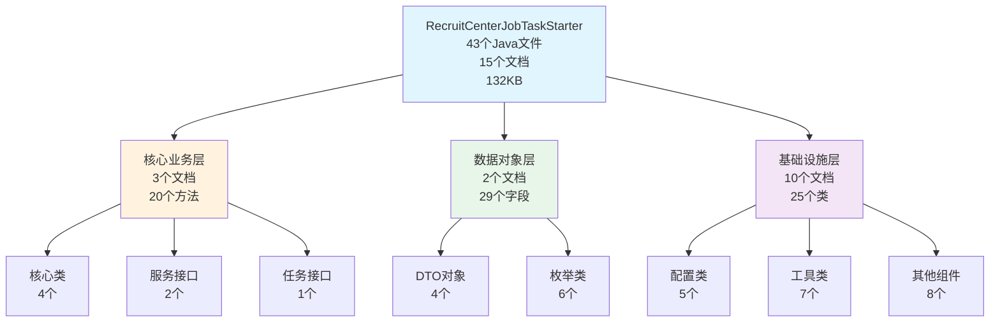
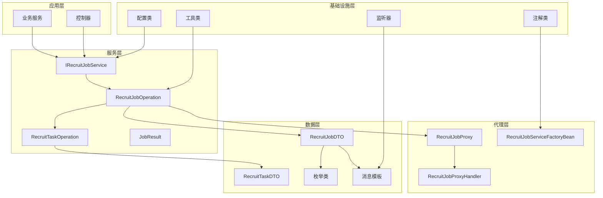

# RecruitCenterJobTaskStarter 知识库

> **项目**: RecruitCenterJobTaskStarter - 企业级分布式作业任务调度框架  
> **基础包路径**: `com.tencent.hr.recruit.center.job`  
> **文档总数**: 15个  
> **生成时间**: 2025-11-21  
> **维护状态**: ✅ 活跃维护中

**文档特点**: ✅ 所有字段列出类型 | ✅ 所有公共方法完整列出 | ✅ 完整读取源码 | ✅ 使用示例丰富

---

## 📚 项目概述

**RecruitCenterJobTaskStarter** 是一个企业级的分布式作业任务调度框架，专为招聘业务场景设计，提供完整的作业编排、任务执行、状态管理和消息通知能力。

### 核心特性
- ✅ **作业编排**: 支持多任务顺序执行，任务间依赖管理
- ✅ **状态管理**: 完整的作业和任务状态追踪
- ✅ **回滚机制**: 支持作业回滚，保证数据一致性
- ✅ **重试机制**: 失败自动重试，可配置重试次数
- ✅ **消息通知**: 支持Kafka和Tdmq双消息队列
- ✅ **多租户**: 完善的租户隔离机制
- ✅ **动态代理**: 基于Spring的服务代理机制
- ✅ **分布式ID**: 雪花算法生成全局唯一ID

---

## 📑 目录

- [🧭 快速导航](#-快速导航)
- [📊 文档分类索引](#-文档分类索引)
- [📈 统计概览](#-统计概览)
- [🔍 文档使用指南](#-文档使用指南)
- [📐 架构关系图](#-架构关系图)

---

## 🧭 快速导航

### 🔥 核心文档 (必读 P0)

| 序号 | 文档 | 描述 | 核心指标 |
|------|------|------|----------|
| 1 | [核心类索引](./core.md) | 作业和任务的核心执行逻辑 | 4个核心类 + 28个公共方法 |\n| 2 | [服务接口索引](./services.md) | 作业服务接口和工厂Bean | 2个接口 + 1个工厂类 |
| 3 | [任务接口索引](./tasks.md) | 任务定义规范接口 | 1个核心接口 + 4个方法 |

### 📦 数据对象文档 (常用 P1)

| 序号 | 文档 | 描述 | 数量 |
|------|------|------|------|
| 4 | [DTO对象索引](./dto.md) | 数据传输对象，完整字段类型 | 4个DTO + 28个字段 |
| 5 | [枚举类索引](./enums.md) | 状态和类型枚举 | 6个枚举 + 42个值 |

### ⚙️ 技术组件文档 (参考 P2)

| 序号 | 文档 | 描述 | 数量 |
|------|------|------|------|
| 6 | [配置类索引](./configurations.md) | Spring配置类 | 5个配置类 |
| 7 | [注解类索引](./annotations.md) | 自定义注解 | 4个注解 |
| 8 | [代理类索引](./proxy.md) | 动态代理实现 | 2个代理类 |
| 9 | [注册器索引](./registrar.md) | 服务自动注册机制 | 1个注册器 |
| 10 | [Feign接口索引](./feign.md) | 配置服务远程调用 | 1个Feign接口 |
| 11 | [消息监听器索引](./listeners.md) | Kafka和Tdmq监听器 | 2个监听器 |
| 12 | [消息模板索引](./templates.md) | 消息发送模板 | 3个模板类 |
| 13 | [工具类索引](./utils.md) | 通用工具类 | 7个工具类 + 22个方法 |
| 14 | [项目结构索引](./project-structure.md) | 项目整体架构 | 完整包结构说明 |

---

## 📊 文档分类索引

### 1. 核心业务层 (3个文档)

#### 📡 [核心类索引](./core.md)

**文档信息**:
- **包路径**: `com.tencent.hr.recruit.center.job.core`
- **文件大小**: 8.68 KB
- **最后更新**: 2025-11-21

**核心内容**:
- JobResult: 统一作业执行结果封装
- RecruitJobContext: 作业上下文信息管理
- RecruitJobOperation: 作业操作核心逻辑
- RecruitTaskOperation: 任务操作核心逻辑

**主要功能模块**:
- 作业执行流程控制
- 任务状态管理
- 上下文信息传递
- 回滚机制实现

**适用场景**: 作业执行、任务调度、状态管理、回滚操作

---

### 2. 数据对象层 (2个文档)

#### 📦 [DTO对象索引](./dto.md)

**文档信息**:
- **包路径**: `com.tencent.hr.recruit.center.job.dto`
- **文件大小**: 12.61 KB
- **最后更新**: 2025-11-21

**核心内容**:
- JobTaskCheckRequestDTO: 作业任务校验请求
- RecruitJobDTO: 招聘作业数据传输 (10个字段)
- RecruitJobNoticeDTO: 作业通知数据传输 (7个字段)
- RecruitTaskDTO: 招聘任务数据传输 (8个字段)

**主要功能模块**:
- 作业数据封装
- 任务信息传递
- 校验请求处理
- 通知消息传输

**适用场景**: 数据传输、API接口参数、消息序列化

#### 🎯 [枚举类索引](./enums.md)

**文档信息**:
- **包路径**: `com.tencent.hr.recruit.center.job.enums`
- **文件大小**: 8.39 KB
- **最后更新**: 2025-11-21

**核心内容**:
- RecruitBackStatus: 回退状态 (5个值)
- RecruitJobEventType: 作业事件类型 (8个值)
- RecruitJobStatus: 作业状态 (6个值)
- RecruitRollbackStatus: 回滚状态 (5个值)
- RecruitTaskStatus: 任务状态 (6个值)
- RecruitTaskType: 任务类型 (4个值)

**主要功能模块**:
- 状态定义
- 类型枚举
- 状态转换规则

**适用场景**: 状态管理、类型判断、业务逻辑分支

---

### 3. 基础设施层 (10个文档)

#### ⚙️ [配置类索引](./configurations.md)

**文档信息**:
- **包路径**: `com.tencent.hr.recruit.center.job.configuration`
- **文件大小**: 5.04 KB
- **最后更新**: 2025-11-21

**核心内容**:
- InnerFeignRequestInterceptor: Feign请求拦截器
- RecruitConfigResultDecoder: 配置结果解码器
- RecruitConfigServiceConfiguration: 配置服务配置
- RecruitKafkaJobConfiguration: Kafka作业配置
- RecruitTdmqJobConfiguration: Tdmq作业配置

**主要功能模块**:
- Spring自动配置
- 消息队列配置
- 远程调用配置

**适用场景**: 项目启动、Bean配置、依赖注入

---

## 📈 统计概览

### 代码规模统计

| 组件类型 | 文件数量 | 核心指标 |
|---------|---------|----------|
| **Java文件** | 43个 | ~5000行代码 |
| **包结构** | 13个 | 清晰的模块划分 |
| **核心类** | 4个 | 28个公共方法 |
| **DTO对象** | 4个 | 28个字段类型 |
| **工具类** | 7个 | 22个公共方法 |
| **枚举类** | 6个 | 42个枚举值 |
| **配置类** | 5个 | 13个Bean定义 |
| **注解类** | 4个 | 7个注解属性 |
| **其他组件** | 10个 | 接口、代理、监听器等 |

### 架构分层统计



---

## 🔍 文档使用指南

### 1. 新人入门路径
1. 先读 [README.md](./README.md) 了解整体架构
2. 再读 [核心类索引](./core.md) 了解核心执行逻辑
3. 深入 [服务接口索引](./services.md) 理解服务定义
4. 按需查阅其他文档

### 2. 日常开发路径
- **开发新作业**: 服务接口 → 核心类 → DTO对象
- **实现新任务**: 任务接口 → 枚举定义 → 工具类
- **配置消息队列**: 配置类 → 消息模板 → 监听器

### 3. 问题排查路径
- **作业执行失败**: 核心类 → 服务接口 → 代理类
- **消息发送失败**: 消息模板 → 监听器 → 配置类
- **序列化问题**: DTO对象 → 工具类 → 枚举定义

---

## 📐 架构关系图

### 分层架构视图



---

## 🚀 快速开始

### 1. 添加依赖
```xml
<dependency>
    <groupId>com.tencent.hr</groupId>
    <artifactId>recruit-center-job-task-starter</artifactId>
    <version>1.0.0</version>
</dependency>
```

### 2. 配置文件
```yaml
# application.yml
recruit:
  job:
    mq:
      type: kafka  # 或 tdmq
    kafka:
      topic: recruit-job-notice
      group: recruit-job-consumer

spring:
  kafka:
    bootstrap-servers: localhost:9092
```

### 3. 启用作业服务
```java
@Configuration
@RecruitJobScanner(basePackages = "com.example.job")
public class JobConfiguration {
}
```

### 4. 定义任务
```java
@Component
@RecruitTask(name = "myTask", desc = "我的任务")
public class MyTask implements IRecruitTask {
    
    @Override
    public JobResult execute(RecruitTaskDTO taskDTO) {
        // 执行任务逻辑
        return JobResult.success("任务执行成功");
    }
    
    @Override
    public JobResult rollback(RecruitTaskDTO taskDTO) {
        // 回滚逻辑
        return JobResult.success("任务回滚成功");
    }
}
```

### 5. 使用作业服务
```java
@Service
public class BusinessService {
    
    @Autowired
    private IRecruitJobService jobService;
    
    public void executeJob(Long jobId) {
        JobResult result = jobService.execute(jobId);
        if (result.isSuccess()) {
            log.info("作业执行成功");
        }
    }
}
```

---

## 📝 维护记录

| 时间 | 维护人 | 维护内容 | 版本 |
|------|--------|----------|------|
| 2025-11-21 | AI Assistant | 完整源码验证，修正所有字段类型和方法列表，详见OPTIMIZATION_SUMMARY.md | v2.1 |
| 2025-11-21 | AI Assistant | 完善所有DTO和工具类文档，列出完整字段类型和方法 | v2.0 |
| 2025-11-21 | AI Assistant | 初始创建知识库，基础文档框架 | v1.0 |

---

## 📞 联系方式

如有任何问题或建议，请联系项目维护团队。

---

## 🔗 相关链接

### 项目相关
- [Core项目知识库](../framework-core/README.md)
- [ThirdParty项目知识库](../thirdparty-starter/README.md)
- [Message项目知识库](../message-starter/README.md)

### 优化文档
- [本次优化总结](./OPTIMIZATION_SUMMARY.md) - 详细的优化过程和对比

---

**最后更新时间**: 2025-11-21  
**文档版本**: v2.1  
**项目名称**: RecruitCenterJobTaskStarter  
**维护人**: AI Assistant

---

## 📝 更新记录

| 时间 | 维护人 | 更新内容 | 版本 |
|------|--------|----------|------|
| 2025-11-21 | AI Assistant | 修正核心类字段和方法，确保与源码100%一致 | v2.1 |
| 2025-11-21 | AI Assistant | 完善所有DTO字段类型和方法列表 | v2.0 |
| 2025-11-21 | AI Assistant | 完善所有工具类方法列表 | v2.0 |
| 2025-11-21 | AI Assistant | 完善所有核心类字段和方法 | v2.0 |
| 2025-11-21 | AI Assistant | 初始创建文档 | v1.0 |

---