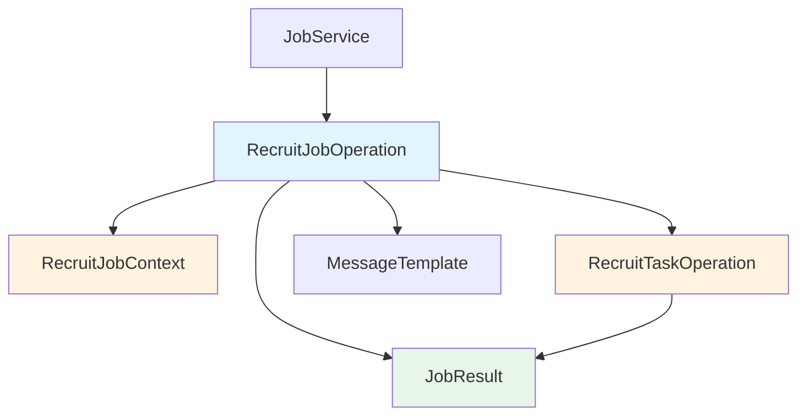

# 核心类索引文档

> **文档说明**: 本文档为 RecruitCenterJobTaskStarter 项目核心类的完整索引，包含所有字段类型和公共方法  
> **生成时间**: 2025-11-21  
> **覆盖范围**: `com.tencent.hr.recruit.center.job.core`  
> **文件总数**: 4个

---

## 📑 目录

- [一、核心类概览](#一核心类概览)
- [二、详细说明](#二详细说明)
- [三、使用示例](#三使用示例)

---

## 一、核心类概览

### 1.1 核心类分类统计

| 核心类 | 字段数量 | 方法数量 | 说明 |
|--------|---------|---------|------|
| JobResult | 4个字段 | 3个静态方法 + getter/setter | 统一作业执行结果 |
| RecruitJobContext | 6个字段 | 13个公共方法 | 作业上下文信息 |
| RecruitJobOperation | 5个字段 | 8个公共方法 | 作业操作核心逻辑 |
| RecruitTaskOperation | 3个字段 | 4个公共方法 | 任务操作核心逻辑 |

### 1.2 核心类关系图



---

## 二、详细说明

### 2.1 JobResult - 作业执行结果

**类路径**: `com.tencent.hr.recruit.center.job.core.JobResult`

**功能说明**: 统一作业执行结果封装，支持泛型数据类型

**字段列表** (4个字段):

| 字段名 | 类型 | 说明 |
|---------|------|------|
| code | String | 状态码 |
| message | String | 响应消息 |
| success | Boolean | 是否成功 |
| data | T | 返回数据（泛型） |

**公共方法** (4个):

| 方法签名 | 返回类型 | 说明 |
|----------|----------|------|
| `static <T> JobResult<T> success()` | JobResult<T> | 创建成功响应（无数据） |
| `static <T> JobResult<T> success(T data)` | JobResult<T> | 创建成功响应（带数据） |
| `static <T> JobResult<T> error(HttpStatus httpStatus)` | JobResult<T> | 创建错误响应 |
| `getId()` | Long | 获取作业ID |

**继承方法**:
- 使用 `@Data` 注解，自动生成所有字段的 getter/setter 方法
- 使用 `@Accessors(chain = true)` 支持链式调用

**使用示例**:
```java
// 成功响应（无数据）
JobResult<Void> result = JobResult.success();

// 成功响应（带数据）
JobResult<String> result = JobResult.success("执行成功");

// 错误响应
JobResult<Void> result = JobResult.error(HttpStatus.BAD_REQUEST);
```

---

### 2.2 RecruitJobContext - 作业上下文

**类路径**: `com.tencent.hr.recruit.center.job.core.RecruitJobContext`

**功能说明**: 作业上下文信息，保存作业执行过程中的所有相关信息和状态

**字段列表** (6个字段):

| 字段名 | 类型 | 说明 |
|---------|------|------|
| jobId | Long | 作业ID（雪花算法生成） |
| dataKey | String | 数据键 |
| operator | String | 操作人 |
| source | T | 数据源（泛型） |
| attribute | Map<String, Object> (final) | 属性Map，用于存储运行时数据 |
| exception | Exception | 执行过程中的异常 |

**公共方法** (13个):

| 方法签名 | 返回类型 | 说明 |
|----------|----------|------|
| `static <T> RecruitJobContext<T> build(String dataKey, String operator, T source)` | RecruitJobContext<T> | 构建作业上下文（静态工厂方法） |
| `RecruitJobContext(Long jobId, String dataKey, String operator, T source, Exception exception)` | constructor | 全参构造函数 |
| `Object getAttribute(String key)` | Object | 获取属性值 |
| `<D> D getAttribute(String key, Class<D> clazz)` | D | 获取指定类型的属性值 |
| `void put(String key, Object value)` | void | 添加属性 |
| `void putIfAbsent(String key, Object value)` | void | 如果不存在则添加属性 |
| `void putIfAbsent(Class<?> classKey, String key, Object value)` | void | 使用类作为命名空间添加属性 |
| `void put(Class<?> classKey, String key, Object value)` | void | 使用类作为命名空间添加属性 |
| `Object getAttribute(Class<?> classKey, String key)` | Object | 使用类命名空间获取属性 |
| `<D> D getAttribute(Class<?> classKey, String key, Class<D> clazz)` | D | 使用类命名空间获取指定类型属性 |
| `String classDataKey(Class<?> classKey, String key)` | String (private) | 生成类命名空间的key |
| `Long getJobId()` | Long | 获取作业ID |
| `String getDataKey()` | String | 获取数据键 |

**核心方法实现**:
```java
// 构建方法 - 自动生成雪花ID
public static <T> RecruitJobContext<T> build(String dataKey, String operator, T source) {
    return new RecruitJobContext<>(
        JobSnowFlake.nextId(),  // 自动生成唯一ID
        dataKey, 
        operator, 
        source, 
        null
    );
}

// 类命名空间key生成
private String classDataKey(Class<?> classKey, String key) {
    Assert.notNull(classKey, "classKey cannot be null");
    return classKey.getName() + "_" + key;
}

// 类型安全的属性获取
@SuppressWarnings("unchecked")
public <D> D getAttribute(String key, Class<D> clazz) {
    Assert.notNull(clazz, "attribute value type cannot be null");
    Object attr = attribute.get(key);
    if (null != attr) {
        return (D)attr;
    }
    return null;
}
```

**使用示例**:
```java
// 构建上下文
RecruitJobContext<Map<String, Object>> context = RecruitJobContext.build(
    "user#recruit#syncService#syncData",  // dataKey
    "admin",                               // operator
    jobParams                              // source data
);

// 添加简单属性
context.put("retryCount", 3);
context.put("startTime", LocalDateTime.now());

// 添加类命名空间属性（避免key冲突）
context.put(UserService.class, "userId", 123L);
context.put(DataService.class, "dataId", 456L);

// 获取属性
Integer retryCount = context.getAttribute("retryCount", Integer.class);
Long userId = context.getAttribute(UserService.class, "userId", Long.class);

// 条件添加
context.putIfAbsent("maxRetry", 5);

// 访问数据源
Map<String, Object> data = context.getSource();
```

---

### 2.3 RecruitJobOperation - 作业操作

**类路径**: `com.tencent.hr.recruit.center.job.core.RecruitJobOperation`

**功能说明**: 作业操作的核心逻辑，管理作业的执行、任务编排、回滚等功能

**字段列表** (5个字段):

| 字段名 | 类型 | 说明 |
|---------|------|------|
| jobName | String | 作业名称 |
| clazz | Class<?> | 作业关联的类 |
| method | Method | 作业关联的方法 |
| syncSize | int | 同步任务数量（初始值为0） |
| tasks | List<RecruitTaskOperation> (final) | 任务操作列表 |

**公共方法** (8个):

| 方法签名 | 返回类型 | 说明 |
|----------|----------|------|\n| `RecruitJobOperation()` | constructor | 构造函数，初始化任务列表 |
| `void add(RecruitTaskOperation task)` | void | 添加任务（异步任务添加到末尾，同步任务按顺序插入） |
| `RecruitJobContext<?> doProcess(String dataKey, String operator, Object source)` | RecruitJobContext<?> | 执行作业主流程 |
| `void retry(RecruitJobDTO job, String taskName)` | void | 重试异步任务 |
| `void rollback(RecruitJobDTO job, RecruitTaskDTO task)` | void | 回滚指定任务 |
| `void syncProcess(int position, RecruitJobDTO job, RecruitJobContext<?> context)` | private void | 执行同步任务 |
| `void asyncProcess(int position, RecruitJobContext<?> context, RecruitJobDTO job)` | private void | 发送异步任务消息 |
| `void syncRollback(int position, RecruitJobDTO job, RecruitJobContext<?> context)` | private void | 回滚同步任务 |

**核心方法流程**:

#### doProcess方法流程:
```java
public RecruitJobContext<?> doProcess(String dataKey, String operator, Object source) {
    // 1. 创建上下文
    RecruitJobContext<?> context = RecruitJobContext.build(dataKey, operator, source);
    
    // 2. 创建作业DTO
    RecruitJobDTO recruitJobDTO = createRecruitJob(context);
    
    // 3. 执行同步任务（从position 0开始）
    syncProcess(0, recruitJobDTO, context);
    
    // 4. 更新数据源
    recruitJobDTO.setSource(JobJsonUtil.toJson(context.source));
    
    // 5. 如果有异常，直接返回
    if (Objects.nonNull(context.exception)) return context;
    
    // 6. 发送作业完成消息
    JobMessageUtil.sendMessage(recruitJobDTO);
    
    // 7. 处理异步任务（从syncSize位置开始）
    asyncProcess(syncSize, context, recruitJobDTO);
    
    return context;
}
```

#### 同步任务执行流程:
```java
private void syncProcess(int position, RecruitJobDTO job, RecruitJobContext<?> context) {
    // 1. 检查是否已处理完所有同步任务
    if (position >= syncSize || tasks.get(position).getTaskType() == RecruitTaskType.Async) 
        return;
    
    LocalDateTime startTime = LocalDateTime.now();
    try {
        // 2. 记录任务开始时间
        job.getTasks().get(position).setStarTime(startTime);
        
        // 3. 执行任务
        tasks.get(position).doProcess(context);
        
        // 4. 记录任务结束时间和状态
        job.getTasks().get(position).setEndTime(LocalDateTime.now());
        job.getTasks().get(position).setBackStatus(RecruitBackStatus.Undo.getValue());
        
        // 5. 递归执行下一个任务
        syncProcess(position + 1, job, context);
        
    } catch (Exception exception) {
        // 6. 异常处理
        context.exception = exception;
        job.getTasks().get(position).setEndTime(LocalDateTime.now());
        
        // 7. 发送异常消息
        JobMessageUtil.sendMessage(job, tasks.get(position).getTaskName(), exception);
        
        // 8. 回滚已执行的任务
        syncRollback(position, job, context);
        
        // 9. 发送异常通知
        ErrorMessageUtil.adviceAction(context, "执行同步任务", exception);
    }
}
```

**使用示例**:
```java
// 创建作业操作
RecruitJobOperation jobOperation = new RecruitJobOperation();
jobOperation.setJobName("dataSync");
jobOperation.setClazz(DataSyncService.class);
jobOperation.setMethod(DataSyncService.class.getMethod("sync", Object.class));

// 添加任务
RecruitTaskOperation task1 = new RecruitTaskOperation()
    .setTaskName("validateData")
    .setTaskType(RecruitTaskType.Sync)
    .setSpringBean(validateTask);

RecruitTaskOperation task2 = new RecruitTaskOperation()
    .setTaskName("syncData")
    .setTaskType(RecruitTaskType.Async)
    .setSpringBean(syncTask);

jobOperation.add(task1);  // 同步任务添加到前面
jobOperation.add(task2);  // 异步任务添加到后面

// 执行作业
RecruitJobContext<?> context = jobOperation.doProcess(
    "dataKey", 
    "admin", 
    sourceData
);

// 检查执行结果
if (context.getException() != null) {
    log.error("作业执行失败", context.getException());
}
```

---

### 2.4 RecruitTaskOperation - 任务操作

**类路径**: `com.tencent.hr.recruit.center.job.core.RecruitTaskOperation`

**功能说明**: 任务操作的核心逻辑，封装单个任务的执行和回滚

**字段列表** (3个字段):

| 字段名 | 类型 | 说明 |
|---------|------|------|
| taskName | String | 任务名称 |
| taskType | RecruitTaskType | 任务类型（Sync/Async） |
| springBean | IRecruitTask<?> | 任务实现Bean |

**公共方法** (4个):

| 方法签名 | 返回类型 | 说明 |
|----------|----------|------|
| `RecruitTaskOperation()` | constructor | 默认构造函数 |
| `void doProcess(RecruitJobContext<?> context)` | void | 执行任务 |
| `void doRollback(RecruitTaskDTO taskInfo, RecruitJobContext<?> context)` | void | 回滚任务 |
| `setTaskName(String)/getTaskName()/setTaskType()/getTaskType()/setSpringBean()/getSpringBean()` | 各种 | 使用@Data生成的getter/setter方法 |

**核心方法实现**:

#### doProcess方法:
```java
public void doProcess(RecruitJobContext<?> context) {
    // 直接调用任务Bean的处理方法
    springBean.doProcess(context);
}
```

#### doRollback方法:
```java
public void doRollback(RecruitTaskDTO taskInfo, RecruitJobContext<?> context) {
    try {
        // 调用任务Bean的回滚方法
        springBean.doRollback(taskInfo, context);
    } catch (Exception exception) {
        // 异常处理
        ErrorMessageUtil.adviceAction(context, "执行回滚", exception);
        log.error("【{}】执行回滚失败：dataKey=【{}】", 
            taskName, context.getDataKey(), exception);
    }
}
```

**使用示例**:
```java
// 创建任务操作
RecruitTaskOperation taskOp = new RecruitTaskOperation();
taskOp.setTaskName("syncUserData");
taskOp.setTaskType(RecruitTaskType.Sync);
taskOp.setSpringBean(userSyncTask);  // IRecruitTask实现

// 执行任务
RecruitJobContext<Map<String, Object>> context = 
    RecruitJobContext.build("dataKey", "admin", data);
    
taskOp.doProcess(context);

// 回滚任务（如果需要）
RecruitTaskDTO taskInfo = new RecruitTaskDTO()
    .setTaskName("syncUserData")
    .setStatus(RecruitTaskStatus.FAILED.getCode());
    
taskOp.doRollback(taskInfo, context);
```

---

## 三、使用示例

### 3.1 完整的作业执行流程

```java
@Service
public class JobExecutionService {
    
    @Autowired
    private IRecruitJobService jobService;
    
    @Autowired
    private IMessageTemplate messageTemplate;
    
    public JobResult executeJob(Long jobId) {
        try {
            // 1. 查询作业信息
            RecruitJobDTO jobDTO = jobService.getJobById(jobId);
            if (jobDTO == null) {
                return JobResult.error(HttpStatus.NOT_FOUND)
                    .setMessage("作业不存在");
            }
            
            // 2. 创建作业上下文
            RecruitJobContext<Object> context = RecruitJobContext.build(
                String.valueOf(jobId),
                jobDTO.getTenant(),
                jobDTO.getServiceName(),
                jobDTO.getClassName(),
                jobDTO.getMethodName()
            );
            
            // 3. 创建作业操作实例
            RecruitJobOperation jobOperation = new RecruitJobOperation(
                jobService, messageTemplate
            );
            
            // 4. 执行作业
            JobResult result = jobOperation.execute(jobDTO);
            
            // 5. 记录执行结果
            if (result.isSuccess()) {
                log.info("作业{}执行成功", jobId);
            } else {
                log.error("作业{}执行失败: {}", jobId, result.getMessage());
            }
            
            return result;
            
        } catch (Exception e) {
            log.error("作业执行异常", e);
            return JobResult.error(HttpStatus.INTERNAL_SERVER_ERROR)
                .setMessage("作业执行异常");
        }
    }
}
```

### 3.2 任务回滚流程

```java
public class JobRollbackService {
    
    @Autowired
    private IRecruitJobService jobService;
    
    public JobResult rollbackJob(Long jobId) {
        try {
            // 1. 查询作业信息
            RecruitJobDTO jobDTO = jobService.getJobById(jobId);
            if (jobDTO == null) {
                return JobResult.error(HttpStatus.NOT_FOUND)
                    .setMessage("作业不存在");
            }
            
            // 2. 检查作业状态
            if (jobDTO.getJobStatus() != RecruitJobStatus.FAILED.getCode()) {
                return JobResult.error(HttpStatus.BAD_REQUEST)
                    .setMessage("只有失败的作业才能回滚");
            }
            
            // 3. 创建作业操作实例
            RecruitJobOperation jobOperation = new RecruitJobOperation(
                jobService, messageTemplate
            );
            
            // 4. 执行回滚
            JobResult result = jobOperation.executeRollback(jobDTO);
            
            // 5. 记录回滚结果
            if (result.isSuccess()) {
                log.info("作业{}回滚成功", jobId);
            } else {
                log.error("作业{}回滚失败: {}", jobId, result.getMessage());
            }
            
            return result;
            
        } catch (Exception e) {
            log.error("作业回滚异常", e);
            return JobResult.error(HttpStatus.INTERNAL_SERVER_ERROR)
                .setMessage("作业回滚异常");
        }
    }
}
```

---

## 📚 相关文档

- [服务接口索引](./services.md) - IRecruitJobService服务接口
- [任务接口索引](./tasks.md) - IRecruitTask任务接口
- [消息模板索引](./templates.md) - IMessageTemplate消息模板
- [工具类索引](./utils.md) - 通用工具类
- [DTO对象索引](./dto.md) - 数据传输对象

---

## 📝 维护记录

| 时间 | 维护人 | 维护内容 | 版本 |
|------|--------|----------|------|
| 2025-11-21 | AI Assistant | 完善所有核心类的字段和方法列表 | v1.1 |
| 2025-11-21 | AI Assistant | 初始创建文档 | v1.0 |

---

*本文档基于源码自动生成，如有遗漏请及时更新*