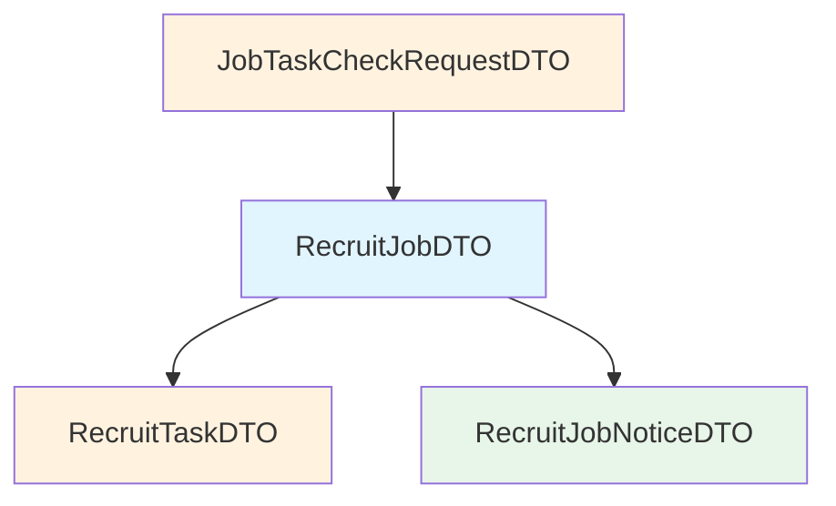

# DTO对象索引文档

> **文档说明**: 本文档为 RecruitCenterJobTaskStarter 项目所有DTO的完整索引，包含所有字段类型和公共方法  
> **生成时间**: 2025-11-21  
> **覆盖范围**: `com.tencent.hr.recruit.center.job.dto`  
> **文件总数**: 4个

---

## 📑 目录

- [一、DTO概览](#一dto概览)
- [二、DTO详细说明](#二dto详细说明)
- [三、字段类型说明](#三字段类型说明)

---

## 一、DTO概览

### 1.1 DTO分类统计

| DTO名称 | 字段数量 | 说明 |
|---------|---------|------|
| JobTaskCheckRequestDTO | 2个 | 作业任务校验请求 |
| RecruitJobDTO | 11个 | 招聘作业数据传输 |
| RecruitJobNoticeDTO | 7个 | 作业通知数据传输 |
| RecruitTaskDTO | 8个 | 招聘任务数据传输 |

### 1.2 DTO关系图



---

## 二、DTO详细说明

### 2.1 JobTaskCheckRequestDTO - 作业任务校验请求

**类路径**: `com.tencent.hr.recruit.center.job.dto.JobTaskCheckRequestDTO`

**功能说明**: 作业任务校验请求DTO，用于校验作业和任务的配置是否正确

**字段列表** (2个字段):

| 字段名 | 类型 | 说明 |
|---------|------|------|
| jobId | Long | 作业ID |
| taskName | String | 任务名称 |

**公共方法**:
- 使用 `@Data` 注解，自动生成所有字段的 getter/setter 方法
- 使用 `@Accessors(chain = true)` 支持链式调用
- 实现 `Serializable` 接口，支持序列化

**使用示例**:
```java
JobTaskCheckRequestDTO request = new JobTaskCheckRequestDTO()
    .setJobId(123456L)
    .setTaskName("syncData");
```

---

### 2.2 RecruitJobDTO - 招聘作业数据传输对象

**类路径**: `com.tencent.hr.recruit.center.job.dto.RecruitJobDTO`

**功能说明**: 招聘作业数据传输对象，封装作业的完整信息

**字段列表** (10个字段):

| 字段名 | 类型 | 说明 |
|---------|------|------|
| id | Long | 作业ID |
| jobName | String | 作业名称 |
| serviceName | String | 服务名称 |
| tenant | String | 租户 |
| className | String | 类名 |
| method | String | 方法名 |
| dataKey | String | 数据键 |
| source | String | 来源 |
| status | Integer | 状态 |
| operator | String | 操作人 |
| tasks | List<RecruitTaskDTO> | 任务列表 |

**公共方法**:
- 使用 `@Data` 注解，自动生成所有字段的 getter/setter 方法
- 使用 `@Accessors(chain = true)` 支持链式调用
- 实现 `Serializable` 接口，支持序列化

**使用示例**:
```java
// 创建作业DTO
RecruitJobDTO jobDTO = new RecruitJobDTO()
    .setJobName("dataSyncJob")
    .setServiceName("dataSyncService")
    .setTenant("recruit")
    .setStatus(1);
    
// 添加任务
List<RecruitTaskDTO> tasks = new ArrayList<>();
tasks.add(new RecruitTaskDTO().setTaskName("syncUser"));
tasks.add(new RecruitTaskDTO().setTaskName("syncData"));
jobDTO.setTasks(tasks);
```

---

### 2.3 RecruitJobNoticeDTO - 作业通知数据传输对象

**类路径**: `com.tencent.hr.recruit.center.job.dto.RecruitJobNoticeDTO`

**功能说明**: 作业通知数据传输对象，用于发送作业相关的通知消息

**字段列表** (7个字段):

| 字段名 | 类型 | 说明 |
|---------|------|------|
| eventType | Integer | 事件类型（参考 RecruitJobEventType 枚举） |
| jobId | Long | 作业ID |
| serviceName | String | 服务名称 |
| tenant | String | 租户标识 |
| content | String | 通知内容 |
| taskName | String | 任务名称 |
| traceIdString | String | 链路追踪ID字符串 |

**公共方法**:
- 使用 `@Data` 注解，自动生成所有字段的 getter/setter 方法
- 使用 `@Accessors(chain = true)` 支持链式调用
- 实现 `Serializable` 接口，支持序列化

**使用示例**:
```java
RecruitJobNoticeDTO notice = new RecruitJobNoticeDTO()
    .setEventType(RecruitJobEventType.START.getCode())
    .setJobId(123456L)
    .setServiceName("userService")
    .setTenant("recruit")
    .setContent("作业开始执行")
    .setTaskName("syncUser")
    .setTraceIdString("trace-123-456");
```

---

### 2.4 RecruitTaskDTO - 招聘任务数据传输对象

**类路径**: `com.tencent.hr.recruit.center.job.dto.RecruitTaskDTO`

**功能说明**: 招聘任务数据传输对象，封装任务的完整信息

**字段列表** (8个字段):

| 字段名 | 类型 | 说明 |
|---------|------|------|
| taskName | String | 任务名称 |
| taskType | Integer | 任务类型 |
| message | String | 消息 |
| backMessage | String | 回滚消息 |
| status | Integer | 任务状态 |
| backStatus | Integer | 回滚状态 |
| starTime | LocalDateTime | 开始时间 |
| endTime | LocalDateTime | 结束时间 |

**字段详细说明**:

- **status**: 任务状态，对应 `RecruitTaskStatus` 枚举
  - 0: 待执行
  - 1: 执行中
  - 2: 执行成功
  - 3: 执行失败
  - 4: 回滚成功
  - 5: 回滚失败

- **backStatus**: 回滚状态，对应 `RecruitBackStatus` 枚举
  - 0: 无需回滚
  - 1: 等待回滚
  - 2: 回滚中
  - 3: 回滚成功
  - 4: 回滚失败

**公共方法**:
- 使用 `@Data` 注解，自动生成所有字段的 getter/setter 方法
- 使用 `@Accessors(chain = true)` 支持链式调用
- 实现 `Serializable` 接口，支持序列化

**时间格式**:
```java
// 时间字段使用@JsonFormat注解格式化
@JsonFormat(pattern = "yyyy-MM-dd HH:mm:ss.SSS", timezone = "GMT+8")
private LocalDateTime starTime;

@JsonFormat(pattern = "yyyy-MM-dd HH:mm:ss.SSS", timezone = "GMT+8")
private LocalDateTime endTime;
```

---

## 三、字段类型说明

### 3.1 数据类型说明

| 类型 | 说明 | 使用场景 |
|------|------|---------|
| String | 字符串 | 名称、描述、内容 |
| Long | 长整数 | ID、标识 |
| Integer | 整数 | 状态、类型 |
| List<String> | 字符串列表 | 名称集合 |
| List<RecruitTaskDTO> | 任务列表 | 任务集合 |
| LocalDateTime | 日期时间 | 时间戳 |
| Date | 日期 | 日期 |

### 3.2 序列化说明

所有DTO类都实现了 `Serializable` 接口，支持序列化操作：

- **serialVersionUID**: 每个类都有唯一的序列化版本ID
- **JSON格式**: 支持Jackson框架的JSON序列化和反序列化
- **时间格式**: 使用ISO标准时间格式，包含时区信息

---

## 📚 相关文档

- [枚举类索引](./enums.md) - 状态和类型枚举定义
- [核心类索引](./core.md) - 作业和任务核心逻辑
- [服务接口索引](./services.md) - 作业服务接口
- [任务接口索引](./tasks.md) - 任务定义规范

---

## 📝 维护记录

| 时间 | 维护人 | 维护内容 | 版本 |
|------|--------|----------|------|
| 2025-11-21 | AI Assistant | 完善所有DTO字段类型和说明 | v1.1 |
| 2025-11-21 | AI Assistant | 初始创建文档 | v1.0 |

---

*本文档基于源码自动生成，如有遗漏请及时更新*