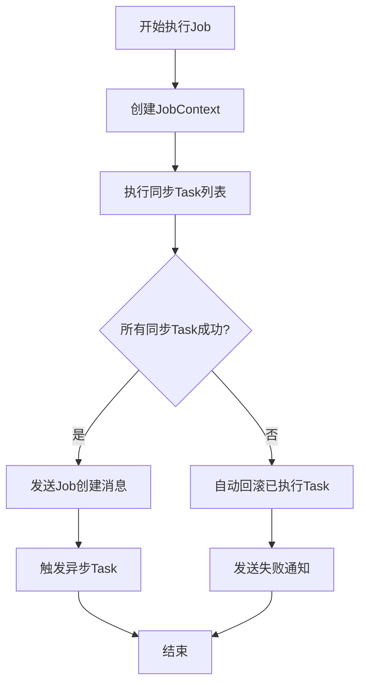

# RecruitCenterJobTaskStarter 项目结构分析

> **项目说明**: RecruitCenterJobTaskStarter 是招聘中心Job-Task异步任务框架的Starter组件  
> **基础包路径**: `com.tencent.hr.recruit.center.job`  
> **文件总数**: 43个Java文件  
> **生成时间**: 2025-11-21

---

## 📑 目录

- [一、项目概述](#一项目概述)
- [二、目录结构](#二目录结构)
- [三、包结构统计](#三包结构统计)
- [四、核心功能模块](#四核心功能模块)

---

## 一、项目概述

### 1.1 项目定位

RecruitCenterJobTaskStarter 是一个基于Spring Boot的异步任务执行框架，提供了完整的Job-Task编排能力，支持同步/异步任务混合执行、事务回滚、消息通知等功能。

### 1.2 核心特性

- ✅ **Job-Task编排**: 支持将复杂业务拆分为多个Task，按需编排执行
- ✅ **同步异步混合**: 同一个Job中可包含同步Task和异步Task
- ✅ **自动回滚**: 同步Task失败时自动执行回滚逻辑
- ✅ **消息驱动**: 基于Kafka/TDMQ实现异步Task的触发和状态通知
- ✅ **分布式追踪**: 集成TraceId实现全链路追踪
- ✅ **多租户支持**: 提供租户隔离能力

### 1.3 技术栈

- Spring Boot 自动配置
- Spring Kafka / TDMQ Pulsar 消息队列
- Feign 远程调用
- Jackson JSON序列化
- Lombok 简化代码

---

## 二、目录结构

```
src/main/java/com/tencent/hr/recruit/center/job/
├── annotations/           # 注解定义 (4个)
│   ├── RecruitJob.java
│   ├── RecruitJobScanner.java
│   ├── RecruitJobService.java
│   └── RecruitTask.java
├── configuration/         # 配置类 (5个)
│   ├── InnerFeignRequestInterceptor.java
│   ├── RecruitConfigResultDecoder.java
│   ├── RecruitConfigServiceConfiguration.java
│   ├── RecruitKafkaJobConfiguration.java
│   └── RecruitTdmqJobConfiguration.java
├── core/                 # 核心类 (4个)
│   ├── JobResult.java
│   ├── RecruitJobContext.java
│   ├── RecruitJobOperation.java
│   └── RecruitTaskOperation.java
├── dto/                  # 数据传输对象 (4个)
│   ├── JobTaskCheckRequestDTO.java
│   ├── RecruitJobDTO.java
│   ├── RecruitJobNoticeDTO.java
│   └── RecruitTaskDTO.java
├── enums/                # 枚举类 (6个)
│   ├── RecruitBackStatus.java
│   ├── RecruitJobEventType.java
│   ├── RecruitJobStatus.java
│   ├── RecruitRollbackStatus.java
│   ├── RecruitTaskStatus.java
│   └── RecruitTaskType.java
├── factory/              # 工厂类 (1个)
│   └── RecruitJobServiceFactoryBean.java
├── feign/                # Feign接口 (1个)
│   └── RecruitConfigFeign.java
├── listener/             # 消息监听器 (2个)
│   ├── KafkaMessageListener.java
│   └── TdmqMessageListener.java
├── proxy/                # 代理类 (2个)
│   ├── RecruitJobProxy.java (已废弃)
│   └── RecruitJobProxyHandler.java
├── registrar/            # 注册器 (1个)
│   └── RecruitJobServiceRegistrar.java
├── task/                 # 任务接口 (1个)
│   └── IRecruitTask.java
├── template/             # 消息模板 (3个)
│   ├── IMessageTemplate.java
│   └── impl/
│       ├── KafkaMessageTemplate.java
│       └── TdmqMessageTemplate.java
├── utils/                # 工具类 (7个)
│   ├── ErrorMessageUtil.java
│   ├── JobCheckUtil.java
│   ├── JobJsonUtil.java
│   ├── JobMessageUtil.java
│   ├── JobReflectUtil.java
│   ├── JobSnowFlake.java
│   └── TenantHandlerUtils.java
├── IRecruitJobService.java  # 顶层服务接口 (1个)
└── package-info.java         # 包说明 (1个)
```

---

## 三、包结构统计

| 包名 | 文件数量 | 说明 |
|------|---------|------|
| **annotations** | 4 | 注解定义：Job注解、Task注解、扫描器注解 |
| **configuration** | 5 | 自动配置类：Kafka配置、TDMQ配置、Feign配置 |
| **core** | 4 | 核心类：Job上下文、Job操作器、Task操作器、结果封装 |
| **dto** | 4 | 数据传输对象：Job DTO、Task DTO、通知DTO |
| **enums** | 6 | 枚举类：Job状态、Task状态、回滚状态、事件类型 |
| **factory** | 1 | 工厂类：JobService动态代理工厂 |
| **feign** | 1 | Feign接口：远程调用配置服务 |
| **listener** | 2 | 消息监听器：Kafka监听器、TDMQ监听器 |
| **proxy** | 2 | 代理类：JDK动态代理处理器 |
| **registrar** | 1 | 注册器：扫描并注册JobService Bean |
| **task** | 1 | 任务接口：IRecruitTask泛型接口 |
| **template** | 3 | 消息模板：Kafka模板、TDMQ模板 |
| **utils** | 7 | 工具类：JSON工具、反射工具、雪花ID、消息工具 |
| **根目录** | 2 | 顶层接口：IRecruitJobService、package-info |
| **总计** | **43** | **所有Java文件** |

---

## 四、核心功能模块

### 4.1 注解驱动编程

**核心注解**:
- `@RecruitJobService`: 标注Job服务接口
- `@RecruitJob`: 标注Job方法
- `@RecruitTask`: 标注Task列表
- `@RecruitJobScanner`: 启用Job扫描

**使用示例**:
```java
@RecruitJobService
public interface DemoJobService extends IRecruitJobService {
    
    @RecruitJob("示例Job")
    @RecruitTask.List({
        @RecruitTask(value = Task1.class, type = RecruitTaskType.Sync),
        @RecruitTask(value = Task2.class, type = RecruitTaskType.Async)
    })
    void processDemo(String dataKey, String operator, DemoRequest request);
}
```

---

### 4.2 Job-Task执行流程



**执行特点**:
1. **同步Task**: 顺序执行，失败立即回滚
2. **异步Task**: 通过MQ异步触发，独立执行
3. **回滚机制**: 同步Task失败时，逆序回滚已执行Task

---

### 4.3 消息队列集成

支持两种消息队列实现：

| 类型 | 配置项 | 实现类 | Topic |
|------|-------|--------|-------|
| **Kafka** | `recruit-framework.job-task.message-queue=Kafka` | `KafkaMessageTemplate` | `recruit-job-task-async` |
| **TDMQ** | `recruit-framework.job-task.message-queue=TDMQ` | `TdmqMessageTemplate` | `recruit-job-task-async` |

**消息类型**:
- `recruit-job-task`: Job/Task状态通知
- `recruit-job-task-async`: 异步Task执行触发

---

### 4.4 分布式追踪

集成TraceId实现全链路追踪：

```java
// 消息发送时携带TraceId
notice.setTraceIdString(TraceUtil.traceIdString());

// 消息消费时恢复TraceId
CurrentTraceContext.Scope scope = TraceUtil.getScope(traceId);
try {
    // 业务处理
} finally {
    if (Objects.nonNull(scope)) scope.close();
}
```

---

### 4.5 核心设计模式

| 设计模式 | 应用场景 | 实现类 |
|---------|---------|--------|
| **工厂模式** | 动态创建JobService代理 | `RecruitJobServiceFactoryBean` |
| **代理模式** | 拦截Job方法调用 | `RecruitJobProxyHandler` |
| **模板方法** | 统一消息发送逻辑 | `IMessageTemplate` |
| **责任链模式** | Task顺序执行 | `RecruitTaskOperation` |
| **策略模式** | Kafka/TDMQ切换 | `RecruitKafkaJobConfiguration` |

---

## 📚 相关文档

- [注解索引](./annotations.md) - 所有注解的详细说明
- [配置类索引](./configurations.md) - 自动配置类文档
- [核心类索引](./core.md) - 核心执行逻辑
- [DTO索引](./dto.md) - 数据传输对象
- [枚举索引](./enums.md) - 所有枚举类型
- [服务接口索引](./services.md) - 服务接口和工厂类
- [Feign接口索引](./feign.md) - 远程调用接口
- [监听器索引](./listeners.md) - 消息监听器
- [代理类索引](./proxy.md) - 动态代理实现
- [注册器索引](./registrar.md) - Bean注册器
- [任务接口索引](./tasks.md) - Task接口定义
- [消息模板索引](./templates.md) - 消息发送模板
- [工具类索引](./utils.md) - 工具类集合

---

*本文档由AI自动生成，最后更新时间: 2025-11-21*
