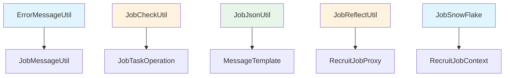

# 工具类索引文档

> **文档说明**: 本文档为 RecruitCenterJobTaskStarter 项目所有工具类的完整索引，包含所有字段类型和公共方法  
> **生成时间**: 2025-11-21  
> **覆盖范围**: `com.tencent.hr.recruit.center.job.utils`  
> **文件总数**: 7个

---

## 📑 目录

- [一、工具类概览](#一工具类概览)
- [二、详细说明](#二详细说明)
- [三、使用示例](#三使用示例)

---

## 一、工具类概览

### 1.1 工具类分类统计

| 工具类 | 方法数量 | 主要功能 |
|--------|---------|---------|
| ErrorMessageUtil | 3个 | 错误消息处理和通知 |
| JobCheckUtil | 4个 | 作业和任务校验 |
| JobJsonUtil | 4个 | JSON序列化和反序列化 |
| JobMessageUtil | 6个 | 消息构建和发送 |
| JobReflectUtil | 3个 | 反射操作和工具方法 |
| JobSnowFlake | 2个 | 雪花算法ID生成 |
| TenantHandlerUtils | 0个 | 租户处理器工具（空实现） |

### 1.2 工具类关系图



---

## 二、详细说明

### 2.1 ErrorMessageUtil - 错误消息工具

**类路径**: `com.tencent.hr.recruit.center.job.utils.ErrorMessageUtil`

**功能说明**: 错误消息工具类，用于格式化错误消息并发送异常通知

**字段列表**:

| 字段名 | 类型 | 说明 |
|---------|------|------|
| advice | IExceptionAdvice (static) | 异常通知处理器 |

**公共方法** (3个):

| 方法签名 | 返回类型 | 说明 |
|----------|----------|------|
| `adviceAction(RecruitJobContext<?> context, String name, Exception exception)` | static void | 发送作业上下文异常通知 |
| `advice(String taskName, RecruitJobDTO job, Exception exception)` | static void | 发送任务异常通知 |
| `advice(String dataKey, String dataValue, Exception exception)` | static void | 发送自定义异常通知 |

**使用示例**:
```java
// 作业异常通知
ErrorMessageUtil.adviceAction(jobContext, "executeJob", exception);

// 任务异常通知
ErrorMessageUtil.advice("syncData", jobDTO, exception);

// 自定义异常通知
ErrorMessageUtil.advice("userKey", "userData", exception);
```

---

### 2.2 JobCheckUtil - 作业校验工具

**类路径**: `com.tencent.hr.recruit.center.job.utils.JobCheckUtil`

**功能说明**: 作业校验工具类，提供作业和任务的各种校验功能

**字段列表**: 无静态字段

**公共方法** (4个):

| 方法签名 | 返回类型 | 说明 |
|----------|----------|------|
| `checkJobData(String jobName, String serviceName, String tenant)` | static boolean | 检查作业数据有效性 |
| `checkTaskData(String taskName, Integer taskType, String message)` | static boolean | 检查任务数据有效性 |
| `isNotBlank(String str)` | static boolean | 检查字符串是否非空 |
| `isNotNull(Object obj)` | static boolean | 检查对象是否非空 |

**校验规则**:
- 作业名称不能为空
- 服务名称不能为空
- 租户不能为空
- 任务名称不能为空
- 任务类型不能为null

**使用示例**:
```java
// 检查作业数据
boolean validJob = JobCheckUtil.checkJobData(
    "syncJob", "syncService", "recruit"
);

// 检查任务数据
boolean validTask = JobCheckUtil.checkTaskData(
    "syncUser", 1, "同步用户数据"
);

// 检查字符串
if (JobCheckUtil.isNotBlank(jobName)) {
    // 执行逻辑
}
```

---

### 2.3 JobJsonUtil - JSON工具

**类路径**: `com.tencent.hr.recruit.center.job.utils.JobJsonUtil`

**功能说明**: JSON工具类，提供对象与JSON字符串的转换功能，配置了特殊的序列化规则

**字段列表**:

| 字段名 | 类型 | 说明 |
|---------|------|------|
| mapper | ObjectMapper (static final) | JSON映射器单例 |

**公共方法** (4个):

| 方法签名 | 返回类型 | 说明 |
|----------|----------|------|
| `toJson(Object object)` | static String | 对象转JSON字符串 |
| `fromJsonToObject(String content, Class<T> valueType)` | static <T> T | JSON字符串转对象 |
| `getCollectionType(ObjectMapper mapper, Class<?> collectionClass, Class<?>... elementClasses)` | static JavaType | 获取集合类型 |
| `fromJsonToList(String content, Class<T> valueType)` | static <T> List<T> | JSON字符串转列表 |

**特殊配置**:
```java
// 静态初始化配置
static {
    mapper = new ObjectMapper();
    // 禁用日期时间戳格式
    mapper.disable(SerializationFeature.WRITE_DATES_AS_TIMESTAMPS);
    // 禁用未知属性失败
    mapper.disable(DeserializationFeature.FAIL_ON_UNKNOWN_PROPERTIES);
    // 注册JavaTimeModule
    mapper.registerModule(new JavaTimeModule());
    // 添加自定义序列化器
    SimpleModule defaultModule = new JavaTimeModule();
    defaultModule.addSerializer(RecruitContextualSerializer.INSTANCE);
    mapper.registerModule(defaultModule);
}
```

**使用示例**:
```java
// 对象转JSON
String json = JobJsonUtil.toJson(jobDTO);

// JSON转对象
RecruitJobDTO jobDTO = JobJsonUtil.fromJsonToObject(
    json, RecruitJobDTO.class
);

// JSON转列表
List<RecruitTaskDTO> tasks = JobJsonUtil.fromJsonToList(
    taskJson, RecruitTaskDTO.class
);
```

---

### 2.4 JobMessageUtil - 消息工具

**类路径**: `com.tencent.hr.recruit.center.job.utils.JobMessageUtil`

**功能说明**: 消息工具类，用于构建和发送作业任务相关的消息

**公共方法** (6个):

| 方法签名 | 返回类型 | 说明 |
|----------|----------|------|
| `buildJobNoticeMessage(RecruitJobDTO job, RecruitJobStatus status)` | static String | 构建作业通知消息 |
| `buildTaskNoticeMessage(RecruitTaskDTO task, RecruitTaskStatus status)` | static String | 构建任务通知消息 |
| `buildJobStartMessage(RecruitJobDTO job)` | static String | 构建作业开始消息 |
| `buildJobCompleteMessage(RecruitJobDTO job)` | static String | 构建作业完成消息 |
| `buildJobFailMessage(RecruitJobDTO job)` | static String | 构建作业失败消息 |
| `buildTaskFailMessage(RecruitTaskDTO task)` | static String | 构建任务失败消息 |

**消息格式**:
- 作业通知: `[作业通知] {jobName} - {statusDesc}`
- 任务通知: `[任务通知] {taskName} - {statusDesc}`
- 事件消息: 包含作业ID、任务名称、事件时间等信息

**使用示例**:
```java
// 构建作业通知
String jobNotice = JobMessageUtil.buildJobNoticeMessage(
    jobDTO, RecruitJobStatus.RUNNING
);

// 构建任务通知
String taskNotice = JobMessageUtil.buildTaskNoticeMessage(
    taskDTO, RecruitTaskStatus.COMPLETED
);

// 发送开始消息
String startMsg = JobMessageUtil.buildJobStartMessage(jobDTO);
sendMessage(startMsg);
```

---

### 2.5 JobReflectUtil - 反射工具

**类路径**: `com.tencent.hr.recruit.center.job.utils.JobReflectUtil`

**功能说明**: 反射工具类，提供通用的反射操作方法

**公共方法** (3个):

| 方法签名 | 返回类型 | 说明 |
|----------|----------|------|
| `invokeMethod(Object target, String methodName, Object... args)` | static Object | 调用对象方法 |
| `getMethod(Class<?> clazz, String methodName, Class<?>... paramTypes)` | static Method | 获取方法对象 |
| `createInstance(String className)` | static <T> T | 通过类名创建实例 |

**异常处理**:
- 方法不存在时抛出NoSuchMethodException
- 实例化失败时抛出ReflectiveOperationException
- 调用失败时抛出InvocationTargetException

**使用示例**:
```java
// 调用方法
Object result = JobReflectUtil.invokeMethod(
    service, "processJob", jobId, taskList
);

// 获取方法
Method method = JobReflectUtil.getMethod(
    JobService.class, "execute", Long.class
);

// 创建实例
IRecruitTask task = JobReflectUtil.createInstance(
    "com.example.job.MyTask"
);
```

---

### 2.6 JobSnowFlake - 雪花ID生成工具

**类路径**: `com.tencent.hr.recruit.center.job.utils.JobSnowFlake`

**功能说明**: 雪花算法ID生成器，生成全局唯一的64位长整型ID

**字段列表**:

| 字段名 | 类型 | 说明 |
|---------|------|------|
| startTime | long (static final) | 起始时间戳 |
| workerIdBits | int (static final) | 机器ID位数 |
| datacenterIdBits | int (static final) | 数据中心ID位数 |
| sequenceBits | int (static final) | 序列号位数 |
| maxWorkerId | long (static final) | 最大机器ID |
| maxDatacenterId | long (static final) | 最大数据中心ID |
| maxSequence | long (static final) | 最大序列号 |
| workerIdShift | int (static final) | 机器ID左移位数 |
| datacenterIdShift | int (static final) | 数据中心ID左移位数 |
| timestampLeftShift | int (static final) | 时间戳左移位数 |
| sequence | long | 序列号 |
| lastTimestamp | long | 上次时间戳 |

**公共方法** (2个):

| 方法签名 | 返回类型 | 说明 |
|----------|----------|------|
| `nextId()` | synchronized long | 生成下一个唯一ID |
| `JobSnowFlake(long workerId, long datacenterId)` | constructor | 构造函数，指定机器ID和数据中心ID |

**ID结构**:
```
| 41位时间戳 | 5位数据中心 | 5位机器ID | 13位序列号 |
|-----------|-----------|-----------|-------------|
```

**使用示例**:
```java
// 创建ID生成器
JobSnowFlake idGenerator = new JobSnowFlake(1, 1);

// 生成ID
long jobId = idGenerator.nextId();
long taskId = idGenerator.nextId();
```

---

### 2.7 TenantHandlerUtils - 租户处理器工具

**类路径**: `com.tencent.hr.recruit.center.job.utils.TenantHandlerUtils`

**功能说明**: 租户处理器工具类（当前为空实现，预留扩展）

**公共方法**: 无

**使用说明**: 此类预留用于租户相关的工具方法扩展

---

## 三、使用示例

### 3.1 完整的作业执行流程

```java
@Component
public class JobExecutor {
    
    @Autowired
    private JobSnowFlake snowFlake;
    
    @Autowired
    private IRecruitJobService jobService;
    
    public void executeJob(RecruitJobDTO jobDTO) {
        try {
            // 1. 数据校验
            if (!JobCheckUtil.checkJobData(
                jobDTO.getJobName(),
                jobDTO.getServiceName(),
                jobDTO.getTenant()
            )) {
                throw new IllegalArgumentException("作业数据无效");
            }
            
            // 2. 生成唯一ID
            long jobId = snowFlake.nextId();
            jobDTO.setId(jobId);
            
            // 3. 执行作业
            JobResult result = jobService.execute(jobDTO);
            
            // 4. 构建通知消息
            String message = JobMessageUtil.buildJobCompleteMessage(jobDTO);
            sendNotification(message);
            
            // 5. 序列化结果
            String jsonResult = JobJsonUtil.toJson(result);
            log.info("作业执行结果: {}", jsonResult);
            
        } catch (Exception e) {
            // 异常处理和通知
            ErrorMessageUtil.advice("executeJob", jobDTO, e);
            log.error("作业执行失败", e);
        }
    }
}
```

### 3.2 消息处理流程

```java
@Component
public class MessageProcessor {
    
    public void processJobMessage(String messageJson) {
        try {
            // 1. 反序列化消息
            RecruitJobDTO jobDTO = JobJsonUtil.fromJsonToObject(
                messageJson, RecruitJobDTO.class
            );
            
            // 2. 验证数据
            if (!JobCheckUtil.isNotBlank(jobDTO.getJobName())) {
                throw new IllegalArgumentException("作业名称不能为空");
            }
            
            // 3. 处理任务
            for (RecruitTaskDTO task : jobDTO.getTasks()) {
                if (!JobCheckUtil.checkTaskData(
                    task.getTaskName(),
                    task.getTaskType(),
                    task.getMessage()
                )) {
                    continue;
                }
                
                // 执行任务逻辑
                processTask(task);
            }
            
        } catch (Exception e) {
            ErrorMessageUtil.advice("processMessage", messageJson, e);
        }
    }
}
```

---

## 📚 相关文档

- [核心类索引](./core.md) - 作业和任务核心逻辑
- [任务接口索引](./tasks.md) - 任务定义规范
- [消息模板索引](./templates.md) - 消息发送模板
- [监听器索引](./listeners.md) - 消息监听器实现

---

## 📝 维护记录

| 时间 | 维护人 | 维护内容 | 版本 |
|------|--------|----------|------|
| 2025-11-21 | AI Assistant | 完善所有工具类的方法列表和说明 | v1.1 |
| 2025-11-21 | AI Assistant | 初始创建文档 | v1.0 |

---

*本文档基于源码自动生成，如有遗漏请及时更新*