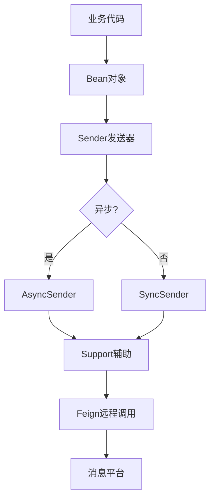
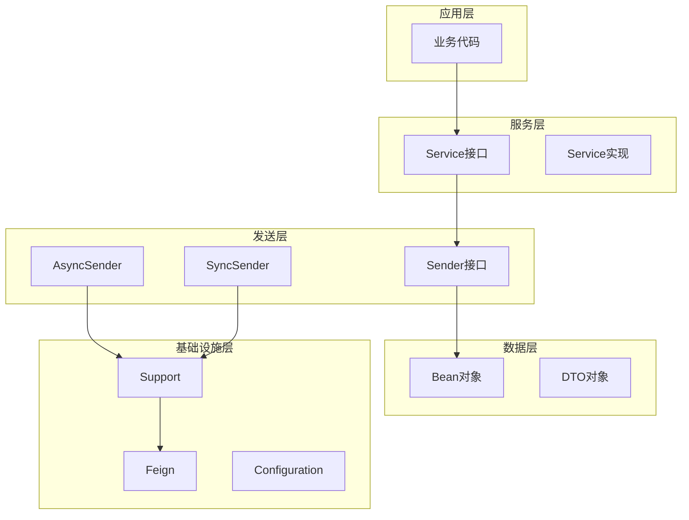

# RecruitCenterMessageStarter 项目知识库索引

> **项目**: 招聘中心消息服务启动器  
> **基础包路径**: `com.tencent.hr.recruit.center.message`  
> **文档总数**: 10个  
> **生成时间**: 2025-11-21  
> **维护状态**: ✅ 活跃维护中

---

## 📖 目录

- [🧭 快速导航](#-快速导航)
- [📊 文档分类索引](#-文档分类索引)
- [📈 统计概览](#-统计概览)
- [🔍 文档使用指南](#-文档使用指南)

---

## 🧭 快速导航

### 🔥 核心文档 (必读)

| 序号 | 文档 | 描述 | 核心指标 |
|------|------|------|----------|
| 1 | [项目结构分析](./project-structure.md) | 项目整体结构概览 | 80个Java文件 |
| 2 | [Bean对象索引](./beans.md) | 消息Bean对象 | 25个Bean |
| 3 | [Sender发送器索引](./senders.md) | 消息发送器 | 19个Sender |
| 4 | [Service服务索引](./services.md) | 服务层 | 9个Service |

### 📦 数据对象文档

| 序号 | 文档 | 描述 | 数量 |
|------|------|------|------|
| 5 | [DTO对象索引](./dto.md) | 数据传输对象 | 13个 |
| 6 | [枚举类索引](./enums.md) | 枚举定义 | 3个 |

### ⚙️ 技术组件文档

| 序号 | 文档 | 描述 | 数量 |
|------|------|------|------|
| 7 | [配置类索引](./configurations.md) | 自动配置类 | 4个 |
| 8 | [Feign接口索引](./feign-interfaces.md) | 远程调用接口 | 2个 |
| 9 | [Support辅助类索引](./support.md) | 辅助支持类 | 3个 |
| 10 | [其他组件索引](./components.md) | 拦截器、常量等 | 2个 |

---

## 📊 文档分类索引

### 1. 核心业务层 (4个文档)

#### 📡 [Bean对象索引](./beans.md)

**文档信息**:
- **包路径**: `com.tencent.hr.recruit.center.message.bean`
- **文件数量**: 25个

**核心内容**:
- 邮件消息Bean (3个): EmailBean, TemplateEmailBean, ScheduleEmailBean
- 短信消息Bean (4个): SmsBean, TemplateSmsBean, OaSmsMsgBean等
- 企业微信Bean (7个): WorkBean, WorkCardBean, WorkChatBean等
- 微信公众号Bean (2个): WechatBean, WechatItemBean
- 机器人消息Bean (3个): XiaotBean, BotTextBean, TestBotMsgEntity
- 功能视图Bean (1个): FunctionViewBean
- 基础Bean (4个): BasicCategoryBean, BasicGroupBean等

**适用场景**: 消息数据封装、消息对象构建

---

#### 📤 [Sender发送器索引](./senders.md)

**文档信息**:
- **包路径**: `com.tencent.hr.recruit.center.message.sender`
- **文件数量**: 19个 (6接口 + 13实现)

**核心内容**:
- 接口层 (6个): RecruitEmailSender, RecruitSmsSender等
- 异步实现 (6个): AsyncEmailSender, AsyncSmsSender等
- 同步实现 (7个): SyncEmailSender, SyncSmsSender等

**适用场景**: 消息发送、异步通知

---

#### 🔧 [Service服务索引](./services.md)

**文档信息**:
- **包路径**: `com.tencent.hr.recruit.center.message.service`
- **文件数量**: 9个 (4接口 + 5实现)

**核心内容**:
- HrMessageService: HR消息服务
- HrAssistantService: HR助手服务
- FunctionViewService: 功能视图服务
- MessageTemplateService: 消息模板服务

**适用场景**: 业务逻辑处理、消息服务调用

---

#### 📋 [DTO对象索引](./dto.md)

**文档信息**:
- **包路径**: `com.tencent.hr.recruit.center.message.dto`
- **文件数量**: 13个

**核心内容**:
- 功能视图DTO (2个)
- 企业微信群DTO (6个)
- 消息聊天DTO (4个)
- 异常通知DTO (1个)

**适用场景**: API数据传输、接口交互

---

### 2. 基础设施层 (6个文档)

#### ⚙️ [配置类索引](./configurations.md)

**文档信息**:
- **包路径**: `com.tencent.hr.recruit.center.message.config/configuration`
- **文件数量**: 4个

**核心内容**:
- AutoMessageConfiguration: 自动配置所有消息发送器
- HrAssistantFeignConfig: HR助手Feign配置
- RecruitEfficiencyFeignConfig: 效率平台Feign配置

**适用场景**: Spring Boot自动配置、Feign配置

---

#### 🌐 [Feign接口索引](./feign-interfaces.md)

**文档信息**:
- **包路径**: `com.tencent.hr.recruit.center.message.feign`
- **文件数量**: 2个

**核心内容**:
- HRAssistantFeign: HR助手远程调用
- RecruitCenterFeign: 招聘中心远程调用

**适用场景**: 远程服务调用、微服务集成

---

#### 🛠️ [Support辅助类索引](./support.md)

**文档信息**:
- **包路径**: `com.tencent.hr.recruit.center.message.support`
- **文件数量**: 3个

**核心内容**:
- TofMessageSupport: TOF消息支持
- HrcTemplateSupport: HRC模板支持
- HrAssistantFeignResultDecoder: Feign结果解码器

**适用场景**: 消息平台集成、模板渲染

---

#### 🔢 [枚举类索引](./enums.md)

**文档信息**:
- **包路径**: `com.tencent.hr.recruit.center.message.enums`
- **文件数量**: 3个

**核心内容**:
- MessageErrorCode: 消息错误码
- ExceptionAdviceLevel: 异常建议级别
- FrameworkRedisKey: Redis键定义

**适用场景**: 常量定义、错误处理

---

#### 🔌 [其他组件索引](./components.md)

**文档信息**:
- **包路径**: `com.tencent.hr.recruit.center.message`
- **文件数量**: 2个

**核心内容**:
- InnerFeignRequestInterceptor: Feign请求拦截器
- MessageConstants: 消息常量

**适用场景**: 拦截器配置、常量使用

---

## 📈 统计概览

### 项目规模统计

```
总文件数: 80个Java文件

核心业务层:
├── Bean对象: 25个 (31.3%)
├── DTO对象: 13个 (16.3%)
├── Sender发送器: 19个 (23.8%)
└── Service服务: 9个 (11.3%)

基础设施层:
├── 配置类: 4个 (5.0%)
├── 枚举类: 3个 (3.8%)
├── Feign接口: 2个 (2.5%)
├── Support辅助: 3个 (3.8%)
└── 其他组件: 2个 (2.5%)
```

### 功能模块统计

```
消息类型分布:
├── 邮件消息: 12个文件
├── 短信消息: 6个文件
├── 企业微信: 15个文件
├── 微信公众号: 3个文件
├── OA消息: 4个文件
├── 应用消息: 4个文件
└── 功能视图: 6个文件
```

---

## 🔍 文档使用指南

### 1. 新人入门路径
1. 先读 [项目结构分析](./project-structure.md) 了解整体架构
2. 再读 [Bean对象索引](./beans.md) 了解消息数据结构
3. 深入 [Sender发送器索引](./senders.md) 理解消息发送机制
4. 按需查阅其他文档

### 2. 日常开发路径
- **发送邮件**: Bean → Sender → Service
- **发送短信**: Bean → Sender → Service
- **企业微信消息**: Bean → Sender → HrAssistantService
- **集成新消息类型**: 参考Bean和Sender文档

### 3. 问题排查路径
- **消息发送失败**: Sender → Support → Feign
- **配置问题**: Configurations → Support
- **数据格式错误**: Bean → DTO → Enums

---

## 📐 架构关系图

### 消息发送流程



### 分层架构



---

*本文档由AI自动生成，最后更新时间: 2025-11-21*
