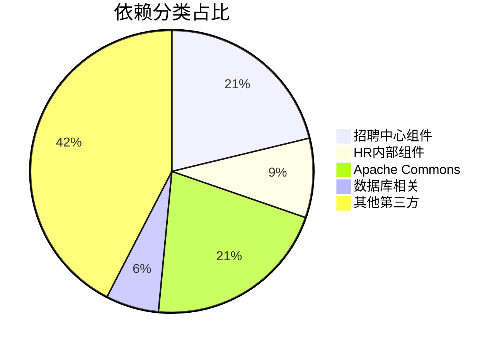
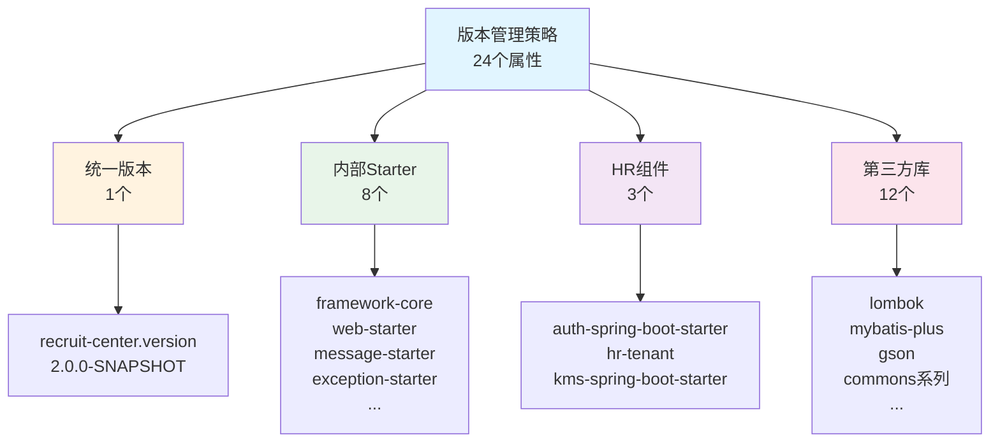
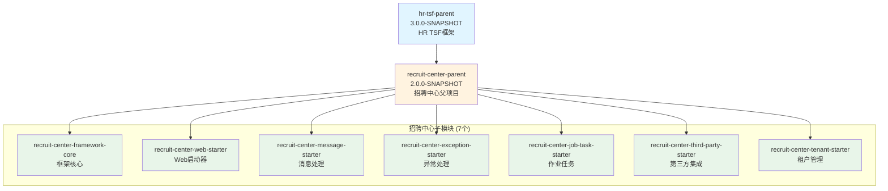
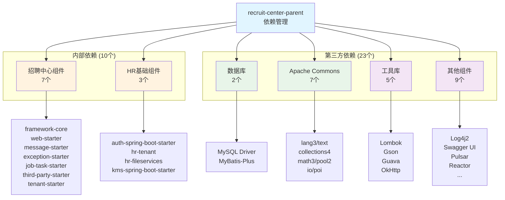

# RecruitCenterParent 项目知识库索引

> **项目**: 招聘中心Maven父项目  
> **ArtifactId**: `recruit-center-parent`  
> **Version**: 2.0.0-SNAPSHOT  
> **Packaging**: pom  
> **文档总数**: 3个  
> **生成时间**: 2025-11-24  
> **维护状态**: ✅ 活跃维护中

---

## 📖 目录

- [🧭 快速导航](#-快速导航)
- [📊 文档分类索引](#-文档分类索引)
- [📈 统计概览](#-统计概览)
- [🔍 文档使用指南](#-文档使用指南)
- [📐 架构关系图](#-架构关系图)
- [📝 维护记录](#-维护记录)

---

## 🧭 快速导航

### 🔥 核心文档 (必读 P0)

| 序号 | 文档 | 描述 | 核心指标 |
|------|------|------|----------|
| 1 | [依赖管理索引](./dependencies.md) | Maven依赖版本统一管理 | 33个依赖 + 24个版本属性 |
| 2 | [项目信息索引](./project-info.md) | 项目基本信息和继承关系 | 继承hr-tsf-parent + 7个子模块 |

---

## 📊 文档分类索引

### 1. 项目配置层 (2个文档)

#### 📦 [依赖管理索引](./dependencies.md)

**文档信息**:
- **文件类型**: Maven POM配置
- **依赖总数**: 33个
- **版本属性**: 24个
- **最后更新**: 2025-11-24

**核心内容**:
- 版本属性管理 (24个属性)
- 内部框架依赖 (10个)
- 第三方依赖 (23个)
- 依赖排除规则 (2处)

**主要分类**:
- 招聘中心框架组件 (7个): framework-core, web-starter, message-starter等
- HR内部基础组件 (3个): auth, hr-tenant, hr-fileservices
- Apache Commons系列 (7个): lang3, text, collections4, math3等
- 数据库相关 (2个): MySQL驱动, MyBatis-Plus
- 其他第三方库 (14个): Lombok, Gson, OkHttp, Pulsar等

**适用场景**: 依赖版本管理、子项目配置、版本升级规划

---

#### 📋 [项目信息索引](./project-info.md)

**文档信息**:
- **文件类型**: 项目元数据
- **子模块数**: 7个 (预期)
- **最后更新**: 2025-11-24

**核心内容**:
- Maven坐标信息
- 项目继承关系
- 子模块列表
- 使用方式说明

**主要功能**:
- 统一依赖版本管理
- 提供统一构建规范
- 集中定义版本属性

**适用场景**: 新建子项目、理解项目结构、配置父子关系

---

## 📈 统计概览

### 项目类型统计

| 组件类型 | 数量 | 说明 |
|---------|------|------|
| **XML文件** | 1个 | pom.xml配置文件 |
| **父项目** | 1个 | hr-tsf-parent |
| **子模块** | 7个 | 招聘中心框架组件 |
| **依赖管理** | 33个 | 统一版本管理 |
| **版本属性** | 24个 | 集中定义 |
| **内部依赖** | 10个 | HR内部组件 |
| **第三方依赖** | 23个 | 开源组件 |

### 依赖分类统计



### 版本管理策略



---

## 🔍 文档使用指南

### 1. 新人入门路径
1. 先读 [README.md](./README.md) 了解整体架构
2. 再读 [项目信息索引](./project-info.md) 理解继承关系
3. 深入 [依赖管理索引](./dependencies.md) 查看具体依赖

### 2. 日常开发路径
- **新建子项目**: 项目信息 → 依赖管理
- **添加新依赖**: 依赖管理 → 版本属性定义
- **版本升级**: 依赖管理 → 版本属性修改

### 3. 问题排查路径
- **版本冲突**: 依赖管理 → 依赖排除规则
- **找不到依赖**: 依赖管理 → 检查是否已定义
- **继承关系问题**: 项目信息 → 继承关系图

---

## 📐 架构关系图

### 项目继承结构



### 依赖管理架构



---

## 📝 维护记录

| 时间 | 维护人 | 维护内容 | 版本 |
|------|--------|----------|------|
| 2025-11-24 | AI Assistant | 初始创建知识库，完整记录依赖管理和项目信息 | v1.0 |

---

## 🔗 相关链接

### 子项目知识库
- [Core项目知识库](../framework-core/README.md)
- [WebStarter项目知识库](../web-starter/README.md)
- [Exception项目知识库](../exception-starter/README.md)
- [JobTask项目知识库](../jobtask-starter/README.md)
- [Message项目知识库](../message-starter/README.md)
- [ThirdParty项目知识库](../thirdparty-starter/README.md)

---

## 💡 使用示例

### 1. 继承父POM

```xml
<parent>
    <groupId>com.tencent.hr</groupId>
    <artifactId>recruit-center-parent</artifactId>
    <version>2.0.0-SNAPSHOT</version>
</parent>
```

### 2. 使用已管理依赖

```xml
<dependencies>
    <!-- 无需指定版本 -->
    <dependency>
        <groupId>com.tencent.hr</groupId>
        <artifactId>recruit-center-framework-core</artifactId>
    </dependency>
    
    <dependency>
        <groupId>org.projectlombok</groupId>
        <artifactId>lombok</artifactId>
    </dependency>
</dependencies>
```

### 3. 覆盖版本

```xml
<properties>
    <lombok.version>1.18.24</lombok.version>
</properties>
```

---

## ⚠️ 重要说明

### 版本管理原则

1. **统一版本**: 所有招聘中心组件使用 `${recruit-center.version}` 统一管理
2. **安全优先**: Log4j2 使用 2.17.0 修复安全漏洞
3. **冲突排除**: 排除 fastjson 和重复的 log4j-to-slf4j

### 依赖使用注意

1. **MySQL驱动**: 8.0.20 版本，注意连接URL格式变化
2. **Commons-Lang3**: 已排除 fastjson，避免安全风险
3. **KMS Starter**: 已排除 log4j-to-slf4j，避免重复依赖

---

**最后更新时间**: 2025-11-24  
**文档版本**: v1.0  
**项目名称**: RecruitCenterParent  
**维护人**: AI Assistant

---

## 📝 更新记录

| 时间 | 维护人 | 更新内容 | 版本 |
|------|--------|----------|------|
| 2025-11-24 | AI Assistant | 创建知识库索引文档 | v1.0 |
| 2025-11-24 | AI Assistant | 创建依赖管理详细文档 | v1.0 |
| 2025-11-24 | AI Assistant | 创建项目信息文档 | v1.0 |

---
