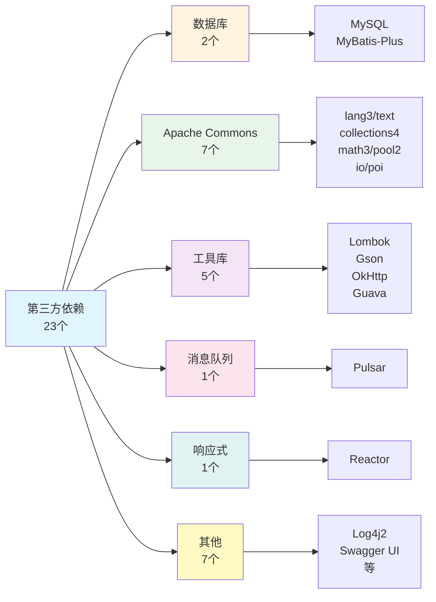

# RecruitCenterParent - 依赖管理索引

> **项目**: 招聘中心Maven父项目  
> **ArtifactId**: `recruit-center-parent`  
> **版本**: 2.0.0-SNAPSHOT  
> **父项目**: hr-tsf-parent (3.0.0-SNAPSHOT)  
> **最后更新**: 2025-11-24

---

## 📖 目录

- [版本属性管理](#-版本属性管理)
- [依赖管理列表](#-依赖管理列表)
- [内部框架依赖](#-内部框架依赖)
- [第三方依赖](#-第三方依赖)
- [统计概览](#-统计概览)

---

## 🔧 版本属性管理

### 1. 核心版本属性

| 属性名 | 版本号 | 说明 |
|--------|--------|------|
| recruit-center.version | 2.0.0-SNAPSHOT | 招聘中心统一版本 |
| hr-tenant.version | 3.0.0-SNAPSHOT | HR租户版本 |
| project.version | 2.0.0-SNAPSHOT | 当前项目版本 |

### 2. 基础工具库版本

| 属性名 | 版本号 | 说明 |
|--------|--------|------|
| lombok.version | 1.18.0 | Lombok工具 |
| mybatis-plus.version | 3.4.2 | MyBatis-Plus |
| gson.version | 2.8.5 | Google Gson |
| guava.version | 30.1-jre | Google Guava |

### 3. Apache Commons 版本

| 属性名 | 版本号 | 说明 |
|--------|--------|------|
| commons-text.version | 1.9 | 文本处理工具 |
| commons-lang3.version | 3.12.0 | 语言工具扩展 |
| commons-math3.version | 3.6 | 数学计算工具 |
| commons-collections4.version | 4.4 | 集合工具 |
| commons-pool2.version | 2.11.0 | 对象池 |
| commons-io.version | 2.4 | IO工具 |

### 4. 其他组件版本

| 属性名 | 版本号 | 说明 |
|--------|--------|------|
| poi.version | 3.17 | Apache POI (Excel处理) |
| mysql-connector-java.version | 8.0.20 | MySQL驱动 |
| swagger-bootstrap-ui.version | 1.9.6 | Swagger UI |
| log4j2.version | 2.17.0 | Log4j2日志 |
| okhttp.version | 3.12.0 | OkHttp客户端 |
| pulsar-java-spring-boot-starter.version | 1.0.7 | Pulsar消息队列 |
| reactor-core.version | 3.4.11 | Reactor响应式编程 |

### 5. 内部Starter版本

所有内部Starter均使用 `${recruit-center.version}` (2.0.0-SNAPSHOT):

| 属性名 | 说明 |
|--------|------|
| recruit-center-framework-core.version | 框架核心 |
| recruit-center-web-starter.version | Web启动器 |
| recruit-center-message-starter.version | 消息启动器 |
| recruit-center-exception-starter.version | 异常处理启动器 |
| recruit-center-job-task-starter.version | 作业任务启动器 |
| recruit-center-third-party-starter.version | 第三方集成启动器 |
| recruit-center-tenant-starter.version | 租户启动器 |
| recruit-center-remote-event-starter.version | 远程事件启动器 |

### 6. HR内部组件版本

| 属性名 | 版本号 | 说明 |
|--------|--------|------|
| auth-spring-boot-starter.version | 1.0.7-SNAPSHOT | 认证启动器 |
| hr-fileservices.version | 2.0.2-SNAPSHOT | 文件服务 |
| kms-spring-boot-starter.version | 3.0.2-SNAPSHOT | 密钥管理服务 |

---

## 📦 依赖管理列表

### 依赖管理统计

- **总依赖数**: 33个
- **内部依赖**: 10个
- **第三方依赖**: 23个
- **排除冲突**: 2处

---

## 🏢 内部框架依赖

### 1. 招聘中心框架组件 (8个)

| GroupId | ArtifactId | Version | 说明 |
|---------|-----------|---------|------|
| com.tencent.hr | recruit-center-framework-core | ${recruit-center-framework-core.version} | 框架核心 |
| com.tencent.hr | recruit-center-web-starter | ${recruit-center-web-starter.version} | Web启动器 |
| com.tencent.hr | recruit-center-message-starter | ${recruit-center-message-starter.version} | 消息启动器 |
| com.tencent.hr | recruit-center-exception-starter | ${recruit-center-exception-starter.version} | 异常处理启动器 |
| com.tencent.hr | recruit-center-job-task-starter | ${recruit-center-job-task-starter.version} | 作业任务启动器 |
| com.tencent.hr | recruit-center-third-party-starter | ${recruit-center-third-party-starter.version} | 第三方集成启动器 |
| com.tencent.hr | recruit-center-tenant-starter | ${recruit-center-tenant-starter.version} | 租户启动器 |

**版本说明**: 所有组件统一使用 `2.0.0-SNAPSHOT` 版本

### 2. HR内部基础组件 (3个)

| GroupId | ArtifactId | Version | 说明 | 备注 |
|---------|-----------|---------|------|------|
| com.tencent.hr | auth-spring-boot-starter | 1.0.7-SNAPSHOT | 认证启动器 | - |
| com.tencent.hr | hr-tenant | 3.0.0-SNAPSHOT | HR租户 | - |
| com.tencent.hr | hr-fileservices-starter | 2.0.2-SNAPSHOT | 文件服务启动器 | - |
| com.tencent.hr | kms-spring-boot-starter | 3.0.2-SNAPSHOT | 密钥管理服务 | 排除log4j-to-slf4j |

---

## 🌐 第三方依赖

### 1. 数据库相关 (2个)

| GroupId | ArtifactId | Version | Scope | 说明 |
|---------|-----------|---------|-------|------|
| mysql | mysql-connector-java | 8.0.20 | runtime | MySQL驱动 |
| com.baomidou | mybatis-plus-boot-starter | 3.4.2 | - | MyBatis-Plus |

### 2. 工具库 (2个)

| GroupId | ArtifactId | Version | 说明 |
|---------|-----------|---------|------|
| org.projectlombok | lombok | 1.18.0 | Lombok |
| com.google.code.gson | gson | 2.8.5 | Google Gson |

### 3. Apache Commons 系列 (6个)

| GroupId | ArtifactId | Version | Scope | 说明 | 备注 |
|---------|-----------|---------|-------|------|------|
| org.apache.commons | commons-pool2 | 2.11.0 | - | 对象池 | - |
| org.apache.poi | poi | 3.17 | compile | Excel处理 | - |
| org.apache.commons | commons-lang3 | 3.12.0 | - | 语言工具 | 排除fastjson |
| org.apache.commons | commons-text | 1.9 | - | 文本处理 | - |
| org.apache.commons | commons-collections4 | 4.4 | - | 集合工具 | - |
| org.apache.commons | commons-math3 | 3.6 | - | 数学计算 | - |
| commons-io | commons-io | 2.4 | - | IO工具 | - |

### 4. 日志组件 (2个)

| GroupId | ArtifactId | Version | 说明 |
|---------|-----------|---------|------|
| org.apache.logging.log4j | log4j-api | 2.17.0 | Log4j2 API |
| org.apache.logging.log4j | log4j-to-slf4j | 2.17.0 | Log4j到SLF4J桥接 |

### 5. 文档和UI (1个)

| GroupId | ArtifactId | Version | 说明 |
|---------|-----------|---------|------|
| com.github.xiaoymin | swagger-bootstrap-ui | 1.9.6 | Swagger UI增强 |

### 6. HTTP客户端 (1个)

| GroupId | ArtifactId | Version | 说明 |
|---------|-----------|---------|------|
| com.squareup.okhttp3 | okhttp | 3.12.0 | OkHttp客户端 |

### 7. 消息队列 (1个)

| GroupId | ArtifactId | Version | 说明 |
|---------|-----------|---------|------|
| io.github.majusko | pulsar-java-spring-boot-starter | 1.0.7 | Pulsar消息队列 |

### 8. 响应式编程 (1个)

| GroupId | ArtifactId | Version | 说明 |
|---------|-----------|---------|------|
| io.projectreactor | reactor-core | 3.4.11 | Reactor响应式核心 |

---

## 📊 统计概览

### 依赖分类统计

| 分类 | 数量 | 占比 |
|------|------|------|
| 招聘中心框架组件 | 7个 | 21.2% |
| HR内部基础组件 | 3个 | 9.1% |
| 数据库相关 | 2个 | 6.1% |
| Apache Commons系列 | 7个 | 21.2% |
| 日志组件 | 2个 | 6.1% |
| 其他第三方库 | 12个 | 36.4% |
| **总计** | **33个** | **100%** |

### 版本管理统计

| 类型 | 数量 |
|------|------|
| 版本属性总数 | 24个 |
| 统一版本依赖 | 7个 (招聘中心组件) |
| 独立版本依赖 | 26个 |

### 依赖排除统计

| 被排除的依赖 | 出现次数 | 原因 |
|-------------|---------|------|
| com.alibaba:fastjson | 1次 | 安全漏洞/版本冲突 |
| org.apache.logging.log4j:log4j-to-slf4j | 1次 | 避免重复依赖 |

---

## 🔗 依赖关系图

### 内部框架依赖结构

```mermaid
graph TB
    A[recruit-center-parent<br/>2.0.0-SNAPSHOT]
    
    subgraph "内部框架组件"
        B1[recruit-center-framework-core]
        B2[recruit-center-web-starter]
        B3[recruit-center-message-starter]
        B4[recruit-center-exception-starter]
        B5[recruit-center-job-task-starter]
        B6[recruit-center-third-party-starter]
        B7[recruit-center-tenant-starter]
    end
    
    subgraph "HR基础组件"
        C1[auth-spring-boot-starter]
        C2[hr-tenant]
        C3[hr-fileservices-starter]
        C4[kms-spring-boot-starter]
    end
    
    A --> B1
    A --> B2
    A --> B3
    A --> B4
    A --> B5
    A --> B6
    A --> B7
    A --> C1
    A --> C2
    A --> C3
    A --> C4
    
    style A fill:#e1f5ff
    style B1 fill:#fff3e0
    style B2 fill:#fff3e0
    style B3 fill:#fff3e0
    style B4 fill:#fff3e0
    style B5 fill:#fff3e0
    style B6 fill:#fff3e0
    style B7 fill:#fff3e0
    style C1 fill:#e8f5e9
    style C2 fill:#e8f5e9
    style C3 fill:#e8f5e9
    style C4 fill:#e8f5e9
```



### 第三方依赖分类



---

## 💡 使用说明

### 1. 继承此父POM

在子项目中使用：

```xml
<parent>
    <groupId>com.tencent.hr</groupId>
    <artifactId>recruit-center-parent</artifactId>
    <version>2.0.0-SNAPSHOT</version>
</parent>
```

### 2. 引用已管理的依赖

无需指定版本：

```xml
<dependencies>
    <dependency>
        <groupId>com.tencent.hr</groupId>
        <artifactId>recruit-center-framework-core</artifactId>
    </dependency>
    
    <dependency>
        <groupId>org.projectlombok</groupId>
        <artifactId>lombok</artifactId>
    </dependency>
</dependencies>
```

### 3. 覆盖版本

在子项目中覆盖：

```xml
<properties>
    <lombok.version>1.18.24</lombok.version>
</properties>
```

---

## ⚠️ 注意事项

### 版本兼容性

1. **Log4j2 安全**: 使用 2.17.0 版本修复安全漏洞
2. **MySQL驱动**: 8.0.20 版本，注意连接参数变化
3. **Commons-Lang3**: 排除了 fastjson 依赖，避免安全风险

### 依赖排除

1. **fastjson**: 在 commons-lang3 中排除，避免安全漏洞
2. **log4j-to-slf4j**: 在 kms-spring-boot-starter 中排除，避免重复

### 统一版本管理

所有招聘中心内部组件统一使用 `${recruit-center.version}` 变量管理，便于统一升级。

---

**最后更新时间**: 2025-11-24  
**文档版本**: v1.0  
**项目名称**: RecruitCenterParent  
**维护人**: AI Assistant
