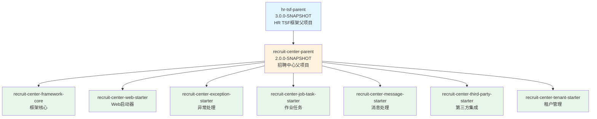

# RecruitCenterParent - 项目信息

> **项目**: 招聘中心Maven父项目  
> **GroupId**: com.tencent.hr  
> **ArtifactId**: recruit-center-parent  
> **Version**: 2.0.0-SNAPSHOT  
> **Packaging**: pom  
> **最后更新**: 2025-11-24

---

## 📖 目录

- [项目基本信息](#-项目基本信息)
- [项目继承关系](#-项目继承关系)
- [项目作用](#-项目作用)
- [子模块列表](#-子模块列表)

---

## 📋 项目基本信息

### Maven坐标

```xml
<groupId>com.tencent.hr</groupId>
<artifactId>recruit-center-parent</artifactId>
<version>2.0.0-SNAPSHOT</version>
<packaging>pom</packaging>
<name>recruit-center-parent</name>
```

### 核心属性

| 属性 | 值 | 说明 |
|------|-----|------|
| modelVersion | 4.0.0 | Maven模型版本 |
| packaging | pom | 项目打包类型（父项目） |
| version | 2.0.0-SNAPSHOT | 当前版本（开发版） |
| name | recruit-center-parent | 项目名称 |

---

## 🔗 项目继承关系

### 父项目

```xml
<parent>
    <groupId>com.tencent.hr</groupId>
    <artifactId>hr-tsf-parent</artifactId>
    <version>3.0.0-SNAPSHOT</version>
</parent>
```

**说明**: 继承自 `hr-tsf-parent` (HR TSF框架父项目)，版本 3.0.0-SNAPSHOT

### 继承关系图



---

## 🎯 项目作用

### 1. 依赖版本统一管理

作为父POM，统一管理所有子项目的依赖版本，包括：
- 招聘中心内部框架组件 (7个)
- HR内部基础组件 (3个)
- 第三方依赖 (23个)

**优势**:
- ✅ 避免版本冲突
- ✅ 简化子项目配置
- ✅ 统一升级管理

### 2. 版本属性集中定义

定义了 24 个版本属性，包括：
- 核心版本 (recruit-center.version)
- 内部Starter版本 (8个)
- 第三方库版本 (15个)

### 3. 提供统一构建规范

虽然没有定义 build 节点，但通过继承 `hr-tsf-parent` 获得统一的构建配置。

---

## 📦 子模块列表

### 招聘中心框架子模块

以下模块应该继承此父项目：

| 序号 | ArtifactId | 说明 | 版本 |
|------|-----------|------|------|
| 1 | recruit-center-framework-core | 框架核心模块 | 2.0.0-SNAPSHOT |
| 2 | recruit-center-web-starter | Web启动器模块 | 2.0.0-SNAPSHOT |
| 3 | recruit-center-message-starter | 消息处理模块 | 2.0.0-SNAPSHOT |
| 4 | recruit-center-exception-starter | 异常处理模块 | 2.0.0-SNAPSHOT |
| 5 | recruit-center-job-task-starter | 作业任务模块 | 2.0.0-SNAPSHOT |
| 6 | recruit-center-third-party-starter | 第三方集成模块 | 2.0.0-SNAPSHOT |
| 7 | recruit-center-tenant-starter | 租户管理模块 | 2.0.0-SNAPSHOT |

**说明**: 所有子模块统一使用 `${recruit-center.version}` 版本号

---

## 🔧 使用方式

### 子项目继承示例

```xml
<project>
    <parent>
        <groupId>com.tencent.hr</groupId>
        <artifactId>recruit-center-parent</artifactId>
        <version>2.0.0-SNAPSHOT</version>
    </parent>
    
    <artifactId>recruit-center-xxx-starter</artifactId>
    <name>Recruit Center XXX Starter</name>
    
    <dependencies>
        <!-- 无需指定版本，由父POM管理 -->
        <dependency>
            <groupId>org.projectlombok</groupId>
            <artifactId>lombok</artifactId>
        </dependency>
        
        <dependency>
            <groupId>com.tencent.hr</groupId>
            <artifactId>recruit-center-framework-core</artifactId>
        </dependency>
    </dependencies>
</project>
```

---

## 📊 统计信息

| 统计项 | 数量 |
|--------|------|
| 父项目数量 | 1个 (hr-tsf-parent) |
| 子模块数量 | 7个 (预期) |
| 依赖管理项 | 33个 |
| 版本属性 | 24个 |
| 内部依赖 | 10个 |
| 第三方依赖 | 23个 |

---

## 🔗 相关链接

### 项目知识库
- [依赖管理索引](./dependencies.md)
- [总索引README](./README.md)

### 子项目知识库
- [Core项目知识库](../framework-core/README.md)
- [WebStarter项目知识库](../web-starter/README.md)
- [Exception项目知识库](../exception-starter/README.md)
- [JobTask项目知识库](../jobtask-starter/README.md)
- [Message项目知识库](../message-starter/README.md)
- [ThirdParty项目知识库](../thirdparty-starter/README.md)

---

**最后更新时间**: 2025-11-24  
**文档版本**: v1.0  
**项目名称**: RecruitCenterParent  
**维护人**: AI Assistant
