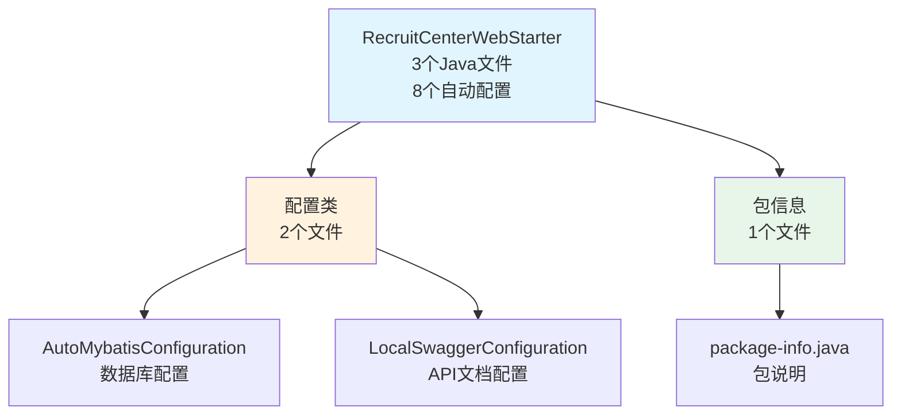
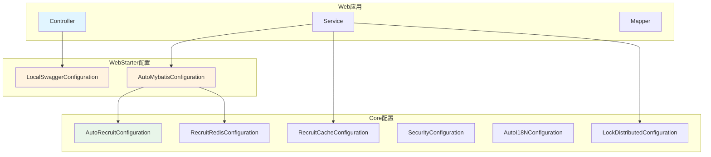
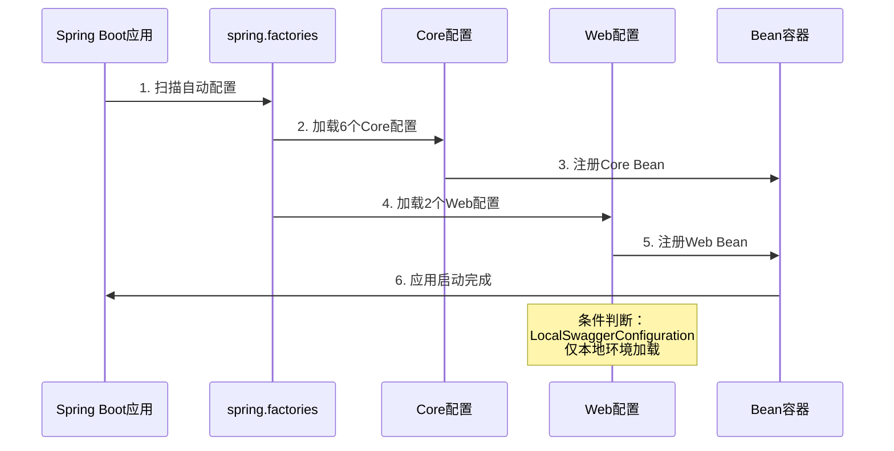

# RecruitCenterWebStarter 项目知识库索引

> **项目**: 招聘中心Web启动器  
> **基础包路径**: `com.tencent.hr.recruit.center.framework.web`  
> **文档总数**: 2个  
> **生成时间**: 2025-11-24  
> **维护状态**: ✅ 活跃维护中

---

## 📖 目录

- [🧭 快速导航](#-快速导航)
- [📊 文档分类索引](#-文档分类索引)
- [📈 统计概览](#-统计概览)
- [🔍 文档使用指南](#-文档使用指南)
- [📐 架构关系图](#-架构关系图)

---

## 🧭 快速导航

### 🔥 核心文档 (必读)

| 序号 | 文档 | 描述 | 核心指标 |
|------|------|------|----------|
| 1 | [配置类索引](./configuration.md) | Web应用配置类 | 2个配置类 + 4个Bean |
| 2 | [Spring自动配置](./spring-factories.md) | Spring Boot自动配置清单 | 8个自动配置类 |

---

## 📊 文档分类索引

### 1. 配置类文档

#### 📡 [配置类索引](./configuration.md)

**文档信息**:
- **包路径**: `com.tencent.hr.recruit.center.framework.web.configuration`
- **配置数量**: 2个
- **最后更新**: 2025-11-24

**核心内容**:
- 2个配置类
- 4个Bean定义
- MyBatis-Plus配置
- Swagger API文档配置

**主要配置**:
- `AutoMybatisConfiguration` - 数据库配置
- `LocalSwaggerConfiguration` - API文档配置

**适用场景**: Web应用配置、数据库操作、API文档生成

---

#### 📋 [Spring自动配置](./spring-factories.md)

**文档信息**:
- **配置文件**: `META-INF/spring.factories`
- **配置数量**: 8个
- **最后更新**: 2025-11-24

**核心内容**:
- 6个Core框架配置
- 2个Web框架配置
- 自动配置加载机制说明

**适用场景**: 了解项目自动配置、Spring Boot启动原理

---

## 📈 统计概览

### 项目组成统计



### 组件类型统计

| 组件类型 | 文件数量 | 核心指标 |
|---------|---------|----------|
| **Java文件** | 3个 | 轻量级Web启动器 |
| **配置类** | 2个 | 4个Bean定义 |
| **自动配置** | 8个 | 6个Core + 2个Web |
| **包结构** | 1个 | 清晰的模块划分 |

### 技术栈统计

| 技术 | 用途 | 说明 |
|------|------|------|
| Spring Boot | 自动配置框架 | 2.x版本 |
| MyBatis-Plus | 数据库操作 | 分页、事务支持 |
| Swagger2 | API文档 | 仅本地环境 |
| TSF Sleuth | 链路追踪 | 微服务追踪 |

---

## 🔍 文档使用指南

### 1. 新人入门路径

1. 先读 [README.md](./README.md) 了解整体架构
2. 再读 [Spring自动配置](./spring-factories.md) 了解配置加载机制
3. 深入 [配置类索引](./configuration.md) 了解具体配置

### 2. 日常开发路径

**配置数据库**:
- 查阅 `AutoMybatisConfiguration` 了解分页配置
- 使用 `@Transactional` 进行事务管理

**配置API文档**:
- 查阅 `LocalSwaggerConfiguration` 了解Swagger配置
- 访问 `/swagger-ui.html` 查看API文档

**添加新配置**:
- 在 `configuration` 包下创建新配置类
- 在 `spring.factories` 中注册配置类

### 3. 问题排查路径

**数据库问题**:
- 检查 `AutoMybatisConfiguration` 是否加载
- 确认 `MybatisPlusInterceptor` Bean是否存在

**API文档问题**:
- 检查环境变量 `tsf_consul_ip=127.0.0.1`
- 确认 `LocalSwaggerConfiguration` 条件是否满足

---

## 📐 架构关系图

### 项目架构视图



### 配置加载流程



---

## 🎯 核心特性

### 1. 轻量级设计

- ✅ 仅3个Java文件
- ✅ 专注于Web应用配置
- ✅ 依赖Core项目提供基础能力

### 2. 自动配置

- ✅ 通过 `spring.factories` 自动加载
- ✅ 零配置启动Web应用
- ✅ 支持条件化配置

### 3. 数据库支持

- ✅ MyBatis-Plus分页拦截器
- ✅ 事务管理自动启用
- ✅ 异步任务支持

### 4. API文档

- ✅ Swagger2自动生成
- ✅ 仅本地环境启用
- ✅ 动态服务名称

---

## 📦 依赖关系

### 项目依赖

```
RecruitCenterWebStarter
├── Spring Boot 2.x (基础框架)
├── MyBatis-Plus 3.x (数据库操作)
├── Swagger2 2.x (API文档)
├── TSF Sleuth (链路追踪)
└── RecruitCenterFrameworkCore (核心框架)
```

### Maven坐标

```xml
<groupId>com.tencent.hr.recruit.center</groupId>
<artifactId>recruit-center-web-starter</artifactId>
<version>1.0.0</version>
```

---

## 💡 使用建议

### 1. 引入依赖

```xml
<dependency>
    <groupId>com.tencent.hr.recruit.center</groupId>
    <artifactId>recruit-center-web-starter</artifactId>
    <version>1.0.0</version>
</dependency>
```

### 2. 启用配置

**自动启用（推荐）**:
- 引入依赖后自动加载所有配置

**手动控制**:
```properties
# 控制Swagger是否启用
tsf_consul_ip=127.0.0.1  # 本地环境启用
tsf_consul_ip=xxx.xxx.xxx.xxx  # 生产环境禁用
```

### 3. 使用示例

**分页查询**:
```java
@Service
public class UserService {
    @Autowired
    private UserMapper userMapper;
    
    public Page<User> listUsers(int page, int size) {
        Page<User> pageParam = new Page<>(page, size);
        return userMapper.selectPage(pageParam, null);
    }
}
```

**事务管理**:
```java
@Service
public class OrderService {
    
    @Transactional(rollbackFor = Exception.class)
    public void createOrder(OrderDTO dto) {
        // 业务逻辑
    }
}
```

---

## 📝 维护记录

| 时间 | 维护人 | 维护内容 | 版本 |
|------|--------|----------|------|
| 2025-11-24 | AI Assistant | 初始创建知识库索引 | v1.0 |

---

## 🔗 相关链接

### 项目相关
- [Core项目知识库](../framework-core/README.md) - 核心框架文档
- [Exception项目知识库](../exception-starter/README.md) - 异常处理文档
- [JobTask项目知识库](../jobtask-starter/README.md) - 作业任务文档

---

**最后更新时间**: 2025-11-24  
**文档版本**: v1.0  
**项目名称**: RecruitCenterWebStarter  
**维护人**: AI Assistant

---

## 📝 更新记录

| 时间 | 维护人 | 更新内容 | 版本 |
|------|--------|----------|------|
| 2025-11-24 | AI Assistant | 创建完整知识库文档 | v1.0 |

---

*本文档由AI自动生成，最后更新时间: 2025-11-24*
