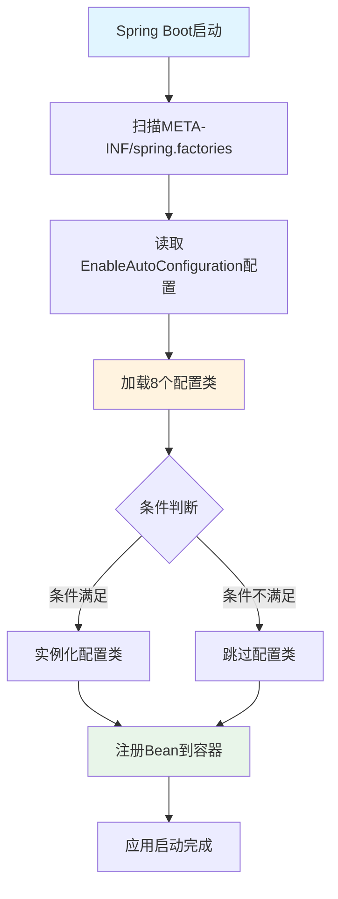
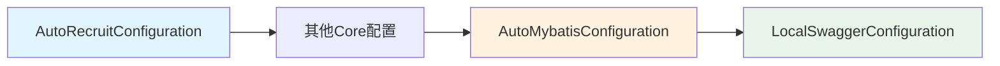

# RecruitCenterWebStarter - Spring自动配置索引

> **文档说明**: 本文档为 `RecruitCenterWebStarter` 项目的Spring Boot自动配置清单  
> **生成时间**: 2025-11-24  
> **配置文件**: `META-INF/spring.factories`  
> **配置总数**: 8个自动配置类

---

## 📑 目录

- [一、自动配置概览](#一自动配置概览)
- [二、配置类清单](#二配置类清单)
- [三、配置加载机制](#三配置加载机制)

---

## 一、自动配置概览

### 1.1 配置文件内容

```properties
# Auto Configure
org.springframework.boot.autoconfigure.EnableAutoConfiguration=\
com.tencent.hr.recruit.center.framework.configuration.AutoRecruitConfiguration,\
com.tencent.hr.recruit.center.framework.configuration.RecruitCacheConfiguration,\
com.tencent.hr.recruit.center.framework.configuration.RecruitRedisConfiguration,\
com.tencent.hr.recruit.center.framework.configuration.SecurityConfiguration,\
com.tencent.hr.recruit.center.framework.configuration.AutoI18NConfiguration,\
com.tencent.hr.recruit.center.framework.configuration.LockDistributedConfiguration,\
com.tencent.hr.recruit.center.framework.web.configuration.AutoMybatisConfiguration,\
com.tencent.hr.recruit.center.framework.web.configuration.LocalSwaggerConfiguration
```

### 1.2 配置分类统计

| 配置类型 | 数量 | 说明 |
|---------|------|------|
| **Core框架配置** | 6个 | 来自Core项目的基础配置 |
| **Web框架配置** | 2个 | WebStarter项目提供的配置 |
| **总计** | **8个** | **所有自动配置** |

---

## 二、配置类清单

### 2.1 Core框架配置类 (6个)

| 序号 | 配置类 | 包路径 | 功能说明 |
|------|--------|---------|---------|
| 1 | AutoRecruitConfiguration | `com.tencent.hr.recruit.center.framework.configuration` | 招聘中心核心自动配置 |
| 2 | RecruitCacheConfiguration | `com.tencent.hr.recruit.center.framework.configuration` | 缓存配置（本地缓存） |
| 3 | RecruitRedisConfiguration | `com.tencent.hr.recruit.center.framework.configuration` | Redis分布式缓存配置 |
| 4 | SecurityConfiguration | `com.tencent.hr.recruit.center.framework.configuration` | 安全配置（认证/授权） |
| 5 | AutoI18NConfiguration | `com.tencent.hr.recruit.center.framework.configuration` | 国际化配置 |
| 6 | LockDistributedConfiguration | `com.tencent.hr.recruit.center.framework.configuration` | 分布式锁配置 |

**说明**: 这些配置类来自 `RecruitCenterFrameworkCore` 项目，作为基础框架能力被自动加载。

---

### 2.2 Web框架配置类 (2个)

| 序号 | 配置类 | 包路径 | 功能说明 |
|------|--------|---------|---------|
| 7 | **AutoMybatisConfiguration** | `com.tencent.hr.recruit.center.framework.web.configuration` | MyBatis-Plus数据库配置 |
| 8 | **LocalSwaggerConfiguration** | `com.tencent.hr.recruit.center.framework.web.configuration` | Swagger API文档配置 |

**说明**: 这些配置类由本项目提供，专门用于Web应用的数据库和API文档支持。

**详细配置说明**:

#### 7. AutoMybatisConfiguration

**核心功能**:
- ✅ MyBatis-Plus分页拦截器
- ✅ Spring事务管理
- ✅ 异步任务支持
- ✅ TSF链路追踪

**提供的Bean**:
- `MybatisPlusInterceptor` - 分页拦截器
- `SpringEventUtil` - Spring事件工具

**激活条件**: 无条件加载

---

#### 8. LocalSwaggerConfiguration

**核心功能**:
- ✅ Swagger2 API文档生成
- ✅ 动态服务名称配置
- ✅ 仅本地环境启用

**提供的Bean**:
- `Docket` - Swagger文档配置对象

**激活条件**: 
```properties
tsf_consul_ip=127.0.0.1
```

---

## 三、配置加载机制

### 3.1 Spring Boot自动配置原理



### 3.2 加载顺序

```
1. Core配置 (6个) - 基础能力
   ├── AutoRecruitConfiguration
   ├── RecruitCacheConfiguration
   ├── RecruitRedisConfiguration
   ├── SecurityConfiguration
   ├── AutoI18NConfiguration
   └── LockDistributedConfiguration

2. Web配置 (2个) - Web能力
   ├── AutoMybatisConfiguration
   └── LocalSwaggerConfiguration
```

### 3.3 配置依赖关系



### 3.4 配置文件位置

```
RecruitCenterWebStarter项目/
└── src/
    └── main/
        └── resources/
            └── META-INF/
                └── spring.factories  ← 自动配置定义文件
```

---

## 📝 维护记录

| 时间 | 维护人 | 维护内容 | 版本 |
|------|--------|----------|------|
| 2025-11-24 | AI Assistant | 初始创建Spring自动配置索引文档 | v1.0 |

---

*本文档由AI自动生成，最后更新时间: 2025-11-24*
