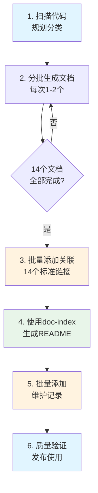
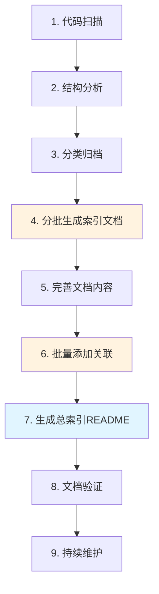
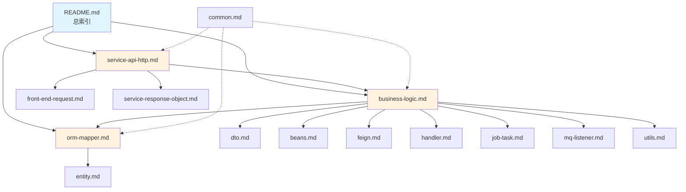
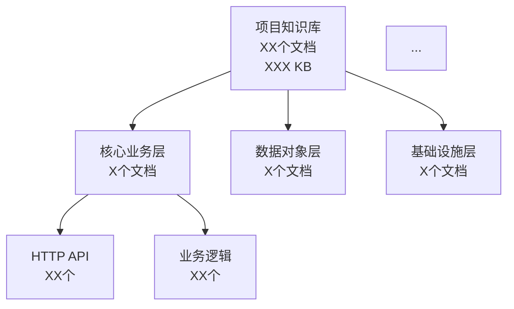
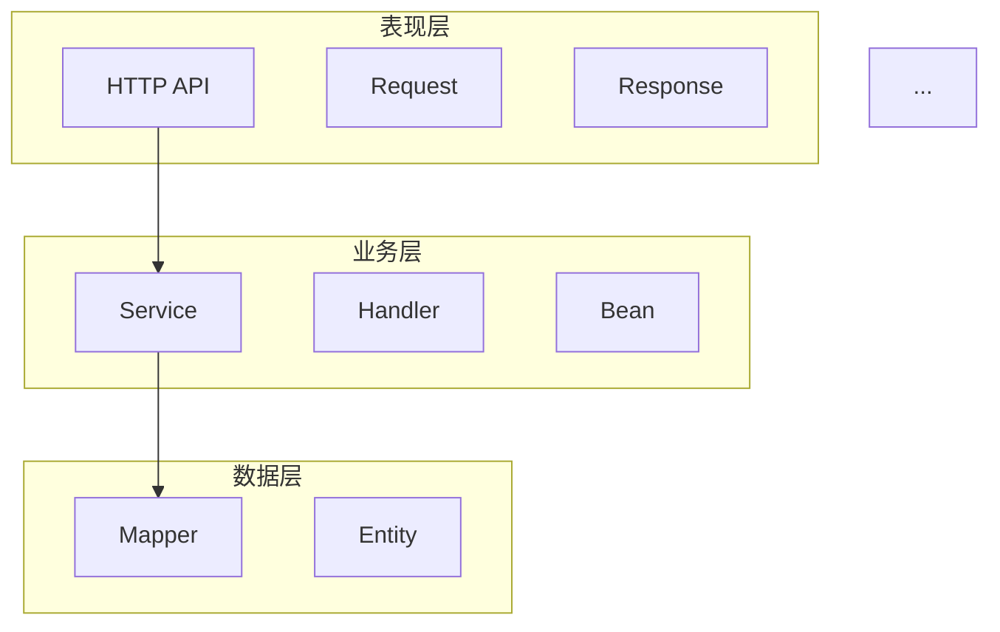
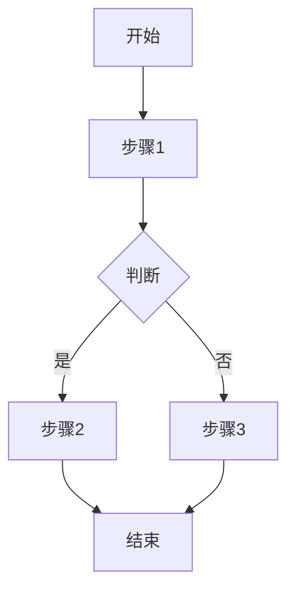
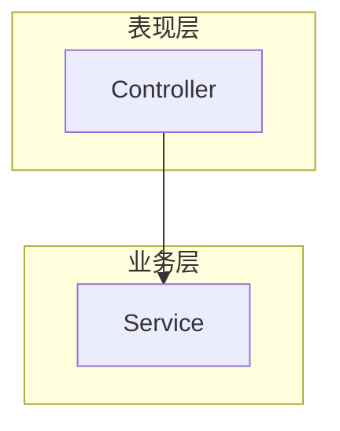
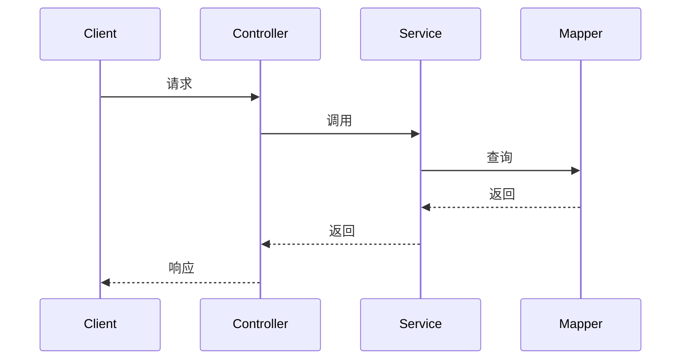

# 项目知识提取最佳实践(AI代码生成指南)

---

**文档版本**：1.1 (AI生成增强版)  
**最后更新**：2025-12-05  
**作者**：johnsonyang  
**适用范围**：遗留系统文档化 + 新项目知识沉淀 + 团队协作知识管理  
**核心目标**：指导AI精准提取和组织项目知识（自下而上方法论）  

**适用场景**：
- ✅ 遗留系统文档化：遵循第一章自下而上方法论
- ✅ 新项目知识沉淀：遵循第二章知识提取整体方法论
- ✅ 团队协作知识管理：遵循第三章知识分类与索引体系

**AI使用指南**：
1. **生成前**：阅读第1.3节自下而上最佳实践流程
2. **生成中**：遵循第四章文档组织结构设计
3. **生成后**：执行第六章知识维护机制
4. **质量验证**：使用第八章实施检查清单

---

## 📋 目录

- [一、为什么采用自下而上](#一为什么采用自下而上)
- [二、知识提取整体方法论](#二知识提取整体方法论)
- [三、知识分类与索引体系](#三知识分类与索引体系)
- [四、文档组织结构设计](#四文档组织结构设计)
- [五、文档标准化规范](#五文档标准化规范)
- [六、知识维护机制](#六知识维护机制)
- [七、工具与自动化](#七工具与自动化)
- [八、实施路径与检查清单](#八实施路径与检查清单)
- [九、常见问题与解决方案](#九常见问题与解决方案)
- [十、成功案例与效果评估](#十成功案例与效果评估)
- [十一、总结与展望](#十一总结与展望)

---

## 一、为什么采用自下而上

### 1.1 理论 vs 实践

#### 理论方法：自顶向下 (Top-Down)

```
README.md (总索引)
    ↓
分类文档 (service-api-http.md, business-logic.md...)
    ↓
详细内容 (类、方法、示例)
```

**优势**:
- ✅ 架构清晰，逻辑完整
- ✅ 先确立框架，再填充细节
- ✅ 符合人类思维习惯

**劣势**:
- ❌ README需要预知所有文档信息
- ❌ 单次生成内容过多，AI易超限
- ❌ 后续文档变更需同步更新README
- ❌ 统计数据需手动计算维护

---

#### 实践方法：自下而上 (Bottom-Up)

```
详细内容 (类、方法、示例)
    ↓
分类文档 (service-api-http.md, business-logic.md...)
    ↓
README.md (使用doc-index技能自动生成)
```

**优势**:
- ✅ 可分批处理，每次任务简单
- ✅ 分类文档独立，互不依赖
- ✅ README自动生成，统计自动计算
- ✅ 避免AI上下文超限问题

**劣势**:
- ❌ 需最后整合，可能遗漏
- ❌ 初期缺少全局视图
- ❌ 需要工具支持 (doc-index技能)

---

### 1.2 为什么必须自下而上

#### 原因1: AI上下文限制

**问题**:
```
单次生成README + 14个分类文档 = 远超AI处理能力
→ 输出不完整 / 信息丢失 / 格式混乱
```

**解决**:
```
分批生成14个分类文档，每次1-2个
→ 每次任务清晰，输出质量高
```

---

#### 原因2: 统计数据难以预知

**问题 (自顶向下)**:
```
先创建README → 需要统计各文档的类数量、方法数量
→ 还未生成分类文档，如何统计？
→ 手动统计易错，后续维护困难
```

**解决 (自下而上)**:
```
先生成分类文档 (已包含统计) → 使用doc-index技能
→ 自动扫描所有文档 → 自动提取统计数据
→ 自动生成README，统计数据准确
```

---

#### 原因3: 文档关联需要全局视角

**问题 (自顶向下)**:
```
生成第1个文档时 → 需要添加相关文档链接
→ 其他13个文档还不存在
→ 无法建立完整关联
```

**解决 (自下而上)**:
```
先生成所有14个分类文档 → 批量添加相关文档节
→ 确保每个文档包含14个标准链接
→ 格式统一，无遗漏
```

---

#### 原因4: 维护一致性

**问题 (逐个生成并添加关联)**:
```
生成文档1 → 手动添加关联 → 格式A
生成文档2 → 手动添加关联 → 格式B (不一致)
生成文档3 → 手动添加关联 → 遗漏部分链接
```

**解决 (批量操作)**:
```
先生成所有文档 → 批量添加关联 → 格式完全统一
→ 使用相同模板，无遗漏
```

---

### 1.3 自下而上的最佳实践流程



**核心要点**:
1. **分批生成** (Step 2): 避免单次任务过大
2. **批量关联** (Step 4): 确保格式统一
3. **工具生成** (Step 5): README自动生成，避免手动维护
4. **后置维护** (Step 6): 统一添加维护记录
5. **⚠️ 完整读取** (关键): 必须完整读取所有源码文件，避免只读取前100-150行

---

## 1.4 关键技术问题：文件读取不完整

### 问题描述
在使用知识抽取技能时，AI经常只读取源码文件的前100-150行，导致：
- 重要方法和业务逻辑遗漏
- 生成的文档信息不完整
- 知识索引质量下降

### 解决方案
**在所有知识抽取技能中强制要求**：
1. **完整读取原则**: 使用 `read_file` 工具时不限制行数
2. **分段读取策略**: 对于超长文件，使用 `offset` 和 `limit` 分段读取
3. **验证机制**: 确保读取到文件末尾，获取完整信息
4. **质量检查**: 扫描质量 = 源码理解完整度

### 已优化的技能
- ✅ `doc-extract-proj-knowledge` - 项目知识抽取
- ✅ `doc-analyze-code` - 代码深度分析  
- ✅ `doc-code2req` - 代码逆向需求推导
- ✅ `code-generation` - 代码生成

---

## 二、知识提取整体方法论

### 1.1 核心原则

#### 分层提取原则
```
表现层(Controller) → 业务层(Service) → 数据层(Mapper/Entity)
      ↓                    ↓                    ↓
   API索引              业务逻辑索引          数据模型索引
```

**关键要点**:
- ✅ 按照代码分层结构组织知识
- ✅ 每层独立成文,便于单独查阅
- ✅ 层与层之间建立关联链接
- ✅ 避免跨层混合,保持职责清晰

#### 自下而上原则 (实际操作)

```
1. 先创建各层级索引 (service-api-http.md, business-logic.md...)
   ↓
2. 逐步完善各分类文档的内容和关联
   ↓
3. 最后使用doc-index技能生成总索引 (README.md)
```

**关键要点**:
- ✅ 从微观到宏观,逐步汇总
- ✅ 分类文档独立生成,互不依赖
- ✅ 总索引基于已有文档自动生成
- ✅ 符合AI工具单次处理能力限制

**理论vs实践对比**:

| 维度 | 理论方法 (自顶向下) | 实践方法 (自下而上) |
|------|-------------------|-------------------|
| **起点** | 总索引README | 各分类文档 |
| **优势** | 架构清晰,逻辑完整 | 可分批处理,单次任务简单 |
| **劣势** | 需要整体规划,AI易超限 | 需最后整合,可能遗漏 |
| **适用** | 小型项目,人工编写 | 大型项目,AI辅助 |

#### 结构化索引原则

**索引维度**:
| 维度 | 说明 | 示例 |
|------|------|------|
| **按分层** | 根据架构分层 | Controller层、Service层、Mapper层 |
| **按功能** | 根据业务模块 | 推荐管理、候选人管理、里程碑 |
| **按类型** | 根据技术类型 | DTO、Entity、Bean、Response |
| **按用途** | 根据使用场景 | HTTP API、Feign接口、MQ监听器 |

---

### 1.2 提取流程

#### 实际操作流程 (自下而上)



**核心要点**:
- 📌 **分批处理**: 每次处理1-2个文档,避免AI上下文超限
- 📌 **独立生成**: 各分类文档可并行或分批生成
- 📌 **后置关联**: 文档生成后统一添加相关文档节
- 📌 **自动汇总**: 使用doc-index技能自动生成总索引

#### 各阶段关键任务

**1️⃣ 代码扫描**
```bash
# 扫描指定包下所有Java文件
find src/main/java/com/company/project -name "*.java"

# 统计各类型文件数量
ls -R | grep -E "\.java$" | wc -l
```

**输出**: 文件清单、包结构树

---

**2️⃣ 结构分析**

**分析维度**:
- 包结构层次
- 类的继承关系
- 接口与实现关系
- 依赖关系
- 注解使用

**工具辅助**:
```java
// 使用 IDE 的类图功能
// 使用 Maven dependency:tree 查看依赖
mvn dependency:tree > dependency.txt
```

---

**3️⃣ 分类归档**

**分类标准** (以Spring Boot项目为例):

| 包路径特征 | 归档类别 | 对应文档 |
|-----------|---------|---------|
| `**.controller` | HTTP API层 | service-api-http.md |
| `**.service` | 业务逻辑层 | business-logic.md |
| `**.mapper` | 数据访问层 | orm-mapper.md |
| `**.entity` | 实体对象 | entity.md |
| `**.dto` | 数据传输对象 | dto.md |
| `**.bean` | 内部传输对象 | beans.md |
| `**.response` | 响应对象 | service-response-object.md |
| `**.request` | 请求对象 | front-end-request.md |
| `**.feign` | 远程调用 | feign.md |
| `**.handler` | 处理器 | handler.md |
| `**.job` | 定时任务 | job-task.md |
| `**.listener` | 消息监听器 | mq-listener.md |
| `**.utils` | 工具类 | utils.md |
| `**.common` | 公共类 | common.md |

---

**4️⃣ 分批生成索引文档**

**生成策略**:

| 批次 | 文档 | 原因 | 优先级 |
|------|------|------|--------|
| **第1批** | service-api-http.md | 对外接口,最常使用 | P0 |
| **第2批** | business-logic.md | 业务核心,最复杂 | P0 |
| **第3批** | orm-mapper.md | 数据访问,基础层 | P0 |
| **第4批** | entity.md, dto.md | 数据对象,常用 | P1 |
| **第5批** | beans.md, service-response-object.md | 数据对象,常用 | P1 |
| **第6批** | front-end-request.md | 请求对象 | P1 |
| **第7批** | feign.md, handler.md | 技术组件 | P2 |
| **第8批** | job-task.md, mq-listener.md | 技术组件 | P2 |
| **第9批** | utils.md, common.md | 工具类 | P2 |

**单次处理建议**:
- ✅ 每次生成1个文档 (大文件如business-logic.md)
- ✅ 每次生成2个文档 (小文件如dto.md + entity.md)
- ✅ 避免一次生成所有文档 (会超出AI上下文限制)

**生成命令示例**:
```
用户: 为service包下的所有类生成业务逻辑层索引文档
AI: [生成business-logic.md]

用户: 为dto包和entity包生成索引文档
AI: [生成dto.md和entity.md]
```

---

**5️⃣ 完善文档内容**

**内容完善检查**:
- [ ] 所有类都已收录
- [ ] 统计数据准确
- [ ] 方法说明完整
- [ ] 代码示例正确
- [ ] 技术说明准确
- [ ] 应用场景明确

**迭代优化**:
```
初稿 → 补充统计 → 添加示例 → 优化结构 → 审查验证
```

---

**6️⃣ 批量添加关联**

**为什么要批量添加**:
- 单个文档生成时无法预知其他文档
- 所有文档生成后才能建立完整关联
- 批量操作确保格式和内容统一

**标准关联节模板**:
```markdown
## 📚 相关文档

- [HTTP API索引](./service-api-http.md) - HTTP接口文档
- [业务逻辑层索引](./business-logic.md) - Service业务逻辑层
- [DTO对象索引](./dto.md) - 请求参数对象
- [Entity对象索引](./entity.md) - 数据库实体
- [Response对象索引](./service-response-object.md) - 响应对象
- [Bean对象索引](./beans.md) - 内部传输对象
- [工具类索引](./utils.md) - 工具类
- [Feign接口索引](./feign.md) - 服务调用接口
- [Handler处理器索引](./handler.md) - 事件处理器
- [Job-Task索引](./job-task.md) - 定时任务与异步任务
- [MQ监听器索引](./mq-listener.md) - 消息队列监听器
- [ORM映射器索引](./orm-mapper.md) - 数据库映射器
- [Common公共类索引](./common.md) - 公共类与配置
- [前端请求对象索引](./front-end-request.md) - 前端请求对象
```

**批量操作命令**:
```
用户: 为所有知识库文档添加相关文档节,包含以上14个标准链接
AI: [批量为所有md文件添加相关文档节]
```

---

**7️⃣ 生成总索引README**

**使用doc-index技能**:
```
用户: 使用doc-index技能为RecruitBoleBusiness_proj项目知识库创建README.md索引
AI: [扫描所有已生成的文档,自动创建总索引]
```

**自动生成内容**:
- ✅ 文档统计信息
- ✅ 快速导航链接
- ✅ 分类索引
- ✅ 架构关系图
- ✅ 使用指南

**优势**:
- 📌 自动聚合所有文档信息
- 📌 统计数据自动计算
- 📌 避免手动维护同步问题

---

**8️⃣ 文档验证**

**8️⃣ 文档验证**

**验证清单**:
- [ ] 所有14个分类文档都已生成
- [ ] 每个文档的统计数量准确
- [ ] 所有文档都添加了相关文档节
- [ ] 文档间链接有效无死链
- [ ] README.md包含所有文档
- [ ] 包路径正确
- [ ] 示例代码正确
- [ ] 格式统一规范
- [ ] Markdown语法正确

**批量验证脚本**:
```bash
# 检查所有md文件是否存在
expected_files=(
    "README.md"
    "service-api-http.md"
    "business-logic.md"
    "orm-mapper.md"
    "entity.md"
    "dto.md"
    "beans.md"
    "service-response-object.md"
    "front-end-request.md"
    "feign.md"
    "handler.md"
    "job-task.md"
    "mq-listener.md"
    "utils.md"
    "common.md"
)

for file in "${expected_files[@]}"; do
    if [ ! -f "kb/$file" ]; then
        echo "❌ 缺失文件: $file"
    else
        echo "✅ 文件存在: $file"
    fi
done
```

---

**9️⃣ 持续维护**

**维护机制**:
```markdown
## 📝 维护记录

| 时间 | 维护人 | 维护内容 | 版本 |
|------|--------|----------|------|
| 2025-11-14 | johnsonyang | 添加XX模块文档 | v1.1 |
| 2025-11-14 | johnsonyang | 初始创建文档 | v1.0 |
```

---

## 三、知识分类与索引体系

### 3.1 标准分类体系

#### Spring Boot项目标准分类 (14个核心维度)

```
知识库根目录 (kb/)
├── README.md                       # 总索引 (必需)
├── service-api-http.md             # 1. HTTP API索引
├── business-logic.md               # 2. 业务逻辑层索引
├── orm-mapper.md                   # 3. ORM映射器索引
├── entity.md                       # 4. 实体对象索引
├── dto.md                         # 5. DTO对象索引
├── beans.md                       # 6. Bean对象索引
├── service-response-object.md     # 7. 响应对象索引
├── front-end-request.md           # 8. 请求对象索引
├── feign.md                       # 9. Feign接口索引
├── handler.md                     # 10. Handler处理器索引
├── job-task.md                    # 11. 定时任务索引
├── mq-listener.md                 # 12. MQ监听器索引
├── utils.md                       # 13. 工具类索引
└── common.md                      # 14. 公共类索引
```

---

### 3.2 索引组织原则

#### 按业务重要性排序

| 优先级 | 文档类型 | 说明 |
|-------|---------|------|
| **P0 (必读)** | service-api-http.md | 系统对外接口,最常使用 |
| **P0 (必读)** | business-logic.md | 核心业务逻辑,最需理解 |
| **P0 (必读)** | orm-mapper.md | 数据访问层,最底层基础 |
| **P1 (常用)** | dto.md, entity.md | 数据对象,开发常用 |
| **P1 (常用)** | service-response-object.md | 响应结构,联调必看 |
| **P2 (参考)** | feign.md, mq-listener.md | 集成接口,按需查看 |
| **P2 (参考)** | utils.md, common.md | 工具和配置,辅助开发 |

---

### 3.3 文档间关联网络

#### 核心关联图



---

## 四、文档组织结构设计

### 4.1 总索引文档结构 (README.md)

#### 标准化模板

```markdown
# [项目名称] 项目知识库索引

> **项目**: 项目中文名称  
> **基础包路径**: `com.company.project`  
> **文档总数**: XX个  
> **生成时间**: YYYY-MM-DD  
> **维护状态**: ✅ 活跃维护中

---

## 📖 目录

- [🧭 快速导航](#-快速导航)
- [📊 文档分类索引](#-文档分类索引)
- [📈 统计概览](#-统计概览)
- [🔍 文档使用指南](#-文档使用指南)
- [📐 架构关系图](#-架构关系图)

---

## 🧭 快速导航

### 🔥 核心文档 (必读 P0)

| 序号 | 文档 | 描述 | 核心指标 |
|------|------|------|----------|
| 1 | [HTTP API索引](./service-api-http.md) | 所有RESTful API接口 | XX个Controller + XX+接口 |
| 2 | [业务逻辑层索引](./business-logic.md) | Service业务逻辑 | XX个接口 + XX个实现 |
| 3 | [ORM映射器索引](./orm-mapper.md) | 数据访问层 | XX个Mapper |

### 📦 数据对象文档 (常用 P1)

| 序号 | 文档 | 描述 | 数量 |
|------|------|------|------|
| 4 | [DTO对象索引](./dto.md) | 数据传输对象 | XX个 |
| 5 | [Entity对象索引](./entity.md) | 数据库实体 | XX个 |
...

### ⚙️ 技术组件文档 (参考 P2)

...

---

## 📊 文档分类索引

### 1. 核心业务层 (X个文档)

#### 📡 [HTTP API索引](./service-api-http.md)

**文档信息**:
- **包路径**: `com.company.project.controller`
- **文件大小**: XX KB
- **最后更新**: YYYY-MM-DD

**核心内容**:
- XX个Controller
- XX+个API接口

**主要功能模块**:
- 模块1 (`/api/module1`)
- 模块2 (`/api/module2`)

**适用场景**: API接口查询、前后端联调、接口文档编写

---

## 📈 统计概览

### 架构分层统计



---

## 🔍 文档使用指南

### 1. 新人入门路径
1. 先读 [README.md](./README.md) 了解整体架构
2. 再读 [HTTP API索引](./service-api-http.md) 了解对外接口
3. 深入 [业务逻辑层索引](./business-logic.md) 理解业务
4. 按需查阅其他文档

### 2. 日常开发路径
- **开发新接口**: HTTP API → Service → Mapper → Entity
- **修改业务逻辑**: Service → DTO/Bean → Mapper
- **联调对接**: HTTP API → Request/Response

### 3. 问题排查路径
- **接口报错**: HTTP API → Service → Feign/MQ
- **数据错误**: Mapper → Entity → SQL
- **业务逻辑错误**: Service → Handler → Job

---

## 📐 架构关系图

### 分层架构视图



---

## 📝 维护记录

| 时间 | 维护人 | 维护内容 | 版本 |
|------|--------|----------|------|
| YYYY-MM-DD | xxx | 初始创建 | v1.0 |
```

---

### 4.2 分类索引文档结构

#### 标准化模板

```markdown
# [模块名称]索引文档

> **文档说明**: 本文档为 `ProjectName` 项目 `module` 包下所有XXX的完整索引  
> **生成时间**: YYYY-MM-DD  
> **覆盖范围**: `com.company.project.module`  
> **文件总数**: XX个

---

## 📑 目录

- [一、架构概览](#一架构概览)
- [二、详细清单](#二详细清单)
- [三、技术架构说明](#三技术架构说明)
- [四、最佳实践建议](#四最佳实践建议)

---

## 一、架构概览

### 1.1 目录结构

```
module/
├── 子模块1 (X个)
│   ├── Class1 - 说明
│   └── Class2 - 说明
└── 子模块2 (X个)
    └── ...
```

### 1.2 按功能分类

| 功能模块 | 文件数量 | 核心功能 |
|---------|---------|---------|
| 模块1 | X | ... |
| 模块2 | X | ... |

---

## 二、详细清单

### 2.1 [类名]

**基本信息**:
- **类路径**: `com.company.project.module.ClassName`
- **文件大小**: X KB
- **继承关系**: `extends XXX implements YYY`

**核心方法** (X个):

| 方法名 | 参数 | 返回类型 | 功能说明 |
|-------|------|---------|---------|
| method1 | type param | ReturnType | 说明 |

**技术特点**:
```java
// 示例代码
@Annotation
public class ClassName {
    // 核心逻辑展示
}
```

**应用场景**:
- 场景1
- 场景2

---

## 三、技术架构说明

### 3.1 核心技术栈
- 技术1: 说明
- 技术2: 说明

### 3.2 设计模式
- 模式1: 应用场景
- 模式2: 应用场景

---

## 四、最佳实践建议

### 4.1 开发规范
```java
// ✅ 推荐做法
public void goodPractice() { ... }

// ❌ 不推荐做法
public void badPractice() { ... }
```

### 4.2 常见问题

**问题1**: 描述
- **原因**: ...
- **解决**: ...

---

## 📚 相关文档

- [文档1](./doc1.md) - 说明
- [文档2](./doc2.md) - 说明

---

## 📝 维护记录

| 时间 | 维护人 | 维护内容 | 版本 |
|------|--------|----------|------|
| YYYY-MM-DD | xxx | 维护内容 | v1.x |
```

---

## 五、文档标准化规范

### 5.1 文件命名规范

#### 命名原则

| 文档类型 | 命名规范 | 示例 |
|---------|---------|------|
| **总索引** | `README.md` | `README.md` |
| **分层索引** | `模块功能-kebab-case.md` | `service-api-http.md` |
| **对象索引** | `对象类型.md` | `dto.md`, `entity.md` |
| **技术组件** | `组件类型.md` | `feign.md`, `mq-listener.md` |

#### 命名规则

```
✅ 推荐:
- service-api-http.md (清晰明确)
- business-logic.md (简洁易懂)
- front-end-request.md (语义清晰)

❌ 不推荐:
- api.md (太宽泛)
- controller文档.md (中英混合)
- Service层.md (空格和大小写)
```

---

### 5.2 Markdown格式规范

#### 标题层级规范

```markdown
# 一级标题 - 文档标题 (每个文档只有1个)
## 二级标题 - 主要章节 (章)
### 三级标题 - 次要章节 (节)
#### 四级标题 - 细分章节 (小节)

❌ 避免使用五级标题及以下 (影响可读性)
```

#### 表格规范

```markdown
# ✅ 推荐: 清晰对齐

| 列名1 | 列名2 | 列名3 |
|------|------|------|
| 内容1 | 内容2 | 内容3 |
| 内容4 | 内容5 | 内容6 |

# ❌ 不推荐: 不对齐

|列名1|列名2|列名3|
|-|-|-|
|内容1|内容2|内容3|
```

#### 代码块规范

```markdown
# ✅ 推荐: 指定语言

```java
public class Example {
    // 代码
}
```

# ❌ 不推荐: 不指定语言

```
public class Example {
    // 代码
}
```
```

#### 列表规范

```markdown
# ✅ 推荐: 统一符号

- 项目1
- 项目2
  - 子项目2.1
  - 子项目2.2

# ❌ 不推荐: 混用符号

- 项目1
* 项目2
  - 子项目2.1
  + 子项目2.2
```

---

### 5.3 内容组织规范

#### 文档头部规范

```markdown
# [文档标题]

> **文档说明**: 一句话说明文档用途  
> **包路径**: `com.company.project.module`  
> **文件总数**: XX个  
> **生成时间**: YYYY-MM-DD  
> **最后更新**: YYYY-MM-DD

---

## 📑 目录

- [章节1](#章节1)
- [章节2](#章节2)

---
```

#### 章节结构规范

**标准章节顺序**:
1. 架构概览 (宏观)
2. 详细清单 (微观)
3. 技术说明 (实现)
4. 最佳实践 (应用)
5. 相关文档 (关联)
6. 维护记录 (元信息)

#### 统计信息规范

```markdown
## 📊 统计概览

| 分类 | 数量 | 说明 |
|------|------|------|
| 接口类 | 39个 | Service接口定义 |
| 实现类 | 42个 | Service接口实现 |
| **总计** | **81个** | **所有文件** |
```

---

### 5.4 图表使用规范

#### Mermaid图表规范

**1. 流程图**
```markdown

```

**2. 层次图**
```markdown

```

**3. 时序图**
```markdown

```

---

### 5.5 超链接规范

#### 内部链接规范

```markdown
# ✅ 推荐: 相对路径

- [业务逻辑层索引](./business-logic.md)
- [DTO对象索引](./dto.md)

# ❌ 不推荐: 绝对路径

- [业务逻辑层索引](/kb/business-logic.md)
```

#### 锚点链接规范

```markdown
# ✅ 推荐: 明确的锚点

## 📊 统计概览
...
[跳转到统计概览](#-统计概览)

# ❌ 不推荐: 模糊的锚点

## 统计
...
[跳转](#统计)
```

---

## 六、知识维护机制

### 6.1 版本管理机制

#### 版本号规范

```
格式: vX.Y.Z

X - 主版本号 (重大变更)
Y - 次版本号 (功能增加/修改)
Z - 修订号 (bug修复/小调整)

示例:
v1.0.0 - 初始版本
v1.1.0 - 添加新模块文档
v1.1.1 - 修正统计数据
v2.0.0 - 重构文档结构
```

#### 维护记录表格

```markdown
## 📝 维护记录

| 时间 | 维护人 | 维护内容 | 版本 |
|------|--------|----------|------|
| 2025-11-17 | zhangsan | 重构文档结构 | v2.0 |
| 2025-11-14 | lisi | 添加相关文档节 | v1.1 |
| 2025-11-14 | johnsonyang | 初始创建文档 | v1.0 |

注意: 按时间倒序排列,最新的在最上面
```

---

### 6.2 文档位置规范

#### 标准文档位置

```markdown
[文档正文内容]
...
(主体内容结束)

---

## 📚 相关文档
[13个文档链接]

---

*本文档由AI自动生成,最后更新时间:YYYY-MM-DD*

---

## 📝 维护记录
[维护记录表格]

---
```

**位置原则**:
1. **相关文档节**: 正文结束后,维护记录之前
2. **维护记录节**: 放在文档最末尾
3. **分割线**: 使用 `---` 分隔不同部分

---

### 6.3 更新触发机制

#### 自动触发场景

| 场景 | 更新内容 | 更新文档 |
|------|---------|---------|
| **新增类/方法** | 添加到对应索引 | 对应分类文档 + README |
| **删除类/方法** | 从索引中移除 | 对应分类文档 + README |
| **重构代码** | 更新类关系和说明 | 相关文档 |
| **修改接口** | 更新API定义 | service-api-http.md |

#### 定期维护计划

```
📅 每周: 检查新增/删除的类
📅 每月: 更新统计数据
📅 每季度: 审查文档准确性
📅 每半年: 重构文档结构
```

---

### 6.4 质量检查清单

#### 文档完整性检查

```markdown
## 📋 文档质量检查清单

### 基础信息
- [ ] 文档标题清晰明确
- [ ] 包路径正确
- [ ] 统计数据准确
- [ ] 生成/更新时间正确

### 内容质量
- [ ] 所有类都已收录
- [ ] 分类合理准确
- [ ] 方法说明完整
- [ ] 代码示例正确
- [ ] 技术说明准确

### 格式规范
- [ ] Markdown语法正确
- [ ] 表格对齐整齐
- [ ] 代码块指定语言
- [ ] 标题层级合理
- [ ] 图表显示正常

### 关联性
- [ ] 相关文档链接完整
- [ ] 内部链接有效
- [ ] 锚点跳转正确
- [ ] 交叉引用准确

### 维护性
- [ ] 维护记录完整
- [ ] 版本号规范
- [ ] 维护人信息正确
- [ ] 位置符合规范
```

---

## 七、工具与自动化

### 7.1 文档生成工具

#### 推荐工具链

| 工具类型 | 推荐工具 | 用途 |
|---------|---------|------|
| **代码扫描** | AI辅助工具 | 自动扫描代码生成索引 |
| **UML生成** | PlantUML, Mermaid | 生成架构图 |
| **Markdown编辑** | Typora, VS Code | 编写和预览 |
| **文档预览** | Markdown Preview | 实时预览效果 |
| **格式检查** | markdownlint | 检查格式规范 |

#### AI辅助生成流程

```
1. 使用doc-analyze-code技能分析代码
   ↓
2. AI自动生成初步索引文档
   ↓
3. 人工审查和调整
   ↓
4. 使用doc-index技能生成总索引
   ↓
5. 批量添加相关文档节
   ↓
6. 统一添加维护记录
```

---

### 7.2 自动化脚本

#### 文档验证脚本

```bash
#!/bin/bash
# 检查所有Markdown文件的链接有效性

echo "检查文档链接..."
for file in kb/*.md; do
    echo "检查文件: $file"
    # 提取所有相对链接
    grep -oP '\[.*?\]\(\./.*?\.md\)' "$file" | while read -r link; do
        # 提取链接路径
        path=$(echo "$link" | grep -oP '(?<=\(\./)[^)]+')
        # 检查文件是否存在
        if [ ! -f "kb/$path" ]; then
            echo "  ❌ 无效链接: $link"
        fi
    done
done
echo "检查完成"
```

#### 统计信息更新脚本

```python
#!/usr/bin/env python3
# 自动更新文档中的统计信息

import os
import re

def count_java_files(directory):
    """统计Java文件数量"""
    count = 0
    for root, dirs, files in os.walk(directory):
        count += len([f for f in files if f.endswith('.java')])
    return count

def update_readme_stats(readme_path, stats):
    """更新README中的统计数据"""
    with open(readme_path, 'r', encoding='utf-8') as f:
        content = f.read()
    
    # 更新统计数据
    content = re.sub(
        r'文件总数\*\*: \d+个',
        f'文件总数**: {stats["total"]}个',
        content
    )
    
    with open(readme_path, 'w', encoding='utf-8') as f:
        f.write(content)

# 使用示例
stats = {
    'total': count_java_files('src/main/java'),
    # 更多统计...
}
update_readme_stats('kb/README.md', stats)
```

---

## 八、实施路径与检查清单

### 8.1 项目启动实施路径

#### 🚀 快速启动 (1-2天) - 自下而上实施

```
Day 1: 分批生成文档
├── 上午 (4小时)
│   ├── [准备阶段] 创建kb目录,扫描代码结构
│   ├── [第1批] 生成 service-api-http.md (P0核心文档)
│   └── [第2批] 生成 business-logic.md (P0核心文档)
├── 下午 (4小时)
│   ├── [第3批] 生成 orm-mapper.md (P0核心文档)
│   ├── [第4批] 生成 entity.md + dto.md (P1数据对象)
│   └── [第5批] 生成 beans.md + service-response-object.md (P1数据对象)

Day 2: 关联与汇总
├── 上午 (4小时)
│   ├── [第6批] 生成 front-end-request.md (P1数据对象)
│   ├── [第7批] 生成 feign.md + handler.md (P2技术组件)
│   ├── [第8批] 生成 job-task.md + mq-listener.md (P2技术组件)
│   └── [第9批] 生成 utils.md + common.md (P2工具类)
└── 下午 (4小时)
    ├── [批量关联] 为所有文档添加"相关文档"节 (统一14个链接)
    ├── [生成总索引] 使用doc-index技能生成README.md
    ├── [批量维护] 为所有文档添加"维护记录"节
    └── [质量检查] 验证文档完整性和链接有效性
```

**关键节点**:
- ⏱️ **第1天**: 完成所有14个分类文档生成
- ⏱️ **第2天上午**: 完成剩余文档 + 批量添加关联
- ⏱️ **第2天下午**: 生成总索引 + 批量维护记录 + 质量检查

**实际操作命令序列**:
```
# Day 1 上午
用户: 为controller包生成HTTP API索引文档
AI: [生成 service-api-http.md]

用户: 为service包生成业务逻辑层索引文档
AI: [生成 business-logic.md]

# Day 1 下午
用户: 为mapper包生成ORM映射器索引文档
AI: [生成 orm-mapper.md]

用户: 为entity包和dto包生成索引文档
AI: [生成 entity.md 和 dto.md]

用户: 为bean包和response包生成索引文档
AI: [生成 beans.md 和 service-response-object.md]

# Day 2 上午
用户: 为request包生成前端请求对象索引文档
AI: [生成 front-end-request.md]

用户: 为feign包和handler包生成索引文档
AI: [生成 feign.md 和 handler.md]

用户: 为job包和listener包生成索引文档
AI: [生成 job-task.md 和 mq-listener.md]

用户: 为utils包和common包生成索引文档
AI: [生成 utils.md 和 common.md]

# Day 2 下午
用户: 为所有知识库文档添加相关文档节,包含14个标准链接
AI: [批量为所有文档添加相关文档节]

用户: 使用doc-index技能为项目知识库创建README.md索引
AI: [扫描所有文档,自动生成README.md]

用户: 为所有文档添加维护记录,维护人为johnsonyang
AI: [批量添加维护记录表格]

用户: 将所有文档的维护记录移动到文件最末尾
AI: [批量调整维护记录位置]
```

#### 📈 完整实施 (1-2周) - 自下而上

```
Week 1: 文档创建 (自下而上)
├── Day 1-2: 核心文档生成
│   ├── 扫描代码,规划分类
│   ├── 分批生成14个分类文档
│   └── 每个文档独立完成,互不依赖
├── Day 3: 批量关联
│   ├── 为所有文档添加"相关文档"节
│   ├── 确保14个标准链接完整
│   └── 验证链接有效性
├── Day 4: 生成总索引
│   ├── 使用doc-index技能生成README.md
│   ├── 自动聚合所有文档信息
│   └── 自动计算统计数据
└── Day 5: 维护与优化
    ├── 批量添加维护记录
    ├── 调整文档结构和位置
    └── 质量检查和格式规范

Week 2: 深化与维护
├── Day 1-2: 内容深化
│   ├── 补充代码示例
│   ├── 添加最佳实践
│   ├── 补充技术说明
│   └── 优化文档结构
├── Day 3-4: 团队审查
│   ├── 团队成员review
│   ├── 收集反馈意见
│   ├── 迭代优化
│   └── 补充遗漏内容
└── Day 5: 发布与培训
    ├── 正式发布文档
    ├── 团队使用培训
    ├── 建立维护机制
    └── 制定更新计划
```

**自下而上 vs 自顶向下对比**:

| 阶段 | 自下而上 (实际) | 自顶向下 (理论) |
|------|----------------|----------------|
| **第1步** | 生成分类文档 | 创建README框架 |
| **第2步** | 批量添加关联 | 生成分类文档 |
| **第3步** | 生成README | 补充细节内容 |
| **第4步** | 质量检查 | 质量检查 |
| **优势** | 可分批,不超限 | 架构清晰 |
| **劣势** | 需后期整合 | AI易超限 |

---

### 8.2 实施检查清单

#### ✅ 启动阶段检查清单

```markdown
## 启动阶段

### 准备工作
- [ ] 创建 kb/ 目录
- [ ] 确定文档分类标准
- [ ] 选择文档生成工具
- [ ] 准备代码扫描工具

### 文档规划
- [ ] 确定文档命名规范
- [ ] 设计文档目录结构
- [ ] 规划文档间关联关系
- [ ] 制定维护机制
```

#### ✅ 创建阶段检查清单 (自下而上)

```markdown
## 创建阶段 (分批生成)

### 第1批: P0核心文档 (必需)
- [ ] 创建 service-api-http.md (对外接口)
- [ ] 创建 business-logic.md (业务逻辑)
- [ ] 创建 orm-mapper.md (数据访问)

### 第2批: P1数据对象 (常用)
- [ ] 创建 entity.md (数据库实体)
- [ ] 创建 dto.md (数据传输对象)
- [ ] 创建 beans.md (内部传输对象)
- [ ] 创建 service-response-object.md (响应对象)
- [ ] 创建 front-end-request.md (请求对象)

### 第3批: P2技术组件 (参考)
- [ ] 创建 feign.md (远程调用)
- [ ] 创建 handler.md (处理器)
- [ ] 创建 job-task.md (定时任务)
- [ ] 创建 mq-listener.md (消息监听)
- [ ] 创建 utils.md (工具类)
- [ ] 创建 common.md (公共类)

### 内容完善 (每个文档)
- [ ] 包路径正确
- [ ] 统计数据准确
- [ ] 所有类都已收录
- [ ] 方法说明完整
- [ ] 代码示例正确
- [ ] 技术说明准确
- [ ] 格式规范统一
```

#### ✅ 关联阶段检查清单 (批量操作)

```markdown
## 关联阶段 (所有分类文档生成后)

### 批量添加相关文档节
- [ ] 确认所有14个分类文档已生成
- [ ] 批量为所有文档添加"相关文档"节
- [ ] 确保每个文档包含14个标准链接
- [ ] 验证链接格式统一 (相对路径 ./xxx.md)
- [ ] 验证链接文本描述一致

### 生成总索引README
- [ ] 使用doc-index技能自动生成
- [ ] 验证文档统计数据准确
- [ ] 验证快速导航链接完整
- [ ] 验证分类索引结构清晰
- [ ] 验证架构关系图显示正常

### 批量添加维护记录
- [ ] 批量为所有文档添加"维护记录"节
- [ ] 维护记录位置统一 (文档末尾)
- [ ] 维护人信息完整准确
- [ ] 版本号规范 (v1.0, v1.1...)
- [ ] 时间格式统一 (YYYY-MM-DD)

### 链接有效性验证
- [ ] 所有相对链接指向正确
- [ ] 内部锚点跳转有效
- [ ] 无死链或404
- [ ] 交叉引用准确
```

#### ✅ 质量检查清单

```markdown
## 质量检查

### 内容质量
- [ ] 文档标题清晰
- [ ] 包路径正确
- [ ] 统计数据准确
- [ ] 分类合理
- [ ] 说明完整

### 格式规范
- [ ] Markdown语法正确
- [ ] 表格对齐
- [ ] 代码块指定语言
- [ ] 标题层级合理
- [ ] 图表显示正常

### 链接有效性
- [ ] 相对链接正确
- [ ] 内部链接有效
- [ ] 锚点跳转正确
- [ ] 无死链

### 可读性
- [ ] 结构清晰
- [ ] 层次分明
- [ ] 易于导航
- [ ] 示例丰富
```

#### ✅ 发布阶段检查清单

```markdown
## 发布阶段

### 发布准备
- [ ] 最终质量检查
- [ ] 文档版本确认
- [ ] 维护记录更新
- [ ] 团队审查通过

### 发布执行
- [ ] 提交到版本控制
- [ ] 通知团队成员
- [ ] 组织使用培训
- [ ] 收集初期反馈

### 发布后
- [ ] 建立维护机制
- [ ] 指定维护负责人
- [ ] 制定更新计划
- [ ] 持续改进
```

---

### 8.3 常见问题与解决方案

#### Q1: 文档数量太多,难以维护?

**解决方案**:
1. **优先级管理**: P0文档每周更新, P1文档每月更新, P2文档按需更新
2. **自动化工具**: 使用脚本自动检查和更新统计信息
3. **责任分工**: 指定文档维护负责人

---

### 9.4 代码变更频繁,文档跟不上?

**解决方案**:
1. **CI/CD集成**: 代码提交时触发文档检查
2. **增量更新**: 只更新变更部分,不全量重写
3. **版本控制**: 文档与代码版本同步

---

### 9.5 团队成员不习惯查阅文档?

**解决方案**:
1. **培训引导**: 组织文档使用培训
2. **工具集成**: 集成到IDE或开发流程
3. **激励机制**: 建立文档贡献激励

---

### 9.6 文档格式不统一?

**解决方案**:
1. **模板规范**: 提供标准文档模板
2. **格式检查**: 使用 markdownlint 等工具
3. **Code Review**: 文档也纳入代码审查

---

## 九、常见问题与解决方案

### 9.1 为什么不能一次性生成所有文档?

**问题描述**:
用户希望一次性生成README + 14个分类文档,但AI输出不完整或报错。

**根本原因**:
- AI单次处理能力有限 (上下文窗口限制)
- 14个文档 + 统计数据 + 关联关系 = 信息量过大
- 超过限制后,AI会截断输出或丢失信息

**解决方案**:
```
采用分批处理:
1. 每次生成1-2个文档
2. 分9批完成14个文档
3. 最后批量添加关联
4. 使用doc-index技能生成README
```

---

### 9.2 为什么README要最后生成?

**问题描述**:
按照常规思维,应该先创建目录(README),再创建内容(分类文档)。

**为什么不行**:
1. **统计数据未知**: 先创建README时,无法知道每个文档有多少个类
2. **手动维护困难**: 后续文档变更,需手动同步更新README统计
3. **易出错**: 手动计算统计数据,容易错误或遗漏

**正确做法**:
```
1. 先生成所有分类文档 (已包含准确统计)
2. 使用doc-index技能扫描所有文档
3. 自动提取统计数据,生成README
4. 统计准确,无需手动维护
```

---

### 9.3 文档数量太多,难以维护?

**解决方案**:
1. **优先级管理**: P0文档每周更新, P1文档每月更新, P2文档按需更新
2. **自动化工具**: 使用脚本自动检查和更新统计信息
3. **责任分工**: 指定文档维护负责人

---

### 9.4 代码变更频繁,文档跟不上?

**解决方案**:
1. **CI/CD集成**: 代码提交时触发文档检查
2. **增量更新**: 只更新变更部分,不全量重写
3. **版本控制**: 文档与代码版本同步

---

### 9.5 团队成员不习惯查阅文档?

**解决方案**:
1. **培训引导**: 组织文档使用培训
2. **工具集成**: 集成到IDE或开发流程
3. **激励机制**: 建立文档贡献激励

---

### 9.6 文档格式不统一?

**解决方案**:
1. **模板规范**: 提供标准文档模板
2. **格式检查**: 使用 markdownlint 等工具
3. **Code Review**: 文档也纳入代码审查

---

## 十、成功案例与效果评估

### 10.1 RecruitBoleBusiness项目实践

#### 项目背景
- **项目规模**: 400+ Java类, 14个主要模块
- **团队规模**: 10+ 开发人员
- **文档目标**: 为遗留系统建立完整知识库

#### 实施过程
**采用自下而上的实施方式**:

1. **Day 1 上午**: 生成P0核心文档 (API/Service/Mapper)
2. **Day 1 下午**: 生成P1数据对象文档 (Entity/DTO/Bean/Response/Request)
3. **Day 2 上午**: 生成P2技术组件文档 (Feign/Handler/Job/MQ/Utils/Common)
4. **Day 2 下午**: 
   - 批量添加相关文档节 (14个标准链接)
   - 使用doc-index技能生成README.md
   - 批量添加维护记录
   - 调整文档结构优化

#### 关键成功因素

**1. 分批处理** ✅
- 每次处理1-2个文档
- 避免AI上下文超限
- 单次任务简单明确

**2. 先细节后汇总** ✅
- 先完成所有分类文档
- 再批量建立关联
- 最后生成总索引

**3. 批量操作** ✅
- 统一添加相关文档节
- 统一添加维护记录
- 统一调整文档结构

**4. 工具辅助** ✅
- 使用doc-index技能自动生成README
- AI批量处理重复任务
- 脚本验证文档完整性

#### 最终成果
- ✅ **14个完整文档**: 覆盖所有核心模块
- ✅ **200+ 类索引**: 所有类都有清晰说明
- ✅ **统一格式**: 所有文档遵循统一规范
- ✅ **完善关联**: 文档间互相链接,导航清晰
- ✅ **可视化**: 使用Mermaid图表展示架构

#### 效果评估

| 指标 | 实施前 | 实施后 | 提升 |
|------|-------|-------|------|
| **新人上手时间** | 2-3周 | 3-5天 | ↓ 70% |
| **代码理解效率** | 需要反复问人 | 自主查阅文档 | ↑ 80% |
| **知识传承** | 依赖口头传授 | 文档化沉淀 | ↑ 100% |
| **开发效率** | 频繁查找代码 | 快速定位 | ↑ 50% |

---

### 10.2 其他项目类型适配

#### 前端Vue项目

```
kb/
├── README.md                    # 总索引
├── components.md                # 组件索引
├── views.md                     # 页面索引
├── router.md                    # 路由索引
├── store.md                     # 状态管理索引
├── api.md                       # API调用索引
├── utils.md                     # 工具函数索引
├── hooks.md                     # Hooks索引
├── directives.md                # 指令索引
└── filters.md                   # 过滤器索引
```

#### 微服务项目

```
kb/
├── README.md                    # 总索引
├── service-registry.md          # 服务注册中心
├── api-gateway.md               # API网关
├── user-service.md              # 用户服务
├── order-service.md             # 订单服务
├── payment-service.md           # 支付服务
├── message-queue.md             # 消息队列
├── distributed-transaction.md   # 分布式事务
└── monitoring.md                # 监控告警
```

---

## 十一、总结与展望

### 11.1 核心要点回顾

#### 实际操作：自下而上流程
```
分批生成分类文档 (14个) → 批量添加关联 (14个链接) → 
生成总索引 (README.md) → 批量添加维护记录 → 质量验证
```

#### 三大核心原则
1. **分层提取**: 按架构分层组织知识
2. **自下而上**: 从分类文档到总索引 (实际操作)
3. **批量处理**: 统一操作确保一致性

#### 五个关键步骤
1. 代码扫描 → 结构分析
2. 分批生成 → 分类文档 (重点!)
3. 批量关联 → 添加链接 (重点!)
4. 生成总索引 → README.md (使用工具!)
5. 持续维护

#### 十四个标准文档
```
分类文档(14个): 
API → Service → Mapper → Entity → DTO → Bean → 
Response → Request → Feign → Handler → Job → 
MQ → Utils → Common

总索引(1个):
README (最后使用doc-index技能生成)
```

#### 核心经验教训

**✅ 应该做的**:
1. 分批处理,避免单次任务过大
2. 先完成分类文档,再建立关联
3. 使用doc-index技能自动生成README
4. 批量操作确保格式统一
5. 维护记录放在文档末尾

**❌ 不应该做的**:
1. ~~一次性生成所有文档~~ (AI会超限)
2. ~~先创建README再生成分类文档~~ (难以维护同步)
3. ~~手动创建README~~ (统计易错,维护困难)
4. ~~单独为每个文档添加关联~~ (格式不统一)
5. ~~维护记录放在文档头部~~ (影响阅读)

---

### 11.2 进阶方向

#### 1. 知识图谱构建
- 自动提取类间依赖关系
- 构建知识关联网络
- 可视化展示知识图谱

#### 2. 智能文档生成
- AI自动生成文档
- 自动更新统计信息
- 智能检测文档过期

#### 3. 交互式文档
- 集成代码搜索
- 在线运行示例
- 实时更新文档

---

## 📚 相关文档

本文档作为项目知识提取的最佳实践总结,建议与以下文档配合使用:

- [README.md](./README.md) - 项目知识库总索引
- [service-api-http.md](./service-api-http.md) - HTTP API索引示例
- [business-logic.md](./business-logic.md) - 业务逻辑层索引示例

---

## 📝 维护记录

| 时间 | 维护人 | 维护内容 | 版本 |
|------|--------|----------|------|
| 2025-11-17 | johnsonyang | 调整为自下而上流程,新增第一章 | v1.1 |
| 2025-11-17 | johnsonyang | 初始创建最佳实践文档 | v1.0 |

---

**文档结束** | 通用项目知识提取最佳实践 | 适用于各类软件项目的知识管理

---
