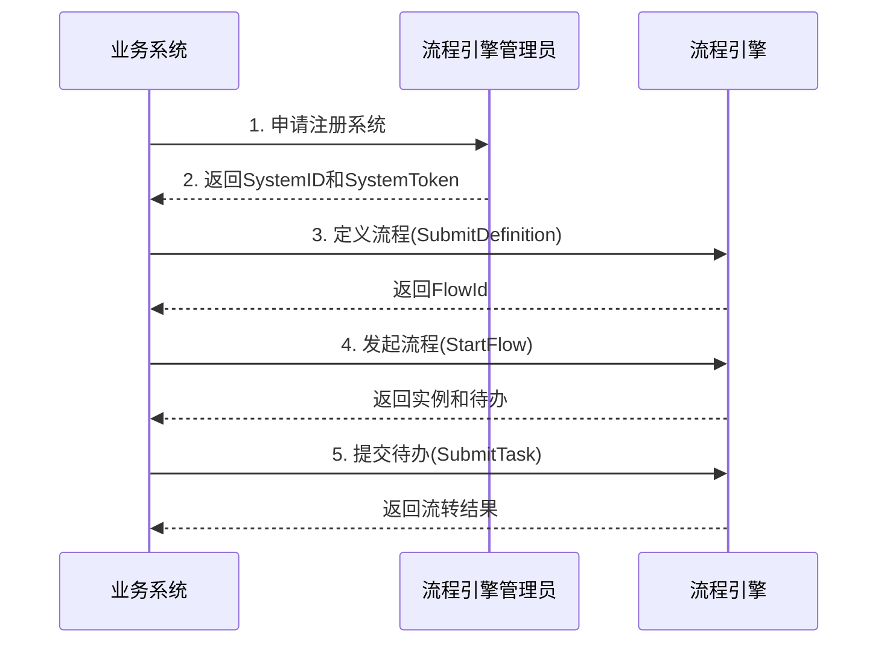

# HR云流程引擎接口文档

## 1. 基础信息层

- **服务名称**: HR云流程引擎 (HR Cloud Flow Engine)
- **所属模块**: hrflow-cloud-api
- **版本信息**: V2版本 (当前版本，推荐使用)
- **负责人/维护者**: HR云流程引擎团队
- **状态标识**: 生产环境稳定运行，推荐使用V2版本
- **API路径前缀**: `/api/v2/FlowEngine/`

## 2. 功能概述层

- **核心职责**: 提供统一的云流程引擎服务，支持流程定义、发起、审批、流转、驳回等全生命周期管理
- **使用场景**: 
  - 企业审批流程管理（请假、报销、采购等）
  - 多级审批流转控制
  - 流程状态跟踪与监控
  - 待办事项管理和协同处理
- **设计目的**: 将流程流转逻辑与业务系统解耦，提供标准化的流程引擎能力，简化业务开发
- **业务价值**: 降低业务系统流程开发成本，统一流程管理，提供可视化流程设计和监控能力

## 3. 快速开始

### 3.1 接入流程



### 3.2 最简示例

以下是一个完整的请假流程示例：

**步骤1: 定义流程**

```bash
curl -X POST 'http://srv.hrflowengine.prodihrtas.com/api/v2/FlowEngine/SubmitDefinition' \
  -H 'Content-Type: application/json' \
  -H 'hr-flow-systemid: 270' \
  -H 'hr-flow-staffid: 1000' \
  -H 'hr-flow-staffname: admin' \
  -H 'hr-flow-timestamp: 1699999999' \
  -H 'hr-flow-signature: <计算的签名>' \
  -d '{
  "flowId": 0,
  "flowName": "请假流程",
  "sysId": 270,
  "sysName": "人力系统",
  "nodes": {
    "1": {"id": 1, "name": "开始", "type": "start round"},
    "2": {"id": 2, "name": "上级审批", "type": "task", "handleName": "1001-张三;1002-李四"},
    "3": {"id": 3, "name": "结束", "type": "end round"}
  },
  "lines": {
    "1": {"id": 1, "from": 1, "to": 2, "name": "提交"},
    "2": {"id": 2, "from": 2, "to": 3, "name": "通过"}
  }
}'
```

**步骤2: 发起流程**

```bash
curl -X POST 'http://srv.hrflowengine.prodihrtas.com/api/v2/FlowEngine/StartFlow' \
  -H 'Content-Type: application/json' \
  -H 'hr-flow-systemid: 270' \
  -H 'hr-flow-staffid: 1000' \
  -H 'hr-flow-staffname: 王五' \
  -H 'hr-flow-timestamp: 1699999999' \
  -H 'hr-flow-signature: <计算的签名>' \
  -d '{
  "Command": "StartAndSubmit",
  "InstanceName": "王五的请假申请",
  "FlowDefId": 3,
  "FormData": {
    "leaveType": "年假",
    "startDate": "2023-12-01",
    "endDate": "2023-12-03",
    "days": 3,
    "reason": "回家探亲"
  },
  "HandlerStaffId": 1000,
  "HandlerStaffName": "王五"
}'
```

**步骤3: 审批待办**

```bash
curl -X POST 'http://srv.hrflowengine.prodihrtas.com/api/v2/FlowEngine/SubmitTask' \
  -H 'Content-Type: application/json' \
  -H 'hr-flow-systemid: 270' \
  -H 'hr-flow-staffid: 1001' \
  -H 'hr-flow-staffname: 张三' \
  -H 'hr-flow-timestamp: 1699999999' \
  -H 'hr-flow-signature: <计算的签名>' \
  -d '{
  "Command": "Submit",
  "InstanceId": 52,
  "ActivityName": "上级审批",
  "TaskId": 55,
  "HandlerId": 57,
  "HandlerStaffId": 1001,
  "HandlerStaffName": "张三",
  "Comment": "同意请假",
  "TaskResultTypeId": 100,
  "TaskResultTypeName": "通过"
}'
```

## 4. 依赖关系层

### 4.1 上游依赖

**系统注册**:
- 接入前需联系流程引擎管理员注册业务系统
- 获取凭证: **SystemID** (系统唯一标识ID) 和 **SystemToken** (系统签名密钥)
- SystemToken需妥善保管，不可泄露

### 4.2 环境依赖

**OA环境地址**:

| 环境 | 基础地址 |
|------|----------|
| 测试环境 | http://demo.ntsgw.oa.com/api/pub/FlowEngineService |
| 生产环境 | http://api.hrflow.oa.com:18805/api/v2/FlowEngine |

**公有云环境地址**:

| 环境 | 基础地址 |
|------|----------|
| 测试环境 | http://srv.hrflowengine.testihrtas.com:18811 |
| UAT环境 | http://srv.hrflowengine.uatihrtas.com |
| 生产环境 | http://srv.hrflowengine.prodihrtas.com |

**API完整路径格式**: `{基础地址}/api/v2/FlowEngine/{接口名称}`

**示例**:
- 测试环境发起流程: `http://srv.hrflowengine.testihrtas.com:18811/api/v2/FlowEngine/StartFlow`
- 生产环境提交流程: `http://srv.hrflowengine.prodihrtas.com/api/v2/FlowEngine/SubmitTask`

### 4.3 鉴权依赖

**HTTP请求头配置**:

所有API请求必须包含以下自定义请求头：

| 请求头名称 | 说明 | 是否必填 |
|-----------|------|---------| 
| hr-flow-systemid | 注册系统唯一标识ID | 是 |
| hr-flow-staffid | 当前请求的人员ID | 是 |
| hr-flow-staffname | 当前请求的人员名称（建议URLENCODE编码） | 是 |
| hr-flow-timestamp | 当前请求的时间戳（精确到秒） | 是 |
| hr-flow-signature | 数字签名 | 是 |

**签名算法** (SHA256):

```go
content := hr-flow-systemid + systemToken + hr-flow-staffid + hr-flow-timestamp + msg
calculator := sha256.New()
calculator.Write([]byte(content))
signature := hex.EncodeToString(calculator.Sum(nil))
```

**参数说明**:
- `systemToken`: 系统注册时流程引擎分配的TOKEN
- `msg`: POST请求的JSON消息体；GET请求为空字符串`""`

**签名计算示例** (Java):

```java
public class FlowEngineSignature {
    
    public static String calculateSignature(String systemId, String systemToken, 
                                           String staffId, long timestamp, String body) {
        String content = systemId + systemToken + staffId + timestamp + body;
        return DigestUtils.sha256Hex(content);
    }
    
    public static void main(String[] args) {
        String systemId = "270";
        String systemToken = "your-secret-token";
        String staffId = "1000";
        long timestamp = System.currentTimeMillis() / 1000;
        String body = "{\"Command\":\"StartAndSubmit\"}";
        
        String signature = calculateSignature(systemId, systemToken, staffId, timestamp, body);
        System.out.println("Signature: " + signature);
    }
}
```

## 5. 接口定义层

### 5.1 流程定义管理

#### 5.1.1 定义流程

**接口名称**: `SubmitDefinition`

**接口地址**: `POST /api/v2/FlowEngine/SubmitDefinition`

**功能说明**: 创建或更新流程定义

**请求参数**:

```typescript
interface SubmitDefinitionRequest {
  flowId: number;           // 流程ID（0表示新建，非0表示更新），必填
  flowName: string;         // 流程名称，必填
  sysId: number;            // 系统ID，必填
  sysName: string;          // 系统名称，必填
  corpId?: string;          // 租户ID，可选
  nodes: Record<string, ActivityNode>;  // 流程节点集合，必填
  lines: Record<string, TransitionLine>; // 流转线集合，必填
  initNum?: number;         // 初始编号，可选
}

interface ActivityNode {
  id: number;               // 节点ID，必填
  name: string;             // 节点名称，必填
  type: string;             // 节点类型，必填
                            // "start round" = 开始节点
                            // "task" = 处理节点
                            // "end round" = 结束节点
  handleName?: string;      // 处理人员（格式：staffId-staffName，多个用分号分隔）
  roleId?: string;          // 字段属性方案（格式：form.字段名）
  taskItem?: string;        // API接口方案（回调参数）
  taskJson?: string;        // 保留字段
  left: number;             // 节点X坐标，必填
  top: number;              // 节点Y坐标，必填
  marked: boolean;          // 是否标记，必填
}

interface TransitionLine {
  id: number;               // 流转线ID，必填
  name: string;             // 流转名称，必填
  type: string;             // 固定值："line"，必填
  from: number;             // 源节点ID，必填
  to: number;               // 目标节点ID，必填
  condition?: string;       // 流转条件（form.字段表达式），可选
  marked: boolean;          // 是否标记，必填
}
```

**请求示例**:

```json
{
  "flowId": 0,
  "flowName": "请假流程",
  "sysId": 270,
  "sysName": "人力系统",
  "corpId": "",
  "nodes": {
    "1": {
      "id": 1,
      "name": "开始",
      "type": "start round",
      "handleName": "",
      "roleId": "",
      "taskItem": "",
      "taskJson": "",
      "left": 100,
      "top": 100,
      "marked": false
    },
    "2": {
      "id": 2,
      "name": "上级审批",
      "type": "task",
      "handleName": "1001-张三;1002-李四",
      "roleId": "",
      "taskItem": "",
      "taskJson": "",
      "left": 200,
      "top": 100,
      "marked": false
    },
    "3": {
      "id": 3,
      "name": "结束",
      "type": "end round",
      "handleName": "",
      "roleId": "",
      "taskItem": "",
      "taskJson": "",
      "left": 300,
      "top": 100,
      "marked": false
    }
  },
  "lines": {
    "1": {
      "id": 1,
      "name": "提交",
      "type": "line",
      "from": 1,
      "to": 2,
      "condition": "",
      "marked": false
    },
    "2": {
      "id": 2,
      "name": "通过",
      "type": "line",
      "from": 2,
      "to": 3,
      "condition": "",
      "marked": false
    }
  },
  "initNum": 10
}
```

**响应格式**:

```typescript
interface SubmitDefinitionResponse {
  StatusCode: number;       // 状态码（200=成功）
  Data: {
    flowId: number;         // 流程ID
    flowName: string;       // 流程名称
    message: string;        // 提示信息
  };
}
```

**响应示例**:

```json
{
  "StatusCode": 200,
  "Data": {
    "flowId": 3,
    "flowName": "请假流程",
    "message": "流程定义成功"
  }
}
```

#### 5.1.2 获取流程定义列表

**接口名称**: `GetFlowDefinitionBySystemId`

**接口地址**: `GET /api/v2/FlowEngine/GetFlowDefinitionBySystemId`

**功能说明**: 获取指定系统下的所有流程定义

**请求参数**: 通过Header头中的`hr-flow-systemid`获取系统ID

**响应格式**:

```typescript
interface FlowDefinitionListResponse {
  StatusCode: number;
  Data: FlowDefinition[];
}

interface FlowDefinition {
  FlowId: number;           // 流程定义ID
  FlowName: string;         // 流程名称
  SystemId: number;         // 所属系统ID
  SystemName: string;       // 系统名称
  EnableFlag: number;       // 启用标识（1=启用, 0=禁用）
  CreateTime: string;       // 创建时间
  UpdateTime: string;       // 更新时间
}
```

**响应示例**:

```json
{
  "StatusCode": 200,
  "Data": [
    {
      "FlowId": 3,
      "FlowName": "请假流程",
      "SystemId": 270,
      "SystemName": "人力系统",
      "EnableFlag": 1,
      "CreateTime": "2023-01-01 10:00:00",
      "UpdateTime": "2023-06-01 15:30:00"
    },
    {
      "FlowId": 5,
      "FlowName": "报销流程",
      "SystemId": 270,
      "SystemName": "人力系统",
      "EnableFlag": 1,
      "CreateTime": "2023-02-01 10:00:00",
      "UpdateTime": "2023-05-01 12:00:00"
    }
  ]
}
```

#### 5.1.3 获取流程定义详情

**接口名称**: `GetDefinitionByDefId`

**接口地址**: `GET /api/v2/FlowEngine/GetDefinitionByDefId?flowId={flowId}`

**功能说明**: 获取流程定义的完整配置信息

**请求参数**:

| 参数名 | 类型 | 必填 | 说明 |
|--------|------|------|------|
| flowId | int64 | 是 | 流程定义ID |

**响应格式**: 返回完整的流程定义JSON，包含nodes和lines配置

### 5.2 流程实例操作

#### 5.2.1 发起流程

**接口名称**: `StartFlow`

**接口地址**: `POST /api/v2/FlowEngine/StartFlow`

**功能说明**: 创建并发起一个新的流程实例

**请求参数**:

```typescript
interface StartFlowRequest {
  Command: "StartAndSubmit";    // 固定值，必填
  InstanceName: string;         // 流程实例名称，必填
  FlowDefId: number;            // 流程定义ID，必填
  FormData?: object;            // 表单数据（JSON对象），可选
  NextHandlers?: string;        // 下一环节处理人（格式见处理人方案），可选
  HandlerStaffId: number;       // 发起人StaffId，必填
  HandlerStaffName: string;     // 发起人名称，必填
}
```

**请求示例**:

```json
{
  "Command": "StartAndSubmit",
  "InstanceName": "王五的请假申请",
  "FlowDefId": 3,
  "FormData": {
    "leaveType": "年假",
    "startDate": "2023-12-01",
    "endDate": "2023-12-03",
    "days": 3,
    "reason": "回家探亲"
  },
  "NextHandlers": "上级审批|1001-张三-1,1002-李四-1",
  "HandlerStaffId": 1000,
  "HandlerStaffName": "王五"
}
```

**响应格式**:

```typescript
interface StartFlowResponse {
  StatusCode: number;
  Data: FlowInstanceData;
}

interface FlowInstanceData {
  InstanceId: number;           // 流程实例ID
  InstanceName: string;         // 实例名称
  FlowId: number;               // 流程定义ID
  FlowName: string;             // 流程定义名称
  Token: string;                // 保留TOKEN
  DefinitionJson: string;       // 流程定义JSON
  FormJson: string;             // 表单数据JSON
  CurStatusId: number;          // 实例状态（0=草稿, 1=处理中, 2=已完成, 3=已终止）
  CurStatusName: string;        // 状态名称
  ResultTypeId: number;         // 最终结果类型ID
  ResultTypeName: string | null; // 最终结果类型名称
  CurActivityIds: string;       // 当前处理环节ID（分号分隔）
  CurActivityNames: string;     // 当前处理环节名称
  CurHandlerId: string;         // 当前流程处理人ID集合（分号分隔）
  CurHandlerNames: string;      // 当前流程处理人名称
  CreateTime: string;           // 创建时间
  CreateStaffName: string;      // 创建人名称
  UpdateTime: string;           // 更新时间
  UpdateStaffName: string;      // 更新人名称
  EnableFlag: number;           // 启用标识（1=启用, 0=禁用）
  HandlerTasks: TaskItem[];     // 新生成的待办列表
  DoneTasks: TaskItem[];        // 已完成的待办列表
}
```

**响应示例**:

```json
{
  "StatusCode": 200,
  "Data": {
    "InstanceId": 52,
    "InstanceName": "王五的请假申请",
    "FlowId": 3,
    "FlowName": "请假流程",
    "Token": "00aa11b7-cd45-496b-871b-5741ca777b7b",
    "CurStatusId": 1,
    "CurStatusName": "处理中",
    "CurActivityIds": "2",
    "CurActivityNames": "上级审批",
    "CurHandlerId": "1001;1002",
    "CurHandlerNames": "张三;李四",
    "CreateTime": "2023-11-10 14:30:00",
    "CreateStaffName": "王五",
    "HandlerTasks": [
      {
        "TaskId": 55,
        "HandlerId": 57,
        "StaffId": 1001,
        "StaffName": "张三",
        "ActivityId": 2,
        "ActivityName": "上级审批",
        "TaskType": 1,
        "StatusId": 0,
        "StatusName": "未处理",
        "CreateTime": "2023-11-10 14:30:00"
      },
      {
        "TaskId": 56,
        "HandlerId": 58,
        "StaffId": 1002,
        "StaffName": "李四",
        "ActivityId": 2,
        "ActivityName": "上级审批",
        "TaskType": 1,
        "StatusId": 0,
        "StatusName": "未处理",
        "CreateTime": "2023-11-10 14:30:00"
      }
    ],
    "DoneTasks": []
  }
}
```

#### 5.2.2 提交待办

**接口名称**: `SubmitTask`

**接口地址**: `POST /api/v2/FlowEngine/SubmitTask`

**功能说明**: 处理并提交当前待办

**请求参数**:

```typescript
interface SubmitTaskRequest {
  Command: "Submit";            // 固定值，必填
  InstanceId: number;           // 流程实例ID，必填
  ActivityName: string;         // 当前环节名称或环节ID，必填
  TaskId: number;               // 当前待办ID，必填
  HandlerId: number;            // 处理记录ID，必填
  FormData?: object;            // 更新的表单数据，可选
  NextHandlers?: string;        // 下一环节处理人，可选
  HandlerStaffId: number;       // 待办处理人StaffId，必填
  HandlerStaffName: string;     // 待办处理人名称，必填
  Comment?: string;             // 处理评语，可选
  TaskResultTypeId: number;     // 处理结果ID（1=否决, 100=通过），必填
  TaskResultTypeName: string;   // 结果描述（"否决"/"通过"），必填
}
```

**请求示例**:

```json
{
  "Command": "Submit",
  "InstanceId": 52,
  "ActivityName": "上级审批",
  "TaskId": 55,
  "HandlerId": 57,
  "FormData": {
    "approverComment": "同意"
  },
  "NextHandlers": "HR审批|1005-赵六-1",
  "HandlerStaffId": 1001,
  "HandlerStaffName": "张三",
  "Comment": "同意请假",
  "TaskResultTypeId": 100,
  "TaskResultTypeName": "通过"
}
```

**响应格式**: 同 StartFlow 响应格式，返回更新后的流程实例状态

#### 5.2.3 驳回流程

**接口名称**: `RollbackToActivity`

**接口地址**: `POST /api/v2/FlowEngine/RollbackToActivity`

**功能说明**: 驳回流程至指定环节

**请求参数**:

```typescript
interface RollbackToActivityRequest {
  Command: "RollbackToTask";    // 固定值，必填
  InstanceId: number;           // 流程实例ID，必填
  ActivityName: string;         // 当前环节名称，必填
  RollbackToActName: string;    // 驳回至的环节名称或ID，必填
  NextHandlers?: string;        // 驳回环节的处理人，可选
  TaskId: number;               // 当前待办ID，必填
  HandlerId: number;            // 处理记录ID，必填
  HandlerStaffId: number;       // 操作人StaffId，必填
  HandlerStaffName: string;     // 操作人名称，必填
  Comment?: string;             // 驳回原因，可选
}
```

**请求示例**:

```json
{
  "Command": "RollbackToTask",
  "InstanceId": 52,
  "ActivityName": "HR审批",
  "RollbackToActName": "上级审批",
  "NextHandlers": "上级审批|1001-张三-1,1002-李四-1",
  "TaskId": 59,
  "HandlerId": 62,
  "HandlerStaffId": 1005,
  "HandlerStaffName": "赵六",
  "Comment": "请假天数填写有误，需要重新填写"
}
```

**响应格式**: 返回流程实例状态，驳回后的待办在HandlerTasks中

**注意事项**: 请确认驳回环节的处理人，避免之前有多个人处理过该环节导致生成的待办处理人不一致

#### 5.2.4 转交待办

**接口名称**: `DeliverToStaff`

**接口地址**: `POST /api/v2/FlowEngine/DeliverToStaff`

**功能说明**: 将待办转交给其他处理人

**请求参数**:

```typescript
interface DeliverToStaffRequest {
  Command: "Transfer";          // 固定值，必填
  InstanceId: number;           // 流程实例ID，必填
  TaskId: number;               // 当前待办ID，必填
  HandlerId: number;            // 处理记录ID，必填
  ActivityName: string;         // 环节名称，必填
  FormData?: object;            // 表单数据，可选
  NextHandlers: string;         // 转交目标处理人，必填
  HandlerStaffId: number;       // 转交人StaffId，必填
  HandlerStaffName: string;     // 转交人名称，必填
  Comment?: string;             // 转交说明，可选
}
```

**请求示例**:

```json
{
  "Command": "Transfer",
  "InstanceId": 52,
  "TaskId": 55,
  "HandlerId": 57,
  "ActivityName": "上级审批",
  "NextHandlers": "上级审批|1003-王五-1",
  "HandlerStaffId": 1001,
  "HandlerStaffName": "张三",
  "Comment": "我出差了，转交给王五处理"
}
```

**响应格式**: 返回流程实例状态，新待办在HandlerTasks中

#### 5.2.5 加人讨论

**接口名称**: `JoinStaff`

**接口地址**: `POST /api/v2/FlowEngine/JoinStaff`

**功能说明**: 添加讨论型待办，不影响流程流转

**请求参数**:

```typescript
interface JoinStaffRequest {
  Command: "Join";              // 固定值，必填
  InstanceId: number;           // 流程实例ID，必填
  TaskId: number;               // 当前待办ID，必填
  HandlerId: number;            // 处理记录ID，必填
  ActivityName: string;         // 环节名称，必填
  FormData?: object;            // 表单数据，可选
  NextHandlers: string;         // 新增的讨论人（TaskType必须为2），必填
  HandlerStaffId: number;       // 操作人StaffId，必填
  HandlerStaffName: string;     // 操作人名称，必填
  Comment?: string;             // 说明，可选
}
```

**请求示例**:

```json
{
  "Command": "Join",
  "InstanceId": 52,
  "TaskId": 55,
  "HandlerId": 57,
  "ActivityName": "上级审批",
  "NextHandlers": "上级审批|1003-王五-2,1004-赵六-2",
  "HandlerStaffId": 1001,
  "HandlerStaffName": "张三",
  "Comment": "请帮忙看下这个申请是否合理"
}
```

**响应格式**: 返回流程实例状态，新增的讨论待办在HandlerTasks中

**注意**: 生成的待办为讨论型（TaskType=2），不能驳回、不能加人讨论并提交、不能终止流程

#### 5.2.6 加人讨论并提交

**接口名称**: `JoinStaffAndSubmit`

**接口地址**: `POST /api/v2/FlowEngine/JoinStaffAndSubmit`

**功能说明**: 添加会签或或签待办并提交当前待办

**请求参数**:

```typescript
interface JoinStaffAndSubmitRequest {
  Command: "JoinAndSubmit";     // 固定值，必填
  InstanceId: number;           // 流程实例ID，必填
  TaskId: number;               // 当前待办ID，必填
  HandlerId: number;            // 处理记录ID，必填
  ActivityName: string;         // 环节名称，必填
  FormData?: object;            // 表单数据，可选
  NextHandlers: string;         // 新增的处理人（TaskType为1或3），必填
  HandlerStaffId: number;       // 操作人StaffId，必填
  HandlerStaffName: string;     // 操作人名称，必填
  Comment?: string;             // 处理评语，可选
  TaskResultTypeId: number;     // 处理结果ID（1=否决, 100=通过），必填
  TaskResultTypeName: string;   // 结果描述，必填
}
```

**请求示例**:

```json
{
  "Command": "JoinAndSubmit",
  "InstanceId": 52,
  "TaskId": 55,
  "HandlerId": 57,
  "ActivityName": "上级审批",
  "NextHandlers": "上级审批|1003-王五-1,1004-赵六-1",
  "HandlerStaffId": 1001,
  "HandlerStaffName": "张三",
  "Comment": "同意，请王五和赵六也审批一下",
  "TaskResultTypeId": 100,
  "TaskResultTypeName": "通过"
}
```

**说明**: 此操作相当于转交前先提交自身待办，环节保持不变，新增的待办与当前环节待办类型一致

#### 5.2.7 添加会签待办

**接口名称**: `AddJoinTaskStep`

**接口地址**: `POST /api/v2/FlowEngine/AddJoinTaskStep`

**功能说明**: 添加会签类型待办处理环节

**请求参数**:

```typescript
interface AddJoinTaskStepRequest {
  Command: "AddJoinTaskStep";   // 固定值，必填
  InstanceId: number;           // 流程实例ID，必填
  TaskId: number;               // 当前待办ID，必填
  HandlerId: number;            // 处理记录ID，必填
  ActivityName: string;         // 环节名称，必填
  FormData?: object;            // 表单数据，可选
  NextHandlers: string;         // 新增的会签人（TaskType必须为3），必填
  HandlerStaffId: number;       // 操作人StaffId，必填
  HandlerStaffName: string;     // 操作人名称，必填
  Comment?: string;             // 说明，可选
}
```

**注意**: 会签类型待办（TaskType=3）：只有当所有会签待办都通过时，环节才能通过

#### 5.2.8 删除指定待办

**接口名称**: `DeleteHandlerTask`

**接口地址**: `POST /api/v2/FlowEngine/DeleteHandlerTask`

**功能说明**: 删除指定的待办任务

**请求参数**:

```typescript
interface DeleteHandlerTaskRequest {
  Command: "DeleteTask";        // 固定值，必填
  InstanceId: number;           // 流程实例ID，必填
  ActivityName: string;         // 环节名称或环节ID，必填
  TaskId: number;               // 待办ID，必填
  HandlerId: number;            // 处理记录ID，必填
  HandlerStaffId: number;       // 操作人StaffId，必填
  HandlerStaffName: string;     // 操作人名称，必填
  Comment?: string;             // 删除原因，可选
}
```

**请求示例**:

```json
{
  "Command": "DeleteTask",
  "InstanceId": 52,
  "ActivityName": "上级审批",
  "TaskId": 56,
  "HandlerId": 58,
  "HandlerStaffId": 1001,
  "HandlerStaffName": "张三",
  "Comment": "处理人已离职，删除待办"
}
```

#### 5.2.9 终止流程

**接口名称**: `TerminateInstance`

**接口地址**: `POST /api/v2/FlowEngine/TerminateInstance`

**功能说明**: 强制终止流程实例

**请求参数**:

```typescript
interface TerminateInstanceRequest {
  Command: "Terminate";         // 固定值，必填
  InstanceId: number;           // 流程实例ID，必填
  ActivityName: "结束";         // 固定值："结束"，必填
  HandlerStaffId: number;       // 操作人StaffId，必填
  HandlerStaffName: string;     // 操作人名称，必填
  Comment?: string;             // 终止原因，可选
}
```

**请求示例**:

```json
{
  "Command": "Terminate",
  "InstanceId": 52,
  "ActivityName": "结束",
  "HandlerStaffId": 1000,
  "HandlerStaffName": "王五",
  "Comment": "申请人撤销请假申请"
}
```

**响应示例**:

```json
{
  "StatusCode": 200,
  "Data": {
    "InstanceId": 52,
    "CurStatusId": 3,
    "CurStatusName": "已终止",
    "message": "流程已终止"
  }
}
```

#### 5.2.10 获取流程实例信息

**接口名称**: `GetInstanceById`

**接口地址**: `GET /api/v2/FlowEngine/GetInstanceById?instanceId={instanceId}`

**功能说明**: 查询流程实例的完整信息

**权限要求**: 仅流程管理员可调用

**请求参数**:

| 参数名 | 类型 | 必填 | 说明 |
|--------|------|------|------|
| instanceId | int64 | 是 | 流程实例ID |

**请求头补充**:

| 请求头名称 | 说明 |
|-----------|------|
| hr-flow-staffid | 当前请求用户StaffId |
| hr-flow-engname | 当前请求用户英文ID |
| hr-flow-staffname | 当前请求用户RTX名称（URLENCODE编码） |

**响应格式**:

```typescript
interface GetInstanceResponse {
  StatusCode: number;
  Data: {
    FlowDefine: object;         // 流程定义实体
    CurFlowInstance: object;    // 当前流程实例状态
    InstActivities: Array<any>; // 当前处理环节列表
    InstTaskItems: Array<any>;  // 当前流程实例待办列表
    Handlers: Array<any>;       // 具体待办处理人员列表
  };
}
```

#### 5.2.11 预跑流程

**接口名称**: `PreRunFlow`

**接口地址**: `POST /api/v2/FlowEngine/PreRunFlow`

**功能说明**: 模拟运行流程，不真正创建实例，用于测试流程配置

**请求参数**: 同StartFlow接口

**响应格式**:

```typescript
interface PreRunFlowResponse {
  StatusCode: number;
  Data: {
    Success: boolean;           // 预跑是否成功
    Msg: string;                // 提示信息
    InstanceData: object;       // 模拟的流程实例数据
  };
}
```

**说明**: 预跑流程不会真正创建实例，仅用于验证流程配置是否正确

## 6. 数据契约层

### 6.1 Command类型枚举

**流程交互命令**:

| Command | 说明 | 对应接口 |
|---------|------|----------|
| StartAndSubmit | 流程实例发起 | StartFlow |
| Submit | 流程待办提交 | SubmitTask |
| Transfer | 转交待办 | DeliverToStaff |
| Terminate | 流程强制终止 | TerminateInstance |
| Join | 加人讨论 | JoinStaff |
| JoinAndSubmit | 加人讨论并提交当前待办 | JoinStaffAndSubmit |
| AddJoinTaskStep | 添加会签待办处理环节 | AddJoinTaskStep |
| RollbackToTask | 驳回至指定环节 | RollbackToActivity |
| DeleteTask | 删除指定待办 | DeleteHandlerTask |

### 6.2 TaskType待办类型

**待办类型枚举**:

| TaskType | 类型名称 | 说明 |
|----------|---------|------|
| 1 | 或签 | 其中一个待办提交后，其它待办自动终止 |
| 2 | 讨论 | 不影响流程流转，用于备注或评论 |
| 3 | 会签 | 所有待办都通过后，流程才会流转到下一步 |

**重要说明**: 同一环节中只能出现同一种类型的待办

### 6.3 StatusId待办处理状态

**处理状态枚举**:

| StatusId | 状态名称 | 说明 |
|----------|---------|------|
| 0 | 未处理 | 待办尚未处理 |
| 1 | 否决 | 待办已否决 |
| 100 | 通过 | 待办已通过 |
| 200 | 转交 | 待办已转交 |
| 300 | 驳回 | 待办已驳回 |
| -100 | 强制结束 | 流程被强制终止 |

### 6.4 流程实例状态

**实例状态枚举** (CurStatusId):

| CurStatusId | 状态名称 | 说明 |
|-------------|---------|------|
| 0 | 草稿 | 流程实例创建但未提交 |
| 1 | 处理中 | 流程实例正在流转 |
| 2 | 已完成 | 流程实例正常结束 |
| 3 | 已终止 | 流程实例被强制终止 |

### 6.5 待办数据模型

```typescript
interface TaskItem {
  SystemId: number;        // 系统ID
  FlowDefId: number;       // 流程定义ID
  InstanceId: number;      // 流程实例ID
  InstanceName: string;    // 实例名称
  ActivityId: number;      // 环节ID
  ActivityName: string;    // 环节名称
  TaskId: number;          // 待办ID
  HandlerId: number;       // 处理记录ID
  StaffId: number;         // 处理人StaffId
  StaffName: string;       // 处理人名称
  TaskType: number;        // 待办类型（1=或签, 2=讨论, 3=会签）
  StatusId: number;        // 处理状态
  StatusName: string;      // 状态名称
  Comment: string | null;  // 处理评语
  CreateTime: string;      // 创建时间
  UpdateTime: string | null; // 更新时间
}
```

### 6.6 处理人信息模型

```typescript
interface HandlerInfo {
  StaffId: number;         // 员工StaffId
  StaffName: string;       // 员工名称
  TaskType: number;        // 待办类型（1=或签, 2=讨论, 3=会签）
}
```

### 6.7 处理人初始化方案

#### 6.7.1 方案1：指定处理人（优先级最高）

**单节点格式**:
```
环节ID|staffId-staffName-tasktype,staffId-staffName-tasktype
```

**多节点格式**:
```
环节ID1|staffId-staffName-tasktype,staffId-staffName-tasktype;环节ID2|staffId-staffName-tasktype
```

**规则**:
- 多个处理人用逗号`,`分隔
- 多个环节用分号`;`分隔

**示例**:
```
上级审批|1001-张三-1,1002-李四-1
```

#### 6.7.2 方案2：按字段属性获取

**配置格式**: `form.field`

在流程定义时配置字段路径，提交时在表单数据中提供处理人数组：

```json
[
  {
    "StaffId": 37226,
    "StaffName": "stone",
    "TaskType": 1
  }
]
```

#### 6.7.3 方案3：API接口获取

**配置格式**: URL参数格式
```
key1=value&key2=value2
```

流程引擎会拼接成完整URL并请求业务系统接口：
```
http://api/gethandler?key1=value&key2=value2&instanceId=12222
```

**返回格式** (JSON数组):
```json
[
  {
    "StaffId": 37226,
    "StaffName": "stone",
    "TaskType": 3
  }
]
```

**接口规范**:
- 请求方式：POST
- 请求体：当前FORM表单对象
- 签名校验：采用SHA256方式

### 6.8 统一返回格式

```typescript
interface ResultMsg {
  StatusCode: number;      // 状态码（200=成功, 其他=失败）
  Data: any;               // 返回数据
}
```

**状态码说明**:

| StatusCode | 含义 | 说明 |
|-----------|------|------|
| 200 | 成功 | 请求处理成功 |
| 401 | 未授权 | 签名验证失败或权限不足 |
| 402 | 参数错误 | 请求参数不完整或不正确 |
| 403 | TOKEN失效 | 需重新获取TOKEN |
| 404 | 环节未找到 | 未找到下一步定义的流程环节 |
| 500 | 服务器错误 | 内部请求出错 |

## 7. 运行时行为层

### 7.1 事务特性

- **流程发起**: 单次发起为独立事务，成功返回InstanceId和待办列表
- **待办提交**: 单次提交为独立事务，自动流转到下一环节
- **流程流转**: 由引擎自动管理，业务系统无需关注状态机

### 7.2 幂等性

- **流程发起**: 不保证幂等，重复调用会创建多个实例
- **待办提交**: 不保证幂等，建议业务层实现幂等控制
- **建议**: 使用InstanceId或业务单号实现幂等判断

### 7.3 并发安全

- **并发提交**: 支持同一环节多个待办并发处理
- **或签场景**: 第一个提交成功的待办生效，其他待办自动终止
- **会签场景**: 所有待办都通过后才能流转
- **线程安全**: 引擎内部保证并发安全

### 7.4 异步特性

- **同步调用**: 所有接口都是同步HTTP调用
- **流程流转**: 同步完成，返回时已流转到下一环节
- **待办生成**: 同步生成，响应中包含新待办列表

### 7.5 流程流转逻辑

**流程引擎透明**: 
- 业务系统无需关注流程状态流转逻辑
- 引擎根据流程定义自动流转
- 环节处理人可在发起时指定所有环节，引擎自动匹配

**条件分支**:
- 通过FormData决定流程走向
- 流转线的condition字段支持`form.字段`表达式

## 8. 错误处理层

### 8.1 常见错误场景

| 错误码 | 错误场景 | 原因 | 解决方案 |
|--------|---------|------|----------|
| 401 | 签名验证失败 | SystemToken错误或签名计算错误 | 检查SystemToken和签名算法 |
| 402 | 参数错误 | 必填字段缺失或类型错误 | 检查请求参数完整性 |
| 403 | TOKEN失效 | SystemToken已过期或被禁用 | 联系管理员重新获取Token |
| 404 | 环节未找到 | NextHandlers指定的环节不存在 | 检查环节名称是否正确 |
| 500 | 服务器错误 | 引擎内部异常 | 查看日志，联系技术支持 |

### 8.2 业务异常处理

**场景1: 处理人为空**
```json
{
  "StatusCode": 404,
  "Data": {
    "error": "未找到下一步处理人"
  }
}
```

**解决方案**: 检查处理人初始化方案配置是否正确

**场景2: 待办已处理**
```json
{
  "StatusCode": 402,
  "Data": {
    "error": "待办已被处理，不能重复提交"
  }
}
```

**解决方案**: 查询流程实例状态，避免重复提交

**场景3: 驳回环节不存在**
```json
{
  "StatusCode": 404,
  "Data": {
    "error": "驳回目标环节不存在"
  }
}
```

**解决方案**: 检查RollbackToActName是否为有效环节

### 8.3 签名错误排查

**常见原因**:
1. SystemToken配置错误
2. 时间戳格式错误（应为秒级时间戳）
3. POST请求的msg参数应为完整JSON字符串
4. GET请求的msg参数应为空字符串`""`
5. 字符串拼接顺序错误

**排查步骤**:
```java
// 1. 打印签名计算的原始字符串
String content = systemId + systemToken + staffId + timestamp + msg;
System.out.println("签名内容: " + content);

// 2. 打印计算的签名
String signature = DigestUtils.sha256Hex(content);
System.out.println("计算签名: " + signature);

// 3. 对比Header中的签名
```

### 8.4 降级策略

**引擎不可用时**:
- 记录待处理操作到本地数据库
- 提供降级处理逻辑（如直接审批通过）
- 待服务恢复后补偿处理

## 9. 配置说明层

### 9.1 环境配置

**测试环境**:
```yaml
flow-engine:
  base-url: http://srv.hrflowengine.testihrtas.com:18811
  system-id: 270
  system-token: test-token-xxx
```

**生产环境**:
```yaml
flow-engine:
  base-url: http://srv.hrflowengine.prodihrtas.com
  system-id: 270
  system-token: prod-token-xxx  # 需妥善保管
```

### 9.2 请求头配置

```java
public class FlowEngineHeaders {
    
    public static Map<String, String> buildHeaders(
            String systemId, 
            String staffId, 
            String staffName, 
            long timestamp, 
            String signature) {
        
        Map<String, String> headers = new HashMap<>();
        headers.put("Content-Type", "application/json");
        headers.put("hr-flow-systemid", systemId);
        headers.put("hr-flow-staffid", staffId);
        headers.put("hr-flow-staffname", URLEncoder.encode(staffName, "UTF-8"));
        headers.put("hr-flow-timestamp", String.valueOf(timestamp));
        headers.put("hr-flow-signature", signature);
        
        return headers;
    }
}
```

### 9.3 处理人配置最佳实践

**优先级选择**:
1. **方案1（指定处理人）** - 处理人明确且固定时使用
2. **方案2（字段属性）** - 处理人在表单中可获取时使用
3. **方案3（API接口）** - 处理人需要复杂业务逻辑计算时使用

**配置示例**:

```json
{
  "nodes": {
    "2": {
      "name": "部门经理审批",
      "handleName": "1001-张三",  // 方案1: 直接指定
      "roleId": "form.manager",    // 方案2: 字段属性
      "taskItem": "level=1&dept=HR" // 方案3: API回调
    }
  }
}
```

## 10. 最佳实践

### 10.1 流程设计建议

**1. 环节命名清晰**
- 使用业务语义明确的环节名称
- 例如："部门经理审批"、"HR确认"、"财务审核"

**2. 合理使用待办类型**
```
或签(TaskType=1): 适用于多个审批人中任一人审批即可的场景
会签(TaskType=3): 适用于需要所有人都审批的场景  
讨论(TaskType=2): 适用于仅需要意见反馈不影响流转的场景
```

**3. 条件分支清晰**
```json
{
  "condition": "form.amount > 10000"  // 金额大于10000走特殊审批
}
```

**4. 异常处理完善**
- 考虑驳回场景
- 考虑终止场景
- 考虑超时场景

### 10.2 安全建议

**1. SystemToken保密**
```java
// ❌ 不推荐：硬编码Token
String systemToken = "abc123";

// ✅ 推荐：从配置中心获取
String systemToken = configService.getString("flow.engine.token");
```

**2. 签名校验**
- 所有请求必须通过签名验证
- 时间戳校验防止重放攻击

**3. 权限控制**
- 处理人信息必须与引擎返回一致
- 不可随意修改HandlerStaffId

**4. 代处理场景**
```java
// ✅ 正确做法：HTTP-Header传递实际操作人
headers.put("hr-flow-staffid", actualOperatorId);
headers.put("hr-flow-staffname", actualOperatorName);

// 请求体中仍使用待办的处理人
request.put("HandlerStaffId", taskOwnerId);
request.put("HandlerStaffName", taskOwnerName);
```

### 10.3 性能优化

**1. 批量操作**
```java
// ❌ 不推荐：循环调用
for (Task task : tasks) {
    submitTask(task);  // N次HTTP调用
}

// ✅ 推荐：批量处理或异步队列
taskQueue.addAll(tasks);
```

**2. 缓存流程定义**
```java
// 流程定义不常变化，可适当缓存
@Cacheable(value = "flowDefinition", key = "#flowId")
public FlowDefinition getFlowDefinition(Long flowId) {
    return flowEngineClient.getDefinitionByDefId(flowId);
}
```

**3. 异步处理**
```java
// 对于非关键路径的流程操作可异步处理
@Async
public void submitTaskAsync(SubmitTaskRequest request) {
    flowEngineClient.submitTask(request);
}
```

**4. 接口高可用**
- 方案3的回调接口需保证高性能（<100ms）
- 避免在回调接口中进行复杂计算
- 可考虑缓存处理人信息

### 10.4 开发建议

**1. 接口路径规范**
```java
// 所有接口统一使用 /api/v2/FlowEngine/ 前缀
String baseUrl = "http://srv.hrflowengine.prodihrtas.com";
String apiPath = "/api/v2/FlowEngine/StartFlow";
String fullUrl = baseUrl + apiPath;
```

**2. 错误处理**
```java
FlowEngineResponse response = flowEngineClient.startFlow(request);
if (response.getStatusCode() != 200) {
    log.error("流程发起失败: {}", response.getData());
    throw new BusinessException("流程发起失败");
}
```

**3. 日志记录**
```java
log.info("发起流程: instanceName={}, flowId={}", instanceName, flowId);
log.info("流程发起成功: instanceId={}", response.getData().getInstanceId());
```

**4. 测试充分**
- 使用预跑流程接口充分测试流程配置
- 测试各种异常场景：驳回、转交、加签等

### 10.5 代码示例

**完整的流程发起示例** (Java):

```java
@Service
public class FlowEngineService {
    
    @Value("${flow.engine.base-url}")
    private String baseUrl;
    
    @Value("${flow.engine.system-id}")
    private String systemId;
    
    @Value("${flow.engine.system-token}")
    private String systemToken;
    
    public FlowInstanceData startFlow(StartFlowRequest request) {
        // 1. 构建请求头
        long timestamp = System.currentTimeMillis() / 1000;
        String body = JSON.toJSONString(request);
        String signature = calculateSignature(systemId, systemToken, 
            request.getHandlerStaffId().toString(), timestamp, body);
        
        Map<String, String> headers = new HashMap<>();
        headers.put("Content-Type", "application/json");
        headers.put("hr-flow-systemid", systemId);
        headers.put("hr-flow-staffid", request.getHandlerStaffId().toString());
        headers.put("hr-flow-staffname", URLEncoder.encode(request.getHandlerStaffName(), "UTF-8"));
        headers.put("hr-flow-timestamp", String.valueOf(timestamp));
        headers.put("hr-flow-signature", signature);
        
        // 2. 发送请求
        String url = baseUrl + "/api/v2/FlowEngine/StartFlow";
        String responseBody = HttpUtil.post(url, body, headers);
        
        // 3. 解析响应
        FlowEngineResponse response = JSON.parseObject(responseBody, FlowEngineResponse.class);
        if (response.getStatusCode() != 200) {
            throw new BusinessException("流程发起失败: " + response.getData());
        }
        
        return response.getData();
    }
    
    private String calculateSignature(String systemId, String systemToken, 
                                      String staffId, long timestamp, String body) {
        String content = systemId + systemToken + staffId + timestamp + body;
        return DigestUtils.sha256Hex(content);
    }
}
```

## 11. 反模式

### 11.1 不推荐的做法

**反模式1: 同一环节混用待办类型**

```json
// ❌ 不推荐：同一环节混用会签和或签
{
  "NextHandlers": "上级审批|1001-张三-1,1002-李四-3"
}

// ✅ 推荐：同一环节使用相同类型
{
  "NextHandlers": "上级审批|1001-张三-1,1002-李四-1"
}
```

**原因**: 同一环节只能有同一种TaskType，混用会导致流程异常

**反模式2: 硬编码SystemToken**

```java
// ❌ 不推荐：硬编码敏感信息
String systemToken = "my-secret-token-12345";

// ✅ 推荐：从配置中心获取
String systemToken = configService.getString("flow.engine.token");
```

**原因**: 泄露Token会导致安全风险

**反模式3: 不做幂等控制**

```java
// ❌ 不推荐：重复发起流程
public void applyLeave(LeaveRequest leave) {
    startFlow(leave);  // 可能重复调用
}

// ✅ 推荐：幂等控制
public void applyLeave(LeaveRequest leave) {
    if (instanceRepository.existsByBusinessId(leave.getId())) {
        return;  // 已发起过
    }
    FlowInstanceData instance = startFlow(leave);
    instanceRepository.save(leave.getId(), instance.getInstanceId());
}
```

**原因**: 不做幂等会导致重复创建流程实例

**反模式4: 修改待办处理人**

```java
// ❌ 不推荐：随意修改处理人
request.setHandlerStaffId(currentUserId);  // 当前登录用户

// ✅ 推荐：使用待办的实际处理人
request.setHandlerStaffId(task.getStaffId());  // 待办分配的处理人
```

**原因**: 处理人必须与引擎分配的一致，否则会被拒绝

**反模式5: GET请求签名包含body**

```java
// ❌ 不推荐：GET请求签名包含body
String content = systemId + systemToken + staffId + timestamp + "{\"flowId\":3}";

// ✅ 推荐：GET请求msg参数为空字符串
String content = systemId + systemToken + staffId + timestamp + "";
```

**原因**: GET请求没有body，msg参数应为空字符串

### 11.2 待办类型限制

| 类型 | 驳回 | 加人讨论并提交 | 终止流程 | 影响流转 |
|------|------|----------------|----------|------------|
| 或签(1) | ✓ | ✓ | ✓ | ✓ |
| 讨论(2) | ✗ | ✗ | ✗ | ✗ |
| 会签(3) | ✓ | ✓ | ✓ | ✓ |

**说明**: 讨论型待办功能受限，仅用于评论和反馈

## 12. FAQ

**Q1: 接口完整路径是什么格式？**  
A: 完整路径格式为：`{环境地址}/api/v2/FlowEngine/{接口名称}`。例如测试环境发起流程接口为：`http://srv.hrflowengine.testihrtas.com:18811/api/v2/FlowEngine/StartFlow`

**Q2: 如何选择处理人初始化方案？**  
A: 优先级从高到低：方案1（指定处理人） > 方案2（字段属性） > 方案3（API接口）。方案1适用于固定处理人，方案2适用于表单中有处理人信息，方案3适用于需要复杂计算的场景。

**Q3: 会签和或签的区别？**  
A: 会签要求所有待办都通过才能流转（TaskType=3）；或签只要一个待办通过即可，其他待办自动终止（TaskType=1）。

**Q4: 讨论型待办有什么限制？**  
A: 讨论型待办（TaskType=2）不能驳回、不能加人讨论并提交、不能终止流程，仅用于评论和备注，不影响流程流转。

**Q5: 签名计算失败怎么办？**  
A: 检查以下几点：
1. SystemToken是否正确
2. POST请求的msg参数为完整JSON字符串
3. GET请求的msg参数为空字符串`""`
4. 字符串拼接顺序：systemId + systemToken + staffId + timestamp + msg
5. 时间戳是否为秒级（不是毫秒）

**Q6: HandlerId和HandlerStaffId的区别？**  
A: 
- HandlerId: 待办处理记录ID（数据库自增ID）
- HandlerStaffId: 待办处理人的StaffId（员工ID）

**Q7: 代处理场景如何操作？**  
A: 如果是他人代处理提交待办，在HTTP请求Header中传递实际操作人信息，请求体中的HandlerStaffId和HandlerStaffName仍使用待办分配的处理人。

**Q8: 如何实现流程超时提醒？**  
A: 业务系统需自行实现超时监控，定期查询流程实例状态，对超时未处理的待办发送提醒。

**Q9: 流程定义修改后，已发起的流程会受影响吗？**  
A: 不会。已发起的流程实例使用发起时的流程定义快照，修改流程定义只影响新发起的实例。

**Q10: 可以跨环节驳回吗？**  
A: 可以。使用RollbackToActivity接口，指定驳回至的目标环节名称或ID即可。

## 13. 附录

### 13.1 环境地址汇总

**OA环境**:

| 环境 | 地址 |
|------|------|
| 测试环境 | http://demo.ntsgw.oa.com/api/pub/FlowEngineService |
| 生产环境 | http://api.hrflow.oa.com:18805/api/v2/FlowEngine |

**公有云环境**:

| 环境 | 地址 |
|------|------|
| 测试环境 | http://srv.hrflowengine.testihrtas.com:18811 |
| UAT环境 | http://srv.hrflowengine.uatihrtas.com |
| 生产环境 | http://srv.hrflowengine.prodihrtas.com |

### 13.2 接口清单

| 接口名称 | 接口路径 | 说明 |
|---------|---------|------|
| SubmitDefinition | POST /api/v2/FlowEngine/SubmitDefinition | 定义流程 |
| GetFlowDefinitionBySystemId | GET /api/v2/FlowEngine/GetFlowDefinitionBySystemId | 获取流程定义列表 |
| GetDefinitionByDefId | GET /api/v2/FlowEngine/GetDefinitionByDefId | 获取流程定义详情 |
| StartFlow | POST /api/v2/FlowEngine/StartFlow | 发起流程 |
| SubmitTask | POST /api/v2/FlowEngine/SubmitTask | 提交待办 |
| RollbackToActivity | POST /api/v2/FlowEngine/RollbackToActivity | 驳回流程 |
| DeliverToStaff | POST /api/v2/FlowEngine/DeliverToStaff | 转交待办 |
| JoinStaff | POST /api/v2/FlowEngine/JoinStaff | 加人讨论 |
| JoinStaffAndSubmit | POST /api/v2/FlowEngine/JoinStaffAndSubmit | 加人讨论并提交 |
| AddJoinTaskStep | POST /api/v2/FlowEngine/AddJoinTaskStep | 添加会签待办 |
| DeleteHandlerTask | POST /api/v2/FlowEngine/DeleteHandlerTask | 删除指定待办 |
| TerminateInstance | POST /api/v2/FlowEngine/TerminateInstance | 终止流程 |
| GetInstanceById | GET /api/v2/FlowEngine/GetInstanceById | 获取流程实例信息 |
| PreRunFlow | POST /api/v2/FlowEngine/PreRunFlow | 预跑流程 |

### 13.3 联系方式

- **技术支持**: HR云流程引擎团队
- **文档版本**: V2.0
- **更新时间**: 2025-11-13

---

**文档版本**: v2.0  
**更新时间**: 2025-11-13  
**维护团队**: HR Cloud Flow Engine Team
