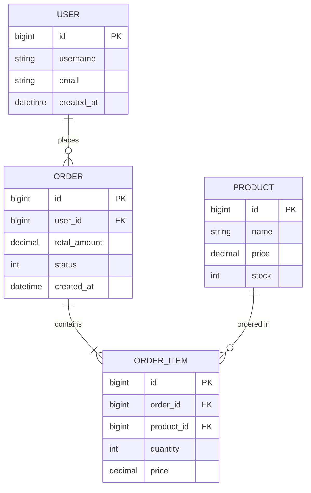

# [项目名称] - 数据库设计文档

> 📚 **项目记忆引用**
> - 遵循 [项目宪章](mdc:.spec-code/memory/constitution.md) 的核心原则和质量标准
> - 参考 [开发指南](mdc:.spec-code/memory/guidelines.md) 的 Template 编写规范
> - 了解 [项目上下文](mdc:.spec-code/memory/context.md) 的技术栈和项目结构


**文档版本**: v1.0  
**创建日期**: [YYYY-MM-DD]  
**创建人**: [作者姓名]  
**最后更新**: [YYYY-MM-DD]  
**数据库类型**: [MySQL 8.0 / PostgreSQL 14 / MongoDB 5.0]

---

## 📋 文档说明

本文档描述 [项目名称] 的数据库设计，包括表结构、索引、分库分表方案等。

**目标读者**: 后端开发、DBA、架构师

**使用方式**: 
- 作为数据库实施的依据
- 作为代码生成的输入
- 作为数据库评审的参考

---

## 1. 设计概述

### 1.1 设计目标

<!-- 
  ACTION REQUIRED: 描述数据库设计的目标
  Guidelines:
  - 支持哪些业务场景？
  - 性能目标是什么？
  - 数据量级是多少？
-->

**业务目标**:
- [目标 1]: [描述]
- [目标 2]: [描述]

**性能目标**:
- 响应时间: [要求，如：< 100ms]
- 并发量: [要求，如：1000 QPS]
- 数据量: [要求，如：1000 万条/年]

### 1.2 技术选型

**数据库**: [MySQL 8.0]  
**字符集**: [utf8mb4]  
**存储引擎**: [InnoDB]  
**选型理由**: [说明为什么选择这个数据库]

### 1.3 命名规范

- **表名**: 小写字母 + 下划线，复数形式（如：`users`, `orders`）
- **字段名**: 小写字母 + 下划线（如：`user_id`, `created_at`）
- **主键**: 统一使用 `id`
- **外键**: `关联表_id`（如：`user_id`, `order_id`）
- **索引**: 
  - 主键索引：`PRIMARY KEY`
  - 唯一索引：`uk_字段名`
  - 普通索引：`idx_字段名`
  - 联合索引：`idx_字段1_字段2`

---

## 2. 业务实体分析

<!-- 
  ACTION REQUIRED: 列出所有业务实体及其关系
  Guidelines:
  - 从需求文档中提取实体（名词）
  - 分析实体之间的关系（1:1, 1:N, M:N）
  - 识别核心实体和辅助实体
-->

### 2.1 实体列表

#### 实体 1: [实体名称]

**业务含义**: [描述这个实体在业务中的作用]

**核心属性**:
- [属性 1]: [类型] - [说明]
- [属性 2]: [类型] - [说明]

**业务规则**:
- [规则 1]: [描述]
- [规则 2]: [描述]

#### 实体 2: [实体名称]

[同上结构]

### 2.2 实体关系

```
[实体A] 1:N [实体B]
  说明：[关系描述，如：一个用户有多个订单]

[实体C] M:N [实体D]
  说明：[关系描述，如：商品和订单是多对多关系]
  中间表：[中间表名称]
```

### 2.3 ER 图



---

## 3. 表结构设计

<!-- 
  ACTION REQUIRED: 为每个实体设计表结构
  Guidelines:
  - 遵循命名规范
  - 选择合适的字段类型
  - 添加必要的约束
  - 所有字段都要有注释
-->

### 3.1 [表名]

**表说明**: [表的业务含义]

**字段列表**:

| 字段名 | 类型 | 长度 | 允许空 | 默认值 | 说明 |
|--------|------|------|--------|--------|------|
| id | BIGINT UNSIGNED | - | NO | AUTO_INCREMENT | 主键 |
| [字段名] | [类型] | [长度] | [YES/NO] | [默认值] | [说明] |
| create_time | DATETIME | - | NO | CURRENT_TIMESTAMP | 创建时间 |
| update_time | DATETIME | - | NO | CURRENT_TIMESTAMP | 更新时间 |
| create_by | VARCHAR | 50 | YES | NULL | 创建人（可选） |
| update_by | VARCHAR | 50 | YES | NULL | 更新人（可选） |
| enable_flag | TINYINT | 1 | NO | 1 | 启用标记（可选）：0-禁用，1-启用 |
| delete_flag | TINYINT | 1 | NO | 0 | 删除标记（可选）：0-未删除，1-已删除 |
| delete_time | DATETIME | - | YES | NULL | 删除时间（可选，软删除） |

**索引设计**:

| 索引名 | 类型 | 字段 | 说明 |
|--------|------|------|------|
| PRIMARY | 主键 | id | 主键索引 |
| uk_[字段] | 唯一 | [字段] | [说明] |
| idx_[字段] | 普通 | [字段] | [说明] |
| idx_[字段1]_[字段2] | 联合 | [字段1], [字段2] | [说明] |

**DDL 语句**:

```sql
CREATE TABLE `[表名]` (
  `id` BIGINT UNSIGNED NOT NULL AUTO_INCREMENT COMMENT '主键',
  `[字段名]` [类型] [约束] COMMENT '[说明]',
  `create_time` DATETIME NOT NULL DEFAULT CURRENT_TIMESTAMP COMMENT '创建时间',
  `update_time` DATETIME NOT NULL DEFAULT CURRENT_TIMESTAMP ON UPDATE CURRENT_TIMESTAMP COMMENT '更新时间',
  `create_by` VARCHAR(50) NULL COMMENT '创建人',
  `update_by` VARCHAR(50) NULL COMMENT '更新人',
  `enable_flag` TINYINT(1) NOT NULL DEFAULT 1 COMMENT '启用标记: 0-禁用, 1-启用',
  `delete_flag` TINYINT(1) NOT NULL DEFAULT 0 COMMENT '删除标记: 0-未删除, 1-已删除',
  PRIMARY KEY (`id`),
  UNIQUE KEY `uk_[字段]` (`[字段]`),
  KEY `idx_[字段]` (`[字段]`),
  KEY `idx_[字段1]_[字段2]` (`[字段1]`, `[字段2]`),
  KEY `idx_enable_flag` (`enable_flag`),
  KEY `idx_delete_flag` (`delete_flag`),
  KEY `idx_create_time` (`create_time`)
) ENGINE=InnoDB DEFAULT CHARSET=utf8mb4 COMMENT='[表说明]';
```

**说明**：
- 不使用显式外键约束，由应用层保证数据一致性
- 关联字段（如：user_id）需要建立索引
- 根据查询场景设计联合索引

**示例数据**:

```sql
INSERT INTO `[表名]` ([字段列表]) VALUES
  ([值1], [值2], ...),
  ([值1], [值2], ...);
```

### 3.2 [表名]

[重复上述结构]

---

## 4. 索引设计

<!-- 
  ACTION REQUIRED: 根据查询场景设计索引
  Guidelines:
  - 列出主要查询场景
  - 为高频查询字段建索引
  - 考虑联合索引
  - 使用 EXPLAIN 验证索引效果
-->

### 4.1 查询场景分析

#### 场景 1: [场景描述]

**查询 SQL**:
```sql
SELECT * FROM [表名] WHERE [条件] ORDER BY [字段];
```

**查询频率**: [高/中/低]

**索引设计**:
- 索引名: `idx_[字段]`
- 索引字段: `[字段]`
- 索引类型: [普通/唯一/联合]

**EXPLAIN 分析**:
```sql
EXPLAIN SELECT * FROM [表名] WHERE [条件];

-- 期望结果：
-- type: ref/const
-- key: idx_[字段]
-- rows: < 100
```

#### 场景 2: [场景描述]

[同上结构]

### 4.2 索引汇总

| 表名 | 索引名 | 类型 | 字段 | 用途 |
|------|--------|------|------|------|
| [表名] | uk_[字段] | 唯一 | [字段] | [用途] |
| [表名] | idx_[字段] | 普通 | [字段] | [用途] |
| [表名] | idx_[字段1]_[字段2] | 联合 | [字段1], [字段2] | [用途] |

---

## 5. 分库分表设计

<!-- 
  ACTION REQUIRED: 如果需要分库分表，设计方案
  Guidelines:
  - 评估数据量和增长速度
  - 选择分片策略（水平/垂直）
  - 选择分片键
  - 设计路由规则
  - 考虑扩容方案
-->

### 5.1 数据量评估

**当前数据量**: [X] 万条  
**增长速度**: [X] 万条/月  
**预计 1 年后**: [X] 万条  
**预计 2 年后**: [X] 万条

**是否需要分库分表**: [是/否]

**判断依据**（必须满足以下条件之一，且有明确的业务需求）:
- 单表数据量: [是否 > 1000万] **且** 查询性能无法通过索引优化
- 单库 QPS: [是否 > 1000] **且** 无法通过读写分离解决
- 单表文件大小: [是否 > 10GB] **且** 存储空间是瓶颈

**优化优先级**:
1. 索引优化
2. 查询优化
3. 缓存策略
4. 读写分离
5. 最后才考虑分库分表

### 5.2 分片方案

**分片策略**: [水平分表 / 垂直分表 / 水平分库]

**分片键**: [字段名]

**分片数量**: [N] 个

**路由规则**:
```
table_index = [分片键] % [分片数量]
table_name = [表名]_[table_index]
```

**示例**:
```
user_id = 12345
table_index = 12345 % 16 = 9
table_name = users_9
```

### 5.3 表命名

- `[表名]_0`
- `[表名]_1`
- ...
- `[表名]_[N-1]`

### 5.4 查询路由

#### 按分片键查询

**SQL**:
```sql
SELECT * FROM [表名] WHERE [分片键] = ?;
```

**路由**: 直接路由到对应分片

#### 按非分片键查询

**SQL**:
```sql
SELECT * FROM [表名] WHERE [其他字段] = ?;
```

**路由**: 
- 方案 1: 查询所有分片，应用层聚合
- 方案 2: 建立映射表（[其他字段] → [分片键]）
- 方案 3: 使用 Elasticsearch 做全局搜索

### 5.5 扩容方案

**当前**: [N] 个分片  
**扩容到**: [2N] 个分片

**数据迁移**:
1. 创建新分片
2. 双写（写入旧分片和新分片）
3. 数据迁移（从旧分片迁移到新分片）
4. 切换读流量到新分片
5. 删除旧分片

**路由调整**:
```
旧路由: table_index = [分片键] % [N]
新路由: table_index = [分片键] % [2N]
```

---

## 6. 数据字典

<!-- 
  ACTION REQUIRED: 生成完整的数据字典
  Guidelines:
  - 列出所有表和字段
  - 说明字段含义和约束
  - 可以导出为 Excel
-->

### 6.1 表清单

| 序号 | 表名 | 说明 | 记录数（预估） |
|------|------|------|----------------|
| 1 | [表名] | [说明] | [X] 万 |
| 2 | [表名] | [说明] | [X] 万 |

### 6.2 字段清单

#### [表名]

| 序号 | 字段名 | 类型 | 长度 | 允许空 | 默认值 | 说明 |
|------|--------|------|------|--------|--------|------|
| 1 | id | BIGINT UNSIGNED | - | NO | AUTO_INCREMENT | 主键 |
| 2 | [字段] | [类型] | [长度] | [YES/NO] | [默认值] | [说明] |

---

## 7. 性能优化

<!-- 
  ACTION REQUIRED: 列出性能优化措施
  Guidelines:
  - 查询优化
  - 索引优化
  - 配置优化
  - 架构优化
-->

### 7.1 查询优化

- [ ] 避免 SELECT *，只查询需要的字段
- [ ] 使用 LIMIT 分页，避免一次查询大量数据
- [ ] 使用 JOIN 代替子查询
- [ ] 避免在 WHERE 子句中使用函数
- [ ] 使用 EXPLAIN 分析查询计划

### 7.2 索引优化

- [ ] 为高频查询字段建索引
- [ ] 删除无用索引
- [ ] 合并重复索引
- [ ] 优化联合索引顺序（区分度高的在前）

### 7.3 配置优化

```ini
# InnoDB 缓冲池大小（服务器内存的 70%）
innodb_buffer_pool_size = 8G

# 最大连接数
max_connections = 1000

# 慢查询日志
slow_query_log = ON
long_query_time = 1

# 查询缓存（MySQL 5.7 及以下）
query_cache_size = 256M
query_cache_type = 1
```

### 7.4 架构优化

- [ ] 读写分离（1 主 2 从）
- [ ] 引入 Redis 缓存热点数据
- [ ] 分库分表（如数据量大）
- [ ] 使用 Elasticsearch 做全文检索

---

## 8. 数据安全

### 8.1 备份策略

**全量备份**:
- 频率: 每天凌晨 2:00
- 保留: 7 天
- 工具: mysqldump / xtrabackup

**增量备份**:
- 频率: 每小时
- 保留: 24 小时
- 工具: binlog

**异地备份**:
- 频率: 每天
- 位置: [异地机房/云存储]

### 8.2 权限管理

**应用账号**:
- 用户名: `app_user`
- 权限: SELECT, INSERT, UPDATE, DELETE
- 范围: 业务数据库

**只读账号**:
- 用户名: `readonly_user`
- 权限: SELECT
- 范围: 业务数据库

**管理员账号**:
- 用户名: `admin_user`
- 权限: ALL
- 范围: 所有数据库

### 8.3 敏感数据处理

**加密字段**:
- 密码: 使用 bcrypt/scrypt 加密
- 手机号: 使用 AES 加密
- 身份证号: 使用 AES 加密

**脱敏规则**:
- 手机号: 138****1234
- 邮箱: a***@example.com
- 身份证号: 110***********1234

---

## 9. 变更记录

<!-- 
  ACTION REQUIRED: 记录数据库变更历史
  Guidelines:
  - 每次变更都要记录
  - 说明变更原因和影响
  - 提供回滚方案
-->

| 版本 | 日期 | 变更内容 | 变更人 | 变更原因 | 影响范围 |
|------|------|----------|--------|----------|----------|
| v1.0 | [YYYY-MM-DD] | 初始版本 | [姓名] | 项目启动 | 新建所有表 |
| v1.1 | [YYYY-MM-DD] | [变更内容] | [姓名] | [原因] | [影响] |

---

## 10. 附录

### 10.1 完整 DDL

```sql
-- 完整的建表语句
-- 可以直接执行

-- 创建数据库
CREATE DATABASE IF NOT EXISTS `[数据库名]` DEFAULT CHARACTER SET utf8mb4 COLLATE utf8mb4_unicode_ci;

USE `[数据库名]`;

-- 创建表
[所有建表语句]

-- 创建索引
[所有索引语句]

-- 初始化数据
[初始化数据语句]
```

### 10.2 术语表

| 术语 | 定义 |
|------|------|
| DDL | Data Definition Language（数据定义语言） |
| DML | Data Manipulation Language（数据操作语言） |
| QPS | Queries Per Second（每秒查询数） |
| ER 图 | Entity-Relationship Diagram（实体关系图） |

### 10.3 参考资料

- [需求文档]: [链接]
- [架构设计]: [链接]
- [API 规格]: [链接]
- [MySQL 官方文档]: https://dev.mysql.com/doc/

---

## 📞 联系方式

**负责人**: [姓名]  
**邮箱**: [email]  
**企业微信**: [ID]  
**项目文档**: [Confluence/Wiki 链接]
