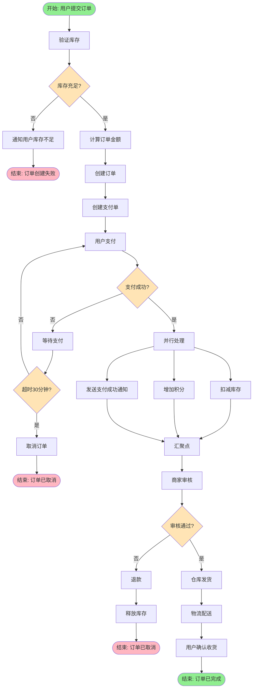
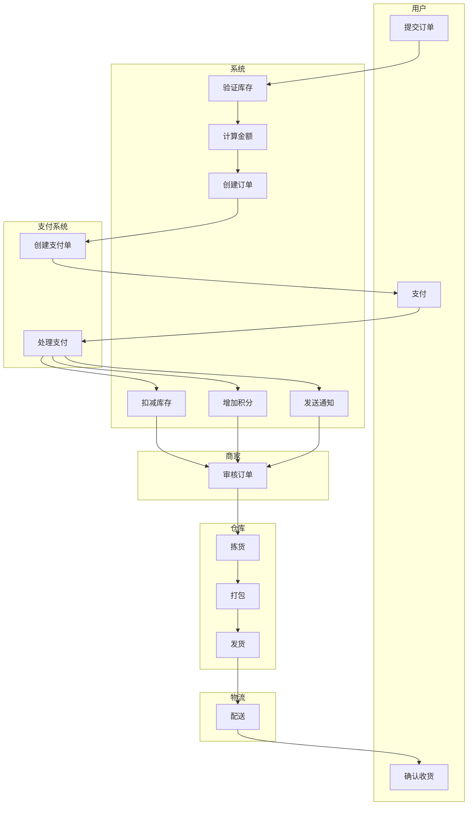
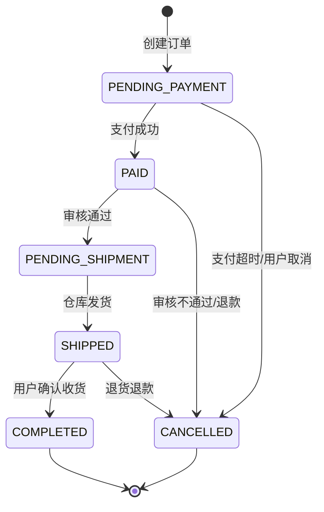
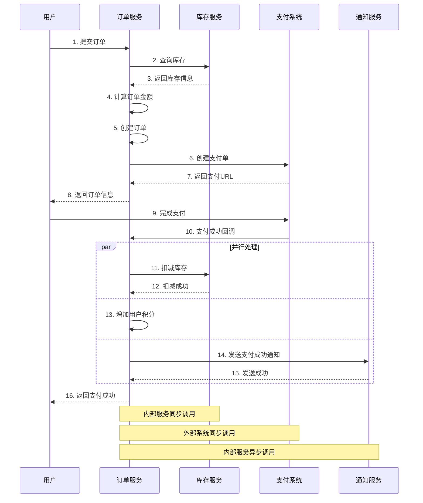

# 订单处理流程 - 业务流程设计文档

**文档版本**: v1.0  
**创建日期**: 2024-01-15  
**创建人**: 张三  
**最后更新**: 2024-01-15  
**流程类型**: 核心流程  
**流程粒度**: 中观

---

## 📋 文档说明

本文档描述电商平台订单处理流程的业务流程设计，包括流程图、状态机、业务规则和异常处理方案。

**目标读者**: 产品经理、开发工程师、测试工程师、架构师

**使用方式**: 
- 作为开发实现的依据
- 作为测试用例设计的参考
- 作为流程优化的基础
- 作为团队沟通的工具

---

## 1. 流程概述

### 1.1 业务场景

**业务背景**:
为了提升订单处理效率和用户体验，需要设计一套自动化的订单处理流程。该流程覆盖从用户下单到订单完成的全过程，包括库存验证、支付处理、商家审核、仓库发货等环节。

**业务价值**:
- 提升订单处理效率：自动化处理减少人工干预，提升处理速度
- 降低错误率：标准化流程减少人为错误
- 提升用户体验：快速响应，及时反馈订单状态
- 支持业务扩展：流程可扩展，支持更多业务场景

**适用场景**:
- 用户在线下单购买商品
- 支持多种支付方式（支付宝、微信、银行卡）
- 支持商家审核机制
- 支持自动发货和物流跟踪

### 1.2 流程边界

**起点**: 用户提交订单

**终点**: 订单完成（用户确认收货）或订单取消

**输入**:
- `orderInfo`: OrderRequest - 订单信息（商品、数量、收货地址等）
- `userId`: Long - 用户ID
- `paymentMethod`: String - 支付方式

**输出**:
- `order`: Order - 订单对象（包含订单号、状态、金额等）
- `paymentResult`: PaymentResult - 支付结果
- `shippingInfo`: ShippingInfo - 物流信息

**参与者**:
- 用户: 提交订单、支付、确认收货
- 商家: 审核订单
- 仓库: 拣货、打包、发货
- 系统: 验证库存、计算价格、扣减库存、发送通知
- 支付系统: 处理支付
- 物流系统: 配送商品

### 1.3 流程分类

**流程类型**: 核心流程

**流程粒度**: 中观

**优先级**: P0

**预估频率**: 每天10000次

---

## 2. 主流程设计

### 2.1 流程图



**流程说明**:
1. **验证库存**: 检查商品库存是否充足
2. **库存判断**: 如果库存不足，通知用户并结束流程
3. **计算订单金额**: 计算商品总价、运费、优惠等
4. **创建订单**: 生成订单记录，状态为"待支付"
5. **创建支付单**: 调用支付系统创建支付单
6. **用户支付**: 用户选择支付方式并完成支付
7. **支付判断**: 如果支付失败，等待用户重新支付；如果超时30分钟，自动取消订单
8. **并行处理**: 支付成功后，并行执行扣减库存、增加积分、发送通知
9. **商家审核**: 商家审核订单（风险订单需要人工审核）
10. **审核判断**: 如果审核不通过，退款并释放库存
11. **仓库发货**: 仓库拣货、打包、发货
12. **物流配送**: 物流公司配送商品
13. **用户确认收货**: 用户确认收货，订单完成

### 2.2 泳道图



**职责说明**:
- **用户**: 提交订单、完成支付、确认收货
- **系统**: 验证库存、计算金额、创建订单、扣减库存、增加积分、发送通知
- **支付系统**: 创建支付单、处理支付
- **商家**: 审核订单（风险订单需要人工审核）
- **仓库**: 拣货、打包、发货
- **物流**: 配送商品

---

## 3. 状态流转设计

### 3.1 状态定义

**业务对象**: 订单（Order）

**状态列表**:

| 状态代码 | 状态名称 | 说明 | 是否终态 |
|----------|----------|------|----------|
| PENDING_PAYMENT | 待支付 | 订单已创建，等待用户支付 | 否 |
| PAID | 已支付 | 用户已支付，等待商家审核 | 否 |
| PENDING_SHIPMENT | 待发货 | 商家审核通过，等待仓库发货 | 否 |
| SHIPPED | 已发货 | 仓库已发货，物流配送中 | 否 |
| COMPLETED | 已完成 | 用户已确认收货，订单完成 | 是 |
| CANCELLED | 已取消 | 订单已取消（支付超时、审核不通过、用户取消） | 是 |

**初始状态**: PENDING_PAYMENT（待支付）

**终态**: COMPLETED（已完成）、CANCELLED（已取消）

### 3.2 状态流转图



### 3.3 状态流转规则

| 当前状态 | 触发事件 | 目标状态 | 前置条件 | 后置操作 |
|----------|----------|----------|----------|----------|
| PENDING_PAYMENT | 支付成功 | PAID | 支付金额正确 | 扣减库存、增加积分、发送通知 |
| PENDING_PAYMENT | 支付超时 | CANCELLED | 超过30分钟未支付 | 释放库存（如果已扣减） |
| PENDING_PAYMENT | 用户取消 | CANCELLED | 用户主动取消 | 释放库存（如果已扣减） |
| PAID | 审核通过 | PENDING_SHIPMENT | 库存充足、非风险订单 | 通知仓库发货 |
| PAID | 审核不通过 | CANCELLED | 风险订单 | 退款、释放库存 |
| PENDING_SHIPMENT | 仓库发货 | SHIPPED | 仓库已发货 | 更新物流信息、发送通知 |
| SHIPPED | 用户确认收货 | COMPLETED | 用户确认或自动确认（7天） | 结算给商家、完成交易 |
| SHIPPED | 退货退款 | CANCELLED | 用户申请退货 | 退款、恢复库存 |

**流转约束**:
- 订单一旦进入终态（COMPLETED 或 CANCELLED），不能再流转到其他状态
- 只有 PENDING_PAYMENT 状态的订单可以被用户取消
- 只有 SHIPPED 状态的订单可以申请退货

---

## 4. 关键节点详细说明

### 4.1 节点：验证库存

**节点类型**: 服务任务

**执行者**: 系统

**职责**: 检查商品库存是否充足，确保订单可以正常处理

**输入**:
- `productId`: Long - 商品ID
- `quantity`: Integer - 购买数量

**输出**:
- `available`: Boolean - 库存是否充足
- `stock`: Integer - 当前库存数量

**业务逻辑**:
1. 根据商品ID查询当前库存
2. 检查库存数量是否 >= 购买数量
3. 如果库存充足，返回 true；否则返回 false
4. 记录库存检查日志

**前置条件**:
- 商品ID有效
- 商品未下架

**后置条件**:
- 如果库存充足，流程继续
- 如果库存不足，通知用户并结束流程

**性能要求**:
- 响应时间: < 50ms
- 并发量: 1000 QPS

**示例**:
```
输入示例：
{
  "productId": 12345,
  "quantity": 2
}

输出示例（库存充足）：
{
  "available": true,
  "stock": 100
}

输出示例（库存不足）：
{
  "available": false,
  "stock": 1
}
```

### 4.2 节点：计算订单金额

**节点类型**: 脚本任务

**执行者**: 系统

**职责**: 计算订单总金额，包括商品价格、运费、优惠等

**输入**:
- `items`: List<OrderItem> - 订单商品列表
- `userId`: Long - 用户ID
- `shippingAddress`: Address - 收货地址

**输出**:
- `totalAmount`: BigDecimal - 订单总金额
- `itemAmount`: BigDecimal - 商品总价
- `shippingFee`: BigDecimal - 运费
- `discount`: BigDecimal - 优惠金额

**业务逻辑**:
1. 计算商品总价：sum(商品单价 × 数量)
2. 计算运费：根据收货地址和商品重量计算
3. 计算优惠：查询用户可用优惠券、积分抵扣、满减活动等
4. 计算订单总金额：商品总价 + 运费 - 优惠金额
5. 验证金额：确保总金额 > 0

**前置条件**:
- 商品价格有效
- 收货地址有效

**后置条件**:
- 订单金额已计算
- 金额明细已记录

**性能要求**:
- 响应时间: < 100ms
- 并发量: 1000 QPS

**示例**:
```
输入示例：
{
  "items": [
    {"productId": 12345, "price": 99.00, "quantity": 2},
    {"productId": 67890, "price": 49.00, "quantity": 1}
  ],
  "userId": 1001,
  "shippingAddress": {"province": "广东", "city": "深圳"}
}

输出示例：
{
  "totalAmount": 257.00,
  "itemAmount": 247.00,  // 99*2 + 49*1
  "shippingFee": 10.00,
  "discount": 0.00
}
```

### 4.3 节点：商家审核

**节点类型**: 用户任务（风险订单）/ 服务任务（正常订单）

**执行者**: 商家（人工）/ 系统（自动）

**职责**: 审核订单是否可以发货，识别风险订单

**输入**:
- `orderId`: Long - 订单ID
- `order`: Order - 订单对象

**输出**:
- `approved`: Boolean - 是否审核通过
- `reason`: String - 审核不通过的原因（如果不通过）

**业务逻辑**:
1. 检查订单是否为风险订单（根据风险规则）
2. 如果是风险订单，转人工审核
3. 如果是正常订单，自动审核通过
4. 记录审核结果和原因

**前置条件**:
- 订单已支付
- 库存已扣减

**后置条件**:
- 如果审核通过，通知仓库发货
- 如果审核不通过，退款并释放库存

**性能要求**:
- 自动审核响应时间: < 100ms
- 人工审核时间: < 2小时

**示例**:
```
输入示例：
{
  "orderId": 1001,
  "order": {
    "userId": 1001,
    "totalAmount": 257.00,
    "shippingAddress": {...}
  }
}

输出示例（审核通过）：
{
  "approved": true,
  "reason": null
}

输出示例（审核不通过）：
{
  "approved": false,
  "reason": "收货地址异常，疑似欺诈订单"
}
```

---

## 5. 业务规则清单

### 5.1 验证规则

**规则1: 库存验证**

**描述**: 验证商品库存是否充足

**条件**:
```
IF 库存数量 >= 购买数量 THEN
    验证通过
ELSE
    验证失败: "库存不足，当前库存：{库存数量}"
END IF
```

**示例**:
- ✅ 通过: 库存100，购买2 → 验证通过
- ❌ 失败: 库存1，购买2 → 验证失败

**规则2: 金额验证**

**描述**: 验证订单金额是否合法

**条件**:
```
IF 订单总金额 > 0 AND 订单总金额 <= 100000 THEN
    验证通过
ELSE
    验证失败: "订单金额异常"
END IF
```

**示例**:
- ✅ 通过: 订单金额257.00 → 验证通过
- ❌ 失败: 订单金额0 → 验证失败
- ❌ 失败: 订单金额150000 → 验证失败（超过单笔限额）

### 5.2 计算规则

**规则1: 运费计算**

**描述**: 根据收货地址和商品重量计算运费

**公式**:
```
运费 = 基础运费 + 超重费用

基础运费 = 
  IF 省内 THEN 5元
  ELSE IF 省外 THEN 10元
  ELSE IF 偏远地区 THEN 20元

超重费用 = 
  IF 重量 > 5kg THEN (重量 - 5) * 2元/kg
  ELSE 0元
```

**示例**:
```
输入: 广东省内，重量3kg
计算: 基础运费5元 + 超重费用0元 = 5元
输出: 5元

输入: 新疆，重量8kg
计算: 基础运费20元 + 超重费用(8-5)*2=6元 = 26元
输出: 26元
```

**规则2: 优惠计算**

**描述**: 计算订单可用的优惠金额

**公式**:
```
优惠金额 = 优惠券优惠 + 积分抵扣 + 满减优惠

优惠券优惠 = 用户选择的优惠券面额
积分抵扣 = MIN(用户积分 / 100, 订单金额 * 0.1)
满减优惠 = 
  IF 订单金额 >= 200 THEN 20元
  ELSE IF 订单金额 >= 100 THEN 10元
  ELSE 0元
```

### 5.3 决策规则

**规则1: 风险订单识别**

**描述**: 识别风险订单，需要人工审核

**决策逻辑**:
```
IF 订单金额 > 10000 THEN
    风险订单（高额订单）
ELSE IF 用户风险等级 == HIGH THEN
    风险订单（高风险用户）
ELSE IF 收货地址为海外 THEN
    风险订单（海外订单）
ELSE IF 用户注册时间 < 7天 AND 订单金额 > 1000 THEN
    风险订单（新用户高额订单）
ELSE
    正常订单
END IF
```

**决策表**:

| 订单金额 | 用户风险等级 | 收货地址 | 用户注册时间 | 决策结果 |
|----------|--------------|----------|--------------|----------|
| > 10000 | - | - | - | 风险订单 |
| <= 10000 | HIGH | - | - | 风险订单 |
| <= 10000 | LOW/MEDIUM | 海外 | - | 风险订单 |
| > 1000 | LOW/MEDIUM | 国内 | < 7天 | 风险订单 |
| <= 1000 | LOW/MEDIUM | 国内 | >= 7天 | 正常订单 |

### 5.4 路由规则

**规则1: 审核路由**

**描述**: 根据订单类型路由到不同的审核流程

**路由逻辑**:
```
IF 风险订单 THEN
    路由到: 人工审核任务
ELSE
    路由到: 自动审核任务
END IF
```

### 5.5 约束条件

**数据约束**:
- 订单金额必须 > 0 且 <= 100000
- 购买数量必须 > 0 且 <= 999
- 收货地址必须完整（省、市、区、详细地址）

**业务约束**:
- 同一用户同一时间只能有一个待支付订单
- 订单支付超时时间为30分钟
- 订单自动确认收货时间为7天

**时间约束**:
- 支付超时: 30分钟
- 商家审核: 2小时内
- 仓库发货: 24小时内
- 自动确认收货: 7天

---

## 6. 异常场景处理

### 6.1 异常场景清单

| 异常编号 | 异常名称 | 异常类型 | 发生概率 | 影响程度 |
|----------|----------|----------|----------|----------|
| E001 | 库存不足 | 业务异常 | 中 | 中 |
| E002 | 支付超时 | 业务异常 | 高 | 中 |
| E003 | 支付失败 | 系统异常 | 中 | 高 |
| E004 | 审核不通过 | 业务异常 | 低 | 中 |
| E005 | 库存扣减失败 | 系统异常 | 低 | 高 |
| E006 | 网络超时 | 系统异常 | 中 | 中 |

### 6.2 异常处理方案

#### 异常E001: 库存不足

**异常类型**: 业务异常

**触发条件**: 用户下单时，商品库存不足

**影响范围**: 订单无法创建

**处理策略**: 提示用户，结束流程

**处理步骤**:
1. 查询当前库存数量
2. 提示用户："抱歉，商品库存不足，当前库存：{库存数量}"
3. 建议用户减少购买数量或选择其他商品
4. 结束流程

**用户提示**: "抱歉，商品库存不足，当前库存：{库存数量}，请减少购买数量或选择其他商品"

**日志记录**: 记录商品ID、购买数量、当前库存

**监控告警**: 否

#### 异常E002: 支付超时

**异常类型**: 业务异常

**触发条件**: 用户创建订单后，30分钟内未完成支付

**影响范围**: 订单被取消

**处理策略**: 自动取消订单，释放库存

**处理步骤**:
1. 检测订单创建时间，如果超过30分钟未支付
2. 自动取消订单，更新订单状态为 CANCELLED
3. 如果已扣减库存，释放库存
4. 发送通知给用户："您的订单已超时未支付，已自动取消"

**用户提示**: "您的订单已超时未支付，已自动取消。如需购买，请重新下单"

**日志记录**: 记录订单ID、创建时间、取消时间

**监控告警**: 是，如果超时率 > 20%，告警

#### 异常E003: 支付失败

**异常类型**: 系统异常

**触发条件**: 调用支付系统失败（网络超时、余额不足、支付系统异常等）

**影响范围**: 订单无法支付

**处理策略**: 重试3次，失败后提示用户

**处理步骤**:
1. 捕获支付异常
2. 重试3次，每次间隔1秒（指数退避）
3. 如果3次都失败，提示用户："支付失败，请稍后重试"
4. 记录支付失败日志，包含失败原因
5. 订单保持 PENDING_PAYMENT 状态，用户可以重新支付

**用户提示**: "支付失败，原因：{失败原因}。请检查支付方式或稍后重试"

**日志记录**: 记录订单ID、支付方式、失败原因、重试次数

**监控告警**: 是，如果失败率 > 5%，告警

#### 异常E004: 审核不通过

**异常类型**: 业务异常

**触发条件**: 商家审核订单时，发现风险订单

**影响范围**: 订单被取消，需要退款

**处理策略**: 退款，释放库存

**处理步骤**:
1. 商家标记订单为"审核不通过"，填写原因
2. 调用支付系统退款
3. 释放已扣减的库存
4. 更新订单状态为 CANCELLED
5. 发送通知给用户："您的订单审核不通过，已退款。原因：{审核不通过原因}"

**用户提示**: "您的订单审核不通过，已退款。原因：{审核不通过原因}。如有疑问，请联系客服"

**日志记录**: 记录订单ID、审核人、审核不通过原因

**监控告警**: 是，如果审核不通过率 > 10%，告警

#### 异常E005: 库存扣减失败

**异常类型**: 系统异常

**触发条件**: 支付成功后，扣减库存失败（数据库异常、并发冲突等）

**影响范围**: 订单无法继续处理，需要补偿

**处理策略**: 重试，失败后人工介入

**处理步骤**:
1. 捕获库存扣减异常
2. 重试3次，每次间隔500ms
3. 如果3次都失败，记录异常日志，发送告警
4. 订单状态保持 PAID，等待人工处理
5. 人工处理：检查库存，手动扣减或取消订单退款

**用户提示**: "订单处理中，请稍后查看订单状态"

**日志记录**: 记录订单ID、商品ID、扣减数量、失败原因

**监控告警**: 是，严重告警，立即处理

#### 异常E006: 网络超时

**异常类型**: 系统异常

**触发条件**: 调用外部服务（支付系统、物流系统）超时

**影响范围**: 流程暂时中断

**处理策略**: 重试，失败后降级

**处理步骤**:
1. 捕获网络超时异常
2. 重试3次，每次间隔1秒（指数退避）
3. 如果3次都失败，记录异常日志
4. 根据业务重要性决定：
   - 关键服务（支付）：提示用户稍后重试
   - 非关键服务（通知）：降级处理，异步重试

**用户提示**: "网络异常，请稍后重试"

**日志记录**: 记录服务名称、超时时间、重试次数

**监控告警**: 是，如果超时率 > 10%，告警

### 6.3 补偿机制

#### 补偿场景1: 支付成功后审核不通过

**触发条件**: 用户已支付，但商家审核不通过

**已执行操作**:
1. 用户支付成功
2. 扣减库存
3. 增加用户积分
4. 发送支付成功通知

**补偿操作**:
1. 退款（对应操作1）
2. 恢复库存（对应操作2）
3. 扣减用户积分（对应操作3）
4. 发送订单取消通知（对应操作4）

**补偿顺序**: 按照相反顺序执行（4 → 3 → 2 → 1）

**补偿失败处理**: 如果补偿失败（如退款失败），记录异常日志，发送告警，人工介入处理

#### 补偿场景2: 库存扣减失败

**触发条件**: 支付成功后，扣减库存失败

**已执行操作**:
1. 用户支付成功
2. 增加用户积分
3. 发送支付成功通知

**补偿操作**:
1. 退款（对应操作1）
2. 扣减用户积分（对应操作2）
3. 发送订单取消通知（对应操作3）

**补偿顺序**: 按照相反顺序执行（3 → 2 → 1）

**补偿失败处理**: 如果补偿失败，记录异常日志，发送告警，人工介入处理

### 6.4 重试机制

**重试策略**:

| 异常类型 | 重试次数 | 重试间隔 | 退避策略 | 最大间隔 |
|----------|----------|----------|----------|----------|
| 支付失败 | 3 | 1s | 指数退避 | 10s |
| 库存扣减失败 | 3 | 500ms | 固定间隔 | - |
| 网络超时 | 3 | 1s | 指数退避 | 10s |
| 通知发送失败 | 5 | 2s | 固定间隔 | - |

**重试条件**:
- 只对临时性错误重试（网络超时、服务不可用）
- 不对永久性错误重试（参数错误、业务规则不满足）

**重试失败处理**: 重试次数用尽后，记录异常日志，发送告警，根据业务重要性决定是否人工介入

### 6.5 超时处理

**超时配置**:

| 操作 | 超时时间 | 超时处理 |
|------|----------|----------|
| 验证库存 | 1s | 重试3次，失败后提示用户 |
| 调用支付系统 | 5s | 重试3次，失败后提示用户 |
| 扣减库存 | 2s | 重试3次，失败后人工介入 |
| 发送通知 | 3s | 异步重试，不影响主流程 |
| 用户支付 | 30分钟 | 自动取消订单 |
| 商家审核 | 2小时 | 自动审核通过（正常订单） |

---

## 7. 系统交互说明

### 7.1 系统交互清单

**内部服务**:
- 订单服务: 创建订单、更新订单状态
- 库存服务: 查询库存、扣减库存、恢复库存
- 用户服务: 查询用户信息、更新用户积分
- 通知服务: 发送短信、邮件、站内信

**外部系统**:
- 支付系统: 创建支付单、处理支付、退款
- 物流系统: 创建物流单、查询物流信息

**第三方服务**:
- 支付宝: 支付、退款
- 微信支付: 支付、退款
- 短信服务: 发送短信通知

### 7.2 交互详细说明

#### 交互1: 调用支付系统创建支付单

**类型**: 同步

**调用方**: 订单服务

**被调用方**: 支付系统

**触发时机**: 订单创建成功后

**接口说明**:
- 接口名称: createPayment
- 请求方式: POST
- 请求路径: /api/payment/create
- 请求参数:
  ```json
  {
    "orderId": 1001,
    "userId": 1001,
    "amount": 257.00,
    "paymentMethod": "ALIPAY"
  }
  ```
- 返回结果:
  ```json
  {
    "paymentId": "PAY20240115001",
    "payUrl": "https://pay.example.com/...",
    "expireTime": "2024-01-15 12:30:00"
  }
  ```

**超时设置**: 5秒

**失败处理**: 重试3次，失败后提示用户"支付系统异常，请稍后重试"

**依赖级别**: 强依赖

**降级方案**: 无（支付是核心功能，无法降级）

#### 交互2: 调用库存服务扣减库存

**类型**: 同步

**调用方**: 订单服务

**被调用方**: 库存服务

**触发时机**: 支付成功后

**接口说明**:
- 接口名称: deductInventory
- 请求方式: POST
- 请求路径: /api/inventory/deduct
- 请求参数:
  ```json
  {
    "productId": 12345,
    "quantity": 2,
    "orderId": 1001
  }
  ```
- 返回结果:
  ```json
  {
    "success": true,
    "remainingStock": 98
  }
  ```

**超时设置**: 2秒

**失败处理**: 重试3次，失败后人工介入

**依赖级别**: 强依赖

**降级方案**: 无（库存扣减是核心功能，无法降级）

#### 交互3: 调用通知服务发送通知

**类型**: 异步

**调用方**: 订单服务

**被调用方**: 通知服务

**触发时机**: 订单状态变更时

**接口说明**:
- 接口名称: sendNotification
- 请求方式: POST
- 请求路径: /api/notification/send
- 请求参数:
  ```json
  {
    "userId": 1001,
    "type": "SMS",
    "template": "ORDER_PAID",
    "params": {
      "orderId": 1001,
      "amount": 257.00
    }
  }
  ```
- 返回结果:
  ```json
  {
    "success": true,
    "messageId": "MSG20240115001"
  }
  ```

**超时设置**: 3秒

**失败处理**: 异步重试5次，失败后记录日志

**依赖级别**: 弱依赖

**降级方案**: 通知失败不影响主流程，异步重试

### 7.3 时序图



**交互说明**:
1. 用户提交订单，包含商品信息、收货地址等
2. 订单服务调用库存服务查询库存
3. 库存服务返回库存信息
4. 订单服务计算订单金额（商品价格、运费、优惠）
5. 订单服务创建订单记录，状态为 PENDING_PAYMENT
6. 订单服务调用支付系统创建支付单
7. 支付系统返回支付URL和支付单ID
8. 订单服务返回订单信息给用户
9. 用户在支付页面完成支付
10. 支付系统回调订单服务，通知支付成功
11-15. 并行处理：扣减库存、增加积分、发送通知
16. 订单服务返回支付成功给用户

---

## 8. 性能与优化考虑

### 8.1 性能要求

**响应时间**:
- 整体流程: < 3s（从提交订单到返回订单信息）
- 验证库存: < 50ms
- 计算金额: < 100ms
- 创建订单: < 200ms
- 创建支付单: < 500ms

**并发量**:
- 峰值 QPS: 1000（大促期间）
- 平均 QPS: 100

**数据量**:
- 日处理量: 10000单
- 峰值处理量: 5000单/小时

**可用性**:
- 目标可用性: 99.9%
- 故障恢复时间: < 5分钟

### 8.2 性能瓶颈分析

**潜在瓶颈**:
1. 库存查询：高并发下数据库压力大 - 影响：响应时间增加
2. 支付系统调用：外部系统响应慢 - 影响：用户等待时间长
3. 库存扣减：并发冲突导致失败 - 影响：订单处理失败率高

### 8.3 优化建议

**并行处理**:
- 建议1: 将"扣减库存"、"增加积分"、"发送通知"改为并行执行，预计提升 30% 性能
- 建议2: 使用异步消息处理"发送通知"，避免阻塞主流程

**缓存优化**:
- 建议1: 缓存商品信息（价格、库存），减少数据库查询，预计提升 50% 性能
- 建议2: 使用本地缓存用户信息，减少网络开销

**批量处理**:
- 建议1: 将"发送通知"改为批量处理，减少消息队列交互次数
- 建议2: 使用消息队列削峰填谷，提升系统稳定性

**数据库优化**:
- 建议1: 为 `order_id`、`user_id`、`status` 添加索引，提升查询性能
- 建议2: 使用分库分表，支持更大数据量（预计1年后订单量达到1000万）

### 8.4 幂等性设计

**需要幂等的操作**:
- 创建订单: 使用订单号作为唯一标识，防止重复创建
- 扣减库存: 使用订单ID作为幂等键，防止重复扣减
- 支付回调: 使用支付单ID作为幂等键，防止重复处理

**幂等性实现方式**:
- 使用唯一标识（订单号、支付单ID）
- 使用数据库唯一约束（订单号唯一）
- 使用分布式锁（扣减库存时加锁）
- 使用状态机（只允许特定状态流转，如：PENDING_PAYMENT → PAID）

**幂等性验证**:
- 验证方法1: 重复调用创建订单接口，只创建一个订单
- 验证方法2: 重复调用支付回调接口，只处理一次

---

## 9. 监控与分析

### 9.1 监控指标

**流程指标**:
- 流程实例数（总数、成功数、失败数）
- 流程耗时（平均、最大、最小、P95、P99）
- 流程完成率: 成功数 / 总数
- 流程异常率: 失败数 / 总数

**任务指标**:
- 任务耗时（每个任务的耗时分布）
- 任务成功率
- 任务重试次数

**业务指标**:
- 订单创建数
- 订单支付成功率
- 订单取消率
- 订单平均金额

### 9.2 告警规则

| 告警项 | 告警条件 | 告警级别 | 处理方式 |
|--------|----------|----------|----------|
| 流程失败率过高 | 失败率 > 5% | 严重 | 立即处理 |
| 流程耗时过长 | P95 > 5s | 警告 | 优化流程 |
| 支付超时率过高 | 超时率 > 20% | 警告 | 分析原因 |
| 库存扣减失败 | 失败次数 > 10/分钟 | 严重 | 立即处理 |
| 审核不通过率过高 | 不通过率 > 10% | 警告 | 检查风险规则 |

### 9.3 分析方法

**流程挖掘**:
- 分析实际执行路径：统计各个分支的执行频率
- 识别常见路径：正常流程占比 80%，支付超时占比 15%，审核不通过占比 5%
- 发现流程优化机会：支付超时率高，考虑延长超时时间或优化支付流程

**瓶颈分析**:
- 识别耗时最长的任务：支付处理平均耗时 2s，占总耗时的 60%
- 分析任务耗时分布：P95 耗时 5s，P99 耗时 10s
- 提出优化建议：优化支付系统调用，使用缓存减少数据库查询

**异常分析**:
- 统计异常类型和频率：支付超时 15%，库存不足 3%，审核不通过 2%
- 分析异常原因：支付超时主要是用户放弃支付，库存不足是热门商品库存不足
- 制定改进措施：优化库存预警机制，提前补货

---

## 10. 测试建议

### 10.1 功能测试

**正常流程测试**:
- 测试用例1: 用户下单 → 支付成功 → 审核通过 → 发货 → 确认收货 → 订单完成
- 测试用例2: 用户下单 → 使用优惠券 → 支付成功 → 订单完成

**分支流程测试**:
- 测试用例1: 用户下单 → 库存不足 → 订单创建失败
- 测试用例2: 用户下单 → 支付超时 → 订单自动取消
- 测试用例3: 用户下单 → 支付成功 → 审核不通过 → 退款 → 订单取消

**边界条件测试**:
- 测试用例1: 订单金额为 0.01 元（最小金额）
- 测试用例2: 订单金额为 100000 元（最大金额）
- 测试用例3: 购买数量为 999（最大数量）

### 10.2 异常测试

**业务异常测试**:
- 测试用例1: 库存不足时下单，验证提示信息
- 测试用例2: 支付超时，验证订单自动取消
- 测试用例3: 审核不通过，验证退款和库存恢复

**系统异常测试**:
- 测试用例1: 支付系统异常，验证重试机制
- 测试用例2: 库存服务异常，验证降级处理
- 测试用例3: 网络超时，验证超时处理

**补偿机制测试**:
- 测试用例1: 支付成功后审核不通过，验证退款和库存恢复
- 测试用例2: 库存扣减失败，验证补偿操作

### 10.3 性能测试

**压力测试**:
- 测试目标: 验证系统在高并发下的性能
- 测试场景: 1000 并发用户同时下单
- 预期结果: 响应时间 < 3s，成功率 > 99%

**并发测试**:
- 测试目标: 验证库存扣减的并发安全性
- 测试场景: 100 并发用户购买同一商品（库存 10）
- 预期结果: 只有 10 个订单成功，其他订单提示库存不足

---

## 11. 变更历史

| 版本 | 日期 | 作者 | 变更内容 |
|------|------|------|----------|
| v1.0 | 2024-01-15 | 张三 | 初始版本 |

---

## 12. 附录

### 12.1 术语表

| 术语 | 说明 |
|------|------|
| 订单 | 用户购买商品的记录 |
| 支付单 | 支付系统生成的支付记录 |
| 库存 | 商品的可售数量 |
| 风险订单 | 可能存在欺诈风险的订单 |
| 补偿 | 回滚已执行的操作 |
| 幂等性 | 多次执行相同操作，结果一致 |

### 12.2 参考资料

- [BPMN 2.0 规范](https://www.omg.org/spec/BPMN/2.0/)
- [分布式事务最佳实践](https://example.com)
- [电商订单流程设计](https://example.com)

### 12.3 相关文档

- [订单数据库设计](./order-database-design.md)
- [订单API设计](./order-api-design.md)
- [支付系统对接文档](./payment-integration.md)
