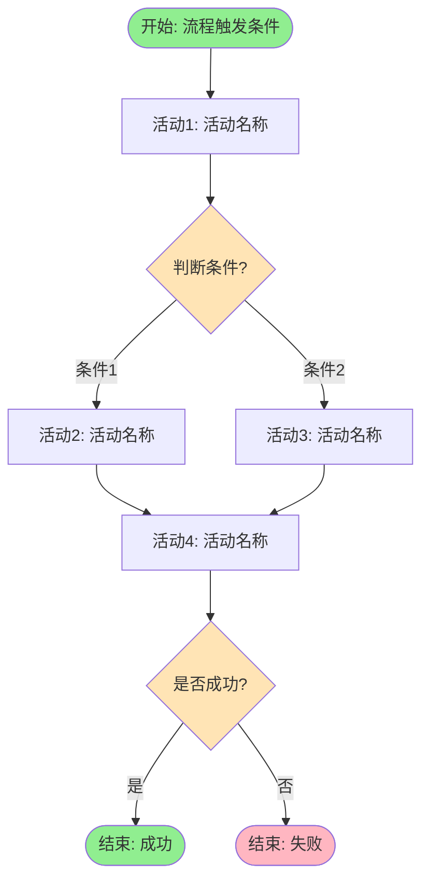
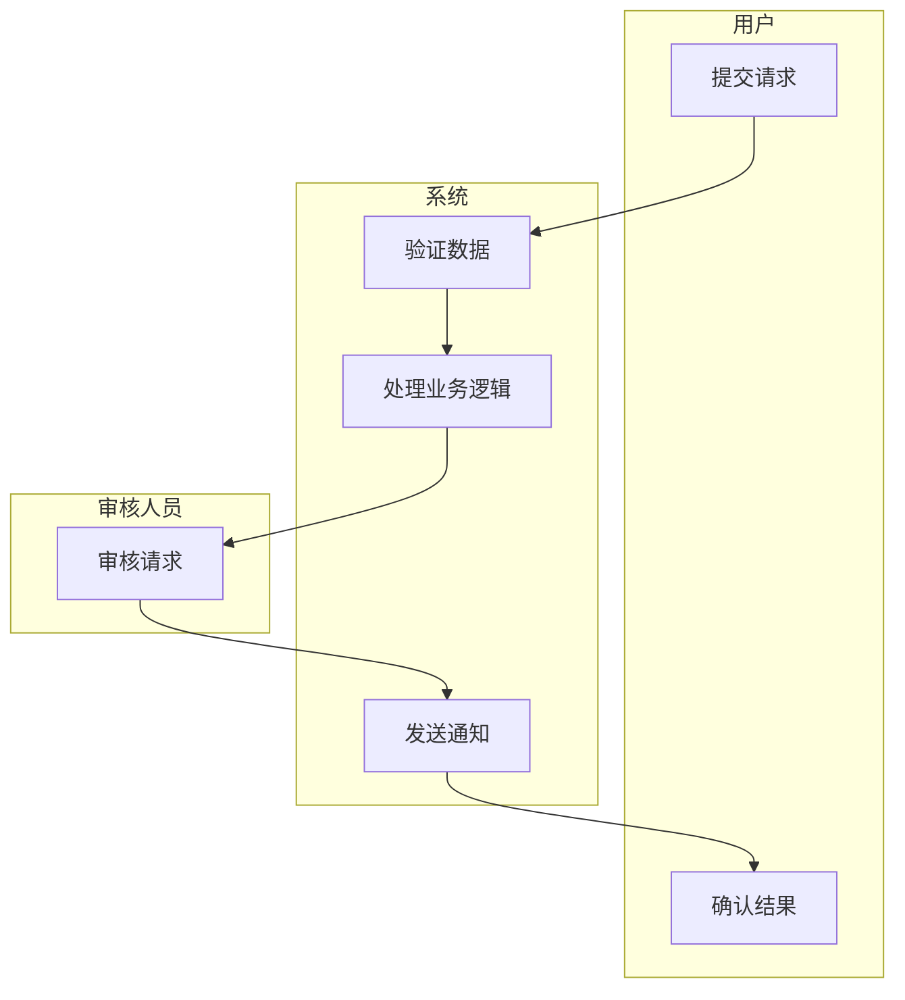
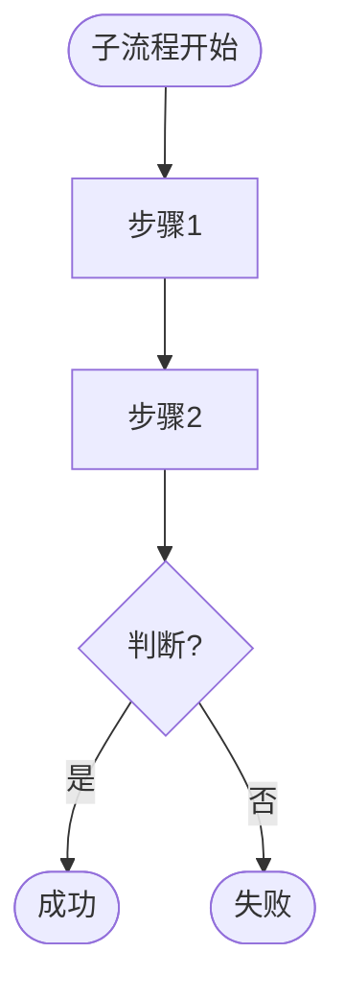
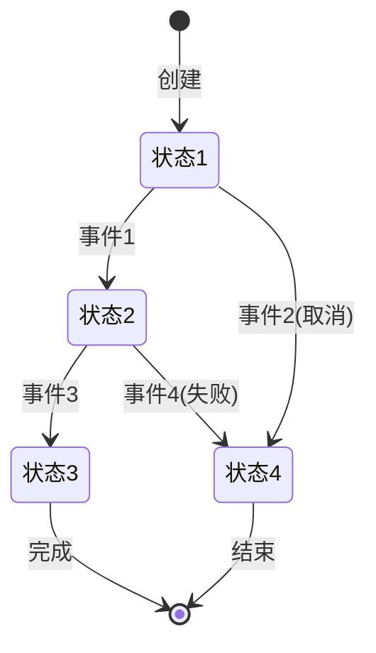
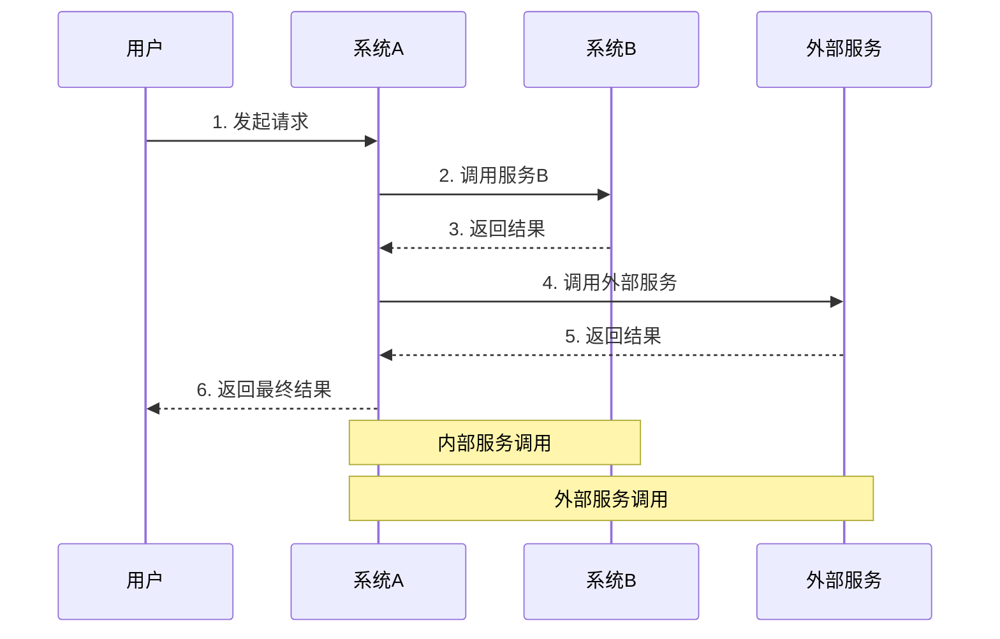

# [流程名称] - 业务流程设计文档

> 📚 **项目记忆引用**
> - 遵循 [项目宪章](mdc:.spec-code/memory/constitution.md) 的核心原则和质量标准
> - 参考 [开发指南](mdc:.spec-code/memory/guidelines.md) 的 Template 编写规范
> - 了解 [项目上下文](mdc:.spec-code/memory/context.md) 的技术栈和项目结构


**文档版本**: v1.0  
**创建日期**: [YYYY-MM-DD]  
**创建人**: [作者姓名]  
**最后更新**: [YYYY-MM-DD]  
**流程类型**: [核心流程/支持流程/管理流程]  
**流程粒度**: [宏观/中观/微观]

---

## 📋 文档说明

本文档描述 [流程名称] 的业务流程设计，包括流程图、状态机、业务规则和异常处理方案。

**目标读者**: 产品经理、开发工程师、测试工程师、架构师

**使用方式**: 
- 作为开发实现的依据
- 作为测试用例设计的参考
- 作为流程优化的基础
- 作为团队沟通的工具

---

## 1. 流程概述

### 1.1 业务场景

<!-- 
  ACTION REQUIRED: 描述业务场景和背景
  Guidelines:
  - 这个流程解决什么业务问题？
  - 在什么场景下触发？
  - 为什么需要这个流程？
-->

**业务背景**:
[描述业务背景，如：为了提升订单处理效率，需要设计自动化的订单处理流程]

**业务价值**:
- [价值1]: [描述]
- [价值2]: [描述]

**适用场景**:
- [场景1]: [描述]
- [场景2]: [描述]

### 1.2 流程边界

**起点**: [流程的触发条件，如：用户提交订单]

**终点**: [流程的结束条件，如：订单完成或取消]

**输入**:
- [输入1]: [类型] - [说明]
- [输入2]: [类型] - [说明]

**输出**:
- [输出1]: [类型] - [说明]
- [输出2]: [类型] - [说明]

**参与者**:
- [参与者1]: [角色说明]
- [参与者2]: [角色说明]
- [系统1]: [系统说明]
- [系统2]: [系统说明]

### 1.3 流程分类

**流程类型**: [核心流程/支持流程/管理流程]

**流程粒度**: [宏观/中观/微观]

**优先级**: [P0/P1/P2]

**预估频率**: [每天X次 / 每月X次]

---

## 2. 主流程设计

### 2.1 流程图

<!-- 
  ACTION REQUIRED: 绘制主流程图
  Guidelines:
  - 使用 Mermaid 语法绘制
  - 保持流程图简洁清晰
  - 复杂逻辑封装为子流程
  - 标注关键决策点
-->



**流程说明**:
1. **[活动1]**: [简要说明]
2. **[判断条件]**: [判断逻辑说明]
3. **[活动2]**: [简要说明]
4. **[活动3]**: [简要说明]
5. **[活动4]**: [简要说明]

### 2.2 泳道图（可选）

<!-- 
  ACTION REQUIRED: 如果流程涉及多个参与者，绘制泳道图
  Guidelines:
  - 每个泳道代表一个参与者
  - 清晰展示职责边界
  - 标注交互点
-->



**职责说明**:
- **用户**: [职责描述]
- **系统**: [职责描述]
- **审核人员**: [职责描述]

### 2.3 子流程（可选）

<!-- 
  ACTION REQUIRED: 如果有复杂逻辑，封装为子流程
  Guidelines:
  - 子流程应该是可复用的
  - 子流程应该有清晰的输入输出
  - 子流程应该可以独立测试
-->

#### 子流程1: [子流程名称]

**触发条件**: [何时调用此子流程]

**输入**: [输入参数]

**输出**: [输出结果]



---

## 3. 状态流转设计

<!-- 
  ACTION REQUIRED: 如果流程涉及状态流转，绘制状态机图
  Guidelines:
  - 只有涉及明确状态的流程才需要此部分
  - 定义清晰的状态和流转规则
  - 标注流转条件
-->

### 3.1 状态定义

**业务对象**: [如：订单、工单、审批单]

**状态列表**:

| 状态代码 | 状态名称 | 说明 | 是否终态 |
|----------|----------|------|----------|
| [CODE1] | [状态1] | [说明] | 否 |
| [CODE2] | [状态2] | [说明] | 否 |
| [CODE3] | [状态3] | [说明] | 是 |
| [CODE4] | [状态4] | [说明] | 是 |

**初始状态**: [初始状态名称]

**终态**: [终态列表]

### 3.2 状态流转图



### 3.3 状态流转规则

| 当前状态 | 触发事件 | 目标状态 | 前置条件 | 后置操作 |
|----------|----------|----------|----------|----------|
| [状态1] | [事件1] | [状态2] | [条件] | [操作] |
| [状态1] | [事件2] | [状态4] | [条件] | [操作] |
| [状态2] | [事件3] | [状态3] | [条件] | [操作] |
| [状态2] | [事件4] | [状态4] | [条件] | [操作] |

**流转约束**:
- [约束1]: [描述]
- [约束2]: [描述]

---

## 4. 关键节点详细说明

<!-- 
  ACTION REQUIRED: 详细说明每个关键节点
  Guidelines:
  - 选择复杂的、重要的节点进行详细说明
  - 包含输入输出、业务逻辑、前后置条件
  - 提供示例
-->

### 4.1 节点：[节点名称]

**节点类型**: [用户任务/服务任务/脚本任务/业务规则任务]

**执行者**: [用户/系统/外部服务]

**职责**: [节点的主要职责]

**输入**:
- `[参数1]`: [类型] - [说明]
- `[参数2]`: [类型] - [说明]

**输出**:
- `[结果1]`: [类型] - [说明]
- `[结果2]`: [类型] - [说明]

**业务逻辑**:
1. [步骤1]: [详细描述]
2. [步骤2]: [详细描述]
3. [步骤3]: [详细描述]

**前置条件**:
- [条件1]: [描述]
- [条件2]: [描述]

**后置条件**:
- [条件1]: [描述]
- [条件2]: [描述]

**性能要求**:
- 响应时间: [要求，如：< 100ms]
- 并发量: [要求，如：1000 QPS]

**示例**:
```
输入示例：
{
  "param1": "value1",
  "param2": "value2"
}

输出示例：
{
  "result1": "value1",
  "result2": "value2"
}
```

### 4.2 节点：[节点名称]

[同上结构]

---

## 5. 业务规则清单

<!-- 
  ACTION REQUIRED: 定义业务规则
  Guidelines:
  - 包含验证规则、计算规则、决策规则、路由规则
  - 规则应该清晰、可测试
  - 提供示例
-->

### 5.1 验证规则

**规则1: [规则名称]**

**描述**: [规则的详细描述]

**条件**:
```
IF [条件1] AND [条件2] THEN
    验证通过
ELSE
    验证失败: [错误信息]
END IF
```

**示例**:
- ✅ 通过: [示例]
- ❌ 失败: [示例]

**规则2: [规则名称]**

[同上结构]

### 5.2 计算规则

**规则1: [规则名称]**

**描述**: [规则的详细描述]

**公式**:
```
[结果] = [计算公式]
```

**示例**:
```
输入: [示例输入]
计算: [计算过程]
输出: [示例输出]
```

### 5.3 决策规则

**规则1: [规则名称]**

**描述**: [规则的详细描述]

**决策逻辑**:
```
IF [条件1] THEN
    [决策1]
ELSE IF [条件2] THEN
    [决策2]
ELSE
    [默认决策]
END IF
```

**决策表**:

| 条件1 | 条件2 | 条件3 | 决策结果 |
|-------|-------|-------|----------|
| 是    | 是    | -     | [结果1]  |
| 是    | 否    | -     | [结果2]  |
| 否    | -     | 是    | [结果3]  |
| 否    | -     | 否    | [结果4]  |

### 5.4 路由规则

**规则1: [规则名称]**

**描述**: [规则的详细描述]

**路由逻辑**:
```
IF [条件1] THEN
    路由到: [目标1]
ELSE IF [条件2] THEN
    路由到: [目标2]
ELSE
    路由到: [默认目标]
END IF
```

### 5.5 约束条件

**数据约束**:
- [约束1]: [描述]
- [约束2]: [描述]

**业务约束**:
- [约束1]: [描述]
- [约束2]: [描述]

**时间约束**:
- [约束1]: [描述]
- [约束2]: [描述]

---

## 6. 异常场景处理

<!-- 
  ACTION REQUIRED: 设计异常处理方案
  Guidelines:
  - 识别所有可能的异常
  - 为每个异常设计处理方案
  - 包含补偿和回滚机制
-->

### 6.1 异常场景清单

| 异常编号 | 异常名称 | 异常类型 | 发生概率 | 影响程度 |
|----------|----------|----------|----------|----------|
| E001 | [异常1] | 业务异常 | 高/中/低 | 高/中/低 |
| E002 | [异常2] | 系统异常 | 高/中/低 | 高/中/低 |
| E003 | [异常3] | 数据异常 | 高/中/低 | 高/中/低 |

### 6.2 异常处理方案

#### 异常E001: [异常名称]

**异常类型**: [业务异常/系统异常/数据异常]

**触发条件**: [何时发生此异常]

**影响范围**: [影响哪些功能或数据]

**处理策略**: [重试/补偿/人工介入/忽略]

**处理步骤**:
1. [步骤1]: [详细描述]
2. [步骤2]: [详细描述]
3. [步骤3]: [详细描述]

**用户提示**: [给用户的提示信息]

**日志记录**: [需要记录的信息]

**监控告警**: [是否需要告警，告警级别]

#### 异常E002: [异常名称]

[同上结构]

### 6.3 补偿机制

#### 补偿场景1: [场景描述]

**触发条件**: [何时需要补偿]

**已执行操作**:
1. [操作1]: [描述]
2. [操作2]: [描述]
3. [操作3]: [描述]

**补偿操作**:
1. [补偿操作1]: [描述] - 对应 [操作3]
2. [补偿操作2]: [描述] - 对应 [操作2]
3. [补偿操作3]: [描述] - 对应 [操作1]

**补偿顺序**: [执行顺序说明，通常与原操作相反]

**补偿失败处理**: [如果补偿失败怎么办]

#### 补偿场景2: [场景描述]

[同上结构]

### 6.4 重试机制

**重试策略**:

| 异常类型 | 重试次数 | 重试间隔 | 退避策略 | 最大间隔 |
|----------|----------|----------|----------|----------|
| [异常1] | 3 | 1s | 指数退避 | 10s |
| [异常2] | 5 | 2s | 固定间隔 | - |
| [异常3] | 3 | 500ms | 固定间隔 | - |

**重试条件**:
- [条件1]: [描述]
- [条件2]: [描述]

**重试失败处理**: [重试次数用尽后如何处理]

### 6.5 超时处理

**超时配置**:

| 操作 | 超时时间 | 超时处理 |
|------|----------|----------|
| [操作1] | [时间] | [处理方式] |
| [操作2] | [时间] | [处理方式] |
| [操作3] | [时间] | [处理方式] |

---

## 7. 系统交互说明

<!-- 
  ACTION REQUIRED: 说明系统交互
  Guidelines:
  - 包含内部服务、外部系统、第三方服务
  - 说明交互方式、接口、超时、失败处理
  - 绘制时序图
-->

### 7.1 系统交互清单

**内部服务**:
- [服务1]: [交互说明]
- [服务2]: [交互说明]

**外部系统**:
- [系统1]: [交互说明]
- [系统2]: [交互说明]

**第三方服务**:
- [服务1]: [交互说明]
- [服务2]: [交互说明]

### 7.2 交互详细说明

#### 交互1: [交互名称]

**类型**: [同步/异步]

**调用方**: [调用方系统]

**被调用方**: [被调用方系统]

**触发时机**: [何时调用]

**接口说明**:
- 接口名称: [名称]
- 请求方式: [GET/POST/...]
- 请求路径: [路径]
- 请求参数: [参数列表]
- 返回结果: [结果说明]

**超时设置**: [超时时间]

**失败处理**: [失败时如何处理]

**依赖级别**: [强依赖/弱依赖]

**降级方案**: [如果服务不可用，如何降级]

#### 交互2: [交互名称]

[同上结构]

### 7.3 时序图



**交互说明**:
1. [步骤1]: [详细说明]
2. [步骤2]: [详细说明]
3. [步骤3]: [详细说明]

---

## 8. 性能与优化考虑

<!-- 
  ACTION REQUIRED: 分析性能要求和优化方案
  Guidelines:
  - 明确性能指标
  - 识别性能瓶颈
  - 提出优化建议
-->

### 8.1 性能要求

**响应时间**:
- 整体流程: [要求，如：< 3s]
- 关键节点: [要求，如：< 500ms]

**并发量**:
- 峰值 QPS: [要求]
- 平均 QPS: [要求]

**数据量**:
- 日处理量: [要求]
- 峰值处理量: [要求]

**可用性**:
- 目标可用性: [要求，如：99.9%]
- 故障恢复时间: [要求]

### 8.2 性能瓶颈分析

**潜在瓶颈**:
1. [瓶颈1]: [描述] - [影响]
2. [瓶颈2]: [描述] - [影响]
3. [瓶颈3]: [描述] - [影响]

### 8.3 优化建议

**并行处理**:
- [建议1]: 将 [任务A] 和 [任务B] 改为并行执行，预计提升 [X%] 性能
- [建议2]: 使用异步消息处理 [任务C]，避免阻塞主流程

**缓存优化**:
- [建议1]: 缓存 [数据1]，减少数据库查询，预计提升 [X%] 性能
- [建议2]: 使用本地缓存 [数据2]，减少网络开销

**批量处理**:
- [建议1]: 将 [操作1] 改为批量处理，减少数据库交互次数
- [建议2]: 使用消息队列削峰填谷，提升系统稳定性

**数据库优化**:
- [建议1]: 为 [字段] 添加索引，提升查询性能
- [建议2]: 使用分库分表，支持更大数据量

### 8.4 幂等性设计

**需要幂等的操作**:
- [操作1]: [幂等性设计方案]
- [操作2]: [幂等性设计方案]

**幂等性实现方式**:
- 使用唯一标识（如：订单号、请求ID）
- 使用数据库唯一约束
- 使用分布式锁
- 使用状态机（只允许特定状态流转）

**幂等性验证**:
- [验证方法1]: [描述]
- [验证方法2]: [描述]

---

## 9. 监控与分析

<!-- 
  ACTION REQUIRED: 设计监控方案
  Guidelines:
  - 定义监控指标
  - 设计告警规则
  - 提供分析方法
-->

### 9.1 监控指标

**流程指标**:
- 流程实例数（总数、成功数、失败数）
- 流程耗时（平均、最大、最小、P95、P99）
- 流程完成率
- 流程异常率

**任务指标**:
- 任务耗时（每个任务的耗时分布）
- 任务成功率
- 任务重试次数

**业务指标**:
- [业务指标1]: [说明]
- [业务指标2]: [说明]

### 9.2 告警规则

| 告警项 | 告警条件 | 告警级别 | 处理方式 |
|--------|----------|----------|----------|
| 流程失败率过高 | 失败率 > 5% | 严重 | 立即处理 |
| 流程耗时过长 | P95 > 5s | 警告 | 优化流程 |
| 任务重试频繁 | 重试次数 > 100/分钟 | 警告 | 检查依赖服务 |

### 9.3 分析方法

**流程挖掘**:
- 分析实际执行路径
- 识别常见路径和异常路径
- 发现流程优化机会

**瓶颈分析**:
- 识别耗时最长的任务
- 分析任务耗时分布
- 提出优化建议

**异常分析**:
- 统计异常类型和频率
- 分析异常原因
- 制定改进措施

---

## 10. 测试建议

<!-- 
  ACTION REQUIRED: 提供测试建议
  Guidelines:
  - 包含功能测试、异常测试、性能测试
  - 提供测试用例示例
-->

### 10.1 功能测试

**正常流程测试**:
- [测试用例1]: [描述]
- [测试用例2]: [描述]

**分支流程测试**:
- [测试用例1]: [描述]
- [测试用例2]: [描述]

**边界条件测试**:
- [测试用例1]: [描述]
- [测试用例2]: [描述]

### 10.2 异常测试

**业务异常测试**:
- [测试用例1]: [描述]
- [测试用例2]: [描述]

**系统异常测试**:
- [测试用例1]: [描述]
- [测试用例2]: [描述]

**补偿机制测试**:
- [测试用例1]: [描述]
- [测试用例2]: [描述]

### 10.3 性能测试

**压力测试**:
- 测试目标: [目标]
- 测试场景: [场景]
- 预期结果: [结果]

**并发测试**:
- 测试目标: [目标]
- 测试场景: [场景]
- 预期结果: [结果]

---

## 11. 变更历史

| 版本 | 日期 | 作者 | 变更内容 |
|------|------|------|----------|
| v1.0 | [YYYY-MM-DD] | [作者] | 初始版本 |
| v1.1 | [YYYY-MM-DD] | [作者] | [变更说明] |

---

## 12. 附录

### 12.1 术语表

| 术语 | 说明 |
|------|------|
| [术语1] | [说明] |
| [术语2] | [说明] |

### 12.2 参考资料

- [参考资料1]: [链接或说明]
- [参考资料2]: [链接或说明]

### 12.3 相关文档

- [文档1]: [链接]
- [文档2]: [链接]

---

## 📝 填写指南

### 必填部分
- ✅ 第1章：流程概述（必填）
- ✅ 第2章：主流程设计（必填）
- ✅ 第4章：关键节点详细说明（必填）
- ✅ 第5章：业务规则清单（必填）
- ✅ 第6章：异常场景处理（必填）

### 可选部分
- ⭕ 第3章：状态流转设计（如果流程涉及状态流转）
- ⭕ 第7章：系统交互说明（如果流程涉及系统交互）
- ⭕ 第8章：性能与优化考虑（如果有性能要求）
- ⭕ 第9章：监控与分析（推荐填写）
- ⭕ 第10章：测试建议（推荐填写）

### 填写技巧
1. **保持简洁**: 流程图尽量简洁，复杂逻辑封装为子流程
2. **使用示例**: 为规则和节点提供具体示例
3. **考虑异常**: 不要只考虑正常流程，要充分考虑异常场景
4. **关注性能**: 识别性能瓶颈，提前优化
5. **便于维护**: 文档结构清晰，便于后续维护和更新
