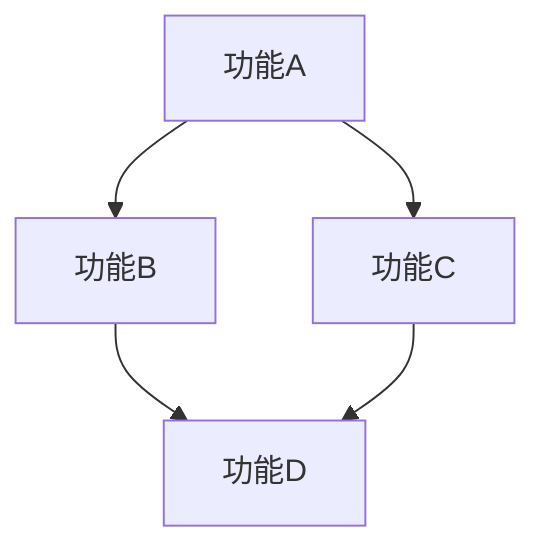

# 需求收集文档

## 基本信息

| 项目 | 内容 |
|------|------|
| **项目名称** | [项目名称] |
| **收集日期** | [YYYY-MM-DD] |
| **收集人** | [姓名] |
| **需求来源** | [来源：用户输入/文档/讨论/其他] |
| **版本号** | 1.0.0 |

---

## 1. 业务背景

### 1.1 业务目标

**为什么要做这个功能？**

[描述业务目标，例如：提升用户留存率、降低运营成本、开拓新市场等]

### 1.2 目标用户

**谁会使用这个功能？**

- **主要用户角色**：[用户角色1]
- **次要用户角色**：[用户角色2]
- **用户画像**：[年龄、职业、技能水平、使用频率等]

### 1.3 使用场景

**在什么情况下使用？**

1. **场景1**：[描述具体场景]
   - 前置条件：[条件]
   - 用户操作：[操作步骤]
   - 预期结果：[结果]

2. **场景2**：[描述具体场景]
   - 前置条件：[条件]
   - 用户操作：[操作步骤]
   - 预期结果：[结果]

### 1.4 业务价值

**能带来什么价值？**

- **定量价值**：[可量化的指标，如提升20%转化率、降低30%成本]
- **定性价值**：[不可量化的价值，如提升用户体验、增强品牌形象]

---

## 2. 核心功能需求

### 2.1 功能列表

| 序号 | 功能名称 | 功能描述 | 初步优先级 | 备注 |
|------|---------|---------|----------|------|
| 1 | [功能1] | [简要描述] | P0/P1/P2 | [备注] |
| 2 | [功能2] | [简要描述] | P0/P1/P2 | [备注] |
| 3 | [功能3] | [简要描述] | P0/P1/P2 | [备注] |

### 2.2 功能详细描述

#### 功能1：[功能名称]

**功能描述**：
[详细描述该功能的作用和使用方式]

**用户故事**：
```
As a [用户角色]
I want [功能描述]
So that [业务价值]
```

**主要操作流程**：
1. [步骤1]
2. [步骤2]
3. [步骤3]

**输入数据**：
- [输入1]：[数据类型]
- [输入2]：[数据类型]

**输出结果**：
- [输出1]：[数据类型]
- [输出2]：[数据类型]

**相关功能**：
- 依赖功能：[功能名称]
- 被依赖功能：[功能名称]

---

#### 功能2：[功能名称]

[按照功能1的格式继续描述其他功能]

---

## 3. 非功能需求

### 3.1 性能需求

**响应时间**：
- [功能名称]：[具体指标，如<500ms]
- [功能名称]：[具体指标，如<2s]

**并发量**：
- 预期同时在线用户数：[数字]
- 预期并发请求数：[数字]

**吞吐量**：
- 预期每秒处理请求数：[数字]
- 预期每天处理数据量：[数字]

### 3.2 安全需求

**认证方式**：
- [认证方式，如JWT Token、OAuth、SSO等]

**授权控制**：
- [权限模型，如RBAC、ABAC等]
- [具体权限规则]

**数据加密**：
- [加密要求，如HTTPS、数据库字段加密等]

**审计日志**：
- [审计日志要求]

### 3.3 可用性需求

**SLA 要求**：
- 可用性指标：[如99.9%]
- 允许停机时间：[如每月43.2分钟]

**容错机制**：
- [容错方案，如自动重试、故障转移等]

**灾难恢复**：
- [灾备方案，如异地备份、主从切换等]

### 3.4 兼容性需求

**浏览器兼容性**：
- [支持的浏览器版本]

**设备兼容性**：
- [支持的设备类型]

**操作系统兼容性**：
- [支持的操作系统]

### 3.5 可维护性需求

**日志记录**：
- [日志级别要求]
- [日志内容要求]

**监控告警**：
- [监控指标]
- [告警规则]

**可扩展性**：
- [扩展性要求]

---

## 4. 约束与假设

### 4.1 技术约束

- **技术栈**：[使用的技术栈]
- **依赖服务**：[依赖的外部服务]
- **中间件**：[使用的中间件]
- **部署环境**：[部署环境]

### 4.2 业务约束

- **时间限制**：[项目周期、上线时间等]
- **预算限制**：[预算范围]
- **人力限制**：[团队规模、技能要求等]
- **法律法规**：[需要遵守的法律法规]

### 4.3 假设条件

- **假设1**：[描述假设]
- **假设2**：[描述假设]

---

## 5. 功能依赖关系

### 5.1 依赖关系图



### 5.2 实现顺序建议

1. **第一阶段**：[功能列表]
2. **第二阶段**：[功能列表]
3. **第三阶段**：[功能列表]

---

## 6. 初步分类

### 6.1 功能分类

| 分类 | 功能 | 说明 |
|------|------|------|
| **核心功能** | [功能1, 功能2] | 项目成功的必要条件 |
| **扩展功能** | [功能3, 功能4] | 增强用户体验的功能 |
| **可选功能** | [功能5, 功能6] | 可根据时间调整的功能 |

### 6.2 优先级分类

| 优先级 | 功能 | 理由 |
|--------|------|------|
| **P0（必须）** | [功能1, 功能2] | [理由] |
| **P1（重要）** | [功能3, 功能4] | [理由] |
| **P2（可选）** | [功能5, 功能6] | [理由] |

---

## 7. 相关利益方

### 7.1 干系人清单

| 角色 | 姓名 | 联系方式 | 关键关注点 |
|------|------|---------|----------|
| 产品经理 | [姓名] | [邮箱/电话] | [关注点] |
| 技术负责人 | [姓名] | [邮箱/电话] | [关注点] |
| 用户代表 | [姓名] | [邮箱/电话] | [关注点] |
| 运营负责人 | [姓名] | [邮箱/电话] | [关注点] |

### 7.2 沟通计划

- **需求评审会**：[时间]
- **澄清会议**：[时间]
- **验收会议**：[时间]

---

## 8. 附录

### 8.1 参考资料

- [资料1]：[链接或描述]
- [资料2]：[链接或描述]

### 8.2 术语定义

| 术语 | 定义 |
|------|------|
| [术语1] | [定义] |
| [术语2] | [定义] |

### 8.3 变更历史

| 版本 | 日期 | 变更内容 | 变更人 |
|------|------|---------|--------|
| 1.0.0 | [日期] | 初始版本 | [姓名] |

---

## 下一步行动

- [ ] 需求评审会议
- [ ] 需求澄清（使用 clarify-requirements 命令）
- [ ] 需求验证（使用 validate-requirements 命令）
- [ ] 规格生成（使用 gen-spec 命令）
