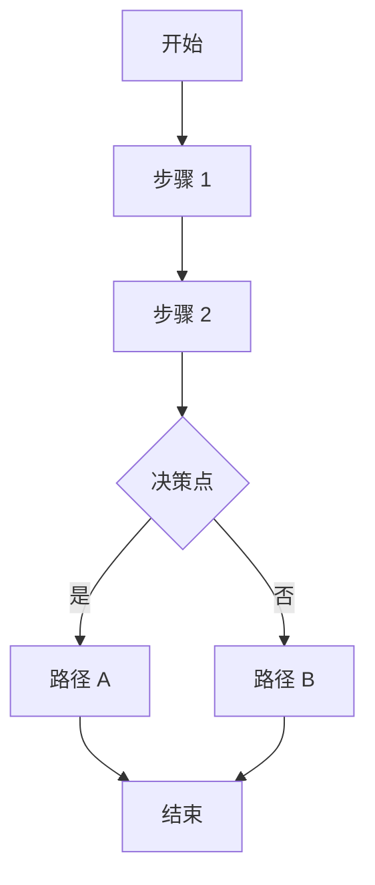
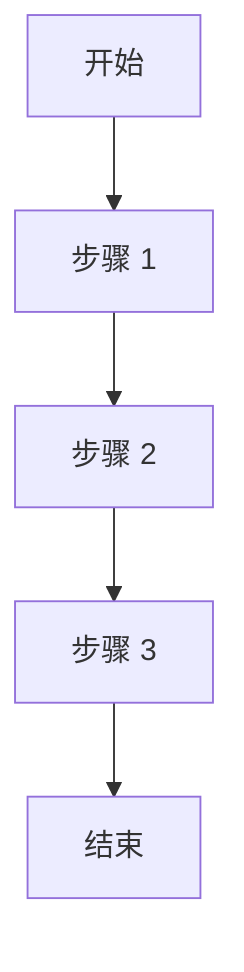

# Skill 参考文档: [Skill 名称]

> 📚 **项目记忆引用**
> - 遵循 [项目宪章](mdc:.spec-code/memory/constitution.md) 的核心原则
> - 参考 [开发指南](mdc:.spec-code/memory/guidelines.md) 的 Skill 编写规范

## 📖 详细参考

### 概念 1: [概念名称]

**定义**: [清晰的定义]

**关键特性**:
- [特性 1]
- [特性 2]
- [特性 3]

**使用场景**:
- [场景 1]
- [场景 2]

**示例**:
```
[代码或示例]
```

### 概念 2: [概念名称]

**定义**: [清晰的定义]

**关键特性**:
- [特性 1]
- [特性 2]

**使用场景**:
- [场景 1]
- [场景 2]

**示例**:
```
[代码或示例]
```

## 🔧 API 参考

### 函数 1: [函数名称]

**签名**:
```
[函数签名]
```

**参数**:
| 参数 | 类型 | 说明 | 必需 |\n|------|------|------|------|\n| param1 | string | [说明] | ✅ |\n| param2 | number | [说明] | ❌ |

**返回值**:
```
[返回值类型和说明]
```

**示例**:
```
[使用示例]
```

### 函数 2: [函数名称]

**签名**:
```
[函数签名]
```

**参数**:
| 参数 | 类型 | 说明 | 必需 |\n|------|------|------|------|\n| param1 | string | [说明] | ✅ |

**返回值**:
```
[返回值类型和说明]
```

**示例**:
```
[使用示例]
```

## ⚙️ 配置选项

### 选项 1: [选项名称]

**类型**: [类型]

**默认值**: [默认值]

**说明**: [详细说明]

**可选值**:
- [值 1]
- [值 2]
- [值 3]

**示例**:
```
[配置示例]
```

### 选项 2: [选项名称]

**类型**: [类型]

**默认值**: [默认值]

**说明**: [详细说明]

**可选值**:
- [值 1]
- [值 2]

**示例**:
```
[配置示例]
```

## 📊 数据结构

### 结构 1: [结构名称]

**说明**: [结构说明]

**字段**:
| 字段 | 类型 | 说明 | 必需 |\n|------|------|------|------|\n| field1 | string | [说明] | ✅ |\n| field2 | number | [说明] | ❌ |\n| field3 | array | [说明] | ❌ |

**示例**:
```json
{
  "field1": "value1",
  "field2": 123,
  "field3": ["item1", "item2"]
}
```

### 结构 2: [结构名称]

**说明**: [结构说明]

**字段**:
| 字段 | 类型 | 说明 | 必需 |\n|------|------|------|------|\n| field1 | string | [说明] | ✅ |\n| field2 | object | [说明] | ❌ |

**示例**:
```json
{
  "field1": "value1",
  "field2": {
    "nested": "value"
  }
}
```

## 🔄 工作流程

### 流程 1: [流程名称]



**详细说明**:
1. [步骤 1 详解]
2. [步骤 2 详解]
3. [决策点详解]
4. [路径 A 详解]
5. [路径 B 详解]

### 流程 2: [流程名称]



**详细说明**:
1. [步骤 1 详解]
2. [步骤 2 详解]
3. [步骤 3 详解]

## 🎯 性能优化

### 优化 1: [优化名称]

**问题**: [性能问题描述]

**解决方案**: [优化方案]

**效果**: [预期效果]

**示例**:
```
[优化前]
[优化后]
```

### 优化 2: [优化名称]

**问题**: [性能问题描述]

**解决方案**: [优化方案]

**效果**: [预期效果]

**示例**:
```
[优化前]
[优化后]
```

## 🔒 安全考虑

### 安全问题 1: [问题名称]

**风险**: [风险描述]

**防护措施**: [防护措施]

**示例**:
```
[安全的做法]
```

### 安全问题 2: [问题名称]

**风险**: [风险描述]

**防护措施**: [防护措施]

**示例**:
```
[安全的做法]
```

## ❓ 常见问题

### Q1: [问题]

**A**: [答案]

### Q2: [问题]

**A**: [答案]

### Q3: [问题]

**A**: [答案]

## 📚 相关资源

### 官方文档
- [资源 1](https://example.com)
- [资源 2](https://example.com)

### 项目文档
- [相关文档 1](mdc:docs/reference.md)
- [相关文档 2](mdc:docs/reference.md)

### 外部资源
- [外部资源 1](https://example.com)
- [外部资源 2](https://example.com)

---

**版本**: 1.0.0  
**最后更新**: 2025-11-04  
**维护者**: Spec-Code Team
