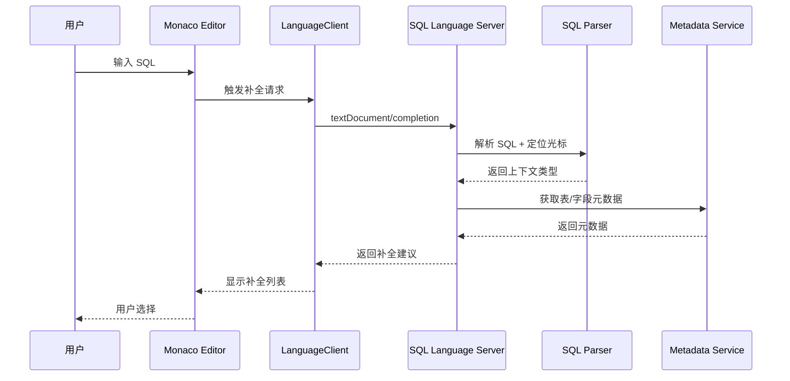

# SQL Language Server 技术设计文档

## 1. 概述

本文档描述 SQL 编辑器智能功能的技术实现方案，采用 **monaco-languageclient + LSP (Language Server Protocol)** 架构。

### 1.1 目标功能

| 功能 | 说明 | 优先级 |
|------|------|--------|
| 自动补全 | 智能联想表、字段、关键字、函数 | P0 |
| 语法错误识别 | 实时语法检查，红色波浪线提示 | P0 |
| 代码格式化 | SQL 代码美化 | P1 |
| 悬浮提示 | 显示表/字段/函数的详细信息 | P1 |

### 1.2 技术选型

| 组件 | 选型 | 说明 |
|------|------|------|
| 编辑器 | Monaco Editor | 已集成 |
| LSP 客户端 | monaco-languageclient | 连接 Monaco 和 Language Server |
| LSP 服务端 | vscode-languageserver | 实现 LSP 协议的服务端框架 |
| SQL 解析器 | sql-parser-cst | 轻量级 TypeScript SQL 解析器 |
| SQL 格式化 | sql-formatter | SQL 代码格式化 |
| 进程通信 | vscode-jsonrpc | LSP 消息传输 |

---

## 2. 架构设计

### 2.1 整体架构

```
┌─────────────────────────────────────────────────────────────────────────────┐
│                              Electron 应用                                   │
├─────────────────────────────────────────────────────────────────────────────┤
│                                                                             │
│  ┌─────────────────────────────────────────────────────────────────────┐   │
│  │                        Renderer 进程                                 │   │
│  │  ┌─────────────────┐    ┌──────────────────────────────────────┐   │   │
│  │  │  Monaco Editor  │◄──►│     monaco-languageclient            │   │   │
│  │  │                 │    │  - 补全请求 (textDocument/completion) │   │   │
│  │  │  - SQL 编辑     │    │  - 诊断接收 (textDocument/diagnostic) │   │   │
│  │  │  - 语法高亮     │    │  - 悬浮请求 (textDocument/hover)      │   │   │
│  │  │  - 补全展示     │    │  - 格式化 (textDocument/formatting)   │   │   │
│  │  └─────────────────┘    └──────────────────────────────────────┘   │   │
│  │                                        │                            │   │
│  │                                        │ IPC (JSON-RPC)             │   │
│  │                                        ▼                            │   │
│  └─────────────────────────────────────────────────────────────────────┘   │
│                                           │                                 │
│                                           │                                 │
│  ┌─────────────────────────────────────────────────────────────────────┐   │
│  │                         Main 进程                                    │   │
│  │  ┌──────────────────────────────────────────────────────────────┐   │   │
│  │  │                   SQL Language Server                         │   │   │
│  │  │  ┌────────────────┐  ┌────────────────┐  ┌────────────────┐  │   │   │
│  │  │  │ CompletionProvider │ DiagnosticProvider │ HoverProvider   │  │   │   │
│  │  │  │ - 上下文分析   │  │ - 语法检查     │  │ - 元数据查询  │  │   │   │
│  │  │  │ - 建议生成     │  │ - 错误定位     │  │ - 信息组装    │  │   │   │
│  │  │  └────────────────┘  └────────────────┘  └────────────────┘  │   │   │
│  │  │                              │                                │   │   │
│  │  │  ┌────────────────────────────────────────────────────────┐  │   │   │
│  │  │  │                  SQL Parser Service                     │  │   │   │
│  │  │  │  - sql-parser-cst 解析                                  │  │   │   │
│  │  │  │  - AST 遍历与分析                                       │  │   │   │
│  │  │  │  - 光标位置上下文识别                                   │  │   │   │
│  │  │  └────────────────────────────────────────────────────────┘  │   │   │
│  │  │                              │                                │   │   │
│  │  │  ┌────────────────────────────────────────────────────────┐  │   │   │
│  │  │  │                  Metadata Service                       │  │   │   │
│  │  │  │  - 从 connectionStore 获取数据库元数据                  │  │   │   │
│  │  │  │  - 表/视图/字段/函数信息缓存                            │  │   │   │
│  │  │  └────────────────────────────────────────────────────────┘  │   │   │
│  │  └──────────────────────────────────────────────────────────────┘   │   │
│  └─────────────────────────────────────────────────────────────────────┘   │
│                                                                             │
└─────────────────────────────────────────────────────────────────────────────┘
```

### 2.2 数据流



---

## 3. 模块设计

### 3.1 目录结构

```
src/
├── main/
│   └── sql-language-server/
│       ├── index.ts                 # Language Server 入口
│       ├── server.ts                # LSP Server 实现
│       ├── providers/
│       │   ├── completionProvider.ts    # 自动补全
│       │   ├── diagnosticProvider.ts    # 语法诊断
│       │   ├── hoverProvider.ts         # 悬浮提示
│       │   └── formattingProvider.ts    # 代码格式化
│       ├── services/
│       │   ├── sqlParserService.ts      # SQL 解析服务
│       │   ├── metadataService.ts       # 元数据服务
│       │   └── contextAnalyzer.ts       # 上下文分析器
│       └── types/
│           └── index.ts                 # 类型定义
│
├── renderer/
│   └── services/
│       └── languageClient.ts        # Language Client 初始化
```

### 3.2 核心类型定义

```typescript
// src/main/sql-language-server/types/index.ts

/**
 * 光标上下文类型
 */
export type CursorContextType =
  | 'STATEMENT_START'      // 语句开始，提示关键字
  | 'SELECT_COLUMNS'       // SELECT 列位置
  | 'FROM_CLAUSE'          // FROM 后，提示表/视图/函数
  | 'JOIN_CLAUSE'          // JOIN 后，提示表/视图/函数
  | 'WHERE_CLAUSE'         // WHERE 后，提示字段/函数
  | 'ON_CLAUSE'            // ON 后，提示字段
  | 'TABLE_DOT'            // 表名. 后，提示该表字段
  | 'SUBQUERY_COLUMNS'     // 子查询字段
  | 'IN_COMMENT'           // 注释内，不提示
  | 'DDL_CREATE'           // CREATE 语句
  | 'DDL_ALTER'            // ALTER 语句
  | 'UNKNOWN'              // 未知，提示关键字+表

/**
 * 光标上下文
 */
export interface CursorContext {
  type: CursorContextType
  tables?: TableRef[]           // 当前语句涉及的表
  targetTable?: string          // 表名. 后的目标表
  subqueryColumns?: string[]    // 子查询字段列表
}

/**
 * 表引用（含别名）
 */
export interface TableRef {
  name: string
  alias?: string
  database?: string
}

/**
 * 数据库元数据
 */
export interface DatabaseMetadata {
  connectionId: string
  databaseName: string
  tables: TableMetadata[]
  views: ViewMetadata[]
  functions: FunctionMetadata[]
}

/**
 * 表元数据
 */
export interface TableMetadata {
  name: string
  comment?: string
  columns: ColumnMetadata[]
}

/**
 * 字段元数据
 */
export interface ColumnMetadata {
  name: string
  type: string
  nullable: boolean
  defaultValue?: string
  comment?: string
  isPrimaryKey?: boolean
}

/**
 * 视图元数据
 */
export interface ViewMetadata {
  name: string
  comment?: string
}

/**
 * 函数元数据
 */
export interface FunctionMetadata {
  name: string
  signature: string
  description?: string
  returnType?: string
}
```

### 3.3 SQL 解析服务

```typescript
// src/main/sql-language-server/services/sqlParserService.ts

import { parse } from 'sql-parser-cst'
import type { CursorContext, TableRef } from '../types'

export class SqlParserService {
  /**
   * 解析 SQL 并返回光标位置的上下文
   */
  analyzeCursorContext(sql: string, offset: number): CursorContext {
    // 1. 检查是否在注释中
    if (this.isInComment(sql, offset)) {
      return { type: 'IN_COMMENT' }
    }

    // 2. 提取当前语句
    const { statement, offsetInStatement } = this.extractCurrentStatement(sql, offset)

    // 3. 尝试 AST 解析
    try {
      const ast = parse(statement, { dialect: 'mysql' })
      return this.analyzeAst(ast, offsetInStatement, statement)
    } catch {
      // 4. 解析失败，降级处理
      return this.fallbackAnalysis(statement, offsetInStatement)
    }
  }

  /**
   * 检查光标是否在注释内
   */
  private isInComment(sql: string, offset: number): boolean {
    // 检查 -- 单行注释
    const lineStart = sql.lastIndexOf('\n', offset - 1) + 1
    const lineBeforeCursor = sql.substring(lineStart, offset)
    if (lineBeforeCursor.includes('--')) {
      return true
    }

    // 检查 /* */ 块注释
    let inBlock = false
    let i = 0
    while (i < offset) {
      if (sql.substring(i, i + 2) === '/*') {
        inBlock = true
        i += 2
      } else if (sql.substring(i, i + 2) === '*/') {
        inBlock = false
        i += 2
      } else {
        i++
      }
    }
    return inBlock
  }

  /**
   * 从完整 SQL 中提取光标所在的单条语句
   */
  private extractCurrentStatement(sql: string, offset: number): {
    statement: string
    offsetInStatement: number
  } {
    // 按分号分割，考虑字符串内的分号
    const statements: { start: number; end: number; text: string }[] = []
    let start = 0
    let inString = false
    let stringChar = ''

    for (let i = 0; i < sql.length; i++) {
      const char = sql[i]
      if (!inString && (char === "'" || char === '"' || char === '`')) {
        inString = true
        stringChar = char
      } else if (inString && char === stringChar) {
        inString = false
      } else if (!inString && char === ';') {
        statements.push({ start, end: i + 1, text: sql.substring(start, i + 1) })
        start = i + 1
      }
    }
    // 最后一条语句（可能没有分号）
    if (start < sql.length) {
      statements.push({ start, end: sql.length, text: sql.substring(start) })
    }

    // 找到包含光标的语句
    for (const stmt of statements) {
      if (offset >= stmt.start && offset <= stmt.end) {
        return {
          statement: stmt.text,
          offsetInStatement: offset - stmt.start
        }
      }
    }

    return { statement: sql, offsetInStatement: offset }
  }

  /**
   * 分析 AST 确定光标上下文
   */
  private analyzeAst(ast: any, offset: number, sql: string): CursorContext {
    // 收集所有表引用
    const tables = this.extractTablesFromAst(ast)
    
    // 根据 AST 节点类型和光标位置确定上下文
    // 具体实现依赖 sql-parser-cst 的 AST 结构
    
    return this.fallbackAnalysis(sql, offset)
  }

  /**
   * 从 AST 中提取表引用
   */
  private extractTablesFromAst(ast: any): TableRef[] {
    const tables: TableRef[] = []
    // 遍历 AST 收集 FROM、JOIN 中的表
    // 具体实现依赖 sql-parser-cst 的 AST 结构
    return tables
  }

  /**
   * 解析失败时的降级分析（基于正则）
   */
  private fallbackAnalysis(sql: string, offset: number): CursorContext {
    const textBefore = sql.substring(0, offset)
    const upperTextBefore = textBefore.toUpperCase()
    const fullText = sql.toUpperCase()

    // FROM/JOIN 后
    if (/\b(FROM|JOIN)\s*$/i.test(textBefore)) {
      return { type: 'FROM_CLAUSE' }
    }

    // 表名. 后
    const dotMatch = textBefore.match(/(\w+)\.\s*$/i)
    if (dotMatch) {
      return { type: 'TABLE_DOT', targetTable: dotMatch[1] }
    }

    // SELECT 后且有 FROM（光标在 SELECT 和 FROM 之间）
    if (/\bSELECT\b/i.test(upperTextBefore) && /\bFROM\b/i.test(fullText)) {
      const tables = this.extractTablesFromSql(sql)
      return { type: 'SELECT_COLUMNS', tables }
    }

    // WHERE 后
    if (/\bWHERE\b/i.test(upperTextBefore)) {
      const tables = this.extractTablesFromSql(sql)
      return { type: 'WHERE_CLAUSE', tables }
    }

    // ON 后
    if (/\bON\s+$/i.test(textBefore)) {
      const tables = this.extractTablesFromSql(sql)
      return { type: 'ON_CLAUSE', tables }
    }

    // CREATE 语句
    if (/\bCREATE\b/i.test(upperTextBefore)) {
      return { type: 'DDL_CREATE' }
    }

    // ALTER 语句
    if (/\bALTER\b/i.test(upperTextBefore)) {
      return { type: 'DDL_ALTER' }
    }

    // SELECT 后但没有 FROM
    if (/\bSELECT\s+$/i.test(textBefore) && !/\bFROM\b/i.test(fullText)) {
      return { type: 'UNKNOWN' }
    }

    return { type: 'STATEMENT_START' }
  }

  /**
   * 从 SQL 文本中提取表引用（降级方案）
   */
  private extractTablesFromSql(sql: string): TableRef[] {
    const tables: TableRef[] = []
    
    // 匹配 FROM table1 [AS] alias1, table2 alias2
    // 匹配 JOIN table3 [AS] alias3
    const fromMatch = sql.match(/\bFROM\s+([^;]+?)(?:\bWHERE\b|\bGROUP\b|\bORDER\b|\bLIMIT\b|$)/i)
    if (fromMatch) {
      const fromClause = fromMatch[1]
      // 处理 JOIN
      const parts = fromClause.split(/\b(?:INNER|LEFT|RIGHT|OUTER|CROSS)?\s*JOIN\b/i)
      for (const part of parts) {
        const tableMatch = part.trim().match(/^(\w+)(?:\s+(?:AS\s+)?(\w+))?/i)
        if (tableMatch) {
          tables.push({
            name: tableMatch[1],
            alias: tableMatch[2]
          })
        }
      }
    }
    
    return tables
  }
}
```

### 3.4 补全提供者

```typescript
// src/main/sql-language-server/providers/completionProvider.ts

import {
  CompletionItem,
  CompletionItemKind,
  TextDocumentPositionParams,
} from 'vscode-languageserver'
import { SqlParserService } from '../services/sqlParserService'
import { MetadataService } from '../services/metadataService'
import type { CursorContext } from '../types'

export class CompletionProvider {
  private sqlParser: SqlParserService
  private metadataService: MetadataService

  constructor(metadataService: MetadataService) {
    this.sqlParser = new SqlParserService()
    this.metadataService = metadataService
  }

  async provideCompletionItems(
    params: TextDocumentPositionParams,
    documentText: string
  ): Promise<CompletionItem[]> {
    const offset = this.getOffset(documentText, params.position)
    const context = this.sqlParser.analyzeCursorContext(documentText, offset)

    const suggestions: CompletionItem[] = []

    switch (context.type) {
      case 'IN_COMMENT':
        // 注释内不提示
        break

      case 'STATEMENT_START':
        this.addKeywordSuggestions(suggestions)
        break

      case 'FROM_CLAUSE':
      case 'JOIN_CLAUSE':
        await this.addTableSuggestions(suggestions)
        await this.addViewSuggestions(suggestions)
        this.addFunctionSuggestions(suggestions)
        break

      case 'SELECT_COLUMNS':
      case 'WHERE_CLAUSE':
      case 'ON_CLAUSE':
        if (context.tables) {
          await this.addColumnSuggestionsForTables(suggestions, context.tables)
        }
        this.addFunctionSuggestions(suggestions)
        break

      case 'TABLE_DOT':
        if (context.targetTable) {
          await this.addColumnSuggestionsForTable(suggestions, context.targetTable)
        }
        break

      case 'SUBQUERY_COLUMNS':
        if (context.subqueryColumns) {
          this.addSubqueryColumnSuggestions(suggestions, context.subqueryColumns)
        }
        break

      case 'DDL_CREATE':
      case 'DDL_ALTER':
        this.addDdlSuggestions(suggestions, context.type)
        break

      default:
        this.addKeywordSuggestions(suggestions)
        await this.addTableSuggestions(suggestions)
    }

    // 去重 + 排序 + 限制 20 条
    return this.finalizeSuggestions(suggestions)
  }

  private getOffset(text: string, position: { line: number; character: number }): number {
    const lines = text.split('\n')
    let offset = 0
    for (let i = 0; i < position.line; i++) {
      offset += lines[i].length + 1
    }
    offset += position.character
    return offset
  }

  private addKeywordSuggestions(suggestions: CompletionItem[]): void {
    const keywords = [
      'SELECT', 'FROM', 'WHERE', 'AND', 'OR', 'NOT', 'IN', 'LIKE', 'BETWEEN',
      'INSERT', 'INTO', 'VALUES', 'UPDATE', 'SET', 'DELETE',
      'CREATE', 'TABLE', 'VIEW', 'INDEX', 'FUNCTION', 'PROCEDURE', 'TRIGGER',
      'ALTER', 'DROP', 'TRUNCATE',
      'JOIN', 'INNER', 'LEFT', 'RIGHT', 'OUTER', 'ON',
      'GROUP', 'BY', 'HAVING', 'ORDER', 'ASC', 'DESC', 'LIMIT', 'OFFSET',
      'UNION', 'ALL', 'DISTINCT', 'AS',
      'PRIMARY', 'KEY', 'FOREIGN', 'REFERENCES', 'UNIQUE', 'DEFAULT',
      'INT', 'VARCHAR', 'TEXT', 'DATE', 'DATETIME', 'TIMESTAMP', 'BOOLEAN', 'DECIMAL'
    ]

    for (const keyword of keywords) {
      suggestions.push({
        label: keyword,
        kind: CompletionItemKind.Keyword,
        insertText: keyword,
        detail: 'SQL 关键字'
      })
    }
  }

  private async addTableSuggestions(suggestions: CompletionItem[]): Promise<void> {
    const tables = await this.metadataService.getTables()
    for (const table of tables) {
      suggestions.push({
        label: table.name,
        kind: CompletionItemKind.Class,
        insertText: table.name,
        detail: `表${table.comment ? ' - ' + table.comment : ''}`,
        documentation: `字段数: ${table.columns.length}`
      })
    }
  }

  private async addViewSuggestions(suggestions: CompletionItem[]): Promise<void> {
    const views = await this.metadataService.getViews()
    for (const view of views) {
      suggestions.push({
        label: view.name,
        kind: CompletionItemKind.Interface,
        insertText: view.name,
        detail: `视图${view.comment ? ' - ' + view.comment : ''}`
      })
    }
  }

  private addFunctionSuggestions(suggestions: CompletionItem[]): void {
    const functions = [
      { name: 'COUNT', signature: 'COUNT(expr)', desc: '计数' },
      { name: 'SUM', signature: 'SUM(expr)', desc: '求和' },
      { name: 'AVG', signature: 'AVG(expr)', desc: '平均值' },
      { name: 'MAX', signature: 'MAX(expr)', desc: '最大值' },
      { name: 'MIN', signature: 'MIN(expr)', desc: '最小值' },
      { name: 'CONCAT', signature: 'CONCAT(str1, str2, ...)', desc: '字符串连接' },
      { name: 'SUBSTRING', signature: 'SUBSTRING(str, pos, len)', desc: '截取字符串' },
      { name: 'NOW', signature: 'NOW()', desc: '当前时间' },
      { name: 'DATE_FORMAT', signature: 'DATE_FORMAT(date, format)', desc: '日期格式化' },
      { name: 'IFNULL', signature: 'IFNULL(expr1, expr2)', desc: '空值替换' },
      { name: 'COALESCE', signature: 'COALESCE(expr1, expr2, ...)', desc: '返回第一个非空值' }
    ]

    for (const fn of functions) {
      suggestions.push({
        label: fn.name,
        kind: CompletionItemKind.Function,
        insertText: fn.name + '($1)',
        insertTextFormat: 2, // Snippet
        detail: fn.signature,
        documentation: fn.desc
      })
    }
  }

  private async addColumnSuggestionsForTables(
    suggestions: CompletionItem[],
    tables: { name: string; alias?: string }[]
  ): Promise<void> {
    for (const tableRef of tables) {
      const columns = await this.metadataService.getColumns(tableRef.name)
      for (const column of columns) {
        const prefix = tables.length > 1 ? `${tableRef.alias || tableRef.name}.` : ''
        suggestions.push({
          label: prefix + column.name,
          kind: CompletionItemKind.Field,
          insertText: prefix + column.name,
          detail: `${column.type}${column.nullable ? '' : ' NOT NULL'}`,
          documentation: column.comment
        })
      }
    }
  }

  private async addColumnSuggestionsForTable(
    suggestions: CompletionItem[],
    tableName: string
  ): Promise<void> {
    const columns = await this.metadataService.getColumns(tableName)
    for (const column of columns) {
      suggestions.push({
        label: column.name,
        kind: CompletionItemKind.Field,
        insertText: column.name,
        detail: `${column.type}${column.nullable ? '' : ' NOT NULL'}`,
        documentation: column.comment
      })
    }
  }

  private addSubqueryColumnSuggestions(
    suggestions: CompletionItem[],
    columns: string[]
  ): void {
    for (const column of columns) {
      suggestions.push({
        label: column,
        kind: CompletionItemKind.Field,
        insertText: column,
        detail: '子查询字段'
      })
    }
  }

  private addDdlSuggestions(suggestions: CompletionItem[], type: string): void {
    if (type === 'DDL_CREATE') {
      const templates = [
        { label: 'TABLE', snippet: 'TABLE ${1:table_name} (\n  ${2:id} INT PRIMARY KEY AUTO_INCREMENT,\n  ${3:column} VARCHAR(255)\n)' },
        { label: 'VIEW', snippet: 'VIEW ${1:view_name} AS\nSELECT ${2:*} FROM ${3:table}' },
        { label: 'INDEX', snippet: 'INDEX ${1:index_name} ON ${2:table}(${3:column})' }
      ]
      for (const tpl of templates) {
        suggestions.push({
          label: tpl.label,
          kind: CompletionItemKind.Snippet,
          insertText: tpl.snippet,
          insertTextFormat: 2,
          detail: `CREATE ${tpl.label} 模板`
        })
      }
    }
  }

  private finalizeSuggestions(suggestions: CompletionItem[]): CompletionItem[] {
    // 去重
    const seen = new Set<string>()
    const unique = suggestions.filter(s => {
      const key = `${s.kind}:${s.label}`
      if (seen.has(key)) return false
      seen.add(key)
      return true
    })

    // 排序
    unique.sort((a, b) => String(a.label).localeCompare(String(b.label)))

    // 限制 20 条
    return unique.slice(0, 20)
  }
}
```

---

## 4. 依赖清单

```json
{
  "dependencies": {
    "monaco-languageclient": "^8.1.1",
    "vscode-languageclient": "^9.0.1",
    "vscode-languageserver": "^9.0.1",
    "vscode-languageserver-textdocument": "^1.0.11",
    "vscode-jsonrpc": "^8.2.0",
    "sql-parser-cst": "^0.27.0",
    "sql-formatter": "^15.3.0"
  }
}
```

---

## 5. 实现步骤

### Phase 1: 基础架构搭建
1. 安装依赖包
2. 创建 Language Server 入口和基础框架
3. 实现 Renderer 端 Language Client 初始化
4. 建立 IPC 通信通道

### Phase 2: 自动补全功能
1. 实现 SqlParserService 基础解析
2. 实现 MetadataService 与 connectionStore 对接
3. 实现 CompletionProvider
4. 集成测试

### Phase 3: 语法诊断功能
1. 实现 DiagnosticProvider
2. 实现实时语法检查
3. 错误位置定位

### Phase 4: 辅助功能
1. 实现 HoverProvider（悬浮提示）
2. 实现 FormattingProvider（代码格式化）
3. 完善错误处理和边界情况

---

## 6. 测试场景

| 场景 | 输入 | 期望输出 |
|------|------|----------|
| 空语句开始 | `s` | SELECT, SET, SHOW... |
| FROM 后 | `SELECT * FROM ` | 所有表、视图 |
| 表名.后 | `SELECT * FROM users u WHERE u.` | users 表的所有字段 |
| WHERE 后 | `SELECT * FROM users WHERE ` | users 表的字段 + 函数 |
| JOIN ON 后 | `SELECT * FROM t1 JOIN t2 ON ` | t1, t2 的字段 |
| 注释内 | `-- SELECT ` | 无建议 |
| 子查询 | `SELECT * FROM (SELECT id, name FROM users) sub WHERE sub.` | id, name |
| 语法错误 | `SELEC * FROM users` | 红色波浪线标记 SELEC |
